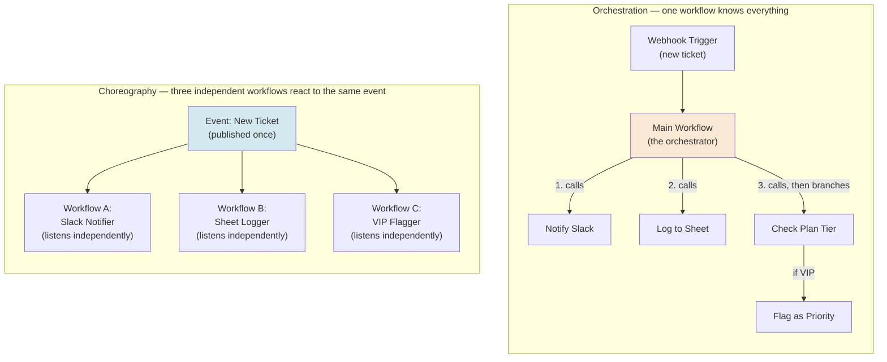
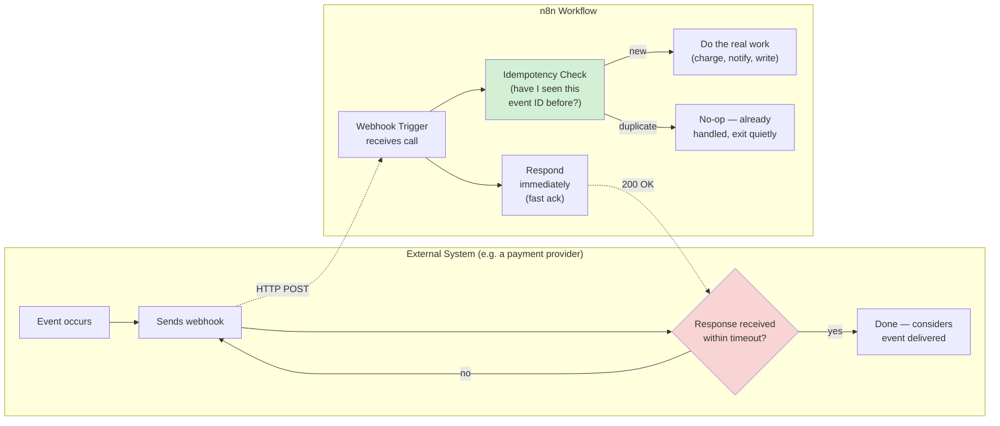
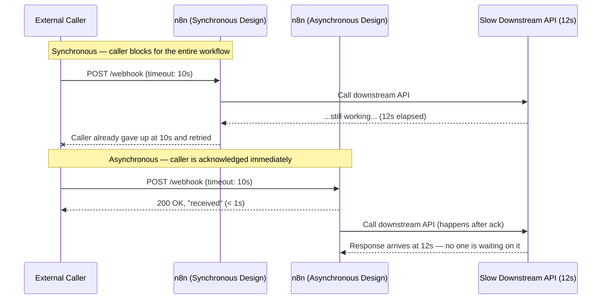
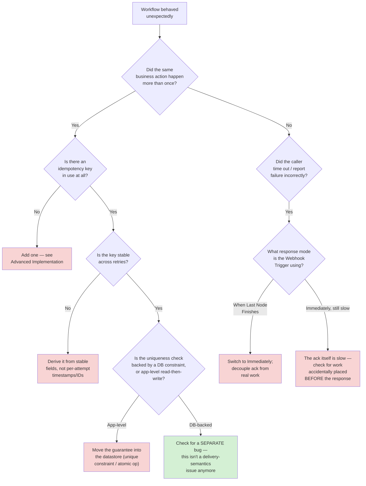
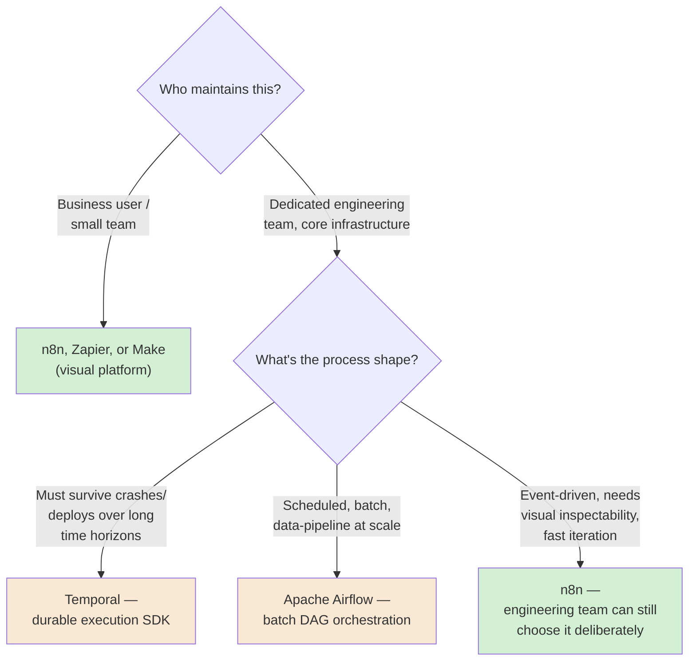

# Chapter 01 — Automation Architecture: Orchestration, Choreography, and the Trigger-Action Model

## Learning Objectives

By the end of this chapter, you will be able to:

- Explain what an automation workflow actually is, in engineering terms, and why "if this, then that" is a real architectural pattern with real failure modes — not just a marketing phrase.
- Distinguish a **trigger** from an **action**, and explain why almost every automation bug traces back to a wrong assumption about one or the other.
- Choose between **orchestration** and **choreography** for a given multi-step business process, and defend that choice with a concrete reason, not a preference.
- Explain **synchronous** versus **asynchronous** execution well enough to predict, before you build anything, whether a given trigger-action pair will block, time out, or silently duplicate work.
- Define **idempotency** precisely enough to write an idempotency check yourself, and explain why "it probably won't run twice" is not an engineering answer.
- Name the three **delivery semantics** (at-most-once, at-least-once, effectively-once) and identify which one any given trigger in n8n actually gives you by default.
- Decide, for a specific business process, whether a visual automation platform like n8n is the right tool at all — or whether Temporal or Airflow is the more honest engineering choice.
- Read and reason about n8n's current position in the automation-platform landscape (pricing model, licensing, competitors) without treating it as the only tool that exists.

## Prerequisites

- **Chapters completed:** None — this is Chapter 01 of Volume 5. However, this course assumes you completed Volumes 1–4 of the AI Engineering Handbook series: you should already be comfortable with APIs, JSON, embeddings and RAG (Volumes 1 and 3), MCP server/client engineering (Volume 2), and the reasoning-loop and bounded-autonomy discipline from Volume 4. This chapter reuses Volume 4 Chapter 01's concept of a *bounded, controlled process* and applies it to workflow execution instead of agent reasoning.
- **Tools installed:** None required to read this chapter. To follow the Beginner and Intermediate Implementation sections hands-on, you'll want either a free [n8n Cloud trial account](https://n8n.io) or a local self-hosted instance (Chapter 15 covers self-hosting in depth — for now, the Cloud trial is the fastest path). No coding tools are needed until the Advanced Implementation section, which uses n8n's built-in Code node (no separate install required).
- **No prior n8n experience is assumed.** If you have never opened n8n before, this chapter's Beginner Implementation section is written for you specifically.

## Estimated Reading Time

55–70 minutes

## Estimated Hands-on Time

2–3 hours (building the Beginner and Intermediate workflows, and starting the Mini Project)

---

## ⚡ Fast Read

> **Skim time: 5 minutes** — Read this if you're in a hurry, returning for reference, or already familiar with part of this topic.

- **What it is:** The engineering discipline behind every automation platform — how a *trigger* (something happens) gets connected to an *action* (something responds), and the architectural decisions (orchestration vs. choreography, sync vs. async, idempotent vs. not) that determine whether that connection survives contact with production.
- **Why it matters:** "It's just drag-and-drop" is true right up until a webhook fires twice, a downstream API times out, or two workflows both think they own the same step — at which point every automation platform, n8n included, is a distributed system, and distributed systems have rules.
- **Key insight:** A visual canvas doesn't remove the hard distributed-systems problems (duplicate delivery, partial failure, race conditions) — it just hides them behind a friendly interface. The engineer who understands what's hidden builds automations that survive month three; the one who doesn't builds a demo that happens to also run in production, until it doesn't.
- **What you build:** Two versions of the same Aperture Cloud process — one built as a single **orchestrated** workflow, one built as a set of independent **choreographed** workflows reacting to the same event — so you can feel the tradeoff instead of just reading about it.
- **Jump to:** [Core Concepts](#core-concepts) | [First Workflow](#beginner-implementation) | [Best Practices](#best-practices) | [Mini Project](#mini-project)

---

## Why This Topic Exists

Every automation tool — n8n, Zapier, Make, a hand-rolled cron job, an AWS Step Function — is answering the same underlying question: **when something happens, what should happen next, and who is responsible for making sure it actually does?**

That sounds trivial. It is not. The moment you connect a trigger to an action, you have built a small distributed system, whether you meant to or not. Two things now have to agree with each other across a network boundary: the thing that noticed the event, and the thing that reacts to it. Networks drop packets. Servers restart mid-request. The same webhook can arrive twice. A downstream API can take twelve seconds to respond when your caller gives up after ten. None of these are exotic edge cases — they are the default behavior of computers connected over a network, and they will happen to your very first workflow, not your five-hundredth.

Most people's first exposure to automation is a demo: "when a form is submitted, send a Slack message." It works. It works every time in the demo, because demos don't have the conditions that break distributed systems — no retries, no duplicate events, no slow downstream services, no partial failures. Production has all four, constantly. The gap between "the demo worked" and "the automation survived a bad Tuesday in production" is exactly the gap this chapter exists to close.

This matters more, not less, because n8n makes building the *demo* version so easy. A visual canvas where you drag a Webhook node onto an HTTP Request node and it just works is a genuine engineering achievement — but it is also a trap for anyone who mistakes "it ran successfully once" for "it is architecturally sound." The visual layer doesn't remove the underlying distributed-systems problem. It just moves the point where you discover it from design time to 2 a.m. on a Tuesday, three months after you shipped it, when a partner API you don't control starts timing out and your workflow starts double-charging customers.

Before you build a single workflow, you need the vocabulary and the mental models to reason about what you're actually building: a network of triggers and actions, with real delivery guarantees (or the lack of them), real coupling decisions, and real failure modes. That's this chapter. Everything after it — every pattern in Chapter 06, every reliability technique in Chapter 07, every scaling decision in Chapter 16 — is this chapter's vocabulary applied to a progressively harder problem.

## Real-World Analogy

Think about how a restaurant kitchen handles an order.

In a small diner, one cook does everything: takes the ticket, grills the burger, plates it, calls "order up." There's one person who knows the entire state of every order, in their head, at all times. If two tickets come in for the same table, the cook notices immediately — there's only one brain in the loop. This is a **single, centrally-coordinated process** — call it a diner with one cook.

Now picture a large restaurant's line: a ticket comes in, and it doesn't go to one person. It goes to a printer at the grill station, a printer at the salad station, a printer at the dessert station — simultaneously, independently. Each station cooks its part and puts it in the pass-through window when it's done, with no single person telling them "now do this, now do that." The expediter at the pass-through window watches for all the pieces of one ticket to arrive and plates them together. Nobody station knows what the *other* stations are doing — each just reacts to its own ticket printout. This is **choreography**: independent participants, each reacting to the same event, coordinating only through shared, observable signals (the ticket, the pass-through window) — not through a central conductor telling each one what to do and when.

Now picture a catering company running a wedding: there's an actual event coordinator with a clipboard, standing in the middle, who tells the caterer "start plating now," tells the band "start the first dance in five minutes," tells the photographer "get in position." Nothing happens until the coordinator says so, and the coordinator knows the full state of the event at every moment — who's done, who's behind, what happens next. This is **orchestration**: one central process that knows the full sequence, calls each participant explicitly, and waits for (or reacts to) their response before deciding what happens next.

Both restaurants get food to the table. Both are legitimate, working systems used by real, successful restaurants every day. But they fail differently. In the choreographed kitchen, if the dessert station is slow, nobody upstream even notices — the ticket just sits at the pass-through window, incomplete, until someone thinks to check. There's no central place to look for "what's wrong with table 12." In the orchestrated wedding, if the coordinator's radio dies, the entire event stalls — every participant is waiting for an instruction that isn't coming, even though each of them, individually, is perfectly capable of doing their job. Neither failure mode is worse in the abstract. They're just different, and choosing between them without understanding the difference is how you end up debugging the wrong problem at 2 a.m.

That's the whole chapter, in kitchen terms. n8n can build you either kind of restaurant. The rest of this chapter is about knowing which one you're building, on purpose, before table 12's order goes out cold.

---

## Core Concepts

### Trigger

**Technical definition:** The event, condition, or schedule that starts a workflow's execution — the thing an automation platform watches for, so that code doesn't have to be manually run.

**Plain English:** The "when" in "when this happens, do that." Nothing in a workflow runs until its trigger fires.

**Analogy:** The ticket printer in the restaurant kitchen. Nothing gets cooked until a ticket prints — the printer doesn't cook, it just reliably announces "something needs doing, and here's what."

> A trigger is the single most consequential design decision in any workflow, and it's usually made too casually. Whether a trigger is a **webhook** (something calls you the instant an event happens), a **poll** (you periodically ask "anything new?"), or a **schedule** (you run regardless of whether anything happened) determines your automation's latency, its load pattern, and — critically for this chapter — its delivery guarantees. Chapter 02 covers n8n's full trigger taxonomy in depth; this chapter needs you to understand *only* that a trigger is a distinct architectural component with its own failure modes, separate from whatever runs after it.

### Action (Node)

**Technical definition:** A single unit of work a workflow performs after (or as part of) responding to a trigger — in n8n specifically, a **node**: a discrete, configured step on the canvas (call an API, transform data, branch on a condition, wait, write to a database).

**Plain English:** The "then" in "when this happens, do that." One action is one thing the automation actually does.

**Analogy:** Each station in the restaurant line — the grill, the salad station, the dessert station. Each does one job, takes an input (the ticket), and produces an output (the plated dish, or the plated dish's ingredient).

### The Trigger-Action Model

**Technical definition:** The foundational architectural pattern underlying essentially all automation platforms: a workflow is defined as exactly one trigger, followed by a directed graph of one or more actions that execute in response. This is the pattern n8n, Zapier, Make, and even a Unix cron job + shell script all share — they differ in how richly they let you express the "graph of actions" part, not in the fundamental shape.

**Plain English:** "Watch for X, then do Y (then maybe Z, then maybe branch to A or B)." Every automation you will ever build in n8n has this shape, no matter how complex it looks.

**Analogy:** A line cook's entire job description reduces to "when a ticket prints (trigger), cook what it says (actions, in order)." A three-Michelin-star kitchen and a diner both run on this exact pattern — what differs is how many stations, how they coordinate, and how much slack the system has when something goes wrong. That difference is this entire chapter.

> It's worth being precise about what the trigger-action model does *not* guarantee: it says nothing about *whether the action definitely happens*, *whether it happens exactly once*, or *whether the trigger and the action agree on timing*. Those are exactly the gaps that orchestration/choreography, sync/async, idempotency, and delivery semantics — the rest of this chapter — exist to close.

### Workflow Execution

**Technical definition:** One complete, independent run of a workflow, from a single trigger firing through every action that ran as a result — in n8n, this is literally called an **execution**, has its own ID, its own log of what each node received and returned, and its own success/failure status, independent of any other execution of the same workflow.

**Plain English:** One "instance" of your automation actually running, start to finish, for one specific event.

**Analogy:** One specific ticket's full journey through the kitchen — from the moment it printed to the moment the plate left the pass-through window. The kitchen (the workflow *definition*) is reused for every ticket; each ticket's actual journey (the *execution*) is its own independent thing, and two tickets' journeys never share state unless something explicitly connects them.

> This distinction — workflow (the reusable definition) vs. execution (one specific run) — matters immediately once you start reasoning about duplicates. "Did this workflow run twice?" is really asking "were there two executions for what should have been one event?" — and that question is meaningless until you're precise about what "one event" even means, which is exactly where delivery semantics come in below.

### Synchronous Execution

**Technical definition:** A trigger-action interaction where the caller (whatever fired the trigger) blocks and waits for the workflow to finish, and the workflow's final output is returned directly as the response to that same call.

**Plain English:** The caller asks a question and stands there, on hold, until it gets an answer back.

**Analogy:** Ordering at a fast-food counter and waiting right there until your tray comes out. The person behind you can't be served until you're done, and if the kitchen is slow, you're both just standing there.

### Asynchronous Execution

**Technical definition:** A trigger-action interaction where the caller is acknowledged immediately (often with nothing more than "got it") and does not wait for the workflow's actual work to complete — the work happens independently, and its result (if the caller needs one at all) arrives later through a separate channel.

**Plain English:** The caller drops off a request and walks away; the actual work happens on its own time, and if there's a result, it shows up somewhere else, later.

**Analogy:** Dropping off a dry-cleaning ticket. The clerk hands you a claim ticket immediately — that's your acknowledgment — and you leave. The actual cleaning happens whenever it happens; you come back later with your ticket to collect the result. Crucially, the clerk handing you the ticket and the shirt actually being cleaned are two *separate* events, with no guarantee about how long the gap between them is.

> This is the single most common source of production incidents this book will cover, starting with this chapter's own [Production Issue](#production-issue-the-webhook-that-got-charged-twice) below: treating a slow, synchronous trigger-action pair as if it were fast and safe. A webhook caller that expects a response within 10 seconds does not care that your workflow's business logic is *correct* — if it takes 12 seconds, the caller has already decided your automation failed and may retry, whether or not it actually did.

### Orchestration

**Technical definition:** A coordination pattern in which one central process explicitly directs a sequence of steps — calling each participant, often waiting for (or branching on) its response, and holding the complete knowledge of what the overall process is supposed to do and in what order.

**Plain English:** One conductor telling every player when to come in.

**Analogy:** The wedding coordinator with the clipboard, from this chapter's opening analogy. One place to look for "what's the state of this process," and one place responsible for deciding what happens next.

### Choreography

**Technical definition:** A coordination pattern in which independent processes each react to shared events (without a central controller directing them), coordinating implicitly through those events rather than through direct instruction — no single component holds complete knowledge of the overall process.

**Plain English:** Everyone reacts to the same signal, on their own, with nobody in charge of the whole thing.

**Analogy:** The restaurant line kitchen — each station reacts to the same ticket independently, with no conductor.

> Orchestration and choreography are not "good" and "bad" — they are a genuine, recurring architectural tradeoff, and you will make this decision again in Chapter 06 (Workflow Design Patterns) for every multi-step process you build. The short version, which the rest of this chapter will justify: **orchestration gives you one place to see and control the whole process, at the cost of a single point of coordination failure. Choreography gives you independent, resilient participants, at the cost of no single place to ask "what's actually happening right now?"** Neither answer is free.

### Idempotency

**Technical definition:** A property of an operation such that performing it more than once has the exact same effect as performing it exactly once — re-running it does not change the outcome or produce additional side effects beyond the first execution.

**Plain English:** Doing it twice by accident causes no extra harm, because the second time is a no-op.

**Analogy:** Pressing an elevator call button five times because you're impatient. The elevator doesn't come five times — it comes once, because "call the elevator to this floor" is an idempotent operation. Compare that to five people independently mailing the same signed check to the same vendor: that is *not* idempotent, and the vendor's bank will happily cash all five.

> Idempotency is not a property of your intentions — it's a property you have to deliberately build into an operation, usually with an **idempotency key**: a unique identifier for "this specific logical event," checked against a record of what's already been processed, before the side-effecting action (charge a card, send an email, create a shipping label) is allowed to run again. Nothing about n8n, or any automation platform, makes an action idempotent for you by default. You will build your first real idempotency check in this chapter's [Advanced Implementation](#advanced-implementation).

### Delivery Semantics

**Technical definition:** The guarantee (or lack of one) a messaging or triggering system makes about how many times a given event will actually be delivered to a receiver. The three standard categories are:

| Semantic | Guarantee | Cost of the guarantee |
|---|---|---|
| **At-most-once** | Delivered zero or one times — never duplicated, but can be silently lost | Simplicity, at the cost of possible silent data loss |
| **At-least-once** | Delivered one or more times — never silently lost, but can be duplicated | Reliability, at the cost of requiring the receiver to handle duplicates itself |
| **Effectively-once** (often loosely called "exactly-once") | The receiver observes the effect exactly once, even though delivery underneath may be at-least-once | Requires idempotency at the receiver — this is not free from the transport layer, it's *engineered*, almost always by combining at-least-once delivery with an idempotency key |

**Plain English:** "How many times might I get told about the same thing happening, and do I have to protect myself from hearing it twice?"

**Analogy:** A doorbell that's wired correctly rings exactly once per press (roughly at-most-once, ignoring the wiring failing entirely). A friend who texts you "did you get my last text?" if you don't reply within an hour is *deliberately* choosing at-least-once behavior — they'd rather annoy you with a duplicate than risk you never getting the message. Whether that's the right choice depends entirely on what the message *was* — "dinner's at 7" surviving a duplicate is harmless; "I just wired you the money" surviving a duplicate could mean you wire it twice.

> Here's the fact that makes this chapter's Production Issue possible, and that most people building their first webhook-triggered workflow don't know: **most real-world webhook providers deliver at-least-once, not exactly-once, as a documented and deliberate design choice — specifically *because* they retry on timeout.** (Major SaaS platforms commonly document this exact retry-on-timeout behavior for their own webhooks — check the specific provider's own docs before assuming a number of retries or a timeout window, since those specifics vary by vendor and change over time.) If your workflow doesn't respond fast enough, the provider assumes failure and sends the same event again. Your workflow will see the same "event" twice, and nothing about n8n's Webhook trigger changes that fact — it's a property of the *sender's* retry policy, not your receiver. Effectively-once behavior is something *you* build, using idempotency, on top of at-least-once delivery. It never arrives for free.

---

## Architecture Diagrams

### Diagram 1 — Orchestration vs. Choreography, Structurally

Both diagrams below implement the exact same business process — Aperture Cloud's "new support ticket received" notification fan-out (notify the on-call Slack channel, log the ticket to a tracking sheet, and check if the customer is on a paid plan to flag VIP tickets). What changes is *who is in charge of knowing that all three things need to happen*.



In the orchestrated version, the main workflow's canvas *is* the documentation — anyone can open one workflow and see the entire process end to end. In the choreographed version, understanding "everything that happens when a ticket comes in" requires knowing that three *separate* workflows all listen to the same event — there is no single canvas that shows the whole picture. Both are valid; Chapter 06 goes deep on when each wins.

### Diagram 2 — Where Delivery Semantics Live in a Real n8n Trigger

This diagram makes concrete something the Core Concepts section described abstractly: an at-least-once-delivering webhook provider, and the specific point where *your* workflow has to take responsibility for idempotency, because nothing upstream will do it for you.



Notice the acknowledgment (`W2`, "Respond immediately") is drawn as happening *in parallel* with the idempotency check and real work, not before it — that separation, and why it matters, is exactly this chapter's Production Issue below.

## Flow Diagrams

### Diagram 3 — One Trigger, Two Very Different Timelines

This sequence diagram shows the same webhook call handled two ways: synchronously (the caller waits for the real work) versus asynchronously (the caller is acknowledged immediately, and the real work happens after).



The synchronous design isn't "wrong" in principle — plenty of legitimate workflows should be synchronous (an API that must return a computed value to the caller has no other option). It's wrong here specifically because the caller's timeout (10s) is shorter than the real work's duration (12s), and nobody checked that assumption before building it.

---

## Beginner Implementation

> **No-code path.** This section assumes no prior n8n experience and no coding. If you've never opened n8n, this is where you start.

**Goal:** Build Aperture Cloud's "Daily System Health Check" — a workflow that runs every morning, checks a status API, and produces a simple pass/fail report. This is a single, orchestrated workflow: one trigger, a short sequence of actions, all visible on one canvas.

**What you'll need:** An n8n Cloud trial account (or local instance) and a web browser. No credentials, API keys, or paid services required — this example intentionally uses a free, no-auth public API so you can focus entirely on the trigger-action shape, not on authentication (Chapter 04 owns that topic).

**Node by node:**

1. **Schedule Trigger.** Add a Schedule Trigger node and set it to run daily at a fixed time (e.g., 9:00 AM). This is your trigger — nothing in this workflow runs until this node fires. Notice: this trigger runs *regardless of whether anything actually happened* — it's time-based, not event-based. That distinction (schedule vs. event) is Chapter 02's focus; for now, just notice it's a real design choice, not a detail.
2. **HTTP Request node.** Connect it to the Schedule Trigger. Configure it to `GET` a public status API — for this example, `https://api.github.com/status` (GitHub's own public status endpoint, no authentication required) works well as a stand-in for "Aperture Cloud's own internal status API," which you'd point this at in a real deployment. This node is your first **action**: it does one job (fetch data) and passes its output to the next node.
3. **IF node.** Connect it to the HTTP Request node. Configure a condition that checks the response — for example, whether the returned status field equals `"good"`. This node **branches** the workflow: everything downstream of the "true" output only runs if the condition holds, and everything downstream of "false" only runs otherwise. This is where the trigger-action model stops being a straight line and becomes a graph.
4. **Set node (two of them, one per branch).** On the "true" branch, add a Set node that builds a simple message: `"✅ All systems normal as of {{ $now }}"`. On the "false" branch, add a Set node with `"⚠️ Status check failed — investigate"`. Each Set node's job is just to shape the data into the message you'd actually want to send somewhere.
5. **(Stop here for now.)** In a real deployment this would connect to a Slack or email node — but since Chapter 04 owns credentials and external connections properly, leave the two Set nodes as the workflow's end for this exercise. Run the workflow manually (there's a "Test workflow" button) and confirm you see the message you expect in the execution log.

**What you just built, in this chapter's vocabulary:** A single **orchestrated** workflow (everything visible on one canvas, one central definition of the sequence), with a **schedule trigger** (not event-driven), running entirely **synchronously** from the platform's own perspective (the Schedule Trigger doesn't have an external caller waiting on a response — there's no timeout pressure here at all, which is exactly why this is a safe first example).

---

## Intermediate Implementation

> **This section introduces real multi-pattern design.** Still no custom code required.

**Goal:** Rebuild the same underlying idea — "something happened, notify the right people, log it" — as a **choreographed** system instead of an orchestrated one, using Aperture Cloud's "new support ticket" scenario from Diagram 1. This lets you feel the orchestration/choreography tradeoff directly instead of just reading about it.

**The orchestrated version (for comparison — build this first):**

1. **Webhook Trigger** — receives a POST from Aperture Cloud's support desk system whenever a new ticket is created. Set the Response Mode to **"Immediately"** (more on why this specific setting matters in the Advanced Implementation section below).
2. **Set node** — normalize the incoming payload into a consistent shape (ticket ID, customer email, subject, plan tier).
3. **HTTP Request node** — call a (mock, for this exercise) Slack-style webhook URL to post a notification.
4. **HTTP Request node** — call a (mock) "append row" endpoint to log the ticket.
5. **IF node** — branch on plan tier; if `"VIP"`, an additional **HTTP Request node** flags the ticket as priority.

Everything above lives in one workflow. One canvas. One place to see the whole process.

**The choreographed version (build this second, as three separate workflows):**

1. Create **three independent workflows**, each with its own **Webhook Trigger**, all three registered to receive the *same* incoming ticket event (in a real system, this is typically done by having the support desk system call a single ingestion point that re-publishes to multiple listeners, or by registering multiple webhook subscriptions on the source system if it supports that — Chapter 06 covers the concrete n8n patterns for fan-out in depth).
2. **Workflow A ("Slack Notifier")**: Webhook Trigger → Set → HTTP Request (Slack). Nothing else. It doesn't know Workflow B or C exist.
3. **Workflow B ("Sheet Logger")**: Webhook Trigger → Set → HTTP Request (log). Nothing else.
4. **Workflow C ("VIP Flagger")**: Webhook Trigger → IF (plan tier) → HTTP Request (flag). Nothing else.

**What to notice, hands-on:** Open all three choreographed workflows side by side. There is no single place that shows you "everything that happens when a ticket arrives" — you have to already know all three workflows exist. Now disable Workflow C entirely (simulate it being broken or turned off). The orchestrated version would show an error in the main workflow's execution log, in one place. The choreographed version shows... nothing, anywhere, except that Workflow C's own execution history quietly stops growing. **This is choreography's real cost, and it's exactly why Chapter 17 (Observability) exists as a full chapter of its own** — a choreographed system needs deliberate, additional tooling to answer "is everything that's supposed to be listening, actually listening?", because no component in the system is naturally positioned to answer that question.

---

## Advanced Implementation

> **Engineering-depth path starts here.** This section uses n8n's Code node (JavaScript) and assumes comfort with basic programming concepts.

**Goal:** Fix the exact failure this chapter's Production Issue describes below — build a workflow that is both **fast-acknowledging** (asynchronous from the caller's perspective) and **idempotent** (safe against the at-least-once redelivery that caused the incident).

**The pattern: acknowledge first, verify second, act third.**

```javascript
// Learning example — Code node, placed immediately after the Webhook Trigger,
// BEFORE any slow downstream call.
//
// Why this exists: the Webhook Trigger node's "Respond" setting is configured
// to "Immediately" (see Advanced Implementation prose below for why), which
// means n8n has already sent a 200 OK back to the caller before this code
// even runs. This code's job is purely to compute a stable idempotency key —
// NOT to do any of the actual side-effecting work yet.

// Real webhook providers vary in what uniquely identifies "the same event" —
// some send an explicit event ID, some don't. When no explicit ID is present,
// derive a stable key from fields that are the same across redeliveries of
// the same logical event (never include a timestamp the sender regenerates
// per attempt — that would make every retry look like a new event).
const payload = $input.item.json;

const idempotencyKey =
  payload.event_id                                   // preferred: provider-supplied event ID
  ?? `${payload.ticket_id}:${payload.status}`;        // fallback: derive from stable business fields

return {
  json: {
    ...payload,
    idempotency_key: idempotencyKey,
  },
};
```

```javascript
// Learning example — Code node, placed after an HTTP Request or database node
// that checks "have I already processed this idempotency_key?"
//
// This is the check itself. In production this queries a real store (Postgres,
// Redis — see the Production example below); for learning purposes, imagine
// $json.already_processed was set by the lookup node immediately before this one.

if ($json.already_processed === true) {
  // Duplicate delivery of an event we've already handled. This is NOT an
  // error — it's the expected, healthy behavior of an at-least-once system.
  // Exit quietly; do not repeat the side-effecting action below.
  return [];  // empty output — nothing downstream of this node runs
}

return [{ json: $json }];  // new event — continue to the real work
```

```sql
-- Production example — the same idempotency check, but backed by a real,
-- shared datastore instead of an in-memory assumption. This version matters
-- because n8n in queue mode (Chapter 16) runs workflow executions across
-- MULTIPLE worker processes — an in-memory "have I seen this before" check
-- would only be checking one worker's memory, not the whole system's history.
--
-- This is NOT a Code node — it's the query configured directly in a Postgres
-- node placed earlier in the workflow, with a unique constraint on the
-- idempotency_key column. The INSERT itself is the idempotency guarantee: a
-- second attempt with the same key hits the unique constraint and returns
-- zero rows, which is how you detect "this is a duplicate" without a race
-- condition between a separate "check" step and a separate "write" step.

INSERT INTO processed_events (idempotency_key, processed_at)
VALUES ($1, now())
ON CONFLICT (idempotency_key) DO NOTHING
RETURNING idempotency_key;

-- If the query returns a row: this is genuinely new — proceed to do the real work.
-- If it returns zero rows: this idempotency_key already existed — it's a duplicate, stop here.
```

**The common mistake alongside the correct pattern:**

```javascript
// WRONG — checking idempotency in application code with a plain read-then-write,
// no database-level uniqueness constraint backing it up.
const seen = await checkIfSeen(idempotencyKey);   // read
if (!seen) {
  await markAsSeen(idempotencyKey);                // write
  await doTheRealWork();
}
// Two near-simultaneous duplicate deliveries (a real thing — retries can
// arrive milliseconds apart) can BOTH pass the read before either finishes
// the write. This "looks" idempotent in testing and fails exactly when it
// matters most: under real retry pressure.
```

```javascript
// CORRECT — the uniqueness guarantee lives in the datastore itself (a unique
// constraint, an atomic INSERT ... ON CONFLICT, or a Redis SETNX), not in
// application-level timing. See the Production example above.
```

**How to debug it when it breaks:** Open the execution list for the workflow and filter by status. A correctly-implemented idempotency check produces a *visible, expected* pattern: some executions do real work, some exit early at the duplicate-check node with no downstream nodes run. If you instead see the real work (the charge, the notification) happening more than once for what should be one logical event, check, in order: (1) is the idempotency key actually stable across retries, or does it accidentally include something that changes per attempt (a timestamp, a random ID) — the single most common root cause; (2) is the uniqueness check backed by a real datastore constraint, or just an in-memory/application-level check that races under concurrent execution.

**The production version, where it differs from the learning version:** The learning version above assumes one worker. The production version must assume **queue mode** (Chapter 16) — multiple workers, potentially processing the same duplicate delivery at genuinely the same instant — which is exactly why the production example uses a database-level unique constraint instead of a "check, then write" pattern in application code.

---

## Production Architecture

In production, this chapter's ideas show up as concrete operational decisions, not abstractions:

- **Response Mode is a production architecture decision, not a UI setting you pick and forget.** n8n's Webhook node offers four response modes — **Immediately** (acknowledge instantly, before any workflow logic runs), **When Last Node Finishes** (wait for the entire workflow, then return its output — genuinely synchronous), **Using 'Respond to Webhook' Node** (explicit control over exactly when and what to respond, from anywhere in the workflow), and a **Streaming response** mode for real-time data. Choosing "When Last Node Finishes" for a workflow with any slow downstream call is choosing synchronous coupling — sometimes correct, often the root cause of this chapter's Production Issue.
- **Queue mode changes what "idempotency check" even means operationally.** A self-hosted n8n instance running in queue mode (covered fully in Chapter 16) distributes executions across multiple worker processes. Any idempotency check that isn't backed by a shared, atomic datastore operation is not actually safe in that deployment shape, even if it passed every test on a single-instance setup.
- **Choreographed systems need a deliberate "is everyone still listening?" mechanism.** As the Intermediate Implementation section demonstrated hands-on, a choreographed workflow that silently stops running produces no error anywhere central. Production choreographed systems pair with the observability discipline of Chapter 17 (dashboards tracking execution counts *per listener*, not just "did the system have errors") specifically because there's no other way to catch this failure mode.
- **Orchestrated systems concentrate operational risk in one place — which is a feature, not just a bug.** A single orchestrator workflow going down takes the whole process down with it, but it also means there's exactly one workflow's health to monitor for that entire business process — a real, legitimate operational simplicity tradeoff against choreography's distributed resilience.

---

## Best Practices

1. **Decide sync vs. async before you build, not after a timeout in production.** Ask explicitly: does the caller need this workflow's *result* back in the same call, or just an acknowledgment that it was received? If it's the latter, use "Immediately" response mode and do the real work after acknowledging.
2. **Treat every externally-triggered workflow as at-least-once by default**, even if you haven't observed a duplicate yet. The absence of an observed duplicate in testing is not evidence that duplicates can't happen — it's evidence that you haven't yet hit the retry condition that causes them.
3. **Give every side-effecting action an idempotency key**, derived from stable fields of the triggering event, never from anything that changes across retries of the same logical event (timestamps generated per-attempt, random request IDs the sender regenerates).
4. **Back idempotency checks with a real datastore constraint**, not application-level read-then-write logic, the moment more than one worker could plausibly process events concurrently — which in a queue-mode deployment is essentially always.
5. **Choose orchestration when you need one place to see and reason about a process's full state**, and choose choreography when you need independent components that keep working even if one participant is down — and write down *which one you chose and why* somewhere a future engineer (including future you) will find it. "It grew this way" is not a decision; it's the absence of one.
6. **Never let a workflow's business logic run before an idempotency check, if the check is cheap.** Order matters: check first, then act — not act, then hope duplicates don't cause harm.
7. **Log the idempotency key itself into every execution**, not just into the datastore doing the deduplication. When you're debugging "why did this run twice," you need to correlate n8n's execution log with the datastore's record, and that only works if the same key appears in both places.

---

## Security Considerations

- **An unauthenticated webhook is a publicly-callable trigger for your business logic.** n8n's Webhook node supports None, Basic Auth, Header Auth, and JWT authentication — and **None is a real, selectable option, not a placeholder** — meaning it is entirely possible to ship a production workflow whose trigger anyone on the internet can invoke, simply by knowing (or guessing) the URL. This chapter doesn't own webhook authentication in depth (Chapter 04 does), but the architectural point belongs here: an unauthenticated trigger has an unbounded, adversarial "caller," which changes your idempotency and validation requirements — you can no longer assume the payload shape is well-formed just because it came from a trusted partner's retry, because it might not have.
- **Idempotency checks are also, incidentally, a defense against a specific abuse pattern:** an attacker who discovers your webhook URL and replays a captured legitimate payload repeatedly, hoping to trigger the side effect (a discount code redemption, a notification, a state change) multiple times. A correctly-implemented idempotency key defends against this even though it wasn't designed as a security control — worth knowing, because it means removing "unnecessary" idempotency checks for performance reasons can quietly remove a security boundary too.
- **Orchestration concentrates credentials risk; choreography distributes it.** One orchestrator workflow that calls Slack, a database, and a payment API needs credentials for all three in one place — a bigger single blast radius if that workflow (or the account that owns it) is compromised. Three choreographed workflows each need only the one credential relevant to their job — smaller blast radius per component, but three places to secure and audit instead of one. Chapter 19 covers this tradeoff at full depth.

## Cost Considerations

n8n's pricing model is **execution-based**, not per-task like some competitors — a 20-step workflow that runs once costs the same as a 2-step workflow that runs once, because you're charged per *workflow execution*, not per action inside it. That's a real, current, teachable architectural differentiator worth understanding before you design workflows, because it changes the cost-optimization instinct: minimizing the number of *nodes* in a workflow doesn't reduce your bill the way minimizing the number of *executions* does.

> **Currency Note:** As displayed on `n8n.io/pricing` (verified July 2026), current Cloud tiers are listed in EUR — Starter €20/mo, Pro €50/mo, self-hosted Business €667/mo (annual billing) — with Enterprise custom-priced. n8n geo-prices by region, so your local currency and exact figure may differ; always check the current page before making a purchasing decision, not this book. A Startup Program offering roughly 50% off the Business plan is confirmed current for companies under 20 employees. Self-hosted **Community Edition is free with unlimited executions** — the cost tradeoff there is entirely your own infrastructure (Chapter 15) and operational time, not a license fee. One precise nuance worth knowing before you call n8n "open source" in a conversation with a licensing-conscious engineer: n8n itself doesn't use that term for its source-available code. It licenses under the **Sustainable Use License** (the "fair-code" model) — you can read, modify, and self-host it freely for internal business use, but the license restricts commercial resale of the source itself, which is why, by the Open Source Initiative's own definition, n8n does not qualify as OSI open source. Source-available and fair-code, not OSI open source — a distinction worth having straight before it comes up in a procurement or compliance conversation.

**Free vs. paid, concretely for this chapter's concepts:**

| Approach | Cost | What you give up |
|---|---|---|
| Self-hosted Community Edition, single instance | Infrastructure cost only (a small VM is often enough for low volume) | No queue mode, no horizontal scaling, no built-in high availability — acceptable for the low-stakes, low-volume Module 1–2 scenarios this book starts with, not for real production load |
| n8n Cloud (Starter/Pro) | Monthly subscription, execution-based | Simplicity and managed infrastructure, in exchange for the recurring cost and n8n's own execution limits per tier |
| Self-hosted Business/Enterprise, queue mode | Subscription + your own worker infrastructure cost | Full production reliability (the queue-mode idempotency requirements described in this chapter's Advanced Implementation) — this is genuinely where production-grade automation lives, and it costs meaningfully more than a hobby setup, in both license and infrastructure terms |

**At fleet scale** (many workflows, many teams, covered fully in Chapter 16 and Chapter 18): the execution-based model means cost becomes a governance question as much as a technical one — a single misconfigured trigger firing far more often than intended (a poorly-bounded polling interval, a retry storm from a non-idempotent downstream failure) directly and immediately increases your bill, not just your error rate. This is one more reason the idempotency discipline in this chapter isn't optional cleanliness — a non-idempotent workflow that starts retrying under failure can turn into a cost incident, not just a correctness one.

---

## Common Mistakes

**Mistake 1 — Assuming "it only ran once in testing" means it's safe.**

```text
WRONG assumption: "I tested this webhook workflow ten times and it only
ever ran once per test, so duplicate delivery isn't something I need to
handle."

RIGHT understanding: Your testing never exercised the actual retry
condition (a slow response, a network blip) that causes real providers
to redeliver. Absence of observed duplicates in a clean test environment
is not evidence of at-most-once delivery — it's evidence you haven't hit
the failure condition yet.
```

**Mistake 2 — Choosing "When Last Node Finishes" response mode out of habit, without checking downstream latency.**

```text
WRONG: Webhook Trigger → (several slow API calls) → response returned only
after everything finishes, with no regard for the caller's own timeout.

RIGHT: Measure or bound the worst-case latency of everything between the
trigger and the response. If it can plausibly exceed the caller's timeout,
switch to "Immediately" and decouple the real work from the acknowledgment.
```

**Mistake 3 — Building a choreographed system without any way to see the whole process.**

```text
WRONG: Three independent workflows, each reacting to the same event, with
no shared naming convention, no shared logging destination, no single
dashboard — so "what happens when a ticket comes in?" can only be answered
by manually opening three separate workflow canvases and hoping none of
them silently changed.

RIGHT: Choreography is a legitimate choice, but it comes with an
obligation: a shared naming/tagging convention across the independent
workflows, and (per Chapter 17) centralized visibility into whether each
one is still actually running, not just whether n8n as a whole is healthy.
```

**Mistake 4 — Deriving an idempotency key from a field that changes per delivery attempt.**

```text
WRONG: idempotencyKey = `${payload.ticket_id}:${payload.received_at}`
// received_at is regenerated by the sender on every retry attempt —
// this "key" is different every time, defeating the entire point.

RIGHT: idempotencyKey = payload.event_id ?? `${payload.ticket_id}:${payload.status}`
// derived from fields that are identical across redeliveries of the SAME
// logical event.
```

---

## Debugging Guide



| Symptom | Likely cause | Where to look |
|---|---|---|
| Same side effect (email, charge, log entry) happens 2+ times for one real-world event | Missing or unstable idempotency key, or app-level (racy) duplicate check | Execution list — filter for multiple executions with the same business identifier in their input payload |
| External caller reports "failed" or retries, but the workflow's execution log shows success | Response mode mismatched to actual latency (synchronous design, slow downstream) | Webhook Trigger node's Response setting; measure elapsed time to the response vs. the caller's documented timeout |
| A choreographed workflow silently stops appearing in execution history | Trigger source (webhook subscription, polling credential) broken or workflow deactivated, with no central alert | Per-workflow execution count over time (Chapter 17) — there's no single "system health" view that catches this by default |
| Orchestrated workflow fails entirely partway through | A single downstream call failed with no error handling, and the whole orchestrator halted | The specific node's execution data in the failed run — this is Chapter 07's territory (retries, error branches) in full |

## Performance Optimisation

> The specific numbers below are **illustrative measurements from this chapter's own Aperture Cloud scenario**, not a published industry benchmark — treat them as a demonstration of the *mechanism*, not a number to cite elsewhere.

In an illustrative before/after for the Production Issue scenario below: the original synchronous design had a median response time of ~11.8 seconds (dominated entirely by the downstream shipping-label API call happening *before* any response was sent), against the caller's documented 10-second timeout — meaning roughly half of all real calls were already at risk of a false-timeout retry even before accounting for the downstream API's own variance. After switching to "Immediately" response mode and moving the slow call after acknowledgment, response time to the caller dropped to under 200ms (essentially just n8n's own dispatch overhead), and the downstream work's actual duration became irrelevant to the caller's experience entirely — it could take 2 seconds or 20, and the caller would never know or care, because it was no longer waiting.

The general, transferable lesson: **the fastest way to improve a workflow's perceived performance is often not making anything faster — it's decoupling what the caller waits for from what actually takes time.** This is the same principle behind async job queues in traditional backend engineering, applied to a visual automation platform.

---

## Technology Comparison — The Current Automation Platform Landscape

> **Currency Note:** Figures below were verified directly against each platform's current documentation/pricing pages in July 2026. Pricing models and integration counts change; verify before citing these numbers in a business decision.

| Platform | Coordination model | Pricing model (confirmed current) | Scale signal | Best fit |
|---|---|---|---|---|
| **n8n** | Both orchestration and choreography, visually, on one canvas or across workflows | Execution-based; Cloud Starter €20/mo, Pro €50/mo, self-hosted Business €667/mo (EUR, geo-priced); free self-hosted Community Edition | 196k+ GitHub stars, v2.29.10 (July 2026), weekly-ish release cadence | Teams that want visual, inspectable automation with real code-node escape hatches when needed |
| **Zapier** | Primarily orchestration (linear "Zaps") | Per-task billing; Free 100 tasks/mo; Professional $19.99/mo (750 tasks); overage at 1.25x plan rate | 9,000+ integrations | Non-technical users who want the most guided, linear setup experience, and don't need complex branching |
| **Make** | Orchestration with visual branching (more expressive than Zapier's linear model) | Credit-based (switched from "operations" terminology in Aug 2025); Free 1,000 credits/mo; Core $9/mo; Pro $16/mo; Teams $29/mo | 3,000+ integrations | Teams who've outgrown Zapier's linear model but still want a visual-first, non-code-first tool |
| **Windmill** | Code-first; supports both orchestration and choreography patterns, but expressed as code, not canvas | Open-source (AGPLv3); Windmill Labs sells managed instances/support on top | Self-describes as "13x faster than Airflow" (own benchmark); scripts in Python, TypeScript, Go, Bash, SQL, and more | Developer teams who want automation-as-code with a UI generated from code, not automation-as-canvas |
| **Temporal** | Orchestration, expressed entirely as durable code (no visual canvas) | SDK free/open-source; Temporal Cloud is the managed offering | 7 SDKs (Go, Java, TypeScript, Python, .NET, PHP, Ruby) | Processes that must survive infrastructure failure over long horizons (seconds to months) and are maintained entirely by engineers writing code |
| **Apache Airflow** | Orchestration, expressed as Python-defined DAGs, batch-oriented | Free/open-source (Apache Software Foundation project) | Current stable v3.3.0; ~39,000+ GitHub stars; 1,000+ community operators | Scheduled, batch data-pipeline orchestration at data-engineering scale — not real-time/event-driven work |

## Decision Framework — Orchestration, Choreography, or a Different Tool Entirely

Two questions, asked in order, do most of the real work:

**Question 1 — Who will maintain this, an engineer or a business user?** This is the recurring heuristic this entire course keeps returning to. If the answer is "a business user, or a small team without dedicated engineering time," a visual platform (n8n, Zapier, Make) is very likely correct regardless of the orchestration/choreography question below — Temporal and Airflow assume engineering ownership as a baseline, not an option. If the answer is "a dedicated engineering team, and this process is core infrastructure," Temporal or Airflow become genuinely competitive with n8n, not just theoretically available.

**Question 2 — Does this process need to survive infrastructure failure over a long horizon, is it a scheduled batch job, or is it triggered by discrete events?**



Then, **once you've picked a platform, the orchestration-vs-choreography question is independent of which platform you chose** — n8n can build either shape (Diagram 1 above proved this hands-on), and so can Temporal or Airflow. Use orchestration by default (it's easier to reason about and debug), and reach for choreography deliberately when you specifically need independent components that keep working even when one participant is unavailable — not because choreography sounds more "modern" or "scalable." Scalability is a property of your infrastructure and delivery semantics, not of whether you drew one box or three.

---

## Real Client Scenario — Aperture Cloud's Ticket Notification Redesign

Aperture Cloud's support team originally had one engineer build the ticket-notification logic as a single orchestrated workflow (Slack notify → sheet log → VIP flag, all in sequence, in one workflow) during a slow week, as a favor. It worked fine for four months. Then the VIP-flagging step started occasionally calling a billing API that had begun taking 8–15 seconds to respond during Aperture Cloud's own peak hours — and because the whole workflow was one synchronous chain, a slow VIP check now delayed the Slack notification too, sometimes past the point where support agents had already found the ticket manually through the dashboard, making the "notification" pointless and, worse, occasionally arriving *after* the agent had already replied, confusing everyone about whether it was a new ticket or a system error.

The fix, applied using exactly this chapter's vocabulary: the team split the single orchestrated workflow into a **choreographed** design (Diagram 1's second version) — three independent workflows all triggered by the same ticket-created event, so a slow VIP check no longer had any effect on how fast the Slack notification fired. They paired this with a shared tagging convention (`ticket-notify-*`) across all three workflow names specifically so a new engineer could find all three by searching, addressing this chapter's Common Mistake 3 before it became a real incident. This is a genuinely low-stakes scenario — the worst-case failure is a late or missing internal notification, not a customer-facing incident — consistent with this course's Module 1–2 discipline of using safe, reversible examples before AI agents and real external consequences enter the picture from Chapter 09 onward.

---

### Production Issue: The Webhook That Got Charged Twice

**Symptoms**

Aperture Cloud's shipping-label workflow, triggered by a webhook from their e-commerce platform whenever an order was marked "ready to ship," began generating **two shipping labels — and two label charges — for roughly 4% of orders**, starting the week the shipping carrier's API began running slower than usual. Support started receiving customer complaints about duplicate tracking numbers. The e-commerce platform's own webhook delivery log showed, for every affected order, **two delivery attempts, seconds apart**, both marked "delivered successfully."

**Root Cause**

The workflow used the Webhook Trigger's **"When Last Node Finishes"** response mode — a fully synchronous design — and its final node was an HTTP Request call to the shipping carrier's label-generation API, which had a typical response time around 4 seconds but, under the carrier's own periodic load spikes, occasionally took 11–12 seconds. The e-commerce platform's webhook sender had a **documented 10-second timeout**, after which it considered the delivery failed and automatically retried once. When the label API happened to be slow, the e-commerce platform's timeout fired *before* n8n's workflow finished and returned a response — even though the workflow was, from n8n's own perspective, still running successfully. The platform retried, n8n received a second, functionally identical webhook call, and — because the workflow had no idempotency check anywhere — it ran the entire label-generation logic again, producing a second real label and a second real charge.

**How to Diagnose It**

1. Compare the e-commerce platform's webhook delivery log (attempt count and timestamps per order) against n8n's execution list for the same workflow, filtered by the order ID in the payload — look specifically for two executions with the same order ID, seconds apart.
2. Check the elapsed time of the *slower* of the two executions, end to end, against the sending platform's documented timeout (available in their webhook configuration docs) — if the execution's total duration is close to or past that timeout, this is very likely a retry-driven duplicate, not two genuinely separate events.
3. Confirm the Webhook Trigger node's Response setting — "When Last Node Finishes" combined with any slow downstream node in the chain is the structural precondition for this failure class.

**How to Fix It**

```text
BEFORE:
Webhook Trigger (Response: "When Last Node Finishes")
  → Validate payload
  → Call shipping carrier API (4-12s, variable)
  → [response returned here, sometimes after the caller's 10s timeout]

AFTER:
Webhook Trigger (Response: "Immediately")
  → Code node: compute idempotency_key from order_id
  → Postgres node: INSERT ... ON CONFLICT (idempotency_key) DO NOTHING
      → conflict (duplicate): stop here, no-op
      → no conflict (new): continue
  → Call shipping carrier API (now happens fully decoupled from the
    caller's timeout — the caller already got its 200 OK immediately)
```

The response mode change alone stops the *caller* from ever seeing a false timeout. The idempotency check is what makes the fix actually safe — without it, switching to "Immediately" would only hide the symptom (the caller stops complaining) while the underlying double-execution risk (from any other cause of redelivery — a network blip, a manual resend by a support engineer) would remain.

**How to Prevent It in Future**

Adopt, as a standing team rule, the pairing this chapter's Best Practices section states explicitly: **any workflow triggered by an external webhook gets "Immediately" response mode by default unless there's a specific, documented reason it must be synchronous, and gets an idempotency check on any node that has a real-world side effect (charges, label creation, notifications), full stop — not as an optional hardening step added after an incident.** Aperture Cloud's team additionally added a lightweight architecture-review checklist item — "does this workflow's slowest realistic path exceed the calling system's documented timeout?" — to their pre-launch checklist for any new webhook-triggered workflow, specifically to catch this class of problem at design time instead of in production.

---

## Exercises

1. **(15 min) Identify the trigger and the actions.** Pick any automation you already use in your daily life (a phone alarm, an email filter, a smart-home rule). Write one sentence identifying its trigger, and a bulleted list of every distinct action that follows.
2. **(30 min) Classify three real systems.** For each of the following, decide whether it's better described as orchestration or choreography, and justify your answer in 2–3 sentences: (a) a company's CI/CD pipeline where one controller script runs build → test → deploy in sequence; (b) a set of independent microservices that each subscribe to a shared "order placed" event topic; (c) the Beginner Implementation workflow you built in this chapter.
3. **(45 min) Build the Beginner Implementation, then break it on purpose.** After building the Daily System Health Check workflow, temporarily point the HTTP Request node at a URL that doesn't exist, and observe what happens in the execution log. Write down, precisely, what error n8n shows you and where in the log you found it.
4. **(60–90 min) Build both versions of the Intermediate Implementation.** Build the orchestrated and choreographed versions of the ticket-notification scenario. Disable one downstream piece in each (one node in the orchestrated version; one entire workflow in the choreographed version) and document, concretely, how each failure is visible (or isn't) from the main canvas.
5. **(90 min) Implement and test a real idempotency check.** Using the Advanced Implementation section's pattern, build a workflow with a Webhook Trigger, a Code node computing an idempotency key, and a mechanism (even a simple in-memory Set-based check for this exercise, explicitly noting why it wouldn't be production-safe per this chapter) that skips duplicate processing. Send the same payload to the webhook twice manually and confirm the second call is a no-op.

## Quiz

**1. What is the key difference between a "workflow" and a "workflow execution" in n8n's terms?**
> A workflow is the reusable definition (the canvas, the nodes, the connections); an execution is one specific, independent run of that definition, triggered by one specific event, with its own ID and log.

**2. Why does at-least-once delivery exist at all — why don't providers just guarantee exactly-once?**
> Because guaranteeing true exactly-once delivery across an unreliable network is not possible without cooperation from the receiver (the network itself can't distinguish "the receiver never got it" from "the receiver got it but the acknowledgment was lost"). Providers choose at-least-once (deliver again if unsure) because silently losing an event is usually worse than occasionally duplicating one — but that shifts the responsibility for handling duplicates onto the receiver.

**3. A workflow's HTTP Request node calls a downstream API that usually responds in 2 seconds but occasionally takes 15. The webhook sender's timeout is 10 seconds. What response mode change addresses this, and why doesn't it fully solve the underlying risk by itself?**
> Switch the Webhook Trigger's Response setting from "When Last Node Finishes" to "Immediately," so the caller is acknowledged before the slow downstream call happens, removing the false-timeout risk. It doesn't fully solve the risk by itself because other causes of redelivery (manual resends, network issues) can still occur — an idempotency check is still needed to make duplicate execution actually harmless.

**4. Give an example of an operation that is naturally idempotent, and one that is not, without any special engineering.**
> Naturally idempotent: setting a field to a fixed value (`status = "shipped"` — running it twice leaves the same end state). Not naturally idempotent: incrementing a counter (`count = count + 1` — running it twice produces a different result than running it once), or any "create a new X" operation (creating a shipping label, sending an email) without a deduplication check.

**5. In the orchestration-vs-choreography framing, which pattern gives you one place to see the full state of a process, and which gives you independent components that keep working if one participant is down?**
> Orchestration gives you one central place (the orchestrator) that knows and shows the full process state. Choreography gives you independently-resilient components, at the cost of no single place showing the whole picture.

**6. Why is "it hasn't duplicated in testing" not sufficient evidence that a workflow handles delivery semantics correctly?**
> Because duplicates are typically caused by real-world failure conditions (slow responses, timeouts, network issues) that a clean test environment usually doesn't reproduce. Absence of an observed duplicate under ideal conditions says nothing about behavior under the retry conditions that actually occur in production.

**7. What does n8n's execution-based pricing model mean for how you should think about workflow cost, compared to a per-task model like Zapier's?**
> Under execution-based pricing, the number of nodes inside one execution doesn't directly affect cost — what matters is the number of executions. This shifts the cost-optimization instinct away from "minimize steps per workflow" and toward "minimize unnecessary or duplicate executions" (which is one more reason uncontrolled retries from a non-idempotent design are a cost problem, not just a correctness one).

**8. Name the four current Webhook Trigger response modes in n8n.**
> Immediately; When Last Node Finishes; Using 'Respond to Webhook' Node; and Streaming response.

**9. What's the practical difference between choosing Temporal versus choosing n8n for a given automation process, independent of any pricing consideration?**
> Temporal is a code-first durable execution SDK, appropriate when a process must survive infrastructure failure over a long time horizon and is maintained entirely by an engineering team writing and deploying code. n8n offers a visual canvas usable by both engineers and non-technical business users, with a code-node escape hatch, and is generally a better fit when visual inspectability, faster iteration by non-engineers, or managed infrastructure matters more than raw durable-execution guarantees.

**10. Why is "the datastore backing the idempotency check" specifically important once a system runs in queue mode with multiple workers?**
> Because multiple workers can process near-simultaneous duplicate deliveries genuinely concurrently. An application-level read-then-write idempotency check can race (both workers pass the "have I seen this?" read before either finishes the write), while a database-level unique constraint or atomic operation (like `INSERT ... ON CONFLICT DO NOTHING`) makes the uniqueness guarantee atomic regardless of how many workers are running concurrently.

## Mini Project

**Aperture Cloud's Daily System Health Check, hardened (2–3 hours)**

Extend the Beginner Implementation workflow into something closer to a real, useful internal tool.

**Requirements:**
- [ ] Schedule Trigger runs daily, plus a **Manual Trigger** wired in parallel so the workflow can be tested on demand without waiting for the schedule.
- [ ] HTTP Request node checks at least **two** different public status endpoints (simulating checking multiple internal Aperture Cloud services), not just one.
- [ ] An IF or Switch node correctly branches based on the combined result of both checks (both healthy / one down / both down — at least three distinct outcomes).
- [ ] Each outcome produces a distinctly worded message via a Set node (not just a generic "something's wrong").
- [ ] The workflow's execution history is used to answer, in a short written note: "if this workflow itself failed to run on a given day, how would anyone know?" (You don't need to build the answer yet — Chapter 07 covers Error Workflows — but you must be able to articulate the current gap.)
- [ ] A one-paragraph written note explaining whether this workflow, as designed, is orchestrated or choreographed, and why that was the right (or at least reasonable) choice for this specific use case.

## Production Project

**Aperture Cloud's Order Confirmation System — Orchestrated vs. Choreographed, Built Both Ways (1–2 days)**

Design and build a realistic, multi-step "order confirmed" process for a hypothetical Aperture Cloud e-commerce arm: on receiving an order-confirmed webhook, the system must (1) send a confirmation notification, (2) log the order to a tracking system, (3) check inventory levels and flag low-stock items, and (4) — the one deliberately "slow" step — call a (mocked) fulfillment-partner API that takes a randomly variable 3–12 seconds to respond.

**Requirements:**
- [ ] Build the process **twice**: once as a single orchestrated workflow, once as a choreographed set of independent workflows sharing the same trigger event — both must be fully functional, not sketches.
- [ ] The Webhook Trigger's response mode must be deliberately chosen and documented (in a comment or README) with a justification tied to this chapter's sync/async vocabulary — not left at the default.
- [ ] Every side-effecting action (the notification, the log write, the fulfillment-partner call) must have a working idempotency check, backed by a real uniqueness mechanism (a database unique constraint is acceptable; an in-memory Set is not, and your write-up must explain why not, per this chapter's Advanced Implementation).
- [ ] Manually simulate a duplicate webhook delivery (send the same payload twice) against both versions, and produce evidence (execution logs, screenshots, or exported execution data) that no action ran twice in either version.
- [ ] A written comparison (300–500 words) covering: which version was easier to debug when you deliberately broke one component, which version was easier to build initially, and a final recommendation for which you'd actually deploy for Aperture Cloud's real order-confirmation process, with reasoning grounded in this chapter's Decision Framework.
- [ ] At least one measured (not estimated) timing comparison: the caller-facing response time of the "before" (synchronous, no decoupling) design versus the "after" (decoupled, idempotent) design, using n8n's own execution duration data.

## Key Takeaways

- Every automation platform, n8n included, is fundamentally a trigger-action system — and that system is a distributed system the moment a network boundary is involved, with all the failure modes that implies.
- A trigger and an action are architecturally distinct components with independent failure modes; conflating them is how "it worked in the demo" bugs get shipped.
- Orchestration and choreography are both legitimate, real architectural choices — the decision should be deliberate and documented, not accidental.
- Synchronous execution couples the caller's experience to your workflow's actual latency; asynchronous execution decouples them — and most webhook-triggered production incidents in this book's own case study trace back to that coupling being unintentional.
- Idempotency is engineered, not assumed. Nothing about n8n or any automation platform makes an operation safe to repeat by default.
- Real-world webhook providers overwhelmingly deliver at-least-once, specifically because they retry on timeout — meaning your workflow WILL eventually see duplicate deliveries of the same logical event, whether or not you've observed it yet.
- The response mode you choose on a Webhook Trigger (Immediately vs. When Last Node Finishes vs. Respond to Webhook Node vs. Streaming) is a genuine architecture decision with real production consequences, not a cosmetic setting.
- Idempotency checks must be backed by atomic, datastore-level guarantees in any deployment where more than one worker could process events concurrently — an application-level read-then-write check is not sufficient once queue mode is in play.
- n8n's execution-based pricing model rewards controlling the number of executions, not the number of nodes per workflow — which ties directly back to why uncontrolled duplicate executions are a cost problem, not just a correctness one.
- Choosing n8n at all is itself a decision: the recurring "engineer vs. business user" heuristic, plus the process's durability/batch/event-driven shape, should drive whether you reach for n8n, Temporal, or Airflow — not habit or familiarity.

## Chapter Summary

| Concept | Key Takeaway |
|---|---|
| Trigger-Action Model | Every workflow is one trigger plus a graph of actions — the universal shape underlying all automation platforms |
| Orchestration | One central process directs everything; easiest to reason about, single point of coordination failure |
| Choreography | Independent components react to shared events; resilient, but no single place shows the whole process |
| Synchronous execution | Caller waits for the full result — couples caller experience to your workflow's actual latency |
| Asynchronous execution | Caller is acknowledged immediately; real work happens decoupled from that acknowledgment |
| Idempotency | An operation is safe to repeat only if you deliberately engineer it to be — never assumed |
| Delivery semantics | Real-world webhook providers are typically at-least-once; effectively-once is built by you, on top, via idempotency |
| Response Mode (n8n specific) | Immediately / When Last Node Finishes / Respond to Webhook Node / Streaming — a real architecture decision |
| Decision Framework | "Engineer or business user?" plus "durable/batch/event-driven?" together determine n8n vs. Temporal vs. Airflow |

## Resources

- [n8n official documentation](https://docs.n8n.io) — the primary source for all current node behavior, including the Webhook node's response modes referenced throughout this chapter
- [n8n GitHub repository](https://github.com/n8n-io/n8n) — release notes, current version, and star history
- [n8n Sustainable Use License](https://docs.n8n.io/sustainable-use-license) — the current licensing terms referenced in this chapter's Technology Comparison
- [n8n pricing](https://n8n.io/pricing) — current Cloud and self-hosted pricing tiers (geo-priced; verify your local figure)
- [Temporal documentation](https://docs.temporal.io) — durable execution concepts referenced in this chapter's Decision Framework
- [Apache Airflow documentation](https://airflow.apache.org/docs/) — current stable version and DAG orchestration model
- [Windmill documentation](https://www.windmill.dev/docs) — code-first automation platform referenced in Technology Comparison
- Pat Helland, "Idempotence Is Not a Medical Condition" (ACM Queue) — a widely-cited, foundational explanation of idempotency in distributed systems, useful further reading beyond this chapter's treatment
- Volume 4, Chapter 01 (this series) — "bounded reasoning loops," the direct conceptual ancestor of this chapter's "bounded, idempotent workflow execution" framing

## Glossary Terms Introduced

| Term | One-line definition |
|---|---|
| Trigger | The event, condition, or schedule that starts a workflow's execution |
| Action / Node | A single, discrete unit of work a workflow performs |
| Trigger-Action Model | The foundational pattern: one trigger, followed by a graph of actions |
| Workflow Execution | One complete, independent run of a workflow, with its own ID and log |
| Synchronous Execution | The caller blocks and waits for the workflow's full result |
| Asynchronous Execution | The caller is acknowledged immediately; real work happens independently |
| Orchestration | One central process explicitly directs a sequence of steps |
| Choreography | Independent processes react to shared events, with no central controller |
| Idempotency | An operation that has the same effect whether run once or multiple times |
| Delivery Semantics | The guarantee (at-most-once / at-least-once / effectively-once) about how many times an event is delivered |
| Idempotency Key | A stable, unique identifier for one logical event, used to detect and skip duplicates |
| Response Mode | The n8n Webhook Trigger setting controlling when and what is returned to the caller |

## See Also

| Topic | Related Chapter | Why |
|---|---|---|
| Vol 4 Ch 01 — Agent Architecture Deep Dive | This volume's own predecessor chapter | Bounded reasoning loops have a direct parallel in this chapter's bounded, idempotent workflow execution — same discipline, different surface |
| Event-Driven Thinking and n8n's Trigger Model | Chapter 02 | Goes deep on the trigger side of the trigger-action model this chapter introduced — the full trigger taxonomy, polling mechanics, and event ordering |
| Workflow Design Patterns | Chapter 06 | Names and formalizes concrete orchestration and choreography patterns (fan-out/fan-in, saga, pipeline) beyond this chapter's introductory framing |
| Reliability and Error Recovery | Chapter 07 | Builds directly on this chapter's idempotency and delivery-semantics vocabulary to cover retry/backoff, circuit breakers, and dead-letter handling |
| Scaling n8n in Production | Chapter 16 | Covers queue mode in full depth — the deployment shape that makes this chapter's "datastore-backed idempotency, not application-level" requirement non-negotiable |
| Observability — Knowing When Automation Breaks | Chapter 17 | Directly addresses this chapter's choreography cost ("no single place shows the whole picture") with concrete dashboarding and alerting patterns |

## Preparation for Next Chapter

**Technical checklist:**
- [ ] You have a working n8n Cloud trial account or local instance you can log into.
- [ ] You've successfully built and manually run the Beginner Implementation workflow (Daily System Health Check) at least once.
- [ ] You can locate the execution list/history for any workflow and read a single execution's per-node input/output data.

**Conceptual check** — before moving on, you should be able to answer, without looking back at this chapter:
- In your own words, what's the difference between orchestration and choreography, and what does each cost you?
- Why does "it hasn't duplicated yet" not prove a workflow is safe against duplicate delivery?
- What's the difference between a workflow and an execution?

**Optional challenge:** Before starting Chapter 02, try to name — from memory, without checking n8n's documentation — every trigger type you'd guess n8n supports (webhook, schedule, and what else?). Chapter 02 opens with n8n's actual, complete, current trigger taxonomy — see how close your guess gets, and pay attention to which ones surprise you.

---

> **Currency Note:** This chapter's n8n-specific facts (version v2.29.10, ~196k GitHub stars, EUR pricing figures, the four Webhook response modes, current competitor pricing/integration counts) were verified against official sources in July 2026. n8n's release cadence and the broader automation-platform landscape change quickly — always confirm current specifics against `docs.n8n.io` and each competitor's own current documentation before making a production or purchasing decision based on this chapter.
