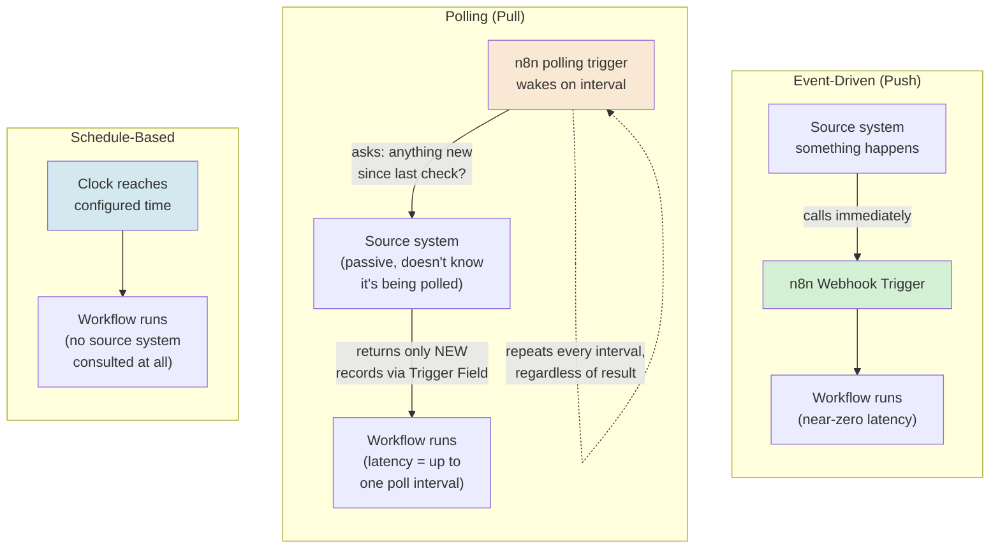
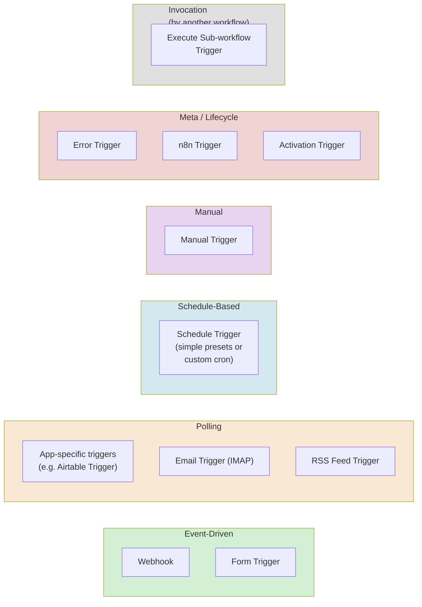
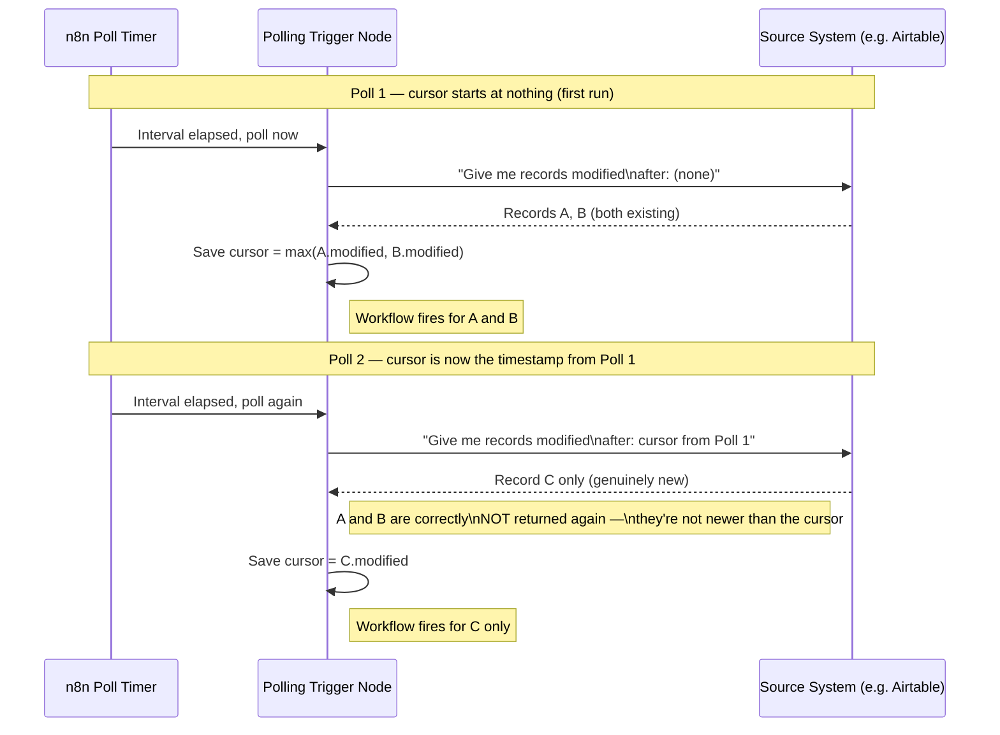
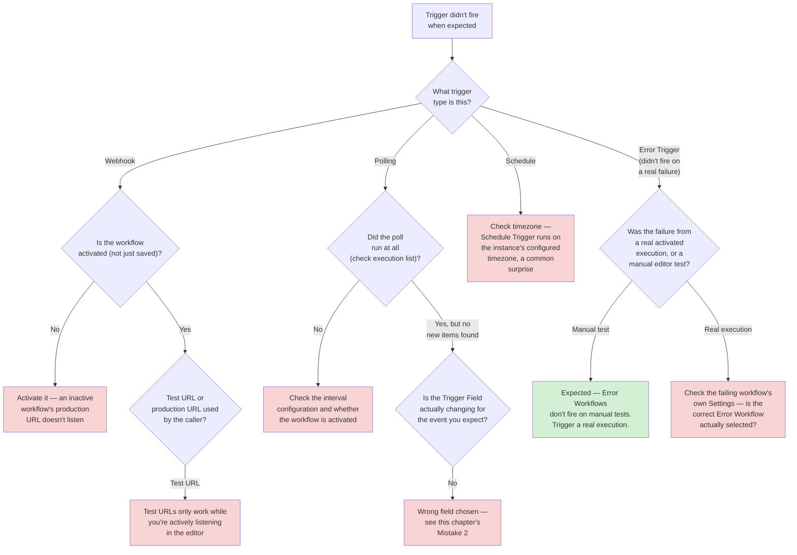
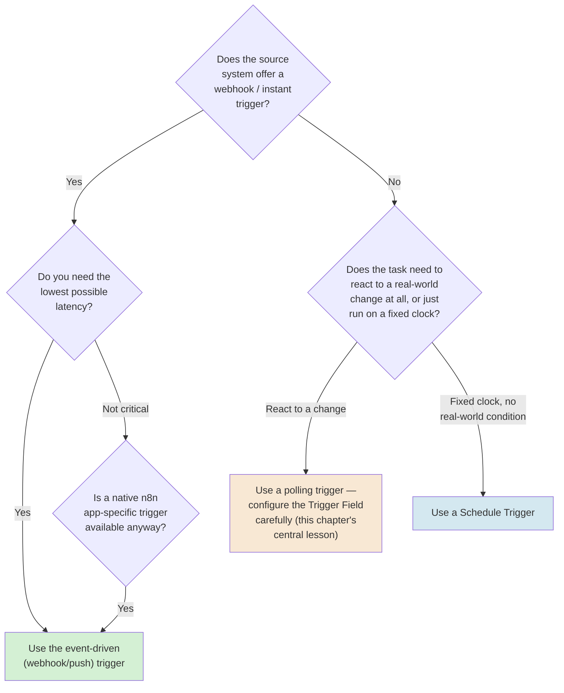

# Chapter 02 — Event-Driven Thinking and n8n's Trigger Model

## Learning Objectives

By the end of this chapter, you will be able to:

- Define what an **event** actually is, in engineering terms, and explain why "a change happened" is not the same thing as "an event was delivered to you."
- Distinguish **event-driven (push)**, **polling (pull)**, and **schedule-based** triggers, and choose correctly among them for a given real-world source system.
- Explain why event **ordering** is not guaranteed by default across a network, and identify when that lack of guarantee actually matters for a workflow you're building.
- Build a working **deduplication** strategy using n8n's polling-trigger cursor mechanism, and explain how it differs architecturally from the receiver-side idempotency key you built in Chapter 01.
- Name and correctly categorize every major trigger type in n8n's current core trigger taxonomy — event-driven, polling, schedule, manual, meta/lifecycle, and invocation-by-another-workflow.
- Configure a Schedule Trigger using both simple presets and a custom cron expression, including running more than one schedule from a single node.
- Set up an Error Trigger / Error Workflow pair correctly, and state precisely when it does and does not fire.
- Explain why the choice of trigger type is an architecture decision with real latency, cost, and reliability consequences — not a cosmetic UI preference.

## Prerequisites

- **Chapters completed:** Chapter 01 (Automation Architecture) — this chapter assumes you're comfortable with the trigger-action model, orchestration vs. choreography, synchronous vs. asynchronous execution, idempotency, and delivery semantics (at-most-once / at-least-once / effectively-once). If "idempotency key" or "delivery semantics" don't ring a bell, go back to Chapter 01 first — this chapter builds directly on top of that vocabulary rather than re-explaining it.
- **Tools installed:** The same n8n Cloud trial account or local instance from Chapter 01. No new tools required.
- **No prior n8n experience beyond Chapter 01 is assumed.**

## Estimated Reading Time

60–70 minutes

## Estimated Hands-on Time

2.5–3 hours

---

## ⚡ Fast Read

> **Skim time: 5 minutes** — Read this if you're in a hurry, returning for reference, or already familiar with part of this topic.

- **What it is:** The engineering discipline of choosing *how* a workflow finds out something happened — pushed to it instantly, discovered by periodically checking, or run on a fixed clock regardless of whether anything happened at all — and n8n's complete, current catalog of trigger types that implement each choice.
- **Why it matters:** Chapter 01 treated "the trigger" as a black box that just starts a workflow. It isn't one. The specific trigger type you pick determines your automation's latency, its load on the systems it talks to, its cost, and — critically — whether it can silently duplicate or silently miss events, in ways that are completely different depending on which kind of trigger you chose.
- **Key insight:** "Poll more often" is not free, and "wait for a webhook" is not always possible — most real integration decisions are a genuine tradeoff between latency and load, and n8n gives you native tooling for both sides of that tradeoff, including a real, built-in deduplication mechanism for polling that most people don't know exists until they've already hand-rolled a worse one.
- **What you build:** An event-driven form-submission workflow, a polling-based feed monitor that correctly avoids reprocessing the same item twice, and a working Error Trigger/Error Workflow pair — then you deliberately break the polling deduplication to see, hands-on, exactly how it fails when configured against the wrong field.
- **Jump to:** [Core Concepts](#core-concepts) | [First Workflow](#beginner-implementation) | [Best Practices](#best-practices) | [Mini Project](#mini-project)

---

## Why This Topic Exists

Chapter 01 gave you the vocabulary for what happens *after* a trigger fires — orchestration, choreography, sync/async, idempotency. It deliberately left one thing unexamined: how does a trigger know *when* to fire in the first place?

That question turns out to have real engineering weight. Some systems will call you the instant something happens — that's a gift, but not every system offers it, and even when it's offered, "instant" comes with its own failure modes (Chapter 01's whole Production Issue was about exactly that gift going wrong). Some systems will never call you at all — no matter how important the event, you have to go and ask, repeatedly, "has anything changed?" And some things aren't really "events" from an external system at all — they're just time passing, and you want to do something regardless of whether the world changed underneath you.

These are three fundamentally different engineering situations, and conflating them is one of the most common early mistakes in automation design. A team that builds a polling-based check where a webhook was actually available pays for it in unnecessary latency and unnecessary load on someone else's API. A team that assumes a webhook exists, builds around it, and discovers three weeks later that the vendor doesn't actually offer one, has to redesign the entire trigger layer of their system. A team that hand-rolls "check for new records since last time" using a schedule and a raw API call, without understanding the deduplication problem that's implicit in that pattern, will eventually reprocess the same record twice — or worse, silently skip one — because nobody thought carefully about what "since last time" actually means when clocks drift, requests overlap, or a field they assumed was unique turns out not to be.

n8n gives you native, purpose-built tooling for all three situations — and, importantly, gives you a real, working deduplication mechanism for the polling case that most builders don't know exists until after they've already reinvented a worse version of it by hand. This chapter's job is to make sure you reach for the right tool on purpose, the first time, rather than discovering the distinction the hard way in production.

## Real-World Analogy

Think about three different ways you find out mail has arrived.

The first is a doorbell. The mail carrier presses it the instant they drop something off, and you know immediately — zero delay, zero wasted effort on your part between deliveries. This is the **event-driven (push)** model: the source system tells you the moment something happens. It's the best experience when it's available, but it requires the mail carrier to *have* a doorbell to press — some senders simply don't offer that capability.

The second is walking out to the mailbox every hour to check. Nobody rings anything; you just go look, over and over, whether or not anything is actually there. Most of your trips find nothing new. This is the **polling (pull)** model: you periodically ask "anything new?" — and the more often you check, the sooner you notice something, but the more trips you waste checking an empty box. There's a real, felt tradeoff between how quickly you find out and how much effort you spend finding out, and it's a dial you control by choosing your checking interval.

The third is watering your houseplants every Sunday morning, on a fixed schedule, whether they're dry or not. Nothing "happened" that triggered this — no event occurred, nothing was delivered, nothing changed state that you're reacting to. You've simply decided this task runs on a clock. This is the **schedule-based** model, and it's worth noticing it's a genuinely different thing from the first two: a schedule doesn't detect anything, it just runs.

Now here's the detail most people miss on their first pass through mailbox-checking: if you check the mailbox at 9am and see a letter, then check again at 10am and the *same* letter is still sitting there because you didn't take it out — did "a new letter arrive" between 9 and 10? Obviously not, but a naively-built polling system that just asks "is there anything in the box?" (instead of "is there anything *new* since I last checked?") can't tell the difference, and will happily process that same letter twice. That specific mistake — polling without a correct notion of "since last time" — is this chapter's central engineering problem, and it's exactly what n8n's polling triggers are built to solve correctly, if you configure them correctly.

---

## Core Concepts

### Event

**Technical definition:** A discrete, meaningful change of state that occurred at a specific point in time — something that *happened*, as opposed to a continuous condition that simply *is*.

**Plain English:** A thing that took place, once, that something downstream might care about.

**Analogy:** "A letter arrived" is an event — a discrete, timestamped occurrence. "The mailbox currently contains a letter" is a *state* — a condition you could observe at any moment, whether or not anything just happened. The distinction matters enormously for automation: a system built to react to *events* needs to know exactly which occurrences are new since it last looked; a system built to react to *state* just needs to look at what's true right now.

> This distinction is the root of this chapter's central engineering problem. A naive polling check that only asks "what's the current state?" (is there mail in the box?) cannot, by itself, distinguish "a new event occurred" from "the same old state is still there." Correctly built polling — covered in Core Concepts below and hands-on in this chapter's Intermediate Implementation — asks a more specific question: "what events have occurred *since I last checked*?"

### Event-Driven Trigger (Push Model)

**Technical definition:** A trigger where the source system itself initiates contact the moment an event occurs, typically via an HTTP callback (a webhook) — the receiving workflow does no active checking of its own.

**Plain English:** The source calls you; you don't call it.

**Analogy:** The doorbell. Zero latency between the event and your awareness of it, at the cost of requiring the source to support this capability at all.

> In n8n, the **Webhook** trigger (covered in depth in Chapter 01) is the general-purpose implementation of this model. Chapter 01 already covered its response modes and authentication options; this chapter's job is narrower — placing it correctly within the broader taxonomy of *when* you'd reach for it versus the alternatives below.

### Polling Trigger (Pull Model)

**Technical definition:** A trigger where the workflow periodically, on its own initiative, checks a source system for changes since the last check — the source system is entirely passive and has no idea the polling is even happening.

**Plain English:** You call the source, repeatedly, and ask "anything new?"

**Analogy:** Walking to the mailbox every hour. The tradeoff is explicit and tunable: check more often and you find out sooner, at the cost of more wasted trips (and, in software terms, more load on the source system and more execution cost on your own platform — a direct link back to Chapter 01's execution-based pricing model).

> Correctly implemented polling requires solving the "since last time" problem described in the Event definition above — this is what n8n's **Trigger Field** mechanism (used by triggers like the Airtable Trigger, and structurally similar across most of n8n's app-specific polling triggers) exists to do: it tracks a timestamp-like field (a "created" or "last modified" column, for instance) from the previous poll, and only surfaces records that changed *after* that point. You'll configure this directly in this chapter's Intermediate Implementation, and — just as importantly — you'll deliberately misconfigure it to see exactly how it breaks.

### Schedule-Based Trigger

**Technical definition:** A trigger that fires at predetermined times, entirely independent of whether any event occurred or any state changed — it runs because the clock said to, not because anything happened.

**Plain English:** Runs on a timer, whether or not there's anything to do.

**Analogy:** Watering the plants every Sunday, dry or not. There's no "since last time" problem here at all, because a schedule trigger isn't trying to detect anything — which is exactly why it's the simplest of the three models, and also why it's the wrong choice whenever you actually do need to react promptly to something happening (a schedule fires when the clock says to, not when the thing you care about occurs).

### Event Ordering

**Technical definition:** The guarantee (or, more often, the *lack* of a guarantee) that events will be delivered to, or observed by, a receiver in the same sequence they actually occurred in the source system.

**Plain English:** Just because event B was processed after event A doesn't mean B actually happened after A in the real world.

**Analogy:** Two letters mailed on different days can arrive in the wrong order — a fast regional letter mailed Tuesday can beat a slower cross-country letter mailed Monday. Your mailbox doesn't reorder them for you; if the order matters (say, "cancel order" needs to be processed after "place order," never before), you have to build that check yourself, because nothing about the delivery mechanism promises it for you.

> Most webhook-based triggers in n8n (and in virtually every real-world system) make **no ordering guarantee** across separate HTTP calls — network retries, provider-side queuing, and simple request-timing variance mean two events fired seconds apart by the source can arrive at your workflow in either order. Polling triggers, by contrast, often give you an *implicit* ordering within a single poll batch (since the poll query typically returns results sorted by the same timestamp field used for deduplication) — but that guarantee evaporates the moment two events land in the same poll interval and their relative order matters for reasons the timestamp field doesn't capture. This chapter doesn't hand you a universal fix (there generally isn't one that's free) — it hands you the ability to *notice* when ordering matters for a specific workflow, so you can design around it deliberately (Chapter 06 covers concrete sequencing patterns).

### Deduplication

**Technical definition:** The general engineering problem of ensuring the same real-world event is not processed more than once, addressed differently depending on *where* in the pipeline the check happens.

**Plain English:** Making sure you don't do the same thing twice for the same actual occurrence.

**Analogy:** Both the mail carrier double-checking their route sheet before delivering (so they don't drop the same letter in two boxes) and you checking your own inbox before opening a letter (so you don't act on one you already read) are deduplication — they just happen at different points in the process.

> This chapter deliberately introduces deduplication as a *category* with (at least) two structurally different implementations you now know both halves of: **source-side cursor deduplication** (this chapter's polling-trigger Trigger Field mechanism — asking "what's new since the last timestamp I saw?") and **receiver-side idempotency keys** (Chapter 01's mechanism — asking "have I already processed this specific identifier, regardless of when it arrived?"). They solve overlapping but distinct problems: cursor dedup prevents *you* from re-fetching the same record on a subsequent poll; an idempotency key prevents you from *acting twice* on the same logical event even if it somehow reaches you more than once (a retry, a manual resend, a genuinely duplicated delivery). A production-grade polling workflow often needs both — cursor dedup to avoid needless re-fetches, and an idempotency key on the actual side-effecting action for genuine defense-in-depth.

### Idempotent Handler

**Technical definition:** The specific piece of workflow logic — typically the node(s) immediately handling a newly-arrived event — responsible for enforcing that reprocessing the same logical event has no additional effect, using the idempotency mechanism from Chapter 01.

**Plain English:** The part of your workflow that's specifically responsible for "even if this runs twice, nothing bad happens."

**Analogy:** The idempotent handler is the equivalent of you checking your reading pile before opening a letter — "have I already read this one?" — regardless of *how* the duplicate letter ended up in your hands (whether the carrier delivered it twice, or you fished the same one out of the recycling by mistake). The check doesn't care about the delivery mechanism; it only cares whether this specific letter has been handled before.

### Trigger Taxonomy

**Technical definition:** The complete, categorized set of ways a workflow can be started — in n8n's specific current implementation, organized into six practical categories: event-driven, polling, schedule-based, manual, meta/lifecycle, and invocation-by-another-workflow.

**Plain English:** The full menu of "how does this workflow know to start," grouped by how each one actually works.

**Analogy:** A restaurant's full set of ways an order can start — a phone ringing (event-driven), a server periodically checking a physical order rail (polling), the kitchen prepping a set menu at fixed times regardless of orders (schedule), a chef deciding to cook something off-menu on a whim (manual), and the fire alarm testing itself every month regardless of any of the above (meta/lifecycle).

### Meta/Lifecycle Trigger

**Technical definition:** A trigger that fires in response to the *automation platform's own* state changes — the workflow being activated, the n8n instance restarting, or another workflow failing — rather than in response to any external business event.

**Plain English:** A trigger about the automation system itself, not about anything happening out in the world.

**Analogy:** A building's own fire-alarm self-test, which has nothing to do with an actual fire — it's a signal about the alarm system's own health and lifecycle, not about the thing the alarm system exists to detect.

> n8n's **Error Trigger** — which starts a dedicated workflow whenever a *different* workflow fails — is this chapter's primary example of a meta/lifecycle trigger, and it's the direct mechanism behind Chapter 01's own closing warning that n8n does not alert you to a failure by default. You'll wire one up yourself in this chapter's Advanced Implementation.

---

## Architecture Diagrams

### Diagram 1 — Push, Pull, and Schedule, Side by Side



Notice the pull model is the only one of the three with a built-in repeating loop drawn into the diagram — that loop, and the cost of running it whether or not anything is actually new, is the entire tradeoff this chapter asks you to reason about explicitly.

### Diagram 2 — n8n's Current Trigger Taxonomy, Grouped



> **Execute Sub-workflow Trigger deliberately sits outside the five categories above.** It doesn't fire on an external business event, a poll, a clock, a human click, or the platform's own lifecycle — it fires when *another workflow explicitly calls this one*, via an Execute Workflow node. That's a distinct thing worth naming on its own: an **invocation trigger**. Chapter 08 (Modular Workflow Design) covers this pattern — and the sub-workflow architecture it enables — in full depth; it's named here only so the taxonomy is honest about where it actually sits.
>
> Two more trigger types exist — **Chat Trigger** and **MCP Server Trigger** — but they're bundled with n8n's AI/LangChain node family rather than its core automation engine, and this course covers them properly starting with Chapter 09 (AI Agent Node) and Chapter 12 (n8n and MCP) respectively.
>
> Finally, four narrower current trigger types exist that this chapter doesn't walk through individually, because they don't teach a new architectural concept beyond what's already covered above — **SSE Trigger** (event-driven, same push model as Webhook, just over a persistent Server-Sent-Events stream instead of discrete HTTP calls), **Local File Trigger** (polling, watching a filesystem path — self-hosted-only, since n8n Cloud has no local filesystem to watch), **Workflow Trigger** (meta/lifecycle, firing on workflow activate/update/save events, distinct from but closely related to the n8n Trigger shown above), and **Evaluation Trigger** (meta, powering n8n's Evaluations feature — Chapter 13's territory). Filed here for a complete taxonomy, not covered further in this chapter.

## Flow Diagrams

### Diagram 3 — Polling Deduplication Across Two Poll Cycles

This sequence diagram shows exactly what the Trigger Field mechanism is doing under the hood, across two consecutive polls — including the specific moment where a naive implementation (checking raw state instead of "new since last cursor") would go wrong.



The entire mechanism depends on one thing: the field used as the cursor must change **only** when a genuinely new event occurs — never for unrelated reasons. This chapter's Production Issue below is exactly what happens when that assumption turns out to be false.

---

## Beginner Implementation

> **No-code path.** No coding required.

**Goal:** Build Aperture Cloud's "Internal Feedback Form" — an event-driven workflow that fires the instant an employee submits a short feedback form, with zero polling and zero waiting.

**Node by node:**

1. **n8n Form Trigger.** Add a Form Trigger node. n8n generates a real, hosted web form URL from this node's configuration — no separate form-building tool needed. Configure two fields: a short-text field ("What's working well?") and a short-text field ("What's not?"). This is a genuine **event-driven trigger**: nothing runs until a human actually submits the form; there is no polling interval to configure, because there's nothing to poll — the submission *is* the event, delivered directly.
2. **Set node.** Connect it to the Form Trigger. Build a simple formatted summary combining both answers into one message field — this is the same shaping step you saw in Chapter 01's Beginner Implementation, just fed by a different trigger type.
3. **Run it for real.** Unlike the Manual Trigger or a webhook you'd have to call with a tool like curl, the Form Trigger gives you an actual shareable URL. Open it in a browser (or share it with a colleague), submit the form, and watch the execution appear in your execution list in real time.

**What you just built, in this chapter's vocabulary:** A genuine **event-driven (push)** trigger — the workflow does zero work between submissions, and reacts the instant one occurs, with none of the "since last time" bookkeeping a polling trigger requires, because there's nothing to poll.

---

## Intermediate Implementation

> **Introduces real multi-pattern design**, including the chapter's central polling/deduplication mechanic. Still no custom code required.

**Goal:** Build a polling-based monitor for Aperture Cloud's public status blog (using a real, public, no-auth RSS feed as a stand-in — any public RSS feed works, such as a well-known engineering blog's feed), correctly configured to avoid reprocessing the same post twice — then deliberately misconfigure it to see the failure mode firsthand.

**Part A — build it correctly:**

1. **RSS Feed Trigger.** Add an RSS Feed Trigger node, pointed at a real public feed URL. Configure the **polling interval** — start with "Every 15 Minutes" for this exercise (in a real deployment, this number is a deliberate latency-vs-load decision, covered in this chapter's Performance Optimisation section).
2. **Run it once manually** and observe: the first poll returns *every* existing item in the feed, because there's no prior cursor yet — this matches Diagram 3's "Poll 1" exactly. This is expected, not a bug: a polling trigger's first-ever run has no "since last time" to compare against.
3. **Run it again** without the feed changing. Confirm zero new items fire — the cursor from the first run correctly suppressed the already-seen items. This is the mechanism working as designed.
4. **Set node.** Connect it to format each new feed item into a short internal notification message (title + link). This is your event handler.

**Part B — break it on purpose, to feel the failure mode:**

Most RSS/Atom feed polling triggers key their deduplication off the feed's own publish-date or GUID field, which is (usually) stable. But many *other* polling triggers — including the general pattern behind app-specific triggers like the Airtable Trigger — let *you* choose which field acts as the cursor. To feel what goes wrong when that choice is bad:

1. In a scratch workflow, configure a polling trigger against a data source where you control the "Trigger Field" setting (an Airtable base is ideal for this exercise, or any node offering an equivalent configurable cursor field).
2. Deliberately set the Trigger Field to a column that updates on **any** edit to a row — not just the creation of a genuinely new row. A generic "Last Modified" column that any team member's edit touches is a good, realistic example.
3. Poll once to establish a baseline cursor. Then, without creating any new row, simply edit an *unrelated* field on an existing, already-seen row (fix a typo, for instance).
4. Poll again. **Observe the bug directly:** the trigger fires again for that row, even though nothing "new," in the business sense, actually happened — because the field you chose as your cursor changed for a reason that had nothing to do with the event you actually cared about.

**What to notice, hands-on:** The deduplication mechanism didn't fail — it did exactly what it was configured to do. The *configuration* was wrong: the Trigger Field conflated "this row was touched" with "this row represents a new event," and those turned out not to be the same thing. This is the exact mechanism behind this chapter's Production Issue below, reproduced safely in a low-stakes exercise before you meet it as a real incident.

---

## Advanced Implementation

> **Engineering-depth path.** Uses n8n's Code node and the Error Trigger mechanism.

**Goal:** Build a working Error Trigger / Error Workflow pair, correctly configured, and understand precisely when it fires and when it silently doesn't.

**Step 1 — build the error-handling workflow first.**

1. Create a new, separate workflow. Add an **Error Trigger** node as its only trigger. This workflow's entire job is to receive failure details from *other* workflows — it never runs on its own initiative.
2. Add a Set node after it to extract the useful fields from the error payload — which workflow failed, which node failed, and the error message. In a real deployment this would feed a Slack or email notification (Chapter 04 territory); for this exercise, a Set node formatting the message is enough to prove the mechanism works.

**Step 2 — wire a real workflow to use it.**

3. Open any workflow you've already built in this chapter (the RSS monitor from the Intermediate Implementation is a good candidate). Open its **Settings** and set the **Error Workflow** dropdown to the workflow you just built in Step 1.
4. Deliberately introduce a failure: add a Code node that always throws.

```javascript
// Learning example — deliberately failing Code node, used ONLY to trigger
// the Error Workflow mechanism for this exercise. Never ship a node that
// intentionally throws into a real production workflow.
throw new Error("Deliberate failure for Error Trigger exercise");
```

5. **Activate** the workflow (this step matters — Error Workflows are documented to fire only on automatic/production execution failures, not on manual "Test workflow" runs in the editor). Trigger it for real (submit to the Form Trigger from earlier, or wait for the next poll), and confirm the Error Trigger workflow fires with the correct failure details.

**The common mistake alongside the correct pattern:**

```text
WRONG: Build the Error Trigger workflow, but only ever test the failing
workflow using the editor's "Test workflow" button — and conclude Error
Workflows "don't work," because nothing fires.

RIGHT: Understand that Error Workflows are documented to trigger on
automatic execution failures specifically — a manual test run in the
editor does not count. Test by triggering the real, activated workflow
through its actual trigger (a real webhook call, a real form submission,
a real poll), not through the editor's manual test button.
```

**How to debug it when it breaks:** If the Error Workflow never fires, check, in order: (1) is the failing workflow actually **activated**, not just saved; (2) did the failure come from a genuine automatic execution, not a manual editor test; (3) is the correct Error Workflow actually selected in the failing workflow's own Settings (a workflow with an Error Trigger node does not automatically become every other workflow's error handler — it must be explicitly selected per-workflow).

**The production version, where it differs from the learning version:** The learning version above uses a single Error Workflow receiving raw failure details into a Set node. A production version typically fans the failure details out to more than one destination (an alerting channel for humans, and a structured log store for later analysis) and, per Chapter 01's idempotency discipline, should itself be resilient to firing more than once for genuinely related failures (a single root cause cascading through multiple downstream nodes can trigger more than one error event) — a concern Chapter 07 covers in full depth as part of its own reliability patterns.

---

## Production Architecture

- **Trigger choice is a load-planning decision, not just a latency decision.** A workflow polling a third-party API every minute, multiplied across every workflow doing the same thing against the same API, becomes real, aggregate load on a system you don't control — some providers rate-limit or even suspend API access for excessive polling. Production trigger design has to account for the *fleet-wide* polling load, not just one workflow's own interval in isolation (a concern Chapter 16 returns to at real scale).
- **Meta/lifecycle triggers are your only default safety net, and they require deliberate wiring.** As this chapter's Advanced Implementation demonstrated hands-on, an Error Workflow does nothing until it's explicitly selected in each individual workflow's Settings. In production, this is usually standardized: most real n8n deployments define one (or a small number of) shared Error Workflows and apply them as a default across every production workflow, specifically so a newly-built workflow doesn't accidentally ship without failure alerting — a process discipline, not a technical default n8n provides for you automatically.
- **Polling triggers need their interval revisited as data volume grows.** A Trigger Field-based poll that comfortably returns 3 new records every 15 minutes today can return 300 next year as the underlying data source grows — at some point the poll itself becomes the bottleneck, or starts approaching rate limits. Production polling configurations should be treated as something to periodically re-tune, not "set once and forget," the same discipline Chapter 17 (Observability) formalizes for the whole platform.
- **Webhook and polling triggers have different operational blast radii under an outage.** If n8n itself goes down, a webhook-based trigger typically **loses** any events sent during the outage (unless the sender has its own retry/redelivery logic, which varies by provider) — whereas a polling trigger, once n8n comes back up, will simply catch up on its next poll, because the cursor-based mechanism naturally captures everything that changed since the last successful poll. This is a genuine, current, underappreciated reliability argument in favor of polling for sources where either option exists, even though polling loses on latency.

---

## Best Practices

1. **Default to event-driven (push) when the source genuinely supports it and low latency matters.** Reach for polling only when no webhook exists, or when the source explicitly doesn't offer one.
2. **Never choose a polling interval blindly — tie it to an actual business requirement.** "Every minute" and "every hour" have real, different cost and load implications (Cost Considerations below); pick the loosest interval that still satisfies the actual latency need, not the tightest one available.
3. **Audit every polling trigger's Trigger Field for the specific failure this chapter's Intermediate Implementation reproduced**: does this field change *only* when a genuinely new business event occurs, or could an unrelated edit also touch it? If you're not certain, test it deliberately, the same way you did hands-on in this chapter.
4. **Treat cursor-based deduplication and receiver-side idempotency keys as complementary, not interchangeable.** Cursor dedup protects the poll itself from redundant work; an idempotency key protects the actual side-effecting action from being run twice for any reason, including causes cursor dedup can't see (a manual resend, a race condition, a bug).
5. **Give every production workflow an Error Workflow, as a standing default, not an afterthought.** Standardize on one (or a small number of) shared Error Workflows across your instance, and treat "no Error Workflow configured" as something a pre-launch checklist explicitly catches — Chapter 01's Production Issue and this chapter's both trace back to a gap that a five-second checklist item would have caught before shipping.
6. **Test Error Workflow wiring against a real, activated execution — never only against a manual editor test run.** This chapter's Common Mistake exists precisely because this distinction is easy to miss and easy to get burned by.
7. **When ordering matters, don't assume any trigger type gives it to you for free.** Webhooks generally don't guarantee cross-call ordering at all; polling gives you an ordering *within* a single poll batch at best. If a specific business process genuinely requires strict ordering, design for it explicitly (Chapter 06) rather than relying on incidental trigger behavior.

---

## Security Considerations

- **Polling triggers still need scoped credentials, even though nothing calls you.** It's easy to assume polling is "safer" than an inbound webhook because nothing external reaches your system — but the credential a polling trigger uses to read the source system is a real, standing credential with real access, and it deserves the same least-privilege scoping discipline Chapter 19 covers for any other credential (read-only access where read-only is all that's needed, for instance).
- **Error Workflow payloads can leak sensitive data into notification channels.** A raw error message or stack trace forwarded verbatim into a Slack channel can inadvertently include fragments of the data a node was processing when it failed (a customer email address embedded in an error string, for instance). Treat what an Error Workflow forwards downstream as data requiring the same sanitization discipline as any other data leaving your system, not as "just a log."
- **A form trigger's public URL is, functionally, an unauthenticated public endpoint**, the same category of exposure Chapter 01 flagged for unauthenticated webhooks — anyone with the link can submit data. For genuinely internal-only tools, pair it with n8n's available form-authentication options or restrict distribution of the link deliberately; don't assume "it's just a feedback form" means the exposure doesn't matter.

## Cost Considerations

Polling frequency has a direct, linear relationship to execution count, and — per Chapter 01's execution-based pricing model — execution count is what you're actually billed for. A polling trigger checking every minute runs (and is billed for) 1,440 executions per day whether or not anything new is ever found; the same source polled every 15 minutes runs 96 times a day. This is a real, concrete lever: **tightening a polling interval to reduce latency has a direct, proportional cost**, in a way that choosing a webhook (which only executes when something genuinely happens) simply doesn't.

| Trigger type | Execution cost driver | Typical cost behavior |
|---|---|---|
| Event-driven (webhook, form) | One execution per real event, always | Cost scales with genuine business activity — no wasted executions |
| Polling | One execution per poll interval, **regardless of whether anything new was found** | Cost scales with your chosen interval, not with actual activity — a tight interval on a rarely-changing source is pure waste |
| Schedule | One execution per scheduled firing, always, regardless of relevance | Predictable, fixed cost — the most cost-legible of the three, but only appropriate when timing genuinely doesn't depend on external events |

> **Currency Note:** The general mechanism above (execution-based billing rewards fewer, more meaningful executions) is stable and current as of this chapter's July 2026 verification, consistent with Chapter 01's Cost Considerations section — always confirm the current per-tier execution allowances on `n8n.io/pricing` before sizing a polling interval against a specific plan's limits.

## Common Mistakes

**Mistake 1 — Reinventing polling deduplication badly with a raw Schedule Trigger.**

```text
WRONG: Schedule Trigger (every 15 min) → HTTP Request (fetch ALL records
from the source) → process every record returned, every time.
// This reprocesses every record on every single run — there's no cursor,
// no "since last time" concept at all. It "worked" in a five-record test
// and will silently misbehave the moment the dataset has real volume.

RIGHT: Use a native polling trigger (or, if none exists for this specific
source, hand-roll the Trigger Field pattern explicitly — store the last-
seen cursor value yourself, in a Code node or datastore, and filter for
records newer than it, matching Diagram 3's mechanism deliberately).
```

**Mistake 2 — Choosing a Trigger Field that isn't actually "created/modified only when a new event occurs."**

```text
WRONG: Trigger Field = "Last Modified" on a table where team members
routinely edit unrelated fields on old rows.
// Reproduces exactly this chapter's Intermediate Implementation exercise
// and this chapter's Production Issue below.

RIGHT: Trigger Field = a field that changes ONLY at creation (a true
"Created Time" field), or a dedicated "Status Changed At" field that's
updated exclusively by the specific transition you care about — not a
general-purpose "last touched" field.
```

**Mistake 3 — Assuming a webhook exists without checking.**

```text
WRONG: Design an entire integration assuming the source system supports
webhooks, only to discover during implementation that it doesn't offer
one at all (a real, common situation with older or smaller SaaS tools).

RIGHT: Confirm webhook availability against the source's own current
documentation before committing to an event-driven design. If none
exists, a polling trigger — designed deliberately, per this chapter — is
the honest alternative, not a downgrade to feel bad about.
```

**Mistake 4 — Treating the Manual Trigger as if it fires in production.**

```text
WRONG: Build and test a workflow entirely using the Manual Trigger, then
expect it to run automatically once deployed.

RIGHT: The Manual Trigger fires ONLY when a human clicks "Test workflow"
in the editor — it never fires on its own in a running, activated
instance. It's a development/testing convenience, not a production
trigger type. A production workflow needs one of the other four
categories as its real trigger.
```

## Debugging Guide



| Symptom | Likely cause | Where to look |
|---|---|---|
| Webhook never fires | Workflow not activated, or caller used the test URL instead of the production URL | Workflow's activation toggle; the exact URL the caller is using |
| Polling trigger runs but finds nothing, even though data clearly changed | Trigger Field configured against a field that doesn't reflect the specific change you care about | The polling node's Trigger Field configuration, cross-checked against what actually changed in the source |
| Polling trigger reprocesses the same item repeatedly | Trigger Field changes for reasons unrelated to genuinely new events (this chapter's central failure mode) | Compare the field's edit history in the source system against your workflow's execution history for the same item |
| Schedule Trigger fires at the "wrong" time | Instance timezone differs from the timezone you assumed when configuring the schedule | n8n instance-level timezone setting, vs. the Schedule Trigger's configured time |
| Error Workflow silently never fires | Either a manual-test-only failure, or the failing workflow's Settings don't point at the Error Workflow | Failing workflow's own Settings → Error Workflow dropdown; confirm the triggering failure was a real execution |

## Performance Optimisation

> The numbers below are **illustrative measurements from this chapter's own Aperture Cloud scenario**, not a published benchmark.

In an illustrative comparison for the RSS/status-monitoring scenario built in this chapter's Intermediate Implementation: polling every 1 minute produced 1,440 executions/day against a source that, realistically, published new content perhaps 2–3 times per day — a **~99.8% "wasted poll" rate**, each one still counted toward execution-based billing. Widening the interval to every 15 minutes cut that to 96 executions/day (a 93% reduction) while only increasing worst-case detection latency from under 1 minute to under 15 minutes — for an internal status-notification use case, an entirely acceptable tradeoff. The general, transferable lesson: **match your polling interval to the actual required latency of the business process, not to "as fast as the tool allows"** — the fastest technically-possible interval is very rarely the economically or operationally correct one.

---

## Technology Comparison — How Other Platforms Handle the Same Trade-off

| Platform | Event-driven support | Polling model | Notable framing |
|---|---|---|---|
| **n8n** | Native Webhook, Form, and app-specific webhook triggers | Native app-specific polling triggers with a configurable Trigger Field cursor mechanism (this chapter's focus) | Both models are first-class, visual, and equally easy to wire up |
| **Zapier** | Webhook-based "instant" triggers where the connected app supports them | "Polling" triggers explicitly labeled as such in the Zap editor, on a fixed interval tied to plan tier | Makes the push/pull distinction directly visible to the end user in the UI — a genuinely good, current design choice worth noting |
| **Make** | Instant triggers (webhook-based) where supported | Scheduled polling with configurable intervals, credit-cost-aware (tighter polling consumes more of the credit-based billing model) | Ties polling frequency to cost even more explicitly than n8n's execution-based model, given Make's per-credit accounting |
| **Temporal** | Signals — an external system can push data into a running Temporal workflow at any point, conceptually similar to a webhook but delivered into an already-executing durable process rather than starting a new one | Polling handled entirely in application code (Activities can poll anything you write code to poll) | No built-in polling *trigger* abstraction — Temporal is durable execution, not an integration platform, so this entire chapter's tradeoff is something a Temporal-based team implements themselves in code |
| **Apache Airflow** | Not a native strength — Airflow is fundamentally schedule-oriented | **Sensors** — a first-class Airflow primitive that is, structurally, exactly this chapter's polling model (a Sensor task waits, checking on an interval, for a condition to become true) | A genuinely useful comparison: Airflow's Sensors are conceptually identical to n8n's polling triggers, just expressed as code within a scheduled DAG rather than as a standalone trigger node |

## Decision Framework — Choosing a Trigger Type



The recurring, chapter-spanning heuristic still applies underneath this decision: **whichever trigger you choose, ask who's actually maintaining this workflow and how much operational surprise they can absorb.** A business user maintaining a polling-based workflow needs the Trigger Field concept explained in plain terms (this chapter's dual-track discipline exists exactly for that reason) — an engineer maintaining the same workflow needs to additionally think about fleet-wide polling load and cursor edge cases. Same trigger, same decision tree, different depth of follow-up required depending on who owns it.

---

## Real Client Scenario — Aperture Cloud's Status Blog Monitor

Aperture Cloud's internal comms team wanted a Slack notification whenever their public status blog published a new post, so the support team would know about incidents at the same moment customers might start noticing them. An engineer built it fast, using the RSS Feed Trigger pattern from this chapter's Intermediate Implementation, polling every 5 minutes. It worked correctly for weeks — the blog's underlying feed used a stable, creation-only timestamp as its ordering field, so the built-in deduplication behaved exactly as Diagram 3 describes.

The team later asked for a second monitor, watching an internal Airtable base where support leads log major customer-impacting issues, using the same "just copy the pattern" instinct. This time, the Trigger Field was set to the base's generic "Last Modified" column — because it was the only timestamp column visible in the table, and nobody stopped to check whether it updated for reasons beyond "a new issue was logged." It didn't take long for someone editing an unrelated typo in an old issue's description to trigger a fresh, confusing Slack notification about a "new" incident that was actually resolved weeks earlier. This is a genuinely low-stakes scenario — the worst-case failure is a confusing internal notification, not a customer-facing incident — consistent with this course's Module 1–2 discipline, but it's exactly the kind of subtle, easy-to-miss bug this chapter exists to help you catch before it reaches a real team's Slack channel.

---

### Production Issue: The Status Monitor That Cried Wolf

**Symptoms**

Aperture Cloud's internal "major incident" Slack channel started receiving **false "new incident" notifications** for issues that had already been resolved, sometimes weeks earlier — roughly two to three times a week, with no pattern anyone could immediately spot. Support leads began quietly ignoring the channel, which was the actually dangerous outcome: a genuinely new incident notification, buried among the false ones, was noticed 40 minutes late one week because someone had started treating the channel as noise.

**Root Cause**

The polling trigger monitoring the internal Airtable "Major Issues" base was configured with its Trigger Field set to the table's generic **Last Modified** column — a column that Airtable (like most similar tools) updates automatically whenever *any* field on a row changes, not specifically when a row is newly created or newly marked as a major incident. Support leads routinely went back and edited old, already-resolved issue records — fixing a typo, adding a follow-up note, correcting a date — for entirely legitimate reasons unrelated to "this is a new incident." Each of those edits updated Last Modified, which the polling trigger correctly (per its own configuration) interpreted as "this row changed since my last poll" and dutifully re-fired the notification workflow — exactly reproducing this chapter's Intermediate Implementation exercise, at real production cost.

**How to Diagnose It**

1. Compare the timestamps of the false notifications against the Airtable row's full edit history (Airtable's own revision history, if enabled, shows exactly what changed and when) — look specifically for edits to fields *other than* the ones that would indicate a genuinely new incident.
2. Confirm the polling trigger's configured Trigger Field, and ask directly: does this field update for reasons other than the specific event I want to detect?
3. Cross-reference the workflow's execution list against the false-notification timestamps — each false notification should correspond to exactly one poll cycle where the misconfigured field happened to be touched.

**How to Fix It**

```text
BEFORE:
Airtable polling trigger, Trigger Field = "Last Modified"
  (updates on ANY field edit — typos, notes, unrelated corrections)

AFTER:
Add a dedicated "Flagged At" date field to the Airtable base, set by
automation ONLY at the exact moment a row is newly marked as a major
incident (via an Airtable automation, or by having the same n8n workflow
that creates the row also stamp this field).
Airtable polling trigger, Trigger Field = "Flagged At"
  (updates ONLY at the specific moment that represents a genuinely new
  event — routine edits to other fields no longer touch it)
```

Where a source system doesn't offer the ability to add a dedicated field like this, the fallback is a receiver-side idempotency check (Chapter 01's mechanism) layered on top: track which record IDs have already triggered a notification in a separate store, and suppress a repeat notification for a record ID that's already been seen — trading "cleaner cursor field" for "extra receiver-side bookkeeping," a real and sometimes-necessary tradeoff when you don't control the source schema.

**How to Prevent It in Future**

Aperture Cloud's team adopted a standing rule, directly reflecting this chapter's Best Practices: **before configuring any polling trigger's Trigger Field, explicitly test — as a required step, not an assumption — whether the chosen field can change for reasons unrelated to the specific event being detected**, exactly as this chapter's Intermediate Implementation walked through deliberately. Where no naturally-suitable field exists, the team now defaults to adding a dedicated, purpose-built timestamp field rather than reusing a general-purpose "Last Modified" column out of convenience.

---

## Exercises

1. **(15 min) Classify five real notifications.** For five notifications you've received this week (an app notification, an email, a text), identify whether the underlying mechanism was almost certainly event-driven, polling, or scheduled, based on how promptly it arrived and what you know about the source.
2. **(20 min) Predict the ordering failure.** Without building anything, write out a scenario (in your own domain, or using Aperture Cloud) where two events arriving out of order would cause a real problem, and one where it genuinely wouldn't matter. Explain the difference.
3. **(45 min) Build the Beginner Implementation, then break the source.** After building the Internal Feedback Form workflow, deactivate the workflow and try submitting the form again. Document exactly what happens to that submission — is it queued, lost, or rejected outright?
4. **(60–90 min) Build both halves of the Intermediate Implementation.** Build the correctly-configured RSS monitor, and separately reproduce the misconfigured Trigger Field exercise. Document, with actual screenshots or exported execution data, the moment the misconfiguration causes a duplicate fire.
5. **(60 min) Wire up a real Error Trigger/Error Workflow pair** using this chapter's Advanced Implementation, deliberately triggering a real (not manual-test) failure, and confirm the mechanism fires correctly.

## Quiz

**1. What's the fundamental difference between an "event" and a "state"?**
> An event is a discrete, timestamped occurrence — something that happened once. A state is a continuously observable condition, true at any given moment regardless of whether anything just happened. Polling systems that only check current state (not "what's new since last time") can't distinguish a genuinely new event from an unchanged, already-seen state.

**2. Why doesn't a Schedule Trigger have a "deduplication" problem the way a polling trigger does?**
> Because a Schedule Trigger doesn't try to detect anything — it fires purely based on the clock, with no comparison against a source system's state at all, so there's no "have I seen this before" question for it to get wrong.

**3. What specifically does n8n's Trigger Field mechanism track, and what does it use that for?**
> It tracks a timestamp-like field (e.g., a "created" or "last modified" column) from the previous poll, and uses it as a cursor — only records that changed after that stored value are considered new on the next poll.

**4. Give an example of a field that would make a BAD Trigger Field, and explain why.**
> A generic "Last Modified" column that updates whenever any field on a row is edited — including edits unrelated to the specific event you're trying to detect (a typo fix, an unrelated note). It causes the polling trigger to re-fire for changes that aren't the genuinely new event you care about, exactly as in this chapter's Production Issue.

**5. How does cursor-based polling deduplication differ from a Chapter 01-style idempotency key, structurally?**
> Cursor-based deduplication happens on the *source/fetch* side — it prevents the trigger from re-fetching records it's already seen. An idempotency key happens on the *receiver/action* side — it prevents the actual side-effecting logic from running twice for the same logical event, regardless of how or why a duplicate reached it (a retry, a resend, a bug). They address related but distinct risks and are often used together.

**6. Why does a webhook generally NOT guarantee ordering across separate calls, while a polling trigger often gives you ordering within a single poll batch?**
> A webhook is a separate, independent HTTP call per event, subject to independent network timing, retries, and provider-side queuing — nothing forces two separate calls to arrive in the order they were sent. A polling trigger fetches a batch of records in one query, typically sorted by the same timestamp field used for the cursor, so records within that one batch usually come back in a consistent order — though that guarantee can still break down if two events land within the same poll interval and their relative order matters for reasons the timestamp doesn't capture.

**7. Why does the Manual Trigger not count as a real production trigger?**
> Because it only fires when a human clicks "Test workflow" in the n8n editor — it never fires on its own in a running, activated instance. It's a development/testing tool, not one of the mechanisms that starts a workflow in production.

**8. What's the specific, documented condition under which n8n's Error Trigger mechanism does NOT fire, even though the corresponding workflow failed?**
> When the failure occurred during a manual "Test workflow" run in the editor rather than a genuine automatic/production execution — Error Workflows are documented to trigger only on automatic execution failures.

**9. Why is tightening a polling interval not a "free" way to reduce latency, the way it might first appear?**
> Because polling executes on the interval regardless of whether anything new is actually found, and under n8n's execution-based pricing (Chapter 01), every poll is a billed execution. A tighter interval directly and proportionally increases execution count — and, separately, increases load on the polled source system — even during long stretches where nothing new occurs.

**10. Name n8n's six practical trigger categories from this chapter's taxonomy.**
> Event-driven (push), polling (pull), schedule-based, manual, meta/lifecycle, and invocation-by-another-workflow.

## Mini Project

**Aperture Cloud's Feed Monitor, Hardened (2–3 hours)**

Extend the Intermediate Implementation's RSS monitor into something closer to a real internal tool.

**Requirements:**
- [ ] The RSS Feed Trigger correctly avoids reprocessing already-seen items across at least two consecutive polls (demonstrate this the same way Part A of the Intermediate Implementation did).
- [ ] Add a Manual Trigger running in parallel, purely for on-demand testing, and a short written note explaining why this Manual Trigger will never fire on its own once the workflow is deployed.
- [ ] Wire this workflow to a real Error Workflow (built per the Advanced Implementation), and demonstrate — with a deliberately failing node — that it fires correctly on a real (non-manual-test) execution.
- [ ] A written note (150–250 words) explaining, in your own words, what would need to be true about the RSS feed's underlying data for this deduplication mechanism to fail the same way this chapter's Production Issue did.

## Production Project

**Aperture Cloud's Multi-Source Incident Monitor (1–2 days)**

Design and build a workflow that correctly monitors **two different kinds of sources** for the same underlying business concept ("a new major incident was logged") — one event-driven (a Form Trigger simulating an internal incident-report form) and one polling-based (an Airtable base simulating a support-lead-maintained tracker) — merging both into a single, correctly-deduplicated internal notification stream.

**Requirements:**
- [ ] The polling half must use a deliberately well-chosen Trigger Field (not a generic "Last Modified" column) — document, in writing, why the field you chose is safe against this chapter's Production Issue.
- [ ] Both the event-driven and polling paths must ultimately pass through a shared, receiver-side idempotency check (Chapter 01's mechanism) before the actual notification fires, so that even if the same incident somehow enters through both sources, only one notification results.
- [ ] A working Error Workflow must be attached to both trigger paths.
- [ ] Manually reproduce this chapter's Production Issue on the polling half on purpose (temporarily misconfigure the Trigger Field), capture evidence of the false re-fire, then revert the fix and demonstrate it's resolved.
- [ ] A written comparison (300–500 words): what latency each path realistically offers, what it cost you in execution count over a simulated day of testing, and a final recommendation for which source Aperture Cloud should prioritize connecting first if only one could be built today, with reasoning grounded in this chapter's Decision Framework.

## Key Takeaways

- An event is a discrete occurrence at a point in time; a state is a continuously observable condition — polling systems that confuse the two will misbehave.
- Event-driven (push), polling (pull), and schedule-based triggers are three structurally different mechanisms, each with a real, distinct latency/load/reliability tradeoff — not interchangeable defaults.
- Correct polling deduplication depends entirely on choosing a Trigger Field that changes only for the specific event you care about — this chapter's single most consequential, most commonly mis-configured detail.
- Cursor-based deduplication (source-side) and idempotency keys (receiver-side, from Chapter 01) solve related but distinct problems, and production-grade polling workflows often need both.
- Event ordering is not guaranteed by default across separate webhook calls, and only weakly guaranteed within a single polling batch — design explicitly for ordering when it actually matters.
- n8n's current trigger taxonomy has six practical categories: event-driven, polling, schedule-based, manual, meta/lifecycle, and invocation-by-another-workflow — plus two AI-native trigger types (Chat Trigger, MCP Server Trigger) covered properly later in this course.
- The Manual Trigger is a development convenience, not a production mechanism — it never fires on its own outside the editor.
- Error Workflows require explicit, per-workflow configuration and fire only on genuine automatic execution failures, never on manual editor tests — both are easy, costly assumptions to get wrong.
- Polling frequency has a direct, proportional relationship to execution count and therefore cost, under n8n's execution-based pricing model — tightening an interval is never a free latency win.
- Outage behavior differs meaningfully by trigger type: webhooks can lose events sent during downtime (sender-dependent), while polling naturally catches up on its next successful poll — a real, underappreciated reliability argument for polling in some scenarios.

## Chapter Summary

| Concept | Key Takeaway |
|---|---|
| Event vs. State | An event is a discrete occurrence; a state is what's true right now — conflating them breaks naive polling |
| Event-Driven Trigger | Source calls you the instant something happens — lowest latency, requires source support |
| Polling Trigger | You periodically ask the source "anything new?" — tunable latency/cost tradeoff |
| Schedule-Based Trigger | Runs on a clock, independent of any real-world event or state |
| Event Ordering | Not guaranteed across separate webhook calls; only weakly guaranteed within one poll batch |
| Deduplication | Two distinct mechanisms — source-side cursor (Trigger Field) and receiver-side idempotency key (Ch01) |
| Trigger Taxonomy | Six practical categories: event-driven, polling, schedule, manual, meta/lifecycle, invocation-by-another-workflow |
| Meta/Lifecycle Trigger | Fires on the platform's own state changes (e.g. Error Trigger), not external business events |
| Cost | Polling execution count scales with interval, not with actual activity — tighter intervals cost more |

## Resources

- [n8n Triggers library](https://docs.n8n.io/integrations/builtin/trigger-nodes/) — the current, authoritative list of all built-in trigger nodes
- [n8n Schedule Trigger documentation](https://docs.n8n.io/integrations/builtin/core-nodes/n8n-nodes-base.scheduletrigger/) — current simple and cron configuration options, including multiple Trigger Rules
- [n8n Error Trigger documentation](https://docs.n8n.io/integrations/builtin/core-nodes/n8n-nodes-base.errortrigger/) — current Error Workflow setup and firing conditions
- [n8n Airtable Trigger documentation](https://docs.n8n.io/integrations/builtin/trigger-nodes/n8n-nodes-base.airtabletrigger/) — the concrete Trigger Field/polling mechanism this chapter builds on
- [Apache Airflow Sensors documentation](https://airflow.apache.org/docs/apache-airflow/stable/core-concepts/sensors.html) — the closest cross-platform conceptual parallel to n8n's polling triggers, referenced in this chapter's Technology Comparison
- Volume 4, this series — bounded reasoning loops and human-checkpoint discipline, echoed here in the Error Trigger's role as this platform's own "something needs a human's attention" signal

## Glossary Terms Introduced

| Term | One-line definition |
|---|---|
| Event | A discrete, meaningful change of state at a specific point in time |
| Event-Driven Trigger (Push) | A trigger where the source system initiates contact the instant an event occurs |
| Polling Trigger (Pull) | A trigger that periodically checks a source for changes since the last check |
| Schedule-Based Trigger | A trigger that fires at predetermined times, independent of any external event |
| Event Ordering | The (often absent) guarantee that events are observed in the order they occurred |
| Deduplication | Ensuring the same real-world event is not processed more than once |
| Idempotent Handler | The workflow logic responsible for making reprocessing the same event harmless |
| Trigger Taxonomy | The full, categorized set of ways a workflow can be started |
| Meta/Lifecycle Trigger | A trigger that fires on the automation platform's own state changes, not external events |
| Trigger Field | The n8n polling-trigger setting controlling which field acts as the "since last time" cursor |

## See Also

| Topic | Related Chapter | Why |
|---|---|---|
| Automation Architecture | Chapter 01 | This chapter's idempotency and delivery-semantics vocabulary is reused directly, contrasted against this chapter's source-side cursor deduplication |
| The n8n Data Model and Expressions | Chapter 03 | Covers the actual data shape (`items`, `$json`, `$input`) that every trigger type in this chapter hands to the rest of the workflow |
| Workflow Design Patterns | Chapter 06 | Covers concrete sequencing/ordering patterns for the cases this chapter flags but doesn't fully solve |
| Reliability and Error Recovery | Chapter 07 | Builds directly on this chapter's Error Trigger mechanism into full retry, backoff, and dead-letter handling |
| Scaling n8n in Production | Chapter 16 | Covers fleet-wide polling load planning at real scale, referenced in this chapter's Production Architecture |
| Observability | Chapter 17 | Covers the discipline of noticing a silently-failing meta/lifecycle trigger setup before it becomes an incident |

## Preparation for Next Chapter

**Technical checklist:**
- [ ] You've built and run the Beginner Implementation (Internal Feedback Form) at least once, end to end.
- [ ] You've reproduced this chapter's Production Issue on purpose (misconfigured Trigger Field) and seen the duplicate fire yourself.
- [ ] You have a working Error Trigger/Error Workflow pair from the Advanced Implementation.

**Conceptual check** — you should be able to answer, without looking back:
- What's the difference between source-side cursor deduplication and receiver-side idempotency, and when would you want both?
- Why doesn't tightening a polling interval give you lower latency "for free"?
- Under exactly what condition does n8n's Error Trigger mechanism NOT fire, even though a workflow genuinely failed?

**Optional challenge:** Before starting Chapter 03, open any workflow you've built so far and inspect one execution's raw input/output data for a single node (click into a node's output in the execution view). Try to describe, in your own words, the shape of what you see — you'll find out in Chapter 03 exactly how close your guess was to n8n's actual `items`/`json`/`binary` data model.

---

> **Currency Note:** This chapter's n8n-specific facts (the current trigger node list, Schedule Trigger's simple/cron modes and multi-rule support, the Airtable Trigger's Trigger Field mechanism, and Error Workflow firing conditions) were verified directly against `docs.n8n.io` in July 2026. Trigger-node availability and configuration options change as n8n ships new releases — always confirm current specifics against the official documentation before making a production decision based on this chapter.
