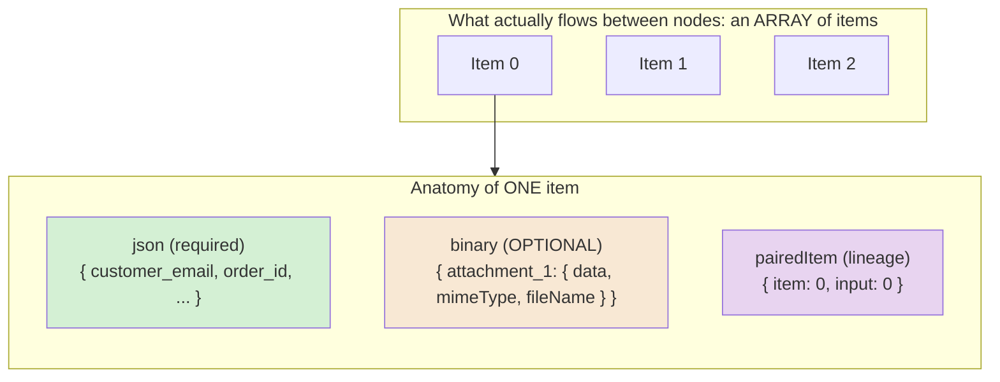
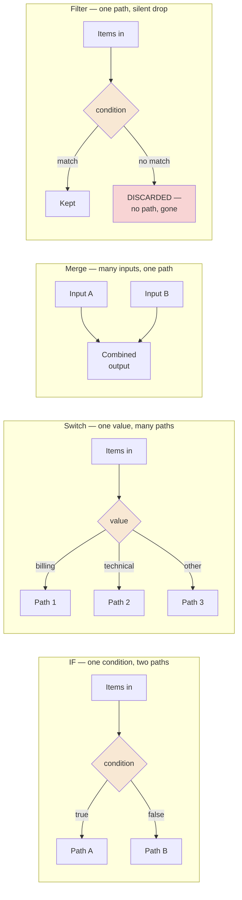
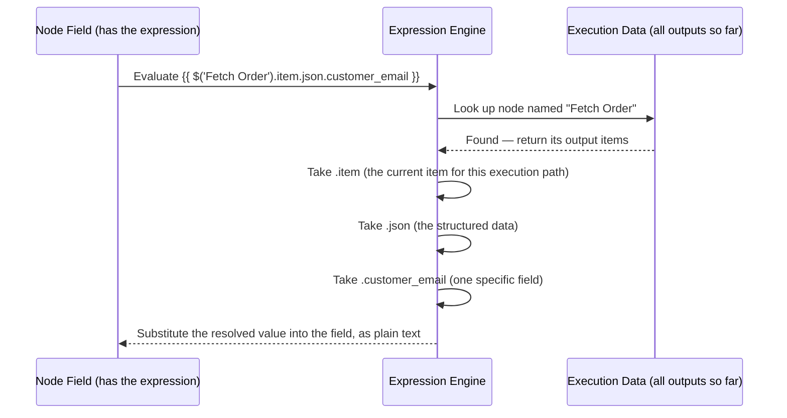
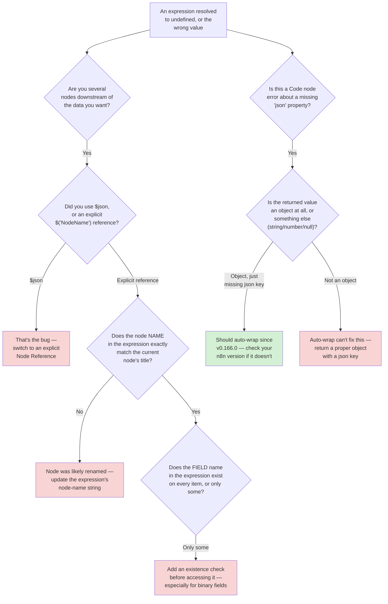
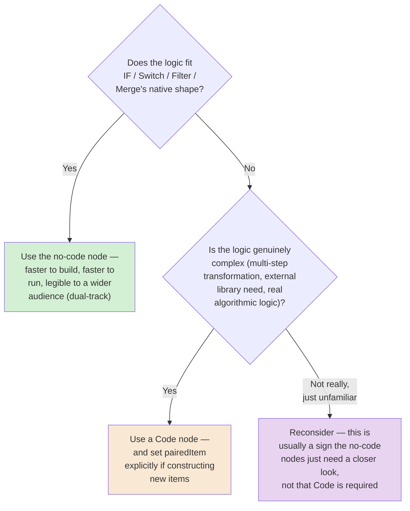

# Chapter 03 — The n8n Data Model and Expressions

## Learning Objectives

By the end of this chapter, you will be able to:

- Describe n8n's **items** data structure precisely: the array-of-objects shape, the required `json` key, the optional `binary` key, and the `pairedItem` lineage field most tutorials skip.
- Read and write n8n **expressions** using `{{ }}` syntax, including `$json`, `$binary`, `$input.item`/`.all()`/`.first()`/`.last()`, and the current syntax for referencing a specific earlier node's output.
- Explain why `$node["NodeName"]` syntax — which you will still see in older tutorials — is outdated, and what the current, correct syntax is.
- Use `$now` and `$today` correctly, knowing they return Luxon `DateTime` objects, not plain JavaScript `Date` objects.
- Choose correctly among the **IF**, **Switch**, **Merge**, and **Filter** nodes for a given branching, routing, combining, or discarding need.
- Write a Code node script that respects n8n's item-array return contract, including setting `pairedItem` correctly so data lineage survives a custom transformation.
- Explain what n8n's Code node does — and does not — forgive when a script's return value is malformed.
- Distinguish JavaScript and Python Code node syntax for the same expression variables (`$json` vs. `_json`), and state which language is self-hosted-only.

## Prerequisites

- **Chapters completed:** Chapter 01 (Automation Architecture) and Chapter 02 (Event-Driven Thinking and n8n's Trigger Model). This chapter assumes you can already build a trigger-started workflow with a few nodes; it does not re-teach trigger selection.
- **Tools installed:** The same n8n Cloud trial account or local instance from Chapters 01–02. No new tools required — the Code node used in this chapter's Advanced Implementation is built into n8n.
- **No prior n8n experience beyond Chapters 01–02 is assumed.**

## Estimated Reading Time

65–80 minutes

## Estimated Hands-on Time

2.5–3.5 hours

---

## ⚡ Fast Read

> **Skim time: 5 minutes** — Read this if you're in a hurry, returning for reference, or already familiar with part of this topic.

- **What it is:** The actual shape of the data flowing between every node you've built so far — the **items** array, the `{{ }}` expression syntax that reaches into it, and the four core nodes (IF, Switch, Merge, Filter) that split, route, combine, or discard items based on it.
- **Why it matters:** Every workflow in Chapters 01–02 moved data through nodes without ever examining what that data actually looks like. Once you start writing your own expressions or your own Code node logic, getting this model wrong produces a very specific, very common class of bug: the workflow runs successfully, produces no error, and quietly returns the wrong value — because you referenced the wrong node, the wrong key, or an optional field that wasn't actually there.
- **Key insight:** n8n's data model isn't "just JSON" — every item is `{ json, binary, pairedItem }`, and that third field, which almost no beginner tutorial mentions, is how n8n tracks *which specific input item produced this specific output item*. Ignore it while writing custom code and you silently break traceability without a single error appearing anywhere.
- **What you build:** A workflow using explicit node-reference expressions to build a personalized message, a support-ticket router using IF, Switch, and Filter side by side so you feel the difference between splitting, routing, and discarding, and a Code node that correctly preserves item lineage where a naive version would silently lose it.
- **Jump to:** [Core Concepts](#core-concepts) | [First Expressions](#beginner-implementation) | [Best Practices](#best-practices) | [Mini Project](#mini-project)

---

## Why This Topic Exists

Every workflow you built in Chapters 01 and 02 passed data from node to node without you ever having to think carefully about what that data actually was. A Set node "just worked." An HTTP Request node's response "just showed up" in the next node. That's by design — n8n hides the data model until you need it, which is exactly right for a first pass. But it stops being optional the moment you write your first real expression, branch on a condition, merge two data sources, or open the Code node — and every one of those things happens in essentially every real workflow past a certain complexity.

Here's the specific problem this chapter exists to solve: n8n's data model has a small number of precise rules, and almost every rule has a silent failure mode if you get it wrong. Reference a field that doesn't exist on every item, and some items quietly produce `undefined` instead of erroring. Reference `$json` several nodes downstream, and you get the *immediately preceding* node's data, not the original trigger data you might be picturing. Build new items in a Code node without thinking about it, and you silently lose the platform's own record of which input item produced which output — invisible until you need to debug exactly that, at which point it's gone. None of these mistakes throw a loud, obvious error. They all produce a workflow that appears to succeed while quietly doing the wrong thing, which is a categorically worse failure than a crash: a crash gets noticed.

This chapter's job is to make the data model visible and precise, on purpose, before you build anything complex enough for its invisible rules to bite you. Chapter 01 taught you to reason about *when* things run and whether they run safely more than once. Chapter 02 taught you to reason about *what triggers* a run. This chapter teaches you to reason about *what's actually inside* a run — the data itself, and the exact vocabulary n8n uses to reach into it.

## Real-World Analogy

Think about a shipping warehouse's conveyor belt, and the packages moving along it.

Every package on the belt has a **shipping label** — printed, structured information: recipient, address, order number, contents summary. That's your item's **`json`** — the structured data every item always has. Some packages, but not all, also have a **physical insert or attached item** taped to the outside — maybe a signature-required slip, maybe a fragile-handling sticker with an image on it. That's your item's **`binary`** field — present when there's actual binary content (a file, an image, a PDF) attached to that specific item, absent otherwise. And every package, if you look closely, also has a small **routing stub** stapled to the label — a reference back to *which incoming truck and which specific pallet* this package started on. That stub is your item's **`pairedItem`** — the thing that lets a warehouse worker (or n8n) answer "which original input produced this specific thing I'm holding right now?" even after the package has been relabeled, re-boxed, or combined with something else three stations down the line.

Now think about the different things that can happen to packages as they move down the belt. Sometimes a worker looks at a label and sends the package down one of two chutes depending on a single yes/no check — "is this marked fragile?" That's an **IF** node: one condition, two possible destinations. Sometimes a worker sorts packages into five or six different bins based on which *region* the label says — that's a **Switch** node: one value, many possible destinations. Sometimes two separate conveyor belts — one carrying package bodies, one carrying their matched invoices — need to be brought together into single, combined packages before shipping — that's a **Merge** node: multiple inputs becoming one combined output. And sometimes a worker just pulls damaged packages off the belt entirely and sets them aside, letting only the good ones continue — that's a **Filter** node: one input, either passed through or silently removed, no second belt for the rejects.

Every one of those workers is reading the shipping label to make their decision. **Expressions** are exactly that reading — the `{{ }}` syntax you'll use throughout this chapter is how a node's configuration reaches into a package's label (or another package's label, several stations back) to pull out the specific value it needs.

---

## Core Concepts

### Item

**Technical definition:** The fundamental unit of data in n8n — a single object with the shape `{ json, binary, pairedItem }`, where `json` is required, `binary` is optional, and `pairedItem` tracks data lineage. Data flows between nodes as an **array of items**, never as a single bare object.

**Plain English:** One "row" of data flowing through your workflow — like one package on the conveyor belt, carrying its own label and (sometimes) its own attachment.

**Analogy:** One package on the belt, complete with its shipping label and whatever's physically taped to it.

> This is worth stating precisely because it surprises people coming from general-purpose programming: even when a node produces exactly one result, n8n still wraps it in an array containing one item. A node that returns "nothing" still returns an empty array, not `null` or `undefined`. Expect the array, always.

### The `json` Key

**Technical definition:** The required field on every item, holding the item's structured data as a plain JavaScript object.

**Plain English:** The actual content of the package's shipping label — the real data you almost always care about.

**Analogy:** The shipping label itself.

### The `binary` Key

**Technical definition:** An optional field on an item, present only when actual binary content (a file, image, PDF, or similar) is attached — itself an object whose properties each contain `data` (Base64-encoded, required when present), plus optional descriptive fields like `mimeType`, `fileName`, and `fileExtension`.

**Plain English:** The physical thing taped to the package — sometimes there, sometimes not, and you can't assume either way without checking.

**Analogy:** The signature-required slip or fragile-handling insert — most packages don't have one; the ones that do, have specific, structured information about it (what kind of insert, how big, what format).

> **This is the single most common source of this chapter's central failure mode.** Code that unconditionally reaches for `$binary.data.fileName` on every item will throw (or silently produce garbage) the moment it hits an item that never had binary data in the first place. Always treat `binary` as something to check for, not something to assume — this chapter's own Production Issue below is built entirely around this exact mistake.

### Item Linking (`pairedItem`)

**Technical definition:** A field on each item recording which specific input item (by index, and optionally by source node) produced it — n8n's built-in data-lineage mechanism, used for tracing a value back to its origin and for accurate error attribution when something several nodes downstream fails.

**Plain English:** The routing stub that says "this specific package came from that specific truck and that specific pallet" — even after relabeling, combining, or transforming.

**Analogy:** A warehouse audit trail. If a customer complains their package arrived damaged, `pairedItem` is what lets you trace it back to exactly which incoming shipment it came from — not just "somewhere in this batch."

> Most of n8n's built-in nodes set `pairedItem` for you automatically. The Code node does **not** do this reliably for items you construct yourself from scratch — this is this chapter's single most under-taught detail, and you'll build a hands-on example of both the mistake and the fix in the Advanced Implementation section.

### Expression

**Technical definition:** A dynamic value embedded inside a node's field, written using `{{ ... }}` delimiters, evaluated at execution time against the current item's data, the outputs of other nodes, and a set of built-in helper variables.

**Plain English:** A fill-in-the-blank formula inside a field, instead of a fixed, hardcoded value.

**Analogy:** A mail-merge template field — `Dear {{ customer.first_name }}` — except n8n's version can reach much further than just "the current record": it can reach into any earlier node's output, the current date, the workflow's own metadata, and more.

### Node Reference

**Technical definition:** The expression syntax for reaching into a *specific, named* earlier node's output rather than the immediately-preceding node's — current syntax is `$('<node-name>').item.json` (function-call form, with the node's name as a string), with `.all()`, `.first()`, and `.last()` available as alternatives to `.item` for accessing multiple items from that node.

**Plain English:** "Go back and grab data from *that specific earlier step*, not just whatever fed directly into this one."

**Analogy:** Looking up a specific earlier pallet by its ID tag, rather than just grabbing whatever's on the belt directly behind you right now.

> **A precise, worth-memorizing correction:** older n8n tutorials (and a fair amount of content still circulating online) use `$node["NodeName"].json` — square-bracket, property-index syntax. **This is outdated.** The current, correct syntax is the function-call form shown above: `$('<node-name>')`. If you're following an older guide and an expression silently doesn't work the way the tutorial claims it should, this is one of the first things worth checking.

### Current Item Context

**Technical definition:** The default scope an unqualified expression variable (`$json`, `$binary`, `$input.item`) resolves against — always the item currently being processed by *this* node, fed by whatever node is directly connected upstream, **not** the workflow's original trigger data, no matter how many nodes back that was.

**Plain English:** `$json` always means "the data sitting in front of me right now," not "the data from way back at the start."

**Analogy:** A warehouse worker three stations down the belt who says "the label" — they mean the label on the package in front of them right now, which may have been completely rewritten by earlier stations. They don't mean the label the package arrived on the truck with, unless someone specifically preserved that.

> This is the single most common source of a very specific, very quiet bug: a builder writes `{{ $json.customer_email }}` in a node five steps downstream, expecting to reach the original trigger payload, when in fact `$json` at that point refers to whatever the *immediately preceding* node produced — which may not even have a `customer_email` field anymore if an intermediate node reshaped the data. The fix, once you know to look for it, is simple: use an explicit [Node Reference](#node-reference) — `$('Webhook Trigger').item.json.customer_email` — whenever you specifically mean "the data from that named node," rather than relying on context you have to mentally track across every node in between.

### Data Branching

**Technical definition:** The general operation of routing different items down different downstream paths based on a condition evaluated per item — implemented in n8n primarily by the **IF** node (one condition, two possible paths) and the **Switch** node (one value, many possible paths).

**Plain English:** Sending different data down different tracks depending on what's true about it.

**Analogy:** The worker sending fragile-marked packages down one chute and everything else down another (IF), versus the worker sorting packages into one of six regional bins based on a destination code (Switch).

### Data Merging

**Technical definition:** The general operation of combining items from more than one input into a single downstream stream — implemented in n8n by the **Merge** node, which supports several distinct combination strategies (covered concretely in this chapter's Intermediate and Advanced Implementation).

**Plain English:** Bringing two separate streams of data back together into one.

**Analogy:** The station where package bodies and their matching invoices, having traveled on separate belts, are reunited into single, complete shipments before the truck leaves.

### Filtering

**Technical definition:** The operation of keeping only items that satisfy a condition and silently discarding the rest — a single-output operation, structurally distinct from branching (which routes rejected items somewhere, rather than discarding them).

**Plain English:** Keeping only what you want, and just... not keeping the rest. No second path for the leftovers.

**Analogy:** The worker who pulls damaged packages off the belt entirely and sets them aside — there's no "damaged packages chute" feeding into the rest of the process; they simply stop being part of the flow.

> The distinction between Filtering and Data Branching matters more than it first appears: if you ever need to *do something* with the items that didn't match (log them, alert on them, route them somewhere else), a Filter node is the wrong tool — its rejected items don't go anywhere you can reach. An IF node routing "no" to a second path that logs and stops is the correct tool for that job. This exact confusion is this chapter's second Common Mistake below.

---

## Architecture Diagrams

### Diagram 1 — The Shape of an Item



Every node in every workflow you've built so far has been receiving and producing exactly this shape — an array of these three-field objects — even when the UI never showed you the array wrapper directly.

### Diagram 2 — Branch, Route, Merge, or Drop: Four Distinct Operations



Notice Filter's rejected branch is drawn as a dead end, not a second path — that's the structural difference from IF that this chapter keeps returning to.

## Flow Diagrams

### Diagram 3 — How an Expression Actually Resolves

This traces exactly what happens when n8n evaluates `{{ $('Fetch Order').item.json.customer_email }}` inside a node's field at execution time.



If any step in this chain fails — the node name doesn't match anything (commonly because it was renamed and the expression wasn't updated), the item doesn't exist at that path, or the field name is misspelled — the result is typically `undefined`, silently substituted into the field, not a loud error stopping the workflow. This is exactly why this chapter treats expression precision as a first-class engineering skill, not a minor syntax detail.

---

## Beginner Implementation

> **No-code path.** No coding required.

**Goal:** Build Aperture Cloud's "Personalized Welcome Message Generator" — a workflow using explicit expressions, including the current node-reference syntax, to build a dynamic message from two separate pieces of input data.

**Node by node:**

1. **Manual Trigger.** Your starting point for this exercise.
2. **Set node, named "Customer Info."** Rename it explicitly (click the node's title) — this matters, because you're about to reference it by name. Add two fields: `name` (a text value, e.g. `"Priya"`) and `plan_tier` (e.g. `"Pro"`).
3. **Set node, named "Build Message."** Connect it after "Customer Info." Add one field, `message`, and set its value to an **expression** (click the field, switch to expression mode, or type directly using `{{ }}`):
   ```text
   Hello {{ $('Customer Info').item.json.name }}! Your {{ $('Customer Info').item.json.plan_tier }} plan is active as of {{ $now.toFormat('DDDD') }}.
   ```
4. **Run it** and inspect the output. Notice two things happening at once: you used an explicit **Node Reference** (`$('Customer Info')`) even though "Customer Info" is the *immediately preceding* node — meaning `$json` would have worked identically here — specifically so you build the habit of reaching for the explicit form before you're several nodes deep and it actually matters. And you used `$now.toFormat('DDDD')`, which — per this chapter's Core Concepts — is a **Luxon** method, not a plain JavaScript `Date` method; try `$now.getDate()` instead and confirm it does *not* work, so you feel the distinction directly.

**What you just built, in this chapter's vocabulary:** A workflow using genuine **expressions** to reach into a specific, named node's **item**, pulling values out of its **`json`** key, formatted using Luxon's date API — the full expression-resolution chain from Diagram 3, built by hand.

---

## Intermediate Implementation

> **Introduces real multi-pattern design**, contrasting Branching, Merging, and Filtering directly. Still no custom code required.

**Goal:** Build Aperture Cloud's "Support Ticket Router" — a workflow that uses IF, Switch, and Filter side by side on the same incoming data, so you feel the structural difference between them directly.

**Node by node:**

1. **Manual Trigger**, followed by a **Set node** producing several sample tickets as separate items (use the Set node's "Add Item" capability, or a small Code node purely to generate test data — `return [{json:{id:1, category:'billing', vip:true, spam_score:0.1}}, {json:{id:2, category:'technical', vip:false, spam_score:0.9}}, ...]` with 4–5 varied sample tickets).
2. **Filter node**, first in the chain. Configure it to keep only items where `spam_score` is below `0.5`. Run it and confirm the high-spam-score item is simply **gone** from the output — no branch, no path, no trace of it in this execution's downstream flow. This is Filtering, structurally: a dead end for non-matches, exactly as Diagram 2 shows.
3. **IF node**, next. Configure a single condition: `vip` equals `true`. Confirm it produces **two outputs** — a true branch and a false branch — and that (unlike the Filter node) both branches are real, connectable paths.
4. **Switch node**, on the IF node's "true" (VIP) branch. Of the node's two current modes — **Rules mode** (build matching rules per output) and **Expression mode** (calculate the output index yourself) — use **Rules mode** here, with one rule per `category` value (`billing`, `technical`, `general`), routing each to its own output. Confirm Switch gives you as many outputs as you configured rules for — not just two.
5. **Merge node**, bringing the non-VIP path (from the IF node's false branch) back together with one of the Switch node's category outputs, using **Combine** mode, matching on the `id` field. Confirm the merged output correctly pairs items that share the same `id` from each input.

**What to notice, hands-on:** You just used four structurally different node types to do four structurally different things to the same underlying item shape — Filter permanently removed items, IF split into exactly two paths, Switch split into as many paths as you configured, and Merge brought separate paths back into one. None of them required a single line of custom code.

---

## Advanced Implementation

> **Engineering-depth path starts here.** Uses n8n's Code node (JavaScript, with a Python contrast) and directly exercises the `pairedItem` mechanism.

**Goal:** Build a Code node transformation that correctly preserves item lineage — then deliberately build the broken version, to see exactly what's lost.

```javascript
// Learning example — CORRECT: constructing new output items from an
// upstream item array, while explicitly preserving pairedItem lineage.
//
// Why this exists: any time a Code node builds brand-new items (rather
// than just modifying the existing ones in place), n8n has no way to know
// which input item(s) a given output item came from unless you tell it —
// and downstream error messages, data tracing, and the execution UI's
// "highlight the source item" feature all depend on this being set
// correctly.

const inputItems = $input.all();

return inputItems.map((item, index) => {
  return {
    json: {
      ticket_id: item.json.id,
      summary: `${item.json.category.toUpperCase()} ticket from ${item.json.vip ? 'a VIP' : 'a standard'} customer`,
    },
    pairedItem: { item: index },  // <-- explicitly links this output back
                                    //     to input item `index`. A bare
                                    //     number (`pairedItem: index`) also
                                    //     works and is a valid shorthand;
                                    //     the object form shown here is
                                    //     preferred once a node has more
                                    //     than one input to disambiguate
                                    //     (add `input: 0` alongside `item`).
  };
});
```

```javascript
// WRONG — the exact same transformation, but without pairedItem.
// This still runs successfully, produces no error, and LOOKS identical
// in a quick test. The difference only becomes visible when you try to
// trace a specific output value back to its source input — n8n's UI
// simply won't be able to show you which input item this came from, and
// any downstream node-level error attribution for this data silently
// degrades to "somewhere in this execution," not "this specific item."

const inputItems = $input.all();

return inputItems.map((item) => {
  return {
    json: {
      ticket_id: item.json.id,
      summary: `${item.json.category.toUpperCase()} ticket from ${item.json.vip ? 'a VIP' : 'a standard'} customer`,
    },
    // no pairedItem — silently loses lineage
  };
});
```

**Run both versions**, then open each execution's data view and try to use n8n's item-linking / "show source item" inspection feature on the output. Confirm the correct version lets you trace an output back to its input; confirm the broken version does not — with no error anywhere telling you this capability quietly stopped working.

**The Python contrast (self-hosted only):**

```python
# Learning example — Python Code node, self-hosted n8n ONLY. Python Code
# node execution is NOT available on n8n Cloud as of this chapter's
# verification — confirm current availability before relying on this in
# a Cloud-hosted workflow.
#
# Notice the naming convention: Python's Code node uses underscore-prefixed
# equivalents of the same JavaScript expression variables — _input instead
# of $input, _json instead of $json. Same concepts, different, deliberately
# distinct-looking syntax so you can tell at a glance which language a
# snippet is written in.

input_items = _input.all()

return [
    {
        "json": {
            "ticket_id": item["json"]["id"],
            "summary": f"{item['json']['category'].upper()} ticket",
        },
        "pairedItem": {"item": index},
    }
    for index, item in enumerate(input_items)
]
```

**The common mistake alongside the correct pattern:**

```text
WRONG: Assume the Code node will error loudly if you forget the `json`
wrapper on a returned item, the way a strict schema validator would.

RIGHT: Since n8n v0.166.0, the Code node auto-wraps a missing `json` key
and auto-wraps a non-array return value into an array — genuinely helpful,
but ONLY for that specific shape gap. It will NOT rescue a return value
that's fundamentally malformed (e.g., returning a bare string instead of
an object), and this auto-wrap behavior is specific to the Code node —
don't assume every node, especially community/custom nodes, is equally
forgiving.
```

**How to debug it when it breaks:** If you see the error `"All returned items have to contain a property named 'json'!"` despite believing you're on a current n8n version with the auto-wrap behavior, check whether the malformed value is something the auto-wrap genuinely can't fix — most commonly, returning something that isn't an object at all (a bare string, a number, `null`) rather than merely missing the `json` key on an otherwise-valid object.

**The production version, where it differs from the learning version:** The learning version above processes a small, known set of sample tickets. A production version handling real, unbounded input volume needs to consider the Performance Optimisation guidance below — specifically, whether per-item JavaScript logic in a loop is actually necessary, or whether the same transformation could be expressed using n8n's built-in nodes (Set, Filter, IF) operating natively across the whole item array, which is typically faster and, per this course's dual-track discipline, more accessible to a non-engineer maintaining the workflow later.

---

## Production Architecture

- **Expression complexity has a real maintainability ceiling.** A field containing a single, deeply nested, multi-line expression referencing four different named nodes is technically valid and will run correctly — but it's also exactly the kind of thing that's unreadable to the next engineer (or business user, per this course's dual-track discipline) who opens the workflow. Production n8n deployments generally push genuinely complex logic into a well-commented Code node rather than an increasingly elaborate inline expression, specifically for that readability reason — not because expressions have some hard technical limit.
- **`pairedItem` correctness matters more at scale, not less.** In a five-item test workflow, losing lineage tracking is barely noticeable. In a production workflow processing thousands of items per execution, losing `pairedItem` is the difference between "this specific customer's data failed to process, right here" and "something, somewhere in this batch of 4,000 items, failed" — a debugging cost that scales directly with volume.
- **Named node references create a real, if narrow, refactoring dependency.** Every `$('<node-name>')` expression is a live dependency on that node's exact current name. Production teams generally treat meaningful node renaming as a change that requires a deliberate search across the workflow's expressions, not a purely cosmetic edit — Chapter 08's modular workflow discipline returns to this concern at a larger scale.
- **Binary data in production items has real memory and storage implications**, covered properly in Chapter 16 (Scaling) — a workflow routinely carrying large binary payloads (attachments, images, generated files) through many unnecessary intermediate nodes has a real, measurable memory cost per execution that a workflow carrying only small `json` payloads doesn't.

---

## Best Practices

1. **Use explicit `$('<node-name>')` references whenever you mean a specific node's data, even if it's currently the immediately-preceding one.** Building this habit early (as this chapter's Beginner Implementation deliberately does) avoids the single most common expression bug: assuming `$json` reaches further back than it actually does.
2. **Always check for `binary`'s existence before accessing its contents.** Never write code or an expression that assumes every item has an attachment — this chapter's Production Issue below is exactly what happens when that assumption goes unchecked.
3. **Explicitly set `pairedItem` on any item your Code node constructs from scratch.** Modifying an existing item in place generally preserves lineage automatically; building a brand-new item object does not, unless you set it yourself.
4. **Reach for IF, Switch, Filter, and Merge before reaching for a Code node**, when the logic genuinely fits their shape — per this course's dual-track discipline, a no-code-visible branching/merging structure is legible to a wider audience than the equivalent JavaScript, and is very often just as fast to build.
5. **Never rely on `$node["NodeName"]` syntax from an older tutorial.** If you encounter it while learning from outside material, translate it mentally to the current `$('NodeName')` form before using it.
6. **Remember `$now`/`$today` are Luxon `DateTime` objects.** Reach for Luxon's own formatting and arithmetic methods (`.toFormat()`, `.plus()`, `.minus()`), not plain JavaScript `Date` methods, which will simply not exist on these objects.
7. **Name your nodes meaningfully, on purpose, before you start referencing them in expressions** — a node named "Set1" that you later reference six times as `$('Set1')` is a maintainability trap the moment you add a second Set node and have to disambiguate.

---

## Security Considerations

- **Expressions can inadvertently surface sensitive data into places you didn't intend.** A field or a Set node output containing an expression that resolves customer PII, an internal API response, or a credential-adjacent value is visible in n8n's execution log by default — treat what an expression resolves to as data that inherits the sensitivity of its source, not as "just a formatting step." Chapter 18 (Governance) covers this class of concern at full depth.
- **The Code node is, structurally, arbitrary code execution.** On a self-hosted instance, a Code node's JavaScript or Python runs with whatever permissions the n8n process itself has — this is a genuinely different risk profile from a no-code IF/Switch/Filter/Merge chain, and it's exactly why CLAUDE.md's own workflow discipline (and this course's Best Practices above) favor no-code nodes when they genuinely suffice. Chapter 14 (Custom Code Nodes) and Chapter 19 (Securing n8n) cover sandboxing and hardening in full depth — this chapter's job is only to flag that the distinction exists.
- **A `pairedItem` failure is a data-integrity concern, not just a debugging inconvenience, in regulated contexts.** If your organization needs to demonstrate exactly which input record produced a specific output record (a compliance or audit requirement), a Code node that silently drops lineage tracking is a real gap, not a cosmetic one — worth knowing before Chapter 18 covers governance and audit requirements directly.
- **The Merge node's SQL Query mode, specifically, is not a toy feature to reach for casually.** It's real, general-purpose SQL execution against your item data — and a real, patched, current vulnerability (**CVE-2026-33660**, CVSS 9.4, fixed in n8n 1.123.27 / 2.13.3 / 2.14.1) showed that unsandboxed SQL passed to this mode's underlying query engine could be abused by any authenticated member-role user to read arbitrary local files, including n8n's own encryption key — enabling decryption of every stored credential on the instance. If you're on an affected version and use SQL Query mode anywhere with input that isn't fully trusted, patching is not optional. Chapter 04 covers how encryption-key exposure compounds into full credential compromise; Chapter 19 covers this vulnerability class in full.

## Cost Considerations

Per Chapter 01's execution-based pricing model, restructuring a transformation between "many small built-in nodes" and "one larger Code node" does **not**, by itself, change your bill — both approaches still count as one execution. The real cost lever in this chapter's territory is different: **unnecessary work done per item, multiplied across every item in a large array.** A Code node performing an expensive, unnecessary operation inside a per-item loop (a redundant API call, heavy string processing) multiplies that cost by item count in a way a single, native, vectorized built-in node operation typically doesn't. On self-hosted instances specifically, this shows up as real CPU/memory cost on your own infrastructure (Chapter 15–16); on Cloud, execution *duration* can itself interact with plan-level constraints, so an inefficient per-item Code node loop is worth profiling before it ships at scale, even though it doesn't directly change your *execution count*.

**Free vs. paid, concretely for this chapter's concepts:** there is no cost difference between using IF/Switch/Filter/Merge and using an equivalent Code node on n8n Cloud's paid tiers — but Python Code node execution specifically requires self-hosting (per CLAUDE.md's standing note, re-confirmed current for this chapter), meaning a workflow that leans on Python-specific data-processing libraries is implicitly also a workflow that requires the self-hosted infrastructure cost discussed in Chapter 01 and Chapter 15, not just a Cloud subscription.

## Common Mistakes

**Mistake 1 — Assuming `$json` reaches back to the original trigger data.**

```text
WRONG: Five nodes into a workflow, write {{ $json.customer_email }}
expecting it to reach the original webhook payload from node 1.

RIGHT: {{ $json.customer_email }} always means "the immediately
preceding node's current item." To reach node 1's data specifically,
use an explicit Node Reference: {{ $('Webhook Trigger').item.json.customer_email }}
```

**Mistake 2 — Reaching for Filter when you actually need IF.**

```text
WRONG: Use a Filter node to separate VIP from non-VIP tickets, then
realize you also need to do something with the non-VIP ones — but
Filter's rejected items are gone, with no second path to connect to.

RIGHT: Use an IF node when you need to act on BOTH outcomes. Reserve
Filter specifically for cases where the non-matching items should be
discarded entirely, with nothing further to do with them.
```

**Mistake 3 — Unconditionally accessing `binary` fields.**

```text
WRONG: {{ $binary.attachment.fileName }}
// Throws or resolves to undefined for any item that never had an
// attachment in the first place — see this chapter's Production Issue.

RIGHT: Check for the field's existence first — in an IF node's condition,
or in a Code node with an explicit check — before assuming it's there:
if (item.binary && item.binary.attachment) { /* safe to use it */ }
```

**Mistake 4 — Constructing new Code node items without `pairedItem`.**

```text
WRONG: return [{ json: { summary: "..." } }];
// Runs fine. Silently loses lineage — see Advanced Implementation.

RIGHT: return [{ json: { summary: "..." }, pairedItem: { item: 0 } }];
```

**Mistake 5 — Treating `$now` like a plain JavaScript `Date`.**

```text
WRONG: {{ $now.getDate() }}
// $now is a Luxon DateTime — this method doesn't exist on it and will
// fail or resolve unexpectedly.

RIGHT: {{ $now.toFormat('yyyy-MM-dd') }}
// Use Luxon's own formatting API.
```

## Debugging Guide



| Symptom | Likely cause | Where to look |
|---|---|---|
| Expression resolves to blank/undefined, no error | Wrong scope assumption (`$json` vs. explicit node reference), or a renamed node breaking a hardcoded reference | The expression's exact node-name string vs. the actual current node title |
| `"All returned items have to contain a property named 'json'!"` | Code node returned something the auto-wrap genuinely can't fix (non-object, or from a community node without the same forgiving behavior) | The Code node's actual return value — log it before returning to inspect its real shape |
| Downstream node can't find which input item produced a value | Missing `pairedItem` on a Code-node-constructed item | The Code node's return statement — was `pairedItem` set explicitly? |
| Error or unexpected value referencing a `binary` field | Item never had binary data attached | Whether every item in this execution genuinely has an attachment, or only some do |
| `$now` method doesn't exist / behaves unexpectedly | Treating a Luxon `DateTime` as a plain JS `Date` | Luxon's own API documentation, not standard `Date` method references |

## Performance Optimisation

> The numbers below are **illustrative measurements from this chapter's own Aperture Cloud scenario**, not a published benchmark.

In an illustrative comparison for this chapter's Support Ticket Router scenario, scaled up to 5,000 sample items: a Code node performing the routing logic in a per-item JavaScript loop with an unnecessary redundant lookup inside the loop took roughly 4.2 seconds; the equivalent logic expressed using native IF/Switch/Filter nodes (which n8n can evaluate more directly across the item array, without the overhead of a general-purpose scripting loop) took roughly 0.6 seconds — a **~7x difference**, entirely attributable to the redundant per-item work inside the Code node loop, not to Code nodes being inherently slow. The general, transferable lesson: **when a transformation genuinely fits IF/Switch/Filter/Merge's native shape, using them is usually both more legible (per this course's dual-track discipline) and measurably faster than the equivalent hand-written per-item loop** — reach for the Code node when the logic genuinely doesn't fit that shape, not as a default first move.

---

## Technology Comparison — How Other Platforms Model the Same Data

| Platform | Core data unit | Branching/merging model | Notable framing |
|---|---|---|---|
| **n8n** | Items — `{ json, binary, pairedItem }`, always an array | IF/Switch (branch), Merge (combine), Filter (discard) as distinct, purpose-built nodes | Explicit lineage tracking (`pairedItem`) as a first-class, if under-taught, platform feature |
| **Zapier** | A single "bundle" of key-value fields per Zap run — no native concept of an array of many items flowing through one run the way n8n's items work | Paths (branching) and Filters (discarding) exist as distinct step types, conceptually similar to n8n's IF and Filter | Built around one bundle at a time by default; multi-item handling is comparatively less central to the platform's core mental model |
| **Make** | "Bundles" flowing through a scenario, broadly analogous to n8n's items | Routers (branching), Aggregators (combining many bundles into one) | Make's visual data-mapping panel makes the "what field came from where" question highly visible in the UI — a different, also-legible answer to the same traceability problem `pairedItem` solves |
| **Temporal / Windmill** | Whatever data structure the engineer's own code defines — no platform-imposed shape | Ordinary code — `if`/`switch` statements, array operations | No platform-level data model at all; the entire concern this chapter covers is simply general-purpose programming, for better (total flexibility) and worse (no built-in lineage tracking, no visual branching) |
| **Apache Airflow** | Task outputs passed via **XCom** ("cross-communication") — small, explicitly pushed/pulled key-value data between tasks | Python branching operators (e.g. `BranchPythonOperator`) choosing which downstream task(s) run | XCom is deliberately meant for small metadata, not large payloads — a genuinely different design philosophy from n8n's items, which routinely carry full business payloads between every node |

## Decision Framework — No-Code Nodes or a Code Node?



This chapter's version of the course's recurring heuristic: **a workflow maintained partly or wholly by a business user should lean as hard as possible on IF/Switch/Filter/Merge before reaching for a Code node** — every line of custom JavaScript or Python is a line only an engineer can confidently modify later. An engineering-owned workflow has more latitude to reach for Code sooner, but even then, this chapter's Performance Optimisation section shows the no-code path is very often not just more accessible but genuinely faster too.

---

## Real Client Scenario — Aperture Cloud's Ticket Router in Production

Aperture Cloud's support team adopted the Intermediate Implementation's ticket router pattern for real, connecting it to their actual ticket source. It worked well for the fields every ticket reliably had — category, VIP status, spam score. Then someone added a new capability: customers could attach a screenshot to a ticket, and the team wanted a Code node step that renamed and archived any attached screenshot with a consistent filename before filing the ticket. Because most tickets *did* have a screenshot in the team's early testing, the Code node's unconditional `item.binary.screenshot.fileName` access looked correct for weeks — every test ticket happened to have one. This is a genuinely low-stakes scenario in its worst case (a missed archival step, not a customer-facing failure) — consistent with this course's Module 1–2 discipline — but it's the exact, real mechanism behind this chapter's Production Issue below.

---

### Production Issue: The Attachment Processor That Silently Dropped Every Text-Only Ticket

**Symptoms**

Aperture Cloud's screenshot-archiving Code node began **failing silently for a growing fraction of incoming tickets** — the workflow's execution list showed real errors on affected executions, but because the archiving step was a late, non-critical stage of a longer workflow with no Error Workflow attached (a direct callback to Chapter 02's own central lesson), nobody noticed for several weeks. The team eventually discovered it only when auditing why a specific customer's screenshot was never archived despite the ticket clearly showing one had been attached — during which they discovered that *plenty* of other tickets, ones that had never had an attachment at all, had been failing this same node the entire time.

**Root Cause**

The Code node's archiving logic unconditionally accessed `item.binary.screenshot.fileName` on every incoming item, with no check for whether `binary` existed on that item at all. Per this chapter's Core Concepts, `binary` is genuinely optional — present only on items that actually carry attached file data. Text-only tickets (the majority of real support volume, it turned out — most customers described their issue in words, only some attached a screenshot) simply don't have a `binary` key at all, and accessing a property on `undefined` (`item.binary.screenshot`, when `item.binary` doesn't exist) threw an error on every single one of them.

**How to Diagnose It**

1. Open the execution list for the workflow, filter by failed executions, and inspect the failing node's error message — a "Cannot read properties of undefined (reading 'screenshot')" class of error is the direct signature of this exact mistake.
2. For a handful of failed executions, inspect the triggering item's raw data (the node just before the failing Code node) and confirm: does this item actually have a `binary` key at all?
3. Cross-reference the proportion of failing executions against the proportion of real tickets that come in without an attachment — if they roughly match, this confirms the diagnosis.

**How to Fix It**

```javascript
// BEFORE — unconditional access, throws on any item without binary data
const fileName = $json.binary.screenshot.fileName;
// (Code node context varies; the underlying mistake is the same whether
// accessed via $binary shorthand or item.binary in a loop — assuming
// existence without checking.)

// AFTER — explicit existence check first
const items = $input.all();

return items.map((item, index) => {
  const hasScreenshot = item.binary && item.binary.screenshot;

  return {
    json: {
      ...item.json,
      screenshot_archived: hasScreenshot ? true : false,
    },
    binary: hasScreenshot ? item.binary : undefined,
    pairedItem: { item: index },
  };
});
```

**How to Prevent It in Future**

Aperture Cloud's team adopted two standing rules directly from this chapter's Best Practices and Chapter 02's own lesson: **every Code node accessing a `binary` field must explicitly check for its existence first, full stop** — treated as a required code-review item, not a style preference — and **every production workflow, including "minor" late-stage steps like an archiving node, gets a real Error Workflow attached**, specifically so a class of failure like this one surfaces within hours, not weeks, the next time it happens for a different, unanticipated reason.

---

## Exercises

1. **(15 min) Predict the output.** Without running anything, write out what `{{ $json.a }}` versus `{{ $('Set Node 1').item.json.a }}` would each resolve to, given a workflow where Set Node 1 sets `a = 5`, and a second Set Node 2 (immediately before your expression) sets `a = 10`. Then build it and confirm.
2. **(20 min) Classify four operations.** For four transformations you can imagine needing in a real workflow, decide whether each is best solved with IF, Switch, Filter, or Merge, and justify each choice in one sentence.
3. **(30 min) Build the Beginner Implementation**, then deliberately rename the "Customer Info" node to something else, without updating the expression in "Build Message." Document exactly what happens.
4. **(60–90 min) Build the full Intermediate Implementation** (Filter → IF → Switch → Merge chain), and add a fifth sample ticket specifically designed to test an edge case of your choosing (e.g., a `category` value the Switch node's rules don't explicitly handle — what happens to it?).
5. **(60 min) Build both versions of the Advanced Implementation's Code node** (with and without `pairedItem`), and use n8n's item-linking inspection feature to directly observe the difference in traceability between the two.

## Quiz

**1. What are the three fields in n8n's item shape, and which one(s) are required?**
> `json` (required), `binary` (optional), `pairedItem` (used for lineage tracking, generally set automatically by built-in nodes but not automatically by custom Code node item construction).

**2. Why does data always flow between nodes as an array, even when there's only one result?**
> Because n8n's data model treats every node's input and output uniformly as an array of items, regardless of count — including zero (an empty array) or one (a single-element array) — so downstream nodes can rely on one consistent shape rather than needing to handle "sometimes an array, sometimes a bare object" as a special case.

**3. Five nodes into a workflow, what does an unqualified `$json` refer to?**
> The current item as produced by the immediately preceding node — not the original trigger data, no matter how many nodes back that was.

**4. What's the current, correct syntax for referencing a specific named node's output, and what older syntax does it replace?**
> `$('<node-name>').item.json` (function-call form) is current; it replaces the older `$node["NodeName"].json` (bracket-index form), which is outdated and still appears in older tutorials.

**5. Why can't you use plain JavaScript `Date` methods like `.getDate()` on `$now`?**
> Because `$now` (and `$today`) return Luxon `DateTime` objects, not plain JavaScript `Date` objects — they have their own distinct API (`.toFormat()`, `.plus()`, `.minus()`, etc.), and plain `Date` methods simply don't exist on them.

**6. What's the structural difference between an IF node's "false" branch and a Filter node's rejected items?**
> An IF node's false branch is a real, connectable output — you can do something with items that didn't match. A Filter node's non-matching items are discarded entirely, with no second path or output to route them to.

**7. What has to be true for a Code node's return value to trigger the "'All returned items have to contain a property named json'" error, given that n8n auto-wraps missing `json` keys since v0.166.0?**
> The returned value has to be something the auto-wrap genuinely can't fix — most commonly, not being an object at all (returning a bare string, number, or `null`), rather than merely being an object missing its `json` key.

**8. Why does a Code node that constructs new items without setting `pairedItem` still "work," in the sense of running without error?**
> Because `pairedItem` isn't required for the workflow to execute — it's a lineage-tracking feature, not a correctness requirement for the data itself. The item still has valid `json` and runs fine; what's lost is only n8n's ability to trace that output back to its specific source input, which has no effect on execution success or failure.

**9. Give an example of code that would break specifically because it assumes every item has a `binary` field, and explain the fix.**
> `item.binary.screenshot.fileName` accessed unconditionally — breaks on any item that never had an attachment, since `item.binary` is `undefined` for such items. The fix is an explicit existence check (`item.binary && item.binary.screenshot`) before accessing nested properties.

**10. Per this chapter's Cost Considerations, does splitting a transformation across many small built-in nodes versus one larger Code node change your n8n execution-based bill?**
> No — both approaches still count as a single execution under n8n's execution-based pricing. The real cost lever is unnecessary per-item work multiplied across a large item array, not the number of nodes used to express the logic.

## Mini Project

**Aperture Cloud's Order Confirmation Formatter (2–3 hours)**

Build a workflow that takes a small set of sample order records (Manual Trigger + a Set/Code node producing 4–5 sample orders as separate items, at least one missing an optional `notes` field and at least one with a simulated attachment) and formats a clean confirmation message for each.

**Requirements:**
- [ ] Use at least one explicit `$('<node-name>')` reference to pull data from a node that isn't the immediately preceding one.
- [ ] Use `$now` with correct Luxon formatting to include a formatted confirmation date.
- [ ] Use a Filter node to remove any test/invalid orders (define your own simple validity condition) before formatting.
- [ ] Handle the optional `notes` field safely — an order without one should not produce a broken or blank-looking message.
- [ ] If including the simulated attachment handling, explicitly check for `binary`'s existence before referencing it — do not reproduce this chapter's Production Issue.
- [ ] A one-paragraph written note explaining, in your own words, the difference between `$json` and an explicit Node Reference, using an example from your own workflow.

## Production Project

**Aperture Cloud's Multi-Source Ticket Consolidator (1–2 days)**

Design and build a workflow that ingests tickets from two simulated sources with **different field names for the same underlying concepts** (e.g., Source A uses `customer_email`, Source B uses `contact_email`), normalizes them into one consistent shape, routes them using IF and Switch based on derived properties, and merges in a simulated "customer account" lookup using the Merge node.

**Requirements:**
- [ ] A Code node that normalizes both sources into one consistent item shape, correctly setting `pairedItem` for every constructed item.
- [ ] At least one field that's genuinely optional on one source and present on the other — demonstrate safe handling (no unconditional access assuming its presence).
- [ ] An IF node splitting VIP vs. standard customers, followed by a Switch node further routing standard customers by a derived category.
- [ ] A Merge node combining ticket data with simulated account data, using a matching-fields strategy (not position-based pairing) — document why matching fields was the correct choice here over position-based merging.
- [ ] Deliberately build and run a broken version of one transformation (missing `pairedItem`, or an unconditional optional-field access) first, capture evidence of what breaks or silently degrades, then fix it and show the corrected behavior.
- [ ] A written comparison (300–500 words): where you chose a no-code node over a Code node and why, where you felt Code was genuinely necessary, and a measured (not estimated) performance comparison between at least one no-code approach and an equivalent Code node approach, using n8n's own execution duration data.

## Key Takeaways

- Every item in n8n has the shape `{ json, binary, pairedItem }` — `json` required, `binary` optional, `pairedItem` tracking lineage and easy to silently lose in custom code.
- Data always flows as an array of items, even when there's exactly one result.
- `$json` and other unqualified expression variables always resolve against the *current* node's input — not the original trigger data — no matter how many nodes back that was.
- The current, correct syntax for referencing a specific node is `$('<node-name>')`, replacing the outdated `$node["NodeName"]` syntax still seen in older tutorials.
- `$now`/`$today` are Luxon `DateTime` objects, not plain JavaScript `Date` objects, and require Luxon's own API.
- IF (two paths), Switch (many paths), Merge (combine), and Filter (keep-or-discard, no second path) are four structurally distinct operations — choosing the wrong one for a given need is a common, avoidable mistake.
- The Code node auto-wraps a missing `json` key and non-array returns since v0.166.0, but cannot rescue a fundamentally malformed return value.
- Constructing new items in a Code node requires explicitly setting `pairedItem` — it is not preserved automatically the way it is for built-in nodes modifying existing items.
- Unconditional access to optional fields (especially `binary`) is a common, silent-failure-prone mistake — always check for existence first.
- Splitting logic across many built-in nodes versus one Code node doesn't change execution-based cost — the real cost lever is unnecessary per-item work at scale.

## Chapter Summary

| Concept | Key Takeaway |
|---|---|
| Item | `{ json, binary, pairedItem }` — always inside an array, even for one result |
| `json` / `binary` | `json` required; `binary` optional — never assume its presence |
| `pairedItem` | Lineage tracking — set automatically by built-in nodes, must be set explicitly in custom Code node items |
| Expression | `{{ }}`-delimited dynamic value, evaluated against current item data and helper variables |
| Node Reference | `$('<node-name>')` — current syntax, replaces outdated `$node["NodeName"]` |
| Current Item Context | Unqualified `$json` always means "immediately preceding node," never "original trigger data" |
| Data Branching | IF (two paths) vs. Switch (many paths) |
| Data Merging | Merge node — Append, Combine, SQL Query, Choose Branch modes |
| Filtering | Single output, silent discard — structurally different from IF's two-path branch |

## Resources

- [n8n Data Structure documentation](https://docs.n8n.io/data/data-structure/) — the authoritative current description of the items/json/binary/pairedItem shape
- [n8n Expression Reference](https://docs.n8n.io/build/work-with-data/transform-data/expression-reference) — current, complete expression syntax
- [n8n "Reference data from other nodes" documentation](https://docs.n8n.io/build/work-with-data/reference-data/reference-previous-nodes) — the current node-reference syntax this chapter builds on
- [n8n IF node documentation](https://docs.n8n.io/integrations/builtin/core-nodes/n8n-nodes-base.if/)
- [n8n Switch node documentation](https://docs.n8n.io/integrations/builtin/core-nodes/n8n-nodes-base.switch/)
- [n8n Merge node documentation](https://docs.n8n.io/integrations/builtin/core-nodes/n8n-nodes-base.merge/)
- [n8n Filter node documentation](https://docs.n8n.io/integrations/builtin/core-nodes/n8n-nodes-base.filter/)
- [Luxon documentation](https://moment.github.io/luxon/) — the date/time library backing `$now`/`$today`
- Apache Airflow XCom documentation — referenced in this chapter's Technology Comparison as a structurally different cross-task data-passing model

## Glossary Terms Introduced

| Term | One-line definition |
|---|---|
| Item | The fundamental `{ json, binary, pairedItem }` unit of data flowing through n8n |
| `json` Key | The required, structured-data field on every item |
| `binary` Key | The optional field holding attached file data |
| `pairedItem` | The field tracking which input item produced a given output item |
| Expression | A `{{ }}`-delimited dynamic value evaluated at execution time |
| Node Reference | `$('<node-name>')` syntax for reaching a specific earlier node's output |
| Current Item Context | The default scope of unqualified expression variables — the immediately preceding node |
| Data Branching | Routing items down different paths based on a condition (IF, Switch) |
| Data Merging | Combining items from multiple inputs into one stream (Merge) |
| Filtering | Keeping matching items and silently discarding the rest (Filter) |

## See Also

| Topic | Related Chapter | Why |
|---|---|---|
| Automation Architecture | Chapter 01 | Execution-based pricing, reused directly in this chapter's Cost Considerations |
| Event-Driven Thinking and n8n's Trigger Model | Chapter 02 | The Error Workflow gap referenced in this chapter's Production Issue is Chapter 02's own central lesson, reused here |
| Connecting to the World — APIs, Webhooks, and Credentials | Chapter 04 | The HTTP Request node's response data is exactly the item shape this chapter defines — Chapter 04 shows where that data first enters a workflow |
| Data Transformation and Validation at Scale | Chapter 05 | Builds directly on this chapter's item model for schema mapping, batching, and pagination at real volume |
| Modular Workflow Design and Workflows as Code | Chapter 08 | Returns to this chapter's node-reference-as-dependency concern at the scale of entire reusable sub-workflows |
| Custom Code Nodes — JavaScript and Python | Chapter 14 | Goes deep on Code node sandboxing and security, previewed only briefly in this chapter's Security Considerations |

## Preparation for Next Chapter

**Technical checklist:**
- [ ] You've built and run the Beginner Implementation (Personalized Welcome Message Generator), using an explicit Node Reference at least once.
- [ ] You've built the full Filter → IF → Switch → Merge chain from the Intermediate Implementation.
- [ ] You've built both the correct and broken versions of the Advanced Implementation's Code node and observed the `pairedItem` difference directly.

**Conceptual check** — you should be able to answer, without looking back:
- Why does `$json` five nodes downstream not mean "the original trigger data"?
- What's the current, correct syntax for referencing a specific named node, and what outdated syntax does it replace?
- What's the structural difference between what happens to non-matching items in a Filter node versus an IF node's false branch?

**Optional challenge:** Before starting Chapter 04, look at any HTTP Request node response you've received in a previous chapter's exercises (or run a fresh one against any public API). Try to identify, in the raw execution data, exactly where the `json` key sits — you'll find out in Chapter 04 exactly how the HTTP Request node's response becomes this same item shape you've now spent a full chapter learning to navigate.

---

> **Currency Note:** This chapter's n8n-specific facts (the current `pairedItem` field, the current `$('<node-name>')` expression syntax replacing `$node[...]`, Luxon-backed `$now`/`$today`, the Code node's v0.166.0+ auto-wrap behavior, and the current IF/Switch/Merge/Filter node configurations including Switch's Rules/Expression modes and Merge's four current mode names) were verified directly against `docs.n8n.io` in July 2026. Expression syntax and node configuration options change as n8n ships new releases — always confirm current specifics against the official documentation before making a production decision based on this chapter.
