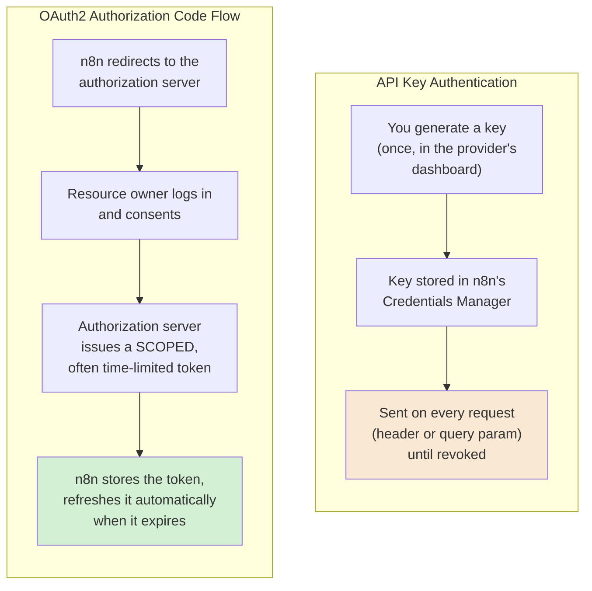
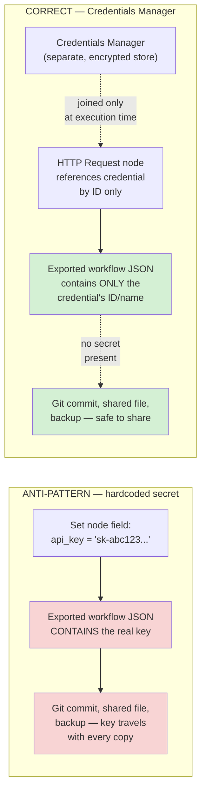
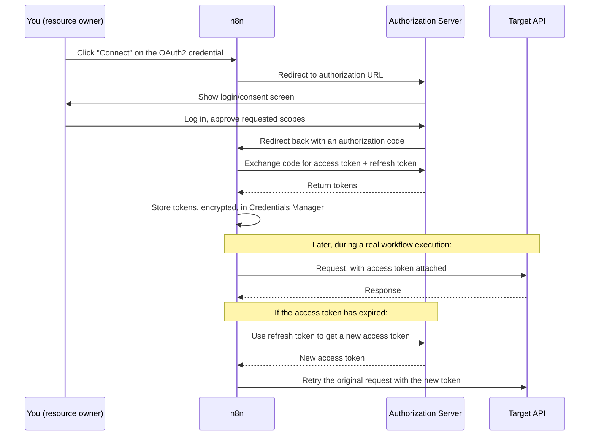
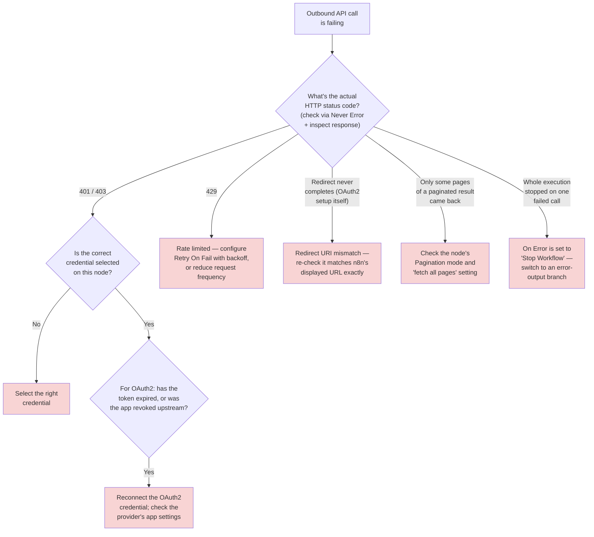
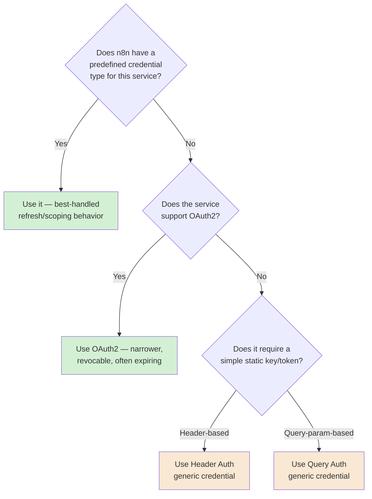

# Chapter 04 — Connecting to the World: APIs, Webhooks, and Credentials

## Learning Objectives

By the end of this chapter, you will be able to:

- Configure the **HTTP Request node** to call a real external API, choosing correctly between predefined and generic credential types.
- Explain n8n's current authentication tiers — Header Auth, Query Auth, Basic Auth, Digest Auth, OAuth1, OAuth2, and predefined per-service credentials — and pick the right one for a given API's requirements.
- Store and reuse secrets through the **Credentials Manager** instead of inlining them in a workflow, and explain concretely how n8n encrypts them at rest, both self-hosted and on Cloud.
- Configure **webhook authentication** (extending Chapter 01) using None, Basic, Header, or JWT auth, and explain when each is actually appropriate.
- Set up an **OAuth2 credential** end to end, including redirect URI configuration and choosing the correct grant type.
- Use the HTTP Request node's built-in **pagination** modes to retrieve a complete, multi-page dataset in a single node.
- Configure per-node **retry and error handling** (Retry On Fail, On Error modes) to build real resilience into outbound API calls — the calling-side mirror of Chapter 01's receiver-side delivery semantics.
- Explain why a real, current, patched n8n vulnerability rooted in the Merge node's SQL Query mode is directly relevant to how you think about credentials generally, not just about that one node.

## Prerequisites

- **Chapters completed:** Chapter 01 (Automation Architecture), Chapter 02 (Event-Driven Thinking and n8n's Trigger Model), Chapter 03 (The n8n Data Model and Expressions). This chapter assumes you're comfortable with triggers, items, and expressions; it does not re-teach them.
- **Tools installed:** The same n8n Cloud trial account or local instance from Chapters 01–03. For the hands-on sections, you'll want a free API key from a public API that offers one at no cost (this chapter uses a weather API and GitHub's public API as concrete, realistic examples — sign-up is free for both, and no payment details are required for the tiers this chapter uses).
- **No prior n8n experience beyond Chapters 01–03 is assumed.**

## Estimated Reading Time

70–85 minutes

## Estimated Hands-on Time

3–3.5 hours

---

## ⚡ Fast Read

> **Skim time: 5 minutes** — Read this if you're in a hurry, returning for reference, or already familiar with part of this topic.

- **What it is:** How a workflow actually reaches the outside world — the HTTP Request node, the full spectrum of authentication methods it supports, and n8n's Credentials Manager, which exists specifically so secrets never have to live inside a workflow's own definition.
- **Why it matters:** Every workflow in Chapters 01–03 either had no external dependency or used a no-auth public endpoint. Real automation almost always means calling something that requires proving who you are — and getting that wrong doesn't just break a workflow, it can leak a secret into a place (an exported JSON file, an execution log, a Git repository) that's far harder to clean up than to have prevented.
- **Key insight:** A credential and a workflow are, architecturally, two separate things in n8n on purpose — the workflow references a credential by ID, never by value, specifically so a workflow's JSON can be exported, version-controlled, or shared without ever carrying a secret inside it. Break that separation (by hardcoding a key into a Set node "just for testing") and you've silently defeated the entire design.
- **What you build:** A workflow calling a real public API with no auth, then with a simple API key via the Credentials Manager, then a workflow using OAuth2 end to end — plus a hands-on look at exactly how a real, current, patched n8n vulnerability turned a single unsandboxed query into full credential-database compromise.
- **Jump to:** [Core Concepts](#core-concepts) | [First API Call](#beginner-implementation) | [Best Practices](#best-practices) | [Mini Project](#mini-project)

---

## Why This Topic Exists

Every workflow you've built so far in this course has either needed no external system at all, or has called something that didn't ask who you were. That was deliberate — Chapters 01–03 had enough to teach without also teaching authentication. But it's also not how real automation works. The moment a workflow needs to read a customer record from a real CRM, post a real message to a real Slack workspace, or write a real row to a real database, it needs to prove its identity to that system — and that proof is a secret: an API key, a token, a password, something that must exist somewhere, be transmitted somewhere, and be protected everywhere in between.

This creates a genuine architectural tension that this chapter exists to resolve. A workflow's *definition* — its nodes, its connections, its logic — is something you want to be able to export, share, put in version control, and hand to a colleague. A *credential* is something you specifically never want any of those things to happen to. If n8n treated credentials the same way it treats every other piece of node configuration — stored inline, inside the workflow's own JSON — every one of those legitimate, desirable operations (export, share, version-control) would also mean leaking a secret. n8n's Credentials Manager exists precisely to break that coupling: a workflow references a credential by an opaque ID, the credential's actual secret value lives somewhere else entirely, encrypted, and the two are only ever joined together at the moment a node actually executes.

This chapter also exists because "connecting to the world" is where a huge fraction of real, serious automation security incidents actually originate — not in some exotic edge case, but in exactly the ordinary, everyday act of authenticating to an external system. This chapter's own Production Issue below is a real, current, patched n8n vulnerability that shows precisely how a single unsandboxed feature turned into full credential-database compromise — not a hypothetical, not an illustrative Aperture Cloud scenario, but a real CVE with a real CVSS score and a real patched version number. Understanding credentials correctly isn't a compliance checkbox for this chapter — it's the difference between an automation platform and a liability.

## Real-World Analogy

Think about the difference between carrying a physical key to a building and carrying a hotel key card.

A physical key is a **long-lived, static secret**: it opens the door, it doesn't expire, and if it's lost or copied, someone else can walk in indefinitely until you physically change the lock. This is your **API key** — a fixed string that proves who you are, valid until someone deliberately revokes it, and dangerous precisely because of how simple and durable it is: whoever has the string has the access, full stop, for as long as the string remains valid.

A hotel key card works differently. You don't get a copy of the master key — you go to a front desk (an **authorization server**), you prove who you are (check in, show ID), and the desk hands you a card that's been specifically, narrowly scoped: it opens *your room*, for *the duration of your stay*, and nothing else. Lose the card, and the front desk can deactivate that specific card without re-keying the whole building. This is **OAuth2**: instead of handing out a durable, all-access secret, a trusted third party (the authorization server) issues a narrowly-scoped, revocable, often time-limited token — and critically, the *thing doing the requesting* (your workflow) never actually sees your original password at all, the same way a hotel guest never sees the building's master key.

Now think about where you'd keep either of these when you're not using them. You wouldn't tape your house key to your front door — you keep it somewhere separate from the thing it protects. n8n's **Credentials Manager** is exactly that separate, locked drawer: your workflow — the equivalent of a note that says "use whatever key is in the drawer labeled 'Weather API'" — never actually contains the key itself, so handing someone a copy of your workflow (exporting it, sharing it, committing it to Git) never means handing them the key too.

---

## Core Concepts

### API (Application Programming Interface)

**Technical definition:** A defined, documented contract that lets one piece of software request data or trigger an action in another, over a network, using an agreed-upon format — most commonly, for the APIs this chapter covers, HTTP requests and JSON responses.

**Plain English:** A menu of specific things one system will let another system ask it to do, and the exact way to ask.

**Analogy:** A restaurant's menu — you don't walk into the kitchen and grab food yourself; you make a specific, formatted request ("one of item #4, no onions") through a defined channel (the waiter), and get back a specific, predictable response.

### HTTP Method (Verb)

**Technical definition:** The action type of an HTTP request — most commonly `GET` (retrieve data, no side effect), `POST` (create something, or trigger an action), `PUT`/`PATCH` (update something), and `DELETE` (remove something).

**Plain English:** What kind of thing you're asking the API to do, independent of which specific API you're calling.

**Analogy:** The difference between asking to *see* a menu item (`GET`), *order* a new one (`POST`), *change* your existing order (`PATCH`), and *cancel* it (`DELETE`) — the verb is what kind of interaction you're having, regardless of which restaurant you're in.

> Worth connecting directly back to Chapter 01: a `GET` request is, by convention, expected to be safe to repeat (asking to see the menu twice doesn't order two meals) — but a `POST` creating a new resource is exactly the kind of operation Chapter 01's idempotency discipline exists for. The HTTP method alone doesn't guarantee safety to retry; it's a strong hint about what to check.

### Authentication vs. Authorization

**Technical definition:** **Authentication** is proving *who you are*. **Authorization** is what you're *allowed to do*, once your identity is established. They're related but distinct — a system can authenticate you correctly and still refuse a specific action because you're not authorized for it.

**Plain English:** Authentication is showing your ID at the door. Authorization is whether your ID gets you into the VIP section, the kitchen, or just the dining room.

**Analogy:** Showing a hotel key card at the front desk (authentication: "yes, this is a real, valid card") is a different question from whether that specific card opens the executive lounge (authorization: "this card's specific permissions").

### Credential

**Technical definition:** A stored piece of information — a key, token, username/password pair, or certificate — that a workflow presents to prove its identity to an external system.

**Plain English:** The "thing you show" to prove you're allowed to talk to a given API.

**Analogy:** The hotel key card itself — the physical object, independent of which door it happens to open.

### Credentials Manager

**Technical definition:** n8n's dedicated subsystem for storing credentials separately from workflow definitions — encrypted at rest, referenced by workflows through an opaque ID rather than embedded by value, with its own access-control model independent of the workflows that use it.

**Plain English:** The locked drawer where every key lives, so a copy of your workflow never has to carry a copy of the key.

**Analogy:** The hotel's key-card system itself — cards are issued, tracked, and revoked centrally; a room's door doesn't "contain" the card, it just knows to accept a valid one when presented.

> This is the architectural fact this entire chapter is built around: **a workflow's exported JSON never contains a credential's actual secret value** — only a reference to which stored credential to use. This is precisely why the Beginner Implementation below deliberately shows you what happens when someone breaks this separation on purpose (hardcoding a key into a Set node instead), so you feel exactly what the Credentials Manager is protecting you from.

### API Key Authentication

**Technical definition:** An authentication scheme where a single, static secret string (sent as a header, a query parameter, or embedded in the request) proves identity — no exchange, no expiry (usually), no involvement from the resource owner at request time.

**Plain English:** The physical, durable building key from this chapter's analogy — simple, and simply dangerous if copied.

**Analogy:** A physical key: works until someone changes the lock, and anyone holding a copy has full access, indefinitely.

> n8n implements this through its **Header Auth** (the key sent as a custom header) and **Query Auth** (the key sent as a URL query parameter) generic credential types — you'll use both hands-on in this chapter's Beginner and Intermediate Implementation sections.

### OAuth2

**Technical definition:** A delegated authorization protocol in which a resource owner grants a client application a scoped, often time-limited **access token** — obtained through an exchange with an authorization server — without the client ever directly handling the resource owner's actual password.

**Plain English:** The hotel key-card system: a trusted third party issues you a narrow, revocable, expiring credential instead of handing over the master key.

**Analogy:** The front desk exchange itself — you prove who you are once, to the desk, and receive a purpose-built, limited card in return.

> n8n's OAuth2 credential type currently supports three grant types: **Authorization Code** (the standard human-in-the-loop redirect flow — what you'll build in this chapter's Advanced Implementation), **Client Credentials** (a service accessing its own resources, with no human or redirect involved), and **PKCE** (an Authorization Code extension adding protection against certain interception attacks). Choosing the right grant type depends entirely on what the target API supports and whether a human is meant to be part of the authorization step.

### Webhook Authentication

**Technical definition:** The authentication layer applied to an *inbound* trigger (Chapter 01's Webhook node), as distinct from the authentication a workflow uses when it makes an *outbound* call — the current options are None, Basic Auth, Header Auth, and JWT.

**Plain English:** The lock on your own front door, as opposed to the key you carry to get into someone else's building.

**Analogy:** This chapter's earlier hotel analogies were all about *your* workflow proving itself to *someone else's* API. Webhook authentication is the reverse direction — it's *your* workflow's own door, and deciding who gets to knock on it.

> Chapter 01 already covered the Webhook node's response modes; this chapter is where you actually configure the authentication side, hands-on, in the Intermediate Implementation.

### Pagination

**Technical definition:** The practice of splitting a large result set across multiple sequential requests, each returning one "page" of results, because returning everything in a single response would be impractical or is deliberately disallowed by the API provider.

**Plain English:** Getting a long list handed to you 20 items at a time instead of all 4,000 at once.

**Analogy:** A library card catalog that hands you drawer after drawer instead of dumping every card in the building on your desk at once — you keep asking for "the next drawer" until there isn't one.

### Retry Semantics (Outbound)

**Technical definition:** The policy governing what a *caller* does when an outbound request fails or times out — whether, how many times, and with what delay, it retries — the direct calling-side counterpart to Chapter 01's receiver-side delivery-semantics discussion.

**Plain English:** What your workflow does when the API it just called doesn't answer, or answers with an error.

**Analogy:** Chapter 01 taught you what happens when *someone else's* impatience causes *them* to retry calling *you*. This is the mirror image: what *your* workflow does when *it's* the impatient one, waiting on someone else's API.

> This is worth internalizing as a genuine callback: if your workflow retries a `POST` request that actually succeeded server-side but whose response was lost in transit, you've just created exactly the kind of duplicate-delivery risk Chapter 01 spent an entire chapter teaching you to guard against — except now *you're* the one causing it, not receiving it. The same idempotency discipline applies in both directions.

---

## Architecture Diagrams

### Diagram 1 — API Key vs. OAuth2, Structurally



The structural difference matters more than it looks: an API key is simple to set up and simple to leak — a static string, valid until someone remembers to revoke it. OAuth2 is more setup, but the token it issues is narrower in scope and often expires on its own, which limits the damage of a token that does leak.

### Diagram 2 — Where the Secret Actually Lives



This is the exact mechanism the Beginner Implementation walks you through building — and deliberately breaking — hands-on.

## Flow Diagrams

### Diagram 3 — OAuth2 Authorization Code Flow, End to End



Notice you, the resource owner, only ever type your actual password into the authorization server's own login page — never into n8n. That's the entire point of the delegation this chapter's Core Concepts describe.

---

## Beginner Implementation

> **No-code path.** No coding required.

**Goal:** Build Aperture Cloud's "Weather-Aware Notification Check" — first calling a real, public, no-auth API, then adding a real API key the correct way, then (deliberately, to feel the difference) the wrong way.

**Part A — no authentication at all:**

1. **Manual Trigger.**
2. **HTTP Request node.** Set the method to `GET` and the URL to a real, public, no-auth endpoint (for example, a public status or joke API that requires no signup). Leave Authentication set to "None." Run it and confirm you get a real response back — this is the simplest possible case: no credential, no Credentials Manager involvement, nothing to protect.

**Part B — a real API key, done correctly:**

3. Sign up for a free API key from a weather API (a real, commonly-used one that offers a genuinely free tier with no payment details required). You'll get a key that needs to be sent as a query parameter on every request.
4. In n8n, open **Credentials** and create a new credential of type **Query Auth**. Set the query parameter name (as the weather API's documentation specifies) and paste your real key as the value. Save and name it clearly, e.g. "Weather API Key."
5. **HTTP Request node**, configured to call the weather API's current-conditions endpoint for a city of your choice. Under Authentication, select **Generic Credential Type** → **Query Auth**, and choose the credential you just created — do **not** type the key directly into the URL field.
6. Run it and confirm real weather data comes back.

**Part C — the same call, done wrong, on purpose:**

7. Duplicate the workflow. In the duplicate, delete the credential reference and instead paste your real API key directly into the URL field as a literal query parameter.
8. **Export both workflows** (Download from the workflow menu) and open both JSON files in a text editor. Search each for your actual API key string.

**What to notice, hands-on:** The correct version's exported JSON contains only a reference to a credential name/ID — your real key is nowhere in the file. The "wrong, on purpose" version's exported JSON contains your real, live API key in plain text, exactly as Diagram 2 describes. **Revoke or regenerate that key now** if you actually used a real one for this exercise — you've just demonstrated, concretely, why this matters.

---

## Intermediate Implementation

> **Introduces webhook authentication, pagination, and retry handling together.** Still no custom code required.

**Goal:** Build a workflow that receives an authenticated webhook, calls a real paginated API with predefined-style Header Auth, and handles a failure gracefully instead of crashing the whole execution.

**Part A — an authenticated webhook:**

1. **Webhook Trigger.** Under Authentication, select **Header Auth**. Create a new Header Auth credential — pick a header name (e.g. `X-Aperture-Secret`) and a value only you know. This directly extends Chapter 01: the trigger itself now requires proof of identity before it'll process a request, closing the "anyone with the URL" exposure Chapter 01 flagged.
2. Test it two ways: call it once **without** the header (confirm it's rejected) and once **with** the correct header value (confirm it succeeds) — using any HTTP client (curl, or n8n's own test-call feature).

**Part B — a real, paginated, Header-Auth-secured API call:**

3. Create a free GitHub personal access token (read-only scope is sufficient for this exercise) and store it in n8n as a **Header Auth** credential, with header name `Authorization` and value `Bearer <your-token>`.
4. **HTTP Request node**, calling a real GitHub API endpoint that returns a paginated list (for example, listing a public repository's issues or a user's public repositories). Under Pagination, select **"Response Contains Next URL"** mode (GitHub's API includes pagination links in its response headers) — or **"Update a Parameter in Each Request"** if you'd rather practice manually incrementing a page number, depending on which the specific endpoint you choose supports. Configure it to fetch **all** pages, not just the first.
5. Run it and confirm you receive the complete result set, not just one page's worth — inspect the execution data to see how many actual HTTP calls the single node made to assemble the full result.

**Part C — retry and error handling:**

6. On the same HTTP Request node, open its **Settings** tab. Enable **Retry On Fail** with a small number of retries. Set **On Error** to **"Continue (using error output)"** rather than the default "Stop Workflow."
7. Add a simple node on the new error-output branch (a Set node building a short "API call failed, see execution log" message) so a real failure produces a visible, intentional outcome instead of silently halting.
8. Deliberately break it: temporarily point the URL at a nonexistent endpoint, run it, and confirm the error branch fires correctly instead of the whole execution simply stopping.

> **Test this specific combination before relying on it in production.** Multiple community reports describe an interaction quirk between **Retry On Fail** and the **Continue** / **Continue (using error output)** options, where a node can still report as errored even after a retry eventually succeeds. This isn't confirmed as official, documented platform behavior — but it's consistent enough across independent reports to be worth verifying directly against your own n8n version's actual behavior, rather than assuming the combination always works exactly as described above.

**What you just built, in this chapter's vocabulary:** A trigger secured with **webhook authentication**, an outbound call using a **predefined-style Header Auth credential** through the **Credentials Manager**, **pagination** assembling a complete dataset from a single node, and **outbound retry semantics** with an explicit, visible failure path — the calling-side mirror of Chapter 02's Error Workflow discipline, applied at the level of a single node instead of a whole workflow.

---

## Advanced Implementation

> **Engineering-depth path starts here.** Walks through a full OAuth2 setup and a hardening exercise — no custom code required for this chapter's core material.

**Goal:** Set up a real OAuth2 credential end to end, using the Authorization Code grant type, and understand exactly what n8n is doing on your behalf at each step of Diagram 3.

**Step 1 — register an OAuth application with a real provider.** Using a provider that offers free OAuth app registration (GitHub and Google both do), create a new OAuth application in that provider's developer settings. You'll be asked for a **redirect URI** — this is where Diagram 3's flow comes back to after the provider issues an authorization code.

**Step 2 — get n8n's redirect URI first.** In n8n, create a new credential of type **OAuth2 API** (or a provider-specific OAuth2 credential if one exists for your chosen provider). n8n displays its own **OAuth Redirect URL** on this credential's setup screen — copy this value and paste it into the provider's OAuth app settings from Step 1, *before* completing the rest of Step 1's registration. This ordering trips people up: the redirect URI has to match exactly, on both sides, or the flow fails at the final step.

**Step 3 — configure the grant type.** Set **Grant Type** to **Authorization Code**. Fill in the Authorization URL and Access Token URL (from the provider's OAuth documentation), and the Client ID/Client Secret from your Step 1 registration. Set the scopes to the minimum your workflow actually needs — per this chapter's Security Considerations below, requesting broader scopes than necessary is a real, avoidable risk, not just tidiness.

**Step 4 — connect.** Click "Connect my account" on the credential. You'll be redirected to the provider's real login/consent screen (exactly as Diagram 3 shows) — log in, approve the requested scopes, and confirm you're redirected back to n8n with the credential now showing as connected.

**Step 5 — use it.** Build an HTTP Request node against an endpoint that requires this OAuth2 credential, select it under Authentication, and confirm a real, authenticated call succeeds.

**The common mistake alongside the correct pattern:**

```text
WRONG: Assume an OAuth2 access token, once obtained, is valid forever —
build a workflow with no thought given to what happens when it expires.

RIGHT: n8n automatically attempts to use the stored refresh token to
obtain a new access token when the current one expires (per this chapter's
research, exact internal refresh mechanics aren't something you need to
hand-implement — n8n handles it). What you DO need to do: make sure the
OAuth application's granted scopes still include what your workflow needs
if the provider ever requires re-consent, and monitor for authentication
failures the same way you'd monitor any other outbound call failure (per
Chapter 02's Error Workflow discipline).
```

**How to debug it when it breaks:** If the OAuth2 connection fails at the redirect step, the single most common cause is a redirect URI mismatch — re-check that the URI pasted into the provider's app settings is character-for-character identical to what n8n displayed in Step 2. If a previously-working OAuth2 credential suddenly starts failing on real calls, check whether the provider's scopes changed, whether the OAuth app itself was revoked or deleted on the provider's side, or whether the refresh token itself has been invalidated (some providers expire refresh tokens after a long period of inactivity).

**The production version, where it differs from the learning version:** The learning version above uses one shared OAuth2 credential for a solo learning exercise. A production deployment needs to decide, deliberately, whether a given integration should authenticate as a *specific user* (an OAuth2 credential tied to one person's account, appropriate for "act on my behalf" scenarios) or as a *service identity* (a Client Credentials grant, or a dedicated service account's own OAuth app, appropriate when the automation shouldn't be tied to any one human's access) — Chapter 18 (Governance) covers this distinction, and its audit implications, in full depth.

---

## Production Architecture

- **Encryption key management is a real operational responsibility, not a set-and-forget default.** n8n auto-generates an encryption key on first launch — fine for a learning environment, but production deployments should set this explicitly via environment variable, confirmed current guidance, specifically because **every worker in a queue-mode deployment (Chapter 16) must be configured with the exact same encryption key** — an auto-generated, un-backed-up key on a single instance becomes a real, unrecoverable-credential-loss risk the moment you scale to more than one process.
- **Encryption key rotation is a real, current, built-in feature** — worth treating as a standing operational practice (rotate periodically, as defense in depth) rather than something you only think about after an incident like this chapter's Production Issue below.
- **Predefined vs. generic credential types have a real production maintenance difference.** A predefined, per-service credential type (built specifically for one API) generally handles that provider's specific quirks (token refresh timing, specific header formats) more robustly than the generic Header Auth/Query Auth/OAuth2 types — reach for the predefined type whenever one exists for your target service, and reserve the generic types for services n8n doesn't have a dedicated credential type for.
- **Credential sharing follows the same RBAC model as everything else** (Account Types and Role Types, covered in this course's governance material) — production teams generally scope who can *use* a credential separately from who can *see or edit* its actual secret value, so a workflow builder can be granted the ability to build against, say, a shared Slack credential without ever being able to view or export the underlying token.

---

## Best Practices

1. **Always use the Credentials Manager — never hardcode a secret into a Set node, a Code node, or directly into a URL field**, as this chapter's Beginner Implementation demonstrated the cost of, concretely.
2. **Prefer a predefined credential type over a generic one whenever n8n offers one for your target service** — you get better-handled refresh behavior and fewer manual configuration steps for free.
3. **Prefer OAuth2 over a long-lived API key whenever the target API supports it**, per this chapter's Core Concepts — a scoped, often-expiring token is a smaller, more self-limiting risk than a durable static string.
4. **Request the minimum OAuth2 scopes your workflow actually needs.** A workflow that only reads data has no business requesting write scopes "just in case" — narrower scopes mean a smaller blast radius if the credential is ever compromised.
5. **Configure Retry On Fail and a real On Error branch for every outbound call to a system you don't control.** A transient network blip or a brief upstream outage shouldn't take down an entire execution when a simple retry (and a visible failure path if retries are exhausted) would handle it gracefully.
6. **Treat outbound retries with the same idempotency discipline Chapter 01 taught for inbound duplicates.** Retrying a `POST` blindly can create the exact duplicate-side-effect problem Chapter 01's Production Issue was built around — just with your workflow as the cause instead of the victim.
7. **Set the encryption key explicitly, via environment variable, before you have more than one n8n process** — don't discover the "every worker needs the same key" requirement during an incident.
8. **Audit any community node that requests credential access before installing it**, per this chapter's Security Considerations — a malicious or compromised community node has direct access to whatever credentials a workflow using it can reach.

---

## Security Considerations

- **This chapter's headline lesson is a real, current, patched vulnerability — not a hypothetical.** **CVE-2026-33660** (CVSS 9.4 Critical) affected n8n's Merge node in **SQL Query mode**, which passes user-supplied SQL directly to the AlaSQL query library with no sandboxing. AlaSQL supports file-I/O primitives (`LOAD DATA INFILE`, `SELECT * FROM ? FILENAME`, `REQUIRE`) that let an authenticated user — a default **member**-role account, no elevated privileges required — read arbitrary local files on the n8n host, including the instance's own encryption key file and its SQLite database directly. With the encryption key in hand, an attacker can decrypt **every credential ever stored on that instance**. Affected versions: n8n prior to 1.123.27 (1.x branch), 2.0.0-rc.0 through before 2.13.3 (2.x branch), and the 2.14.0 beta. **Fixed in 1.123.27, 2.13.3, and 2.14.1.** This chapter's own Production Issue below walks through this incident in full. **Worth distinguishing explicitly from a separate, unrelated n8n vulnerability you'll see referenced elsewhere in this course**: "Ni8mare" (CVE-2026-21858) is a maximum-severity, fully *unauthenticated* remote-code-execution flaw — a structurally different vulnerability class (no login required at all, versus this CVE's authenticated-member-role starting point) that Chapter 19 covers as its own dedicated case study. Don't conflate the two; they're separate incidents with separate root causes.
- **A structurally separate threat: malicious community nodes as a supply-chain vector.** In January 2026, malicious npm packages were published as fake n8n community nodes — one specifically named to impersonate a legitimate Google Ads integration — designed to steal OAuth tokens from any workflow that installed them. This is a fundamentally different risk than the CVE above (malicious third-party code you chose to install, versus a vulnerability in n8n's own built-in node) but the underlying lesson is the same: an automation platform is, structurally, a centralized store of credentials, and anything with code-execution access inside it inherits access to whatever credentials it can reach. Never install a community node that requests credential access without verifying its publisher and reviewing what it actually does.
- **Webhook authentication and outbound authentication are two separate surfaces, and both matter.** Chapter 01 already covered the risk of an unauthenticated *inbound* webhook; this chapter adds the outbound side — a credential compromised through either surface (a leaked API key, a stolen OAuth token, a hijacked webhook) has real, if different, consequences, and both deserve equal attention, not just whichever one you happened to configure first.
- **Least-privilege OAuth2 scoping is a real security control, not just tidiness** — a workflow compromised while holding a broad, over-scoped token can do far more damage than one holding a narrowly-scoped one, even though the underlying vulnerability that led to the compromise might be identical either way.

## Cost Considerations

Two genuinely separate cost dimensions are in play whenever a workflow calls an external API, and it's worth keeping them distinct. The first is **n8n's own execution-based billing** (Chapter 01): a single HTTP Request node using built-in pagination to fetch 40 pages of results, or retrying a failed call three times before succeeding, still counts as **one execution** — pagination and retries happening inside a single node do not multiply your n8n bill the way separate workflow executions would. The second, entirely separate dimension is **the target API's own rate limits and pricing**, which n8n has no control over at all: a workflow that retries aggressively against a rate-limited API can trigger that provider's own throttling or overage charges, independent of anything n8n itself bills you for. A well-configured Retry On Fail with reasonable backoff protects against both — it keeps a transient failure from wasting a whole execution, and it avoids hammering a rate-limited provider hard enough to trigger their own penalties.

**Free vs. paid, concretely for this chapter's concepts:** the Credentials Manager, webhook authentication options, and OAuth2 support are all available on n8n's free self-hosted Community Edition — there's no cost tier gate on doing authentication correctly. The cost consideration in this chapter's territory is almost entirely on the *target API's* side (many APIs offer a free tier with rate limits, as this chapter's weather API and GitHub examples both do) rather than on n8n's.

## Common Mistakes

**Mistake 1 — Hardcoding a secret directly into a field instead of the Credentials Manager.**

```text
WRONG: HTTP Request node, URL = "https://api.example.com/data?api_key=sk-abc123..."

RIGHT: Store the key as a Query Auth credential; reference it by name in
the node's Authentication settings. See this chapter's Beginner
Implementation for the exact, felt difference in the exported JSON.
```

**Mistake 2 — Using a generic credential type when a predefined one exists.**

```text
WRONG: Manually configuring Header Auth for a service n8n has a dedicated,
purpose-built predefined credential type for — missing out on that
service's specific refresh/scoping handling.

RIGHT: Check for a predefined credential type first; fall back to
Header/Query/OAuth2 generic types only when no predefined option exists.
```

**Mistake 3 — No retry or error handling on an outbound call to a system you don't control.**

```text
WRONG: A single HTTP Request node with default settings (On Error: Stop
Workflow, no retry) calling a third-party API that occasionally has brief
outages — one blip halts the entire execution.

RIGHT: Configure Retry On Fail with a small number of attempts, and route
On Error to a visible, intentional error-output branch, per this chapter's
Intermediate Implementation.
```

**Mistake 4 — Requesting broader OAuth2 scopes than the workflow actually needs.**

```text
WRONG: Requesting full read/write access to an entire account when the
workflow only ever reads one type of data.

RIGHT: Request the narrowest scope the provider offers that still covers
the workflow's actual needs.
```

**Mistake 5 — Treating the Merge node's SQL Query mode as "just a query box."**

```text
WRONG: Passing user-influenced or otherwise untrusted input into SQL
Query mode without a second thought, on any n8n version.

RIGHT: Treat it with the same trust-boundary discipline as a Code node
(Chapter 03's Security Considerations) — and regardless, run a version
at or above 1.123.27 / 2.13.3 / 2.14.1, which patch CVE-2026-33660
directly.
```

## Debugging Guide



| Symptom | Likely cause | Where to look |
|---|---|---|
| `401 Unauthorized` | Wrong or missing credential selected on the node | The node's Authentication settings |
| `403 Forbidden` (credential is valid) | Credential's scopes/permissions don't cover this specific action | The credential's granted scopes, vs. what the API endpoint actually requires |
| `429 Too Many Requests` | Rate limit hit | Retry On Fail configuration, or overall call frequency |
| OAuth2 "Connect" redirect fails or loops | Redirect URI mismatch between n8n and the provider's app settings | n8n's displayed OAuth Redirect URL vs. exactly what's configured on the provider's side |
| Only the first page of a paginated result returns | Pagination not enabled, or "fetch all pages" not configured | The HTTP Request node's Pagination settings |
| One failed call stops the entire execution | `On Error` left at default "Stop Workflow" | The node's Settings tab |

## Performance Optimisation

> The numbers below are **illustrative measurements from this chapter's own Aperture Cloud scenario**, not a published benchmark.

In an illustrative comparison for this chapter's GitHub pagination exercise: fetching a 500-item result set using a page size of 10 took roughly 50 sequential page requests inside the single HTTP Request node's execution — noticeably slower, and more likely to hit a rate limit, than fetching the same 500 items using a page size of 100 (5 requests). Both approaches produce identical final data and both count as the same single n8n execution — the difference is entirely in wall-clock time and third-party rate-limit exposure. The general, transferable lesson: **when an API lets you choose a page size, choosing the largest size the API comfortably supports usually reduces both latency and rate-limit risk, at no cost to your own n8n execution count.**

---

## Technology Comparison — How Other Platforms Handle Credentials

| Platform | Credential storage model | Notable framing |
|---|---|---|
| **n8n** | Credentials Manager — encrypted at rest, referenced by ID, never embedded in workflow JSON | Encryption key is a real, explicit operational artifact you can rotate, and must be shared identically across queue-mode workers |
| **Zapier** | "Connections" — per-app authenticated accounts, managed centrally, reused across Zaps | Similar separation-of-secret-from-automation-definition philosophy to n8n's Credentials Manager |
| **Make** | "Connections" — comparable to Zapier's model, reused across scenarios | Same general architecture — credentials as a separate, referenced entity |
| **Windmill / Temporal** | No platform-native credential store by default — secrets typically come from environment variables or an external secrets manager (Vault, cloud provider secret stores) that the engineer's own code integrates with | A genuinely different philosophy: credential management is the engineering team's own responsibility, not a platform-provided abstraction |
| **Apache Airflow** | **Connections**, stored in Airflow's own metadata database, or delegated to a configured **Secrets Backend** (HashiCorp Vault, AWS/GCP/Azure secret managers) for production deployments | Airflow explicitly recommends a external Secrets Backend over its default metadata-database storage for production — a direct, citable parallel to this chapter's own "set the encryption key explicitly, don't rely on the default" guidance |

## Decision Framework — Choosing How to Authenticate



The recurring heuristic still applies underneath this decision: **who's maintaining this integration, and what happens if this specific credential is compromised?** A workflow maintained by a business user, integrating with a well-supported SaaS tool, should almost always land on a predefined credential type — it requires the least specialized knowledge and n8n has already done the hard part. An engineer integrating with a bespoke internal API with no predefined type has more latitude to reach for the generic types directly, but inherits more responsibility for getting scope and rotation right themselves.

---

## Real Client Scenario — Aperture Cloud's Partner Weather-Risk Feed

Aperture Cloud's operations team wanted an internal daily digest combining their own shipment schedule with a real weather-risk feed, to flag shipments that might be delayed by severe weather along their route. This is a genuinely low-stakes, internal-reporting scenario — the worst-case failure is a stale or missing internal report, not a customer-facing incident — consistent with this course's Module 1–2 discipline. The team built it using exactly this chapter's pattern: a Query Auth credential for the weather API (following the Beginner Implementation), an OAuth2 credential for their internal shipment-tracking system (following the Advanced Implementation, since that system required delegated, revocable access rather than a shared static key), and a Retry On Fail configuration on both outbound calls so a brief outage in either service wouldn't silently produce an incomplete morning digest.

---

### Production Issue: The Encryption Key That Was One SQL Query Away From Every Credential

**Symptoms**

This is one of the rarer, more instructive classes of production issue: **there were no operational symptoms to notice.** No failed executions, no error logs, no unusual latency — the entire attack surface was a feature working exactly as its (flawed) design intended, silently. The only way any organization running an affected version would have learned about this was through n8n's own security advisory and the resulting public disclosures (The Hacker News, CSO Online, SecurityWeek, and several independent security research outlets all corroborated the same technical details independently) — not through anything an engineer would have noticed in their own logs.

**Root Cause**

The Merge node's **SQL Query mode** (covered in this course's own Chapter 03) accepts arbitrary, user-supplied SQL and passes it directly to the **AlaSQL** library with no sandboxing or input restriction. AlaSQL supports file-I/O SQL extensions — `LOAD DATA INFILE`, `SELECT * FROM ? FILENAME`, and `REQUIRE` — that let a query reach outside the intended "combine my workflow's data" use case and instead read arbitrary files from the local filesystem. Because this required only a default **member**-role account (no admin or elevated privilege of any kind) and n8n's encryption key file and SQLite database both live on the same local filesystem the n8n process can read, a single crafted SQL statement in a Merge node could read the encryption key directly, and — with that key in hand — decrypt every credential ever stored on that instance: AWS keys, database passwords, OAuth tokens, third-party API keys, all of it. This is tracked as **CVE-2026-33660**, CVSS 9.4, affecting n8n versions prior to 1.123.27 (1.x), 2.0.0-rc.0 through before 2.13.3 (2.x), and the 2.14.0 beta.

**How to Diagnose It**

1. Check your running n8n version against the affected ranges above. If you're on a patched version (1.123.27+, 2.13.3+, or 2.14.1+), you are not vulnerable to this specific CVE — but see "How to Prevent It" below regardless.
2. If you were ever on an affected version, audit every workflow across your instance for any use of the Merge node's **SQL Query** mode, and review exactly what SQL those workflows execute and where its inputs come from — specifically, whether any of that SQL is influenced by data from outside your organization's direct control (an external API response, user-submitted form data, an untrusted webhook payload).
3. Review instance-level access logs, if available, for any member-role account executing unusual Merge node activity, especially anything referencing file paths or the SQL keywords named above.

**How to Fix It**

```text
IMMEDIATE:
1. Upgrade to a patched version: 1.123.27 (1.x), 2.13.3 (2.x), or 2.14.1.
2. Because a patch fixes the vulnerability going forward but cannot undo
   a potential PRIOR compromise, treat any instance that was ever on an
   affected version as needing defense-in-depth follow-up, not just a
   version bump:
3. Rotate the instance's encryption key (n8n's built-in encryption-key-
   rotation feature, referenced in this chapter's Production Architecture).
4. Rotate every credential that instance ever stored — API keys, OAuth
   tokens (revoke and reconnect), database passwords — since a key that
   may have already been exfiltrated before patching can still decrypt
   OLD backups or database copies even after rotation going forward.
```

**How to Prevent It in Future**

Aperture Cloud's team adopted three standing practices directly from this incident, consistent with this chapter's Best Practices: **treat any "raw code or raw query" input surface — the Merge node's SQL Query mode, the Code node, anything accepting arbitrary expressions from a source you don't fully control — with the same trust-boundary discipline, regardless of which specific node it happens to be**; **subscribe to n8n's own security advisories and patch on a defined cadence**, rather than discovering vulnerabilities via a general security news cycle after the fact; and **rotate the encryption key on a standing schedule, as defense in depth, independent of any specific known vulnerability** — the same way you'd rotate any other long-lived secret, on principle, not only in reaction to a disclosed incident.

---

## Exercises

1. **(20 min) Build Part A and Part B of the Beginner Implementation.** Confirm a real API call succeeds using a Query Auth credential, and locate the credential reference (not the actual key) in the exported workflow JSON.
2. **(15 min) Reproduce Part C on purpose**, inspect both exported JSON files side by side, and write two sentences describing exactly what you see differently.
3. **(45 min) Build the Intermediate Implementation's authenticated webhook**, and test both the rejected (no header) and accepted (correct header) cases, documenting the exact response n8n gives for each.
4. **(60–90 min) Build the full Intermediate Implementation**, including pagination and the Retry On Fail / error-output branch, and deliberately break the URL to confirm the error path fires correctly.
5. **(60–90 min) Complete the Advanced Implementation's full OAuth2 setup** with a real provider, and write a short note on what happened at the redirect step and how you'd recognize a redirect URI mismatch if you hit one.

## Quiz

**1. What's the architectural reason n8n stores credentials separately from workflow definitions, rather than as part of a node's own configuration?**
> So that a workflow's exported/shared/version-controlled JSON never contains a secret value — only a reference (by ID/name) to a credential stored elsewhere, encrypted, and joined to the workflow only at execution time.

**2. What's the key structural difference between an API key and an OAuth2 access token?**
> An API key is typically a static, durable secret valid until manually revoked, with no built-in scoping mechanism. An OAuth2 access token is issued by a trusted authorization server, is typically narrowly scoped and often time-limited/expiring, and is obtained through an exchange rather than being a fixed, unchanging string.

**3. Why does a `POST` request retried by your own workflow raise the same concern Chapter 01 covered for inbound webhook retries?**
> Because retrying a request that may have already succeeded server-side (even if its response was lost in transit) can create a duplicate side effect — the exact risk Chapter 01's idempotency discipline addresses, just with your workflow now playing the role of the retrying caller instead of the receiver.

**4. What are n8n's current three OAuth2 grant types, and when would you use each?**
> Authorization Code (standard human-in-the-loop redirect flow, for delegated access to a specific user's resources), Client Credentials (a service authenticating as itself, no human/redirect involved), and PKCE (an Authorization Code extension with additional protection against interception attacks).

**5. Why does the ordering matter when setting up an OAuth2 credential — copying n8n's redirect URI into the provider's app settings before finishing registration?**
> Because the redirect URI configured on the provider's side must exactly match what n8n actually uses, or the authorization flow fails at the final redirect step — getting this out of order is one of the most common OAuth2 setup mistakes.

**6. What's the difference between the two cost dimensions this chapter discusses for outbound API calls?**
> n8n's own execution-based billing (a node's internal pagination/retries within one execution don't multiply your n8n bill) versus the target API's own rate limits and pricing (which n8n has no control over, and which aggressive retrying can trigger independent of anything n8n itself charges).

**7. What specifically made CVE-2026-33660 possible, mechanically?**
> The Merge node's SQL Query mode passed user-supplied SQL unsandboxed to the AlaSQL library, whose file-I/O primitives (`LOAD DATA INFILE`, `SELECT * FROM ? FILENAME`, `REQUIRE`) let an authenticated member-role user read arbitrary local files, including n8n's own encryption key — enabling decryption of every stored credential.

**8. Why isn't simply upgrading to a patched version sufficient remediation for an instance that was previously vulnerable to CVE-2026-33660?**
> Because a patch prevents future exploitation but cannot undo a potential prior compromise — if the encryption key was already exfiltrated before patching, an attacker could still decrypt old backups or database copies. Rotating the encryption key and every stored credential is necessary follow-up, not just the version upgrade.

**9. Why is requesting broad OAuth2 scopes "just in case" a real risk, not just an untidy habit?**
> Because scope defines the blast radius of what a compromised credential can do — a workflow holding an over-scoped token can cause far more damage if compromised than one holding a narrowly-scoped token, even if the underlying vulnerability that led to compromise is identical either way.

**10. What's the difference in threat model between CVE-2026-33660 and the January 2026 malicious-community-node supply-chain attack, even though both ultimately threaten credentials?**
> CVE-2026-33660 is a vulnerability in n8n's own built-in Merge node — a flaw in software you didn't choose to add. The community-node attack is malicious third-party code an organization actively chose to install. Different origin, same underlying lesson: anything with code-execution access inside n8n inherits access to whatever credentials it can reach.

## Mini Project

**Aperture Cloud's Authenticated Status Digest (2–3 hours)**

Build a workflow that calls at least two different real external APIs — one using a Query Auth or Header Auth credential, one using OAuth2 — and combines their results into a single formatted digest.

**Requirements:**
- [ ] Both API calls use credentials stored in the Credentials Manager — no hardcoded secrets anywhere in the workflow.
- [ ] At least one call has Retry On Fail configured with a real, tested error-output branch (deliberately break it once to prove the branch works, then restore it).
- [ ] Export the finished workflow's JSON and confirm, by inspection, that no real secret value appears anywhere in the file.
- [ ] A one-paragraph written note explaining which credential type you chose for each API and why, using this chapter's Decision Framework.

## Production Project

**Aperture Cloud's Partner Integration Hardening Exercise (1–2 days)**

Design and build a workflow integrating with a real, OAuth2-supporting API of your choice, following this chapter's Advanced Implementation exactly, then deliberately audit it against this chapter's Security Considerations.

**Requirements:**
- [ ] A working OAuth2 credential, using the Authorization Code grant, with scopes limited to only what the workflow actually needs (document what you excluded and why).
- [ ] A working, tested Retry On Fail + error-output branch on every outbound call in the workflow.
- [ ] A paginated call (real or simulated against a paginated public API) correctly configured to retrieve a complete dataset, with a measured (not estimated) comparison of total execution time at two different page sizes, using n8n's own execution duration data.
- [ ] A written security audit (300–500 words) of your own workflow: what would happen if this specific OAuth2 credential were compromised, given the scopes you requested; whether any part of the workflow uses the Merge node's SQL Query mode (and if so, whether its inputs are trustworthy); and one concrete change you'd make before considering this workflow production-ready.
- [ ] A written comparison to this chapter's Production Issue: in your own words, explain how the "credential exposure via an unexpected feature, not the credential system itself" pattern in CVE-2026-33660 could show up in a different node or platform, even after this specific CVE is patched.

## Key Takeaways

- A workflow's definition and its credentials are architecturally separate in n8n, by design — a workflow references a credential by ID, never by embedded value, so exporting or sharing a workflow never means leaking a secret.
- API key authentication is simple and durable, and durability is exactly what makes a leaked key dangerous — there's no built-in expiry or narrow scoping.
- OAuth2 trades setup complexity for a narrower, often-expiring, revocable token, obtained without the client ever seeing the resource owner's actual password.
- Webhook authentication (inbound) and outbound API authentication are two separate surfaces, both worth securing — Chapter 01 covered the first, this chapter covers the second.
- Pagination and outbound retries both happen inside a single n8n execution — they don't multiply your n8n bill, but retries can still trigger a third-party API's own rate limits.
- Retrying an outbound `POST` blindly can create the same duplicate-side-effect risk Chapter 01 taught you to guard against as a receiver — the idempotency discipline applies in both directions.
- Predefined credential types should be preferred over generic ones whenever n8n offers one for your target service.
- CVE-2026-33660 is a real, current, patched vulnerability showing that credential exposure doesn't require a flaw in the credential system itself — an unsandboxed feature elsewhere on the same instance was enough.
- Patching a known vulnerability is necessary but not sufficient if the instance was ever exposed — rotating the encryption key and all stored credentials is real, required follow-up.
- The OAuth2 redirect URI must match exactly between n8n and the provider's app settings — this is the single most common OAuth2 setup failure.

## Chapter Summary

| Concept | Key Takeaway |
|---|---|
| Credentials Manager | Encrypted, separate storage — workflows reference credentials by ID, never by embedded value |
| API Key Authentication | Simple, durable, static — dangerous precisely because it's durable if leaked |
| OAuth2 | Delegated, scoped, often-expiring access — three grant types: Authorization Code, Client Credentials, PKCE |
| Webhook Authentication | The inbound-trigger security surface (Chapter 01), distinct from outbound authentication |
| Pagination | Assembling a complete dataset across multiple requests within a single n8n execution |
| Retry Semantics (Outbound) | The calling-side mirror of Chapter 01's receiver-side delivery semantics |
| CVE-2026-33660 | Real, patched vulnerability — Merge node SQL Query mode enabled encryption-key theft and full credential compromise |
| Cost | n8n execution-based billing vs. the target API's own separate rate limits — two distinct cost dimensions |

## Resources

- [n8n HTTP Request node documentation](https://docs.n8n.io/integrations/builtin/core-nodes/n8n-nodes-base.httprequest/) — current authentication tiers, pagination modes, and response options
- [n8n OAuth2 credential documentation](https://docs.n8n.io/integrations/builtin/credentials/httprequest/) — current grant types and redirect URI setup
- [n8n encryption key documentation](https://docs.n8n.io/hosting/configuration/configuration-examples/encryption-key/) — setting the encryption key explicitly
- [n8n encryption key rotation documentation](https://docs.n8n.io/hosting/securing/encryption-key-rotation/) — the built-in rotation feature referenced in this chapter's Production Architecture
- [Geordie.ai technical advisory on CVE-2026-33660 and related March 2026 n8n vulnerabilities](https://www.geordie.ai/resources/technical-advisory-n8n---multiple-vulnerabilities---march-2026/) — the primary technical source for this chapter's Production Issue
- The Hacker News, CSO Online, SecurityWeek — independent corroborating coverage of the March 2026 n8n vulnerability disclosures
- Apache Airflow Connections and Secrets Backend documentation — referenced in this chapter's Technology Comparison

## Glossary Terms Introduced

| Term | One-line definition |
|---|---|
| API | A defined contract letting one system request data or action from another |
| HTTP Method | The action type of a request — GET, POST, PUT/PATCH, DELETE |
| Authentication vs. Authorization | Proving who you are, vs. what you're allowed to do once identified |
| Credential | A stored secret proving identity to an external system |
| Credentials Manager | n8n's encrypted, separate credential store, referenced by workflows via ID |
| API Key Authentication | A static, durable secret string proving identity |
| OAuth2 | A delegated authorization protocol issuing scoped, often-expiring tokens |
| Webhook Authentication | The security layer on an inbound trigger — None/Basic/Header/JWT |
| Pagination | Splitting a large result set across multiple sequential requests |
| Retry Semantics (Outbound) | The calling-side policy for handling a failed or timed-out outbound request |

## See Also

| Topic | Related Chapter | Why |
|---|---|---|
| Automation Architecture | Chapter 01 | Idempotency and delivery semantics, reused here for outbound retry discipline; webhook response modes, extended here with authentication |
| Event-Driven Thinking and n8n's Trigger Model | Chapter 02 | The Error Workflow discipline this chapter's error-output branches directly extend to the single-node level |
| The n8n Data Model and Expressions | Chapter 03 | The Merge node's SQL Query mode, central to this chapter's Production Issue, was taught there |
| Data Transformation and Validation at Scale | Chapter 05 | Builds on this chapter's HTTP Request/pagination coverage for handling malformed or incomplete API responses at real volume |
| Scaling n8n in Production | Chapter 16 | Queue-mode's shared-encryption-key requirement, referenced in this chapter's Production Architecture, covered in full |
| Governance and Compliance | Chapter 18 | Credential sharing/RBAC and the user-identity-vs-service-identity distinction, previewed in this chapter's Advanced Implementation |
| Securing n8n in Production | Chapter 19 | Covers CVE-2026-21858 ("Ni8mare") and the full current vulnerability landscape, including this chapter's CVE-2026-33660, in complete depth |

## Preparation for Next Chapter

**Technical checklist:**
- [ ] You have at least one working credential in n8n's Credentials Manager for a real external API (from this chapter's Beginner Implementation).
- [ ] You've built and tested the Intermediate Implementation's authenticated webhook, pagination, and retry/error-branch combination.
- [ ] You've completed a real OAuth2 setup end to end, or understand exactly where and why it would fail if the redirect URI were misconfigured.

**Conceptual check** — you should be able to answer, without looking back:
- Why does a workflow's exported JSON never contain a real credential value, architecturally?
- What's the practical difference between n8n's own execution-based billing and a third-party API's rate limits, when it comes to pagination and retries?
- What specifically made CVE-2026-33660 possible, and why wasn't patching alone sufficient remediation for a previously-exposed instance?

**Optional challenge:** Before starting Chapter 05, take one of this chapter's HTTP Request nodes and deliberately feed it a response you know is malformed (point it at an endpoint that returns HTML instead of JSON, or a 404 page). Watch what happens to the data your next node receives. Chapter 05 is built entirely around handling exactly this class of problem correctly, at real scale — see how far your intuition gets you first.

---

> **Currency Note:** This chapter's n8n-specific facts (HTTP Request node authentication tiers and pagination modes, current On Error/Retry On Fail options, Credentials Manager encryption mechanics including the queue-mode shared-key requirement, OAuth2's three current grant types, and CVE-2026-33660's technical details and patched version numbers) were verified directly against `docs.n8n.io` and multiple independent security research outlets in July 2026. n8n's security advisory landscape specifically changes fast — always confirm current patched-version status against `docs.n8n.io` and n8n's own security advisories before making a production decision based on this chapter.
