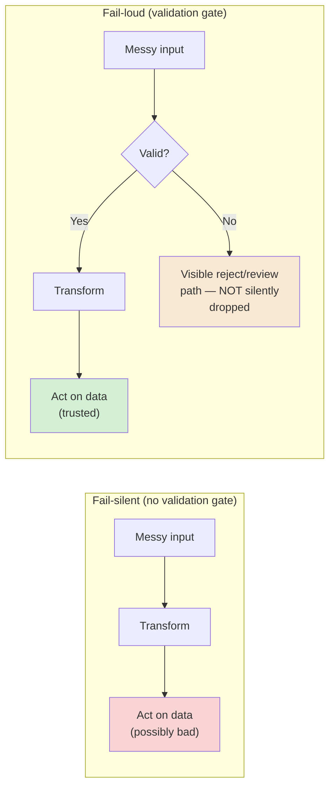
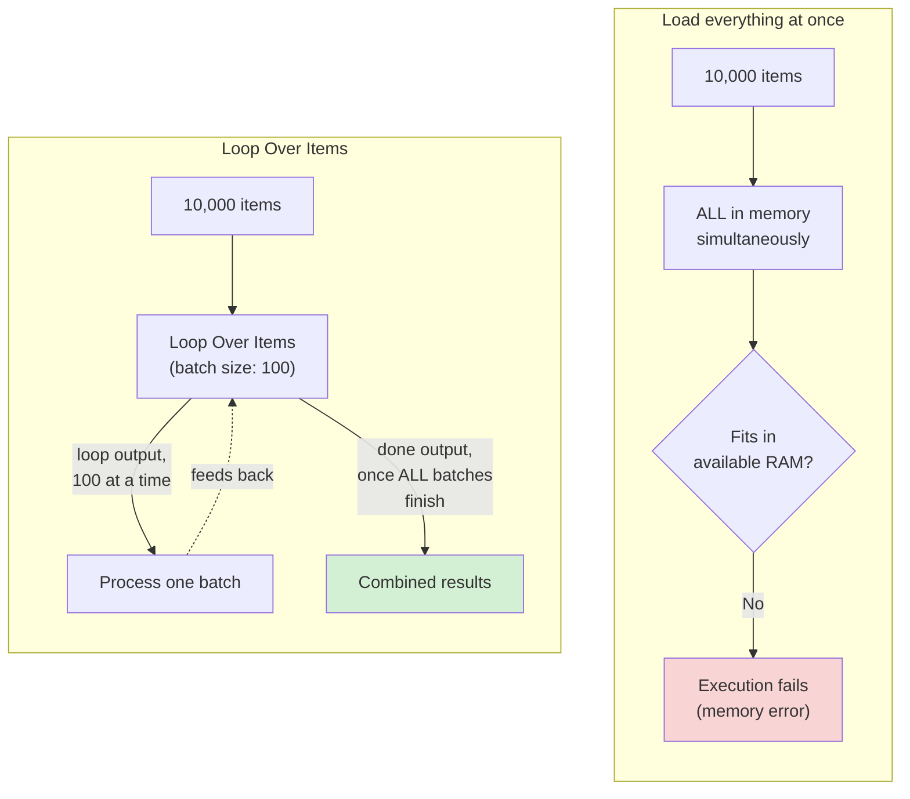
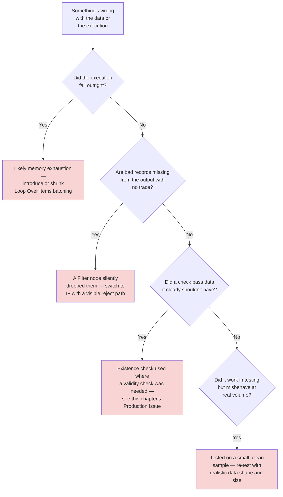
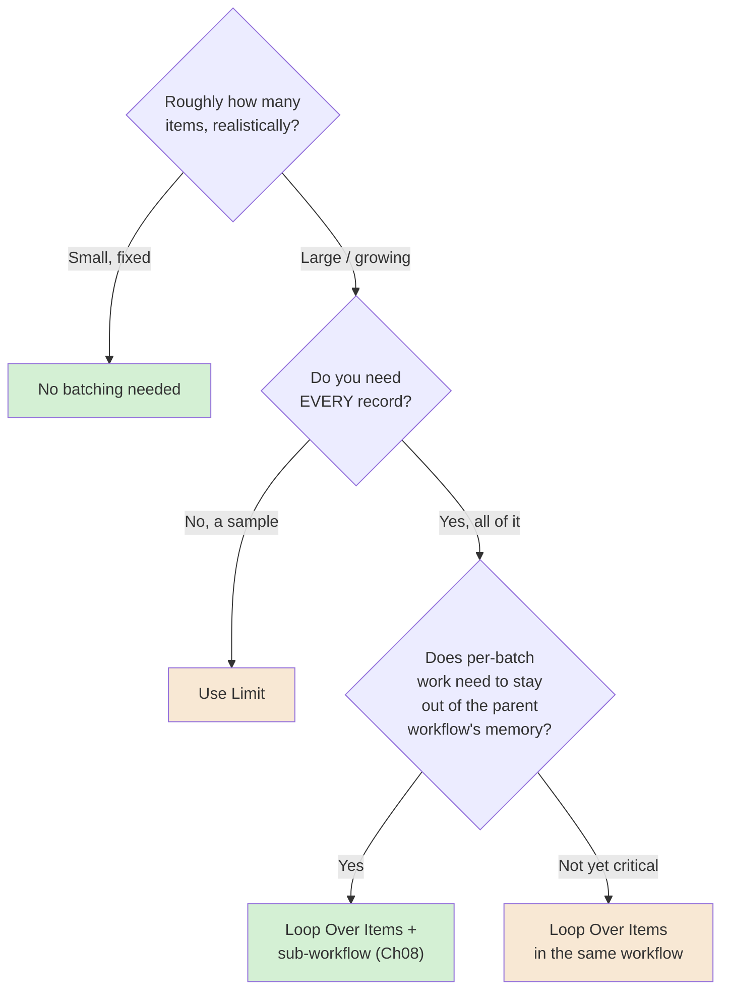

# Chapter 05 — Data Transformation and Validation at Scale

## Learning Objectives

By the end of this chapter, you will be able to:

- Map fields from one data shape to another using the Edit Fields (Set) node's mapping mode, and recognize when mapping alone isn't enough.
- Explain why "malformed data" and "missing data" are different problems that need different handling, not one generic error check.
- Build a validation step that **fails loudly** (flags or rejects bad records visibly) instead of failing silently (letting bad data quietly flow downstream).
- Process large item arrays safely using the **Loop Over Items** node, and choose a batch size deliberately instead of guessing.
- Combine HTTP Request pagination (Chapter 04) with batching so a workflow can process a dataset far larger than it could safely hold in memory at once.
- Use the **Limit** node to deliberately cap a dataset's size, and explain how that's different from batching it.
- Predict, before running anything, roughly why a given workflow will or won't survive a large dataset, based on n8n's in-memory execution model.
- Design a data contract for what "clean" data means at each stage of a workflow, so validation failures are caught at the boundary, not three nodes later.

## Prerequisites

- **Chapters completed:** Chapters 01–04. This chapter assumes comfort with items (Chapter 03), the HTTP Request node's pagination modes (Chapter 04), and general workflow-building.
- **Tools installed:** Same n8n instance as previous chapters. No new tools.

## Estimated Reading Time

60–75 minutes

## Estimated Hands-on Time

2.5–3 hours

---

## ⚡ Fast Read

> **Skim time: 5 minutes**

- **What it is:** Turning messy, unpredictable, or oversized real-world data into a shape your workflow can trust and actually handle — mapping fields, catching bad records on purpose, and processing large datasets without running out of memory.
- **Why it matters:** A five-item test dataset never shows you what happens with 50,000 real records, a null where you expected a string, or an API that quietly changed its response shape last Tuesday. Those are the conditions real data actually arrives in.
- **Key insight:** n8n loads an entire item array into memory by default. A workflow that works perfectly on 50 test records can fail — or worse, silently degrade — on 50,000 real ones, for a reason that has nothing to do with your logic being wrong.
- **What you build:** A field-mapping cleanup step, a validation gate that visibly separates good records from bad ones instead of silently dropping or corrupting them, and a batched pipeline that processes a large, paginated dataset safely.
- **Jump to:** [Core Concepts](#core-concepts) | [First Cleanup](#beginner-implementation) | [Best Practices](#best-practices) | [Mini Project](#mini-project)

---

## Why This Topic Exists

Every workflow in Chapters 01–04 used small, clean, hand-picked data. Real data isn't like that. A partner's API sends `null` where you expected `""`. A CSV upload has a blank row nobody noticed. A "required" field goes missing the day someone on the other team ships an unrelated change. None of this is exotic — it's the normal condition of any data crossing an organizational boundary, and it's exactly what Chapters 01–04 didn't need to teach you to handle yet.

There's a second problem hiding behind the first: **scale**. A workflow that correctly processes 10 test items can behave completely differently at 10,000 real ones — not because the logic is wrong, but because n8n, like most systems, has to hold data in memory to work with it, and memory is finite. Getting this wrong doesn't usually look like an obvious crash. It looks like a workflow that mysteriously times out once a month, or one that "usually works" — which is a much harder bug to notice and fix than one that fails every time.

This chapter teaches both problems together because they compound: validating and cleaning data gets more expensive per item as volume grows, so the same design decisions that make your validation correct also need to make it *sustainable* at real volume.

## Real-World Analogy

Picture a warehouse's receiving dock. A truck backs up and unloads boxes. Some boxes are labeled clearly. Some have smudged labels. Some are empty. Some have the wrong label taped on entirely. The receiving clerk's job isn't just "put boxes on shelves" — it's **decide, box by box, whether this one is fit to shelve, and if not, set it aside instead of shelving it and hoping nobody notices.** That's validation: catching the problem at the door, not three aisles later where it's much harder to trace back.

Now picture what happens if a truck delivers 10,000 boxes instead of 10. The clerk can't pile all 10,000 in the middle of the floor and sort through them at once — there's nowhere to put them. They work in **batches**: unload 50, process those, shelve or set them aside, then bring in the next 50. That's the batch-processing half of this chapter, and it's the same reason n8n's Loop Over Items node exists — not because it's clever, but because "load everything at once" simply stops working past a certain size.

---

## Core Concepts

### Schema Mapping

**Technical definition:** Transforming data from one field structure (names, nesting, types) into a different, expected structure — without necessarily changing the underlying meaning of the data.

**Plain English:** Renaming and reshaping fields so they match what the next step expects.

**Analogy:** Translating a foreign shipping label into your warehouse's own label format — same package, same contents, different label layout.

### Malformed Data vs. Missing Data

**Technical definition:** Two distinct failure categories. **Missing data** means a field is absent or empty where a value was expected. **Malformed data** means a field is present but doesn't match the expected type, format, or range (a string where a number was expected, a date that isn't a valid date).

**Plain English:** "It's not there" versus "it's there, but it's wrong."

**Analogy:** A box with no label at all (missing) versus a box with a label that says the contents weigh negative three kilograms (malformed) — both need catching, but a missing-label box might just need re-labeling, while a nonsense-label box might mean something is actually broken upstream.

> Treating these as the same problem is a common, costly mistake: a missing field often has a reasonable default; a malformed field usually shouldn't be silently "fixed" with a guess, because guessing about *wrong* data (as opposed to *absent* data) can quietly corrupt downstream records. This chapter's Production Issue is built entirely around that distinction going unrecognized.

### Validation

**Technical definition:** Explicitly checking incoming data against expected rules (types, required fields, ranges) before acting on it, and routing failures somewhere visible rather than letting them proceed unchecked.

**Plain English:** Checking the label before you shelve the box, on purpose, every time.

**Analogy:** The receiving clerk's inspection step — not decoration, the actual job.

> n8n has no dedicated "validation node." The current, correct pattern (confirmed consistent with Chapter 03's own coverage) is IF or Filter for straightforward checks, and a Code node for anything more complex — validation is a pattern you build with existing nodes, not a feature you turn on.

### Batch Processing

**Technical definition:** Processing a large item array in smaller, fixed-size chunks rather than all at once — in n8n, implemented by the **Loop Over Items** node (current name; also called Split in Batches), which feeds a configured number of items per iteration to a "loop" output, and combines everything into a **done** output once every batch has passed through.

**Plain English:** Processing 50 boxes at a time instead of 10,000 at once.

**Analogy:** The receiving clerk working truckload by truckload instead of demanding the entire shipment be dumped on the floor simultaneously.

### Batch Size

**Technical definition:** The configurable number of items Loop Over Items releases per iteration — the single tuning knob balancing memory use against total processing time.

**Plain English:** How many boxes the clerk pulls off the truck per trip.

**Analogy:** A bigger batch size is fewer trips (faster overall) but more boxes stacked on the floor at once (more memory); a smaller batch size is more trips (slower overall) but a tidier floor (less memory).

### In-Memory Execution Model

**Technical definition:** n8n's default behavior of holding an entire item array in memory for the duration of a node's (and often the whole execution's) processing — meaning memory usage scales with dataset size, not with how efficient your logic is.

**Plain English:** Everything currently "in play" in a workflow execution is sitting in RAM, all at once, unless you deliberately chunk it.

**Analogy:** The warehouse floor itself has a fixed size — it doesn't matter how well-organized the clerk is if 10,000 boxes physically don't fit on the floor at the same time.

> This is the fact that makes batch size a real engineering decision, not a style preference. A workflow processing 50 items and one processing 50,000 items are not the same workflow just running longer — past a certain point, the second one needs to be built differently.

### Truncation vs. Batching

**Technical definition:** **Truncation** (the **Limit** node) deliberately discards items beyond a configured count, keeping only the first or last N. **Batching** processes every item, just in smaller groups. They solve different problems: Limit says "I only want some of this data"; batching says "I want all of this data, just not all at once."

**Plain English:** Limit throws the rest away on purpose. Batching keeps everything, just in smaller piles.

**Analogy:** Limit is telling the truck driver "only unload the first 50 boxes, send the rest back." Batching is "unload everything, just 50 boxes at a time."

> Confusing these is a real, easy mistake: using Limit when you actually need every record (silently losing data) or using batching when you only ever wanted a sample (doing unnecessary work).

### Data Contract

**Technical definition:** An explicit, agreed-upon shape that data must conform to at a specific point in a workflow — the thing validation actually checks against.

**Plain English:** The written-down rule for "what does a valid record look like, right here."

**Analogy:** The warehouse's own shelving spec — a box has to meet certain size and labeling requirements to go on a given shelf, and everyone receiving boxes uses the same spec.

---

## Architecture Diagrams

### Diagram 1 — Where Validation Belongs



### Diagram 2 — Batch Processing vs. Loading Everything at Once



## Flow Diagrams

### Diagram 3 — A Large, Paginated Dataset, Processed Safely

```mermaid
sequenceDiagram
    participant HTTP as HTTP Request (paginated)
    participant Loop as Loop Over Items
    participant Val as Validation (IF/Filter)
    participant Act as Downstream action

    HTTP->>Loop: Page 1 of results (e.g. 100 items)
    Loop->>Val: Batch of 20
    Val->>Act: Valid items only
    Val-->>Loop: (invalid items routed to review path)
    Loop->>Val: Next batch of 20
    Note over Loop,Val: Repeats until this page's items are exhausted
    HTTP->>Loop: Page 2 of results
    Note over HTTP,Act: Cycle continues until pagination is exhausted
```

Notice pagination (Chapter 04) and batching (this chapter) are solving two related but distinct problems: pagination controls how much data you *fetch* per request; batching controls how much data you *process* in memory at once. A workflow can need either, both, or neither, depending on the actual data volume involved.

---

## Beginner Implementation

> **No-code path.**

**Goal:** Clean up a messy sample dataset — Aperture Cloud's "Contact List Cleanup."

1. **Manual Trigger**, followed by a **Set node** producing 4–5 sample contacts as separate items, deliberately messy: inconsistent field names (`Email` on one, `email_address` on another), a missing phone number on one, extra whitespace on a name.
2. **Edit Fields (Set) node**, in **Manual Mapping** mode. Map every incoming variant into one consistent shape: `email`, `name`, `phone`. Use expressions to trim whitespace (`{{ $json.name.trim() }}`) and to normalize the two different email field names into one.
3. Run it and confirm every item now has the exact same three-field shape, regardless of what its original field names were.

**What you just built:** **Schema mapping** — turning inconsistent input into one consistent, trusted shape, using no-code field mapping.

---

## Intermediate Implementation

> **Adds a real, visible validation gate.**

**Goal:** Extend the cleanup workflow so invalid records are caught and routed somewhere visible, not silently dropped or passed through broken.

1. After the Edit Fields node from the Beginner Implementation, add an **IF node** checking two conditions with AND logic: `email` is not empty, AND `email` contains `@` (a basic, deliberately simple format check — this chapter isn't teaching full email-validation regex, just the pattern).
2. **True branch** ("valid"): continues to a Set node simulating "add to CRM."
3. **False branch** ("invalid"): continues to a *different* Set node building a clear message — `"Rejected: {{ $json.name }} — missing or invalid email"` — simulating a review queue, **not** a dead end.
4. Run it against your messy sample data (which should include at least one record with a missing/malformed email) and confirm both branches produce visible, distinct output.

**What to notice:** Compare this to what a Filter node alone would have done here — silently dropped the bad record with no trace. The IF node's second branch is what makes this **fail-loud** instead of fail-silent, exactly per Diagram 1.

---

## Advanced Implementation

> **Engineering-depth path.** Batching a large, paginated dataset.

**Goal:** Process a dataset too large to comfortably hold in memory at once, using pagination (Chapter 04) and Loop Over Items together.

1. **HTTP Request node**, configured with pagination enabled (as in Chapter 04) against a real, paginated public API returning a large result set.
2. **Loop Over Items node**, batch size **50**, receiving the full paginated result.
3. On the loop output, a **Code node** doing real per-item validation — checking multiple fields, multiple types — more than an IF node could cleanly express:

```javascript
// Learning example — validating a batch of items, routing failures to a
// separate, visible output instead of silently dropping or passing them
// through. Runs once per batch (per Loop Over Items iteration), not once
// for the whole dataset — keeping memory use bounded to one batch at a time.

const validItems = [];
const invalidItems = [];

for (const item of $input.all()) {
  const { email, signup_date } = item.json;

  const isValidEmail = typeof email === 'string' && email.includes('@');
  const isValidDate = signup_date && !isNaN(Date.parse(signup_date));

  if (isValidEmail && isValidDate) {
    validItems.push({ json: item.json, pairedItem: item.pairedItem });
  } else {
    invalidItems.push({
      json: { ...item.json, rejection_reason: !isValidEmail ? 'bad_email' : 'bad_date' },
      pairedItem: item.pairedItem,
    });
  }
}

// Two named outputs would be configured on this Code node in n8n's UI;
// conceptually, valid and invalid items are kept structurally separate,
// never silently merged back together.
return [validItems, invalidItems];
```

4. Connect the loop output back into Loop Over Items (closing the loop), and the **done** output to a final summary step.
5. Run it against the full dataset and confirm the execution completes without a memory error, processing in visible, bounded batches rather than one enormous pass.

**The common mistake alongside the correct pattern:**

```text
WRONG: Fetch all pages via HTTP Request pagination, then run per-item
Code node logic directly on the full result — no Loop Over Items at all.
Works fine at 200 items in testing; fails or degrades badly at 50,000.

RIGHT: Batch the processing step itself, per this chapter's Advanced
Implementation, so memory use stays bounded regardless of total dataset
size.
```

**How to debug it when it breaks:** A memory-related failure on a large dataset is the direct signal to introduce (or shrink) batching — check n8n's own memory-error guidance and reduce batch size before assuming your logic is wrong. If a specific batch silently vanishes from the final combined output, check whether an error in that batch's processing caused the whole iteration to be skipped rather than routed to a visible failure path.

**The production version, where it differs from the learning version:** At real production volume, per this chapter's Production Architecture below, the heavy per-batch work is often pushed into a dedicated **sub-workflow** (Chapter 08) so the parent workflow's own memory footprint stays small regardless of how much data the sub-workflow processes internally.

---

## Production Architecture

- **Memory is the real constraint, not item count in the abstract.** A workflow processing 5,000 small JSON records behaves very differently from one processing 5,000 records each carrying a large binary attachment (Chapter 03) — batch size decisions should account for actual payload size, not just item count.
- **Sub-workflows as a chunking boundary.** Per n8n's own documented guidance, splitting heavy per-batch work into a sub-workflow that returns only a small summary to its parent is a real, recommended pattern for keeping the parent workflow's memory footprint small — a direct preview of Chapter 08.
- **Manual test runs cost more memory than production runs**, because n8n keeps a copy of the data for the editor UI during manual execution — a workflow that "worked fine when I tested it" in the editor can still behave differently under real, automatic execution at volume. Test realistic volume where possible, not just a hand-picked sample.
- **Queue mode (Chapter 16) is the real answer past a certain scale.** This chapter's batching techniques buy you real headroom on a single instance; genuinely large, sustained volume is where horizontal scaling via queue mode becomes the correct architectural answer, not a bigger batch size.

---

## Best Practices

1. **Validate at the boundary, immediately after data enters the workflow** — not three transformation steps later, where a bad record has already been reshaped and is harder to trace back to its original problem.
2. **Never silently "fix" malformed data with a guess.** A missing field can often take a documented default; a malformed one should be flagged for review, not quietly overwritten.
3. **Always give invalid records a visible destination** — a review queue, a log, a distinct output — never a Filter node's silent discard when you actually need to know what got rejected.
4. **Choose batch size based on payload size and observed memory behavior, not a guess.** Start smaller than you think you need, and increase only after confirming headroom.
5. **Use Limit deliberately, and only when you actually want fewer records than exist** — never as a workaround for a memory problem you should be solving with batching instead.
6. **Test with realistic data volume, not just a hand-picked clean sample**, before considering a data-processing workflow production-ready.

---

## Security Considerations

- **Never trust an upstream field's type or format just because a request succeeded.** A 200 OK response doesn't mean the response body is well-formed — this chapter's validation discipline is also a security boundary, not just a data-quality one, especially before that data reaches anything resembling the Merge node's SQL Query mode (Chapters 03–04) or a Code node.
- **Rejected records can contain sensitive data too.** A "review queue" for invalid records inherits the same sensitivity as the original data — don't treat a validation-failure log as lower-stakes than the main data path.

## Cost Considerations

Batch size doesn't change n8n's execution-based billing (Chapter 01) — a dataset processed in one batch or fifty batches within a single Loop Over Items node is still one execution. The real cost lever here is **infrastructure**: smaller batches use less memory per moment but take longer overall (more total processing time); larger batches finish faster but need more memory available at once. On self-hosted instances this is a direct infrastructure-sizing tradeoff (Chapter 15–16); on Cloud, execution duration and memory ceilings are governed by your plan tier — check current limits on `n8n.io/pricing` before assuming a given batch size is safe at your plan level.

## Common Mistakes

**Mistake 1 — Treating missing and malformed data the same way.**
```text
WRONG: One generic "if falsy, use default" check for every field.
RIGHT: Missing → reasonable default, when one genuinely exists.
       Malformed → flag for review, don't guess.
```

**Mistake 2 — Using Filter when you need to know what got rejected.**
```text
WRONG: Filter node silently drops invalid records — no record of what
or why.
RIGHT: IF node (or Code node with two outputs) routes rejects to a
visible destination, per this chapter's Intermediate Implementation.
```

**Mistake 3 — No batching on a workflow that "usually" works.**
```text
WRONG: Works fine in testing at 50 items; nobody re-tests at real volume
before shipping.
RIGHT: Test at realistic volume; introduce Loop Over Items before it's
strictly necessary if growth is expected.
```

## Debugging Guide



| Symptom | Likely cause | Where to look |
|---|---|---|
| Execution fails partway through a large dataset | Memory exhaustion — no batching, or batch size too large | Batch size configuration; n8n's memory-error documentation |
| Bad records silently missing from output, no error | Filter node used where a visible reject path was needed | Which node type is doing the discarding |
| Workflow "usually" works, fails unpredictably | Untested at realistic data volume/shape | Re-test with production-representative data, not a clean sample |
| A validation check passes data it shouldn't | Missing/malformed conflated into one generic check | Split the check into explicit missing-field and malformed-field cases |

## Performance Optimisation

> Numbers below are **illustrative Aperture Cloud measurements**, not a published benchmark.

In an illustrative test processing 5,000 records: batch size 10 took roughly 4 minutes with very low peak memory; batch size 500 took roughly 45 seconds but used noticeably more peak memory. Neither is "correct" in the abstract — the right choice depends on available memory and how time-sensitive the workflow is. The general lesson: **batch size is a real tuning knob with a real tradeoff curve, worth testing at more than one value before picking one and moving on.**

---

## Technology Comparison

| Platform | Large-dataset handling | Validation approach |
|---|---|---|
| **n8n** | Loop Over Items (batching), Limit (truncation), sub-workflow chunking | No dedicated node — IF/Filter/Code node pattern |
| **Zapier** | Generally designed around single-record-at-a-time processing; large bulk operations are less central to its model | Filters, similar discard-only semantics as n8n's Filter |
| **Make** | Iterator/Aggregator modules for bundle-array processing, broadly analogous to Loop Over Items | Similar condition-based filtering |
| **Windmill / Temporal** | Ordinary code — batch size is whatever the engineer's own script implements | Whatever validation library the engineer chooses — full flexibility, full responsibility |
| **Apache Airflow** | Natively batch/DAG-oriented at the data-engineering scale this chapter's techniques are approximating with n8n | Typically delegated to the data pipeline's own tooling (e.g., Great Expectations) rather than the orchestrator itself |

## Decision Framework



---

### Production Issue: The Sync That Quietly Created Thousands of Broken Leads

**Symptoms**

Aperture Cloud's CRM sync workflow appeared to run successfully every night for weeks. Then someone noticed the CRM had accumulated thousands of lead records with an empty `email` field — records that should never have been created, since `email` was supposed to be required.

**Root Cause**

A partner API Aperture Cloud synced leads from changed its behavior: instead of omitting the `email` field entirely when a lead had no email on file (the original, documented behavior the sync's validation was built around — checking "is this field present?"), it started sending `email: ""` — an empty string, technically present. The sync's validation only checked for the field's *existence*, not whether it was meaningfully populated — a missing-data check where a malformed-data check (or a combined one) was actually needed. Every empty-string email passed the existence check and flowed straight into the CRM as a new record.

**How to Diagnose It**

1. Compare the validation logic's actual condition (field exists) against what it was implicitly assumed to guarantee (field has a real value) — this gap is usually the root cause in this exact failure class.
2. Sample the raw upstream API responses from before and after the partner's change to confirm exactly what shifted.

**How to Fix It**

```text
BEFORE: if (item.json.email) — wrong, "" is falsy in some contexts but
        this check was actually implemented as a field-existence check
        (e.g., a JSON schema "required" check), which "" satisfies.

AFTER:  if (item.json.email && item.json.email.trim().includes('@'))
        — explicitly checks for a genuinely valid value, not just presence.
```

**How to Prevent It in Future**

Treat "missing" and "malformed" as two explicit, separately-tested conditions in every validation step, per this chapter's Core Concepts — and add a lightweight periodic check comparing a sample of upstream response shapes against the assumptions your validation was originally built on, since upstream providers changing behavior without warning is a real, recurring risk, not a one-off.

---

## Exercises

1. **(15 min)** List three fields in a system you use where "missing" and "malformed" would need genuinely different handling.
2. **(30 min)** Build the Beginner Implementation's field-mapping cleanup.
3. **(45 min)** Build the Intermediate Implementation's fail-loud validation gate, and add a third rejection reason of your choosing.
4. **(60–90 min)** Build the Advanced Implementation's batched, validated pipeline against a real paginated API.
5. **(30 min)** Reproduce this chapter's Production Issue on a small scale: build a validation check that only checks field existence, feed it an empty-string value, and confirm it incorrectly passes.

## Quiz

**1. What's the difference between missing and malformed data?**
> Missing: the field is absent/empty. Malformed: the field is present but wrong (wrong type, format, or range).

**2. Why is silently "fixing" malformed data with a guess riskier than defaulting missing data?**
> A missing field's default is a documented, deliberate choice. Guessing about data that's present but wrong risks quietly corrupting a record with an incorrect value that looks legitimate.

**3. What's the structural difference between Limit and Loop Over Items?**
> Limit discards items beyond a configured count. Loop Over Items processes every item, just in smaller chunks — no data is discarded.

**4. Why can a workflow that works on 50 test items fail on 50,000 real ones, even with identical logic?**
> Because n8n loads the full item array into memory by default — memory usage scales with dataset size, independent of whether the logic itself is correct.

**5. Why does using a Filter node to remove invalid records make debugging harder later?**
> Because Filter silently discards non-matching items with no visible trace — there's no record of what was rejected or why, unlike an IF node routed to a visible reject path.

**6. Does a larger Loop Over Items batch size change n8n's execution-based billing?**
> No — the whole batched process is still one execution, regardless of batch size. Batch size affects memory and wall-clock time, not execution count.

**7. What's the recommended pattern for keeping a parent workflow's memory footprint small when a sub-task processes a lot of data?**
> Push the heavy per-batch work into a sub-workflow that returns only a small summary to the parent, rather than doing it all inline in the main workflow.

**8. Why does manual testing in the n8n editor not fully prove a workflow is memory-safe at production volume?**
> Manual executions keep an extra copy of the data for the editor UI, using more memory than a production execution would — and testing typically uses a small sample, not realistic volume.

**9. In this chapter's Production Issue, what specific gap in the validation logic let broken records through?**
> The validation checked only whether the `email` field existed, not whether it contained a genuinely valid value — an empty string satisfied the existence check while still being invalid.

**10. When should you reach for the Limit node instead of batching?**
> When you deliberately want fewer records than exist (a sample or a capped result) — not as a workaround for a memory problem, which batching (or sub-workflow chunking) is the correct tool for.

## Mini Project

**Aperture Cloud's Contact Cleanup Pipeline (2–3 hours)**

- [ ] Field mapping normalizing at least three inconsistent input shapes into one.
- [ ] A fail-loud validation gate with at least two distinct rejection reasons, both visible in the output.
- [ ] A short written note distinguishing which of your checks are "missing" checks versus "malformed" checks.

## Production Project

**Aperture Cloud's Large-Dataset Lead Import (1–2 days)**

- [ ] A paginated HTTP Request feeding a Loop Over Items node with a deliberately chosen, justified batch size.
- [ ] Validation distinguishing missing vs. malformed data explicitly, with both routed to a visible, distinct output.
- [ ] A deliberate reproduction of this chapter's Production Issue (an existence-only check let through a malformed value), then the fix applied and demonstrated.
- [ ] A written comparison (300–500 words) of at least two batch sizes tested against the same dataset, with measured (not estimated) timing and a final recommendation.

## Key Takeaways

- Missing and malformed data are different problems — check for both, explicitly, not with one generic check.
- Validation should fail loudly (a visible reject path) not silently (a discarded record with no trace).
- n8n's in-memory execution model means large datasets are a real architectural concern, not just "let it run longer."
- Loop Over Items batches processing without discarding data; Limit deliberately discards beyond a count — don't confuse the two.
- Batch size is a real tuning knob trading memory for time — test it, don't guess it.
- Sub-workflows are the recommended pattern for keeping a parent workflow's memory footprint small at real scale.
- Batching doesn't change n8n's execution-based billing — it's an infrastructure/memory consideration, not a cost lever.
- Never trust an upstream field's type or format just because the request succeeded — a 200 OK isn't a data-quality guarantee.
- Test with realistic data volume and shape, not a hand-picked clean sample, before calling a data workflow production-ready.
- An existence-only check ("is this field present?") is not the same guarantee as a validity check ("does this field have a real value?") — this chapter's Production Issue is exactly that gap.

## Chapter Summary

| Concept | Key Takeaway |
|---|---|
| Schema Mapping | Reshape inconsistent input into one consistent, trusted shape |
| Missing vs. Malformed | Different problems, different handling — default vs. flag-for-review |
| Validation | Fail loud, not silent — always give rejects a visible destination |
| Loop Over Items | Processes everything, in bounded chunks — the batching mechanism |
| Limit | Deliberately discards beyond a count — not a memory workaround |
| In-Memory Execution | Memory scales with dataset size, independent of logic correctness |
| Batch Size | A real tradeoff knob between memory use and total processing time |

## Resources

- [n8n Loop Over Items (Split in Batches) documentation](https://docs.n8n.io/integrations/builtin/core-nodes/n8n-nodes-base.splitinbatches/)
- [n8n Edit Fields (Set) documentation](https://docs.n8n.io/integrations/builtin/core-nodes/n8n-nodes-base.set/)
- [n8n Limit node documentation](https://docs.n8n.io/integrations/builtin/core-nodes/n8n-nodes-base.limit)
- [n8n memory-related errors documentation](https://docs.n8n.io/hosting/scaling/memory-errors/)

## Glossary Terms Introduced

| Term | One-line definition |
|---|---|
| Schema Mapping | Reshaping data from one field structure to another |
| Missing Data | A field absent or empty where a value was expected |
| Malformed Data | A field present but wrong in type, format, or range |
| Validation | Explicitly checking data against rules before acting on it |
| Batch Processing | Processing a large array in smaller, fixed-size chunks |
| Batch Size | The configured number of items per Loop Over Items iteration |
| In-Memory Execution Model | n8n holding the full item array in memory by default |
| Data Contract | The agreed shape data must conform to at a given workflow point |
| Truncation (Limit node) | Deliberately discarding items beyond a configured count |

## See Also

| Topic | Related Chapter | Why |
|---|---|---|
| The n8n Data Model and Expressions | Chapter 03 | Items and Code node item construction, reused directly for batch validation |
| Connecting to the World | Chapter 04 | HTTP Request pagination, combined here with batching for large datasets |
| Workflow Design Patterns | Chapter 06 | Fan-out/fan-in patterns build directly on this chapter's batching discipline |
| Modular Workflow Design | Chapter 08 | Sub-workflow chunking, previewed in this chapter's Production Architecture |
| Scaling n8n in Production | Chapter 16 | Queue mode as the real answer past what batching alone can handle |

## Preparation for Next Chapter

**Technical checklist:**
- [ ] Built the fail-loud validation gate and confirmed both branches work.
- [ ] Built the batched pipeline and confirmed it completes without a memory error at realistic volume.

**Conceptual check:**
- Why is an existence check not the same as a validity check?
- Why doesn't a larger batch size change n8n's execution-based bill?

**Optional challenge:** Before Chapter 06, sketch (on paper) how you'd fan a single incoming order out to three independent downstream checks (inventory, fraud, shipping) and bring the results back together. Chapter 06 names and formalizes exactly this pattern.

---

> **Currency Note:** This chapter's n8n-specific facts (Loop Over Items' current name and behavior, Edit Fields' mapping modes, the Limit node, and current memory guidance) were verified against `docs.n8n.io` in July 2026. Always confirm current node names and behavior before making a production decision based on this chapter.
