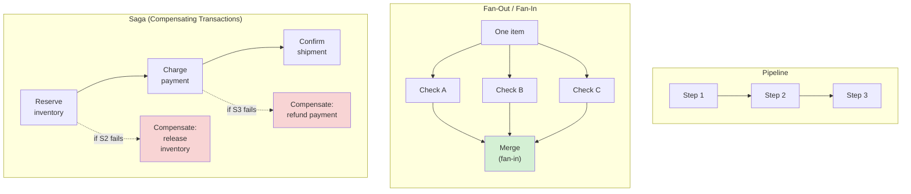
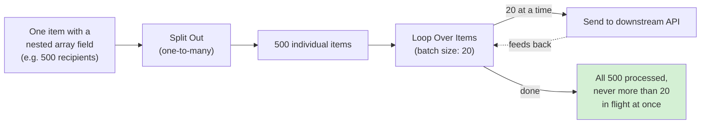
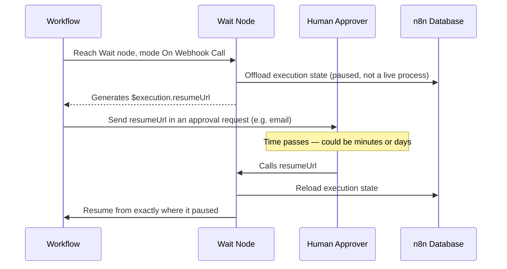
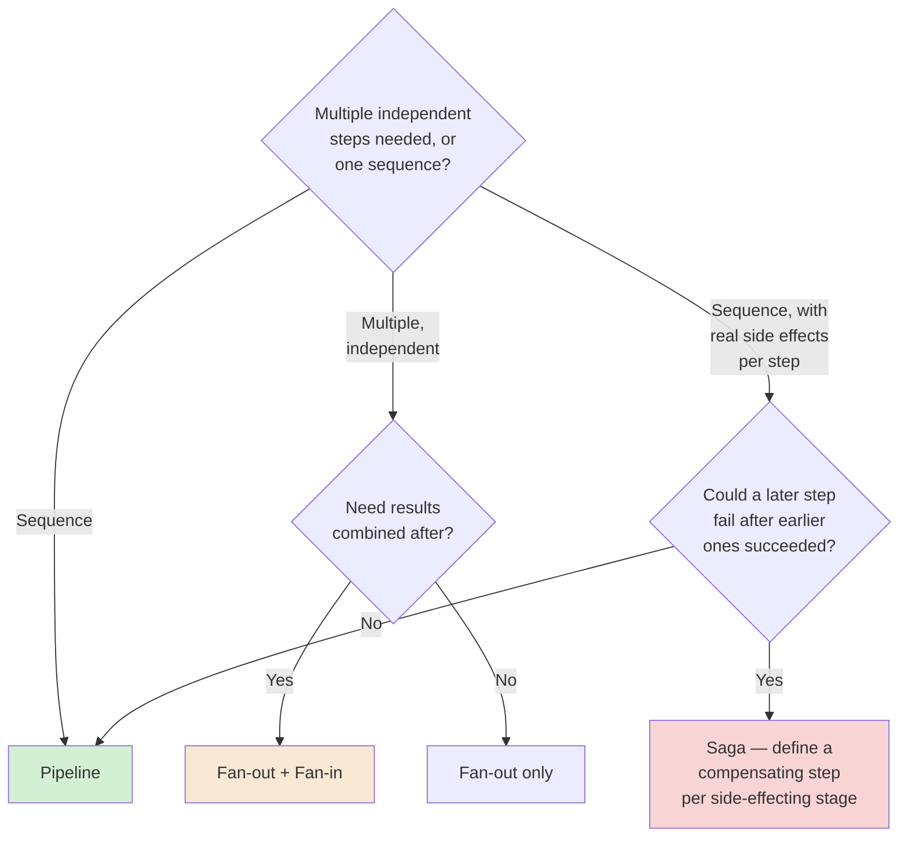

# Chapter 06 — Workflow Design Patterns

## Learning Objectives

By the end of this chapter, you will be able to:

- Name and recognize five core workflow design patterns: **pipeline**, **fan-out/fan-in**, **request-reply**, **saga (compensating transactions)**, and **competing consumers**.
- Build a fan-out pattern in n8n — splitting one item into many parallel branches — and bring the results back together with fan-in.
- Rate-limit a fan-out so it processes a large batch without overwhelming a downstream system, using Split Out combined with Loop Over Items.
- Implement a genuine asynchronous request-reply pattern using the Wait node's webhook-resume mode.
- Explain the saga pattern and build a compensating step for a multi-step process where a later step can fail after earlier steps already succeeded.
- Choose between a synchronous and asynchronous Execute Sub-workflow call, and explain what each commits you to.
- Recognize where n8n's own worker model (queue mode) is itself an instance of the competing-consumers pattern.
- Choose the right pattern for a given multi-step process instead of defaulting to "just chain everything sequentially."

## Prerequisites

- **Chapters completed:** Chapters 01–05. This chapter assumes comfort with orchestration vs. choreography (Chapter 01), items and Merge (Chapter 03), and batching (Chapter 05) — it names and formalizes patterns those chapters already brushed up against.
- **Tools installed:** Same n8n instance as previous chapters.

## Estimated Reading Time

65–80 minutes

## Estimated Hands-on Time

3 hours

---

## ⚡ Fast Read

> **Skim time: 5 minutes**

- **What it is:** A small, named vocabulary of five recurring shapes multi-step automation takes — pipeline, fan-out/fan-in, request-reply, saga, competing consumers — so you can recognize which one you need instead of reinventing it badly each time.
- **Why it matters:** Almost every "this workflow got complicated and hard to reason about" problem is actually one of these five patterns, applied without anyone naming it — which means nobody applied its known failure-mode protections either.
- **Key insight:** Fan-out is the pattern most likely to hurt you in production, specifically because it's the easiest one to build without limits — and the thing on the other end of your parallel calls has limits, whether you respected them or not.
- **What you build:** A fan-out/fan-in order-check workflow, a rate-limited fan-out that won't overwhelm a downstream API, an async request-reply using n8n's Wait node, and a saga with a real compensating rollback step.
- **Jump to:** [Core Concepts](#core-concepts) | [First Pattern](#beginner-implementation) | [Best Practices](#best-practices) | [Mini Project](#mini-project)

---

## Why This Topic Exists

You've already built pipelines, branches, and merges in Chapters 01–05 without a name for what you were doing. That was fine for individual nodes. It stops being fine once a workflow has real, multi-step structure — because at that point, "how should this be shaped" is a real design decision with real, known-in-advance tradeoffs, and distributed systems engineering already has names and failure-mode knowledge for the shapes that keep recurring. This chapter gives you that vocabulary, concretely, in n8n.

The specific reason this matters in production: some of these patterns have a sharp edge that isn't obvious until you hit it. Fan-out is the clearest example — splitting one item into many parallel downstream calls is trivially easy to build in n8n, and trivially easy to build *without any limit on how much parallelism you're creating*. A workflow that fans out to 5 partner API calls is fine. The same workflow fanning out to 5,000, with no rate limiting, can take down the partner's API, or get your own account rate-limited or suspended — this chapter's own Production Issue is exactly that scenario.

## Real-World Analogy

A restaurant kitchen again, but this time think about **how an order actually gets built**, not just how a ticket gets routed (that was Chapter 01).

A simple order — one dish — goes through stations in sequence: grill, plate, pass. That's a **pipeline**: one thing flows through a fixed sequence of steps.

A complex order — a table of six, each wanting something different — gets split: six tickets go to six stations *simultaneously*, so the kitchen isn't waiting on one dish to finish before starting the next. That's **fan-out**. But nothing goes to the table until every dish for that table is actually ready — someone has to wait for all six and plate them together. That's **fan-in**.

Now picture a customer who calls ahead to order, and the restaurant says "we'll call you back when it's ready" instead of keeping them on hold. That's **request-reply**, done asynchronously: the request happens now, the reply happens later, and nobody's tied up waiting in between.

And picture a catering job with three vendors — one for food, one for the venue, one for the band — where the venue cancels *after* the food's already been ordered and paid for. A well-run catering company doesn't just shrug; they have a defined process to un-book the food order and get the deposit back. That's a **saga**: a multi-step process with a real, defined way to undo the steps that already succeeded, when a later step fails.

---

## Core Concepts

### Pipeline

**Technical definition:** A sequence of steps where each step's output becomes the next step's input, in a fixed order.

**Plain English:** One thing, moving through a fixed line of stations.

**Analogy:** The single-dish order moving grill → plate → pass.

### Fan-Out

**Technical definition:** Splitting one unit of work into multiple independent, parallel branches that can proceed without waiting on each other.

**Plain English:** One ticket, six stations working on it at once.

**Analogy:** The six-dish table order, split to six stations simultaneously.

### Fan-In

**Technical definition:** Bringing multiple parallel branches back together into a single combined result, typically waiting for all (or a defined subset) of them to complete first.

**Plain English:** Plating all six dishes together, once everything's actually ready.

**Analogy:** The point where the six stations' work is reunited before the table gets served.

> Fan-out without fan-in is a valid pattern too — sometimes you genuinely don't need to wait for or combine the parallel results (send a notification to five channels, and you don't need to know all five delivered before moving on). The two are related, not inseparable.

### Request-Reply

**Technical definition:** A pattern where a caller sends a request and receives a corresponding reply, either synchronously (the caller waits, per Chapter 01) or asynchronously (the caller is told "you'll hear back," and a separate callback delivers the reply later).

**Plain English:** "Ask, then wait" versus "ask, then get called back."

**Analogy:** Waiting at the counter for your order (synchronous) versus being told "we'll call you" (asynchronous).

### Saga (Compensating Transactions)

**Technical definition:** A pattern for multi-step processes that can't be wrapped in a single all-or-nothing database transaction — each step has a defined **compensating action** that undoes it, so a failure partway through can be rolled back step by step instead of leaving the system in a half-finished state.

**Plain English:** A defined "undo" for each step, used when a later step fails after earlier ones already succeeded.

**Analogy:** Un-booking the caterer and getting the deposit back after the venue cancels — a real, planned-for undo step, not an afterthought.

> This matters specifically because most multi-step automation *can't* use a real database transaction across several different external systems — you can't "roll back" a partner API's own database from your workflow. A saga is the honest acknowledgment of that: plan the undo, per step, in advance.

### Competing Consumers

**Technical definition:** A pattern where multiple independent workers pull from the same shared queue of work, each processing whatever's next — increasing throughput by adding more workers, without any one worker needing to know about the others.

**Plain English:** Several cashiers, one line — whoever's free takes the next customer.

**Analogy:** Multiple checkout lanes pulling from one queue, instead of one customer being assigned to one specific cashier in advance.

> This isn't just a theoretical pattern for this course — it's the literal mechanism behind n8n's own **queue mode** (Chapter 16): multiple worker processes competing to pick up the next queued execution. You'll meet this pattern again, concretely, when Chapter 16 covers scaling.

### Rate-Limited Fan-Out

**Technical definition:** A fan-out deliberately bounded to a controlled number of concurrent or per-interval operations, rather than firing every branch simultaneously with no limit.

**Plain English:** Splitting the work, but only doing a few pieces at a time, on purpose.

**Analogy:** The kitchen fanning a big order out to six stations, but not simultaneously starting fifty more orders on top of it — there's a real limit to how much can run in parallel before something breaks.

---

## Architecture Diagrams

### Diagram 1 — Pipeline vs. Fan-Out/Fan-In vs. Saga



### Diagram 2 — Rate-Limited Fan-Out (Split Out + Loop Over Items)



## Flow Diagrams

### Diagram 3 — Asynchronous Request-Reply Using the Wait Node



Notice the workflow isn't sitting idle holding a worker the whole time it waits — execution state is offloaded to the database (for waits over roughly 65 seconds) and reloaded only on resume, which is why this pattern scales to waits of days, not just seconds.

---

## Beginner Implementation

> **No-code path.**

**Goal:** Build a fan-out/fan-in order check — Aperture Cloud's "Order Triage."

1. **Manual Trigger** → **Set node** producing one sample order (order ID, item count, customer tier).
2. Three parallel branches from the Set node, each a simple Set node simulating a check: "Inventory Check" (sets `inventory_ok: true`), "Fraud Check" (sets `fraud_score: 0.1`), "Shipping Check" (sets `shipping_available: true`).
3. **Merge node**, **Combine** mode, bringing all three branches back together by matching on `order_id` (add that field to each branch's output first).
4. Run it and confirm the merged output contains all three checks' results in one item.

**What you just built:** Fan-out (one order, three simultaneous checks) and fan-in (Merge bringing them back together) — the exact shape of Diagram 1's middle pattern.

---

## Intermediate Implementation

> **Adds rate limiting to fan-out — the pattern this chapter's Production Issue is built around getting wrong.**

**Goal:** Send a personalized notification to a large list of recipients without overwhelming the notification API.

1. **Manual Trigger** → **Set/Code node** producing one item with a `recipients` field containing an array of 50 sample email addresses (simulating a real list).
2. **Split Out node**, targeting the `recipients` field — confirm it produces 50 separate items, one per recipient.
3. **Loop Over Items node**, batch size **5** — this is the rate limit.
4. On the loop output, an **HTTP Request node** (or a Set node simulating one) representing "send notification," with a short deliberate delay (a Wait node, "After Time Interval," 1 second) before looping back — simulating respecting a downstream rate limit.
5. Run it and observe, via the execution log, that only 5 requests are ever "in flight" at once, not all 50 simultaneously.

**What to notice:** This is Diagram 2, built by hand. Compare it mentally to fanning all 50 out with no Loop Over Items at all — that version would fire all 50 simultaneously, which is exactly this chapter's Production Issue.

---

## Advanced Implementation

> **Engineering-depth path.** Async request-reply, and a saga with a real compensating step.

**Part A — async request-reply:**

1. Build a small workflow: **Webhook Trigger** → **Wait node**, mode **"On Webhook Call."** n8n generates a resume URL for this specific paused execution.
2. Add a node before the Wait node that would (in a real deployment) email the `{{ $execution.resumeUrl }}` value to a human approver, asking them to click it to continue.
3. Add nodes after the Wait node representing "approved — proceed."
4. Run it, retrieve the generated resume URL from the execution data, and call it manually (with a browser or curl) to confirm the paused execution resumes exactly where it left off.

**Part B — saga with a compensating step:**

5. Build a three-step booking simulation: **"Reserve Inventory"** (Set node, `inventory_reserved: true`) → **"Charge Payment"** (Set node, with an On Error branch simulating a payment failure) → **"Confirm Shipment."**
6. On Charge Payment's error-output branch, add a **compensating step**: a Set node representing "release inventory reservation" — explicitly undoing step 5's effect.

```javascript
// Learning example — Code node representing the compensating action for
// a failed payment step. This is the saga pattern's core idea: an
// explicit, planned undo for a step that already succeeded, triggered
// specifically by a LATER step's failure — not a generic catch-all error
// handler.

return [{
  json: {
    order_id: $json.order_id,
    inventory_reserved: false,  // explicitly reversing step 1's effect
    compensation_reason: 'payment_failed',
    compensated_at: $now.toISO(),
  },
}];
```

7. Run it with a simulated payment failure and confirm the compensating step fires and produces a clear, visible "reservation released" record — not a silent, unexplained rollback.

**Part C — synchronous vs. asynchronous Execute Sub-workflow:**

8. Build a tiny sub-workflow ("Compute Order Total") that takes an order's line items and returns a total. In your main workflow, call it with an **Execute Sub-workflow** node with **"Wait for Sub-Workflow Completion" enabled** — run it and confirm the parent workflow receives the total back and can use it immediately in the next node.
9. Duplicate that node and **disable** "Wait for Sub-Workflow Completion." Run it again and confirm the parent workflow moves on immediately, with **no** total available to use afterward — the sub-workflow runs, but the parent never waits to see what it returned.

**What to notice:** Step 8 is the right choice whenever the parent genuinely needs the sub-workflow's answer before continuing (exactly like a synchronous request-reply, Chapter 01). Step 9 is the right choice for fire-and-forget work the parent doesn't need a result from — cheaper to build, but only correct when you truly don't need what comes back.

**The common mistake alongside the correct pattern:**

```text
WRONG: Treat a multi-step process's failure with one generic Error
Workflow (Chapter 02) and no per-step compensating logic — a failed
payment leaves the inventory reservation in place indefinitely, with
nothing to release it.

RIGHT: Give each step that has a real-world side effect a specific,
defined compensating action, triggered by the specific later failure
that requires it — per this chapter's saga pattern.
```

---

## Production Architecture

- **Rate-limited fan-out needs its limit tuned to the downstream system's actual capacity**, not a round number picked at random — check the target API's documented rate limits (Chapter 04) before choosing a batch size.
- **Execute Sub-workflow's synchronous/asynchronous choice has real production consequences.** A synchronous call (waiting for the sub-workflow's result) is simpler to reason about but couples the parent's execution time to the sub-workflow's; an asynchronous call decouples them but means the parent can't directly use the sub-workflow's output.
- **n8n's queue mode is competing consumers in production, not just an analogy** — multiple worker processes pulling from a shared execution queue, which is exactly why Chapter 16 revisits this pattern by name.
- **A saga's compensating steps need their own reliability discipline.** A compensating action that itself fails silently defeats the entire point — Chapter 07 covers the retry/error-handling discipline that makes compensating steps actually trustworthy.

---

## Best Practices

1. **Always rate-limit a fan-out whose size depends on real-world data volume** (a recipient list, a batch of records) — never assume it'll "probably be small."
2. **Design the compensating action for a step at the same time you design the step itself**, not as an afterthought once something's already failed in production.
3. **Choose synchronous Execute Sub-workflow calls when you need the result; asynchronous when you don't** — don't default to synchronous just because it's simpler to build.
4. **Use fan-in (Merge) only when you actually need the combined result** — a pure fan-out with no fan-in is simpler and completely valid when branches don't need to be reunited.
5. **Name your patterns in documentation or node naming** — a workflow whose canvas makes "this is a saga with a compensating step" visible is far easier for the next engineer to maintain correctly.

---

## Security Considerations

- **A resume URL is a real, callable credential.** Anyone with `$execution.resumeUrl` can resume that specific paused execution — treat it with the same care as a webhook URL (Chapter 01), especially if the resumed workflow performs a consequential action.
- **Fan-out multiplies your outbound credential usage.** A rate-limited fan-out still sends the same credential (Chapter 04) on every branch — make sure that credential's scope is appropriate for being used at that volume.

## Cost Considerations

Fan-out doesn't change n8n's own execution-based billing (Chapter 01) — the whole fan-out/fan-in structure, however many branches, is still one execution. The real cost exposure is on the **downstream system's** side: an unrate-limited fan-out can trigger a partner API's overage charges or rate-limit penalties, exactly as this chapter's Production Issue describes — a cost and reliability risk that has nothing to do with n8n's own bill.

## Common Mistakes

**Mistake 1 — Fan-out with no rate limit.**
```text
WRONG: Split Out into 5,000 items, straight into parallel downstream
calls, no Loop Over Items.
RIGHT: Split Out → Loop Over Items with a deliberate batch size, per
this chapter's Intermediate Implementation.
```

**Mistake 2 — No compensating step for a multi-step process with real side effects.**
```text
WRONG: A generic Error Workflow catches the failure, but nothing undoes
the earlier steps that already succeeded.
RIGHT: A specific compensating action per step, triggered by the
specific later failure, per this chapter's saga example.
```

## Debugging Guide

| Symptom | Likely cause | Where to look |
|---|---|---|
| Downstream API starts rate-limiting or erroring under load | Unrate-limited fan-out | Whether Loop Over Items (or an equivalent throttle) sits between Split Out and the downstream call |
| A failed multi-step process leaves the system in a half-done state | No compensating step defined | Whether each side-effecting step has a corresponding undo, triggered by later failures |
| An async request-reply never resumes | Resume URL never actually called, or expired/execution data cleaned up | Confirm the callback (email, webhook) that was supposed to deliver the resume URL actually fired |

## Performance Optimisation

> Illustrative Aperture Cloud measurements, not a published benchmark.

Sending 500 notifications with no rate limit, all in parallel, triggered the provider's rate limiter after roughly the first 80 requests in an illustrative test — the remaining 420 failed outright. The same 500 notifications, rate-limited to 10 concurrent via Loop Over Items, took about 90 seconds longer end to end but completed with zero failures. The lesson: **a rate-limited fan-out that's slightly slower is very often faster in total, once you count the retries and failures an unlimited one actually costs you.**

---

## Technology Comparison

| Platform | Fan-out mechanism | Saga/compensation support |
|---|---|---|
| **n8n** | Split Out + Loop Over Items (rate control), parallel branches | No built-in saga primitive — built by hand, per this chapter |
| **Zapier** | Paths (branching, not true parallel fan-out at scale) | No built-in compensation concept |
| **Make** | Iterator module for array fan-out | No built-in compensation concept |
| **Temporal** | Native, code-level concurrency primitives | **Saga pattern is a first-class, documented Temporal pattern** — a genuinely different level of built-in support worth naming honestly |
| **Apache Airflow** | Dynamic task mapping (fan-out over a list at DAG-definition time) | No built-in compensation concept; typically hand-built via task failure callbacks |

## Decision Framework



---

### Production Issue: The Notification Blast That Got Aperture Cloud Rate-Limited

**Symptoms**

Aperture Cloud's conference team built a "send personalized reminder" workflow for 5,000 registered attendees the night before an event. Within the first minute of running, the email provider's API began returning `429 Too Many Requests`, then temporarily suspended the account entirely for exceeding its abuse threshold — roughly 4,000 attendees never received their reminder.

**Root Cause**

The workflow used Split Out to expand the attendee list into 5,000 individual items, then called the email API directly from an HTTP Request node with no Loop Over Items, no batching, and no delay — every one of the 5,000 calls fired essentially simultaneously. The provider's rate limiter, designed to catch exactly this kind of unthrottled burst, treated it as abuse.

**How to Diagnose It**

Check the execution's node-level timing — thousands of near-identical HTTP Request calls firing within the same few seconds is the direct signature of an unrate-limited fan-out.

**How to Fix It**

```text
BEFORE: Split Out (5,000 items) → HTTP Request, direct, no throttle.
AFTER:  Split Out (5,000 items) → Loop Over Items (batch size 20,
        with a short Wait between batches) → HTTP Request.
```

**How to Prevent It in Future**

Treat "does this fan-out have a rate limit appropriate to the downstream system's documented limits?" as a required pre-launch check for any workflow whose fan-out size depends on real, variable data volume — not an optimization to add only after the first suspension.

---

## Exercises

1. **(20 min)** Identify which pattern (pipeline, fan-out/fan-in, request-reply, saga, competing consumers) best describes three real processes you're familiar with.
2. **(45 min)** Build the Beginner Implementation's fan-out/fan-in order triage.
3. **(60 min)** Build the Intermediate Implementation's rate-limited fan-out, then remove the rate limit deliberately and compare behavior against a mock downstream system with a low rate limit.
4. **(60–90 min)** Build both halves of the Advanced Implementation — async request-reply and the saga with a compensating step.
5. **(30 min)** Design (on paper) a saga for a three-step process of your choosing, naming the compensating action for each step.

## Quiz

**1. What's the structural difference between fan-out and a pipeline?**
> A pipeline is sequential — one path through fixed steps. Fan-out splits into multiple independent, parallel branches.

**2. Why is fan-out the pattern most likely to cause a production incident?**
> It's the easiest to build without a limit — and the downstream systems it calls have real capacity limits whether or not the workflow respects them.

**3. What does the Wait node's "On Webhook Call" mode generate, and what's it for?**
> A unique `$execution.resumeUrl` — calling it resumes the specific paused execution exactly where it left off, enabling genuine asynchronous request-reply.

**4. Why can't most multi-step automations rely on a real database transaction to undo a partial failure?**
> Because the steps typically touch several different external systems, each with their own database — there's no single transaction boundary spanning all of them, which is exactly why the saga pattern's per-step compensating actions exist.

**5. What's the concrete, current n8n mechanism behind the competing-consumers pattern?**
> Queue mode — multiple worker processes pulling from a shared execution queue, each processing whatever's next.

**6. What's the difference between Split Out and Loop Over Items in a rate-limited fan-out?**
> Split Out expands one item's array field into many separate items (a one-time operation). Loop Over Items then processes those items in controlled-size batches, providing the actual rate limiting.

**7. Why is a generic Error Workflow not sufficient for a saga's compensating logic?**
> Because it catches failures broadly but doesn't undo the specific, already-succeeded earlier steps — a saga needs a defined compensating action per step, triggered by the specific later failure that requires it.

**8. Does fanning out to more branches change n8n's own execution-based bill?**
> No — the whole fan-out/fan-in structure is still one execution, regardless of branch count. The cost risk is on the downstream system's side, not n8n's.

**9. What's the key production consideration when choosing Execute Sub-workflow's synchronous vs. asynchronous mode?**
> Synchronous couples the parent's execution time to the sub-workflow's and gives you its result directly; asynchronous decouples them but means the parent doesn't get the sub-workflow's output back.

**10. In this chapter's Production Issue, what specific missing piece caused the account suspension?**
> No rate limiting (no Loop Over Items or equivalent throttle) between the fan-out (Split Out) and the downstream API call — all 5,000 requests fired essentially simultaneously.

## Mini Project

**Aperture Cloud's Rate-Limited Announcement Sender (2–3 hours)**

- [ ] Split Out expanding a list into individual items.
- [ ] Loop Over Items with a deliberately chosen, justified batch size and inter-batch delay.
- [ ] A written note explaining what rate limit you're respecting and why you chose that batch size.

## Production Project

**Aperture Cloud's Booking Saga (1–2 days)**

- [ ] A three-or-more-step booking process with a real compensating action defined for at least two steps.
- [ ] A rate-limited fan-out somewhere in the process, tuned to a documented (real or simulated) downstream limit.
- [ ] A deliberate reproduction of this chapter's Production Issue at small scale, then the fix applied.
- [ ] A written comparison (300–500 words) of the saga's behavior with and without compensating steps, using a deliberately-triggered late-stage failure in both versions.

## Key Takeaways

- Pipeline, fan-out/fan-in, request-reply, saga, and competing consumers are five recurring, nameable shapes — recognizing which one applies is most of the design work.
- Fan-out is the pattern most likely to cause a real production incident, specifically because it's easy to build without a limit.
- Rate-limiting a fan-out (Split Out + Loop Over Items) protects the downstream system, not just your own workflow.
- Asynchronous request-reply, via the Wait node's resume URL, lets a workflow pause for arbitrarily long without holding a live process the whole time.
- A saga's compensating actions must be planned per step, in advance — not improvised after a failure.
- n8n's own queue mode is a real, current implementation of the competing-consumers pattern.
- Fanning out doesn't change n8n's execution-based bill — the cost and reliability risk is entirely on the downstream system's side.
- A resume URL is a real credential-like secret and should be handled with the same care as a webhook URL.

## Chapter Summary

| Pattern | One-line description |
|---|---|
| Pipeline | Fixed sequence, one step's output feeds the next |
| Fan-Out / Fan-In | Split into parallel branches, optionally reunite the results |
| Request-Reply | Synchronous (wait) or asynchronous (callback) ask-and-answer |
| Saga | Multi-step process with a defined undo per step |
| Competing Consumers | Multiple workers pulling from one shared queue |

## Resources

- [n8n Split Out documentation](https://docs.n8n.io/integrations/builtin/core-nodes/n8n-nodes-base.splitout/)
- [n8n Wait node documentation](https://docs.n8n.io/integrations/builtin/core-nodes/n8n-nodes-base.wait/)
- [n8n Execute Sub-workflow documentation](https://docs.n8n.io/integrations/builtin/core-nodes/n8n-nodes-base.executeworkflow/)
- Temporal's Saga pattern documentation — referenced in this chapter's Technology Comparison as a genuinely more built-in implementation

## Glossary Terms Introduced

| Term | One-line definition |
|---|---|
| Pipeline | A fixed sequence of steps |
| Fan-Out | Splitting one unit of work into parallel branches |
| Fan-In | Recombining parallel branches into one result |
| Request-Reply | Ask-and-answer, synchronous or asynchronous |
| Saga | A multi-step process with a defined compensating undo per step |
| Competing Consumers | Multiple workers pulling from a shared queue |
| Rate-Limited Fan-Out | A fan-out deliberately bounded to a controlled concurrency |

## See Also

| Topic | Related Chapter | Why |
|---|---|---|
| Automation Architecture | Chapter 01 | Orchestration/choreography and sync/async, the direct ancestors of this chapter's patterns |
| Data Transformation and Validation at Scale | Chapter 05 | Loop Over Items, reused here as the rate-limiting mechanism for fan-out |
| Reliability and Error Recovery | Chapter 07 | The retry/error discipline that makes compensating steps actually trustworthy |
| Scaling n8n in Production | Chapter 16 | Queue mode as a real, production instance of the competing-consumers pattern |

## Preparation for Next Chapter

**Technical checklist:**
- [ ] Built the fan-out/fan-in order triage and the rate-limited fan-out.
- [ ] Built the saga with a working compensating step.

**Conceptual check:**
- Why does rate-limiting a fan-out often finish faster overall than an unlimited one?
- Why can't most sagas rely on a real database transaction instead?

**Optional challenge:** Before Chapter 07, think about what happens to this chapter's saga if the compensating step itself fails. Chapter 07 is where that question gets a real answer.

---

> **Currency Note:** This chapter's n8n-specific facts (Execute Sub-workflow's modes and sync/async toggle, the Wait node's four resume modes and resumeUrl mechanism, Split Out vs. Loop Over Items) were verified against `docs.n8n.io` in July 2026.
