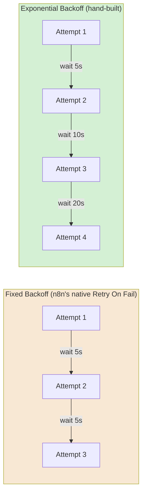
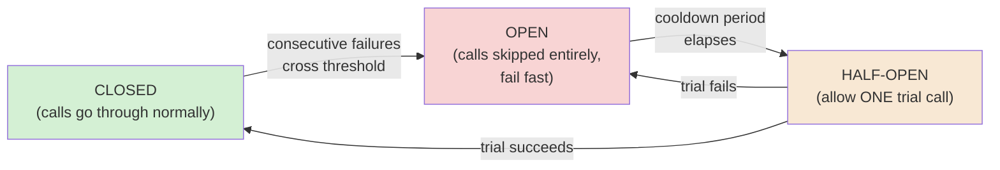
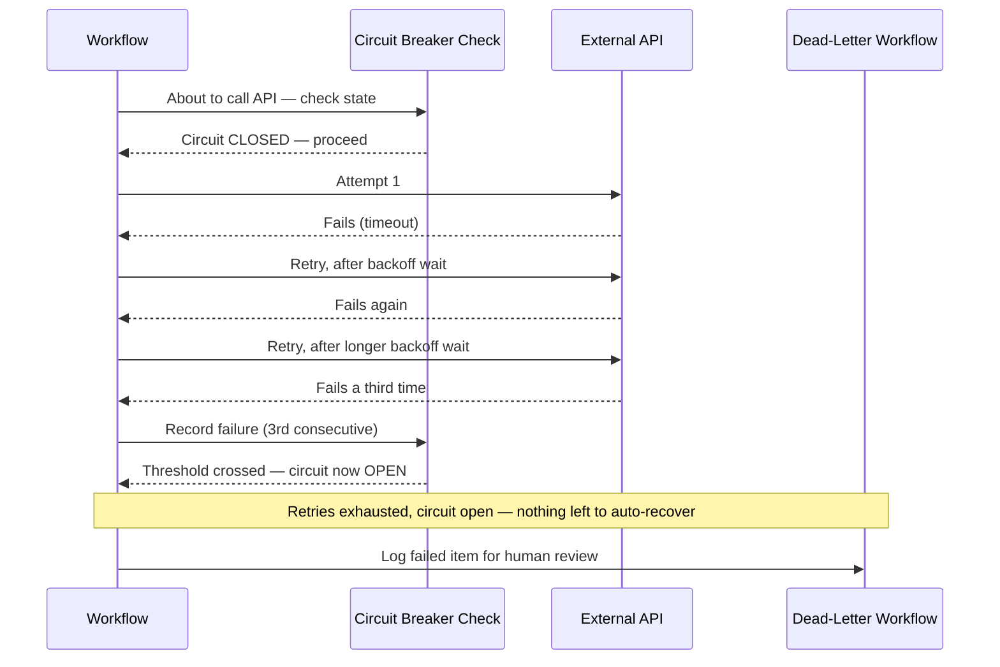
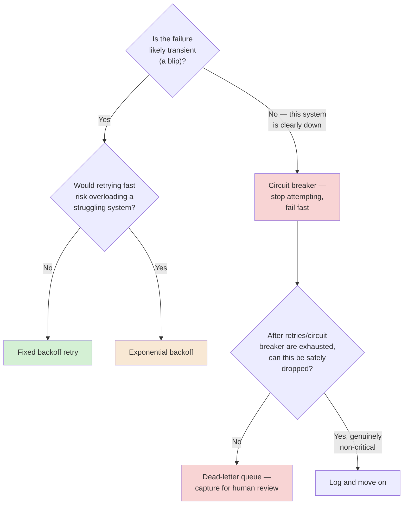

# Chapter 07 — Reliability and Error Recovery

## Learning Objectives

By the end of this chapter, you will be able to:

- Explain why "just retry it" isn't a reliability strategy on its own, without knowing whether the original attempt actually succeeded.
- Configure n8n's built-in **Retry On Fail** correctly, and know its real limit: fixed-delay only, no native exponential backoff.
- Hand-build **exponential backoff**, following the same pattern n8n's own official template gallery uses.
- Build a **circuit breaker** that stops hammering a failing external system instead of retrying it forever.
- Build a **dead-letter queue** pattern so failed executions are captured for review and reprocessing, not lost.
- Read an Error Trigger payload correctly — including the different, smaller shape it has when a *trigger* itself fails, not a regular node.
- Design one shared, standing Error Workflow used as the default across production workflows, instead of building error handling per-workflow.
- Explain how retry, circuit breaker, and dead-letter are three complementary techniques for different failure situations, not competing choices.

## Prerequisites

- **Chapters completed:** Chapters 01–06. This chapter assumes Chapter 01's idempotency and delivery-semantics vocabulary, Chapter 02's Error Trigger basics, and Chapter 06's saga pattern — it goes deep on the reliability mechanics those chapters used but didn't fully build out.
- **Tools installed:** Same n8n instance as previous chapters.

## Estimated Reading Time

65–80 minutes

## Estimated Hands-on Time

3 hours

---

## ⚡ Fast Read

> **Skim time: 5 minutes**

- **What it is:** The concrete engineering techniques for surviving failure — retrying correctly, backing off instead of hammering, breaking the circuit on a persistently failing system, and capturing what falls through the cracks instead of losing it.
- **Why it matters:** Chapter 01 taught you why duplicates happen when *someone else* retries calling *you*. This chapter is the other half: what happens when *your* workflow's own retry logic is the thing that isn't safe.
- **Key insight:** n8n's built-in retry setting is fixed-delay only — there's no native exponential backoff, and no native circuit breaker or dead-letter queue at all. All three are real, expected, hand-built patterns, not missing features — this chapter teaches you to build them properly.
- **What you build:** A correctly-configured retry, a hand-built exponential backoff loop, a working circuit breaker using workflow static data, and a dead-letter queue that captures failed executions for later review.
- **Jump to:** [Core Concepts](#core-concepts) | [First Retry](#beginner-implementation) | [Best Practices](#best-practices) | [Mini Project](#mini-project)

---

## Why This Topic Exists

Chapter 01 taught you what happens when a *caller* retries calling *you* — duplicate webhook deliveries, and the idempotency discipline to survive them. Chapter 04 flipped that around: your own workflow, calling someone else, can be the retrying party too. This chapter is where that second half gets built out properly, because "retry" by itself is not a reliability strategy — it's one ingredient, and used carelessly, it's exactly how you turn a single transient failure into a duplicate charge, a hammered partner API, or a permanently broken workflow nobody notices is broken.

Real failures aren't uniform. Some are truly transient (a network blip that succeeds on the very next attempt). Some are persistent (a partner's API is down for the next 20 minutes, and retrying every few seconds just adds load to an already-struggling system). Some can't be automatically recovered at all and genuinely need a human to look at them. Treating all three the same way — "retry a few times, then give up" — handles none of them well. This chapter gives you three distinct, complementary techniques, each matched to one of these situations: retry with backoff for the transient case, a circuit breaker for the persistent case, and a dead-letter queue for the case that needs a human.

## Real-World Analogy

Think about calling a busy customer service line.

If the line is briefly busy, you hang up and try again in a few seconds — that's a **retry**. If it's still busy, calling back immediately every second is obviously counterproductive — you'd wait a little longer each time you retry, giving the line a chance to clear. That's **backoff**, and doing it with a growing wait each time (10 seconds, then 20, then 40) is **exponential backoff**.

Now imagine the line has been busy for twenty straight minutes. At some point, a reasonable person stops redialing altogether and does something else instead — checks the website, tries again in an hour. That's a **circuit breaker**: after enough consecutive failures, you stop even attempting the call for a while, because attempting it is now just wasted effort that isn't helping anyone.

And if you genuinely need to reach this business today and can't get through no matter what, you leave a written note for a human to follow up on personally. That's a **dead-letter queue**: a place where things that couldn't be automatically resolved get captured, so a person can look at them later — instead of the request just vanishing.

---

## Core Concepts

### Retry

**Technical definition:** Automatically re-attempting a failed operation, up to a configured number of times.

**Plain English:** Trying again after it didn't work the first time.

**Analogy:** Redialing a busy line.

### Backoff

**Technical definition:** Waiting between retry attempts, rather than retrying immediately — **fixed backoff** waits the same amount of time every attempt; **exponential backoff** increases the wait each time (commonly doubling).

**Plain English:** Waiting a bit before trying again, and waiting longer each time it keeps not working.

**Analogy:** Redialing after 10 seconds, then 20, then 40 — giving the busy line more room to clear each time, instead of hammering it every second.

> n8n's built-in **Retry On Fail** setting supports only fixed-delay backoff — a set number of tries with the same wait between each. Exponential backoff is a real, expected pattern in production n8n workflows, but it isn't a checkbox — it's hand-built, typically with a Code node that computes each wait from the previous one. n8n's own official template gallery includes a template specifically for this ("Exponential backoff for Google APIs") — good evidence this is an endorsed, expected pattern, not a workaround for a missing feature.

### Circuit Breaker

**Technical definition:** A pattern that tracks consecutive failures against an external system and, once a threshold is crossed, stops attempting calls entirely for a cooldown period — "opening the circuit" — rather than continuing to retry a system that's clearly not currently working.

**Plain English:** After enough failures in a row, stop trying for a while instead of hammering a system that's obviously down.

**Analogy:** Giving up on redialing after twenty minutes of a busy line, and trying again in an hour instead of every ten seconds.

> n8n has no built-in circuit breaker. The real, current pattern is to track a consecutive-failure count (and the time of the last failure) using **`$getWorkflowStaticData('global')`** — data that persists across separate runs of the *same* workflow — and check that count before making the call: if it's over your threshold and the cooldown hasn't passed, skip the call entirely. Because workflow static data is scoped to one workflow, a circuit breaker that needs to be shared across *multiple* workflows calling the same external system needs an external store (a database table, Redis) instead.

### Dead Letter Queue (Dead-Letter Thinking)

**Technical definition:** A durable, reviewable place where operations that couldn't be automatically resolved (after retries and/or a circuit breaker have both given up) are captured, so a human can review and manually reprocess them later — rather than the failure simply being lost.

**Plain English:** A written note for a human, instead of a request that just disappears.

**Analogy:** Leaving a message for a human follow-up when redialing and waiting both haven't worked.

> n8n has no built-in dead-letter queue either. The real, current pattern is a dedicated workflow (often webhook-triggered) that the main workflow's error-handling branch calls, which logs the failed item — the original input data, the error message, a timestamp, a "processed" flag — to a persistent store (a database table, a spreadsheet) for later manual review.

### Error Trigger Payload

**Technical definition:** The specific data structure n8n's Error Trigger receives when a workflow it's attached to fails — and, critically, this shape **differs** depending on whether a regular node failed or the *trigger itself* failed.

**Plain English:** What information you actually get to work with when something breaks.

**Analogy:** A regular node failure is like an accident report with a case number you can look up later; a trigger failure is like the incident happening before the case was even opened — there's no case number, because nothing was ever officially started.

> This is a genuinely under-taught, concrete gotcha: a **regular node failure** includes `execution.id` and `execution.url` (you can look up the actual execution). A **trigger-node failure** does **not** include either — `execution.id`/`execution.url` simply aren't present, because the workflow never actually started executing. Error-handling logic that assumes `execution.id` always exists will break specifically on trigger failures — this chapter's Common Mistakes covers it directly.

### Idempotent Retry

**Technical definition:** A retry that's genuinely safe to perform because the operation it's retrying is idempotent (Chapter 01) — repeating it causes no additional effect beyond the first successful attempt.

**Plain English:** A retry that can't accidentally do the thing twice.

**Analogy:** Redialing to ask "did my order go through?" is always safe to repeat. Redialing to *place* the order again is not — unless the business has its own way of recognizing "this is the same order as before."

> This is the direct bridge between Chapter 01 and this chapter: every retry technique in this chapter (fixed, exponential, or circuit-breaker-gated) only becomes genuinely *safe* when the operation being retried is either naturally idempotent or protected by an idempotency key. Retrying a non-idempotent operation just retries the risk, faster.

### Standing Error Workflow

**Technical definition:** One shared, purpose-built Error Workflow, applied as the default error handler across many production workflows, rather than each workflow building its own bespoke error handling.

**Plain English:** One well-built safety net, reused everywhere, instead of a different, possibly-missing net under every single workflow.

**Analogy:** One well-staffed customer complaints desk for the whole building, instead of expecting every single department to build and staff their own.

---

## Architecture Diagrams

### Diagram 1 — Fixed vs. Exponential Backoff, Visually



### Diagram 2 — The Circuit Breaker's Three States



This is the classic three-state circuit breaker. n8n's hand-built version (using workflow static data) can implement all three states — closed by default, opening once a failure-count threshold is crossed, and half-open once the cooldown period has passed, allowing one trial call to decide whether to fully close again or re-open.

## Flow Diagrams

### Diagram 3 — Retry, Circuit Breaker, and Dead Letter, Working Together



---

## Beginner Implementation

> **No-code path.**

**Goal:** Configure a correct, fixed-delay retry — Aperture Cloud's "Resilient Status Check."

1. **Manual Trigger** → **HTTP Request node**, pointed at a real public API.
2. Open the node's **Settings** tab. Enable **Retry On Fail**, set a small number of tries (e.g. 3) and a short wait between them (e.g. 5 seconds).
3. Temporarily point the URL at a nonexistent endpoint, run it, and watch the execution take visibly longer than a single failed call would — confirming the retries and waits are actually happening.
4. Restore the correct URL and confirm a normal, successful run has no retry delay at all — retries only cost time when something's actually failing.

**What you just built:** A correctly-configured **fixed backoff retry** — simple, native, and the right choice for a call where a handful of quick retries is enough.

---

## Intermediate Implementation

> **Hand-building exponential backoff.**

**Goal:** Build the pattern n8n's own official template uses — a retry loop where each wait is longer than the last.

1. **Manual Trigger** → **HTTP Request node** with **Retry On Fail disabled** (this pattern replaces it, not stacks with it) and **On Error** set to **"Continue Using Error Output."**
2. On the error-output branch, a **Code node** implementing the backoff logic:

```javascript
// Learning example — exponential backoff, following the same pattern as
// n8n's own official "Exponential backoff for Google APIs" template.
// Tracks attempt count via workflow static data so it persists correctly
// across the loop's repeated runs within this execution.

const staticData = $getWorkflowStaticData('node');
const attempt = (staticData.attempt || 0) + 1;
const maxAttempts = 5;

if (attempt > maxAttempts) {
  staticData.attempt = 0;  // reset for next time
  throw new Error(`Gave up after ${maxAttempts} attempts`);
}

staticData.attempt = attempt;
const waitSeconds = Math.pow(2, attempt);  // 2, 4, 8, 16, 32...

return [{ json: { ...$json, waitSeconds, attempt } }];
```

3. Connect this to a **Wait node**, "After Time Interval," using the Code node's `waitSeconds` value as an expression.
4. Loop back to the original HTTP Request node after the wait, closing the loop.
5. Run it against a deliberately failing URL and confirm the wait time genuinely grows on each successive attempt, per Diagram 1.

**What to notice:** Compare the total time this takes against the Beginner Implementation's fixed-delay retry on the same number of failures — exponential backoff takes longer per attempt but puts meaningfully less repeated load on a struggling downstream system.

---

## Advanced Implementation

> **Engineering-depth path.** A circuit breaker and a dead-letter queue, together.

**Part A — circuit breaker:**

```javascript
// Learning example — circuit breaker check, placed BEFORE the actual
// downstream call. Reads and updates workflow static data to track
// consecutive failures and decide whether to allow this call through.

const staticData = $getWorkflowStaticData('global');
const now = Date.now();
const FAILURE_THRESHOLD = 3;
const COOLDOWN_MS = 5 * 60 * 1000;  // 5 minutes

const consecutiveFailures = staticData.consecutiveFailures || 0;
const openedAt = staticData.circuitOpenedAt || 0;

if (consecutiveFailures >= FAILURE_THRESHOLD) {
  const cooldownElapsed = (now - openedAt) > COOLDOWN_MS;
  if (!cooldownElapsed) {
    // Circuit OPEN — skip the call entirely, fail fast.
    throw new Error('Circuit open — downstream system recently failing repeatedly, skipping call');
  }
  // Cooldown elapsed — allow this one HALF-OPEN trial call through.
}

return [{ json: $json }];
```

```javascript
// Learning example — placed on the downstream call's success/error
// branches, updating the circuit breaker's state accordingly.

// On SUCCESS branch:
const staticData = $getWorkflowStaticData('global');
staticData.consecutiveFailures = 0;  // reset — circuit closes
return [{ json: $json }];

// On ERROR branch (separate Code node):
// const staticData = $getWorkflowStaticData('global');
// staticData.consecutiveFailures = (staticData.consecutiveFailures || 0) + 1;
// staticData.circuitOpenedAt = Date.now();
// throw new Error('Downstream call failed, recorded for circuit breaker');
```

**Part B — dead-letter queue:**

1. Build a separate workflow, **Webhook Trigger** as its entry point, that accepts a failed item's data and appends it to a persistent store (a Postgres table or spreadsheet) with columns: `workflow_name`, `input_data`, `error_message`, `created_at`, `processed`.
2. In your main workflow's error-handling branch (after retries and the circuit breaker have both been exhausted), call this DLQ workflow with the failed item's data.
3. Run a failure through end to end and confirm the failed item lands in your persistent store, with enough information to actually diagnose and manually reprocess it later.

**The common mistake alongside the correct pattern:**

```text
WRONG: Error-handling logic that reads $json.execution.id unconditionally
— works for regular node failures, throws an unrelated error (or
silently produces undefined) for trigger-node failures, since
execution.id isn't present in that payload shape at all.

RIGHT: Check which failure shape you actually have first (e.g., does
$json.execution exist?) before assuming execution.id is there — per this
chapter's Core Concepts on the Error Trigger payload.
```

---

## Production Architecture

- **One shared, standing Error Workflow, applied by default.** Per Chapter 02, an Error Workflow only fires if it's explicitly selected in each workflow's Settings — production teams generally build one well-designed shared Error Workflow (routing based on the failure shape correctly, per this chapter's Common Mistake) and apply it as a default across every production workflow, rather than leaving it to each builder to remember.
- **Circuit breaker scope matters.** Workflow static data scopes a circuit breaker to one workflow. If five different workflows all call the same flaky partner API, each has its own independent circuit breaker unless you deliberately move the state to a shared external store — worth deciding deliberately, not by accident.
- **A dead-letter queue is only useful if someone actually reviews it.** Capturing failures is half the job — production teams need a real process (a daily check, an alert when the queue grows) for actually working through it, or it becomes a graveyard nobody visits.

---

## Best Practices

1. **Never retry a non-idempotent operation without an idempotency key** (Chapter 01) — a retry on a `POST` that already succeeded server-side is exactly how you create duplicates.
2. **Use fixed backoff for quick, likely-transient failures; use exponential backoff when a downstream system might genuinely be struggling** and hammering it repeatedly would make things worse.
3. **Add a circuit breaker for any external dependency your workflow calls frequently enough that repeated failures could add real load** to an already-struggling system.
4. **Always give retries and circuit breakers a final fallback — a dead-letter queue** — so exhausted failures are captured, not silently lost.
5. **Build one shared Error Workflow and apply it as a default**, rather than leaving error handling to be reinvented (or forgotten) per workflow.
6. **Check the Error Trigger payload's actual shape before assuming fields exist** — trigger-node failures don't carry `execution.id`/`execution.url`.

---

## Security Considerations

- **Dead-letter queue entries carry the same sensitivity as the original data.** A failed record logged for review often contains the exact same customer data the main workflow was handling — secure and access-control the DLQ store the same way you would the primary data path, not as a lower-stakes afterthought.
- **Circuit breaker state and retry counters are a minor but real information surface.** Workflow static data and any external store used for shared circuit-breaker state should be treated with the same access discipline as other workflow configuration — it can reveal which integrations are currently unhealthy.

## Cost Considerations

A circuit breaker is a genuine cost-saving technique, not just a reliability one: skipping calls entirely once a threshold is crossed avoids paying for (and waiting on) repeated failed attempts against a system that's clearly not responding — both in n8n's own execution time and in any per-call cost the downstream API charges. Exponential backoff similarly reduces wasted retry volume compared to hammering at a fixed short interval. Neither technique changes n8n's own execution-based billing directly (Chapter 01) — the savings show up in reduced execution duration and reduced load on (and cost from) whatever you're calling.

## Common Mistakes

**Mistake 1 — Retrying a non-idempotent call with no protection.**
```text
WRONG: Retry On Fail enabled on a POST that creates a new record, no
idempotency key anywhere.
RIGHT: Idempotency key (Chapter 01) on the receiving side, or confirm
the operation is naturally idempotent, before enabling any retry.
```

**Mistake 2 — Assuming the Error Trigger payload always has `execution.id`.**
```text
WRONG: $json.execution.id used unconditionally in error-handling logic.
RIGHT: Check for $json.execution's existence first — it's absent for
trigger-node failures, per this chapter's Core Concepts.
```

**Mistake 3 — No cooldown on a circuit breaker.**
```text
WRONG: Circuit "opens" but nothing ever checks whether it should close
again — the workflow permanently stops calling a system that's since
recovered.
RIGHT: A defined cooldown period after which a half-open trial call
decides whether to close the circuit again, per Diagram 2.
```

## Debugging Guide

| Symptom | Likely cause | Where to look |
|---|---|---|
| Duplicate side effects after a transient failure | Retry on a non-idempotent operation, no idempotency key | Whether the retried call is genuinely safe to repeat |
| Error-handling logic throws on trigger failures specifically | Assumed `execution.id` always exists | The Error Trigger payload's actual shape for this specific failure |
| Workflow keeps calling a clearly-down system repeatedly | No circuit breaker | Whether consecutive-failure tracking exists before the call |
| A circuit breaker never recovers after the downstream system is back | No cooldown/half-open logic | The circuit breaker's reset condition |
| Failures are noticed weeks late | No dead-letter queue, or one nobody reviews | Whether failed items are captured, and whether anyone's actually checking |

## Performance Optimisation

> Illustrative Aperture Cloud measurements.

In an illustrative test against a deliberately flaky endpoint (failing ~40% of requests): fixed retry (3 tries, 5s each) added an average of 6 seconds per genuinely-failed call. A circuit breaker, once the failure threshold was crossed, reduced that to near-zero for subsequent calls during the outage window — failing fast instead of waiting through a doomed retry sequence. The lesson: **retries help with transient failures; a circuit breaker is what actually saves time (and load) once a failure stops being transient.**

---

## Technology Comparison

| Platform | Retry/backoff | Circuit breaker |
|---|---|---|
| **n8n** | Native fixed-delay retry; exponential backoff hand-built (official template exists) | No native primitive — hand-built via workflow static data |
| **Zapier / Make** | Built-in retry on many actions, generally fixed-interval, limited configurability | No native primitive |
| **Temporal** | **Built-in, configurable retry policies with native exponential backoff**, as a core SDK feature | Not a first-class primitive, but Temporal's durable-execution model makes many circuit-breaker use cases less necessary in the first place |
| **Apache Airflow** | Native `retries` and `retry_delay` per task, including exponential backoff support | No native primitive; typically hand-built in the task's own code |

This is a place where being honest about n8n's limits matters: Temporal and Airflow both have more built-in reliability primitives than n8n does. n8n's tradeoff is visual accessibility and faster iteration in exchange for more hand-built reliability engineering — a real cost, not a hidden one, and exactly the kind of thing this course's Decision Framework in Chapter 01 exists to help you weigh honestly.

## Decision Framework



---

### Production Issue: The Retry That Doubled Every Order

**Symptoms**

Aperture Cloud's order-sync workflow, calling a partner fulfillment API, began creating **two fulfillment records for the same order** roughly once every few hundred orders — no error visible anywhere, both records looked entirely legitimate.

**Root Cause**

The workflow had Retry On Fail enabled on the fulfillment API call. Occasionally, the original request actually **succeeded on the partner's end**, but the response was lost in transit (a network blip on the way back, not on the way there) before n8n received it — n8n's own outbound call timed out waiting for a response it never saw, and Retry On Fail correctly, automatically retried. The retry created a **second, genuinely new** fulfillment record, because the fulfillment API's create-order endpoint had no idempotency key protection, and the retry had no way to check "did my last attempt actually already go through?" before trying again.

**How to Diagnose It**

Compare timestamps of duplicate fulfillment records against the workflow's execution log — a retried execution whose first attempt's timeout coincides suspiciously closely with the partner API's own record of a successful (but unacknowledged) first request is the signature of this exact failure.

**How to Fix It**

```text
BEFORE: Retry On Fail enabled, fulfillment API called directly, no
idempotency key sent, no check for a prior successful attempt.

AFTER: Generate a stable idempotency key (e.g., the order ID) BEFORE the
first attempt, and send it with every attempt — including retries — as
a header the fulfillment API is documented to deduplicate on (Chapter 04
territory: many real APIs support exactly this). If the partner API
doesn't support idempotency keys, add a pre-flight "does an order already
exist for this ID?" check before retrying, using the API's own read
endpoint.
```

**How to Prevent It in Future**

Treat "does this call have an idempotency key, or a way to check prior success before retrying?" as a required check before enabling Retry On Fail on any outbound call that creates or modifies something — not an optional hardening step, per this chapter's Best Practices and the direct callback to Chapter 01's idempotency discipline.

---

## Exercises

1. **(15 min)** For three real API calls you're familiar with, decide whether retrying them blindly would be safe, and why.
2. **(30 min)** Build the Beginner Implementation's fixed-delay retry.
3. **(45–60 min)** Build the Intermediate Implementation's hand-built exponential backoff loop.
4. **(60–90 min)** Build the Advanced Implementation's circuit breaker and dead-letter queue together, and trigger a failure sequence long enough to see the circuit actually open.
5. **(20 min)** Reproduce this chapter's Common Mistake 2: write error-handling logic assuming `execution.id` always exists, then trigger a real trigger-node failure and observe it break.

## Quiz

**1. Does n8n's built-in Retry On Fail support exponential backoff natively?**
> No — it's fixed-delay only. Exponential backoff must be hand-built, though it's a real, officially-templated pattern, not an unsupported workaround.

**2. What's the danger of retrying a non-idempotent operation with no protection?**
> The original attempt may have actually succeeded even though the response was lost — retrying blindly can create a genuine duplicate, exactly as in this chapter's Production Issue.

**3. What does a circuit breaker do that plain retry-with-backoff doesn't?**
> It stops attempting calls entirely once a failure threshold is crossed, for a cooldown period — failing fast instead of continuing to retry (and add load to) a system that's clearly not currently working.

**4. What n8n mechanism is used to track a circuit breaker's state, and what's its scope limitation?**
> `$getWorkflowStaticData('global')` — scoped to a single workflow; sharing circuit-breaker state across multiple workflows calling the same system requires an external store instead.

**5. What's missing from the Error Trigger payload specifically when a trigger node fails, compared to a regular node failure?**
> `execution.id` and `execution.url` are absent — because the workflow never actually started executing when the trigger itself fails.

**6. Why does n8n's official template gallery having an "Exponential backoff" template matter for this chapter's argument?**
> It's evidence, from an official source, that hand-building exponential backoff is an endorsed, expected pattern in n8n — not a workaround for a missing feature or a community-only hack.

**7. What's the purpose of the "half-open" state in a circuit breaker?**
> To allow one trial call through after the cooldown period, to check whether the downstream system has actually recovered, before deciding to fully close the circuit again or re-open it.

**8. Why is a dead-letter queue only half the reliability job?**
> Because capturing failed items is only useful if someone actually reviews and reprocesses them — an unreviewed DLQ just becomes a place failures quietly accumulate instead of being lost outright, without actually solving anything.

**9. In this chapter's Production Issue, why didn't the retry itself look like an obvious bug?**
> Because Retry On Fail worked exactly as designed — the actual problem was that the fulfillment API's create-order call had no idempotency protection, so a retry after a lost response created a second, legitimate-looking record instead of safely doing nothing.

**10. According to this chapter's Technology Comparison, how does n8n's reliability tooling compare to Temporal's?**
> Temporal has native, configurable retry policies with built-in exponential backoff as a core SDK feature; n8n's equivalent is fixed-delay natively, with exponential backoff, circuit breakers, and dead-letter queues all requiring hand-building — a real, honest tradeoff for n8n's visual accessibility.

## Mini Project

**Aperture Cloud's Resilient Partner Sync (2–3 hours)**

- [ ] A working exponential backoff loop on a real (or simulated flaky) API call.
- [ ] A circuit breaker that visibly opens after a defined number of consecutive failures.
- [ ] A written note explaining, for your specific call, why retrying it is (or isn't) safe without an idempotency key.

## Production Project

**Aperture Cloud's Full Reliability Stack (1–2 days)**

- [ ] Retry with backoff, a circuit breaker, and a dead-letter queue, all working together per Diagram 3.
- [ ] A shared Error Workflow correctly handling both regular-node and trigger-node failure payload shapes without assuming fields that aren't always present.
- [ ] A deliberate reproduction of this chapter's Production Issue at small scale (a retry creating a duplicate due to no idempotency protection), then the fix applied and demonstrated.
- [ ] A written comparison (300–500 words) of total recovery time and downstream load with vs. without the circuit breaker, using a deliberately sustained failure window in both versions.

## Key Takeaways

- Retry alone is not a reliability strategy — it only becomes safe when paired with idempotency (Chapter 01).
- n8n's native retry is fixed-delay only; exponential backoff, circuit breakers, and dead-letter queues are all real, expected, hand-built patterns.
- A circuit breaker's job is to stop retrying once a failure is clearly not transient — failing fast instead of continuing to add load.
- Dead-letter queues only close the loop if someone actually reviews them.
- The Error Trigger payload's shape differs for trigger-node failures — `execution.id`/`execution.url` aren't present, a real, easy-to-miss gotcha.
- One shared, standing Error Workflow, applied by default, beats reinventing error handling per workflow.
- Circuit breakers save real cost and time by avoiding repeated failed attempts against a clearly-down system.
- n8n has genuinely fewer built-in reliability primitives than Temporal or Airflow — an honest tradeoff, not a hidden gap.

## Chapter Summary

| Technique | When to use it |
|---|---|
| Fixed backoff retry | Quick, likely-transient failures |
| Exponential backoff | Failures where hammering could worsen a struggling system |
| Circuit breaker | A system that's clearly, persistently down |
| Dead-letter queue | The final fallback once retries/circuit breaker are exhausted |

## Resources

- n8n's official "Exponential backoff for Google APIs" template — cited in this chapter as evidence hand-built backoff is an endorsed pattern
- [n8n workflow static data documentation](https://docs.n8n.io) — the mechanism behind this chapter's circuit breaker
- [n8n Error Trigger documentation](https://docs.n8n.io/integrations/builtin/core-nodes/n8n-nodes-base.errortrigger/) — the payload shapes this chapter builds on

## Glossary Terms Introduced

| Term | One-line definition |
|---|---|
| Retry | Automatically re-attempting a failed operation |
| Backoff | Waiting between retries — fixed or exponential |
| Circuit Breaker | Stopping calls entirely after a consecutive-failure threshold |
| Dead Letter Queue | A durable capture point for unrecoverable failures, for human review |
| Idempotent Retry | A retry safe to perform because the operation can't be duplicated |
| Standing Error Workflow | One shared Error Workflow applied as the default across workflows |

## See Also

| Topic | Related Chapter | Why |
|---|---|---|
| Automation Architecture | Chapter 01 | Idempotency and delivery semantics — this chapter's retries are only safe because of that discipline |
| Event-Driven Thinking | Chapter 02 | Error Trigger basics, extended here into full payload-shape handling |
| Workflow Design Patterns | Chapter 06 | Saga's compensating steps need this chapter's reliability discipline to be trustworthy |
| Scaling n8n in Production | Chapter 16 | Shared circuit-breaker state across workflows at real infrastructure scale |

## Preparation for Next Chapter

**Technical checklist:**
- [ ] Built a working circuit breaker and confirmed it opens and later recovers.
- [ ] Built a dead-letter queue and confirmed a failed item lands in it with enough data to reprocess.

**Conceptual check:**
- Why isn't retry alone a reliability strategy?
- What's missing from a trigger-node failure's Error Trigger payload, and why?

**Optional challenge:** Before Chapter 08, count how many nodes your largest workflow from this course has so far. Chapter 08 is about exactly the point where that number becomes a real maintainability problem.

---

> **Currency Note:** This chapter's n8n-specific facts (Retry On Fail's fixed-delay-only behavior, the official exponential-backoff template, workflow static data, and the Error Trigger's differing payload shapes) were verified in July 2026.
