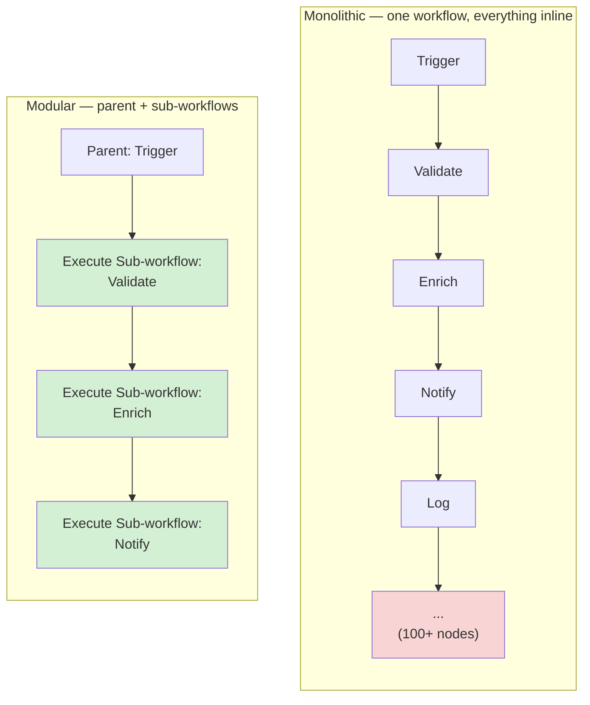
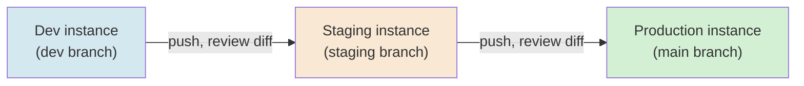
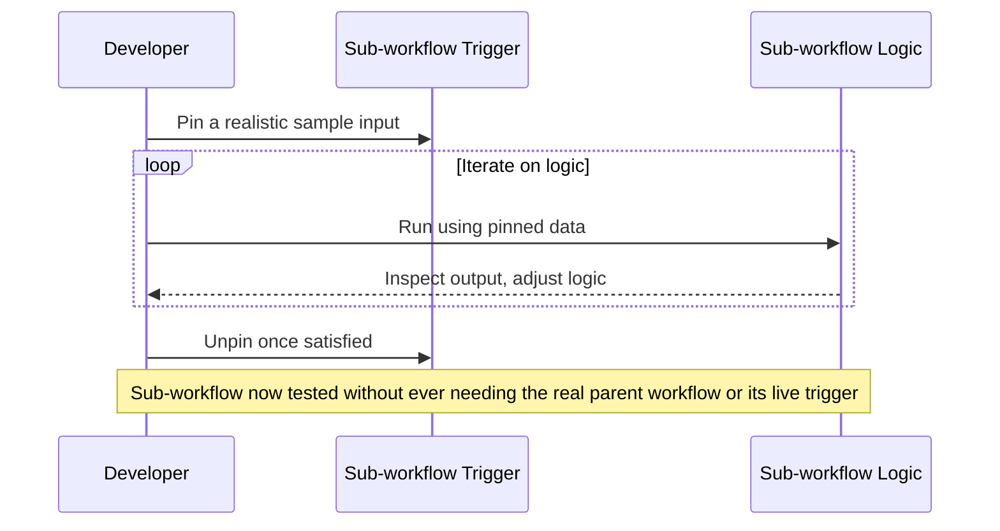
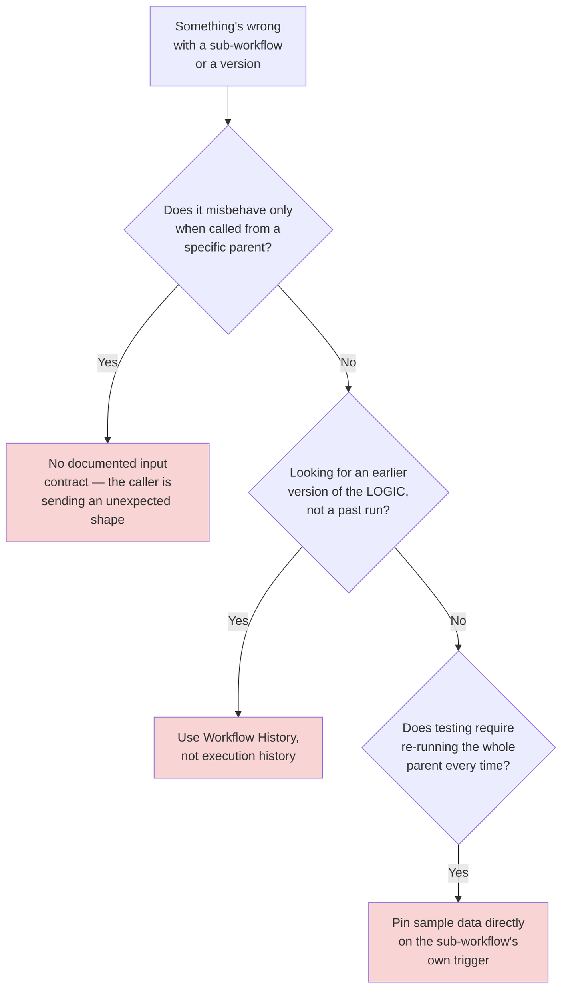
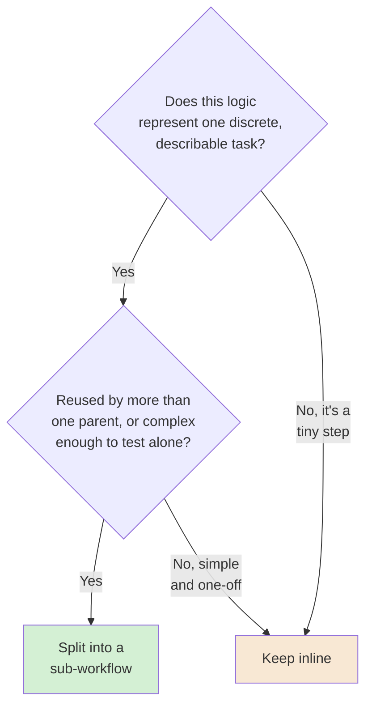

# Chapter 08 — Modular Workflow Design and Workflows as Code

## Learning Objectives

By the end of this chapter, you will be able to:

- Recognize the warning signs of a monolithic workflow that's grown past the point where one person can safely reason about it.
- Split a workflow into a parent and one or more **sub-workflows**, using **Execute Sub-workflow**, with a clean, documented input contract.
- Explain why composing a process from multiple sub-workflows costs the same, execution-wise, as one giant workflow — a real, counterintuitive n8n billing fact.
- Use **Workflow History** to view, restore, and label versions of a single workflow, and explain how it differs from full Git-based source control.
- Describe how Git-based source control represents **environments** (dev/staging/production) and how to read a workflow diff.
- Use **data pinning** to test a sub-workflow in isolation, without re-triggering a live parent event every time.
- Design a sub-workflow's input contract using n8n's current input-data modes, instead of leaving it undocumented.
- Apply "one workflow per task" as a concrete, testable design discipline — not just a slogan.

## Prerequisites

- **Chapters completed:** Chapters 01–07. This is Module 2's final chapter — it assumes Chapter 05's data-contract concept, Chapter 06's Execute Sub-workflow basics, and Chapter 07's reliability discipline, and applies all three to the question of how to structure a workflow as it grows.
- **Tools installed:** Same n8n instance as previous chapters.

## Estimated Reading Time

60–75 minutes

## Estimated Hands-on Time

3 hours

---

## ⚡ Fast Read

> **Skim time: 5 minutes**

- **What it is:** Structuring automation the way you'd structure any other growing codebase — breaking one enormous workflow into smaller, composable, independently-testable pieces, and versioning them properly.
- **Why it matters:** A 120-node workflow isn't just ugly — it's a workflow where one small change can break something unrelated, where a single failure is hard to trace, and where nobody wants to be the one who touches it.
- **Key insight:** In n8n specifically, splitting a process into sub-workflows doesn't cost you anything extra — only the parent (top-level) execution counts toward billing, confirmed directly from n8n's own documentation. Modularity here is free, not a tradeoff against cost.
- **What you build:** A monolithic process split cleanly into a parent and sub-workflows with a real input contract, tested in isolation with pinned data, and a look at how Workflow History and Git-based source control keep them versioned like real code.
- **Jump to:** [Core Concepts](#core-concepts) | [First Split](#beginner-implementation) | [Best Practices](#best-practices) | [Mini Project](#mini-project)

---

## Why This Topic Exists

Every workflow you've built in this course so far has been small enough to see the whole thing on one screen. Real production automation doesn't stay that size. A process grows one "just add one more step" at a time, and there's no single moment where it crosses from "manageable" to "nobody wants to touch this" — it just gradually does. This chapter exists to give you the discipline to notice that boundary before you cross it, and the concrete n8n mechanics (sub-workflows, input contracts, versioning) to stay on the right side of it.

The case for modularity in software engineering generally is well established: smaller, focused units are easier to test, easier to reason about, and easier to safely change. n8n has a specific, extra reason to take this seriously that most platforms don't hand you for free: **sub-workflow executions don't cost anything extra.** Per n8n's own documentation, only the parent (top-level) execution counts toward your plan's execution quota — a process built from five composed sub-workflows bills the same as one giant workflow doing the same work inline. Modularity here isn't a tradeoff against cost. It's free.

## Real-World Analogy

A restaurant that only ever serves one giant, all-in-one dish — appetizer, main, dessert, all cooked by one person from one recipe card — has a real problem the moment they want to change just the dessert: they risk the whole dish, because nothing is separated. A restaurant with a proper kitchen has **stations**: a specific person (or process) responsible for one part of the meal, each independently testable ("does the dessert station's recipe work on its own?"), each independently replaceable (swap out the dessert recipe without touching the main course), and each with a clear, defined hand-off ("the main course arrives at the pass looking like *this*, every time"). That defined hand-off is exactly what a sub-workflow's **input contract** is — an explicit agreement about what goes in and what comes out, so the rest of the kitchen doesn't have to guess.

---

## Core Concepts

### Modularity ("One Workflow Per Task")

**Technical definition:** Structuring automation as multiple smaller, focused workflows — each responsible for one discrete, describable task — composed together, rather than one large workflow doing everything inline.

**Plain English:** Many small, focused workflows instead of one giant one.

**Analogy:** Kitchen stations, each responsible for one part of the meal.

### Sub-workflow

**Technical definition:** A workflow invoked by another workflow via the **Execute Sub-workflow** node, receiving input through its own **"When Executed by Another Workflow"** trigger, and returning its final node's output back to the caller.

**Plain English:** A workflow that's called by another workflow, like a function call.

**Analogy:** The dessert station, called on by the head chef when a dessert order comes in — a self-contained unit with its own defined job.

### Input Contract

**Technical definition:** The explicit, documented shape of data a sub-workflow expects to receive — in n8n, configured on the sub-workflow's trigger via one of three current modes: defining individual required fields, providing a JSON example of the expected shape, or accepting all data unconditionally.

**Plain English:** The written agreement for "here's exactly what you need to hand me."

**Analogy:** The dessert station's own recipe card specifying exactly what ingredients it expects to be handed — not "whatever's left over."

> This directly extends Chapter 05's **data contract** concept to the boundary between two workflows. Accepting all data unconditionally is a real, available option — but it pushes the validation responsibility entirely onto the sub-workflow itself, and is generally the weakest of the three choices for anything meant to be reused.

### Monolithic Workflow

**Technical definition:** A single, large workflow handling many unrelated concerns inline, without being split into smaller composed units.

**Plain English:** The one giant workflow that does everything, which nobody wants to open.

**Analogy:** The one-cook, one-recipe-card restaurant, scaled up to a hundred dishes.

> There's a concrete, mechanical reason this matters beyond readability: a sub-workflow's memory is released once it completes, while a monolithic workflow holds everything in memory for its entire, much longer run — a direct, practical extension of Chapter 05's memory model.

### Workflow History

**Technical definition:** n8n's built-in, automatic version-snapshot feature for a single workflow — every save creates a recoverable version, viewable and restorable from within the editor; **Named Versions** let you label a specific version and exempt it from automatic pruning.

**Plain English:** A save-history for one workflow, built into the editor.

**Analogy:** A document editor's own version history — not full source control, just "let me see and restore an earlier draft of this one thing."

> Worth being precise about: this is distinct from **execution history**, which tracks past *runs* of the current workflow *version* — Workflow History tracks past *versions of the definition itself*. Confusing the two is an easy, common mistake.

### Git-Based Source Control (Environments)

**Technical definition:** n8n's feature for linking an instance to a Git repository, where each **environment** (dev/staging/production) corresponds to one n8n instance plus one Git branch — enabling a genuine promotion workflow (build in dev, review a diff, push to staging, then production) the way real software is deployed.

**Plain English:** Real version control and real environments for your workflows, the same discipline a software team already uses for code.

**Analogy:** A software team's dev/staging/production branches and deploy pipeline, applied to workflow definitions instead of application code.

> The Git branch stores workflow copies, tags, and variable/credential *stubs* — never actual secret values, consistent with Chapter 04's Credentials Manager separation.

### Workflow Diff

**Technical definition:** n8n's UI feature for visually comparing two versions of a workflow (typically the remote Git branch's version against the local instance's version) before pushing or pulling — shown as two full workflow renderings stacked for comparison, not a raw line-level JSON diff.

**Plain English:** "What's actually different between this workflow here and the one in Git," shown visually.

**Analogy:** A document comparison tool showing two drafts side by side, rather than a raw text diff of the underlying file.

### Data Pinning

**Technical definition:** Locking a node's output to a fixed sample dataset, so downstream testing uses that fixed data instead of re-triggering the workflow's real, live event every time.

**Plain English:** Freezing a test dataset in place so you can test repeatedly without needing the real thing to happen again.

**Analogy:** Rehearsing the dessert station with a fixed practice order, instead of needing a real customer to place one every time you want to test a recipe change.

> This is a natural fit for testing sub-workflows in isolation — pin a realistic sample input on the sub-workflow's trigger, and iterate on its internal logic without needing the parent workflow (or its real trigger) involved at all.

---

## Architecture Diagrams

### Diagram 1 — Monolithic vs. Modular



### Diagram 2 — Environments via Git Branches



## Flow Diagrams

### Diagram 3 — Testing a Sub-workflow in Isolation with Pinned Data



---

## Beginner Implementation

> **No-code path.**

**Goal:** Split a simple inline validation step into a parent workflow and a sub-workflow — Aperture Cloud's "Order Validator."

1. Build the sub-workflow first: **"When Executed by Another Workflow"** trigger, configured with the **JSON example** input mode, providing a sample order shape (`order_id`, `email`, `amount`). Follow it with an IF node checking `email` and `amount` are valid (reusing Chapter 05's validation pattern), ending in a Set node returning `{ valid: true/false, reason }`.
2. Build the parent workflow: **Manual Trigger** → **Set node** (sample order) → **Execute Sub-workflow node**, pointed at the sub-workflow you just built, with **"Wait for Sub-Workflow Completion" enabled**.
3. Run the parent and confirm it receives the sub-workflow's `{ valid, reason }` result back directly.

**What you just built:** A real parent/sub-workflow split with an explicit **input contract** (the JSON example mode) — the exact shape of Diagram 1's modular side, at the smallest possible scale.

---

## Intermediate Implementation

> **Composing multiple sub-workflows — "one workflow per task," for real.**

**Goal:** Extend the Beginner Implementation into a small pipeline of composed sub-workflows.

1. Build two more sub-workflows: **"Enrich Order"** (adds a `customer_tier` field via a lookup — simulate with a Set node) and **"Notify Team"** (formats and simulates sending an internal notification).
2. In the parent workflow, chain three Execute Sub-workflow nodes in sequence: Validate → Enrich → Notify, each receiving the previous one's output as its input.
3. Run the full chain and confirm data flows correctly through all three sub-workflows.

**What to notice:** This is Chapter 06's **pipeline** pattern, built from **composed sub-workflows** instead of inline nodes — each piece is independently testable, independently reusable in a different parent workflow, and — per this chapter's Cost Considerations below — costs no more than doing it all inline.

---

## Advanced Implementation

> **Engineering-depth path.** Testing in isolation, and versioning like real code.

**Part A — data pinning:**

1. Open the "Enrich Order" sub-workflow directly (not through the parent). On its trigger node's output, **pin** a realistic sample order.
2. Modify the enrichment logic (add a new derived field) and re-run the sub-workflow directly, using the pinned data — confirm you can iterate on this one piece without ever running the parent workflow or its trigger.
3. **Unpin** once you're satisfied, per Diagram 3.

**Part B — Workflow History:**

4. Make a small, deliberate change to any sub-workflow and save it. Open **Workflow History** and confirm you can see the previous version.
5. Label the current version as a **Named Version** (e.g., "v1 — before adding tier field") so it's exempt from automatic pruning, and confirm you could restore it if needed.

**The common mistake alongside the correct pattern:**

```text
WRONG: Accept all data unconditionally on every sub-workflow's trigger
"to keep things flexible" — every caller can send anything, and the
sub-workflow has no documented contract at all.

RIGHT: Use the JSON example or explicit-fields input mode for any
sub-workflow meant to be reused or maintained by more than one person —
per this chapter's Input Contract concept.
```

---

## Production Architecture

- **The billing fact belongs in your architecture decisions, not just your cost spreadsheet.** Because only the parent execution counts toward plan quota, there's no execution-based cost penalty for splitting aggressively — the limiting factor on how modular to get is maintainability and clarity, not cost.
- **Sub-workflow memory isolation is a real production benefit**, not just a tidiness argument — a sub-workflow's memory is released once it completes, directly mitigating the large-dataset memory concerns Chapter 05 covered, in a way a monolithic workflow processing the same volume inline cannot.
- **Environments via Git branches are the real production answer to "how do I safely promote a workflow change."** Reviewing a workflow diff before pushing from staging to production is the direct n8n equivalent of a code review gate.

---

## Best Practices

1. **Split a workflow into a sub-workflow when it represents one discrete, describable task** — not for every single node, and not never.
2. **Always give a reusable sub-workflow an explicit input contract** (JSON example or defined fields), never "accept everything."
3. **Test sub-workflows in isolation with pinned data** before wiring them into a parent — don't rely on the full chain working first-try.
4. **Use Workflow History's Named Versions for meaningful checkpoints**, not just relying on automatic, prunable snapshots.
5. **Use Git-based source control and real environments for anything production-critical** — a workflow diff reviewed before promotion is a real safety gate, not overhead.

---

## Security Considerations

- **Modularity is a real least-privilege mechanism.** A sub-workflow responsible for one task only needs the credentials (Chapter 04) that task actually requires — splitting a monolithic workflow's broad credential access into narrower, per-sub-workflow scopes directly reduces blast radius, the same principle Chapter 04 taught for OAuth2 scopes, now applied at the workflow-composition level.
- **Git-stored credential stubs, not secrets, is the safe default — confirm it stays that way.** Never manually paste a real secret value into anything destined for a Git-tracked workflow copy, even "just for testing."

## Cost Considerations

This chapter's single most important, most counterintuitive fact: **per n8n's own documentation, only the parent (top-level) execution counts toward your plan's execution quota when a workflow calls another via Execute Sub-workflow.** A process built from five composed sub-workflows costs exactly the same, execution-wise, as one giant workflow doing the same work inline. (One caveat worth flagging: at least one third-party pricing guide states the opposite — that each sub-workflow run is billed separately. That claim contradicts n8n's own official documentation directly; trust the primary source.) This removes the one argument that might otherwise push a team toward a monolithic design "to save on executions" — there is no such saving to be had, and the maintainability cost of staying monolithic is real.

## Common Mistakes

**Mistake 1 — Splitting for its own sake.**
```text
WRONG: A separate sub-workflow for every single node, adding indirection
without adding real reusability or testability.
RIGHT: Split at the boundary of a discrete, describable task — per this
chapter's "one workflow per task" discipline.
```

**Mistake 2 — No input contract on a reused sub-workflow.**
```text
WRONG: "Accept all data" mode on a sub-workflow called from three
different parent workflows, each sending a slightly different shape.
RIGHT: An explicit JSON-example or defined-fields contract, so every
caller knows exactly what's expected.
```

**Mistake 3 — Confusing Workflow History with execution history.**
```text
WRONG: Looking in execution history to find "what did this workflow's
logic look like last week" — that only shows past runs of the CURRENT
version.
RIGHT: Workflow History, for past versions of the definition itself.
```

## Debugging Guide



| Symptom | Likely cause | Where to look |
|---|---|---|
| A sub-workflow behaves unexpectedly when called from a new parent | No documented input contract; the new caller sends a shape it wasn't built for | The sub-workflow trigger's input data mode |
| Can't find an earlier version of a workflow's logic | Looked in execution history instead of Workflow History | Workflow History, not execution history |
| A workflow diff before a production push looks unexpectedly large | An unrelated change got bundled in with the intended one | Review the diff carefully before pushing, per this chapter's Production Architecture |
| Testing a sub-workflow requires re-running the whole parent every time | No pinned data on the sub-workflow's own trigger | Pin realistic sample data directly on the sub-workflow, per this chapter's Advanced Implementation |

## Performance Optimisation

> Illustrative Aperture Cloud measurements.

In an illustrative comparison, a 120-node monolithic onboarding workflow held its entire dataset in memory for the whole ~40-second run; the same process split into four sub-workflows released each stage's memory as that sub-workflow completed, reducing peak memory by roughly a third in testing — a direct, measurable benefit beyond just readability.

---

## Technology Comparison

| Platform | Composition mechanism | Native versioning |
|---|---|---|
| **n8n** | Execute Sub-workflow (sub-executions don't count separately toward billing) | Workflow History (in-editor) + Git-based source control (Business/Enterprise) |
| **Zapier / Make** | Nested Zaps/scenarios exist but are less central to the platform's core design | Limited built-in version history compared to n8n's Workflow History |
| **Temporal** | Native child workflows, with strong built-in versioning support for evolving a workflow's code safely over time | Genuinely more mature native versioning than any visual platform in this comparison — a fair, honest gap to acknowledge |
| **Apache Airflow** | TaskGroups and sub-DAGs for composing related tasks | DAG definitions versioned via the surrounding codebase's own version control (typically Git directly, no separate in-tool history) |

## Decision Framework



---

### Production Issue: The 140-Node Onboarding Workflow Nobody Wanted to Touch

**Symptoms**

Aperture Cloud's employee-onboarding workflow had grown, one small addition at a time over a year, to roughly 140 nodes in a single workflow. A routine change — updating one welcome-email template — broke an unrelated Slack notification three steps away, because both had been quietly relying on the same intermediate field a well-meaning earlier edit had renamed.

**Root Cause**

Everything lived in one workflow with no separation of concerns. There was no way to test the email-template change in isolation — the only way to verify anything was to run the entire 140-node process end to end, which meant the unrelated breakage wasn't caught until a real new-hire's onboarding actually failed partway through.

**How to Diagnose It**

The signature of this failure class isn't a single log line — it's the pattern: an unrelated change breaking something with no obvious connection, discoverable only by tracing through a workflow too large to hold in your head at once.

**How to Fix It**

```text
BEFORE: One 140-node workflow — email, Slack, HR system update, IT
provisioning, all inline, tightly coupled through shared intermediate
fields nobody fully tracked.

AFTER: A parent workflow orchestrating four sub-workflows — "Send Welcome
Email," "Notify Team," "Update HR System," "Provision IT Access" — each
with its own explicit input contract, each testable in isolation with
pinned data, each independently reviewable in a Git diff before changes
ship.
```

**How to Prevent It in Future**

Treat "does this workflow represent one discrete, describable task, or several?" as a standing design question revisited periodically, not just at initial build time — a workflow that starts focused can still grow into a monolith one reasonable-seeming addition at a time, exactly as this one did.

---

## Exercises

1. **(15 min)** Count the nodes in your largest workflow from this course so far, and identify one natural split point.
2. **(45 min)** Build the Beginner Implementation's parent/sub-workflow split with a real input contract.
3. **(60 min)** Build the Intermediate Implementation's three-sub-workflow pipeline.
4. **(45 min)** Practice data pinning on one sub-workflow, iterating on its logic without touching the parent.
5. **(20 min)** Make a change to a sub-workflow, save it, and use Workflow History to view and restore the previous version.

## Quiz

**1. What's the confirmed, current n8n billing fact about sub-workflow executions?**
> Only the parent (top-level) execution counts toward plan quota — sub-workflow runs invoked via Execute Sub-workflow don't consume additional execution quota.

**2. What are n8n's three current input-data modes for a sub-workflow's trigger?**
> Defining individual required fields, providing a JSON example of the expected shape, or accepting all data unconditionally.

**3. Why does accepting all data unconditionally weaken a sub-workflow's input contract?**
> It pushes all validation responsibility onto the sub-workflow itself and gives callers no documented expectation of what shape to send — the weakest of the three options for anything meant to be reused.

**4. What's the difference between Workflow History and execution history?**
> Workflow History tracks past versions of a workflow's own definition (its logic). Execution history tracks past runs of the current version. They answer different questions.

**5. What does a Named Version in Workflow History do that a regular automatic snapshot doesn't?**
> It labels a specific version and exempts it from automatic pruning, so it's guaranteed to remain available later.

**6. What real, mechanical (not just organizational) benefit does splitting a monolithic workflow into sub-workflows provide?**
> Memory isolation — a sub-workflow's memory is released once it completes, unlike a monolithic workflow holding everything in memory for its entire, longer run.

**7. What does an environment correspond to in n8n's Git-based source control model?**
> One n8n instance plus one Git branch.

**8. What does a workflow diff actually show — a raw line-level JSON diff, or something else?**
> Two full workflow versions rendered and stacked for visual comparison, not a raw line-level JSON diff.

**9. Why is data pinning particularly useful for sub-workflow development specifically?**
> It lets you test a sub-workflow's logic in isolation, using fixed sample input, without needing to re-trigger the real parent workflow or its live event every time you iterate.

**10. In this chapter's Production Issue, what specific gap let an unrelated change break something else undetected?**
> No separation of concerns and no way to test any single piece in isolation — the only verification method was running the entire 140-node workflow end to end, so a subtle cross-dependency wasn't caught until a real failure occurred.

## Mini Project

**Aperture Cloud's Order Processing Split (2–3 hours)**

- [ ] A monolithic version and a modular (parent + 2+ sub-workflows) version of the same process, both functional.
- [ ] Each sub-workflow has an explicit input contract (JSON example or defined fields).
- [ ] A written note comparing the two versions' testability — specifically, what you could test in isolation in the modular version that you couldn't in the monolithic one.

## Production Project

**Aperture Cloud's Onboarding Refactor (1–2 days)**

- [ ] A simulated "monolithic" onboarding workflow (15-20 nodes is enough to demonstrate the pattern) refactored into a parent plus at least three sub-workflows.
- [ ] Each sub-workflow tested in isolation using pinned data before being wired into the parent.
- [ ] At least one deliberate Workflow History checkpoint (a Named Version) at a meaningful milestone.
- [ ] A written comparison (300–500 words) of this chapter's Production Issue scenario against your refactored version — specifically, how your version would have caught (or avoided) the same cross-dependency breakage.

## Key Takeaways

- A monolithic workflow's real cost isn't ugliness — it's untestability and unpredictable blast radius from unrelated changes.
- Sub-workflow executions don't count separately toward n8n's plan quota — modularity is genuinely free, cost-wise.
- An explicit input contract on every reusable sub-workflow is what makes "one workflow per task" actually safe to compose.
- Workflow History and execution history answer different questions — versions of the definition, vs. runs of the current version.
- Data pinning lets you test a sub-workflow in real isolation, without needing its real parent or live trigger.
- Git-based source control and environments bring a real code-review-style promotion gate to workflow changes.
- Sub-workflow memory isolation is a genuine mechanical benefit, not just an organizational one.
- Splitting for its own sake is a real mistake too — the right boundary is a discrete, describable task, not every single node.

## Chapter Summary

| Concept | Key Takeaway |
|---|---|
| Sub-workflow | Composable unit, called via Execute Sub-workflow, free of extra execution cost |
| Input Contract | Explicit expected shape — JSON example, defined fields, or (weakest) accept-all |
| Monolithic Workflow | The anti-pattern — hard to test, unpredictable blast radius |
| Workflow History | In-editor version snapshots of the definition, distinct from execution history |
| Git-Based Source Control | Real environments and diffs, a genuine promotion/review gate |
| Data Pinning | Test a sub-workflow in isolation with fixed sample data |

## Resources

- n8n's execution/billing documentation confirming sub-workflow executions don't count separately — the load-bearing fact behind this chapter's Cost Considerations
- [n8n Execute Sub-workflow documentation](https://docs.n8n.io/integrations/builtin/core-nodes/n8n-nodes-base.executeworkflow/)
- [n8n data pinning documentation](https://docs.n8n.io/data/data-pinning)

## Glossary Terms Introduced

| Term | One-line definition |
|---|---|
| Modularity | Structuring automation as multiple small, focused, composed workflows |
| Sub-workflow | A workflow invoked by another via Execute Sub-workflow |
| Input Contract | The documented expected shape of data a sub-workflow requires |
| Monolithic Workflow | A single large workflow handling many unrelated concerns inline |
| Workflow History | In-editor version snapshots of a workflow's own definition |
| Git-Based Source Control | Linking an instance to Git; environments as instance + branch |
| Workflow Diff | Visual comparison of two workflow versions before push/pull |
| Data Pinning | Locking a node's output to fixed sample data for repeatable testing |

## See Also

| Topic | Related Chapter | Why |
|---|---|---|
| Data Transformation and Validation at Scale | Chapter 05 | Data contracts and memory model, extended here to the sub-workflow boundary |
| Workflow Design Patterns | Chapter 06 | Pipeline and Execute Sub-workflow basics, composed here into full modular design |
| Reliability and Error Recovery | Chapter 07 | Per-sub-workflow error handling as part of a modular reliability strategy |
| Custom Code Nodes — JavaScript and Python | Chapter 14 | Code reuse patterns at the node level, complementing this chapter's workflow-level modularity |
| Governance and Compliance | Chapter 18 | Git-based source control and environments, covered at full production-governance depth |

## Preparation for Next Chapter

**Technical checklist:**
- [ ] Built a working parent/sub-workflow split with a real input contract.
- [ ] Practiced data pinning and Workflow History on a real sub-workflow.

**Conceptual check:**
- Why doesn't splitting a workflow into sub-workflows cost more, execution-wise?
- What's the difference between Workflow History and execution history?

**Optional challenge:** Module 2 is complete. Before Chapter 09 (where AI agents enter the canvas and this course's Autonomy Thread escalates), review Chapters 01–08's Key Takeaways sections in sequence — you now have the complete non-AI automation-engineering foundation this course's AI-native chapters are about to build directly on top of.

---

> **Currency Note:** This chapter's n8n-specific facts (the sub-workflow execution billing behavior, the three input data modes, Workflow History and Named Versions, and Git-based source control's environment/diff mechanics) were verified against `docs.n8n.io` in July 2026.
