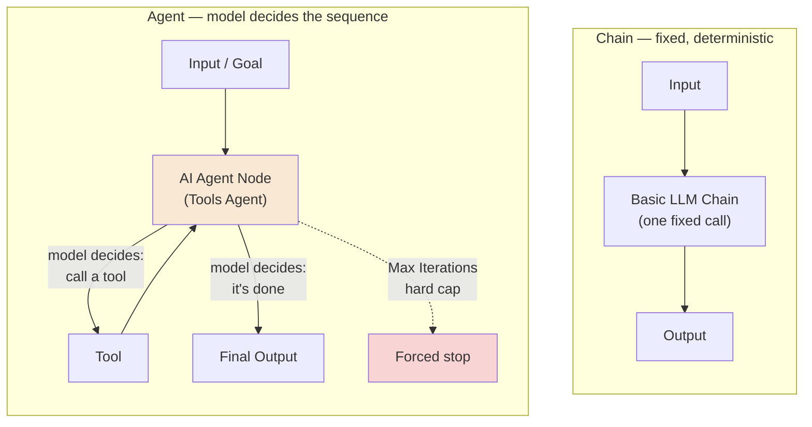
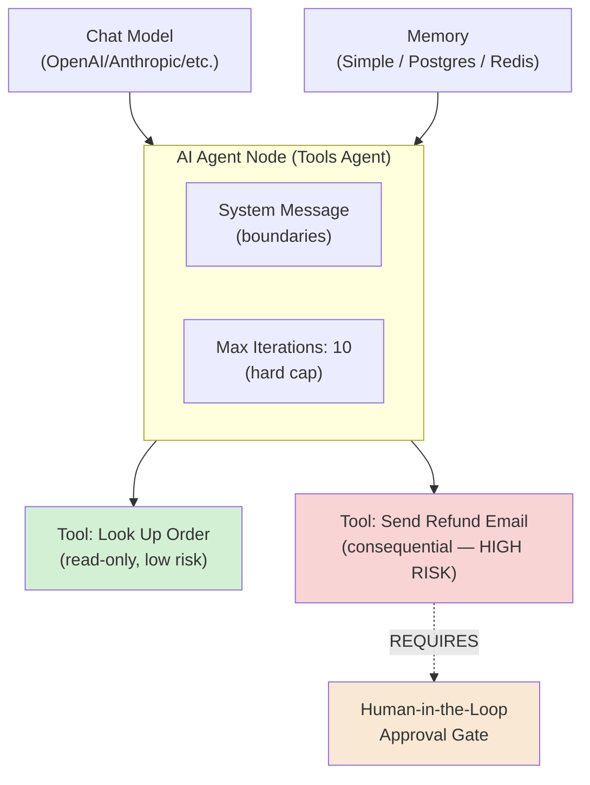
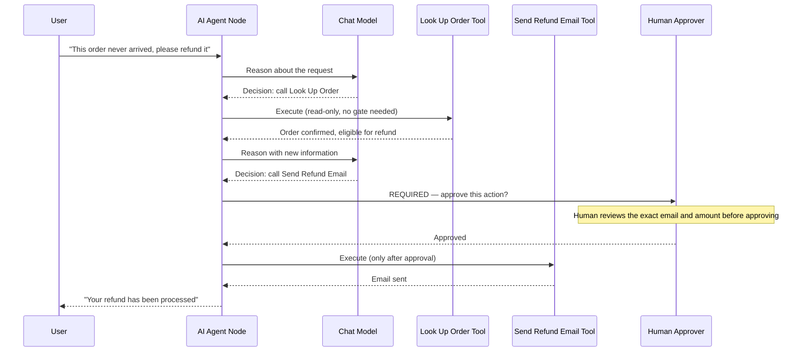
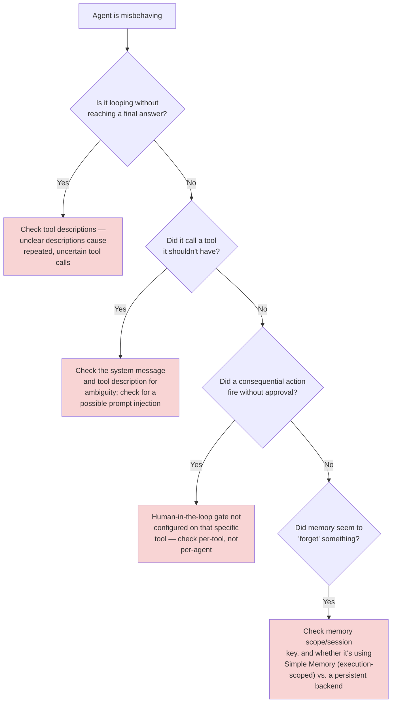
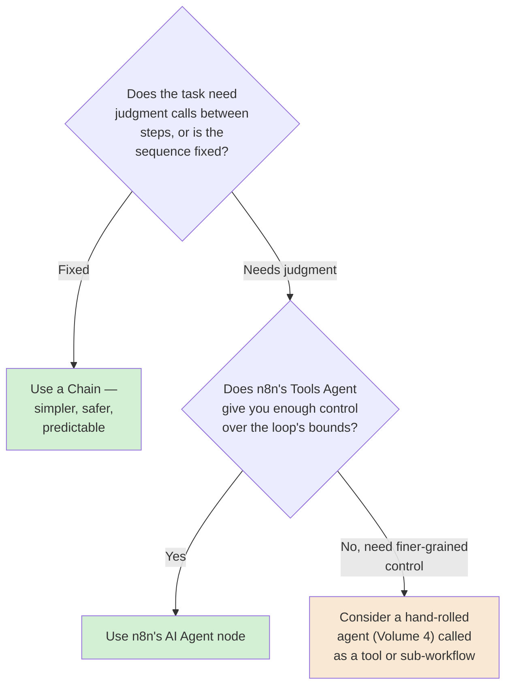

# Chapter 09 — The AI Agent Node: LangChain Inside the Canvas

## Learning Objectives

By the end of this chapter, you will be able to:

- Explain the difference between a **Chain** (a fixed, deterministic sequence) and an **Agent** (where the model itself decides what happens next) — the exact distinction Volume 4 Chapter 01 taught, now expressed visually on n8n's canvas.
- Build a working **AI Agent node** using the **Tools Agent** — the only agent type n8n currently supports — connected to a chat model and at least one tool.
- Configure **Max Iterations** as a real, load-bearing safety control, and explain why its default of 10 is a deliberate ceiling, not a suggestion.
- Choose between n8n's current memory options for an agent, and understand the difference between session-scoped memory and true cross-session persistence.
- Use **`$fromAI()`** to let the agent supply its own tool-call parameters, and understand exactly what new risk that convenience introduces.
- Add a **human-approval gate** in front of a consequential tool call, using the Tools Agent's built-in human-review mechanism.
- Add a **Guardrails node** to check input and output for jailbreak attempts, PII, secret keys, and other policy violations.
- Recognize the real, documented failure mode of an unbounded agent loop burning real money, and explain exactly which n8n controls exist to prevent it.

## Prerequisites

- **Chapters completed:** Chapters 01–08 (this course), plus **Volume 4 (AI Agent Engineering), especially Chapter 01** — this chapter assumes you already know what a reasoning loop, bounded autonomy, and blast radius are; it doesn't re-teach them, it shows you where n8n implements each one.
- **Tools installed:** Same n8n instance as previous chapters, plus an API key for at least one supported chat model provider (OpenAI, Anthropic, or another current option).

## Estimated Reading Time

75–90 minutes

## Estimated Hands-on Time

3.5 hours

---

## ⚡ Fast Read

> **Skim time: 5 minutes**

- **What it is:** n8n's visual implementation of an LLM agent — a canvas node that connects a chat model, optional memory, and one or more tools, and lets the model itself decide which tools to call and when to stop, bounded by a hard iteration limit.
- **Why it matters:** This is the chapter where this course's threshold gets crossed. Chapters 01–08 built workflows where every step was decided by you, in advance. From here on, a workflow can decide its own next action — which means every discipline Volume 4 taught about bounded, supervised autonomy now has to be built, concretely, on this canvas.
- **Key insight:** n8n's AI Agent node only supports one agent type — the Tools Agent — as of a real, specific version (1.82.0), when other agent types were removed. This isn't a limitation to work around; it's n8n converging on the same architecture Volume 4 taught as the right default: a bounded reasoning loop with explicit tool grants.
- **What you build:** A read-only Q&A agent, then a multi-turn agent with real memory, then an agent with a genuinely consequential tool — sending a real email — gated behind a human-approval step and a Guardrails check, so its autonomy is real but supervised.
- **Jump to:** [Core Concepts](#core-concepts) | [First Agent](#beginner-implementation) | [Best Practices](#best-practices) | [Mini Project](#mini-project)

---

## Why This Topic Exists

Every workflow in Chapters 01–08 had a shape you decided in advance. An IF node's two branches were both things you designed. A Switch node's routing rules were yours. Even Chapter 06's saga, with its compensating steps, followed a script you wrote. Nothing in this course so far has had a workflow *decide*, in the moment, what to do next — the closest it got was a human clicking "approve" on a Wait node.

An **agent** is different in exactly one structural way, and Volume 4 Chapter 01 already gave you the vocabulary for it: a chain (or a pipeline, in this course's own terms) has *your code* own the control flow — the LLM only fills in content within steps you defined. An agent hands the LLM the steering wheel — it decides which tool to call, in what order, and when it's done. That's the entire value of building one, and it's also the entire source of new risk, because a probabilistic model choosing its own next action can loop, can misjudge, and can act on a false premise in ways a fixed pipeline structurally cannot.

This chapter exists to show you exactly how n8n implements that handoff — and, just as importantly, exactly how it implements the *bounds* around it. The good news, confirmed directly from n8n's own documentation while researching this chapter: n8n's AI Agent node has converged on a single, opinionated agent architecture (the Tools Agent, with a hard-capped Max Iterations setting) that maps almost one-to-one onto the bounded-loop discipline Volume 4 spent an entire chapter building from raw API calls. You're not learning a new philosophy here — you're learning where that philosophy lives on this specific canvas.

## Real-World Analogy

Volume 4 Chapter 01 used a warehouse shift supervisor to explain the difference between a tool-augmented assistant and a genuine agent — someone told "make sure nothing on the floor is below reorder threshold by end of day," who decides for themselves which aisles to check and in what order, instead of being told each specific action.

n8n's AI Agent node is that supervisor, built on a canvas. The **Chat Model** node is the supervisor's own judgment and language ability. The **Tool** nodes are the specific capabilities you've actually handed them — a barcode scanner, a radio to call other departments, a company credit card. **Memory** is what they remember from earlier in the shift. The **system message** is their job description and boundaries — "you may reorder anything under $500 without asking; anything touching the walk-in cooler needs a manager's sign-off first." And **Max Iterations** is the shift clock itself: no matter how deep into a task the supervisor gets, there's a hard limit on how many rounds of "check something, decide what's next" they get before the shift — the execution — ends.

---

## Core Concepts

### Chain vs. Agent

**Technical definition:** A **chain** is a fixed, deterministic sequence of LLM calls and transformations, defined entirely by the workflow builder — the LLM fills in content, but never decides the sequence itself. An **agent** is a loop where the model itself decides, at each step, which action to take next (including which tool to call, or whether to stop), based on the evolving state of the task.

**Plain English:** A chain is a recipe the model follows. An agent is a goal the model pursues, choosing its own steps.

**Analogy:** The warehouse employee who checks exactly what they're told to check (a chain) versus the shift supervisor deciding for themselves what needs checking (an agent) — the exact distinction Volume 4 Chapter 01 opened with.

> This is not a subtle distinction, and n8n's own documentation draws it explicitly: none of n8n's Chain nodes (Basic LLM Chain, Question and Answer Chain, Summarization Chain) support memory or autonomous branching — they're single-purpose, predictable, and safe by construction, precisely because nothing about them decides anything. Reach for a Chain when the task is well-defined and doesn't need judgment calls between steps. Reach for an **Agent** — the rest of this chapter — specifically when it does.

### AI Agent Node (Tools Agent)

**Technical definition:** n8n's node for building an agent (package `n8n-nodes-langchain.agent`), implementing LangChain's tool-calling interface. As of n8n version 1.82.0, this node supports exactly one agent type — the **Tools Agent** — after other agent types (Conversational Agent, ReAct Agent, and others) were removed and consolidated.

**Plain English:** The one, current, correct way to build an agent in n8n.

**Analogy:** The shift supervisor role itself, as a single, well-defined job description — not a menu of different supervisor "styles" to choose between.

> This consolidation is worth sitting with: n8n didn't remove options to simplify the product for its own sake — it converged on the specific pattern (tool-calling, with the model reasoning about which tool fits a given task) that turned out to be the one worth keeping. That's a real, current signal about which agent architecture has proven itself in production, not just a UI simplification.

### Chat Model

**Technical definition:** The connector sub-node supplying the actual language model an AI Agent node reasons with — current supported providers include OpenAI, Anthropic, Groq, Mistral Cloud, and Azure OpenAI, each as its own Chat Model node type.

**Plain English:** Which underlying AI the agent is actually powered by.

**Analogy:** The supervisor's own judgment and reasoning ability — the tools and job description stay the same regardless of which specific person is filling the role.

### Tool

**Technical definition:** A sub-node granting the AI Agent a specific capability it can choose to invoke — current connection methods include calling another n8n workflow (**Call n8n Workflow Tool**, directly reusing Chapter 08's sub-workflow pattern), making an HTTP request (**HTTP Request Tool**), or running custom logic (**Code Tool**).

**Plain English:** A specific thing you've actually handed the agent — nothing more, nothing less.

**Analogy:** The barcode scanner, the radio, the company credit card — each a specific, granted capability, not a blanket "do whatever's needed."

> Every tool you connect is a direct, concrete instance of Volume 4's **blast radius** concept: an agent with only a read-only "look up order status" tool has a small blast radius. The same agent with a "send a real email" or "issue a refund" tool has a much larger one — same agent, same model, wildly different consequences if it misjudges, purely as a function of what's connected.

### Bounded Loop (Max Iterations)

**Technical definition:** The Tools Agent's hard cap on how many reasoning/tool-call rounds it will run before stopping, regardless of whether it's reached a satisfying answer — confirmed current default: **10**.

**Plain English:** The shift clock — no matter how deep into the task the agent gets, it stops after this many rounds.

**Analogy:** Exactly Volume 4 Chapter 01's Bounds Enforcer, drawn as a separate box from the reasoning loop itself for a reason: the limit has to be enforced by something the model can't talk its way around, not by asking it nicely to wrap up.

> This is the single most direct, concrete link between this chapter and Volume 4's entire first chapter. A default of 10 is not arbitrary — it's a real engineering decision about how much unsupervised reasoning to allow before something (in this case, simply the iteration counter) forces a stop. Raising it without a reason is a real, avoidable risk; this chapter's Production Issue is built around exactly that mistake.

### Memory

**Technical definition:** A sub-node giving an AI Agent access to prior conversation turns — current options include **Simple Memory** (an in-memory window of recent messages, the current name for what's commonly still called Window Buffer Memory) and external, persistent backends like **Postgres Chat Memory** and Redis-backed memory.

**Plain English:** What the agent remembers from earlier in the conversation.

**Analogy:** The supervisor's own short-term memory of what's already happened this shift — gone the moment the shift ends, unless someone wrote it down somewhere durable.

> A real, confirmed, current gotcha worth knowing before you build with it: connecting more than one **Postgres Chat Memory** node with the same configuration means they share the same underlying memory instance by default — not two separate memories, one shared one. Memory is also, by default, **scoped to a session** — it does not automatically persist between genuinely separate conversations unless you deliberately wire it to a persistent backend and a stable session key.

### System Message

**Technical definition:** The instruction text provided to the agent before any conversation begins, shaping its behavior, boundaries, and decision-making for the entire session.

**Plain English:** The agent's job description and boundaries, set once, up front.

**Analogy:** "You may reorder anything under $500 without asking; anything touching the walk-in cooler needs a manager's sign-off first" — Volume 4's own example, now something you type into a field.

### Human-in-the-Loop Gate

**Technical definition:** A built-in Tools Agent mechanism requiring explicit human approval — via Chat, Slack, Telegram, or other configured channels — before a specific, designated tool actually executes.

**Plain English:** A real "are you sure?" step, enforced by the platform, before the agent is allowed to do something consequential.

**Analogy:** The supervisor radioing a manager before touching the walk-in cooler, exactly as their job description requires — except here, the platform itself enforces that the radio call happens, rather than trusting the supervisor to remember.

> This is the concrete mechanism behind this course's own Autonomy Thread, at exactly the structural point CLAUDE.md's own kickoff planning called out: from this chapter forward, workflows may carry genuinely consequential capability, but only paired with a real, enforced human checkpoint for the specific actions that need one — not for everything, and not as an afterthought.

### `$fromAI()`

**Technical definition:** An expression function letting a tool's parameter value be determined by the agent itself at call time, rather than being fixed by the workflow builder in advance.

**Plain English:** Letting the AI decide, itself, what value to actually pass into a tool — the recipient of an email, the amount of a refund, the specific record to update.

**Analogy:** Handing the supervisor a blank order form instead of a pre-filled one — they decide what to write on it, which is powerful, and also exactly why the walk-in cooler rule from the System Message example above exists.

> This is real, expanded attack surface, not just convenience. A tool whose every parameter is fixed by you is fully predictable. A tool whose parameters are supplied by `$fromAI()` inherits whatever the model decided — including, in a prompt-injection scenario, whatever an attacker managed to get the model to decide. This chapter's Security Considerations covers this directly.

### Guardrails

**Technical definition:** A dedicated node (`n8n-nodes-langchain.guardrails`) checking text against a defined set of policy violations — current checks include Keywords, Jailbreak, NSFW, PII, Secret Keys, Topical Alignment, and URL handling — routing violations to a distinct Fail branch.

**Plain English:** A dedicated safety checkpoint for text going into or coming out of the model.

**Analogy:** A security checkpoint the supervisor's radio messages pass through — not trusting the supervisor's own judgment alone to catch every problem.

---

## Architecture Diagrams

### Diagram 1 — Chain vs. Agent, on n8n's Canvas



### Diagram 2 — Anatomy of a Tools Agent



Notice the two tools are drawn with deliberately different risk colors — this is the blast-radius principle from Volume 4, made visible: the same agent, same model, same system message, but a completely different risk profile depending purely on which tools are actually connected.

## Flow Diagrams

### Diagram 3 — One Agent Turn, Including a Human-Approval Gate



---

## Beginner Implementation

> **No-code path.** No coding required.

**Goal:** Aperture Cloud's "Internal FAQ Assistant" — a read-only agent with no consequential capability at all.

1. **Chat Trigger** — n8n's dedicated chat-interface trigger, generating a real conversational UI to test against.
2. **AI Agent node**, connected to a **Chat Model** node (configure your provider's API key via the Credentials Manager, per Chapter 04 — never hardcode it).
3. Add one **HTTP Request Tool**, pointed at a real, public, read-only API (reuse a source from earlier chapters). Give the tool a clear name and description — the agent uses this description to decide *when* to reach for it.
4. Set the **System Message**: "You are Aperture Cloud's internal FAQ assistant. Answer questions helpfully. Use the lookup tool when you need current information; otherwise answer directly."
5. Run it via the chat interface, asking a question that requires the tool and one that doesn't — confirm the agent correctly decides when to reach for it and when not to.

**What you just built:** A genuine **agent** — the model, not you, decided whether to call the tool on each turn — with the smallest possible blast radius, since the only tool connected is read-only.

---

## Intermediate Implementation

> **Adds memory and a deliberate Max Iterations decision.**

**Goal:** Extend the FAQ assistant into a real multi-turn conversation, with a second tool and a considered iteration limit.

1. Add a **Simple Memory** node, connected to the AI Agent node — confirm, by asking a follow-up question referencing something said earlier in the same session, that the agent now has real conversational context.
2. Add a second **HTTP Request Tool** for a different, still read-only capability.
3. Open the AI Agent node's options and look at **Max Iterations** — currently defaulted to 10. Ask yourself: for a two-tool, read-only FAQ assistant, does a single user question plausibly need 10 rounds of tool-calling to answer? Lower it to **4** deliberately, and document, in a comment or a README, *why* you chose that number for this specific agent.
4. Test a question requiring both tools in sequence, and confirm it completes well within your new, tighter limit.

**What to notice:** This is the exact discipline Volume 4 Chapter 01 taught — bound the loop *deliberately*, based on the actual task, not by leaving the default in place unexamined. A two-tool FAQ agent and a complex multi-step research agent have no business sharing the same iteration ceiling.

---

## Advanced Implementation

> **Engineering-depth path.** A genuinely consequential tool, gated by human approval and Guardrails — this course's first workflow with real, escalating stakes.

**Goal:** Aperture Cloud's "Refund Assistant" — an agent that can look up an order (low risk) *and* send a real refund confirmation email (high risk), with the high-risk action gated behind human approval.

1. Build on the Intermediate Implementation's agent. Add a **Call n8n Workflow Tool**, pointed at a sub-workflow (Chapter 08 pattern) that sends a real email via a service you've already configured (Chapter 04). Name it clearly: "Send Refund Confirmation Email."
2. Use **`$fromAI()`** in the sub-workflow's input parameters so the agent supplies the recipient and refund amount itself, based on the conversation — e.g., `{{ $fromAI('recipient_email') }}`.
3. **Enable the human-in-the-loop approval requirement** on this specific tool, configured to route the approval request to a real channel (Slack, for this exercise). Leave the read-only lookup tool ungated — the point is *selective* gating, not blanket friction on every action.
4. Add a **Guardrails node** immediately after the Chat Trigger, checking incoming user messages for **Jailbreak** and **PII** violations before they ever reach the AI Agent node, routing violations to a distinct Fail branch that stops the conversation safely.

```text
// The gating decision, stated explicitly — this is the actual engineering
// judgment call this exercise is teaching, not the specific n8n config:
//
// Look Up Order (read-only, reversible)         → NO approval gate
// Send Refund Confirmation Email (real, external,
//   costs money, hard to undo once sent)         → REQUIRES approval gate
//
// Gating everything equally would just train the approver to click
// "approve" reflexively. Gating nothing defeats the entire point of this
// chapter. The gate belongs specifically on the tool whose blast radius
// actually warrants it.
```

5. Run the full flow end to end: ask for a refund, watch the agent look up the order (no gate), decide to send the email (gate fires), and confirm the email only actually sends after a human approves in Slack.

**The common mistake alongside the correct pattern:**

```text
WRONG: Gate every single tool call behind human approval "to be safe" —
including the read-only lookup. The approver quickly starts approving
everything without really reading it, because most of what they're
approving was never actually risky.

RIGHT: Gate selectively, based on actual blast radius (Volume 4's own
concept) — read-only and reversible actions proceed automatically;
real-world, hard-to-undo actions require a genuine, meaningful approval
step.
```

**How to debug it when it breaks:** If the agent never reaches the email tool at all, check the tool's description — the model decides *whether* to call a tool based largely on how clearly its description matches the task, not just its technical availability. If the approval gate never fires, confirm it's configured on the correct tool, not the agent as a whole. If `$fromAI()` values look wrong, inspect the agent's intermediate steps (via the "Return Intermediate Steps" option) to see exactly what the model decided to pass, rather than guessing.

**The production version, where it differs from the learning version:** The learning version above approves via a single Slack message. A production version typically logs every gated decision (approved and rejected) to a durable store for audit purposes — directly anticipating Chapter 18's governance and audit requirements — and defines a clear escalation path for what happens if no one approves within a reasonable window.

---

## Production Architecture

- **Streaming has real trigger requirements, inherited directly from Chapter 01.** The Tools Agent streams by default, but this requires a compatible trigger — a Chat Trigger, or a Webhook node explicitly configured with the Streaming response mode from Chapter 01's own response-mode taxonomy. Getting this wrong doesn't fail loudly; it just silently falls back to non-streaming behavior.
- **Max Iterations is one bound, not the only one.** Production agent deployments generally pair it with the cost-based circuit-breaker thinking from Chapter 07 — a per-conversation or per-day token/spend ceiling, tracked and enforced independently of the iteration count, since a small number of iterations can still be expensive if each one involves a large context window.
- **Memory persistence is a real infrastructure decision, not a checkbox.** Simple Memory disappears when the execution ends; Postgres/Redis-backed memory requires the same production database discipline (backups, connection pooling) as any other production datastore.
- **Human-approval gates need a real, monitored channel in production**, not a personal Slack DM that goes unanswered — an unapproved consequential action sitting in limbo is its own kind of production incident.

---

## Best Practices

1. **Default to Chains, not Agents, when the task doesn't actually need judgment calls.** Reach for an Agent specifically when the sequence of steps genuinely can't be predicted in advance — not by default, just because it's more capable-feeling.
2. **Set Max Iterations deliberately for the specific agent's actual task complexity** — never leave the default unexamined, and never raise it without a documented reason.
3. **Gate tools by actual blast radius, not uniformly.** Read-only, reversible actions should proceed automatically; real, hard-to-undo actions need a genuine human-approval step.
4. **Treat every `$fromAI()`-populated parameter as untrusted input**, the same discipline Chapter 05 taught for external data — validate it before it reaches a consequential action, don't assume the model's judgment alone is sufficient.
5. **Add Guardrails checks on both the way in and the way out** — input checks (jailbreak, PII) protect the model from being manipulated; output checks protect your systems from acting on a manipulated or hallucinated result.
6. **Write tool descriptions as carefully as you'd write documentation for a human colleague** — the model's decision about whether and when to use a tool depends almost entirely on how clearly its description matches the task at hand.

---

## Security Considerations

- **Prompt injection is the central new threat this chapter introduces.** Text the agent processes — a user's message, a tool's returned data — can contain instructions an attacker planted specifically to hijack the model's behavior. A Guardrails Jailbreak check on inbound text is real, current, dedicated mitigation — not a complete defense, but a genuine first layer.
- **`$fromAI()` expands the attack surface of every tool it's used on.** A successfully injected prompt doesn't just make the model say something wrong — if it can influence a `$fromAI()`-populated parameter, it can influence *what a real tool actually does*. This is precisely why this chapter's human-approval gate exists on the consequential tool and not the read-only one — a successful injection against the read-only lookup tool can leak information; against an ungated send-email tool, it could send a real, unauthorized email.
- **Different models have measurably different resistance to prompt injection**, and this varies with configuration (lower temperature has been observed to increase susceptibility in some models, not decrease it, contrary to intuition) — treat model and configuration choice as a real security decision for agents with any consequential tool access, not just a cost/quality tradeoff.
- **A tool's blast radius is a property of what it's granted, not how smart the model is.** A more capable model with a dangerous tool grant is not safer than a less capable one — Volume 4's blast-radius principle, restated directly for this chapter.

## Cost Considerations

This chapter introduces a genuinely new, third cost dimension, on top of the two Chapter 04 already established (n8n's own execution-based billing, and a target API's own rate limits/pricing): **LLM token cost**, which scales with context size, model choice, and — critically for this chapter — **iteration count**. An agent looping through 10 rounds of reasoning, each with a growing conversation history, can cost meaningfully more than the same task solved in 2 rounds, independent of n8n's own execution count. This is exactly why Max Iterations is also a cost control, not just a safety one: every additional iteration is a real, billed LLM call.

> **Currency Note:** Exact current token pricing varies by provider and model, and changes frequently — this chapter doesn't cite specific per-token figures for that reason. What's stable and worth internalizing: iteration count and context size are the two levers that most directly determine an agent's real-world cost, and both are things you control through Max Iterations, memory window size, and tool design.

## Common Mistakes

**Mistake 1 — Raising Max Iterations without a reason.**
```text
WRONG: The agent "seems to need more rounds sometimes," so Max
Iterations gets bumped from 10 to 50, with no investigation into why
10 wasn't enough.
RIGHT: Investigate why the agent needed more rounds first — often a
tool description problem or a genuinely over-scoped task — before
raising the ceiling, and raise it deliberately, with a documented reason.
```

**Mistake 2 — Gating every tool equally.**
```text
WRONG: Human approval required on every single tool call, including
read-only lookups — the approver stops actually reading requests.
RIGHT: Gate selectively by blast radius, per this chapter's Advanced
Implementation.
```

**Mistake 3 — Trusting `$fromAI()` output without validation.**
```text
WRONG: A refund amount supplied entirely by $fromAI(), sent directly to
a payment API with no bounds check.
RIGHT: Validate the AI-supplied value against real constraints (a
maximum refund amount, a check against the actual order total) before
it reaches the consequential action — Chapter 05's validation discipline,
applied to AI-supplied data specifically.
```

## Debugging Guide



| Symptom | Likely cause | Where to look |
|---|---|---|
| Agent loops without a final answer | Vague tool descriptions, or a genuinely under-specified task | Tool descriptions; consider the task's actual complexity vs. Max Iterations |
| Agent calls a tool it shouldn't | Ambiguous system message/description, or prompt injection | System message clarity; run a Guardrails Jailbreak check on the input |
| A consequential action fired unapproved | Human-in-the-loop gate not set on that specific tool | Per-tool approval configuration, not agent-level |
| Memory seems to reset unexpectedly | Simple Memory is execution-scoped; session key mismatch on a persistent backend | Memory node type and session key configuration |
| Hit Max Iterations without finishing | Ceiling too low for the task, or the agent is genuinely stuck | Return Intermediate Steps to see what it was actually doing each round |

## Performance Optimisation

> Illustrative Aperture Cloud measurements, not a published benchmark.

In an illustrative test, the same refund-lookup task took an average of 3 iterations with clear, specific tool descriptions, versus an average of 7 iterations with vague ones ("do stuff with orders") — nearly matching the default Max Iterations ceiling and meaningfully increasing both latency and token cost. The lesson: **tool description quality is a real, measurable performance lever, not just a documentation nicety.**

---

## Technology Comparison

| Platform | Agent primitive | Native bounded-loop control |
|---|---|---|
| **n8n** | AI Agent node (Tools Agent only, as of v1.82.0), visual, LangChain-based | Native Max Iterations setting, default 10 |
| **Claude Agent SDK / LangGraph (Volume 4)** | Hand-rolled or framework-provided reasoning loop, full code-level control | Bounds must be explicitly coded (as Volume 4 Chapter 01 taught) — no visual default, but full flexibility |
| **Zapier / Make** | AI agent features exist (Zapier Agents, Make AI Agents) but are newer and less visually transparent about the underlying loop mechanics | Varies by platform, generally less exposed/configurable than n8n's explicit setting |
| **Windmill / Temporal** | No native agent abstraction — an agent loop is application code the engineer writes | Fully hand-built, same as Volume 4's raw-API approach |

The honest comparison worth internalizing: n8n's visual AI Agent node gives you a real, working bounded loop *faster* than hand-rolling one, at the cost of less fine-grained control than Volume 4's code-first approach — the same visual-accessibility-vs-control tradeoff this course has returned to since Chapter 01, now applied to agents specifically.

## Decision Framework — Chain, Agent, or Hand-Rolled?



---

## Real Client Scenario — Aperture Cloud's Refund Assistant Goes Live

Aperture Cloud's support team wanted their FAQ assistant to actually resolve simple refund requests, not just answer questions about them. This is the first scenario in this course with genuinely consequential, real-world capability — sending a real refund confirmation, tied to a real financial action — consistent with this course's Autonomy Thread reaching its stated Module 3 threshold. The team built exactly this chapter's Advanced Implementation: the lookup tool runs freely, the refund-email tool requires a real, logged human approval in Slack, and a Guardrails check screens every inbound message for jailbreak attempts before the agent ever sees it. The result is a genuinely autonomous agent — it decides on its own whether a request qualifies, looks up the order, and drafts the response — with its one consequential action kept firmly behind a human checkpoint, exactly the shape Volume 4 argued for and this chapter shows how to build concretely.

---

### Production Issue: The Agent That Wouldn't Stop Asking Itself Questions

**Symptoms**

**This incident is real and independently verified — but it happened on a different platform, not n8n, and it's worth being precise about that distinction.** In November 2025, a market-research pipeline running multiple LangChain-based agents coordinating via agent-to-agent messaging entered an unintended loop: an "Analyzer" agent and a "Verifier" agent kept requesting further analysis from each other, with no budget cap and no external termination condition. The loop ran for **11 days** before anyone noticed — not because nothing was watching, but because the team had monitoring *dashboards*, not enforcement. The eventual bill: **$47,000**.

**Root Cause**

Two structural gaps, independently confirmed in the incident's own post-mortem: no per-agent budget ceiling, and no mechanism that would actually *stop* the next API call before it happened — only alerting after the fact. Monitoring told the team a problem existed; nothing in the system was actually positioned to prevent it from continuing.

**How to Diagnose It**

For an n8n-specific version of this failure class: check whether any agent's Max Iterations is set unusually high (or left at a permissive default for a task that shouldn't need it), and whether any agent-to-agent or agent-to-sub-workflow pattern (Chapter 11's territory) could create a loop between two agents each waiting on the other, with no shared, enforced ceiling across both.

**How to Fix It**

```text
BEFORE: Max Iterations left at a high or default value with no specific
justification; no cost ceiling independent of the iteration count; no
automatic circuit breaker if the same tool gets called repeatedly with
similar arguments.

AFTER: Max Iterations set deliberately per agent, per this chapter's
Intermediate Implementation. A separate, hard cost ceiling (Chapter 07's
circuit breaker pattern, applied to token spend instead of API failures)
tracked via workflow static data or an external store, checked BEFORE
each expensive call, not just alerted on after the fact.
```

**How to Prevent It in Future**

Treat "what's the actual ceiling — iterations AND cost — if this agent behaves as badly as possible?" as a required question before any agent ships, the same way this course has treated blast radius for every tool grant since Volume 4. An alert that fires after $47,000 has already been spent is not a safety control — it's a very expensive notification.

---

## Exercises

1. **(20 min)** For three tasks you might automate, decide whether each is better suited to a Chain or an Agent, and justify each choice.
2. **(45 min)** Build the Beginner Implementation's read-only FAQ agent.
3. **(60 min)** Build the Intermediate Implementation, deliberately tuning Max Iterations and documenting why.
4. **(90 min)** Build the full Advanced Implementation — the gated refund assistant with Guardrails — and test both an approved and a rejected approval path.
5. **(30 min)** Deliberately write a vague tool description, measure how many iterations a simple task takes, then rewrite it clearly and re-measure.

## Quiz

**1. What's the structural difference between a Chain and an Agent in n8n?**
> A Chain follows a fixed, predetermined sequence — the LLM fills in content but never decides the sequence. An Agent's model decides, at each step, which action (including which tool) to take next.

**2. As of n8n v1.82.0, how many agent types does the AI Agent node support, and which one?**
> One — the Tools Agent. Other agent types were removed and consolidated into it.

**3. What is Max Iterations, and what's its current default?**
> A hard cap on how many reasoning/tool-call rounds the Tools Agent will run before stopping regardless of outcome. Current default: 10.

**4. Why is gating every single tool behind human approval actually worse than gating selectively?**
> It trains the approver to click "approve" reflexively, since most gated requests were never actually risky — defeating the purpose of the gate for the one tool that genuinely needs real scrutiny.

**5. What new risk does `$fromAI()` introduce that a fixed, hardcoded tool parameter doesn't have?**
> The parameter's value is determined by the model at call time — if a prompt injection can influence the model's reasoning, it can influence what a real tool actually does, not just what the model says.

**6. What does a Guardrails node's "Jailbreak" check do, and where should it typically be placed?**
> Detects attempts to bypass the model's intended behavior/safety constraints in input text — typically placed on inbound user input, before it reaches the AI Agent node.

**7. Why is memory scoped to a session by default, and what's needed for it to persist across sessions?**
> Simple Memory exists only for the current execution/session; persisting across separate conversations requires a persistent backend (Postgres/Redis Chat Memory) and a stable, consistent session key.

**8. What's the third cost dimension this chapter introduces, beyond n8n's execution-based billing and a target API's own rate limits?**
> LLM token cost — which scales with context size, model choice, and iteration count, and is billed independently of n8n's own execution count.

**9. In the real $47,000 incident described in this chapter, what specifically was missing — not just "no monitoring"?**
> A pre-execution enforcement mechanism (a hard budget ceiling checked before each call) — the team had monitoring dashboards, but nothing that would actually stop the next API call before it happened.

**10. Why does this chapter treat tool description quality as a performance lever, not just a documentation nicety?**
> Because the model's decision about whether and when to call a tool depends heavily on how clearly the tool's description matches the task — vague descriptions measurably increased iteration count (and therefore cost and latency) in this chapter's own illustrative test.

## Mini Project

**Aperture Cloud's Bounded FAQ Agent (2–3 hours)**

- [ ] A working Tools Agent with at least one tool and a deliberately-chosen, documented Max Iterations value.
- [ ] Working Simple Memory demonstrating real multi-turn context.
- [ ] A written note explaining, for your specific agent, why you chose the Max Iterations value you did.

## Production Project

**Aperture Cloud's Gated Refund Assistant (1–2 days)**

- [ ] A working Tools Agent with one read-only tool (ungated) and one consequential tool (human-approval gated), following this chapter's Advanced Implementation.
- [ ] A Guardrails node checking inbound messages for at least Jailbreak and PII violations, with a real Fail branch.
- [ ] `$fromAI()`-supplied parameters validated against real constraints before reaching the consequential action.
- [ ] A deliberate test of both an approved and a rejected approval path, with evidence (screenshots or execution data) of each.
- [ ] A written security review (300–500 words): what's this agent's actual blast radius, what happens if the gated tool's approval step is somehow bypassed, and one concrete hardening step you'd add before real production use.

## Key Takeaways

- A Chain is deterministic; an Agent lets the model decide its own next action — the same distinction Volume 4 Chapter 01 taught, now on a visual canvas.
- n8n's AI Agent node supports exactly one agent type, the Tools Agent, since v1.82.0 — a real convergence on the architecture that proved itself, not an arbitrary limitation.
- Max Iterations is n8n's concrete implementation of Volume 4's Bounds Enforcer — a hard cap the model can't reason its way around.
- Every tool granted to an agent is a direct instance of blast radius — the same agent is only as risky as what it's actually been granted access to.
- Human-in-the-loop gates should be applied selectively, by actual consequence, not uniformly — uniform gating trains reflexive approval.
- `$fromAI()` is powerful and genuinely expands attack surface — validate AI-supplied parameters the same way you'd validate any external input.
- Guardrails is a real, dedicated node for input/output safety checks — jailbreak, PII, secret keys, and more.
- Agent token cost is a third, independent cost dimension on top of n8n's execution billing and target-API costs — and it scales directly with iteration count.
- The real $47,000 runaway-loop incident happened on a different platform, but the structural lesson — enforcement, not just monitoring — applies directly to any agent you build here.

## Chapter Summary

| Concept | Key Takeaway |
|---|---|
| Chain vs. Agent | Fixed sequence vs. model-decided sequence — the core distinction |
| AI Agent Node (Tools Agent) | The only current agent type, since v1.82.0 |
| Max Iterations | Hard-capped reasoning loop, default 10 — a real safety AND cost control |
| Tool | A specific, granted capability — directly maps to blast radius |
| Human-in-the-Loop Gate | Selective, per-tool approval for consequential actions |
| `$fromAI()` | AI-supplied tool parameters — real convenience, real new risk |
| Guardrails | Dedicated input/output safety checks — jailbreak, PII, secrets, more |

## Resources

- [n8n AI Agent node documentation](https://docs.n8n.io/integrations/builtin/cluster-nodes/root-nodes/n8n-nodes-langchain.agent)
- [n8n Tools Agent documentation](https://docs.n8n.io/integrations/builtin/cluster-nodes/root-nodes/n8n-nodes-langchain.agent/tools-agent)
- [n8n Guardrails node documentation](https://docs.n8n.io/integrations/builtin/core-nodes/n8n-nodes-langchain.guardrails)
- [n8n "Agents vs chains" documentation](https://docs.n8n.io/build/integrate-ai/understand-ai-components/agents-vs-chains) — n8n's own official framing of this chapter's central distinction
- Volume 4, Chapter 01 — the reasoning loop, bounded autonomy, and blast radius, taught framework-agnostically and directly reused here

## Glossary Terms Introduced

| Term | One-line definition |
|---|---|
| Chain | A fixed, deterministic LLM sequence with no autonomous decision-making |
| Agent | A loop where the model decides its own next action |
| Tools Agent | n8n's current, only AI Agent node type |
| Chat Model | The connector node supplying the underlying LLM |
| Tool | A specific granted capability an agent can choose to invoke |
| Max Iterations | The hard cap on an agent's reasoning/tool-call rounds |
| Memory | An agent's access to prior conversation turns |
| Human-in-the-Loop Gate | A required approval step before a specific tool executes |
| `$fromAI()` | AI-supplied tool parameter values, determined at call time |
| Guardrails | A dedicated node for input/output policy violation checks |

## See Also

| Topic | Related Chapter | Why |
|---|---|---|
| Volume 4, Chapter 01 | Agent Architecture Deep Dive | The reasoning loop, bounded autonomy, and blast radius concepts this entire chapter builds on directly |
| Automation Architecture | Chapter 01 (this volume) | Webhook/streaming response modes, required for the Tools Agent's streaming behavior |
| Reliability and Error Recovery | Chapter 07 | Circuit-breaker thinking, extended here to token-spend ceilings |
| Modular Workflow Design | Chapter 08 | Sub-workflows as agent tools via Call n8n Workflow Tool |
| Retrieval and Memory in n8n | Chapter 10 | Vector store-backed retrieval, extending this chapter's memory coverage into full RAG |
| Tool-Calling and Multi-Agent Orchestration | Chapter 11 | Multiple agents working together, and the loop risk this chapter's Production Issue previews |
| Governance and Compliance | Chapter 18 | Audit logging for human-approval decisions, previewed in this chapter's Production Architecture |

## Preparation for Next Chapter

**Technical checklist:**
- [ ] Built a working Tools Agent with a deliberately-chosen Max Iterations value.
- [ ] Built the gated refund assistant and tested both approval paths.
- [ ] Added a working Guardrails check on inbound input.

**Conceptual check:**
- Why is gating every tool equally actually worse than gating selectively?
- What's the difference between monitoring an agent's spend and enforcing a limit on it?

**Optional challenge:** Before Chapter 10, think about what happens to this chapter's Refund Assistant if it needs to answer questions using your company's actual internal documentation, not just a simple lookup tool. Chapter 10 is exactly that problem — retrieval and memory, done properly.

---

> **Currency Note:** This chapter's n8n-specific facts (the Tools Agent as the sole current agent type since v1.82.0, Max Iterations' default of 10, current Chat Model providers, current Memory node types, the Guardrails node's current check types, and `$fromAI()`) were verified directly against `docs.n8n.io` in July 2026. n8n's AI/agent feature set is explicitly one of the fastest-moving areas of the platform — always confirm current specifics before making a production decision based on this chapter.
