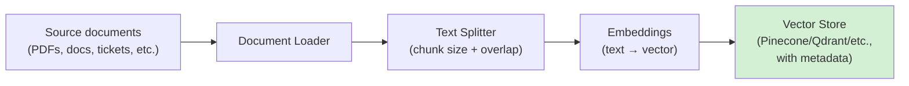
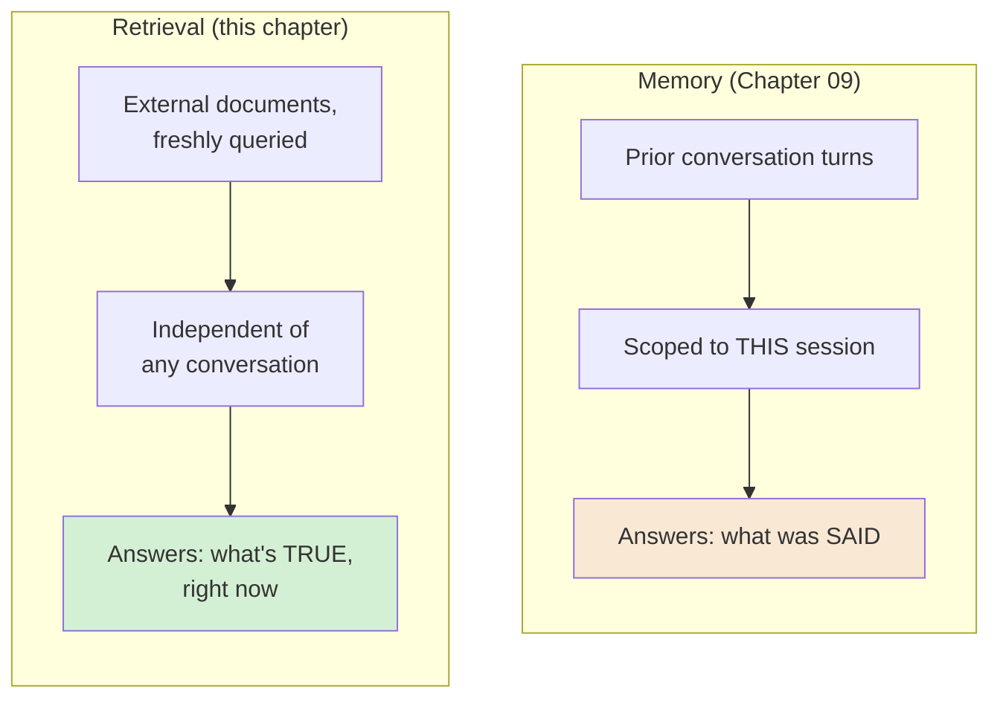
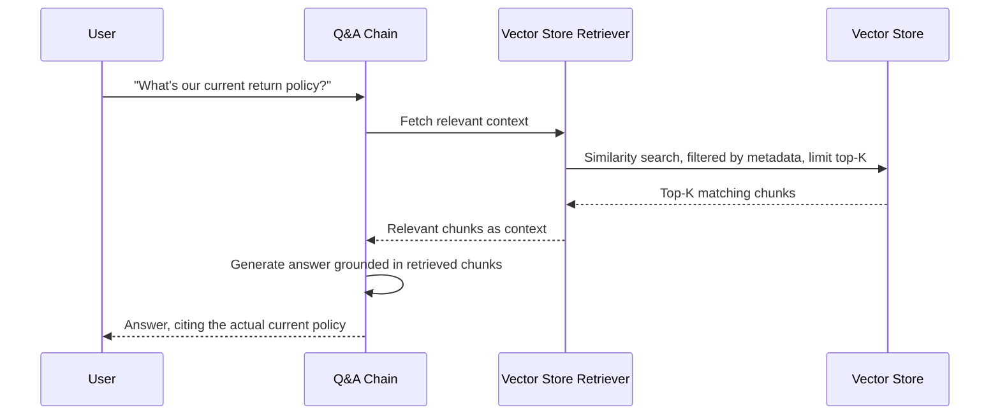
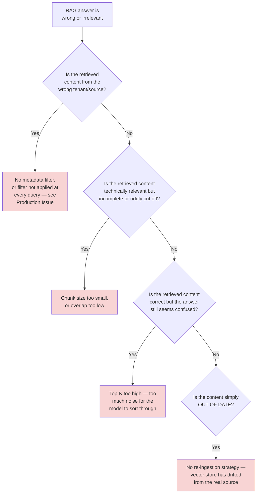
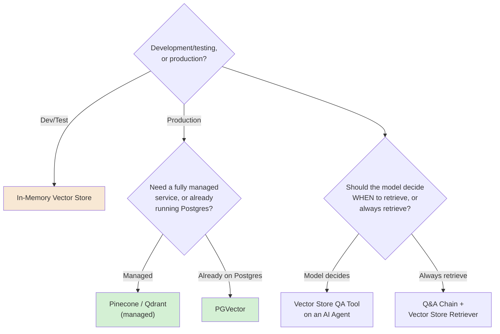

# Chapter 10 — Retrieval and Memory in n8n

## Learning Objectives

By the end of this chapter, you will be able to:

- Explain why **retrieval-augmented generation (RAG)** exists — grounding a model's answers in real, current documents instead of relying solely on what it learned during training (Volume 3's own foundational reasoning, applied here on n8n's canvas).
- Build a complete RAG **ingestion pipeline** in n8n: Document Loader → Text Splitter → Embeddings → Vector Store.
- Choose a **chunk size and overlap** deliberately, understanding what each actually controls (Volume 3's chunking discipline, reused directly).
- Choose between n8n's current Vector Store providers for development versus production use.
- Connect a Vector Store to a Q&A Chain via a **Vector Store Retriever**, and to an AI Agent via the **Vector Store Question Answer Tool** — and explain when each connection pattern is the right one.
- Configure a retrieval **limit (top-K)** deliberately, understanding the tradeoff between more context and more cost and noise.
- Distinguish **retrieval** (this chapter — grounding in external documents) from **memory** (Chapter 09 — conversation history) as two different, complementary "give the model more context" mechanisms solving different problems.
- Apply **metadata filtering** to prevent a multi-tenant RAG pipeline from retrieving the wrong tenant's private documents.

## Prerequisites

- **Chapters completed:** Chapter 09 (this volume) — this chapter assumes you already know what an AI Agent node, a Chat Model, and Memory are. **Volume 3 (RAG Deep Dive)** — this chapter assumes you already understand chunking strategy, embeddings, and vector similarity search conceptually; it shows you where those concepts live in n8n specifically, not what they mean from scratch.
- **Tools installed:** Same n8n instance as previous chapters, plus an API key for an embeddings provider (OpenAI is used in this chapter's examples) and, for the Intermediate Implementation onward, a free-tier account with a real vector store provider (Pinecone or Qdrant both offer one).

## Estimated Reading Time

70–85 minutes

## Estimated Hands-on Time

3.5 hours

---

## ⚡ Fast Read

> **Skim time: 5 minutes**

- **What it is:** n8n's visual implementation of RAG — loading documents, splitting them into chunks, embedding them, storing them in a vector store, and retrieving the relevant ones at query time to ground an LLM's answer in real, specific data.
- **Why it matters:** Chapter 09's agent could reason and use tools, but it only knew what was in the conversation and the model's own training. Retrieval is how you give it access to your organization's actual, current documents — without retraining anything.
- **Key insight:** Retrieval and memory are not the same mechanism, and confusing them is a common, costly mistake — memory is what was *said* in this conversation; retrieval is what's *true* in your documents, found fresh on every query. An agent can have one, the other, or (usually) both.
- **What you build:** A complete ingestion pipeline (Document Loader → Text Splitter → Embeddings → Vector Store), a working Q&A chain querying it, an agent that decides for itself when to retrieve, and a metadata filter preventing one tenant's data from leaking into another's results.
- **Jump to:** [Core Concepts](#core-concepts) | [First Pipeline](#beginner-implementation) | [Best Practices](#best-practices) | [Mini Project](#mini-project)

---

## Why This Topic Exists

Chapter 09's agent could reason, use tools, and remember what was said earlier in a conversation — but it had no access to anything specific to your organization unless you typed it directly into a prompt. A support agent that doesn't know your actual return policy, a research assistant that hasn't read your actual reports, an internal FAQ bot that doesn't know what's in your actual documentation — all useless for real work, no matter how good the underlying model is. Volume 3 already taught you why: an LLM's training data is frozen at a point in time, and even if it weren't, it was never trained on *your* private documents at all.

Retrieval-augmented generation solves this by fetching the specific, relevant pieces of your own documents at the moment of a query, and handing them to the model as context — grounding its answer in something real and current instead of asking it to guess. Volume 3 taught this discipline in depth, framework-agnostically. This chapter's job is narrower: show you exactly where each piece of that pipeline lives in n8n, and how it connects to the agent architecture Chapter 09 just built.

The other reason this chapter exists now, specifically: retrieval and memory look similar on the surface (both "give the model more context") and are genuinely easy to conflate — but they solve different problems, fail differently, and this chapter's central discipline is keeping them straight.

## Real-World Analogy

Think about the difference between a colleague's own memory of a conversation and a reference library.

If you ask a colleague "what did we discuss in yesterday's call?" they answer from their own recollection — that's **memory**: specific to this relationship, specific to what was actually said, and gone if they weren't in that conversation.

If you ask the same colleague "what's our current return policy?" a good colleague doesn't answer from memory at all — they walk to the actual policy binder, find the current, correct page, and read from it. That's **retrieval**: not about what was said, but about what's actually documented, fetched fresh, from a source of truth that update independently of any conversation.

A genuinely useful colleague does both, and knows which one a given question needs. Ask about yesterday's call, they remember. Ask about the return policy, they check the binder — even if you discussed the return policy yesterday, because the binder might have changed since. Confusing the two — answering a policy question from fuzzy memory instead of checking the actual current document — is exactly the mistake this chapter exists to help you avoid building into your own agents.

---

## Core Concepts

### Retrieval-Augmented Generation (RAG)

**Technical definition:** A pattern where relevant documents are fetched from an external knowledge source at query time and provided to an LLM as context, grounding its response in real, specific data rather than relying solely on parametric (training-time) knowledge.

**Plain English:** Looking up the real answer in a real document before answering, instead of guessing from memory.

**Analogy:** Checking the actual policy binder instead of answering from vague recollection.

> Volume 3 covered this in full theoretical and practical depth — this chapter assumes that grounding and shows the concrete n8n pipeline that implements it.

### Document Loader

**Technical definition:** A sub-node responsible for fetching and parsing source content into a form the rest of the pipeline can process — n8n's **Default Data Loader** handles this generically; specialized loaders (e.g., **GitHub Document Loader**) handle specific sources directly.

**Plain English:** The node that actually reads your source material in.

**Analogy:** The step of physically pulling the relevant binder off the shelf before you can read anything in it.

### Chunking (Text Splitter)

**Technical definition:** Breaking loaded documents into smaller, fixed-size pieces before embedding — n8n's current splitter options include **Character Text Splitter** (splits by a defined character separator), **Recursive Character Text Splitter** (splits recursively by structure — Markdown, HTML, code blocks — recommended for most use cases), and **Token Text Splitter** (splits by token count).

**Plain English:** Cutting a long document into smaller, searchable pieces.

**Analogy:** Tabbing a long policy binder by section, so you can find and pull just the relevant page instead of reading the whole binder every time.

> n8n's **Default Data Loader** has a Simple mode using the Recursive Character Text Splitter at a **chunk size of 1000 with 200 overlap** as its default — a real, current, citable starting point, not an arbitrary example. Volume 3's own chunking-strategy discipline (why chunk size and overlap matter, and how to tune them) applies directly here; n8n just gives you a visual place to configure the same decisions.

### Embeddings

**Technical definition:** A sub-node converting text into a numeric vector representation capturing its semantic meaning, so similarity between pieces of text can be computed mathematically — current n8n provider options include OpenAI, Azure OpenAI, Cohere, Google (Gemini/PaLM/Vertex), HuggingFace Inference, Mistral Cloud, and Ollama (for local/self-hosted embedding models).

**Plain English:** Turning text into numbers that capture what it *means*, so "similar meaning" becomes something a computer can actually compute.

**Analogy:** A librarian's own mental index of "which topics are related to which," made mathematical and automatic.

### Vector Store

**Technical definition:** A database specialized for storing embedded vectors and performing fast similarity search — current n8n options include **Pinecone**, **Qdrant**, **Supabase**, **PGVector**, **MongoDB Atlas** (all suitable for production), and **In-Memory (Simple Vector Store)**, explicitly documented as non-persistent and intended for development only.

**Plain English:** Where the embedded, searchable version of your documents actually lives.

**Analogy:** The policy binder itself, indexed and organized for fast lookup — except this "binder" can search by *meaning*, not just by section title.

> A genuinely useful, current architectural fact: swapping one production vector store provider for another (Pinecone for Qdrant, for instance) requires changing only the Vector Store node itself — the embeddings model, document loader, and the chain or agent using it stay exactly the same. This is worth knowing before you pick a provider: the choice is far less permanent than it might feel.

### Retriever

**Technical definition:** The connector fetching relevant chunks from a vector store at query time — n8n's **Vector Store Retriever** queries a connected vector store directly (with a configurable **Limit**, i.e. top-K); the **Workflow Retriever** instead retrieves data by calling another n8n workflow, letting retrieval logic itself be a full sub-workflow rather than a direct vector search.

**Plain English:** The specific mechanism that goes and fetches the relevant pieces when a question comes in.

**Analogy:** The librarian's actual act of walking to the shelf and pulling the specific, relevant pages — as opposed to the shelf itself (the vector store).

### Top-K (Limit)

**Technical definition:** The configured maximum number of chunks a retriever returns for a given query.

**Plain English:** How many "relevant pages" you're handed back, at most.

**Analogy:** Asking the librarian for "the three most relevant pages," not the whole binder.

> This is a real, direct tradeoff, not a technicality: a higher top-K gives the model more potential context (better recall) at the cost of more tokens (more cost, per Chapter 09's token-cost dimension) and more noise for the model to sort through (potentially worse precision). There's no universally correct number — it's tuned per use case, the same discipline Volume 3 taught for retrieval parameters generally.

### Retrieval vs. Memory

**Technical definition:** Two structurally distinct mechanisms for giving an LLM additional context: **memory** (Chapter 09) surfaces prior conversation turns, scoped to a session; **retrieval** (this chapter) surfaces relevant external documents, fetched fresh on every query from a source of truth that changes independently of any conversation.

**Plain English:** What was *said* (memory) versus what's *true, right now, in your documents* (retrieval).

**Analogy:** This chapter's own opening analogy — a colleague's recollection of yesterday's call versus checking the actual, current policy binder.

> An agent commonly needs both, and they fail differently: stale memory means the agent forgets something real that was said. Stale retrieval (an out-of-date vector store index) means the agent confidently cites a document that's no longer true — arguably worse, because it *sounds* authoritative. Keeping these two mechanisms conceptually separate is what lets you reason correctly about which one is wrong when an agent gives a bad answer.

### Metadata Filtering

**Technical definition:** Restricting a vector store query to only chunks matching specific metadata criteria (e.g., a tenant ID, a document category, an access-level tag), stored alongside each chunk's embedding at ingestion time.

**Plain English:** Making sure a search only looks through the pages it's actually allowed to look through.

**Analogy:** A librarian who checks your library card *before* pulling any page, not after — making sure the search itself never touches material you're not supposed to see, rather than trusting a later step to catch it.

> This is a genuine, underrated **security** control, not just a relevance-tuning feature — this chapter's Production Issue is built entirely around what happens when it's missing.

---

## Architecture Diagrams

### Diagram 1 — The Full RAG Ingestion Pipeline



### Diagram 2 — Retrieval vs. Memory, Side by Side



## Flow Diagrams

### Diagram 3 — A Query, Resolved Through Retrieval



---

## Beginner Implementation

> **No-code path.** No coding required.

**Goal:** Aperture Cloud's "Internal Policy Assistant" — a first, development-only RAG pipeline.

1. **Manual Trigger** → **Default Data Loader** node, loading 3–4 short sample "policy" text documents (write them directly as sample text for this exercise).
2. Leave the Default Data Loader in **Simple** mode (Recursive Character Text Splitter, chunk size 1000, overlap 200 — the confirmed current default).
3. **Embeddings OpenAI** node, connected as the embedding provider (configure your API key via the Credentials Manager, per Chapter 04).
4. **In-Memory Vector Store** node (Simple Vector Store) — explicitly a development-only choice; confirmed non-persistent, meaning it resets when the workflow stops.
5. Run the ingestion path once to populate the store.
6. Add a **Question and Answer Chain** node with a **Vector Store Retriever** connected to the same In-Memory Vector Store. Ask a question your sample documents actually answer, and confirm the response is grounded in your specific sample text — not a generic, made-up answer.

**What you just built:** The complete Diagram 1 pipeline, end to end, using the safest possible (non-persistent, development-only) storage choice while you learn the shape of it.

---

## Intermediate Implementation

> **Moves to a real, persistent vector store and tunes retrieval deliberately.**

**Goal:** Rebuild the pipeline against a real, persistent vector store, with deliberately chosen chunking and retrieval settings.

1. Set up a free-tier account with a real vector store provider (Pinecone or Qdrant both offer one) and store its credentials via the Credentials Manager.
2. Swap the In-Memory Vector Store node for a **Pinecone Vector Store** (or Qdrant) node — per this chapter's Core Concepts, this should require no changes to your Embeddings node, Document Loader, or downstream Chain.
3. Switch the Default Data Loader to **Custom** mode, and connect an explicit **Recursive Character Text Splitter** with a chunk size and overlap you choose deliberately (not just left at the default) — base your choice on your actual sample documents' structure, and write down why.
4. On the Vector Store Retriever, set **Limit (top-K)** explicitly — start at 3, then try 1 and 10 on the same question, and compare the resulting answers' quality and the token cost each used (visible in your Chat Model node's execution data).

**What to notice:** Persistence changes the entire operational profile — this vector store survives workflow restarts, meaning ingestion and querying are now genuinely separate concerns (you don't need to re-run ingestion every time you want to ask a question) — exactly the production shape Chapter 08's modular design discipline would recognize.

---

## Advanced Implementation

> **Engineering-depth path.** Agent-driven retrieval and metadata filtering for multi-tenant safety.

**Part A — agent-driven retrieval:**

1. Take the AI Agent node you built in Chapter 09. Add a **Vector Store Question Answer Tool**, connected to your persistent vector store from the Intermediate Implementation, as one of the agent's tools (alongside any existing tools).
2. Give it a clear name and description — e.g., "Search Aperture Cloud's internal policy documents. Use this when the user asks about a specific company policy."
3. Run the agent with a mix of questions — some that need the policy documents, some that don't — and confirm the agent (per Chapter 09's own core lesson) decides *for itself* when to reach for this tool, rather than always retrieving on every turn.

**Part B — metadata filtering for multi-tenant safety:**

4. Re-ingest your sample documents, this time attaching a `tenant_id` metadata field to each chunk at ingestion time (most vector store nodes support attaching arbitrary metadata alongside the embedded content).
5. Configure the Vector Store Retriever (or the Vector Store node's own query configuration) to **filter by `tenant_id`**, using the current session or request's actual tenant identifier as the filter value — not something the end user can freely supply themselves.
6. Test it directly: ingest documents for two different simulated tenants, then query as "Tenant A" and confirm you never see "Tenant B" content in the results, even when a question's wording would otherwise match content from both.

**The common mistake alongside the correct pattern:**

```text
WRONG: Store documents from multiple customers/tenants in one vector
store with no metadata filter distinguishing them — similarity search
alone has no concept of "who's allowed to see this," so a well-matched
chunk from the wrong tenant can be retrieved and handed straight to
the model as if it were fair game.

RIGHT: Attach tenant/access metadata at ingestion time, and filter on it
at every single retrieval — not as an occasional check, but as a
mandatory part of every query, per this chapter's Advanced Implementation.
```

**How to debug it when it breaks:** If retrieved chunks seem irrelevant, check chunk size first — chunks that are too large dilute a match with unrelated surrounding text; chunks too small lose necessary context. If metadata filtering doesn't seem to apply, remember the sub-node gotcha confirmed directly from n8n's own documentation: **sub-nodes resolve an expression to the first item only**, even when multiple items are present upstream — a metadata filter expression relying on per-item context from a multi-item upstream node can silently apply the wrong (or a stale) value.

**The production version, where it differs from the learning version:** The learning version ingests a handful of sample documents once, manually. A production version needs a real **re-ingestion strategy** — a scheduled or event-driven workflow (Chapter 02's trigger taxonomy) that re-embeds and re-indexes documents when the source material actually changes, so the vector store doesn't silently drift out of sync with the real, current documents it's supposed to represent.

---

## Production Architecture

- **Staleness is retrieval's version of Chapter 07's reliability concerns.** A vector store that's never refreshed after source documents change will confidently retrieve *outdated* content and hand it to the model as if it were current — the RAG-specific analogue of every reliability lesson this course has taught about trusting data without verifying its freshness.
- **Metadata filtering is a production security control, not an optional feature.** As this chapter's Production Issue below demonstrates, its absence is a real, concrete data-isolation failure in a multi-tenant system — treat it with the same seriousness Chapter 04 treated credential scoping.
- **Vector store choice affects operational ownership, not just cost.** A managed provider (Pinecone) trades operational simplicity for less infrastructure control; a self-hosted option (Qdrant, PGVector on your own Postgres) trades more operational responsibility for more control — the same managed-vs-self-hosted tradeoff Chapter 15 covers for n8n itself, now one layer down in your architecture.

---

## Best Practices

1. **Never leave production data in an In-Memory Vector Store** — it's explicitly documented as non-persistent, intended for development only.
2. **Choose chunk size and overlap deliberately, based on your actual document structure**, not the default — Volume 3's own chunking discipline, applied here.
3. **Tune top-K per use case, and measure the actual tradeoff** between answer quality and token cost, rather than picking a number and moving on.
4. **Attach access-relevant metadata at ingestion time, always, for any multi-tenant or access-controlled content** — and filter on it at every retrieval, not selectively.
5. **Give retrieval tools clear, specific descriptions when used with an AI Agent**, so the agent reliably knows when to reach for them — the same lesson Chapter 09 taught for tools generally.
6. **Build a real re-ingestion strategy for any production RAG pipeline** — a vector store is only as trustworthy as how current it actually is.

---

## Security Considerations

- **Missing metadata filtering is a real data-isolation vulnerability in any multi-tenant RAG system** — this chapter's Production Issue is a direct, teachable instance of exactly this failure class, and it's a mistake that's genuinely easy to make, because a RAG pipeline can work perfectly in every functional test while still having zero real access control.
- **Retrieved content is untrusted input the same way an API response is (Chapter 05).** A chunk pulled from your own vector store can still contain text designed (deliberately, by a prior malicious ingestion, or accidentally) to manipulate the model — the same prompt-injection risk Chapter 09 covered for user input applies to retrieved context too, and a Guardrails check can be applied to retrieved content, not just direct user input.
- **Embeddings themselves can leak information.** Even without exposing raw text, an embedded vector can, in some circumstances, be partially reverse-engineered to reveal characteristics of the original content — treat vector store access control with the same seriousness as access to the original documents, not as a lesser concern because "it's just numbers."

## Cost Considerations

RAG introduces a specific sub-case of Chapter 09's token-cost dimension, plus a genuinely new one: **embedding cost** (charged per token embedded, at ingestion time, separate from any chat model cost) and **vector store cost** (storage and query costs, which vary significantly by provider and scale). A higher top-K directly increases the tokens sent to the chat model on every single query — this is a real, ongoing, per-query cost, not a one-time ingestion cost, and it compounds with query volume in a way ingestion cost doesn't.

| Cost type | When it's incurred | What drives it |
|---|---|---|
| Embedding cost | Once per ingested chunk (and again on re-ingestion) | Total document volume, re-ingestion frequency |
| Vector store cost | Ongoing | Storage volume, query volume, provider pricing model |
| Retrieval's chat-model cost | Every query | Top-K (more chunks = more tokens sent to the model) |

## Common Mistakes

**Mistake 1 — Confusing retrieval with memory.**
```text
WRONG: Assuming an agent "remembers" a document because it was
retrieved once earlier in the conversation — retrieval happens fresh,
per query; it isn't added to memory automatically.
RIGHT: Understand retrieval and memory as separate mechanisms, per this
chapter's Core Concepts — if you need the retrieved content to persist
across turns, that's a memory design decision, not something retrieval
does for you.
```

**Mistake 2 — No metadata filtering on multi-tenant content.**
```text
WRONG: One shared vector store, no tenant/access metadata, relying on
similarity search alone to "probably" return relevant-and-appropriate
results.
RIGHT: Metadata attached at ingestion, filtered at every query, per this
chapter's Advanced Implementation and Production Issue.
```

**Mistake 3 — Assuming a sub-node's expression sees every upstream item.**
```text
WRONG: A metadata-filter expression on a Retriever sub-node assumed to
correctly evaluate per-item across multiple upstream items.
RIGHT: Confirmed current n8n behavior — sub-node expressions resolve to
the FIRST item only, regardless of how many items are upstream. Design
around this explicitly, don't assume standard node behavior applies.
```

## Debugging Guide



| Symptom | Likely cause | Where to look |
|---|---|---|
| Wrong tenant's data appears in results | Missing or unapplied metadata filter | Filter configuration on every retrieval path, not just one |
| Relevant but incomplete/cut-off content | Chunk size or overlap too small | Text Splitter configuration |
| Correct content, confused answer | Top-K too high, too much noise | Retriever's Limit setting |
| Confidently wrong, outdated answer | No re-ingestion strategy | Whether/how often the vector store is refreshed |
| Agent never uses the retrieval tool | Vague tool description | The Vector Store Question Answer Tool's name/description |

## Performance Optimisation

> Illustrative Aperture Cloud measurements, not a published benchmark.

In an illustrative test on the same question set: top-K of 3 produced accurate, tightly-grounded answers using roughly 400 tokens of retrieved context per query. Top-K of 10 didn't meaningfully improve answer accuracy on this sample set, but roughly tripled token cost per query. The lesson: **more retrieved context is not automatically better — measure whether a higher top-K actually improves answers for your specific use case before paying for it on every query.**

---

## Technology Comparison

| Platform | RAG support | Vector store flexibility |
|---|---|---|
| **n8n** | Visual, node-based pipeline (Document Loader → Splitter → Embeddings → Vector Store → Retriever) | Swappable — changing providers only touches the Vector Store node itself |
| **Volume 3's framework-agnostic approach** | Same underlying concepts (chunking, embeddings, retrieval), taught independent of any specific tool | n8n is one concrete implementation of what Volume 3 taught generally |
| **Zapier / Make** | Emerging AI features exist but visual RAG pipeline-building is less mature/central than n8n's dedicated node family | Limited compared to n8n's current breadth of vector store integrations |
| **Hand-rolled (LangChain/LlamaIndex directly, Volume 4's own territory)** | Full code-level control over every pipeline stage | Maximum flexibility, at the cost of building and maintaining it all yourself |

## Decision Framework



---

## Real Client Scenario — Aperture Cloud's Multi-Tenant Support Assistant

Aperture Cloud built a support-documentation assistant serving multiple client accounts from one shared n8n instance — each client's own support tickets and internal notes ingested into a single vector store for cost efficiency. This is exactly the kind of genuinely consequential scenario this course's Autonomy Thread now permits from Chapter 09 onward: a real, customer-facing system handling real, sensitive, per-customer data, not an internal reporting tool. The team built it correctly, following this chapter's Advanced Implementation — every ingested chunk tagged with the owning tenant's ID, every retrieval filtered by the current session's actual tenant, verified with the exact same two-tenant cross-contamination test this chapter's Advanced Implementation walks through. That verification step is precisely what this chapter's Production Issue shows the cost of skipping.

---

### Production Issue: The Assistant That Answered With Someone Else's Ticket

**Symptoms**

During a routine support conversation, a customer asked a general question about handling a shipping delay — and the assistant's answer directly quoted specific details from a **different customer's private support ticket**, including that customer's name and order details.

**Root Cause**

The vector store held support tickets from multiple client accounts, ingested without any tenant-identifying metadata. Similarity search has no inherent concept of "who's allowed to see this" — it only measures semantic closeness. A different customer's ticket about a similar shipping delay was, semantically, an excellent match for the query, and the retriever — with no filter to stop it — happily returned it as top-K context, which the model then used, verbatim, in its answer.

**How to Diagnose It**

Trace the specific chunk that appeared in the answer back to its ingestion source and confirm whether metadata identifying its owning tenant exists at all — its absence, combined with a retriever query with no corresponding filter, is the direct signature of this failure class.

**How to Fix It**

```text
BEFORE: Vector store query — similarity search only, no filter:
retriever.query(question, top_k=3)

AFTER: Vector store query — similarity search AND a mandatory metadata
filter, sourced from the current session's actual, server-side-verified
tenant context (never a value the end user can supply themselves):
retriever.query(question, top_k=3, filter={ tenant_id: session.tenant_id })
```

Existing ingested data also needed a one-time backfill, tagging every already-stored chunk with its correct tenant before the filtered query logic could be trusted for historical content, not just newly-ingested content going forward.

**How to Prevent It in Future**

Treat metadata filtering as a **mandatory, tested, verified control for any multi-tenant or access-controlled RAG pipeline** — not an optional relevance tweak — and add the exact cross-tenant test this chapter's Advanced Implementation walks through as a required pre-launch check, the same way Chapter 04 treated credential-scope review as non-optional before shipping an OAuth2 integration.

---

## Exercises

1. **(20 min)** For three questions you might ask an internal assistant, decide whether each needs retrieval, memory, both, or neither.
2. **(45 min)** Build the Beginner Implementation's full ingestion-to-query pipeline using the In-Memory Vector Store.
3. **(60 min)** Build the Intermediate Implementation against a real, persistent vector store, and compare answers at three different top-K values.
4. **(90 min)** Build the Advanced Implementation's agent-driven retrieval and metadata filtering, including the two-tenant cross-contamination test.
5. **(30 min)** Deliberately remove the metadata filter from your Advanced Implementation, reproduce a cross-tenant leak on your own sample data, then restore the fix.

## Quiz

**1. What's the structural difference between retrieval and memory?**
> Memory surfaces prior conversation turns, scoped to a session. Retrieval fetches relevant external documents fresh on every query, from a source of truth independent of the conversation.

**2. Why is the In-Memory Vector Store explicitly documented as development-only?**
> It's non-persistent — its contents are lost when the workflow stops, making it unsuitable for any production use where data needs to survive restarts.

**3. What does n8n's Default Data Loader use as its Simple-mode default chunking configuration?**
> The Recursive Character Text Splitter, with a chunk size of 1000 and an overlap of 200.

**4. What's the real, current architectural benefit of n8n's vector store node design, according to this chapter?**
> Swapping one vector store provider for another only requires changing the Vector Store node itself — the embeddings model, document loader, and downstream chain/agent stay unchanged.

**5. What's the tradeoff of increasing top-K, beyond just "more context"?**
> More tokens sent to the model (higher cost) and potentially more noise for the model to sort through (potentially worse precision), without a guaranteed improvement in answer quality.

**6. What's the difference between connecting a vector store to a Q&A Chain versus to an AI Agent as a tool?**
> A Q&A Chain always retrieves on every query. An AI Agent, via the Vector Store Question Answer Tool, decides for itself whether a given question actually needs retrieval — the same model-decides-the-sequence distinction Chapter 09 introduced generally.

**7. Why is metadata filtering described as a security control, not just a relevance feature?**
> Because similarity search alone has no concept of access permissions — without a filter tied to the querying user's actual access rights, a well-matched but unauthorized chunk can be retrieved and surfaced just as readily as an authorized one.

**8. What's the confirmed, current sub-node gotcha this chapter warns about regarding expressions?**
> Sub-node expressions always resolve to the first item, even when multiple items are present upstream — a filter or parameter relying on per-item context can silently use the wrong or stale value.

**9. Why can "the vector store answered confidently but incorrectly" be worse than "the vector store had nothing relevant"?**
> Because a confidently-stated, specific-sounding answer built on stale or wrong retrieved content is more likely to be trusted and acted on than an obviously empty or uncertain response — staleness in retrieval fails silently and persuasively.

**10. In this chapter's Production Issue, what specifically had to happen to existing, already-ingested data, not just the go-forward query logic?**
> A one-time backfill tagging every already-stored chunk with its correct tenant metadata — fixing the query logic alone wouldn't protect historical content that was never tagged in the first place.

## Mini Project

**Aperture Cloud's Policy Assistant (2–3 hours)**

- [ ] A complete ingestion pipeline (Document Loader → Text Splitter → Embeddings → Vector Store) using a real, persistent vector store.
- [ ] A Q&A Chain correctly answering questions grounded in your sample documents.
- [ ] A written note comparing answer quality at two different top-K values, with actual token cost observed for each.

## Production Project

**Aperture Cloud's Multi-Tenant Support Assistant (1–2 days)**

- [ ] A full RAG pipeline with an AI Agent (Chapter 09) deciding when to retrieve, via the Vector Store Question Answer Tool.
- [ ] Metadata filtering enforced on every retrieval, sourced from a server-side-verified tenant context, never a user-suppliable value.
- [ ] A deliberate reproduction of this chapter's Production Issue (remove the filter, demonstrate the leak), then the fix applied and re-verified with the two-tenant test.
- [ ] A written security review (300–500 words): what would happen if the metadata filter were accidentally removed in a future change, how you'd detect that in testing before it reached production, and one concrete safeguard (an automated test, a required code-review check) you'd add to prevent a silent regression.

## Key Takeaways

- RAG grounds an LLM's answers in real, current documents, fetched fresh at query time — Volume 3's own discipline, now concretely implemented in n8n.
- Retrieval and memory are structurally different mechanisms solving different problems — confusing them is a common, costly mistake.
- Chunk size, overlap, and top-K are real, tunable tradeoffs, not defaults to leave unexamined.
- Vector store provider choice is less permanent than it feels — swapping providers only touches the Vector Store node itself.
- A Q&A Chain always retrieves; an AI Agent with a retrieval tool decides for itself whether to — the same agent-vs-chain distinction from Chapter 09.
- Metadata filtering is a genuine security control for any multi-tenant or access-controlled RAG pipeline, not an optional relevance tweak.
- Sub-nodes resolve expressions to the first item only, regardless of upstream item count — a real, confirmed gotcha worth designing around.
- A production RAG pipeline needs a real re-ingestion strategy — a vector store is only as trustworthy as how current it actually is.
- Retrieved content is untrusted input, the same as any external data — it can carry prompt-injection risk, not just relevance risk.

## Chapter Summary

| Concept | Key Takeaway |
|---|---|
| RAG | Ground answers in real documents, fetched fresh at query time |
| Document Loader / Text Splitter | Load and chunk source content — chunk size/overlap are real tuning levers |
| Embeddings | Text turned into searchable, meaning-based vectors |
| Vector Store | Where embedded content lives — swap providers freely, dev-only for In-Memory |
| Retriever | Vector Store Retriever (direct) vs. Workflow Retriever (via sub-workflow) |
| Top-K | More context vs. more cost/noise — a real tradeoff to measure, not guess |
| Retrieval vs. Memory | What's true in documents vs. what was said in conversation |
| Metadata Filtering | A real security control for multi-tenant/access-controlled content |

## Resources

- [n8n Vector Store Retriever documentation](https://docs.n8n.io/integrations/builtin/cluster-nodes/sub-nodes/n8n-nodes-langchain.retrievervectorstore/)
- [n8n Workflow Retriever documentation](https://docs.n8n.io/integrations/builtin/cluster-nodes/sub-nodes/n8n-nodes-langchain.retrieverworkflow/)
- [n8n Default Data Loader documentation](https://docs.n8n.io/integrations/builtin/cluster-nodes/sub-nodes/n8n-nodes-langchain.documentdefaultdataloader)
- [n8n In-Memory (Simple) Vector Store documentation](https://docs.n8n.io/integrations/builtin/cluster-nodes/root-nodes/n8n-nodes-langchain.vectorstoreinmemory/)
- Volume 3 (RAG Deep Dive) — chunking strategy, embeddings, and retrieval theory, taught framework-agnostically and directly reused here

## Glossary Terms Introduced

| Term | One-line definition |
|---|---|
| RAG | Grounding LLM answers in retrieved, real documents |
| Document Loader | Fetches and parses source content into the pipeline |
| Chunking (Text Splitter) | Breaking documents into smaller, embeddable pieces |
| Embeddings | Numeric vector representation capturing text meaning |
| Vector Store | A database for embedded vectors and similarity search |
| Retriever | The connector fetching relevant chunks at query time |
| Top-K (Limit) | The maximum number of chunks a retriever returns |
| Retrieval vs. Memory | Documents fetched fresh vs. conversation history recalled |
| Metadata Filtering | Restricting retrieval to chunks matching access criteria |

## See Also

| Topic | Related Chapter | Why |
|---|---|---|
| Volume 3 (RAG Deep Dive) | Full volume | Chunking, embeddings, and retrieval theory this chapter implements concretely |
| The AI Agent Node | Chapter 09 (this volume) | Memory, tools, and the agent architecture this chapter's retrieval tool connects to |
| Connecting to the World | Chapter 04 | Credentials Manager, reused for embedding-provider and vector-store API keys |
| Tool-Calling and Multi-Agent Orchestration | Chapter 11 | Multiple agents potentially sharing (or needing to NOT share) retrieval access |
| Governance and Compliance | Chapter 18 | Multi-tenant data isolation at full production-governance depth |

## Preparation for Next Chapter

**Technical checklist:**
- [ ] Built a complete ingestion-to-query RAG pipeline against a real, persistent vector store.
- [ ] Built agent-driven retrieval and confirmed the agent decides when to use it.
- [ ] Built and tested metadata filtering with a real two-tenant cross-contamination test.

**Conceptual check:**
- Why are retrieval and memory different mechanisms, and why does confusing them cause specific, predictable failures?
- Why is metadata filtering a security control, not just a relevance feature?

**Optional challenge:** Before Chapter 11, think about what happens when two different AI Agents — each with their own tools and retrieval access — need to work together on a single task, potentially disagreeing about what to do next. Chapter 11 is exactly that problem.

---

> **Currency Note:** This chapter's n8n-specific facts (current Vector Store/Embeddings/Document Loader/Text Splitter/Retriever node options, the Default Data Loader's default chunk size/overlap, vector store provider swappability, and the sub-node first-item expression behavior) were verified directly against `docs.n8n.io` in July 2026. n8n's AI node family is one of the fastest-moving parts of the platform — always confirm current specifics before making a production decision based on this chapter.
