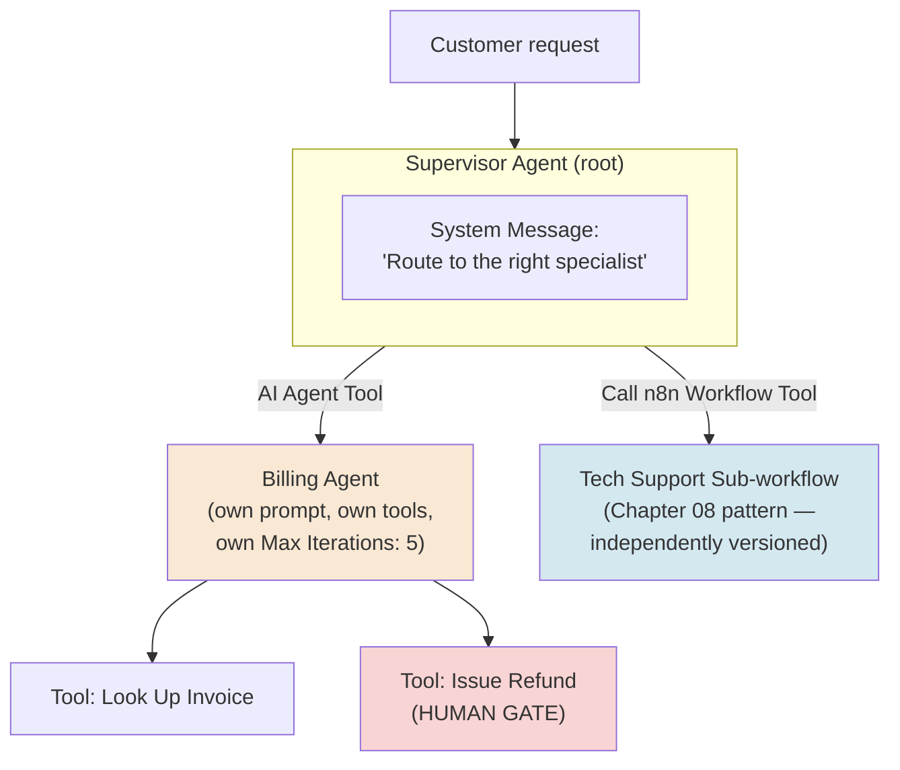
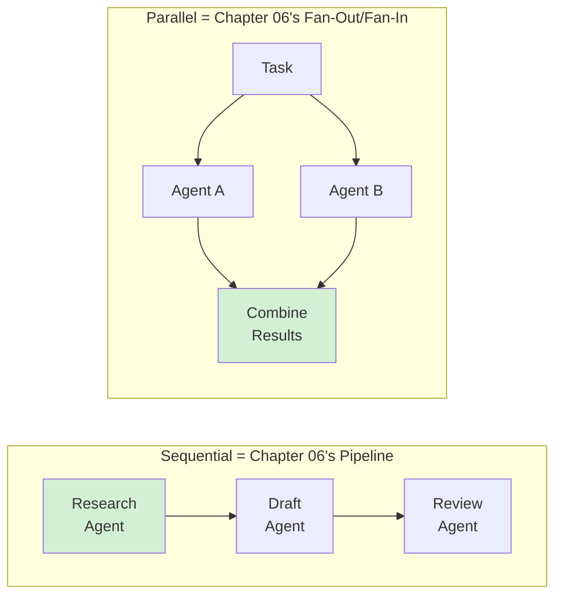
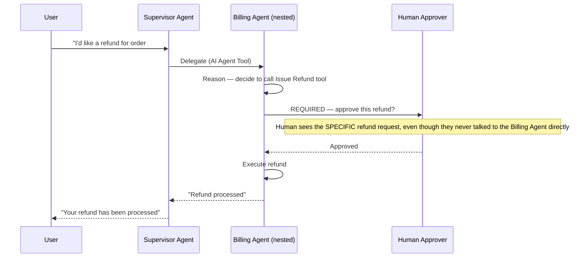
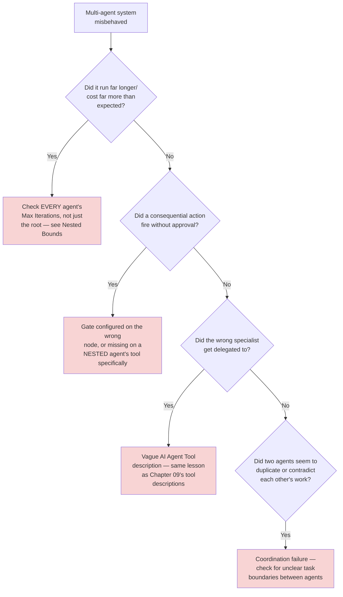
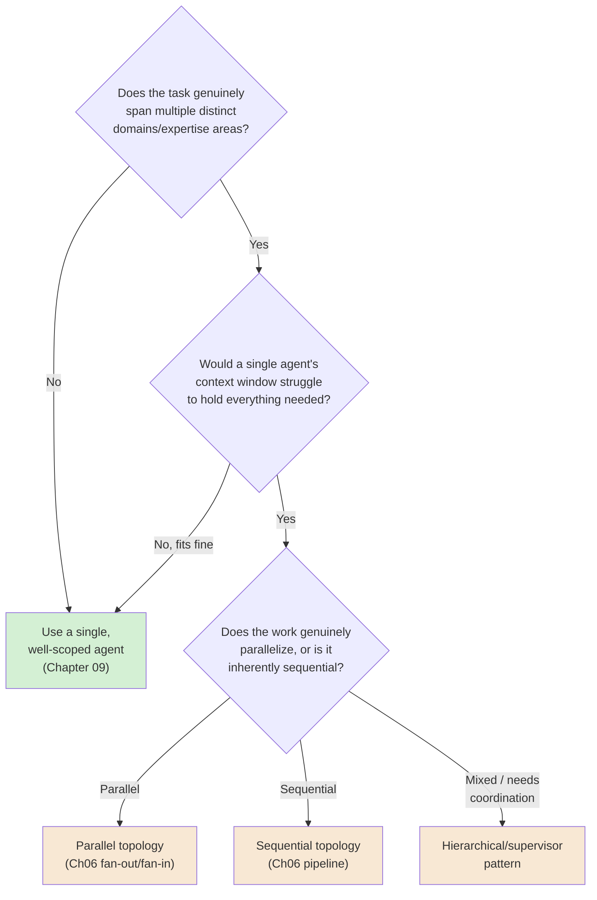

# Chapter 11 — Tool-Calling and Multi-Agent Orchestration

## Learning Objectives

By the end of this chapter, you will be able to:

- Build a **hierarchical (supervisor) multi-agent system** in n8n, using nested **AI Agent Tool** nodes.
- Choose between an **AI Agent Tool** (a nested agent, on one canvas) and a **Call n8n Workflow Tool** (Chapter 08's sub-workflow pattern) for a given specialized sub-agent, based on their real, different tradeoffs.
- Recognize which of Chapter 06's workflow design patterns — pipeline, fan-out/fan-in — map directly onto which multi-agent orchestration topology.
- Design a **human-in-the-loop gate that works correctly across a multi-agent system**, not just inside a single agent.
- Pass large data between agents safely, using references (file IDs, URLs) instead of inlining full content.
- Explain why multi-agent coordination failures are structurally different from a single agent's runaway loop, and what additional bound a multi-agent system specifically needs.
- Decide when a multi-agent system is actually necessary, versus needless complexity for a task one agent could handle alone.
- Set independent **Max Iterations** bounds on every nested agent, and explain why one top-level bound isn't sufficient once more than one agent is involved.

## Prerequisites

- **Chapters completed:** Chapter 09 (AI Agent Node, Max Iterations, human-in-the-loop gates) and Chapter 10 (retrieval) — this chapter assumes both directly. **Volume 4, Chapter 05 (Multi-Agent Orchestration)** — this chapter assumes you already know the general orchestration topologies (hierarchical, sequential, parallel) framework-agnostically; it shows you where they live in n8n specifically.
- **Tools installed:** Same n8n instance as previous chapters.

## Estimated Reading Time

70–85 minutes

## Estimated Hands-on Time

3.5 hours

---

## ⚡ Fast Read

> **Skim time: 5 minutes**

- **What it is:** Composing more than one AI Agent together — a supervisor agent delegating to specialized sub-agents, each with their own tools, prompt, and bounds — using n8n's AI Agent Tool node to nest them on a single canvas.
- **Why it matters:** A single agent trying to be a billing expert, a technical support expert, and a scheduling expert all at once tends to do all three worse than three focused agents would, each doing one thing well — the same specialization argument Chapter 08 made for sub-workflows, now applied to agents.
- **Key insight:** Multi-agent systems don't just add capability — they multiply risk surface. Every nested agent has its own Max Iterations bound, its own tool grants, and its own potential for a runaway loop; a system with three agents needs three times the bounding discipline Chapter 09 taught for one, not the same amount spread thinner.
- **What you build:** A supervisor agent delegating to two specialized sub-agents (one via AI Agent Tool, one via sub-workflow, so you feel the real difference), a large-document handoff done safely by reference, and a human-approval gate proven to work correctly even when the consequential action is nested two levels deep.
- **Jump to:** [Core Concepts](#core-concepts) | [First Multi-Agent System](#beginner-implementation) | [Best Practices](#best-practices) | [Mini Project](#mini-project)

---

## Why This Topic Exists

Chapter 09 built one agent, with one job description and one set of tools. That's the right shape for a focused task. It stops being the right shape the moment a task genuinely spans multiple domains — billing questions need different context and tools than technical support questions, and asking one agent to be excellent at both, with one shared system prompt trying to cover everything, tends to produce an agent that's mediocre at each. Volume 4 Chapter 05 already taught you why this happens and named the topologies that solve it — hierarchical, sequential, parallel — framework-agnostically. This chapter shows you exactly how n8n implements each one, concretely, using the AI Agent Tool node this chapter's research confirmed is n8n's own current, official mechanism for exactly this: a root agent supervising and delegating to specialized sub-agents, on a single canvas, in a single execution.

The reason this deserves its own chapter, and not just a section of Chapter 09: multi-agent systems don't just add capability, they multiply the exact risk surface Chapter 09 spent an entire chapter teaching you to bound. One agent with an unbounded loop is a real, documented, expensive problem — Chapter 09's own Production Issue proved that with a real $47,000 incident. A multi-agent system with the *same* discipline applied to only the top-level agent, while its nested sub-agents run unbounded, has all of that same risk, just harder to see, because the runaway isn't happening where you're looking. This chapter's job is making sure the bounding, gating, and blast-radius discipline Chapter 09 taught for one agent is applied correctly to every agent in the system, not just the one on top.

## Real-World Analogy

Volume 4 Chapter 05 used this exact analogy for orchestration topologies generally — worth restating here, now with n8n's specific mechanism in view. A single generalist employee handling every kind of customer request is one model. A **supervisor** who takes the initial call and routes it to the right specialist — billing to the billing team, technical issues to support — while staying involved to coordinate the overall resolution, is a **hierarchical** structure. This is n8n's AI Agent Tool pattern exactly: one root agent, deciding which specialist to hand a piece of work to, based on nothing more than each specialist's own job description.

But here's the detail this chapter adds that a plain org chart doesn't capture: each of those specialists, in n8n's implementation, is a **complete, independent agent in their own right** — their own system prompt, their own memory, their own tools, their own reasoning loop, and (critically) their own iteration limit. The supervisor isn't managing three employees who share one set of instructions — it's managing three fully autonomous specialists who each need their own supervision, the same way Chapter 09 taught you to supervise one.

---

## Core Concepts

### Tool-Calling (Recap)

**Technical definition:** The general mechanism (Chapter 09) by which an agent invokes a specific granted capability — a tool — during its reasoning loop.

**Plain English:** The agent reaching for something specific it's been given access to.

**Analogy:** Chapter 09's radio, scanner, and credit card, restated.

> This chapter's entire subject is really just: **what happens when one of the "tools" an agent can call is itself another agent?** Everything else follows from that single idea.

### AI Agent Tool

**Technical definition:** A sub-node letting a root-level AI Agent node call *another*, fully independent agent — with its own system prompt, its own connected Chat Model, its own memory, and its own Max Iterations — as a tool, nested directly on the same canvas, within a single execution.

**Plain English:** An agent, wrapped up so another agent can call it the same way it would call any other tool.

**Analogy:** The supervisor's specialist — a complete, capable colleague in their own right, not a scripted extension of the supervisor.

> The configuration is the same idea as any tool (Chapter 09): a **Description** telling the parent agent when to reach for this specialist, and a **Prompt** defining what to actually hand it. What's different is what's on the other end of that description — a full reasoning loop, not a fixed function.

### Supervisor (Hierarchical) Pattern

**Technical definition:** A multi-agent topology where one root agent receives the task, decides which specialized sub-agent(s) to delegate to, and coordinates their results — n8n's own documentation calls this the pattern "practical for most business automation scenarios."

**Plain English:** One coordinator, several specialists, the coordinator deciding who handles what.

**Analogy:** The supervisor taking the initial call and routing it, restated with its official name.

### Multi-Agent Topologies

**Technical definition:** The shape of how multiple agents coordinate — n8n's own documented patterns include **Sequential/Pipeline** (agents hand off in stages, each building on the previous one's output), **Parallel** (multiple agents work simultaneously, results combined afterward), and **Handoff-based** (specialized agents pass context between stages as a task's needs change).

**Plain English:** The different shapes multiple agents can be arranged in, depending on whether they work one-after-another, all-at-once, or hand a task between each other as it evolves.

**Analogy:** This is Chapter 06's own vocabulary, restated with agents as the working unit instead of plain workflow steps.

> This mapping is worth stating explicitly, because it means you already know these patterns: **Sequential/Pipeline** is Chapter 06's pipeline, with agents as the stages. **Parallel** is Chapter 06's fan-out/fan-in, with agents as the parallel branches. The reliability concerns are the same too — a parallel multi-agent system needs the same rate-limiting and fan-in discipline Chapter 06 taught, now applied to LLM calls instead of API calls.

### Agent-to-Agent Context Passing

**Technical definition:** How data moves from one agent to another in a multi-agent system — n8n's own current guidance recommends passing **references** (file identifiers, URLs) for large content, rather than inlining the full content into every agent's context window.

**Plain English:** Handing a colleague a link to the document, not retyping the entire document into your message to them.

**Analogy:** A supervisor telling a specialist "read the file in folder 4B," not photocopying and hand-delivering the entire file every single time.

> This has a direct, quantifiable payoff, per Chapter 09's own cost dimension: every agent in a chain that receives full inlined content pays the token cost of that content again, on top of its own reasoning. A three-agent pipeline inlining a large document three times pays for that document three times over; passing a reference pays for it once, at the point an agent actually needs to read it.

### Nested Bounds

**Technical definition:** The fact that every agent in a multi-agent system — root and every nested AI Agent Tool — has its **own, independent** Max Iterations setting, meaning a multi-agent system's total possible reasoning volume is the *product*, not the sum, of each agent's individual bound.

**Plain English:** Each specialist has their own personal iteration limit — and if the supervisor calls three specialists, each with their own limit, the total possible work is all three limits multiplied together, not just the supervisor's own limit.

**Analogy:** A supervisor bounded to "10 decisions before checking in" who delegates to three specialists, each *also* bounded to 10 decisions — the system's actual total possible reasoning isn't 10, it's up to 10 × 10 × 10, if every specialist gets consulted at every one of the supervisor's own steps.

> This is this chapter's single most load-bearing safety concept, and it's exactly what Chapter 09's Production Issue previewed without fully explaining: a multi-agent system bounded only at the top level can still, in principle, run enormous amounts of nested reasoning, because the bound at the top doesn't automatically constrain what happens inside each delegated call.

### AI Agent Tool vs. Sub-workflow Tool

**Technical definition:** Two structurally different ways to give a root agent access to specialized capability — an **AI Agent Tool** (this chapter) is a full nested agent, with its own reasoning loop, living inside the same execution and canvas; a **Call n8n Workflow Tool** (Chapter 08) invokes a separate, independently-versioned sub-workflow, which may or may not itself contain an agent.

**Plain English:** A specialist who's part of your team, working alongside you in the same room, versus a specialist you send a request to at a different office.

**Analogy:** Chapter 08's own "dessert station" analogy, now with a real fork in the road: is this specialist a full colleague reasoning alongside you (AI Agent Tool), or a separate department you hand a request to and get a result back from (a sub-workflow)?

> The real tradeoff, confirmed directly from n8n's own current guidance: an AI Agent Tool avoids the overhead of managing context and variables across a separate sub-workflow boundary, and keeps everything visible on one canvas — genuinely simpler for tightly-coupled specialist agents. A sub-workflow (Chapter 08) gives you independent versioning, independent testing via data pinning, and — per Chapter 08's own load-bearing billing fact — still doesn't cost extra executions. Reach for a sub-workflow specifically when the specialist's logic is complex enough, or reused widely enough, to deserve Chapter 08's full modular-design treatment; reach for an AI Agent Tool when it's a tightly-coupled specialist that belongs conceptually inside this one system.

### Cross-Agent Human-in-the-Loop Gate

**Technical definition:** A human-approval requirement (Chapter 09) configured on a tool belonging to a *nested* sub-agent, which must still correctly halt execution and wait for approval, even though the gated action is two or more levels removed from the root agent a human is directly conversing with.

**Plain English:** The "are you sure?" checkpoint still has to work, even when it's buried inside a specialist the top-level supervisor delegated to.

**Analogy:** The specialist still has to radio the manager before touching the walk-in cooler, even though the customer only ever spoke to the supervisor, not the specialist directly.

### Coordination Failure

**Technical definition:** A failure mode specific to multi-agent systems, distinct from a single agent's runaway loop — where the *interaction between* agents (not any single agent's own reasoning) produces the problem: agents disagreeing, agents duplicating each other's work, or agents deadlocked exchanging requests neither can resolve alone.

**Plain English:** Not one agent going wrong — the *conversation between* agents going wrong.

**Analogy:** Two specialists who each assume the other has already handled something, so nobody does it — or, worse, both assume it's *their* job and both do it, independently, at the same time.

> This is precisely the mechanism behind Chapter 09's own $47,000 Production Issue — not one agent looping alone, but two agents (an Analyzer and a Verifier) caught in a mutual request cycle neither one, individually, was "wrong" to participate in. This chapter's own Production Issue builds a second, distinct instance of this same failure class.

---

## Architecture Diagrams

### Diagram 1 — A Hierarchical (Supervisor) Multi-Agent System



### Diagram 2 — Multi-Agent Topologies, Mapped to Chapter 06



## Flow Diagrams

### Diagram 3 — A Gated Action, Two Levels Deep



---

## Beginner Implementation

> **No-code path.**

**Goal:** Aperture Cloud's "Request Router" — a first, low-stakes, two-agent supervisor system.

1. Build a **Billing Agent**: a standalone AI Agent node with a clear system message ("You answer billing questions using the invoice lookup tool") and one read-only **HTTP Request Tool** for looking up invoice status.
2. Build a **Supervisor Agent**: a separate AI Agent node connected to a Chat Trigger, with an **AI Agent Tool** pointed at your Billing Agent — give it a clear description: "Use this for any billing or invoice question."
3. Add a second, simple capability directly on the Supervisor for general questions it can answer itself, so you can observe routing decisions.
4. Run it via the chat interface with a mix of billing and general questions, and confirm the Supervisor correctly delegates only the billing ones.

**What you just built:** A genuine **hierarchical (supervisor) pattern** — the Supervisor decided, on its own, when a request needed the specialist, exactly per Diagram 1.

---

## Intermediate Implementation

> **Adds a second specialist, a topology decision, and safe large-data handoff.**

**Goal:** Extend the Request Router with a second specialist, built the *other* way (a sub-workflow), so you feel the real difference — and pass a large document between agents safely.

1. Build a **Documentation Agent** as a genuine **sub-workflow** (Chapter 08 pattern: its own "When Executed by Another Workflow" trigger, an explicit input contract), containing its own AI Agent node with retrieval access to a sample knowledge base (Chapter 10 pattern).
2. Connect it to the Supervisor via a **Call n8n Workflow Tool**, not an AI Agent Tool — deliberately, so you can compare.
3. Simulate a large document (a long sample text) that the Documentation Agent needs to reference. Instead of passing the full text inline to the Supervisor, pass only an identifier or reference (e.g., a document ID the Documentation Agent looks up itself) — confirm the Supervisor's own context stays small regardless of the document's actual size.
4. Ask a question requiring both specialists in sequence (a **Sequential** topology) and observe the Supervisor coordinating both, one after the other.

**What to notice:** The AI Agent Tool (Billing) and the sub-workflow tool (Documentation) both worked as tools from the Supervisor's perspective — but only the sub-workflow version is independently versioned, independently testable with pinned data, and visible as its own entry in Workflow History, exactly per this chapter's Core Concepts tradeoff.

---

## Advanced Implementation

> **Engineering-depth path.** Nested bounds and a cross-agent human gate, done correctly.

**Goal:** Harden the multi-agent system with independent, deliberate bounds on every agent, and prove the human-approval gate survives being nested.

1. Open **every** agent in your system — Supervisor, Billing, Documentation — and set **Max Iterations deliberately on each one**, individually, based on that specific agent's actual task complexity (per Chapter 09's own discipline, now applied three times, not once).
2. Add a genuinely consequential tool to the Billing Agent — "Issue Refund" — with the **human-in-the-loop gate enabled**, exactly as Chapter 09 taught, but this time on a *nested* agent's tool, not the root agent's.
3. Test it end to end: ask the Supervisor for a refund, confirm it delegates to Billing, confirm Billing reasons its way to the refund tool, and confirm the approval request reaches a human **correctly identifying the specific request**, even though the human's original conversation was only ever with the Supervisor.

```text
// The nested-bounds arithmetic, made concrete — this is the actual
// engineering judgment this exercise is teaching:
//
// Supervisor Max Iterations: 5
// Billing Agent Max Iterations: 4
// Documentation Agent Max Iterations: 4
//
// Worst case, if the Supervisor calls BOTH specialists at every one of
// its own 5 steps: up to 5 × (4 + 4) = 40 total nested reasoning rounds
// for a single user request — not 5, and not 13 (the sum). Bound each
// agent based on what IT actually needs, not based on dividing a single
// "total budget" evenly, because the total isn't additive.
```

4. Add a simple, shared cost/iteration tracker (Chapter 07's circuit-breaker pattern, using `$getWorkflowStaticData('global')`) that increments on *every* agent call across the whole system, not just the Supervisor's own, and halts the entire system if a system-wide ceiling is crossed — a real defense against exactly the compounding risk this chapter's Nested Bounds concept describes.

**The common mistake alongside the correct pattern:**

```text
WRONG: Bound only the Supervisor's Max Iterations, leaving nested agents
at their unexamined defaults, reasoning that "the supervisor is in
control" — it isn't, structurally; each nested agent reasons
independently once delegated to.

RIGHT: Bound every agent in the system independently, per this chapter's
Nested Bounds discipline, AND add a system-wide ceiling that isn't fooled
by any single agent's own bound looking reasonable in isolation.
```

**How to debug it when it breaks:** If a gated action fires without approval, check specifically whether the gate is configured on the *nested* agent's tool (correct) or was mistakenly only ever added to a similar-looking tool on the root agent (wrong node, looks right, isn't). If the system runs far longer than expected, check every agent's individual Max Iterations — a single unexamined default buried three levels deep is enough to blow well past what the top-level bound alone would suggest is safe.

**The production version, where it differs from the learning version:** The learning version's shared cost tracker is a simple static-data counter. A production version typically externalizes this to a real, shared store (Chapter 07's own circuit-breaker discussion of workflow-static-data's single-workflow scope applies with even more force here, since a multi-agent system often spans what were previously separate workflows) and alerts a human before the ceiling is actually hit, not only after.

---

## Production Architecture

- **Every nested agent is a full instance of Chapter 09's blast-radius principle, independently.** A supervisor with only read-only delegation has one profile; the moment any nested specialist gets a consequential tool, the whole system's blast radius is defined by that specialist, not by how careful the supervisor's own prompt sounds.
- **Topology choice has real latency and cost consequences**, directly inherited from Chapter 06: a Sequential (pipeline) multi-agent system's total latency is the sum of each agent's response time; a Parallel system's is closer to the slowest single agent — the same tradeoff Chapter 06 taught for plain workflow steps, now with LLM latency instead of API latency.
- **A system-wide cost ceiling is not optional in production**, per this chapter's Advanced Implementation — Chapter 09's per-agent Max Iterations bound and a system-wide spend ceiling are complementary, not redundant; a multi-agent system genuinely needs both.

---

## Best Practices

1. **Give every specialist agent a narrow, specific job** — the same specialization argument Chapter 08 made for sub-workflows applies directly to agents; a specialist trying to cover too much reasons worse than a focused one.
2. **Set Max Iterations independently on every agent in the system**, and calculate (per this chapter's worked arithmetic) what the true worst-case total looks like, not just each individual bound.
3. **Choose AI Agent Tool for tightly-coupled specialists; choose a sub-workflow (Chapter 08) when independent versioning, testing, or reuse matters.**
4. **Pass large content by reference, never inline**, across every agent-to-agent handoff — a direct, quantifiable cost saving, confirmed as n8n's own current guidance.
5. **Add a system-wide cost/iteration ceiling, not just per-agent bounds** — coordination failures compound across agents in ways a single agent's own bound can't see.
6. **Test human-approval gates on nested agents specifically**, not just on the root agent — a gate that works when the root agent calls a tool directly can still be missing or misconfigured three levels deep.

---

## Security Considerations

- **A compromised or confused specialist can't be trusted to enforce its own gates correctly by default — verify it explicitly.** This chapter's Advanced Implementation tests the human-approval gate specifically because "it worked for the root agent" is not evidence it works correctly when nested.
- **Prompt injection risk compounds across agent handoffs.** Content passed from one agent to another (Chapter 10's retrieved-content risk, restated) can carry an injected instruction that influences a *downstream* agent's behavior, not just the one that first encountered it — a Guardrails check (Chapter 09) at the boundary between agents, not just at the very first input, is worth real consideration for any multi-agent system handling untrusted content.
- **Each specialist's tool grants are independently a blast-radius decision.** A supervisor with zero consequential tools of its own, delegating to a specialist that has one, still has that specialist's full blast radius as part of the overall system — reviewing "what can this system actually do" means reviewing every nested agent's tools, not just the ones visible on the root canvas.

## Cost Considerations

Multi-agent systems **multiply** LLM cost, not just add to it — every nested agent call is its own independent LLM call, with its own context and its own reasoning tokens, on top of whatever the supervisor itself spent deciding to delegate. A three-agent hierarchical system answering one user request can easily cost several times what a single well-designed agent handling the same request would, because the supervisor's own reasoning cost is now additional to, not instead of, each specialist's.

| System shape | Approximate cost driver |
|---|---|
| Single agent | One agent's reasoning + tool calls |
| Sequential (pipeline) multi-agent | Sum of every agent's reasoning cost, in sequence |
| Parallel multi-agent | Sum of every agent's reasoning cost, concurrently (same total cost, less wall-clock time) |
| Hierarchical (supervisor) | Supervisor's own reasoning cost, PLUS every delegated specialist's full reasoning cost |

This is exactly why this chapter's Decision Framework treats "is multi-agent actually necessary" as a real, cost-relevant question, not just an architectural preference.

## Common Mistakes

**Mistake 1 — Bounding only the top-level agent.**
```text
WRONG: Supervisor's Max Iterations set carefully; every nested specialist
left at its unexamined default.
RIGHT: Every agent bounded independently, per this chapter's Nested
Bounds discipline.
```

**Mistake 2 — Using multi-agent for a task one agent handles fine.**
```text
WRONG: Splitting a simple, single-domain task across three agents "to be
thorough," multiplying cost and coordination complexity for no real
benefit.
RIGHT: Per n8n's own guidance, reach for multi-agent specifically when a
task spans multiple domains, needs real parallelism, or exceeds a single
agent's practical context — not by default.
```

**Mistake 3 — Inlining large content across every agent handoff.**
```text
WRONG: A large document's full text copied into every agent's prompt
that touches it, multiplying token cost with each hop.
RIGHT: Pass a reference; let the agent that actually needs the content
retrieve it itself, per this chapter's Agent-to-Agent Context Passing.
```

## Debugging Guide



| Symptom | Likely cause | Where to look |
|---|---|---|
| System runs far longer/costs far more than expected | An unexamined default Max Iterations on a nested agent | Every agent's individual bound, not just the root's |
| Gated action fires unapproved | Gate missing or misconfigured on a nested agent's tool | The SPECIFIC nested tool, not just the root agent |
| Wrong specialist delegated to | Vague AI Agent Tool description | The delegating description's clarity |
| Two agents duplicate/contradict work | Coordination failure — unclear task boundaries | How task ownership is divided between agents |
| Cost far higher than a single-agent estimate | Large content inlined across multiple hops | Whether references, not full content, are passed between agents |

## Performance Optimisation

> Illustrative Aperture Cloud measurements, not a published benchmark.

In an illustrative test, a three-agent sequential pipeline passing a large sample document's full text at every hop cost roughly 3.4x a single-agent baseline handling an equivalent, shorter task. The same pipeline, modified to pass a document reference and let only the one agent that actually needed it retrieve the content, brought cost down to roughly 1.6x the baseline — still more than a single agent (expected, since three agents are still reasoning), but without needlessly paying for the same document three times over.

---

## Technology Comparison

| Platform | Multi-agent primitive | Nested/independent bounds |
|---|---|---|
| **n8n** | AI Agent Tool (nested, one canvas) + sub-workflow tools (Chapter 08) | Each agent has its own independent Max Iterations |
| **Volume 4 (LangGraph / Claude Agent SDK)** | Explicit graph/orchestration code, full control over topology and shared state | Bounds fully hand-coded per agent, same discipline, more manual work |
| **CrewAI / AutoGen (broader ecosystem)** | Purpose-built multi-agent frameworks with role/crew abstractions | Varies by framework; generally requires explicit configuration, similar to n8n's per-agent approach |
| **Zapier / Make** | Emerging AI agent features exist; multi-agent composition is less mature/central than n8n's dedicated node family | Less exposed/configurable currently |

## Decision Framework — Is Multi-Agent Actually Necessary?



---

## Real Client Scenario — Aperture Cloud's Multi-Specialist Support System

Aperture Cloud expanded its Chapter 09 refund assistant into a full supervisor system: a root agent routing between a Billing specialist (refunds, invoices) and a Documentation specialist (policy questions, via Chapter 10's retrieval). This is squarely within this course's Autonomy Thread as it stands from Chapter 09 onward — the Billing specialist's refund tool remains genuinely consequential and human-gated, now correctly verified to work even though it's nested inside a specialist the customer never directly addressed. The team applied this chapter's full nested-bounds discipline (each agent independently bounded) and a system-wide cost ceiling, treating the multi-agent system's total blast radius as the sum of everything every specialist could do, not just what the supervisor's own prompt described.

---

### Production Issue: The Refund That Got Approved Twice, By Two Different Agents

**Symptoms**

A customer requested a refund once. Aperture Cloud's system processed **two separate refunds** for the same order — both correctly, individually, gated behind human approval, both approved, both executed.

**Root Cause**

The Supervisor, reasoning about how to best help the customer, decided a **Parallel** topology fit this request — it delegated to both the Billing specialist *and* a separate "Order Resolution" specialist simultaneously, each independently capable of processing refunds for exactly this kind of request, because their tool grants overlapped more than anyone had noticed. Each specialist, independently, reasoned its way to the same correct conclusion — issue the refund — and each independently requested (and received) human approval, because neither approval request showed the human reviewer that a parallel, duplicate request was already in flight elsewhere in the same system. This is a **coordination failure**, structurally: neither individual agent, nor the human approving each request in isolation, did anything wrong on its own — the problem lived entirely in the gap between them.

**How to Diagnose It**

Compare the timestamps and originating agent of both approval requests against the same order ID — two independently-approved gated actions for the same underlying business entity, arriving via different agents in the same system, is the direct signature of this failure class, distinct from Chapter 01's single-agent duplicate-delivery pattern.

**How to Fix It**

```text
BEFORE: Billing specialist and Order Resolution specialist both had
overlapping refund capability, with no shared awareness of in-flight
requests, and no idempotency check on the underlying refund action itself.

AFTER: (1) Narrow each specialist's tool grants so capability genuinely
doesn't overlap — architecturally, per this chapter's specialization
principle, not just by convention. (2) Independent of that fix, add the
SAME idempotency-key discipline Chapter 01 taught for the refund action
itself, so even if two approval paths somehow both fire, the underlying
action only genuinely executes once — defense in depth, not reliance on
topology design alone.
```

**How to Prevent It in Future**

Treat overlapping tool capability across specialists in the same multi-agent system as a real, reviewable risk — a pre-launch check listing every specialist's tools side by side, specifically looking for two agents that could independently reach the same consequential outcome — and keep Chapter 01's idempotency discipline as a mandatory, non-negotiable backstop under every consequential action in a multi-agent system, precisely because coordination failures are structurally hard to fully rule out through topology design alone.

---

## Exercises

1. **(20 min)** For a task you're familiar with, sketch which multi-agent topology (sequential, parallel, hierarchical) would fit it best, and why.
2. **(45 min)** Build the Beginner Implementation's two-agent supervisor system.
3. **(60 min)** Build the Intermediate Implementation, comparing an AI Agent Tool specialist against a sub-workflow specialist directly.
4. **(90 min)** Build the full Advanced Implementation — independently bounded agents, a nested human gate, and a system-wide cost ceiling.
5. **(30 min)** Deliberately give two specialist agents overlapping tool capability, reproduce a duplicate-action scenario on a small scale, then fix it using both the specialization fix and the idempotency backstop.

## Quiz

**1. What determines whether a specialist should be an AI Agent Tool or a sub-workflow?**
> Whether it's a tightly-coupled specialist that belongs conceptually inside the same system (AI Agent Tool) versus needing independent versioning, testing, or reuse (sub-workflow, Chapter 08's pattern).

**2. Why is a multi-agent system's total possible reasoning volume a product, not a sum, of each agent's Max Iterations?**
> Because each nested agent reasons independently once delegated to — if a supervisor with N iterations can call a specialist with M iterations at each of its own steps, the worst-case total is closer to N × M, not N + M.

**3. Which of Chapter 06's workflow design patterns maps to a Sequential multi-agent topology, and which maps to Parallel?**
> Sequential maps to Chapter 06's pipeline (agents hand off in stages). Parallel maps to Chapter 06's fan-out/fan-in (multiple agents work simultaneously, results combined).

**4. Why does n8n's own guidance recommend passing references instead of full content between agents?**
> Because inlining large content into every agent's context multiplies token cost with each hop — a reference lets only the agent that actually needs the content retrieve it, paying for it once instead of repeatedly.

**5. What's a coordination failure, and how is it structurally different from a single agent's runaway loop?**
> A coordination failure arises from the interaction between agents (disagreement, duplication, deadlock) rather than any single agent's own reasoning going wrong — neither agent individually needs to be "broken" for the overall system to fail.

**6. Why does testing a human-approval gate on the root agent not prove it works on a nested agent?**
> Because the gate must be configured on the specific tool where the consequential action actually lives — a gate correctly set on the root agent's own tools says nothing about whether a similar gate was correctly added three levels deep on a nested specialist's tool.

**7. According to n8n's own current guidance, when is multi-agent architecture NOT worth the added complexity?**
> When a single agent's coordination overhead would exceed the actual benefit — for simple, single-domain tasks that don't need parallelism or don't exceed one agent's practical context.

**8. Why does a hierarchical (supervisor) multi-agent system's cost add the supervisor's reasoning cost on top of each specialist's, rather than replacing it?**
> Because the supervisor still has to reason about which specialist to delegate to and how to combine results — that reasoning is genuine, additional LLM cost, separate from and in addition to whatever each delegated specialist itself costs.

**9. In this chapter's Production Issue, what specifically made the duplicate refund possible, beyond just "two agents existing"?**
> Overlapping tool capability between two specialists (both could independently process the same kind of refund) combined with no idempotency check on the underlying refund action itself — either fix alone would have prevented it, but neither existed.

**10. What's the two-part fix this chapter recommends for coordination-failure risk, and why both parts?**
> Narrow specialist tool grants so capability doesn't genuinely overlap (architectural prevention), AND keep an idempotency key on consequential actions regardless (a backstop) — because coordination failures are structurally hard to fully rule out through topology design alone, the same defense-in-depth discipline Chapter 07 taught for reliability generally.

## Mini Project

**Aperture Cloud's Two-Specialist Router (2–3 hours)**

- [ ] A working Supervisor delegating correctly to two distinct specialists (at least one AI Agent Tool, at least one sub-workflow).
- [ ] Independently and deliberately chosen Max Iterations on every agent, with a written note showing the worked worst-case total.
- [ ] A written note comparing what you observed as the real tradeoff between the AI Agent Tool specialist and the sub-workflow specialist.

## Production Project

**Aperture Cloud's Gated Multi-Specialist Support System (1–2 days)**

- [ ] A hierarchical system with at least two specialists, one holding a genuinely consequential, human-gated tool.
- [ ] Independent Max Iterations on every agent, plus a working, tested system-wide cost/iteration ceiling.
- [ ] A deliberate reproduction of this chapter's Production Issue (overlapping specialist capability causing a duplicate consequential action), then both parts of the fix applied and verified.
- [ ] A written comparison (300–500 words) of this system's total worst-case cost versus a single-agent equivalent, and a final recommendation on whether the multi-agent architecture was actually justified for this specific task, using this chapter's Decision Framework.

## Key Takeaways

- The AI Agent Tool node is n8n's current, official mechanism for nesting one agent inside another — a full agent, not a scripted function.
- Multi-agent topologies map directly onto Chapter 06's workflow design patterns: sequential is pipeline, parallel is fan-out/fan-in.
- Every nested agent needs its own independently-chosen Max Iterations — a system's worst-case reasoning volume is a product of these bounds, not a sum.
- AI Agent Tool and sub-workflow tools are a real, meaningful choice, not interchangeable defaults — tightly-coupled specialists versus independently versioned, testable units.
- Large content should be passed between agents by reference, not inlined — a direct, measurable cost saving.
- Human-approval gates must be tested on nested agents specifically — working at the root level doesn't prove they work three levels deep.
- Multi-agent systems multiply LLM cost, not just add to it — every delegated agent call is its own full, independent reasoning cost.
- Coordination failures are a distinct failure class from single-agent runaway loops — the problem lives in the interaction between agents, not any one agent's own reasoning.
- Multi-agent architecture should be a deliberate decision, justified by genuine domain-spanning, context limits, or real parallelism — not a default for tasks a single agent could handle.

## Chapter Summary

| Concept | Key Takeaway |
|---|---|
| AI Agent Tool | A full nested agent, callable as a tool, on one canvas |
| Supervisor Pattern | One root agent delegating to specialists — n8n's own recommended default |
| Multi-Agent Topologies | Sequential = pipeline, Parallel = fan-out/fan-in (Chapter 06's own vocabulary) |
| Nested Bounds | Every agent's own Max Iterations — worst case is a product, not a sum |
| AI Agent Tool vs. Sub-workflow | Tightly-coupled specialist vs. independently versioned/testable unit |
| Coordination Failure | A distinct failure class living in agent-to-agent interaction, not one agent alone |

## Resources

- [n8n AI Agent Tool documentation](https://docs.n8n.io/integrations/builtin/cluster-nodes/sub-nodes/n8n-nodes-langchain.toolaiagent)
- [n8n multi-agent systems blog post](https://blog.n8n.io/multi-agent-systems/) — the source for this chapter's topology names and large-data-by-reference guidance
- Volume 4, Chapter 05 (Multi-Agent Orchestration) — the framework-agnostic topology theory this chapter implements concretely
- Volume 4, Chapter 08 — orchestration topologies and human-in-the-loop gating, extended here to nested agents specifically

## Glossary Terms Introduced

| Term | One-line definition |
|---|---|
| AI Agent Tool | A nested agent, callable as a tool by a root agent |
| Supervisor (Hierarchical) Pattern | One root agent delegating to specialized sub-agents |
| Multi-Agent Topologies | Sequential, Parallel, and Handoff-based coordination shapes |
| Agent-to-Agent Context Passing | Moving data between agents, by reference rather than inline |
| Nested Bounds | Independent Max Iterations per agent — worst case multiplies, not adds |
| Coordination Failure | A failure arising from agent-to-agent interaction, not one agent alone |

## See Also

| Topic | Related Chapter | Why |
|---|---|---|
| The AI Agent Node | Chapter 09 (this volume) | Max Iterations, human-in-the-loop gates, and blast radius, all extended here to nested agents |
| Retrieval and Memory in n8n | Chapter 10 (this volume) | The Documentation specialist's retrieval access, built on this chapter's Intermediate Implementation |
| Workflow Design Patterns | Chapter 06 | Pipeline and fan-out/fan-in, directly reused as this chapter's multi-agent topologies |
| Modular Workflow Design | Chapter 08 | Sub-workflow specialists and the input-contract discipline this chapter's tradeoff section relies on |
| Volume 4, Chapter 05 | Multi-Agent Orchestration | The framework-agnostic topology theory this chapter implements in n8n specifically |
| n8n and MCP | Chapter 12 | An alternative, protocol-based way to expose tools across agents, compared honestly against this chapter's nested-agent approach |

## Preparation for Next Chapter

**Technical checklist:**
- [ ] Built a working hierarchical multi-agent system with both an AI Agent Tool and a sub-workflow specialist.
- [ ] Set independent Max Iterations on every agent and calculated the real worst-case total.
- [ ] Tested a human-approval gate on a nested agent specifically, not just the root.

**Conceptual check:**
- Why is a multi-agent system's worst-case reasoning volume a product of its agents' bounds, not a sum?
- What's the difference between a coordination failure and a single agent's runaway loop?

**Optional challenge:** Before Chapter 12, think about what happens when the "tool" your agent needs to call isn't another n8n agent at all, but a completely external tool server, built by someone else, that you have no control over. Chapter 12 — n8n and MCP — is exactly that problem, and it's the direct payoff of Volume 2 of this series.

---

> **Currency Note:** This chapter's n8n-specific facts (the AI Agent Tool node's current configuration and behavior, the officially-documented supervisor/sequential/parallel/handoff topology names, and the large-data-by-reference guidance) were verified directly against `docs.n8n.io` and n8n's own official blog in July 2026.
