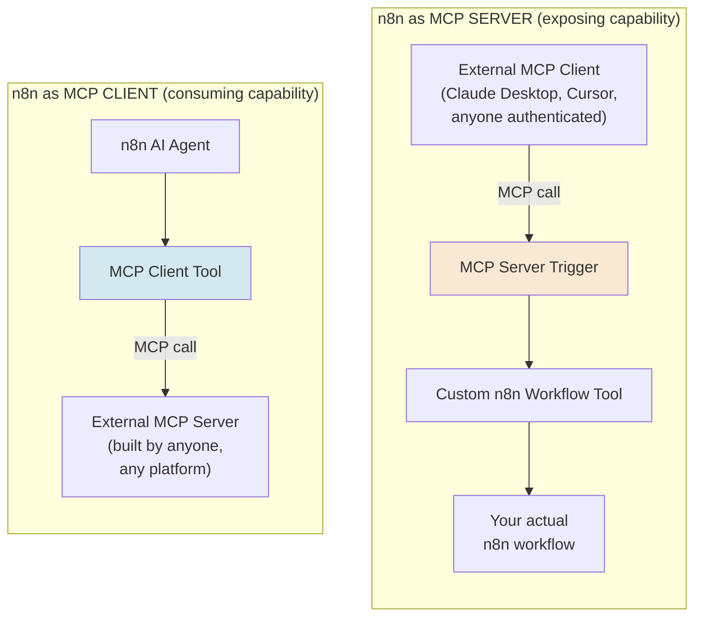
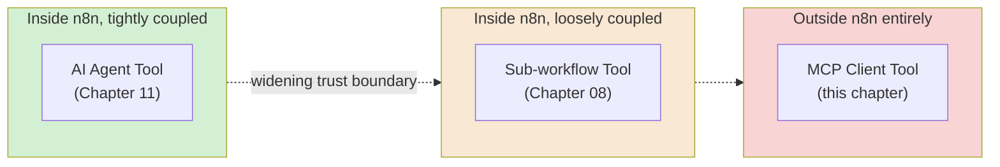
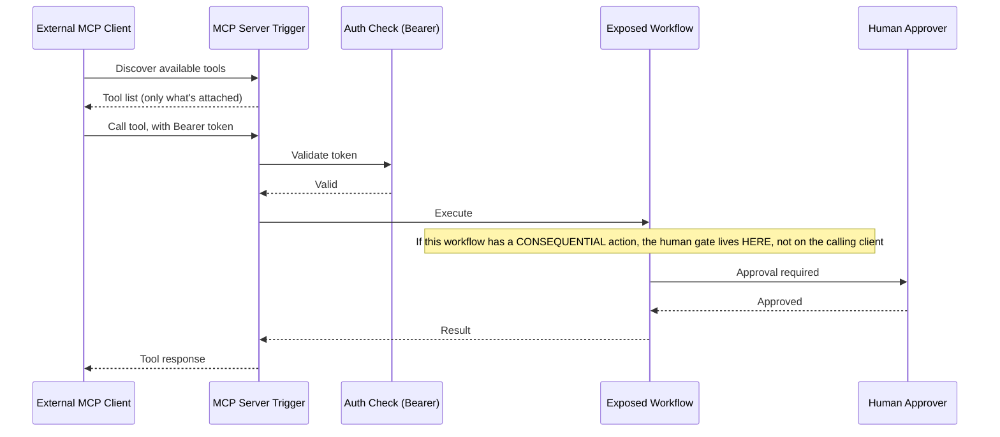
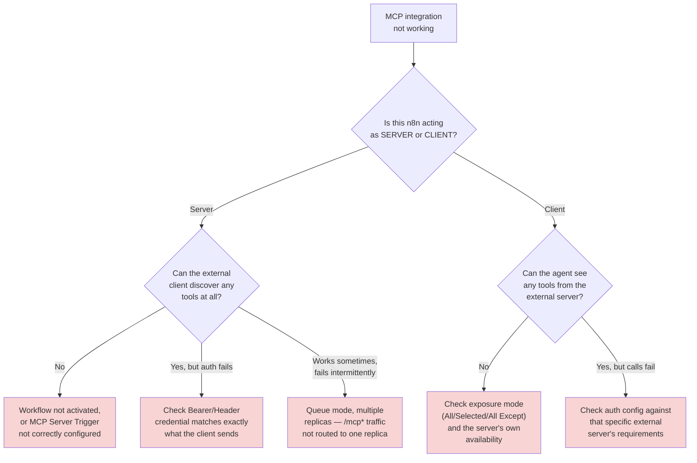
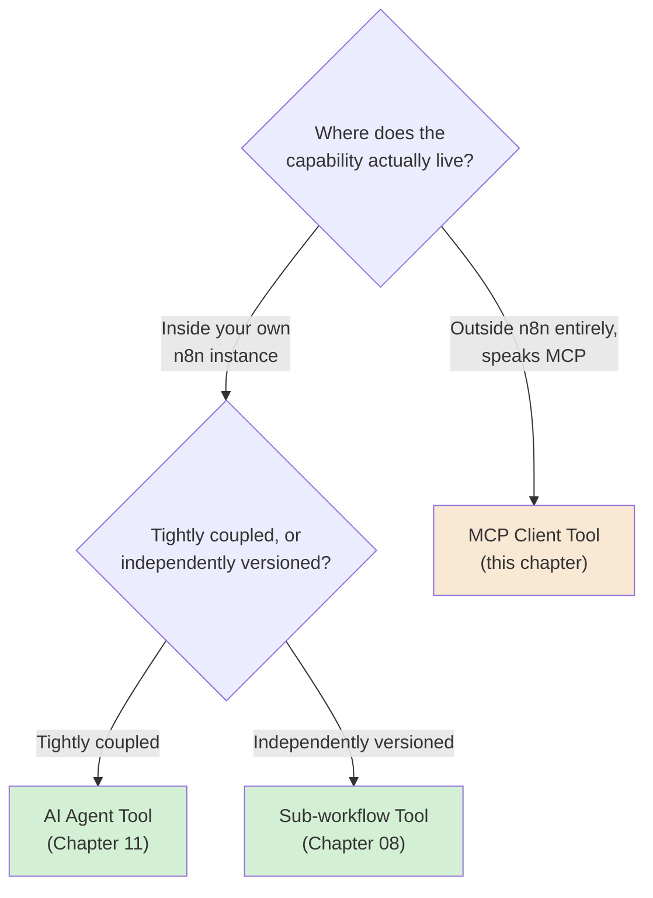

# Chapter 12 — n8n and MCP: Bridging Visual Automation and the Agent Ecosystem

## Learning Objectives

By the end of this chapter, you will be able to:

- Explain why MCP exists as a standard protocol for tool exposure — Volume 2's own foundational reasoning, reused here — and place n8n as one concrete implementation of it, not a competing standard.
- Turn a real n8n workflow into a genuine **MCP tool**, callable by any MCP-compatible client, using the **MCP Server Trigger**.
- Configure MCP Server Trigger authentication correctly, and explain why an unauthenticated MCP endpoint is a real, current, actively-exploited risk class across the broader MCP ecosystem — not a hypothetical.
- Connect an n8n AI Agent to an **external** MCP server as a client, using the **MCP Client Tool**, controlling exactly which of that server's tools are exposed.
- Choose between an MCP Client Tool, Chapter 11's AI Agent Tool, and a sub-workflow (Chapter 08) for exposing a given capability, based on whether the consumer lives inside or outside your own n8n instance.
- Explain n8n's current MCP transport support (SSE, Streamable HTTP) and the queue-mode routing requirement persistent MCP connections have.
- Apply Chapter 09's human-in-the-loop and blast-radius discipline to tools exposed via MCP — where, unlike Chapter 11's nested agents, the calling agent might not be built in n8n at all, or even known to you.
- Distinguish n8n's native, built-in MCP server (for AI clients building or editing workflows themselves) from the MCP Server Trigger (for exposing a specific workflow as a callable tool) — two genuinely different, easily confused MCP surfaces.

## Prerequisites

- **Chapters completed:** Chapters 09–11 (this volume) — this chapter assumes agents, tools, and blast radius are already familiar. **Volume 2 (MCP Engineering), in full** — this chapter is explicitly the concrete payoff of that entire volume; it assumes you already understand MCP's client/server model, tool schemas, and transport mechanics from first principles, and shows you exactly where n8n implements each piece.
- **Tools installed:** Same n8n instance as previous chapters, plus an MCP-compatible client for testing (Claude Desktop, Claude Code, Cursor, or any other current MCP client).

## Estimated Reading Time

75–90 minutes

## Estimated Hands-on Time

3.5 hours

---

## ⚡ Fast Read

> **Skim time: 5 minutes**

- **What it is:** n8n's two-directional bridge to the broader MCP ecosystem — the **MCP Server Trigger** lets n8n *expose* a workflow as a tool any MCP client can call; the **MCP Client Tool** lets an n8n agent *consume* tools from any external MCP server.
- **Why it matters:** Every agent you've built so far in this volume has lived entirely inside n8n. MCP is the protocol boundary where that stops being true — an n8n workflow can become a tool for Claude Desktop, Cursor, or any other MCP client you've never met; an n8n agent can use tools built by teams who've never heard of n8n. This is Volume 2's entire subject, now with a concrete, current platform actually implementing it.
- **Key insight:** As of mid-2026, real, independent research found roughly 40% of publicly-exposed MCP servers have no authentication at all — and this isn't a hypothetical risk category, it's an active, ongoing, multi-CVE security crisis across the MCP ecosystem, with real remote-code-execution vulnerabilities disclosed against real, widely-used MCP servers. n8n's own MCP Server Trigger requires you to explicitly turn authentication on — it does not do it for you.
- **What you build:** A real n8n workflow exposed as an authenticated MCP tool, callable from an actual external MCP client; an n8n agent consuming tools from an external MCP server with deliberately scoped access; and a hardened, properly authenticated version of both, grounded in this chapter's real security research.
- **Jump to:** [Core Concepts](#core-concepts) | [First MCP Tool](#beginner-implementation) | [Best Practices](#best-practices) | [Mini Project](#mini-project)

---

## Why This Topic Exists

Chapter 11 showed you how to compose agents *inside* n8n — a supervisor delegating to specialists, all on one canvas, all within your own instance's trust boundary. That's a real, useful architecture, but it has a hard ceiling: everything in it has to be built in n8n. Volume 2 of this series spent an entire volume on a different, deliberately more general idea — the **Model Context Protocol**, a standard way for *any* AI system to discover and call tools exposed by *any* other system, regardless of what either one is built with. This chapter is where that standard and this specific platform meet.

The reason this matters practically: real organizations don't build their entire tool ecosystem in one platform. A team might have genuinely excellent internal tools built as n8n workflows, and separately want to use a well-built external MCP server someone else maintains — a GitHub MCP server, a database MCP server, whatever the ecosystem offers. MCP is what lets those two worlds talk to each other without either one having to rebuild the other. n8n's job, concretely, is to be a good citizen on both sides of that boundary — a good MCP *server* (exposing its own capability well) and a good MCP *client* (consuming others' capability safely). This chapter teaches both directions, and — because Volume 2 already covered MCP's security model in depth — pays particular attention to what changes, concretely, once the calling agent on the other end of a tool call might not be something you built, configured, or even know about.

## Real-World Analogy

Chapter 11's multi-agent supervisor was like a company's own internal team of specialists — everyone on the same payroll, everyone following the same internal rules, everyone the supervisor could reasonably trust because they were hired and onboarded together.

MCP is the difference between that internal team and **hiring an outside contractor through a standard, published contract template**. The contract template (MCP itself) defines exactly how a request gets made and exactly how a result comes back — in a way that works whether the contractor is a solo freelancer, a huge agency, or another department entirely. When n8n exposes a workflow via the **MCP Server Trigger**, it's publishing itself as a contractor available for hire, using that standard contract — anyone speaking the same protocol can find and use it. When n8n uses the **MCP Client Tool**, it's the one doing the hiring — bringing in outside capability through that same standard contract, without needing to know or trust the internal details of how the contractor actually does the work.

And here's the part this chapter takes seriously, the same way you'd take seriously who you actually let sign a contract on your company's behalf: **a contract template being standard doesn't mean every party using it is trustworthy or careful.** Publishing yourself as available for hire, with no ID check at the door, means literally anyone can walk in and start issuing work orders — which is exactly the real, current, widely-documented problem this chapter's Security Considerations covers in depth.

---

## Core Concepts

### MCP (Recap)

**Technical definition:** A standard protocol defining how an AI system discovers and invokes tools exposed by a separate server, independent of what either the client or the server is built with — Volume 2's own subject, in full.

**Plain English:** A common language for "here are the things you can ask me to do," usable across completely different tools and platforms.

**Analogy:** The standard contract template from this chapter's opening analogy — the same paperwork works regardless of who's actually signing it.

### MCP Server Trigger

**Technical definition:** n8n's trigger node (package `n8n-nodes-langchain`) that makes an n8n instance act as an MCP **server** — it doesn't pass data to connected nodes the way other triggers do; instead, it exclusively connects to and executes **tool** sub-nodes, making them discoverable and callable by any connected MCP client.

**Plain English:** The node that publishes "here's what you can ask this n8n instance to do" to the outside world.

**Analogy:** Putting your business on the contractor directory, with a published list of exactly what work you're available to take on.

> Workflows are attached to it using the **Custom n8n Workflow Tool** node — the mechanism, concretely, for choosing exactly which internal workflow becomes an externally-callable MCP tool. Nothing is exposed by default; every tool exposed via this trigger is a deliberate choice.

### MCP Client Tool

**Technical definition:** n8n's tool sub-node letting an AI Agent (Chapter 09) use tools exposed by an **external** MCP server, connecting via an SSE endpoint, with configurable exposure of **All**, **Selected**, or **All Except** specific tools from that server.

**Plain English:** The node that lets an n8n agent hire an outside contractor's tools, through the standard MCP contract.

**Analogy:** The hiring side of the contractor relationship — and the three exposure modes are exactly the equivalent of deciding whether to give a new contractor access to your entire toolshed, one specific tool, or everything except the one thing you'd rather they not touch.

### Tool Exposure Modes

**Technical definition:** The MCP Client Tool's three current options for which of a connected external server's tools an agent actually gets access to — **All**, **Selected** (an explicit allowlist), or **All Except** (an explicit denylist).

**Plain English:** How much of the outside contractor's full toolkit you actually hand over.

**Analogy:** Directly restated from the MCP Client Tool definition above — this is the concrete, configurable version of Chapter 09's blast-radius principle, applied specifically to tools you didn't build yourself.

> **Selected** is the right default for anything beyond quick experimentation, the same "narrowest scope that still works" discipline Chapter 04 taught for OAuth2 scopes — an external MCP server's full tool list is not vetted by you, and **All** hands your agent every one of them, sight mostly unseen.

### Transport Protocol

**Technical definition:** The underlying HTTP mechanism MCP communication actually runs over — n8n's current MCP nodes support **Server-Sent Events (SSE)**, a long-lived HTTP-based connection, and **Streamable HTTP**; **stdio transport is not currently supported**.

**Plain English:** The specific technical "phone line" the MCP conversation runs over.

**Analogy:** Whether the contractor's paperwork gets faxed once versus a standing, open phone line kept connected for the whole engagement — different mechanisms, same underlying contract.

> This has a real, concrete operational consequence covered in this chapter's Production Architecture: because these are **persistent connections**, a queue-mode n8n deployment (Chapter 16) running multiple webhook replicas needs all `/mcp*` traffic routed to a single, dedicated replica — otherwise connections fail intermittently as requests land on a replica that doesn't hold the live connection state.

### MCP Authentication

**Technical definition:** The MCP Server Trigger's current authentication options — **Bearer token** (an `Authorization: Bearer {token}` header) or **Header auth** (a custom header name/value) — configured via n8n's Credentials Manager (Chapter 04), never hardcoded.

**Plain English:** How you check ID at the door before letting an MCP client actually call anything.

**Analogy:** The ID check this chapter's opening analogy specifically flagged as missing when it's skipped.

> **This is optional, not default-on.** n8n's own documentation states the requirement plainly: *"Don't rely on obscure or hard-to-guess URLs for security."* Configuring real authentication is a deliberate step you have to take — it is not something the platform forces on you, and per this chapter's Security Considerations, the broader MCP ecosystem's real, current, well-documented track record on this exact point is genuinely bad.

### n8n's Native MCP Server

**Technical definition:** A separate, distinct current n8n feature (currently in Public Preview, available on Cloud, Enterprise, and self-hosted Community Edition on v2.18.4 and above) letting an external MCP client build, test, and publish n8n workflows *themselves* — a fundamentally different capability from the MCP Server Trigger, which exposes one *specific, already-built* workflow as a tool.

**Plain English:** The difference between "an AI can call this one specific thing I built" (MCP Server Trigger) and "an AI can go build new things directly inside my n8n instance" (the native MCP server).

**Analogy:** The difference between hiring a contractor for one specific, defined job (MCP Server Trigger) and handing a contractor a key to your own workshop so they can build whatever they think is needed (the native MCP server) — a genuinely much larger grant of trust and capability.

> **This chapter's own hands-on work focuses on the MCP Server Trigger and MCP Client Tool** — the tool-exposure surface. The native MCP server's workflow-building capability is Chapter 13's territory (the AI Workflow Builder) — don't conflate the two; they're separate features solving separate problems, currently at different maturity levels (the native MCP server is Public Preview; the MCP Server Trigger/Client Tool nodes are stable, current features).

### Cross-Boundary Blast Radius

**Technical definition:** The specific version of Chapter 09's blast-radius principle that applies once a tool's caller is outside your own instance's trust boundary — an MCP-exposed tool's actual risk is a function of *every possible MCP client that can successfully authenticate to it*, not just the one client you had in mind when you built it.

**Plain English:** "If literally anyone who can get past the authentication check calls this, how bad is the worst thing they could make it do?"

**Analogy:** Chapter 09's own "if this agent does the dumbest possible thing right now, how bad is it" question, now asked about a contractor relationship where you don't get to personally vet every contractor who might show up at the door.

> This is the concept behind this chapter's central engineering discipline: a tool exposed via the MCP Server Trigger needs Chapter 09's human-in-the-loop gating built **into the exposed workflow itself**, not assumed to exist on the calling agent's side — because you have no control over, and often no visibility into, what that calling agent actually is.

---

## Architecture Diagrams

### Diagram 1 — n8n as MCP Server vs. n8n as MCP Client



### Diagram 2 — Three Ways to Grant Agent Capability, by Trust Boundary



## Flow Diagrams

### Diagram 3 — An External MCP Client Calling an Authenticated n8n Tool



---

## Beginner Implementation

> **No-code path.** No coding required.

**Goal:** Aperture Cloud's "Status Check Tool" — a first, read-only workflow exposed as a real, authenticated MCP tool.

1. Build a simple workflow: **Execute Sub-workflow Trigger** (per Chapter 08's pattern) → an HTTP Request node checking a real, public status endpoint → a Set node formatting a clean response.
2. Add an **MCP Server Trigger** node to a **separate** workflow. Configure **Bearer token authentication**, storing the token via the Credentials Manager (Chapter 04) — never typed directly into the node.
3. Add a **Custom n8n Workflow Tool** node, connected to the MCP Server Trigger, pointed at your status-check workflow from step 1. Give it a clear name and description — the same discipline Chapter 09 taught for any tool.
4. Activate the workflow, and connect a real external MCP client (Claude Desktop, Claude Code, or another current MCP client) to your MCP Server Trigger's URL, providing the Bearer token you configured.
5. From the external client, ask it to check Aperture Cloud's status — confirm it discovers and correctly calls your exposed tool.

**What you just built:** A genuine MCP server, callable by any real, external, MCP-compatible client — the exact top half of Diagram 1, authenticated correctly from the start.

---

## Intermediate Implementation

> **The reverse direction — consuming an external MCP server.**

**Goal:** Extend Chapter 09's agent to use tools from a real, external MCP server.

1. Take the AI Agent node from Chapter 09 (or build a fresh one). Add an **MCP Client Tool** node, connected to a real, public MCP server's SSE endpoint (choose one with a genuinely public, documented tool set for this exercise).
2. Set the exposure mode to **Selected**, and deliberately choose only one or two of that server's tools — not **All** — per this chapter's Core Concepts discipline.
3. Configure authentication appropriately for that server (Bearer, header, OAuth2, or None if the server genuinely requires none — note explicitly, in your own documentation, if you're connecting to an unauthenticated server, and why that's an acceptable risk for this specific, low-stakes exercise).
4. Run the agent with a question requiring one of the exposed tools, and confirm it correctly discovers and calls it, exactly the way it would call any of Chapter 09's own tools.

**What to notice:** From the agent's own reasoning perspective, an MCP-sourced tool looks identical to a Chapter 09 HTTP Request Tool or a Chapter 11 AI Agent Tool — the protocol boundary is invisible to the model. All the difference lives in what's actually on the other end, and how much you've deliberately chosen to expose (Diagram 2).

---

## Advanced Implementation

> **Engineering-depth path.** A consequential tool, gated correctly for an unknown caller.

**Goal:** Expose a genuinely consequential workflow via MCP, with the human-approval gate built where it actually has to live.

1. Build a workflow that issues a real (or simulated) refund, reusing Chapter 09's Advanced Implementation pattern — but this time, the human-in-the-loop gate must be built **inside this workflow itself**, using a Wait node (Chapter 06's async request-reply pattern) pausing for a real Slack approval, rather than relying on the Tools Agent's own built-in gate mechanism, which assumes the caller is an n8n AI Agent node — an assumption that doesn't hold for an arbitrary external MCP client.
2. Expose this workflow via the MCP Server Trigger, with a **Custom n8n Workflow Tool**, and require **Bearer authentication**.
3. Test it from an external MCP client: confirm the tool call itself succeeds immediately (acknowledging the request), the workflow pauses for real human approval exactly as Chapter 06's Wait node pattern describes, and the refund only actually executes after that approval — regardless of what the calling MCP client does or doesn't wait for.

```text
// The engineering judgment this exercise is teaching, stated explicitly:
//
// Chapter 09's human-in-the-loop gate is a feature of the AI AGENT NODE
// itself — it assumes the thing invoking the tool is an n8n Tools Agent
// that understands and respects that gate.
//
// An external MCP client calling your exposed tool directly has NO
// obligation to understand or respect anything about n8n's own agent
// mechanics. If the approval gate lived only in "trust the calling
// agent to ask nicely," an external caller could simply never encounter
// that gate at all.
//
// The fix: put the gate INSIDE the exposed workflow itself (a Wait node
// requiring real human action before the workflow's final,
// consequential step runs) — so the gate holds regardless of what's
// calling it, or how well-behaved that caller chooses to be.
```

**The common mistake alongside the correct pattern:**

```text
WRONG: Expose a consequential n8n Tools Agent's tool directly via MCP,
assuming the agent's own human-approval configuration protects it —
it only protects calls FROM that specific agent, not calls arriving
directly at the underlying tool from any other MCP client.

RIGHT: Build the approval gate into the workflow being exposed, using a
mechanism (a Wait node, an explicit approval step) that holds regardless
of what's calling it, per this chapter's Advanced Implementation.
```

**How to debug it when it breaks:** If an external client can't discover your tools, confirm the workflow is genuinely **activated**, not just saved — the same activation requirement Chapter 02 taught for any production trigger. If authentication fails intermittently under real load, check whether you're running queue mode with multiple webhook replicas and haven't yet routed `/mcp*` traffic to a single dedicated replica, per this chapter's Production Architecture.

**The production version, where it differs from the learning version:** The learning version's Bearer token is a single, static credential. A production deployment exposing tools to multiple distinct external consumers typically issues **separate tokens per consumer**, so a single compromised or misbehaving client's access can be individually revoked without affecting every other legitimate caller — the same credential-isolation discipline Chapter 04 taught generally, now applied specifically to MCP consumers you don't fully control.

---

## Production Architecture

- **Persistent MCP connections need dedicated routing in queue mode**, confirmed directly from n8n's own documentation: all `/mcp*` requests must reach a single, consistent webhook replica, or connections fail intermittently — a concrete, current, citable detail worth planning for before scaling an MCP-exposed instance (Chapter 16 covers queue mode in full).
- **The native MCP server and the MCP Server Trigger have genuinely different production risk profiles.** The native MCP server (Public Preview, workflow-building capability) grants a connected client the ability to create or modify workflows directly — a fundamentally larger trust grant than the MCP Server Trigger's narrow, single-workflow exposure. Treat them as separate features requiring separate risk review, not two flavors of the same thing.
- **Token issuance and rotation for MCP consumers is a real, ongoing operational responsibility** — per this chapter's Advanced Implementation, per-consumer tokens are the production default, and rotating or revoking one consumer's access without disrupting others requires the same credential-lifecycle discipline Chapter 04 and Chapter 19 cover for any other production credential.

---

## Best Practices

1. **Always configure real authentication on the MCP Server Trigger — Bearer or Header, never left unauthenticated** — per n8n's own explicit documented warning against relying on an obscure URL.
2. **Build human-approval gates inside the exposed workflow itself for any consequential MCP-exposed tool**, never relying on the calling agent's own good behavior, per this chapter's Advanced Implementation.
3. **Default the MCP Client Tool's exposure to Selected, not All**, when consuming an external server you didn't build — the narrowest scope that still does the job.
4. **Issue separate tokens per distinct MCP consumer in production**, so access can be individually revoked.
5. **Treat the native MCP server's workflow-building capability and the MCP Server Trigger's tool-exposure capability as separate risk decisions**, reviewed independently.
6. **Route all `/mcp*` traffic to a single dedicated webhook replica in any queue-mode deployment**, before it becomes an intermittent, hard-to-diagnose production issue.

---

## Security Considerations

- **This is not a hypothetical risk category — it's an active, ongoing, real security crisis across the MCP ecosystem as of 2026.** Independent research (Censys scanning) found over 21,000 internet-accessible MCP services, with roughly **40% unauthenticated**. Separately, a dedicated MCP vulnerability-scanning framework (VIPER-MCP) scanned nearly 40,000 real-world MCP repositories and found **106 zero-day vulnerabilities**. Real, disclosed, high-severity CVEs exist against widely-used MCP servers — including unauthenticated remote-code-execution chains against production systems. None of this is n8n-specific — these incidents affected other MCP server implementations across the ecosystem — but n8n's MCP Server Trigger sits in exactly the same category of exposure if authentication isn't explicitly configured, which is precisely why n8n's own documentation states the "don't rely on an obscure URL" warning as plainly as it does.
- **Cross-boundary blast radius is genuinely different from Chapter 11's nested-agent blast radius.** A misconfigured nested agent (Chapter 11) is still bounded by your own instance's other controls. A misconfigured, unauthenticated MCP-exposed tool is reachable by *anyone on the internet who finds it* — the same category of exposure Chapter 01 warned about for unauthenticated webhooks, now with the added risk that the caller is specifically trying to get an AI system to take an action on their behalf.
- **An MCP Client Tool consuming an external server inherits that server's own trustworthiness entirely.** Per Chapter 09's tool-grant discipline, connecting to an unvetted external MCP server with **All** tools exposed hands your agent every capability that server's owner chose to build — including, potentially, capabilities designed to exploit exactly the kind of agent that would connect to them.

## Cost Considerations

MCP introduces a cost dimension the rest of this volume hasn't had to consider directly: **an externally-exposed tool's call volume is not bounded by anything you control**, unlike Chapter 09's own agent, whose Max Iterations you set deliberately. An MCP-exposed workflow with no rate limiting of its own can be called as often as any authenticated (or, worse, unauthenticated) client chooses — directly reintroducing Chapter 06's rate-limiting discipline, now at the boundary of your entire instance rather than inside one workflow's fan-out. Pair any MCP-exposed tool with the same per-caller rate-limiting and circuit-breaker thinking (Chapter 07) you'd apply to any other externally-callable endpoint.

## Common Mistakes

**Mistake 1 — No authentication on the MCP Server Trigger.**
```text
WRONG: Rely on the MCP URL being long/obscure as the only protection.
RIGHT: Configure real Bearer or Header authentication — per n8n's own
explicit documentation on this exact point.
```

**Mistake 2 — Assuming the calling agent's human-approval gate protects an MCP-exposed tool.**
```text
WRONG: A consequential Tools Agent tool exposed directly via MCP, with
no gate inside the underlying workflow itself.
RIGHT: Build the gate into the exposed workflow, per this chapter's
Advanced Implementation — it must hold regardless of the caller.
```

**Mistake 3 — Exposing All tools from an unvetted external MCP server.**
```text
WRONG: MCP Client Tool set to "All" against a server you haven't
reviewed, handing your agent every capability it offers.
RIGHT: "Selected," reviewed and chosen deliberately, per Chapter 09's
tool-grant discipline.
```

## Debugging Guide



| Symptom | Likely cause | Where to look |
|---|---|---|
| External client can't discover any tools | Workflow not activated, or Custom n8n Workflow Tool not correctly attached | Activation status; MCP Server Trigger's connected tool nodes |
| Auth fails on every call | Credential mismatch between what's configured and what the client sends | Bearer token/header value, exactly |
| Works, then fails intermittently under load | Queue mode with multiple replicas, no dedicated `/mcp*` routing | Load balancer / reverse proxy routing rules |
| Agent can't see an external server's tools | Exposure mode misconfigured, or the server itself unreachable | MCP Client Tool's exposure setting; the external server's own status |
| A consequential action fired with no approval | Gate assumed to live on the calling agent, not the exposed workflow | Whether the approval step is inside the exposed workflow itself |

## Performance Optimisation

> Illustrative Aperture Cloud measurements, not a published benchmark.

In an illustrative test, an MCP-exposed workflow with no per-caller rate limiting handled a burst of 200 rapid calls from a single (authenticated but misbehaving) test client with no resistance, consuming real execution and token budget for all 200. The same workflow, with a simple per-token call-count check (Chapter 07's circuit-breaker pattern, keyed on the caller's Bearer token) added, correctly rejected calls past a reasonable threshold within the same test. The lesson: **authentication tells you who's calling; it doesn't limit how often — those are two separate controls, and MCP exposure needs both.**

---

## Technology Comparison

| Platform | MCP server support | MCP client support |
|---|---|---|
| **n8n** | MCP Server Trigger — expose any workflow as a tool, visually | MCP Client Tool — consume any external server's tools |
| **Hand-rolled (Volume 2's own subject)** | Full control via the Python/TypeScript MCP SDK directly | Full control, same SDK |
| **Zapier / Make** | MCP support exists but is newer and less central to the platform's core design than n8n's dedicated node family | Similarly emerging |
| **Claude Agent SDK (Volume 4)** | Not itself an MCP server platform, but a strong MCP client — directly relevant as the calling side of this chapter's Beginner Implementation | Native, deep MCP client support |

The honest comparison, consistent with this course's recurring theme: n8n gives you a real, working MCP server and client *faster* than hand-rolling one with Volume 2's SDK-level approach, at the cost of the visual platform's usual tradeoff — less fine-grained control over exactly how the protocol is implemented underneath.

## Decision Framework — MCP Client Tool, AI Agent Tool, or Sub-workflow?



And the reverse question — should *your* capability be exposed via MCP at all: expose it when you genuinely want it usable by MCP clients you don't control or haven't built (Claude Desktop, a partner's own agent system); keep it as a plain sub-workflow or AI Agent Tool when it only ever needs to be called from inside your own n8n instance.

---

## Real Client Scenario — Aperture Cloud's Externally-Exposed Support Tool

Aperture Cloud wanted their internal support-status-lookup capability usable directly from their engineers' own Claude Desktop sessions, without engineers needing to open n8n at all. This is a genuinely consequential exposure decision — not because the lookup tool itself is risky, but because it's the first tool in this course exposed to callers Aperture Cloud doesn't fully control the identity of, consistent with this course's Autonomy Thread now extending across a real protocol boundary, not just within one instance. The team built exactly this chapter's Beginner Implementation — Bearer-authenticated, narrowly scoped to one read-only workflow — and, per this chapter's Advanced Implementation discipline, treated any future consequential tool exposed the same way as needing its own internal approval gate, not an assumption that whoever authenticates is automatically trustworthy with anything beyond what they were explicitly issued a token for.

---

### Production Issue: The MCP Endpoint Anyone Could Call

**Symptoms**

**This chapter's Production Issue is grounded in a real, current, well-documented industry-wide pattern, not a single named n8n incident** — worth being precise about, the same discipline this course has applied throughout. During a routine security review, Aperture Cloud discovered an MCP Server Trigger, deployed months earlier for an internal proof-of-concept, still active in production with **authentication left at None** — reachable by anyone who discovered its URL, exposing a workflow capable of writing directly to an internal database.

**Root Cause**

The MCP Server Trigger's authentication is opt-in, not default-on — a real, confirmed, current fact about n8n's own implementation. During initial testing, authentication was deliberately left off "just for now" to simplify debugging, and the proof-of-concept was later promoted toward production use without that decision ever being revisited. This is exactly the same pattern the real, independent 2026 research this chapter cites found at genuinely alarming scale across the broader MCP ecosystem — roughly 40% of publicly-reachable MCP servers, unauthenticated, for exactly this kind of reason: a temporary convenience that nobody circled back to close.

**How to Diagnose It**

Audit every active MCP Server Trigger across your instance(s) and check, for each one, whether authentication is genuinely configured — not just present as an option, but actually required — and cross-reference each exposed workflow's actual capability (read-only lookup versus real write access) against that authentication status.

**How to Fix It**

```text
BEFORE: MCP Server Trigger, Authentication: None, exposing a workflow
with real database write access.

AFTER: MCP Server Trigger, Authentication: Bearer token (issued
per-consumer, per this chapter's Production Architecture), PLUS a
review of whether this specific workflow's write capability genuinely
needs to be MCP-exposed at all, versus scoped down to a narrower,
read-only version for external use.
```

**How to Prevent It in Future**

Treat "does every active MCP Server Trigger have real, current, reviewed authentication" as a standing, periodic audit item — not a one-time check at initial build — specifically because this chapter's own research shows "temporarily unauthenticated for convenience, never revisited" is the dominant real-world pattern behind this exact failure class across the industry, not an unusual oversight specific to any one team.

---

## Exercises

1. **(20 min)** For three internal n8n workflows you can imagine, decide which would be reasonable to expose via MCP, and which shouldn't be, and why.
2. **(45 min)** Build the Beginner Implementation's authenticated MCP-exposed tool, and connect a real external MCP client to it.
3. **(60 min)** Build the Intermediate Implementation's MCP Client Tool, consuming a real external server with Selected exposure.
4. **(90 min)** Build the full Advanced Implementation — a consequential, MCP-exposed workflow with its approval gate built correctly inside the workflow itself.
5. **(30 min)** Audit every MCP Server Trigger in your own test instance (or the exercises above) and confirm none are left unauthenticated.

## Quiz

**1. What's the structural difference between the MCP Server Trigger and the MCP Client Tool?**
> The MCP Server Trigger makes n8n act as an MCP server, exposing a workflow as a callable tool to external clients. The MCP Client Tool makes an n8n agent act as an MCP client, consuming tools from an external MCP server.

**2. Why is Chapter 09's built-in human-in-the-loop gate not sufficient for a consequential tool exposed via MCP?**
> That gate is a feature of the Tools Agent node itself, assuming the caller is an n8n agent that respects it. An external MCP client calling the underlying tool directly has no obligation to respect that mechanism — the gate must be built into the exposed workflow itself to hold regardless of the caller.

**3. What real, current statistic does this chapter cite about the state of MCP server authentication across the ecosystem?**
> Independent research (Censys scanning) found roughly 40% of over 21,000 publicly-reachable MCP services had no authentication at all.

**4. What does n8n's own documentation explicitly warn against relying on for MCP Server Trigger security?**
> An obscure or hard-to-guess URL — real authentication (Bearer or Header) must be explicitly configured instead.

**5. What's the difference between n8n's native MCP server and the MCP Server Trigger?**
> The native MCP server lets an external client build or modify workflows directly inside the instance (Public Preview, a much larger trust grant). The MCP Server Trigger exposes one specific, already-built workflow as a narrowly-scoped callable tool.

**6. Why does a queue-mode n8n deployment need special routing for MCP traffic specifically?**
> MCP connections are persistent (SSE or Streamable HTTP); with multiple webhook replicas, all `/mcp*` requests must reach the same, consistent replica, or connections fail intermittently.

**7. Why is "Selected" the recommended default exposure mode for an MCP Client Tool connecting to an external server, rather than "All"?**
> Because an external server's full tool list isn't vetted by you — exposing only deliberately reviewed, selected tools follows the same narrowest-scope discipline Chapter 04 taught for OAuth2 scopes.

**8. What's the real, new cost/risk dimension this chapter introduces that Chapter 09's own agent didn't have?**
> An MCP-exposed tool's call volume isn't bounded by anything comparable to Max Iterations — any authenticated (or unauthenticated) caller can call it as often as they choose, requiring the same rate-limiting discipline Chapter 06/07 taught, now at the instance's external boundary.

**9. In this chapter's Production Issue, what specific decision, made early and never revisited, caused the exposure?**
> Authentication was deliberately left off "just for now" during initial proof-of-concept testing, and the workflow was later promoted toward production use without that decision ever being reviewed or reversed.

**10. Why does this chapter distinguish real, independent MCP ecosystem research from a claim of a specific, named n8n incident?**
> Because the cited statistics and CVEs are real and multi-source-corroborated, but they document the broader MCP ecosystem generally, not a specific n8n MCP Server Trigger vulnerability — precision about what's actually been verified, versus what's illustrative, is a standing discipline this course applies throughout.

## Mini Project

**Aperture Cloud's Authenticated Status Tool (2–3 hours)**

- [ ] A real workflow exposed via MCP Server Trigger with genuine Bearer or Header authentication configured.
- [ ] Successfully connected to and called from a real external MCP client.
- [ ] A written note documenting exactly what this exposed tool can and can't do, and who currently holds a valid token for it.

## Production Project

**Aperture Cloud's Gated External Refund Tool (1–2 days)**

- [ ] A consequential workflow exposed via MCP Server Trigger, with its human-approval gate built inside the workflow itself (a Wait node, not reliant on the calling agent).
- [ ] Per-consumer token issuance, with a demonstrated ability to revoke one consumer's access without affecting another's.
- [ ] A rate limit or circuit breaker (Chapter 07) protecting the exposed tool against excessive call volume from any single caller.
- [ ] A deliberate reproduction of this chapter's Production Issue (temporarily disable authentication, confirm the tool becomes callable without it), then the fix re-applied and verified.
- [ ] A written security audit (300–500 words) of your own exposed tool: who can currently call it, what's the worst action an unauthorized caller could take if authentication were somehow bypassed, and one concrete additional safeguard you'd add before considering this genuinely production-ready.

## Key Takeaways

- MCP is a standard, platform-independent protocol for tool discovery and invocation — n8n implements it on both sides, as server and client.
- The MCP Server Trigger exposes a specific n8n workflow as a callable tool to any authenticated MCP client; nothing is exposed without deliberate configuration.
- The MCP Client Tool lets an n8n agent consume external tools, with All/Selected/All Except exposure control — default to Selected.
- Authentication on the MCP Server Trigger is opt-in, not automatic — and the broader MCP ecosystem's real, current track record on this exact point is genuinely concerning (roughly 40% of scanned public servers unauthenticated).
- A consequential MCP-exposed tool needs its human-approval gate built into the workflow itself, because an external caller has no obligation to respect n8n's own agent-level gating mechanisms.
- n8n's native MCP server (workflow-building) and the MCP Server Trigger (tool exposure) are separate features with separate, different risk profiles.
- Persistent MCP connections need dedicated routing in any queue-mode deployment with multiple webhook replicas.
- An MCP-exposed tool's call volume isn't bounded the way an agent's Max Iterations is — rate limiting and circuit breakers are a separate, necessary control.
- Cross-boundary blast radius (MCP) is structurally larger than nested-agent blast radius (Chapter 11) — the caller may be entirely outside your visibility, not just outside your direct control.

## Chapter Summary

| Concept | Key Takeaway |
|---|---|
| MCP Server Trigger | Exposes an n8n workflow as a real, callable MCP tool |
| MCP Client Tool | Lets an n8n agent consume external MCP servers' tools |
| Tool Exposure Modes | All / Selected / All Except — default to Selected |
| MCP Authentication | Opt-in, not automatic — Bearer or Header, always configure it |
| Native MCP Server | A separate, larger-trust-grant feature for AI-driven workflow building |
| Cross-Boundary Blast Radius | The caller may be entirely outside your visibility — gate accordingly |

## Resources

- [n8n MCP Server Trigger documentation](https://docs.n8n.io/integrations/builtin/core-nodes/n8n-nodes-langchain.mcptrigger)
- [n8n MCP Client Tool documentation](https://docs.n8n.io/integrations/builtin/cluster-nodes/sub-nodes/n8n-nodes-langchain.toolmcp)
- [n8n MCP server setup documentation](https://docs.n8n.io/advanced-ai/mcp/accessing-n8n-mcp-server/)
- Volume 2 (MCP Engineering), in full — this chapter's entire conceptual foundation
- Censys 2026 internet-wide MCP exposure scan, and the VIPER-MCP vulnerability research — cited in this chapter's Security Considerations as real, current, independently corroborated findings

## Glossary Terms Introduced

| Term | One-line definition |
|---|---|
| MCP Server Trigger | Exposes an n8n workflow as an MCP-callable tool |
| MCP Client Tool | Lets an n8n agent consume an external MCP server's tools |
| Tool Exposure Modes | All / Selected / All Except, controlling external tool access |
| Transport Protocol (MCP) | SSE or Streamable HTTP — the underlying connection mechanism |
| MCP Authentication | Bearer or Header auth on the MCP Server Trigger, opt-in |
| Native MCP Server | A separate feature letting external clients build workflows directly |
| Cross-Boundary Blast Radius | Risk scope when the caller is outside your own instance |

## See Also

| Topic | Related Chapter | Why |
|---|---|---|
| Volume 2 (MCP Engineering) | Full volume | This chapter's entire conceptual foundation — the payoff Volume 2 was building toward |
| The AI Agent Node | Chapter 09 (this volume) | Human-in-the-loop gating, extended here to work correctly across an external protocol boundary |
| Tool-Calling and Multi-Agent Orchestration | Chapter 11 (this volume) | The trust-boundary comparison this chapter's Decision Framework builds on directly |
| Connecting to the World | Chapter 04 | Credentials Manager and token-scoping discipline, reused for MCP authentication |
| The AI Workflow Builder and Evaluating AI Workflows | Chapter 13 | The native MCP server's workflow-building capability, covered in full |
| Securing n8n in Production | Chapter 19 | The full current MCP/AI security landscape, at complete depth |

## Preparation for Next Chapter

**Technical checklist:**
- [ ] Built and tested a real, authenticated MCP Server Trigger, connected from an actual external MCP client.
- [ ] Built a working MCP Client Tool consuming a real external server, with Selected exposure.
- [ ] Confirmed a consequential MCP-exposed tool's approval gate holds correctly regardless of the calling client.

**Conceptual check:**
- Why doesn't Chapter 09's agent-level human-approval gate protect a tool exposed directly via MCP?
- Why is authentication on the MCP Server Trigger opt-in rather than automatic, and what does that mean for your own audit responsibility?

**Optional challenge:** Before Chapter 13, think about how you'd ask an AI system to build an entirely new n8n workflow for you, from a plain-English description, rather than calling a workflow you already built. Chapter 13 — the AI Workflow Builder — is exactly that capability, including n8n's own native MCP server this chapter set aside.

---

> **Currency Note:** This chapter's n8n-specific facts (MCP Server Trigger and MCP Client Tool current configuration, transport support, authentication options, and the native MCP server's Public Preview status and v2.18.4+ version requirement) and the broader MCP ecosystem security statistics (Censys exposure scan, VIPER-MCP research, disclosed CVEs) were verified directly against `docs.n8n.io` and multiple independent security research sources in July 2026. MCP's security landscape specifically is moving very fast — always confirm current advisory status before making a production exposure decision based on this chapter.
