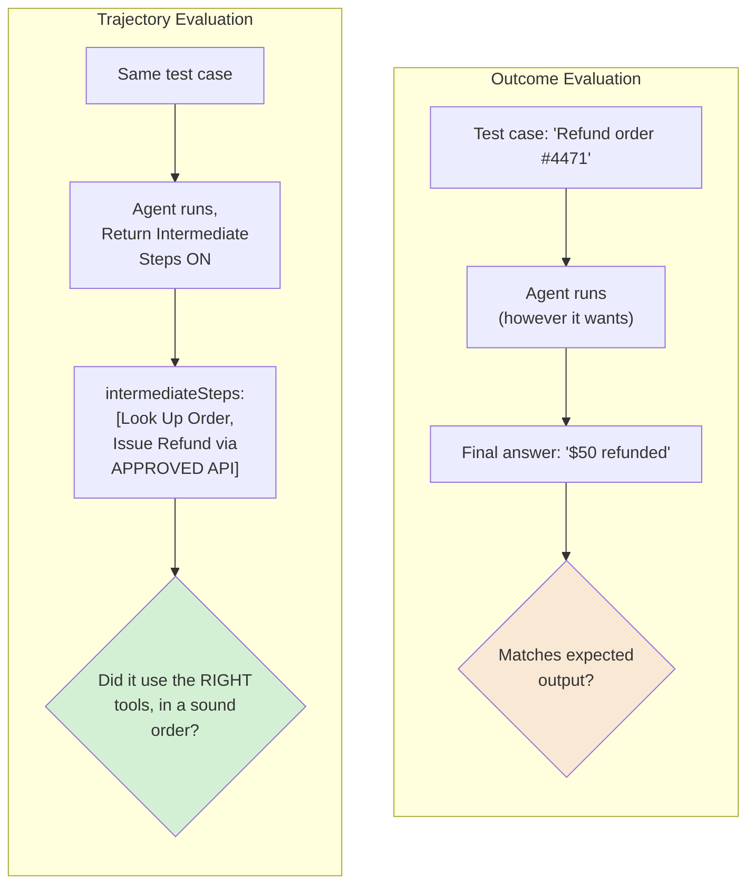
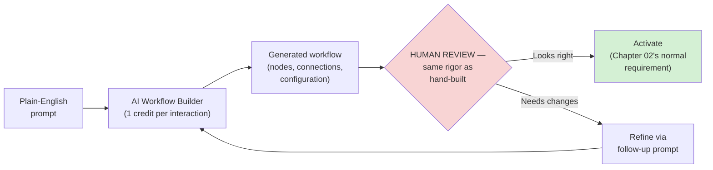
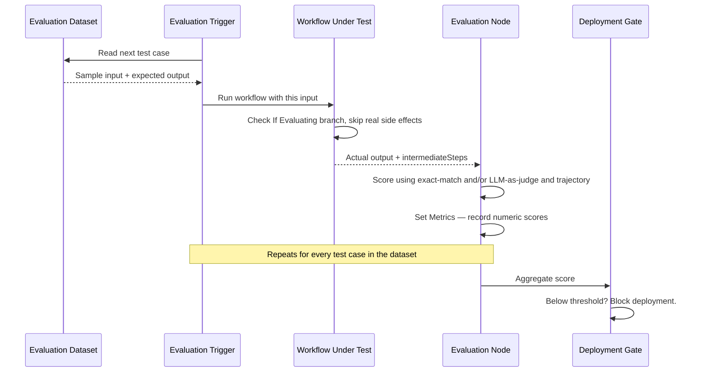
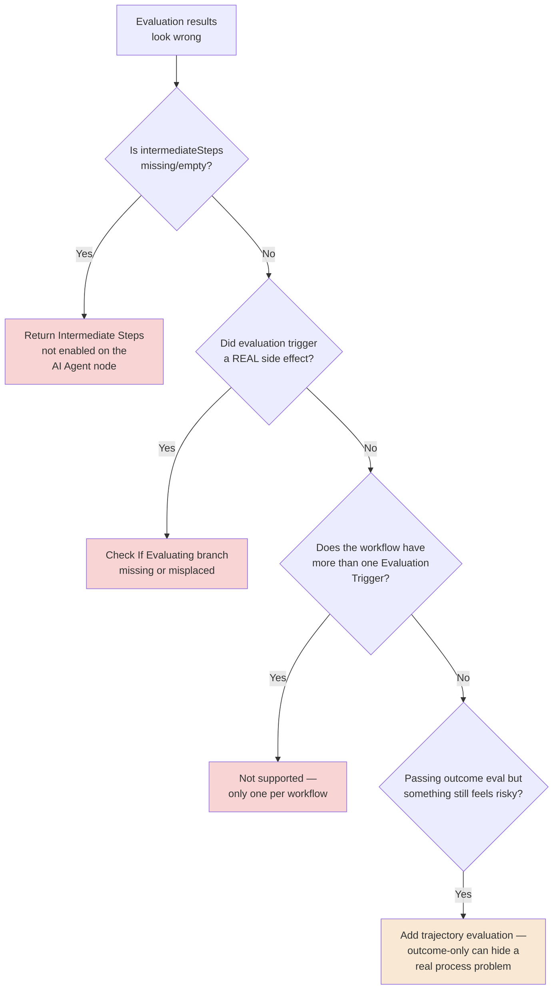
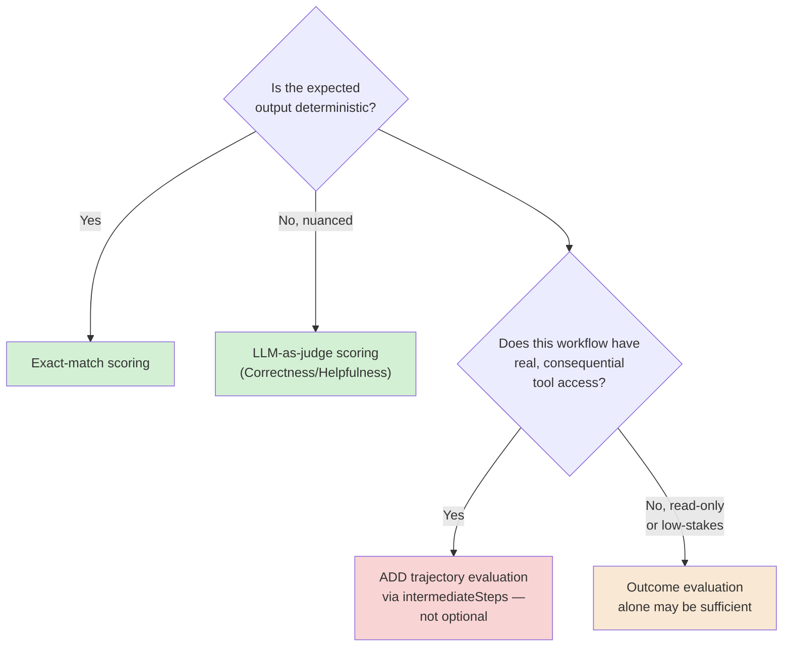

# Chapter 13 — The AI Workflow Builder and Evaluating AI Workflows

## Learning Objectives

By the end of this chapter, you will be able to:

- Generate a working n8n workflow from a plain-English prompt using the **AI Workflow Builder**, and understand its credit-based cost model.
- Explain why a generated workflow still needs the same review and activation discipline as a hand-built one — prompt-to-automation doesn't remove the "who actually reviewed this" question, it just moves it earlier.
- Build a real evaluation dataset and run it through a workflow using the **Evaluation Trigger** node.
- Distinguish **outcome evaluation** (did the final answer match) from **trajectory evaluation** (did the agent get there the right way) — Volume 4 Chapter 12's own distinction, made concrete using n8n's `intermediateSteps` field.
- Use the **Evaluation node's** three operations — Set Outputs, Set Metrics, Check If Evaluating — to build a real evaluation harness inside a production workflow.
- Configure LLM-as-judge scoring using n8n's built-in **Correctness** and **Helpfulness** metrics, and know when exact-match scoring is the better choice instead.
- Explain why evaluation belongs as a gate in a deployment pipeline, not a one-time check run once and forgotten.
- Recognize the specific new risk the AI Workflow Builder introduces — generated automation that looks correct but wasn't authored by a human who fully understands it — and apply this course's existing review discipline to it.

## Prerequisites

- **Chapters completed:** Chapters 09–12 (this volume, all of Module 3) — this chapter assumes agents, retrieval, multi-agent orchestration, and MCP are all familiar. **Volume 4, Chapter 12 (Evaluation)** — this chapter assumes you already know the trajectory-vs-outcome evaluation distinction framework-agnostically; it shows you exactly where it lives in n8n.
- **Tools installed:** Same n8n instance as previous chapters, plus a Google Sheets account or n8n Data Table for storing evaluation datasets.

## Estimated Reading Time

70–85 minutes

## Estimated Hands-on Time

3.5 hours

---

## ⚡ Fast Read

> **Skim time: 5 minutes**

- **What it is:** Two related capabilities that close out Module 3 — the AI Workflow Builder (generating a workflow from a prompt instead of building it node by node) and n8n Evaluations (systematically testing whether an AI-native workflow actually works, not just eyeballing a few manual runs).
- **Why it matters:** Every AI-native workflow this volume has built so far — agents, retrieval, multi-agent systems, MCP tools — has been tested by you, manually, a handful of times. That doesn't scale, and it doesn't catch the failure mode this chapter cares about most: an agent that reaches the *right answer* by the *wrong, riskier path*.
- **Key insight:** Volume 4 Chapter 12 taught you that outcome evaluation (was the final answer correct?) and trajectory evaluation (was the *process* that reached it actually sound?) are different questions — and an agent can pass the first while quietly failing the second. n8n's evaluation framework supports both, concretely, using the same `intermediateSteps` field Chapter 09's "Return Intermediate Steps" option already exposed.
- **What you build:** A workflow generated from a prompt, reviewed with the same rigor as anything hand-built; a real evaluation dataset with exact-match scoring; and an LLM-as-judge trajectory evaluation catching an agent that got the right refund amount by calling a tool it never should have used.
- **Jump to:** [Core Concepts](#core-concepts) | [First Generated Workflow](#beginner-implementation) | [Best Practices](#best-practices) | [Mini Project](#mini-project)

---

## Why This Topic Exists

Module 3 has spent four chapters building genuinely autonomous, genuinely consequential systems — agents that decide their own actions, retrieval pipelines grounding them in real data, multi-agent hierarchies delegating work, and tools exposed across a real protocol boundary via MCP. Every one of those chapters tested its own work the same way: build it, run it a few times by hand, eyeball the result. That's exactly the kind of testing Volume 1's earliest chapters would have called insufficient for a simple script — and it's genuinely insufficient here, for a specific reason this course has returned to repeatedly since Chapter 09: an agent's behavior isn't fully predictable from its configuration the way a plain workflow's is. You need to actually *test* it, systematically, against real cases — not just trust that it'll keep doing what it did in your last few manual runs.

This chapter closes Module 3 with the two pieces that make that possible. The **AI Workflow Builder** addresses authoring — generating a workflow from a description instead of assembling it node by node, which is powerful and also, per this chapter's Security Considerations, a genuinely new place for this course's human-review discipline to apply. **n8n Evaluations** addresses testing — a real, dataset-driven framework for scoring whether a workflow (especially an AI-native one) actually does what it's supposed to, systematically, not anecdotally. And because this is an agent-testing problem specifically, Volume 4 Chapter 12's own central lesson applies directly: checking only the final answer misses failures that live in *how* the agent got there — which is exactly what this chapter's trajectory-evaluation coverage, and its Production Issue, are built around.

## Real-World Analogy

Think about the difference between a new employee who *says* the right answer to a customer, and one who says the right answer *by following the approved process* to get there.

If a customer asks "can I get a refund?" and the employee says "yes, you're approved for $50 back" — that's the right outcome. But *how* they got there matters enormously. Did they check the actual order record, confirm eligibility, and follow the documented refund procedure? Or did they just guess confidently, and happened to guess right this time? **Outcome evaluation** — did the customer get the correct answer — can't tell these two employees apart. **Trajectory evaluation** — watching *how* they arrived at that answer — can, and it's the only way to catch the employee who's going to guess wrong, expensively, the next time the numbers aren't as obvious.

The AI Workflow Builder is this chapter's other half, and it deserves its own analogy: imagine hiring a contractor who can build an entire piece of office furniture from a one-sentence description, in minutes. Genuinely useful. Also not something you'd put into service in your building without someone actually inspecting it first, checking it's stable, checking it does what you described and nothing you didn't intend — the same inspection you'd give a piece built by hand, not a lesser one just because it was built quickly.

---

## Core Concepts

### Prompt-to-Automation (AI Workflow Builder)

**Technical definition:** n8n's current feature generating a working workflow — nodes, connections, and configuration — from a natural-language description, through an iterative describe → build → review → refine cycle, billed per interaction on a credit basis.

**Plain English:** Describing what you want in plain English, and getting a real, working starting workflow back.

**Analogy:** The contractor who builds from a one-sentence description, from this chapter's opening analogy.

> Confirmed current mechanics: each message asking the builder to create or modify a workflow, and each "Execute and refine" action, consumes one credit; failed or manually-stopped requests don't. Notably, and reassuringly from a security standpoint: **credential values and historical execution data are explicitly not sent to the underlying LLM** during generation — a real, deliberate design boundary worth knowing about before you assume otherwise.

### Generated-Code Review Discipline

**Technical definition:** The principle that a workflow's origin (hand-built versus AI-generated) has no bearing on whether it needs the same review before being trusted with real data or real actions — the standard doesn't lower because the authoring was faster.

**Plain English:** Just because it was quick to generate doesn't mean it's quick to trust.

**Analogy:** The furniture inspection this chapter opened with — genuinely fast to build is not the same question as genuinely safe to use.

> n8n's own documentation doesn't describe a special, separate approval gate specific to AI-generated workflows — a generated workflow still needs to be manually activated, the same requirement Chapter 02 taught for any workflow. **The discipline this chapter adds is explicitly treating that activation step as a real review checkpoint for generated workflows**, not a formality, precisely because nobody hand-wrote and reasoned through every node the way they would have otherwise.

### Evaluation Dataset

**Technical definition:** A structured set of test cases — sample inputs, and often expected outputs — stored in a Google Sheet or n8n Data Table, used to systematically test a workflow's behavior across many cases rather than a handful of manual runs.

**Plain English:** Your workflow's actual test suite.

**Analogy:** A driving instructor's structured test route, covering specific, deliberately chosen scenarios — not just "drive around a bit and see how it goes."

### Evaluation Trigger

**Technical definition:** The dedicated trigger node reading an evaluation dataset and feeding its test cases through the workflow one at a time, in sequence — confirmed current constraint: **only one Evaluation Trigger per workflow**.

**Plain English:** The node that actually runs your test suite against the real workflow.

**Analogy:** The instructor actually driving the test route with the student, one leg at a time, rather than just describing it.

### Outcome Evaluation

**Technical definition:** Scoring based solely on a workflow's final output — **exact-match scoring** (the output matches a defined expected value or it doesn't) for deterministic tasks, or **LLM-as-judge scoring** for nuanced, non-deterministic outputs where a separate model evaluates quality against defined criteria.

**Plain English:** "Did it get the right answer?"

**Analogy:** Checking whether the customer walked away with the correct refund amount — without asking how the employee arrived at it.

> n8n confirms two current, built-in LLM-as-judge metrics: **Correctness** (is the response factually accurate against the provided context, scored 1–5) and **Helpfulness** (does the response actually address the user's query) — both real, current, ready-to-use scoring dimensions, not something you have to build entirely from scratch.

### Trajectory Evaluation

**Technical definition:** Scoring based on an agent's **process** — which tools it called, in what order, and why — rather than (or in addition to) its final output, using n8n's `intermediateSteps` field, populated when an AI Agent's **"Return Intermediate Steps"** option (Chapter 09) is enabled.

**Plain English:** "Did it get there the *right way*, not just the right answer?"

**Analogy:** Watching the employee actually check the order record and follow the refund procedure — not just accepting that they said the right number.

> This is Volume 4 Chapter 12's central evaluation distinction, made fully concrete: n8n has no separate "trajectory evaluation" feature — it's the direct, deliberate combination of a mechanism Chapter 09 already introduced (`Return Intermediate Steps`) with the Evaluation node's Set Metrics operation, scoring the *contents* of that intermediate-steps output, not just the agent's final answer.

### LLM-as-Judge Metric

**Technical definition:** A quality dimension scored by a separate model reasoning about an output against defined criteria — n8n's current built-in options are Correctness and Helpfulness, each on a 1–5 scale; custom criteria can be defined for anything these two don't cover.

**Plain English:** A second AI, acting as a grader, checking the first AI's work against a specific rubric.

**Analogy:** A second reviewer checking a colleague's work against a defined quality checklist, rather than just trusting it looked fine at a glance.

### Set Metrics / Check If Evaluating

**Technical definition:** Two of the Evaluation node's three current operations. **Set Metrics** defines and records numeric metric values for a given evaluation run. **Check If Evaluating** provides a branching output, letting a workflow behave differently — e.g., skip a real side effect — specifically when it's currently running as part of an evaluation, versus a genuine production execution.

**Plain English:** The mechanism for scoring a run, and the mechanism for making sure a *test* run doesn't accidentally do something real.

**Analogy:** A driving test that uses a car with a passenger-side brake — the test genuinely evaluates the student's driving, without letting a mistake during the test actually cause a real accident.

> **Check If Evaluating deserves particular attention for any workflow with a real, consequential side effect** (Chapter 09's own blast-radius concern) — an evaluation dataset run through a refund workflow, with no branch preventing it, would issue real refunds for every test case. This node is exactly the mechanism that prevents that.

### Evaluation-Gated Deployment

**Technical definition:** Treating a workflow's evaluation score as a required, automated check before a change is promoted (Chapter 08's environments/Git-based promotion) — analogous to a CI/CD test suite blocking a deployment that fails it.

**Plain English:** Not shipping a change to a production AI workflow unless it still passes its test suite.

**Analogy:** A software team's CI pipeline refusing to deploy code that fails its automated tests — applied here to a workflow's evaluation score instead of a unit test's pass/fail result.

---

## Architecture Diagrams

### Diagram 1 — Outcome vs. Trajectory Evaluation



### Diagram 2 — The AI Workflow Builder's Review Discipline



## Flow Diagrams

### Diagram 3 — A Full Evaluation Run



---

## Beginner Implementation

> **No-code path.** No coding required.

**Goal:** Generate and review Aperture Cloud's "Daily Digest" workflow using the AI Workflow Builder.

1. Open the AI Workflow Builder and describe a simple, low-stakes workflow in plain English: "Every morning at 9am, check a public status API and post a summary message."
2. Watch the real-time build process, and review the generated result **node by node** — treat this exactly like reviewing a colleague's pull request, not like accepting a finished product on faith.
3. Confirm, specifically: does the generated trigger match what you actually wanted (Schedule Trigger, Chapter 02)? Are any credentials required, and do you recognize and trust exactly what they'd be used for? Does anything look like it does more than you asked for?
4. Refine it with a follow-up prompt if anything's off, and only then activate it — treating activation as the same real checkpoint Chapter 02 always required, not a rubber stamp because "the AI built it."

**What you just built:** A real, generated workflow — and, more importantly, you practiced the specific review discipline this chapter argues is non-negotiable regardless of how the workflow was authored.

---

## Intermediate Implementation

> **A real, dataset-driven evaluation with exact-match scoring.**

**Goal:** Build a genuine test suite for a deterministic workflow — Chapter 05's validation-gate workflow is a good candidate.

1. Build an evaluation dataset in a Google Sheet: 5–6 rows, each with a sample input (a test record, some valid, some deliberately invalid) and an expected output (`valid` or `invalid`, matching Chapter 05's validation logic).
2. Add an **Evaluation Trigger** node to (a copy of) your Chapter 05 validation workflow, pointed at this dataset.
3. Add an **Evaluation node**, using **Set Outputs** to write the actual result back to the dataset, and **Set Metrics** with a simple exact-match check: does the workflow's actual validity verdict match the expected one?
4. Run the full evaluation and review the aggregate score — confirm it correctly flags any test case where the workflow's actual behavior didn't match what you expected.

**What to notice:** This is systematic testing, not anecdotal — every test case in your dataset runs the same way, every time, and produces a real, comparable score, exactly the discipline this chapter argues manual spot-checking can't provide.

---

## Advanced Implementation

> **Engineering-depth path.** LLM-as-judge outcome scoring, plus trajectory evaluation catching a real, dangerous failure outcome-only testing would miss.

**Goal:** Build a full evaluation harness for Chapter 09's refund assistant — checking both the final answer *and* the path taken to get there.

1. Build an evaluation dataset of realistic refund scenarios (varied order details, some legitimately eligible, some not).
2. On your refund assistant workflow, add an **Evaluation Trigger**, and a **Check If Evaluating** branch immediately before the actual "Issue Refund" tool call — during evaluation, this branch should **simulate** the refund (log what *would* have happened) rather than executing a real one, per this chapter's Core Concepts warning.
3. Confirm the AI Agent node has **Return Intermediate Steps enabled** (Chapter 09).
4. Add an **Evaluation node** using **LLM-as-judge scoring** (the built-in Correctness metric) against the final refund decision — this is your outcome check.
5. Add a **second**, separate metric via **Set Metrics**, this time inspecting the `intermediateSteps` field directly — checking specifically **which tools were called, and in what order** — flagging any run where the agent reached a correct refund decision **without** having actually called the "Look Up Order" verification tool first.

```text
// The specific failure this trajectory check exists to catch — stated
// explicitly, because it's the core lesson of this chapter's Production
// Issue below:
//
// A refund agent that happens to output the CORRECT dollar amount for
// every test case in your dataset will PASS every outcome-based
// evaluation, even if it arrived at that number by guessing, by
// hallucinating a plausible-sounding figure, or — the scenario this
// chapter's Production Issue is built around — by using a tool it
// should never have reached for in the first place.
//
// Only a trajectory check, inspecting intermediateSteps directly, can
// tell the difference between "got the right answer" and "got the right
// answer safely, via the approved path."
```

6. Run the full evaluation and confirm your dataset includes at least one deliberately tricky case that would pass outcome evaluation while still revealing a trajectory problem, if your agent's tool descriptions (Chapter 09) are even slightly ambiguous.

**The common mistake alongside the correct pattern:**

```text
WRONG: Evaluate an agent using only outcome-based scoring (exact-match
or LLM-as-judge on the final answer), and conclude it's production-ready
because every test case scored well.

RIGHT: Add trajectory evaluation via intermediateSteps for any agent
with consequential tool access (Chapter 09's blast-radius concern) —
outcome-only evaluation cannot distinguish "reliably correct" from
"correct so far, by a process that will eventually fail."
```

**How to debug it when it breaks:** If `intermediateSteps` isn't available in your Evaluation node, confirm **Return Intermediate Steps** is actually enabled on the AI Agent node being tested — it's off by default. If evaluation runs are triggering real side effects, check your **Check If Evaluating** branch placement — it needs to sit before the actual consequential action, not after.

**The production version, where it differs from the learning version:** The learning version runs evaluations manually, on demand. A production version runs the same evaluation dataset automatically on every proposed change (Chapter 08's Git-based promotion, extended into an evaluation-gated deployment per this chapter's Core Concepts), blocking promotion to a production environment if the aggregate score — outcome or trajectory — drops below a defined threshold.

---

## Production Architecture

- **One Evaluation Trigger per workflow is a real, current constraint** worth designing around — a workflow needing multiple distinct evaluation datasets (different scenario categories, for instance) needs separate evaluation workflows or a combined dataset with a category field, not multiple trigger nodes on one workflow.
- **Evaluation-gated deployment needs a defined, deliberate threshold**, the same way any CI/CD test suite does — "the score should be high" isn't a gate; "the aggregate score must exceed X before promotion" is.
- **Trajectory evaluation coverage should scale with blast radius**, directly per Chapter 09's own principle — a read-only agent's trajectory mattering less than a consequential one's is a legitimate prioritization, not corner-cutting.
- **The AI Workflow Builder's credential/execution-data exclusion is a real, verifiable security boundary** worth confirming rather than assuming — treat it the same way you'd verify any other security claim in this course, not take it purely on faith.

---

## Best Practices

1. **Review every AI-generated workflow with the same rigor as a hand-built one**, before activation — generation speed doesn't reduce the need for review, it just moves where the review happens.
2. **Build a real evaluation dataset for any AI-native workflow before calling it production-ready** — a handful of manual test runs is not systematic testing.
3. **Add trajectory evaluation for any agent with consequential tool access**, not just outcome evaluation — Chapter 09's blast radius principle applies to testing coverage too.
4. **Always gate real side effects during evaluation** using Check If Evaluating — an evaluation dataset should never cause real-world consequences.
5. **Set a real, deliberate score threshold for deployment gating**, and treat a workflow that drops below it the same way a failing test suite blocks a code deployment.
6. **Use exact-match scoring for deterministic logic and LLM-as-judge for genuinely nuanced output** — don't force one scoring approach onto a task it doesn't fit.

---

## Security Considerations

- **A generated workflow is a new kind of unreviewed code path**, structurally similar to Chapter 09's own concern about `$fromAI()`-supplied parameters — something produced by an AI system, not directly authored by a human, deserves the review scrutiny that fact implies, not less.
- **Trajectory evaluation is itself a security control, not just a quality one.** An agent that reaches correct-looking outcomes via an unintended, riskier path (this chapter's own Production Issue) is a real security-relevant finding — the same blast-radius discipline Chapter 09 taught for granting tools applies to *verifying* how those tools actually get used.
- **Evaluation datasets containing realistic data deserve the same handling discipline as production data** — a dataset built from real (even if anonymized or synthetic) customer scenarios is not automatically lower-stakes just because it's "only for testing."

## Cost Considerations

This chapter introduces two new, concrete cost items on top of Chapter 09's token-cost dimension. **AI Workflow Builder credits** — one per generation/refinement interaction — are a real, per-use cost distinct from the resulting workflow's own future execution cost. **Evaluation run cost** — every test case in your dataset triggers a real workflow execution (and, for an AI-native workflow, real LLM token cost per case) — meaning a large evaluation dataset run frequently (per Chapter 08's evaluation-gated deployment) is a genuine, recurring cost, not a one-time expense. A 50-case dataset run on every proposed change to a frequently-modified agent adds up quickly; scope your evaluation dataset's size and run frequency deliberately, the same way you'd scope any other recurring cost in this course.

## Common Mistakes

**Mistake 1 — Trusting a generated workflow without reviewing it.**
```text
WRONG: Activate an AI Workflow Builder result immediately, because it
"looked right" in the summary view.
RIGHT: Review node by node, per this chapter's Beginner Implementation —
the same rigor as any hand-built workflow.
```

**Mistake 2 — Outcome-only evaluation for a consequential agent.**
```text
WRONG: An agent with real tool access, evaluated only on whether its
final answers match expected values.
RIGHT: Add trajectory evaluation via intermediateSteps, per this
chapter's Advanced Implementation — outcome-only testing cannot catch
the failure this chapter's Production Issue describes.
```

**Mistake 3 — No Check If Evaluating branch before a real side effect.**
```text
WRONG: Running a real evaluation dataset through a workflow with an
unguarded consequential action, issuing real refunds/emails/charges for
every test case.
RIGHT: Check If Evaluating, branching to a simulated action during
evaluation, per this chapter's Core Concepts.
```

## Debugging Guide



| Symptom | Likely cause | Where to look |
|---|---|---|
| `intermediateSteps` unavailable in the Evaluation node | Return Intermediate Steps not enabled | The AI Agent node's options |
| Evaluation run caused a real side effect | Missing/misplaced Check If Evaluating branch | Where the branch sits relative to the consequential action |
| Can't add a second Evaluation Trigger | Not currently supported — one per workflow | Combine datasets, or split into separate evaluation workflows |
| Outcome scores look great, something still feels off | Only outcome evaluation configured | Add trajectory evaluation on intermediateSteps |
| Generated workflow does something unexpected | Skipped node-by-node review before activation | Re-review, per this chapter's Beginner Implementation |

## Performance Optimisation

> Illustrative Aperture Cloud measurements, not a published benchmark.

In an illustrative test, running a 40-case evaluation dataset against an agent with LLM-as-judge scoring on every case took roughly 6 minutes and a real, measurable token cost. Restricting LLM-as-judge scoring to only the cases where exact-match scoring was inconclusive (ambiguous or nuanced outputs), and using cheap exact-match checks for the clearly deterministic cases, cut total evaluation time by roughly half with no loss in what the evaluation actually caught. The lesson: **use the cheapest scoring method that's actually sufficient for each test case, not the most sophisticated one by default.**

---

## Technology Comparison

| Platform | Prompt-to-automation | Evaluation framework |
|---|---|---|
| **n8n** | AI Workflow Builder, credit-based, iterative refine cycle | Evaluation Trigger + Evaluation node, exact-match/LLM-as-judge, trajectory via intermediateSteps |
| **Volume 4's own evaluation coverage** | Not directly comparable (Volume 4 focuses on hand-built agents) | The same outcome-vs-trajectory distinction, framework-agnostic — n8n is one concrete implementation |
| **General "vibe coding" tools (broader landscape)** | Similar prompt-to-artifact generation, for code rather than visual workflows | Varies widely; rarely as integrated with the platform's own execution/testing model as n8n's Evaluation node |
| **Zapier / Make** | AI-assisted Zap/scenario building exists but is less mature/central than n8n's dedicated builder | Evaluation/testing frameworks are less developed than n8n's current dedicated feature |

## Decision Framework — Which Evaluation Approach?



---

## Real Client Scenario — Aperture Cloud's Refund Assistant Gets a Real Test Suite

Aperture Cloud's refund assistant — built across Chapters 09 and 11, exposed via MCP in Chapter 12 — had been tested the way this entire volume tested things so far: a handful of manual conversations, checked by eye. Before promoting it fully to production, the team built exactly this chapter's Advanced Implementation: a real evaluation dataset, outcome scoring via the Correctness metric, and — the piece that actually mattered — trajectory evaluation checking that every refund decision was reached by first calling the order-verification tool. This is consistent with this course's Autonomy Thread at its most mature point yet in this volume: a genuinely consequential system, now held to genuinely systematic testing standards, not just careful manual review.

---

### Production Issue: The Agent That Was Always Right, Until It Wasn't

**Symptoms**

Aperture Cloud's refund assistant had a clean track record for weeks — every logged refund matched what a human reviewer would have approved. Then, on a single order with unusual formatting, it approved a refund **for the wrong customer's order**, at the correct dollar amount for the *wrong* order — a real, executed, incorrect refund that had passed every outcome-based check the team had been running.

**Root Cause**

The team's evaluation dataset had, until this point, only ever scored **outcome** — did the final refund amount match the expected value for each test case. It never had, because it had never been built to check **trajectory** — *how* the agent arrived at that amount. On this specific, oddly-formatted order, the agent's "Look Up Order" tool call failed to parse the order ID correctly, but rather than surfacing that failure, the agent's own reasoning **guessed** a plausible-sounding refund amount based on pattern-matching similar-looking recent orders — and, for weeks of test cases, that guess had always coincidentally landed on the correct number, because the team's evaluation dataset had never included a case with malformed input specifically designed to force this failure mode. The agent wasn't reliably correct — it was reliably lucky, in a way outcome-only evaluation was structurally incapable of detecting.

**How to Diagnose It**

Inspect the failing execution's `intermediateSteps` field directly (available because Return Intermediate Steps was, fortunately, already enabled) — it showed the "Look Up Order" tool call failing, followed by the agent proceeding to a refund decision anyway, without ever successfully verifying the order it was refunding against.

**How to Fix It**

```text
BEFORE: Evaluation dataset scores ONLY the final refund amount against
an expected value. An agent that reasons its way to a plausible number
without actually verifying the order passes every test.

AFTER: Trajectory evaluation added, per this chapter's Advanced
Implementation, explicitly checking intermediateSteps for evidence that
"Look Up Order" was called AND succeeded before any refund decision was
reached — and the evaluation dataset expanded to deliberately include
malformed/edge-case inputs specifically designed to test what happens
when that lookup fails, not just cases where it's expected to succeed.
```

**How to Prevent It in Future**

Treat outcome-only evaluation as **structurally insufficient** for any agent with consequential tool access, per this chapter's Decision Framework — not an oversight to fix once discovered, but a category of coverage gap to assume exists until trajectory evaluation is deliberately added. And treat "what happens when a tool call fails partway through reasoning" as its own required evaluation category, not an edge case to hope never comes up in a small, hand-picked test dataset.

---

## Exercises

1. **(30 min)** Generate a simple, low-stakes workflow using the AI Workflow Builder, and review it node by node before activating, documenting anything you'd have changed.
2. **(45 min)** Build the Intermediate Implementation's exact-match evaluation dataset and Evaluation Trigger.
3. **(90 min)** Build the full Advanced Implementation — LLM-as-judge outcome scoring and trajectory evaluation on `intermediateSteps`, together.
4. **(30 min)** Deliberately construct a test case designed to make an agent guess rather than verify, and confirm your trajectory evaluation catches it even if the outcome happens to be correct.
5. **(20 min)** Design (on paper) an evaluation-gated deployment threshold for one of your Module 3 agents, and justify the specific score you chose.

## Quiz

**1. What's the structural difference between outcome evaluation and trajectory evaluation?**
> Outcome evaluation scores only the final output against an expected value. Trajectory evaluation scores the process — which tools were called, in what order — using the intermediateSteps field, checking HOW the agent arrived at its answer, not just whether the answer was correct.

**2. Why doesn't a generated workflow need less review than a hand-built one?**
> Because generation speed has no bearing on correctness or safety — a workflow nobody hand-reasoned through deserves the same scrutiny before being trusted with real data or actions, arguably more, not less.

**3. What data does the AI Workflow Builder explicitly NOT send to the underlying LLM during generation?**
> Credential values and historical execution data.

**4. What's the current constraint on Evaluation Triggers per workflow?**
> Only one Evaluation Trigger is supported per workflow.

**5. What does the Check If Evaluating branch protect against?**
> Real side effects (refunds, emails, charges) being triggered by test cases during an evaluation run — it lets a workflow behave differently (e.g., simulate instead of execute) specifically when running as an evaluation.

**6. What are n8n's two current built-in LLM-as-judge metrics, and what scale do they use?**
> Correctness and Helpfulness, both scored on a 1–5 scale by a separate judge model.

**7. What mechanism, already introduced in Chapter 09, makes trajectory evaluation possible?**
> The AI Agent node's "Return Intermediate Steps" option, which populates the intermediateSteps field used for trajectory scoring.

**8. In this chapter's Production Issue, why did outcome-only evaluation fail to catch the problem for weeks?**
> Because the agent's guessed refund amounts happened to be correct for every test case in the evaluation dataset — outcome evaluation can't distinguish a reliably correct process from a lucky one, and the dataset had never included a case designed to force a lookup failure.

**9. Why should trajectory evaluation coverage scale with an agent's blast radius, per this chapter's Decision Framework?**
> Because trajectory problems (an unintended or risky path to a correct-looking answer) matter most exactly where the consequences of a wrong process are highest — a read-only agent's process mattering less is a legitimate prioritization, a consequential agent's process is not optional to verify.

**10. What's the recommended relationship between evaluation and deployment, per this chapter's Evaluation-Gated Deployment concept?**
> Evaluation score should be a required, automated gate before promoting a workflow change — the same way a CI/CD pipeline blocks a code deployment that fails its test suite — not a one-time check run once and forgotten.

## Mini Project

**Aperture Cloud's Generated-and-Reviewed Digest (2–3 hours)**

- [ ] A workflow generated via the AI Workflow Builder, reviewed node by node, with a written note of anything you changed before activating.
- [ ] A basic evaluation dataset (5+ cases) with exact-match scoring for a deterministic part of the workflow.
- [ ] A written note explaining, in your own words, why generation speed doesn't reduce the need for review.

## Production Project

**Aperture Cloud's Fully Tested Refund Assistant (1–2 days)**

- [ ] A complete evaluation dataset (15+ cases, including deliberately malformed/edge-case inputs) for Chapter 09's refund assistant.
- [ ] Both outcome (LLM-as-judge) and trajectory (intermediateSteps-based) evaluation, scoring separately.
- [ ] A working Check If Evaluating branch preventing real side effects during evaluation runs.
- [ ] A deliberate reproduction of this chapter's Production Issue (a malformed input causing a guessed-but-correct outcome), confirmed caught by trajectory evaluation but NOT by outcome evaluation alone.
- [ ] A written deployment-gating policy (300–500 words): your chosen score threshold for both outcome and trajectory metrics, and your reasoning for where you set each one, given this specific agent's blast radius.

## Key Takeaways

- The AI Workflow Builder generates real, working workflows from plain-English prompts, billed per interaction — but generation speed doesn't reduce the review a workflow needs before activation.
- Outcome evaluation (exact-match or LLM-as-judge) checks the final answer; trajectory evaluation checks the process that produced it — Volume 4 Chapter 12's own distinction, concretely implemented via intermediateSteps.
- An agent can pass every outcome-based test while still reasoning its way to correct-looking answers through an unsound, unverified, or risky process.
- Trajectory evaluation coverage should scale with an agent's blast radius — mandatory for consequential agents, optional for low-stakes ones.
- Check If Evaluating is essential for any workflow with real side effects — an evaluation dataset should never cause real-world consequences.
- n8n's built-in Correctness and Helpfulness LLM-as-judge metrics are real, ready-to-use scoring dimensions, not something to build entirely from scratch.
- Evaluation belongs as a deployment gate, not a one-time check — the same discipline a software team applies to its own test suite.
- The AI Workflow Builder's credential/execution-history exclusion from the LLM is a real, verifiable security design choice worth confirming, not assuming.

## Chapter Summary

| Concept | Key Takeaway |
|---|---|
| AI Workflow Builder | Prompt-to-workflow generation, credit-based, still needs full human review |
| Evaluation Dataset / Trigger | Systematic, dataset-driven testing — one trigger per workflow |
| Outcome Evaluation | Exact-match or LLM-as-judge on final output |
| Trajectory Evaluation | Checks the process, via intermediateSteps — catches what outcome-only testing misses |
| Check If Evaluating | Prevents real side effects during evaluation runs |
| Evaluation-Gated Deployment | Score becomes a required check before promoting a workflow change |

## Resources

- [n8n Evaluation Trigger node documentation](https://docs.n8n.io/integrations/builtin/core-nodes/n8n-nodes-base.evaluationtrigger/)
- [n8n Evaluation node documentation](https://docs.n8n.io/integrations/builtin/core-nodes/n8n-nodes-base.evaluation)
- Volume 4, Chapter 12 (Evaluation) — the framework-agnostic outcome-vs-trajectory distinction this chapter implements concretely in n8n

## Glossary Terms Introduced

| Term | One-line definition |
|---|---|
| AI Workflow Builder | Generates a working n8n workflow from a plain-English prompt |
| Evaluation Dataset | A structured set of test cases for systematically testing a workflow |
| Evaluation Trigger | Feeds an evaluation dataset through a workflow, one case at a time |
| Outcome Evaluation | Scoring based on final output (exact-match or LLM-as-judge) |
| Trajectory Evaluation | Scoring based on process/tool-calling path, via intermediateSteps |
| LLM-as-Judge Metric | A separate model scoring output quality against defined criteria |
| Check If Evaluating | Branches workflow behavior during evaluation to prevent real side effects |
| Evaluation-Gated Deployment | Requiring a passing evaluation score before promoting a workflow change |

## See Also

| Topic | Related Chapter | Why |
|---|---|---|
| The AI Agent Node | Chapter 09 (this volume) | Return Intermediate Steps, the direct mechanism behind this chapter's trajectory evaluation |
| Volume 4, Chapter 12 | Evaluation | The framework-agnostic outcome-vs-trajectory theory this chapter implements concretely |
| Modular Workflow Design | Chapter 08 | Environments and Git-based promotion, the deployment side of evaluation-gated deployment |
| Reliability and Error Recovery | Chapter 07 | The same "don't trust it just because it worked so far" discipline, applied here to evaluation coverage |
| Custom Code Nodes | Chapter 14 | Where generated or evaluated workflows' custom logic gets hardened further |

## Preparation for Next Chapter

**Technical checklist:**
- [ ] Generated and properly reviewed a workflow using the AI Workflow Builder.
- [ ] Built a real evaluation dataset with both outcome and trajectory scoring.
- [ ] Confirmed a Check If Evaluating branch prevents real side effects during testing.

**Conceptual check:**
- Why can an agent pass every outcome-based test while still having a real, unverified process problem?
- Why doesn't a workflow's generation speed reduce the review it needs?

**Optional challenge:** Module 3 is complete. Before Chapter 14, review this module's own thread — Chapters 09 through 13 built one continuous system (the refund assistant), progressively hardened at every stage: bounded (09), grounded in retrieval (10), composed into a multi-agent system (11), exposed safely across a protocol boundary (12), and finally tested systematically, catching a failure mode manual review never would have (13). Module 4 shifts from *building it right* to *running it right* — deployment, scaling, and observability for everything this module built.

---

> **Currency Note:** This chapter's n8n-specific facts (the AI Workflow Builder's credit model and credential-exclusion design, the Evaluation Trigger's one-per-workflow constraint, the Evaluation node's three operations, and the two current built-in LLM-as-judge metrics) were verified directly against `docs.n8n.io` in July 2026. This is one of the fastest-moving parts of the platform — always confirm current specifics before making a production decision based on this chapter.
