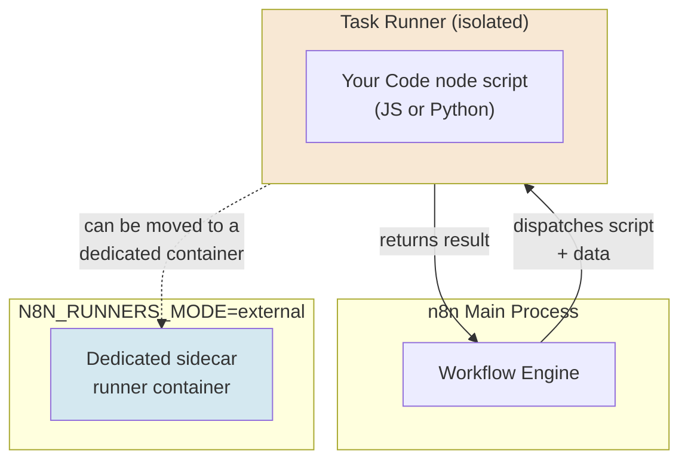
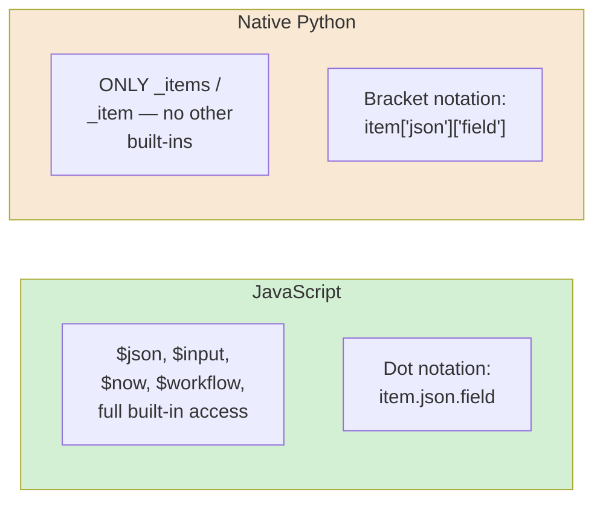
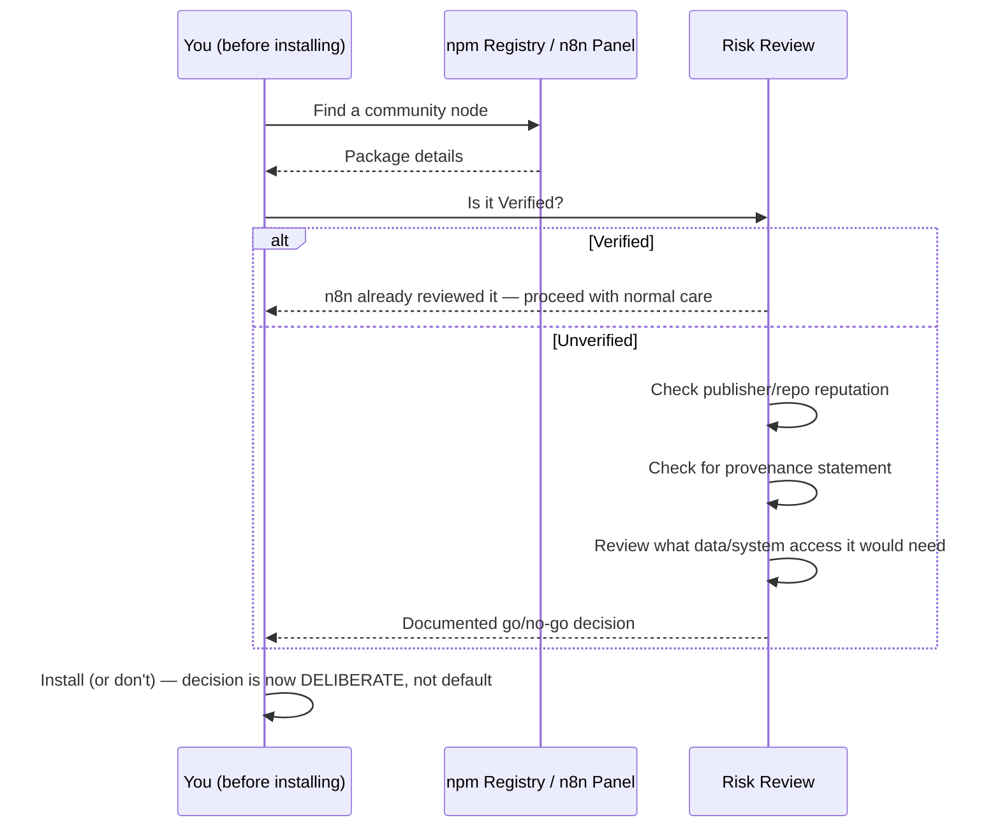
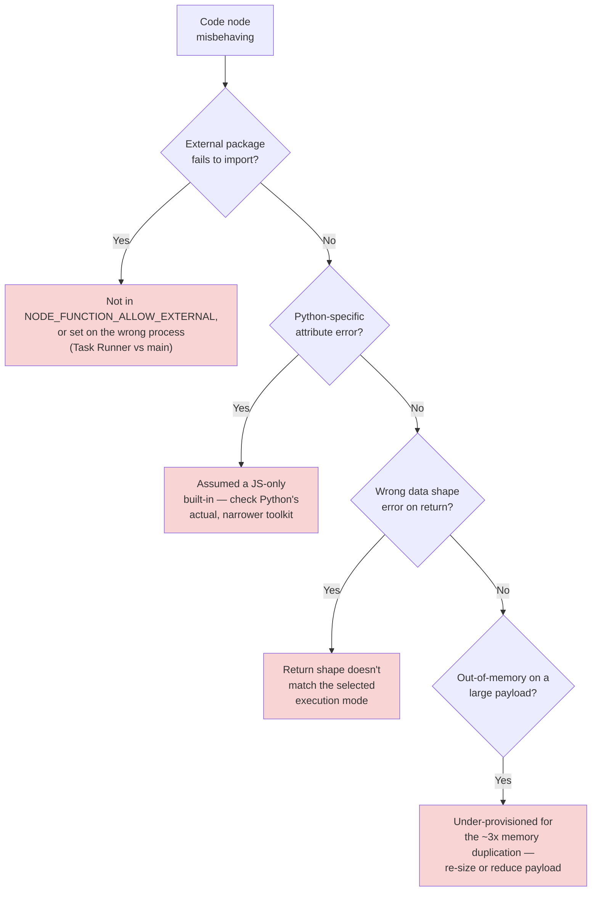
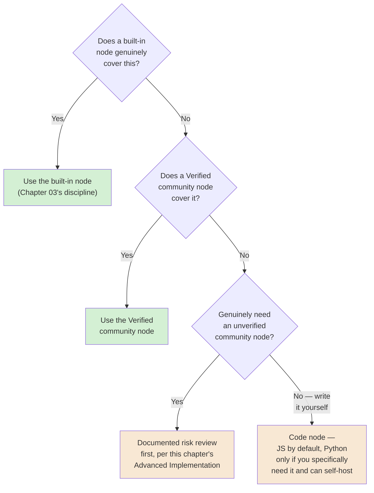

# Chapter 14 — Custom Code Nodes: JavaScript and Python

## Learning Objectives

By the end of this chapter, you will be able to:

- Choose correctly between **Run Once for All Items** and **Run Once for Each Item** modes, and return data in the shape each one actually expects.
- Explain why native Python in the Code node has significantly less built-in support than JavaScript, and write Python Code node scripts that account for that gap.
- Enable an external npm package for a self-hosted Code node using `NODE_FUNCTION_ALLOW_EXTERNAL`, and explain why this capability doesn't exist on n8n Cloud at all.
- Explain why n8n runs Code node scripts inside a **Task Runner** rather than the main process, and what that isolation actually buys you.
- Predict a Code node's real memory cost for a given payload size, using its confirmed in-memory duplication behavior.
- Evaluate a community node's risk before installing it, using n8n's own documented risk categories and the Verified Nodes program.
- Explain the current package-provenance requirement for community node publishing, and what specific problem it solves.
- Decide when a task genuinely needs the Code node, versus when reaching for it is a sign a built-in node (Chapter 03's own discipline) would have been the better choice.

## Prerequisites

- **Chapters completed:** Chapter 03 (items, expressions, the Code node's basic contract) is assumed directly. This chapter goes deep on the Code node itself and on community nodes generally, both introduced only briefly before now.
- **Tools installed:** A self-hosted n8n instance (Docker-based, per Chapter 15) is needed for this chapter's Python and external-package exercises — these specific capabilities are not available on n8n Cloud.

## Estimated Reading Time

65–80 minutes

## Estimated Hands-on Time

3 hours

---

## ⚡ Fast Read

> **Skim time: 5 minutes**

- **What it is:** A deep, production-grade look at n8n's Code node (both languages) and community nodes — the two places where n8n's platform boundary opens up to genuinely arbitrary, third-party, or hand-written code.
- **Why it matters:** Both of these are real, current, and currently the single biggest gap between "n8n did something I didn't expect" and "n8n did exactly what a no-code node would." Real code has real memory costs, real language-parity gaps, and — for community nodes specifically — a documented, real, and current supply-chain risk.
- **Key insight:** Python in the Code node is not a full second language with parity to JavaScript — it's a genuinely narrower capability, missing most of n8n's own built-in variables and methods, and self-hosted-only on top of that. Assuming otherwise is a common, avoidable mistake.
- **What you build:** A Code node exercised in both execution modes, a self-hosted external-package setup, and a real, documented risk review of a community node before installing it — following the exact discipline that would have caught a real, documented January 2026 supply-chain attack.
- **Jump to:** [Core Concepts](#core-concepts) | [First Code Node](#beginner-implementation) | [Best Practices](#best-practices) | [Mini Project](#mini-project)

---

## Why This Topic Exists

Every chapter so far has used the Code node sparingly and carefully, exactly per this course's own recurring discipline: reach for it when no-code nodes genuinely don't fit, not as a default. That discipline was correct, and this chapter doesn't reverse it — but it does mean this course has never fully explained what the Code node actually is, underneath: not a lightweight scripting box, but a real, sandboxed code-execution environment with its own memory model, its own language-parity quirks, and its own operational considerations at scale.

Community nodes deserve the same depth for a related but distinct reason: they're the platform's other major boundary into third-party code, and — per this chapter's own research — a real, current, well-documented, actively-exploited risk surface, not a hypothetical one. Chapter 04 already flagged the January 2026 supply-chain attack briefly, in passing, as evidence that credentials are a high-value target. This chapter is where that incident gets its full, proper treatment, because this is the chapter that actually teaches you how to evaluate a community node before installing it — the exact discipline that would have caught it.

## Real-World Analogy

Think about the difference between using a manufacturer's own, tested attachments on a piece of equipment, versus welding on a custom part yourself, versus buying a third-party attachment from an unfamiliar vendor.

The manufacturer's own attachments (n8n's built-in nodes) are tested, predictable, and safe within well-understood limits. Welding on a custom part yourself (the Code node) gives you real, unmatched flexibility — but you're now responsible for whether it's actually sound, whether it adds unexpected weight (memory cost) in the wrong place, and whether it was built correctly. Buying a third-party attachment from an unfamiliar vendor (an unverified community node) is the riskiest of the three: you don't know how it was built, you're trusting a stranger's workmanship, and — per this chapter's real, documented incident — a bad actor can deliberately disguise a malicious part to look like a legitimate one, counting on you not checking closely enough before bolting it on.

---

## Core Concepts

### Code Node Execution Modes

**Technical definition:** The Code node's two current modes — **Run Once for All Items** (default; the script runs a single time, receiving and expected to return the full item array) and **Run Once for Each Item** (the script runs once per input item, operating on one item at a time).

**Plain English:** Do I want to process the whole batch in one script run, or have my script run separately for every single item?

**Analogy:** Reviewing an entire stack of forms at once, making decisions across all of them together, versus reviewing them one at a time, in isolation from each other.

> Both modes expect the script to ultimately produce a valid items array — but "All Items" gives your code visibility across every item at once (useful for cross-item logic, like Chapter 05's batch validation), while "Each Item" runs your logic independently per item, which is often simpler to reason about but can't easily compare items to each other within the same run.

### JavaScript vs. Python Parity Gap

**Technical definition:** n8n's Code node supports JavaScript with full access to n8n's built-in variables and methods (`$json`, `$input`, `$now`, `$workflow`, and more — Chapter 03's own vocabulary) using standard dot notation. **Native Python support is confirmed current but genuinely narrower** — limited to `_items` (all-items mode) and `_item` (per-item mode) only, with no equivalent access to n8n's other built-in methods and variables, and requiring bracket notation (`item["json"]["field"]`) rather than dot notation.

**Plain English:** Python in the Code node isn't a full second language option with everything JavaScript has — it's a genuinely smaller toolkit.

**Analogy:** Two translators working for the same company — one with full access to the company's entire reference library, the other handed only a phrasebook. Both can do real work, but assuming they have equal resources will produce real, avoidable mistakes.

> This is a real, easy, common mistake this chapter treats as a Common Mistake in its own right: a builder who's comfortable with JavaScript Code nodes, switching to Python and assuming `$json`-equivalent conveniences exist, will hit a wall quickly. Native Python's real, current toolkit is genuinely smaller — plan for it, don't assume parity.

### External npm/pip Packages

**Technical definition:** Self-hosted-only capability letting a Code node import external libraries beyond n8n's built-in set — for JavaScript, confirmed current mechanism is the `NODE_FUNCTION_ALLOW_EXTERNAL` environment variable, listing specific allowed packages by name (e.g., `NODE_FUNCTION_ALLOW_EXTERNAL=axios,cheerio`); if running Task Runners (the current default), this variable needs to be set on the Task Runner's own environment, not just the main n8n process.

**Plain English:** Bringing in extra, non-built-in code libraries — only possible if you're running your own n8n instance, never on Cloud.

**Analogy:** A workshop that lets you bring in your own specialized tools, versus a rental space that only lets you use what's already provided.

### Task Runner

**Technical definition:** The current, default architecture for actually executing Code node scripts — a separate, isolated process from n8n's main process, confirmed enabled by default since n8n 2.0, with an **external mode** (`N8N_RUNNERS_MODE=external`) running a dedicated sidecar runner container per n8n process for further isolation.

**Plain English:** Code node scripts don't run directly inside n8n's own core process — they run in a separate, sandboxed process specifically so a bad or malicious script can't directly compromise the rest of the platform.

**Analogy:** A dedicated, separated workshop bay for anything involving welding or custom fabrication — physically isolated from the rest of the shop floor, so a mistake in that one bay doesn't endanger everything else.

### Memory Duplication

**Technical definition:** A confirmed, current, real behavior of the Code node — a script's payload is duplicated in memory, once before processing and again after, meaning a 100MB payload can temporarily consume roughly 300MB of memory during execution.

**Plain English:** A Code node's real memory cost is meaningfully higher than the payload size alone would suggest.

**Analogy:** Making a working photocopy of a document before editing it, and keeping both the original and the edited copy in hand until you're done — twice the paper in play, not once, for the same underlying content.

> This is a direct, concrete extension of Chapter 05's in-memory execution model — worth treating as a real planning number, not a rounding error, for any Code node processing large payloads.

### Community Node

**Technical definition:** A node published by someone other than n8n itself, installable via the nodes panel (Verified nodes only), the GUI from the npm registry, the command line, or environment variables — confirmed current: **unverified community nodes are unavailable on n8n Cloud and require self-hosting.**

**Plain English:** A node someone else built and published, not one of n8n's own.

**Analogy:** The third-party attachment from an unfamiliar vendor, from this chapter's opening analogy.

### Verified Community Node

**Technical definition:** A community node n8n itself has reviewed against defined data- and system-security requirements before awarding a **Verified badge** — the only category of community node currently installable directly from Cloud's node panel.

**Plain English:** A third-party node n8n has actually checked, not just anyone's unreviewed upload.

**Analogy:** The difference between a third-party part with a manufacturer-endorsed certification and one with no certification at all.

### Community Node Risk Categories

**Technical definition:** n8n's own documented risk taxonomy for unverified community nodes — **system security** (a community node has full access to the machine n8n runs on, and can do anything, including malicious actions), **data security** (a community node used in a workflow can access whatever sensitive data that workflow processes), and **stability** (breaking changes from the node's own maintainer can silently disable dependent workflows).

**Plain English:** Three specific, distinct things that can go wrong, not just a vague "it might be risky."

**Analogy:** A pre-installation checklist covering exactly the questions this chapter's opening analogy was gesturing at: can this part hurt the machine, can it see things it shouldn't, and can it just stop working reliably.

### Package Provenance

**Technical definition:** A current requirement (effective May 1, 2026) that all community nodes be published via a GitHub Action including a **provenance statement** — a cryptographically verifiable record of exactly which repository and commit actually built the published package.

**Plain English:** A tamper-evident receipt proving a package genuinely came from the specific, named source it claims to.

**Analogy:** A sealed, numbered certificate of authenticity for the third-party part, that anyone can independently verify — rather than just trusting the label on the box.

> This is a direct, current, real response to exactly the failure class behind this chapter's own Production Issue below — a typosquatted package pretending to be something legitimate. Provenance doesn't stop someone from publishing a maliciously-named package, but it does make it independently verifiable whether a package's actual build history matches what it claims to be.

---

## Architecture Diagrams

### Diagram 1 — Task Runner Isolation



### Diagram 2 — JavaScript vs. Python, Capability Comparison



## Flow Diagrams

### Diagram 3 — Community Node Risk Review, Before Installing



---

## Beginner Implementation

> **No-code-adjacent path.** Basic JavaScript comfort assumed, per this course's dual-track discipline for Code node sections specifically.

**Goal:** Compare both Code node execution modes directly on the same data.

1. **Manual Trigger** → **Set node** producing 4 sample items (simple records with a numeric field).
2. **Code node #1**, mode **Run Once for Each Item**:

```javascript
// Learning example — runs once per item, operating on ONE item at a time.
// $json here refers to the CURRENT item only.
return {
  json: {
    ...$json,
    doubled: $json.value * 2,
  },
};
```

3. **Code node #2** (on a parallel branch from the same Set node), mode **Run Once for All Items**:

```javascript
// Learning example — runs ONCE, receiving the full item array.
// Demonstrates cross-item logic the per-item mode can't do in one run:
// computing a value (the average) that depends on every item at once.
const items = $input.all();
const total = items.reduce((sum, item) => sum + item.json.value, 0);
const average = total / items.length;

return items.map((item) => ({
  json: {
    ...item.json,
    deviation_from_average: item.json.value - average,
  },
}));
```

4. Run both and compare: the per-item version can't compute anything requiring visibility across items in one pass; the all-items version can, because it explicitly receives everything at once.

**What you just built:** A direct, hands-on feel for exactly when each mode is actually necessary, not just a syntax choice.

---

## Intermediate Implementation

> **Self-hosted required.** External packages and native Python.

**Goal:** Enable and use an external npm package, and directly compare a Python Code node's narrower built-in access.

1. On your self-hosted instance, set `NODE_FUNCTION_ALLOW_EXTERNAL=axios` (or another package you need) — on the Task Runner's environment specifically if running Task Runners, per this chapter's Core Concepts.
2. Build a Code node using the now-allowed package:

```javascript
// Learning example — using an explicitly allow-listed external package.
// This ONLY works because axios was added to NODE_FUNCTION_ALLOW_EXTERNAL —
// an unlisted package will fail to import, by design.
const axios = require('axios');
const response = await axios.get('https://api.github.com/status');
return { json: { status: response.data } };
```

3. Build the same basic idea in a **Python (Native)** Code node, and notice directly what's different:

```python
# Learning example — Python Code node. Notice: NO $now, NO $workflow
# equivalent, and bracket notation instead of dot notation. This is
# the confirmed, current, genuinely narrower Python toolkit, not a bug.
for item in _items:
    item["json"]["doubled"] = item["json"]["value"] * 2

return _items
```

**What to notice:** The Python version has no equivalent way to reach for `$now`, `$workflow`, or any of JavaScript's other built-ins — if your task genuinely needs those, per this chapter's Decision Framework, JavaScript is very likely the correct choice, not a stylistic preference.

---

## Advanced Implementation

> **Engineering-depth path.** A documented community node risk review.

**Goal:** Perform a real, documented risk review before installing a community node — the exact discipline this chapter's Production Issue shows the cost of skipping.

1. Pick a real, publicly-listed community node (choose one relevant to a workflow you'd genuinely want, for this exercise).
2. Check whether it carries n8n's **Verified badge**. If yes, document that n8n has already reviewed it against its security requirements — install with normal care.
3. If unverified, walk through n8n's own three documented risk categories explicitly, in writing:

```text
// The actual review this chapter is teaching — write real answers,
// not placeholders:

SYSTEM SECURITY: What could this node do to the machine n8n runs on,
worst case, given it has full system access by default?

DATA SECURITY: What sensitive data will workflows using this node
process, and is this node positioned to see it?

STABILITY: Who maintains this node? How actively? What happens to
workflows depending on it if the maintainer stops updating it or ships
a breaking change?

PROVENANCE: Does this package (if published after May 1, 2026) include
a valid provenance statement matching its claimed source repository?
```

4. Document a real go/no-go decision based on your answers — not a default "install and see."

**The common mistake alongside the correct pattern:**

```text
WRONG: Install any community node that appears to do what you need,
based on its name and description alone.

RIGHT: Complete this chapter's documented risk review first, per n8n's
own risk categories — treat it as a required step, not optional caution.
```

**How to debug it when it breaks:** If an external npm package fails to import, confirm it's listed in `NODE_FUNCTION_ALLOW_EXTERNAL` **on the Task Runner's environment specifically**, not just the main n8n process's — a common, easy-to-miss configuration gap once Task Runners are in use. If a Python Code node throws an unexpected-attribute error, check whether you're assuming a JavaScript-only built-in exists in Python — it very likely doesn't.

**The production version, where it differs from the learning version:** A production deployment installing any community nodes at all typically restricts this capability to a small, named set of reviewed maintainers with the authority to approve new installs, rather than leaving `N8N_COMMUNITY_PACKAGES_ENABLED` open to any workflow builder — the same access-control discipline Chapter 18 covers for governance generally.

---

## Production Architecture

- **Memory duplication needs to be a real capacity-planning number**, not an afterthought — a Code node processing consistently large payloads should be budgeted at roughly 3x the payload size, per this chapter's confirmed current behavior, when sizing self-hosted infrastructure (Chapter 15).
- **Task Runner external mode is a real production hardening step**, isolating Code node execution into a dedicated sidecar container — worth adopting deliberately for any instance running untrusted or third-party code regularly, not just n8n's own vetted logic.
- **Community node installation should be a governed, reviewed capability in production**, not left open by default — `N8N_COMMUNITY_PACKAGES_ENABLED=false` is a real, current, legitimate hardening choice for any instance where the risk of an unreviewed install outweighs the convenience.

---

## Best Practices

1. **Choose Run Once for All Items only when your logic genuinely needs cross-item visibility** — default to Run Once for Each Item otherwise, for simpler, more predictable per-item reasoning.
2. **Never assume Python Code node parity with JavaScript** — check for the specific built-in you need before committing to Python for a given task.
3. **Budget Code node memory at roughly 3x payload size**, per this chapter's confirmed duplication behavior, when planning self-hosted capacity.
4. **Prefer Verified community nodes; document a real risk review for anything unverified**, per this chapter's Advanced Implementation.
5. **Restrict community node installation to a small, reviewed set of people in production**, not left open to every workflow builder.
6. **Reach for the Code node only when a built-in node genuinely doesn't fit** — Chapter 03's own discipline, restated for this chapter's deeper context.

---

## Security Considerations

- **This chapter's central security concern is real, current, and already documented as having caused real harm.** In January 2026, a documented supply-chain attack used **typosquatted n8n community node package names** — publishing malicious packages with names deliberately similar to popular, legitimate nodes, containing credential-harvesting code. This is not a hypothetical; it's the exact reason n8n's own documentation states plainly that unverified community nodes "have full access to the machine that n8n runs on, and can do anything, including malicious actions."
- **The May 2026 provenance requirement is a real, current mitigation, not a complete fix.** It makes a package's actual build source cryptographically verifiable — but a determined attacker can still register a legitimately-provenanced, deliberately similarly-named malicious package. Provenance closes one gap (tampering with an existing package's contents); it doesn't fully close typosquatting itself.
- **Disabling community nodes entirely (`N8N_COMMUNITY_PACKAGES_ENABLED=false`) is a legitimate, current hardening option**, worth genuinely considering for any instance where the operational need doesn't clearly outweigh this real, documented risk class.

## Cost Considerations

Self-hosted infrastructure needed to run Python or external-package Code node workloads is a real, direct cost item — since neither capability exists on Cloud, choosing to use them is implicitly also choosing the self-hosted infrastructure cost Chapter 01 and Chapter 15 cover. Memory duplication (this chapter's own confirmed behavior) directly affects self-hosted instance sizing — under-provisioning against the real, ~3x memory cost of a large-payload Code node is a common, avoidable cause of out-of-memory failures at exactly the volume where you can least afford unplanned downtime.

## Common Mistakes

**Mistake 1 — Assuming Python has JavaScript's built-in variables.**
```text
WRONG: Reaching for $now or $workflow inside a Python Code node.
RIGHT: Confirm Python's genuinely narrower toolkit (_items/_item only)
before choosing it for a task, per this chapter's Core Concepts.
```

**Mistake 2 — Returning the wrong shape for the selected execution mode.**
```text
WRONG: Run Once for All Items, but the script returns a single item
object instead of the full processed array.
RIGHT: Match the return shape to the mode — the full array for All
Items, a single item object for Each Item.
```

**Mistake 3 — Installing an unverified community node without review.**
```text
WRONG: Install based on the node's name/description matching what you
need, with no further check.
RIGHT: This chapter's documented risk review — Verified badge check,
system/data/stability review, provenance check — every time.
```

## Debugging Guide



| Symptom | Likely cause | Where to look |
|---|---|---|
| External package fails to import | Not allow-listed, or set on the wrong process | `NODE_FUNCTION_ALLOW_EXTERNAL` on the Task Runner, not just main n8n |
| Python attribute/method error | Assumed JavaScript-only built-in | Python's actual, confirmed narrower toolkit |
| Return-shape error | Mismatch between execution mode and return value | Run Once for All Items needs the full array; Each Item needs one item |
| Out-of-memory on large payloads | Under-provisioned for ~3x memory duplication | Self-hosted instance sizing |
| A workflow silently broke after a node update | Community node stability risk | The node's maintenance history and changelog |

## Performance Optimisation

> Illustrative Aperture Cloud measurements, not a published benchmark.

In an illustrative test, a Code node processing a 150MB payload peaked at roughly 430MB of actual memory use during execution — consistent with this chapter's confirmed ~3x duplication behavior, not a one-to-one relationship with payload size. Sizing self-hosted capacity against the raw payload size alone, without this multiplier, is a common, avoidable planning error.

---

## Technology Comparison

| Platform | Custom code support | Community/third-party extension risk |
|---|---|---|
| **n8n** | Code node, JS everywhere, Python + external packages self-hosted only | Documented Verified/unverified distinction, real 2026 supply-chain incident, provenance requirement |
| **Windmill** | Native multi-language scripting (Python/TypeScript/Go/SQL) as the platform's core model, not a bolt-on node | Different risk model — code-first from the start, not an escape hatch from a visual default |
| **Zapier / Make** | Code steps exist (Zapier's Code by Zapier, Make's JS module) but are more constrained/sandboxed by design | Less of a broad third-party extension ecosystem than n8n's community node model |

## Decision Framework — Code Node, Built-in Node, or Community Node?



---

## Real Client Scenario — Aperture Cloud's Near-Miss With a Typosquatted Node

Aperture Cloud's automation team went looking for a community node to integrate with a specific marketing platform, found a promising-looking package on the npm registry with a name almost identical to the platform's own official-sounding integration, and — before this chapter's discipline existed as a team standard — nearly installed it directly. A more careful second look, checking the publisher against the actual platform's known official channels and finding no Verified badge, no clear maintainer history, and (once the May 2026 requirement took effect) no valid provenance statement, was enough to catch it as suspicious before installation. This near-miss is exactly the shape of the real, documented January 2026 incident this chapter's Production Issue describes in full — the difference between a near-miss and an actual breach was one team member applying exactly the review discipline this chapter teaches.

---

### Production Issue: The Typosquatted Node That Harvested Credentials

**Symptoms**

**This is a real, documented, current incident, not an illustrative scenario.** In January 2026, security researchers and n8n's own community identified a supply-chain attack: malicious npm packages published under names deliberately similar to popular, legitimate n8n community node packages — designed specifically to blend in during a quick search or a rushed install.

**Root Cause**

The malicious packages contained credential-harvesting code, exploiting the exact risk n8n's own documentation states plainly: an installed community node has full access to the machine n8n runs on and to whatever data flows through workflows using it. A builder installing what looked like a legitimate integration, based on a plausible name and description alone, had no way to distinguish it from the real thing without actively checking publisher reputation, verification status, and (for packages published after the requirement took effect) provenance.

**How to Diagnose It**

Audit every installed community node against n8n's Verified badge status, cross-check each unverified package's publisher against the actual, known official source it claims to represent, and review each node's actual granted access (which credentials, which workflows) against what it plausibly needs for its stated purpose.

**How to Fix It**

```text
BEFORE: Community node installed based on name/description match alone,
no verification check, no publisher review.

AFTER: n8n's own documented mitigations, applied as standing practice:
prefer Verified nodes; for anything unverified, complete this chapter's
full risk review before installing; report anything suspicious to
security@n8n.io; and where the operational need doesn't clearly
outweigh the risk, disable community node installation entirely via
N8N_COMMUNITY_PACKAGES_ENABLED=false.
```

**How to Prevent It in Future**

Treat this chapter's Advanced Implementation risk-review process as a mandatory, standing gate before any unverified community node installation — not a one-time lesson learned from this specific incident, but a permanent team practice, precisely because typosquatting as an attack pattern doesn't go away once one instance of it is publicized; it recurs under new names.

---

## Exercises

1. **(20 min)** For three tasks you might automate, decide whether Run Once for All Items or Run Once for Each Item fits better, and why.
2. **(45 min)** Build the Beginner Implementation's side-by-side execution-mode comparison.
3. **(60 min)** On a self-hosted instance, enable an external npm package and use it in a real Code node.
4. **(45 min)** Build the same basic task in both JavaScript and native Python Code nodes, documenting every built-in JavaScript had that Python didn't.
5. **(30 min)** Perform this chapter's full documented risk review on a real, unverified community node of your choosing, and record your go/no-go decision.

## Quiz

**1. What's the difference between Run Once for All Items and Run Once for Each Item, in terms of what the script actually receives and must return?**
> All Items: the script runs once, receiving and expected to return the full item array (enabling cross-item logic). Each Item: the script runs once per item, receiving and returning a single item at a time.

**2. What specifically is missing from native Python's Code node toolkit compared to JavaScript's?**
> All of n8n's other built-in variables and methods ($now, $workflow, etc.) — Python natively supports only `_items` and `_item`, with bracket notation instead of dot notation.

**3. Why can't a Cloud-hosted n8n instance use external npm packages or Python library imports in the Code node?**
> Both capabilities are confirmed current as self-hosted-only — Cloud doesn't permit them.

**4. What's the confirmed current memory behavior of the Code node that makes payload size alone an unreliable capacity-planning number?**
> A script's payload is duplicated in memory, once before and once after processing — a 100MB payload can temporarily consume roughly 300MB.

**5. What are n8n's own three documented risk categories for unverified community nodes?**
> System security (full machine access), data security (access to whatever sensitive data flows through workflows using it), and stability (breaking changes disabling dependent workflows).

**6. What does a Verified community node badge actually mean?**
> n8n itself has reviewed the node against defined data- and system-security requirements before awarding the badge — it's the only category of community node installable directly from Cloud's node panel.

**7. What does the May 2026 package provenance requirement actually verify, and what doesn't it prevent?**
> It cryptographically verifies that a published package was genuinely built from a specific, claimed repository and commit. It doesn't prevent someone from registering a legitimately-provenanced package under a deliberately similar, typosquatted name.

**8. What real, documented incident from January 2026 does this chapter's Production Issue describe?**
> A supply-chain attack using typosquatted n8n community node package names, containing credential-harvesting code, designed to be installed by someone searching for a legitimate integration.

**9. What environment variable disables community node installation entirely, and when is that a legitimate choice?**
> `N8N_COMMUNITY_PACKAGES_ENABLED=false` — legitimate whenever the operational need for community nodes doesn't clearly outweigh their documented risk, per this chapter's Security Considerations.

**10. Why does choosing Python or external npm packages for a Code node implicitly also mean choosing self-hosted infrastructure cost?**
> Because neither capability exists on n8n Cloud at all — using them requires self-hosting, which carries its own real infrastructure cost (Chapter 01, Chapter 15), not just a feature toggle.

## Mini Project

**Aperture Cloud's Dual-Mode Data Processor (2–3 hours)**

- [ ] A Code node genuinely requiring Run Once for All Items (real cross-item logic), and a separate one genuinely requiring Run Once for Each Item, with a written note justifying each choice.
- [ ] A self-hosted external npm package enabled and used in a real Code node.
- [ ] A written comparison of the same basic logic implemented in JavaScript vs. native Python, documenting every capability gap you encountered.

## Production Project

**Aperture Cloud's Community Node Governance Policy (1–2 days)**

- [ ] A documented risk review (per this chapter's Advanced Implementation) for at least two real, unverified community nodes.
- [ ] A written community node governance policy (300–500 words) for Aperture Cloud: who's authorized to approve new installs, what the required review steps are, and under what conditions (if any) `N8N_COMMUNITY_PACKAGES_ENABLED=false` should be the default.
- [ ] A memory-capacity plan for a self-hosted instance running a specific, realistic Code node workload, using this chapter's confirmed ~3x duplication behavior.
- [ ] A written summary (in your own words) of the January 2026 typosquatting incident and the specific review step in your own governance policy that would have caught it.

## Key Takeaways

- Run Once for All Items and Run Once for Each Item are genuinely different execution models, not interchangeable syntax choices — match the mode to whether your logic needs cross-item visibility.
- Native Python in the Code node has real, confirmed, significantly less built-in support than JavaScript — plan for the gap, don't assume parity.
- External npm packages and Python are both self-hosted-only, meaning choosing them is implicitly choosing self-hosted infrastructure cost too.
- The Code node duplicates its payload in memory (~3x total), a real, confirmed number worth capacity-planning against, not an assumption.
- Community nodes carry three distinct, documented risk categories: system security, data security, and stability.
- The January 2026 typosquatting supply-chain attack is real, documented, and the exact reason this chapter's risk-review discipline exists — not a hypothetical caution.
- The May 2026 provenance requirement is a real, current mitigation, but doesn't fully solve typosquatting on its own.
- Disabling community nodes entirely is a legitimate, current, real hardening option for instances where the risk outweighs the operational need.

## Chapter Summary

| Concept | Key Takeaway |
|---|---|
| Execution Modes | All Items (cross-item logic) vs. Each Item (simpler, per-item) |
| JS vs. Python Parity | Python's built-in toolkit is genuinely, confirmedly narrower |
| External Packages | Self-hosted-only, via NODE_FUNCTION_ALLOW_EXTERNAL |
| Task Runner | Isolated execution — Code node scripts don't run in n8n's main process |
| Memory Duplication | ~3x real memory cost relative to payload size |
| Community Node Risk | System security, data security, stability — three distinct categories |
| Package Provenance | Cryptographic build verification, effective May 2026, not a full typosquatting fix |

## Resources

- [n8n Code node documentation](https://docs.n8n.io/integrations/builtin/core-nodes/n8n-nodes-base.code)
- [n8n Enable modules in Code node documentation](https://docs.n8n.io/hosting/configuration/configuration-examples/modules-in-code-node/)
- [n8n Community node risks documentation](https://docs.n8n.io/integrations/community-nodes/risks)
- [n8n Verified community nodes installation documentation](https://docs.n8n.io/integrations/community-nodes/installation/verified-install/)

## Glossary Terms Introduced

| Term | One-line definition |
|---|---|
| Code Node Execution Modes | Run Once for All Items vs. Run Once for Each Item |
| Task Runner | The isolated process actually executing Code node scripts |
| Memory Duplication | The Code node's confirmed ~3x real memory cost relative to payload |
| Community Node | A node published by someone other than n8n itself |
| Verified Community Node | A community node n8n has reviewed and badged |
| Community Node Risk Categories | System security, data security, stability |
| Package Provenance | Cryptographic verification of a package's actual build source |

## See Also

| Topic | Related Chapter | Why |
|---|---|---|
| The n8n Data Model and Expressions | Chapter 03 | The Code node's basic contract, extended here to full production depth |
| Data Transformation and Validation at Scale | Chapter 05 | The in-memory execution model this chapter's memory duplication behavior directly extends |
| Connecting to the World | Chapter 04 | The January 2026 supply-chain incident, first flagged there, covered in full here |
| Deployment Architecture | Chapter 15 | Self-hosted infrastructure sizing, informed by this chapter's memory-duplication numbers |
| Governance and Compliance | Chapter 18 | Community node installation governance at full production-policy depth |
| Securing n8n in Production | Chapter 19 | The full current n8n security landscape, including this chapter's supply-chain risk class |

## Preparation for Next Chapter

**Technical checklist:**
- [ ] Built and compared both Code node execution modes.
- [ ] Enabled and used an external npm package on a self-hosted instance.
- [ ] Completed a documented community node risk review.

**Conceptual check:**
- Why isn't Python in the Code node a full-parity alternative to JavaScript?
- What specifically does package provenance verify, and what does it not prevent?

**Optional challenge:** Before Chapter 15, think about everything this course has built so far that currently runs on whatever n8n setup you've been using to follow along. Chapter 15 is about turning that into a real, deployed, production-grade instance — starting with the decision this chapter's self-hosted-only features already forced: self-hosted or Cloud, and why.

---

> **Currency Note:** This chapter's n8n-specific facts (Code node execution modes, Python's confirmed narrower built-in toolkit, Task Runner architecture, the ~3x memory duplication behavior, community node risk categories, and the May 2026 provenance requirement) were verified directly against `docs.n8n.io` in July 2026, including a real, current, documented January 2026 supply-chain incident. Always confirm current specifics before making a production decision based on this chapter.
