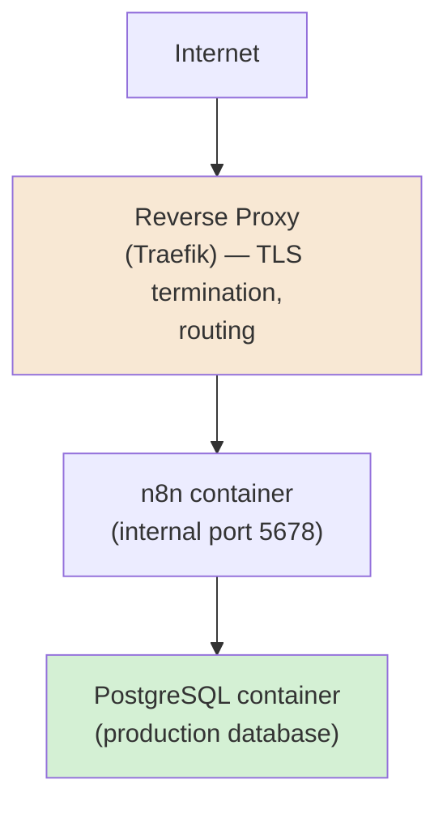
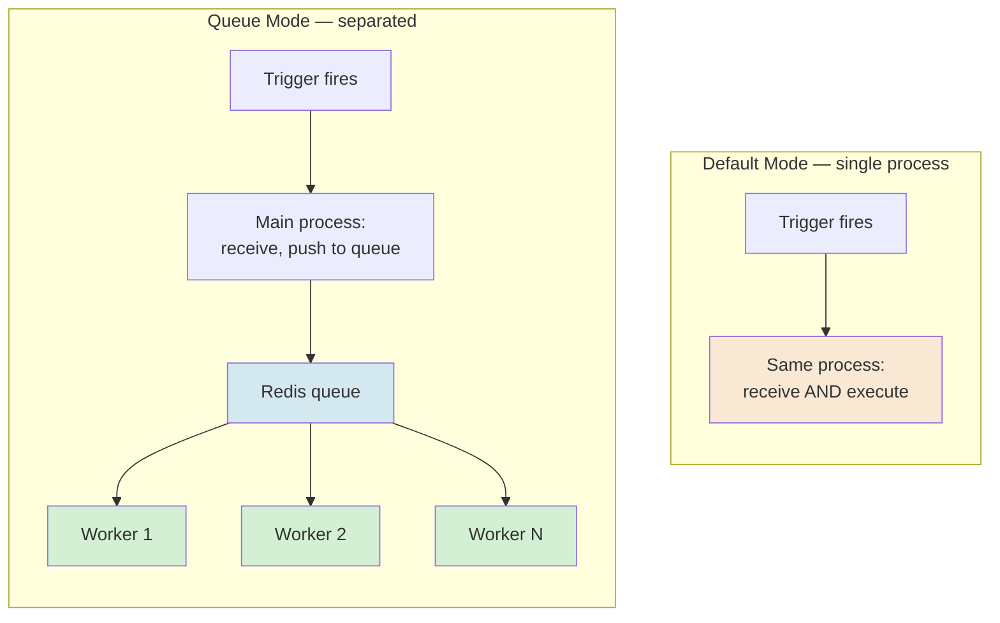
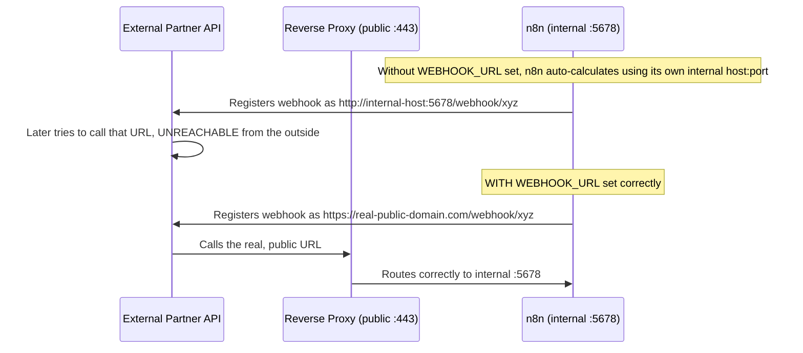
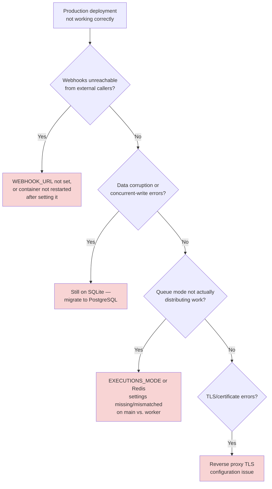
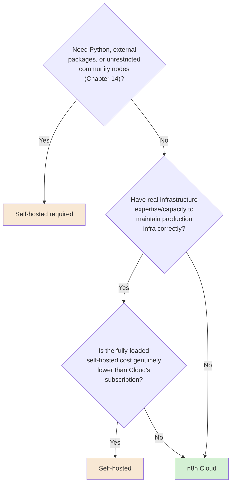

# Chapter 15 — Deployment Architecture

## Learning Objectives

By the end of this chapter, you will be able to:

- Explain n8n's own recommended Docker Compose architecture — n8n paired with a reverse proxy — and why the reverse proxy is part of the recommended setup, not an afterthought.
- Choose **PostgreSQL** over the default **SQLite** for any production deployment, and explain the specific technical reason SQLite is unsafe under concurrent access.
- Configure **WEBHOOK_URL** correctly behind a reverse proxy, and explain the specific, common, real failure mode of relying on n8n's auto-calculated URL instead.
- Distinguish **default (single-process) mode** from **queue mode**, and cite n8n's own real, measured throughput difference between them.
- Configure **`EXECUTIONS_MODE=queue`** correctly on both the main process and every worker — a requirement that's easy to half-do.
- Apply Chapter 08's Git-based environments to a real dev → staging → production deployment pipeline.
- Choose between n8n Cloud and self-hosted for a given team, using this course's recurring engineer-vs-business-user heuristic plus the concrete self-hosted-only capabilities Chapter 14 already established.
- Diagnose a real, common production failure — a webhook URL misconfiguration silently breaking every external integration — correctly and quickly.

## Prerequisites

- **Chapters completed:** Chapter 08 (environments, Git-based source control) and Chapter 14 (self-hosted-only capabilities) — this chapter builds the actual deployment those chapters assumed existed.
- **Tools installed:** Docker and Docker Compose, for this chapter's hands-on sections. Basic familiarity with the command line is assumed for the Intermediate Implementation onward — this chapter's Beginner Implementation stays accessible without it, per this course's dual-track discipline.

## Estimated Reading Time

70–85 minutes

## Estimated Hands-on Time

3.5 hours

---

## ⚡ Fast Read

> **Skim time: 5 minutes**

- **What it is:** How to actually run n8n in production — Docker Compose, a reverse proxy, a real production database, and (for real scale) queue mode's separated main-process-and-worker architecture.
- **Why it matters:** Every workflow in this course so far has quietly assumed "an n8n instance exists." This chapter is where that assumption becomes a real, deployed, production-grade instance — and where a whole category of real, confirmed, common misconfigurations live, waiting to silently break things.
- **Key insight:** The single most common production deployment mistake in n8n's own ecosystem isn't exotic — it's forgetting to set `WEBHOOK_URL` behind a reverse proxy, which bakes an unreachable internal port into every webhook registered with an external service, silently, with no error anywhere obvious.
- **What you build:** A working Docker Compose deployment with a production database, a correctly-configured reverse proxy (deliberately broken first, so you feel the failure), and queue mode with a real worker, correctly configured on both sides.
- **Jump to:** [Core Concepts](#core-concepts) | [First Deployment](#beginner-implementation) | [Best Practices](#best-practices) | [Mini Project](#mini-project)

---

## Why This Topic Exists

This course has used an n8n instance in every single chapter without ever asking how that instance actually got there, safely, in a form other people could depend on. That's a reasonable simplification for learning the platform — it stops being reasonable the moment a workflow needs to run reliably for real users, not just for you, in an editor, while you watch. This chapter is where "an n8n instance" becomes a real, deployed, production-grade piece of infrastructure.

The reason this deserves real depth, not just a quick "here's the Docker command": n8n's own default configuration is deliberately optimized for a five-minute local trial, not for production — the default database (SQLite) isn't safe for concurrent access, the default execution mode doesn't scale past a single process, and the default webhook URL calculation silently breaks the moment a reverse proxy sits in front of the instance. None of these are bugs. They're sensible defaults for trying n8n out, and genuinely wrong defaults for running it in production — and the gap between the two is exactly what this chapter closes.

## Real-World Analogy

Think about the difference between a food truck's kitchen and a real restaurant's kitchen.

A food truck (n8n's out-of-the-box defaults) works because everything's small, close together, and one person can see and touch every part of the operation at once. It's genuinely a working kitchen — just not one built to serve five hundred covers a night.

A real restaurant needs a few specific, deliberate upgrades before it can do that: a proper walk-in (a real production database, not a small fridge under the counter), a host stand actually routing customers to the right table instead of everyone just walking in the back door (a reverse proxy, actually routing traffic correctly instead of exposing the kitchen directly), and — once volume is real — more than one line cook working in parallel instead of one person doing everything sequentially (queue mode's workers). None of these upgrades change what the kitchen actually cooks. They change whether it can reliably serve real volume, safely, without someone in the back scrambling.

---

## Core Concepts

### Docker Compose (n8n's Recommended Path)

**Technical definition:** n8n's own confirmed, current recommended self-hosting method — a multi-container setup (n8n itself, paired with a reverse proxy such as Traefik) defined in a single `docker-compose.yml` file, versus bare-metal or manual Docker container management.

**Plain English:** The standard, official recipe for running your own n8n instance, with the pieces that go together already defined for you.

**Analogy:** A restaurant's actual kitchen build-out plan, versus improvising equipment placement from scratch.

### Reverse Proxy / TLS Termination

**Technical definition:** A component (n8n's own current example uses Traefik) sitting in front of n8n, handling TLS/SSL certificate management and routing incoming traffic to the actual n8n process running internally on its own port.

**Plain English:** The host stand — the thing that actually greets incoming traffic at the public-facing door and routes it correctly, instead of every request walking straight into the kitchen.

**Analogy:** Restated directly from this chapter's opening analogy — the host stand, not the kitchen itself.

> This is confirmed, current, non-optional guidance for production, not a nice-to-have: n8n's own documentation states plainly that a production deployment should run behind a reverse proxy with SSL/TLS enabled for all traffic — the same "never expose raw, unencrypted traffic" discipline this course has applied since Chapter 04's credentials coverage.

### Production Database

**Technical definition:** n8n's confirmed, current guidance — **SQLite** (the default, zero-configuration option) is explicitly documented as unsafe for production because **it does not support concurrent writes from multiple processes and will corrupt data** if you try; **PostgreSQL** is the confirmed, recommended external database for any real production deployment.

**Plain English:** The lightweight database n8n ships with by default is for trying things out — a real deployment needs a real database built to handle more than one thing writing to it at once.

**Analogy:** The small fridge under the counter versus a real walk-in — the small fridge works fine for one person's use, and breaks down the moment more than one person needs to use it at the same time.

> This isn't a performance preference — it's a **correctness** guarantee. SQLite's concurrent-write limitation means a production instance genuinely risks **data corruption**, not just slowness, if left on the default — a categorically more serious failure mode than "it's a bit slow."

### WEBHOOK_URL

**Technical definition:** An environment variable that, when set, **overrides** n8n's own auto-calculated webhook URL (normally built from `N8N_PROTOCOL`, `N8N_HOST`, and `N8N_PORT`) — confirmed current, essential configuration whenever n8n runs behind a reverse proxy, because the auto-calculated URL will otherwise incorrectly include n8n's internal port (typically `5678`), which no external caller can actually reach.

**Plain English:** The setting that tells n8n "here's the real, public address the outside world should actually use to reach you" — as opposed to guessing, incorrectly, based on its own internal configuration.

**Analogy:** A business explicitly publishing its real, public street address, instead of accidentally handing out the loading dock's internal extension number to customers who have no way to dial it.

> This is confirmed, current, and — per multiple independent sources — **the single most common real misconfiguration** in self-hosted n8n deployments behind a reverse proxy: setting `N8N_HOST` but forgetting `WEBHOOK_URL`, leaving `:5678` baked into every webhook URL n8n displays and registers with external services. This chapter's own Production Issue is built entirely around this exact, real, common mistake. The companion setting **`N8N_PROXY_HOPS`** (typically `1` for a single reverse proxy) tells n8n how many proxy layers sit in front of it, which affects how it interprets incoming request headers correctly.

### Default Mode vs. Queue Mode

**Technical definition:** n8n's two current execution architectures. **Default mode** runs everything — receiving triggers and executing workflows — in a single process. **Queue mode** (`EXECUTIONS_MODE=queue`) separates these concerns: the main process receives triggers and pushes execution jobs onto a Redis-backed queue, and one or more separate **worker** processes pull jobs from that queue and actually execute them.

**Plain English:** One person doing everything, in sequence, versus one person taking orders and a separate kitchen staff, working in parallel, actually cooking them.

**Analogy:** This chapter's own restaurant analogy, restated precisely — the host taking orders (main process) versus the line cooks actually preparing them, in parallel, as capacity allows (workers).

> Confirmed, current, real, citable performance difference from n8n's own benchmarks: queue mode delivers roughly **162 requests/second versus 23 requests/second** in default mode under the same test conditions — a real, roughly 7x throughput difference, with a **0% failure rate** in queue mode's benchmarked results, versus real failures under default mode at the same load. This is Chapter 06's own **competing consumers** pattern, concretely, at the platform's own infrastructure layer.

### Main Process vs. Worker

**Technical definition:** In queue mode, the **main process** handles triggers (webhooks, schedules) and the editor UI, generating execution jobs without running them; **workers** are separate n8n instances that pull jobs from the Redis queue and actually execute the workflow logic, reporting status back once complete.

**Plain English:** The distinction this chapter's queue-mode definition already drew — the one taking orders, and the ones actually cooking.

**Analogy:** Restated directly — the host stand versus the kitchen staff.

> Critical, confirmed, current configuration detail: **`EXECUTIONS_MODE=queue` must be set on the main process AND every worker** — setting it only on one side is a real, easy, incomplete configuration that won't work correctly.

### Environments (Chapter 08 Callback)

**Technical definition:** Chapter 08's own concept, applied here concretely — one n8n instance (with its own database, its own credentials) plus one Git branch, representing one stage (development, staging, production) in a real deployment pipeline.

**Plain English:** Genuinely separate, independently-deployed copies of your n8n setup, one per stage of readiness.

**Analogy:** A restaurant's test kitchen versus its actual dining room — recipes get proven in one before they're ever served in the other.

### Self-Hosted vs. Cloud Decision

**Technical definition:** The concrete, recurring decision this chapter finally has enough evidence to make well: n8n Cloud (managed, no infrastructure of your own) versus self-hosted (full control, real infrastructure responsibility, and — per Chapter 14 — the only path to Python Code nodes, external npm packages, and unrestricted community node installation).

**Plain English:** Someone else runs the kitchen for you, versus you build and run your own.

**Analogy:** Renting a fully-equipped commercial kitchen by the hour versus building and owning your own restaurant — different tradeoffs of control, cost, and responsibility, not a strictly better-or-worse choice.

---

## Architecture Diagrams

### Diagram 1 — n8n's Recommended Docker Compose Architecture



### Diagram 2 — Default Mode vs. Queue Mode



## Flow Diagrams

### Diagram 3 — Where WEBHOOK_URL Actually Matters



---

## Beginner Implementation

> **Accessible path.** Explained in plain terms; basic Docker familiarity helps but deep expertise isn't assumed.

**Goal:** A first, correct, production-shaped Docker Compose deployment — Aperture Cloud's "First Real Instance."

1. A `docker-compose.yml` file defining two services: `n8n` (the application itself) and `postgres` (the production database, per this chapter's Core Concepts — not SQLite).
2. The `n8n` service's environment section sets `DB_TYPE=postgresdb` and the corresponding connection details, pointing at the `postgres` service.
3. Run `docker compose up -d`, and confirm n8n starts, connects to Postgres (check the container logs for a successful database connection), and the editor UI is reachable locally.
4. Build one simple workflow and confirm it saves and runs correctly — confirming the database is genuinely being used, not silently falling back to anything else.

**What you just built:** A real, if not yet internet-facing, production-shaped deployment — the correct database choice from the very first step, not retrofitted later.

---

## Intermediate Implementation

> **Adds a reverse proxy, and deliberately breaks WEBHOOK_URL to feel the real failure.**

**Goal:** Put the Beginner Implementation behind a real reverse proxy, correctly.

1. Add a `traefik` service to your Docker Compose file, configured to route public traffic to the `n8n` service and handle TLS.
2. **Deliberately skip setting `WEBHOOK_URL` for now.** Create a workflow with a Webhook Trigger, activate it, and inspect the production webhook URL n8n displays — confirm it shows an internal address/port your reverse proxy's public domain can't actually reach externally, reproducing Diagram 3's failure case directly.
3. Now set `WEBHOOK_URL` explicitly to your real, public, reverse-proxy-fronted domain (e.g., `https://your-real-domain.com/`), and `N8N_PROXY_HOPS=1`. Restart, re-check the same workflow's webhook URL, and confirm it now shows the correct, real, externally-reachable address.
4. Test it for real: call the webhook from outside your local network (or simulate it) and confirm it correctly reaches n8n through the proxy.

**What to notice:** You just reproduced, and fixed, this chapter's own confirmed "single most common" real production misconfiguration — not a hypothetical, a documented, recurring, real mistake.

---

## Advanced Implementation

> **Engineering-depth path.** Queue mode, correctly configured on both sides.

**Goal:** Add queue mode to your deployment, with a real, separately-scaled worker.

1. Add a `redis` service to your Docker Compose file.
2. On the **`n8n`** (main) service, set `EXECUTIONS_MODE=queue`, `QUEUE_BULL_REDIS_HOST=redis` (the Docker service name), and `QUEUE_BULL_REDIS_PORT=6379`.
3. Add a **separate `n8n-worker`** service — the same n8n image, but started with a worker-specific command — with the **exact same** `EXECUTIONS_MODE=queue` and Redis settings as the main process.
4. Run a workflow and confirm, via each container's logs, that the main process received the trigger and the **worker** actually executed it — not the main process itself.
5. Scale to two workers (`docker compose up -d --scale n8n-worker=2`) and run several executions in quick succession, confirming (via logs) that both workers are genuinely picking up separate jobs — Chapter 06's competing-consumers pattern, running for real.

**The common mistake alongside the correct pattern:**

```text
WRONG: EXECUTIONS_MODE=queue set on the main process only, forgetting
the worker — queue mode doesn't function correctly with only one side
configured.

RIGHT: The exact same EXECUTIONS_MODE and Redis connection settings on
BOTH the main process and every worker, per this chapter's Core Concepts.
```

**How to debug it when it breaks:** If webhook URLs still show an internal address after setting `WEBHOOK_URL`, confirm the container was actually **restarted** after the environment variable change — a common, easy miss. If queue mode seems to not actually distribute work, check both the main process's and the worker's logs for `EXECUTIONS_MODE` and Redis connection confirmation — a worker that can't reach Redis will simply never pick up jobs, often without an obviously loud error.

**The production version, where it differs from the learning version:** The learning version runs one worker on the same machine as everything else. A real production deployment typically runs workers on separate infrastructure entirely, scaled independently based on actual load — the direct subject of Chapter 16.

---

## Production Architecture

- **Environments (Chapter 08) map directly onto separate Docker Compose deployments**, each with its own database, its own credentials, and its own Git branch — a real dev → staging → production pipeline is, concretely, three (or more) of this chapter's deployments, connected by Chapter 08's own workflow-diff-and-promote discipline.
- **TLS termination at the reverse proxy is non-negotiable for any production deployment handling real credentials or webhook traffic** — directly reinforcing Chapter 04's own "never expose raw, unencrypted traffic" discipline, now at the infrastructure layer.
- **SQLite's concurrent-write limitation makes it fundamentally incompatible with queue mode** — queue mode's whole premise (multiple processes accessing the same execution data) requires a database built for concurrent access, making PostgreSQL not just recommended but structurally required the moment queue mode is in play.

---

## Best Practices

1. **Never use SQLite for a production deployment** — PostgreSQL from the start, even before you think you need queue mode's scale.
2. **Always set `WEBHOOK_URL` explicitly when running behind a reverse proxy** — never rely on auto-calculation, per this chapter's single most common real misconfiguration.
3. **Set `EXECUTIONS_MODE=queue` (and matching Redis settings) identically on the main process and every worker** — a partial configuration doesn't degrade gracefully, it simply doesn't work correctly.
4. **Always run production traffic behind a reverse proxy with TLS**, never expose n8n's raw internal port directly to the internet.
5. **Model your environments (Chapter 08) as genuinely separate deployments**, not shared infrastructure with a naming convention standing in for real isolation.
6. **Restart containers after any environment variable change** — a surprisingly common, easy-to-forget step that makes a correct configuration look like it isn't working.

---

## Security Considerations

- **An exposed internal port is a real, direct attack surface**, the same category of risk Chapter 01 and Chapter 12 both flagged for unauthenticated endpoints — a reverse proxy correctly configured is what stands between n8n's internal port and the open internet.
- **Redis, in queue mode, is a real, sensitive piece of infrastructure**, holding execution job data in transit — it deserves the same network-isolation discipline (not exposed to the public internet directly) as the database itself.
- **Environment variables containing secrets (database credentials, the encryption key from Chapter 04) should never be committed to a Docker Compose file checked into version control** — use `.env` files excluded from Git, or a real secrets manager, consistent with Chapter 04's Credentials Manager discipline applied at the infrastructure level.

## Cost Considerations

This chapter makes the self-hosted-vs-Cloud cost tradeoff concrete for the first time in this course: self-hosting means paying for your own infrastructure (compute for n8n itself, a managed or self-run PostgreSQL instance, Redis if using queue mode, and the operational time to maintain all of it) in exchange for the self-hosted-only capabilities Chapter 14 established (Python, external packages, unrestricted community nodes) and full infrastructure control. n8n Cloud trades that control and those capabilities for a predictable subscription cost (Chapter 01) and zero infrastructure operational burden. Neither is universally cheaper — a small team without dedicated infrastructure expertise often finds Cloud's subscription cost is genuinely lower than the real, fully-loaded cost of correctly running and maintaining production-grade self-hosted infrastructure themselves.

## Common Mistakes

**Mistake 1 — Running production on SQLite.**
```text
WRONG: Default configuration left unchanged, SQLite still in use once
real, concurrent production traffic arrives.
RIGHT: PostgreSQL from the very first production deployment, per this
chapter's Beginner Implementation.
```

**Mistake 2 — Forgetting WEBHOOK_URL behind a reverse proxy.**
```text
WRONG: N8N_HOST set, WEBHOOK_URL left unset — webhooks silently register
with an unreachable internal address.
RIGHT: WEBHOOK_URL explicitly set to the real, public domain, per this
chapter's Intermediate Implementation and Production Issue.
```

**Mistake 3 — Partial queue mode configuration.**
```text
WRONG: EXECUTIONS_MODE=queue set on the main process, forgotten on the
worker (or vice versa).
RIGHT: Identical configuration on both sides, verified via each
container's own logs.
```

## Debugging Guide



| Symptom | Likely cause | Where to look |
|---|---|---|
| External services can't reach webhooks | WEBHOOK_URL not set behind a reverse proxy | The workflow's displayed webhook URL — check for an internal port/address |
| Data corruption under real load | Still using SQLite in production | Database configuration (DB_TYPE) |
| Queue mode seems inactive, everything runs on main | EXECUTIONS_MODE/Redis config missing or mismatched | Both main process's and worker's own logs and environment |
| TLS/certificate errors | Reverse proxy misconfiguration | Traefik (or equivalent) configuration and certificate status |
| Config change seems to have no effect | Container not restarted after the change | Container restart status |

## Performance Optimisation

> The 7x throughput figure is a **real, confirmed n8n benchmark**, not an illustrative estimate — cited directly per this chapter's Core Concepts.

Confirmed current n8n benchmark: queue mode delivers roughly 162 requests/second versus 23 requests/second in default mode, under the same test conditions, with a 0% failure rate in queue mode versus real failures under default mode at equivalent load. The lesson, stated plainly: **default mode is not a smaller version of queue mode — it's a structurally different architecture that simply cannot absorb real concurrent load the way queue mode can.**

---

## Technology Comparison

| Platform | Self-hosting option | Deployment model |
|---|---|---|
| **n8n** | Full self-hosting, Docker Compose recommended, queue mode for scale | Both Cloud (managed) and self-hosted available |
| **Zapier / Make** | No self-hosting option at all | Pure SaaS only |
| **Windmill / Temporal / Apache Airflow** | Self-hostable, broadly similar Docker/Kubernetes-based deployment models | Similar managed-vs-self-hosted tradeoff space to n8n |

The distinction worth being honest about: n8n offering genuine self-hosting at all is a real differentiator against Zapier and Make specifically — this chapter's entire subject simply doesn't exist as a choice on those platforms.

## Decision Framework — Self-Hosted or Cloud?



---

## Real Client Scenario — Aperture Cloud's Migration to Self-Hosted

Aperture Cloud's engineering team, needing Python Code nodes (Chapter 14) for a data-processing workflow, migrated from n8n Cloud to a self-hosted Docker Compose deployment. This is squarely a low-stakes, internal, reversible scenario from an autonomy standpoint (an infrastructure migration, not a consequential automated action) — but it's exactly the kind of real, concrete decision this chapter's Decision Framework exists to support. The team followed this chapter's full stack — Postgres from day one, a correctly-configured reverse proxy with WEBHOOK_URL set explicitly, and queue mode from the start given their existing webhook-heavy workload — treating this chapter's Best Practices as a pre-launch checklist, not lessons learned the hard way.

---

### Production Issue: The Webhooks That Pointed Nowhere

**Symptoms**

Aperture Cloud's newly self-hosted n8n instance, freshly deployed behind a reverse proxy, appeared to work perfectly in the editor — manual test runs succeeded, the UI was fully responsive. But **every webhook-triggered workflow silently stopped receiving real, external events** the moment the instance moved from local testing to its actual public deployment.

**Root Cause**

`N8N_HOST` had been set to the instance's real public domain, but **`WEBHOOK_URL` had not** — leaving n8n to auto-calculate webhook URLs using its own internally-visible host and port (`:5678`), exactly per this chapter's Core Concepts. Every webhook n8n displayed, and every webhook URL registered with Aperture Cloud's external partner services, pointed at an address that was only ever reachable from inside the Docker network — never from the actual internet, where every real partner service's calls were originating.

**How to Diagnose It**

Open any active Webhook Trigger node and inspect its displayed production URL directly — an internal-looking host or an explicit `:5678` port in a URL meant to be called from the public internet is the direct, unambiguous signature of this exact misconfiguration.

**How to Fix It**

```text
BEFORE: N8N_HOST=aperturecloud.example.com
        (WEBHOOK_URL not set — auto-calculation kicks in,
        producing an unreachable internal URL)

AFTER:  N8N_HOST=aperturecloud.example.com
        WEBHOOK_URL=https://aperturecloud.example.com/
        N8N_PROXY_HOPS=1
```

Every previously-registered webhook with external partners then needed to be **re-registered** using the newly-correct URL — fixing the environment variable alone didn't retroactively correct URLs already handed to third parties before the fix.

**How to Prevent It in Future**

Treat "does the Webhook Trigger's displayed production URL match the real, actual public domain — not an internal host or port" as a required, explicit check in any reverse-proxy deployment's pre-launch checklist, per this chapter's Intermediate Implementation — verified by actually calling the webhook from a genuinely external network, not just trusting the configuration looks correct on paper.

---

## Exercises

1. **(20 min)** List three consequences you'd expect from running production traffic on SQLite, beyond "it might be slow."
2. **(45 min)** Build the Beginner Implementation's Postgres-backed Docker Compose deployment.
3. **(60 min)** Build the Intermediate Implementation, deliberately reproducing and then fixing the WEBHOOK_URL misconfiguration.
4. **(90 min)** Build the full Advanced Implementation — queue mode with a real, verified worker, scaled to two instances.
5. **(30 min)** Write a pre-launch checklist (5+ items) for any new self-hosted n8n deployment, drawing directly from this chapter's Best Practices.

## Quiz

**1. Why is SQLite specifically unsafe for a production n8n deployment, beyond general performance concerns?**
> It doesn't support concurrent writes from multiple processes and will corrupt data under concurrent access — a correctness failure, not just a performance one.

**2. What does WEBHOOK_URL override, and why is it essential behind a reverse proxy?**
> It overrides n8n's auto-calculated webhook URL (normally built from N8N_PROTOCOL/HOST/PORT). Behind a reverse proxy, the auto-calculated URL incorrectly includes n8n's internal port, which external callers can't reach — WEBHOOK_URL must be set explicitly to the real, public address.

**3. What's the confirmed, real throughput difference between default mode and queue mode, per n8n's own benchmarks?**
> Roughly 162 requests/second in queue mode versus 23 requests/second in default mode, with a 0% failure rate in queue mode versus real failures in default mode at the same load.

**4. What's the single most common real misconfiguration this chapter identifies for reverse-proxy deployments?**
> Setting N8N_HOST but forgetting WEBHOOK_URL, leaving an unreachable internal port baked into every registered webhook URL.

**5. Why must EXECUTIONS_MODE=queue and matching Redis settings be set on BOTH the main process and every worker?**
> Because queue mode is a coordinated architecture — a partial configuration (set on only one side) doesn't degrade gracefully, it simply fails to distribute work correctly.

**6. What real, structural reason makes PostgreSQL effectively required (not just recommended) once queue mode is in use?**
> Queue mode's premise — multiple processes accessing the same execution data concurrently — requires a database built for concurrent access, which SQLite's single-writer limitation structurally cannot support.

**7. What's the role of N8N_PROXY_HOPS, and what does a typical single-reverse-proxy setup set it to?**
> It tells n8n how many reverse proxy layers sit in front of it, affecting how it interprets incoming request headers correctly — typically set to 1 for a single reverse proxy.

**8. Why does fixing a WEBHOOK_URL misconfiguration after the fact require more than just changing the environment variable?**
> Because previously-registered webhooks with external partners were already handed the old, incorrect URL — they need to be re-registered using the corrected URL; the fix doesn't retroactively correct URLs already shared externally.

**9. According to this chapter's Decision Framework, what specific Chapter 14 capabilities make self-hosting a REQUIRED choice, not just a preference?**
> Python Code node support, external npm/pip packages, and unrestricted (non-Verified) community node installation — none of these exist on n8n Cloud at all.

**10. Why might n8n Cloud be genuinely cheaper than self-hosting for a small team, despite self-hosting having no license fee?**
> Because the fully-loaded cost of self-hosting includes real infrastructure and the operational time to correctly maintain it — a cost that can exceed Cloud's predictable subscription price for a team without dedicated infrastructure expertise.

## Mini Project

**Aperture Cloud's Production-Shaped Local Deployment (2–3 hours)**

- [ ] A Docker Compose deployment with PostgreSQL as the database from the start.
- [ ] A reverse proxy correctly configured, with WEBHOOK_URL set explicitly and verified against a real webhook call.
- [ ] A written note explaining, in your own words, exactly what would break if WEBHOOK_URL were removed.

## Production Project

**Aperture Cloud's Scaled, Queue-Mode Deployment (1–2 days)**

- [ ] A full Docker Compose stack: n8n main process, at least two workers, Redis, PostgreSQL, and a reverse proxy with TLS.
- [ ] EXECUTIONS_MODE=queue verified correctly configured and functioning on both main and workers, with evidence (logs) of both workers actually picking up separate jobs.
- [ ] A deliberate reproduction of this chapter's Production Issue (remove WEBHOOK_URL, confirm the failure), then the fix re-applied and verified with a real external call.
- [ ] A written pre-launch checklist (300–500 words) for Aperture Cloud's next self-hosted deployment, covering every Common Mistake this chapter identifies.

## Key Takeaways

- n8n's own recommended production path is Docker Compose with a paired reverse proxy — not a bare, unproxied container.
- SQLite is unsafe for production specifically because it can't handle concurrent writes correctly — this is a correctness risk, not just a performance one.
- WEBHOOK_URL must be set explicitly behind any reverse proxy — this chapter's single most common real, documented misconfiguration.
- Queue mode delivers a real, confirmed ~7x throughput improvement over default mode, with a measured 0% failure rate under the same benchmarked load.
- EXECUTIONS_MODE and Redis settings must match exactly on the main process and every worker — a partial configuration doesn't work.
- Environments (Chapter 08) map directly onto genuinely separate deployments, not shared infrastructure with a naming convention.
- Self-hosting is a required choice, not just a preference, the moment Chapter 14's self-hosted-only capabilities are actually needed.
- Cloud can be genuinely cheaper than self-hosting once real infrastructure and operational cost are fully accounted for.

## Chapter Summary

| Concept | Key Takeaway |
|---|---|
| Docker Compose | n8n's own recommended path, paired with a reverse proxy |
| Production Database | PostgreSQL required — SQLite corrupts data under concurrent writes |
| WEBHOOK_URL | Must be set explicitly behind a reverse proxy — the most common real misconfiguration |
| Queue Mode | ~7x confirmed throughput vs. default mode, requires matching config on main + workers |
| Environments | Genuinely separate deployments, not a shared instance with naming conventions |
| Self-Hosted vs. Cloud | A real, concrete tradeoff — required by certain Chapter 14 capabilities, or a genuine cost/control choice |

## Resources

- [n8n Docker Compose documentation](https://docs.n8n.io/hosting/installation/server-setups/docker-compose/)
- [n8n webhook URL reverse proxy configuration documentation](https://docs.n8n.io/hosting/configuration/configuration-examples/webhook-url/)
- [n8n queue mode documentation](https://docs.n8n.io/hosting/scaling/queue-mode/)
- [n8n queue mode environment variables documentation](https://docs.n8n.io/hosting/configuration/environment-variables/queue-mode/)

## Glossary Terms Introduced

| Term | One-line definition |
|---|---|
| Reverse Proxy | Handles TLS and routing in front of n8n's internal port |
| Production Database | PostgreSQL, required for safe concurrent access in production |
| WEBHOOK_URL | Overrides n8n's auto-calculated webhook URL — essential behind a proxy |
| Default Mode | Single-process execution — receive and execute together |
| Queue Mode | Separated main process + worker architecture via Redis |
| Main Process / Worker | The trigger-receiver vs. the actual execution processes in queue mode |

## See Also

| Topic | Related Chapter | Why |
|---|---|---|
| Automation Architecture | Chapter 01 | Execution-based pricing and the Cloud vs. self-hosted cost tradeoff, made concrete here |
| Modular Workflow Design | Chapter 08 | Environments and Git-based promotion, deployed for real in this chapter |
| Custom Code Nodes | Chapter 14 | The self-hosted-only capabilities that can make self-hosting a required choice |
| Scaling n8n in Production | Chapter 16 | Worker scaling and capacity planning, building directly on this chapter's queue mode setup |
| Securing n8n in Production | Chapter 19 | Full production security hardening beyond this chapter's TLS/reverse-proxy basics |

## Preparation for Next Chapter

**Technical checklist:**
- [ ] Built a Postgres-backed Docker Compose deployment.
- [ ] Correctly configured WEBHOOK_URL behind a reverse proxy, verified with a real external call.
- [ ] Built and verified a working queue-mode deployment with at least two workers.

**Conceptual check:**
- Why is SQLite's production risk a correctness issue, not just a performance one?
- Why must queue mode's configuration match exactly on the main process and every worker?

**Optional challenge:** Before Chapter 16, think about what happens to your two-worker deployment from this chapter if real production traffic exceeds what two workers can handle. Chapter 16 is exactly that question — scaling this chapter's architecture for real, sustained volume.

---

> **Currency Note:** This chapter's n8n-specific facts (Docker Compose's recommended reverse-proxy pairing, SQLite's confirmed production unsuitability, WEBHOOK_URL/N8N_PROXY_HOPS mechanics, and queue mode's confirmed ~7x throughput benchmark) were verified against `docs.n8n.io` and n8n's own published benchmarks in July 2026.
