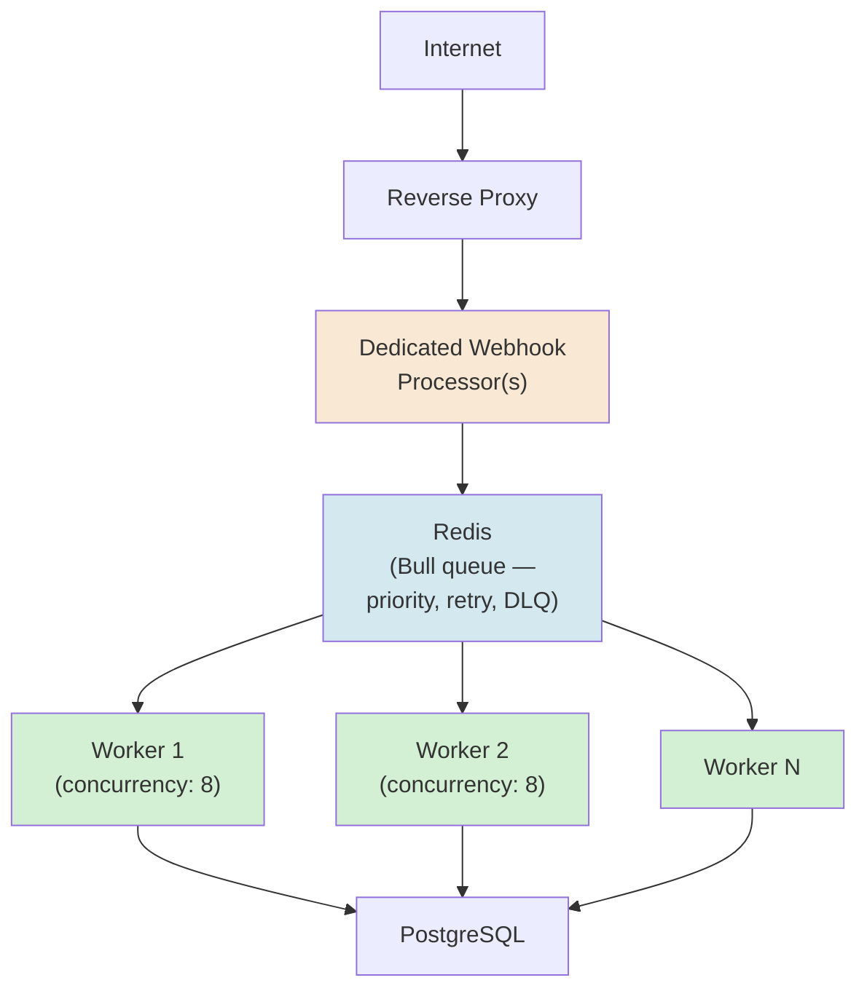
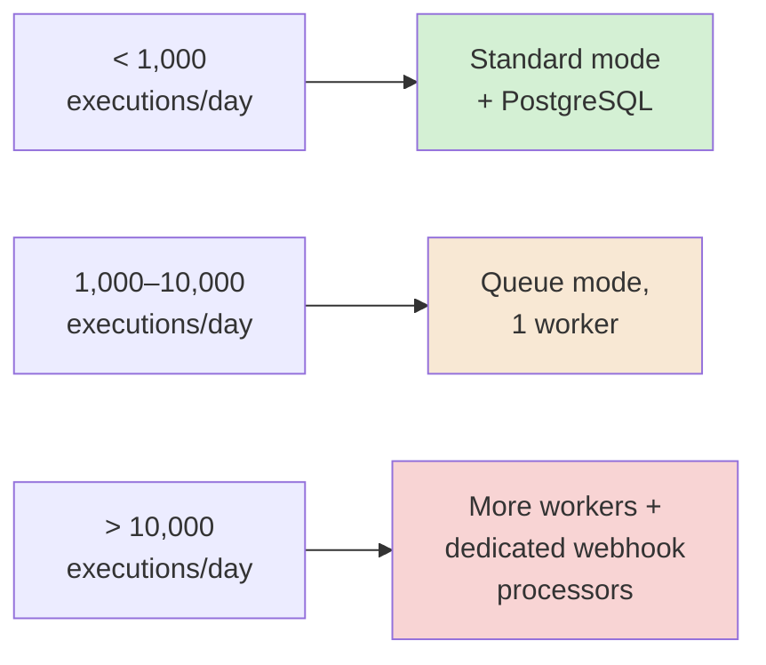
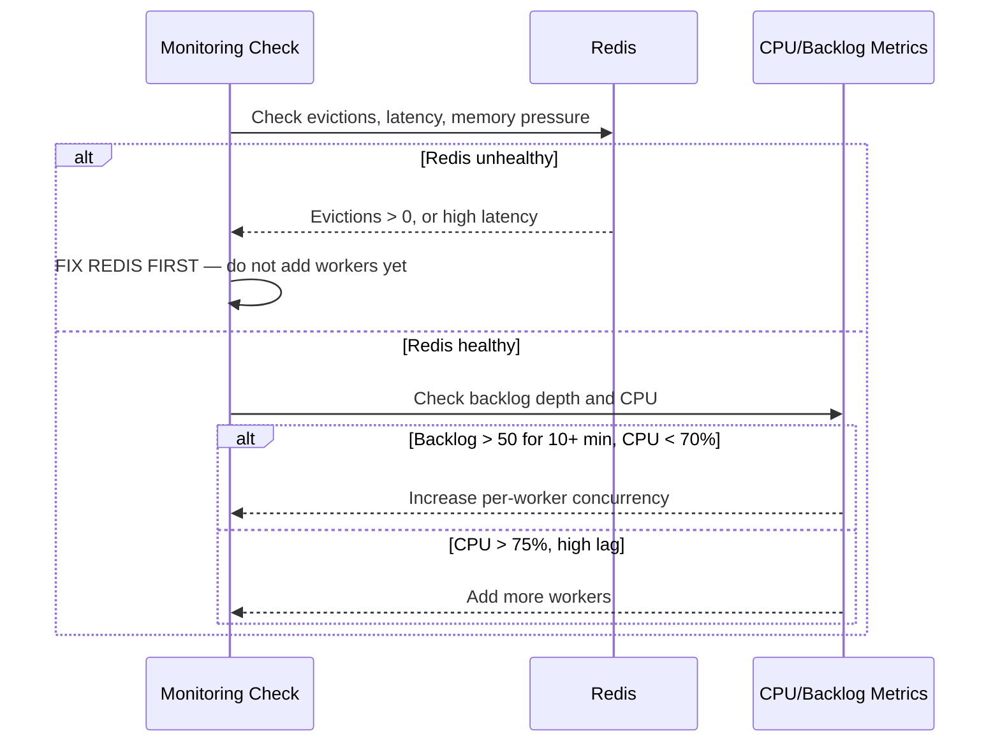
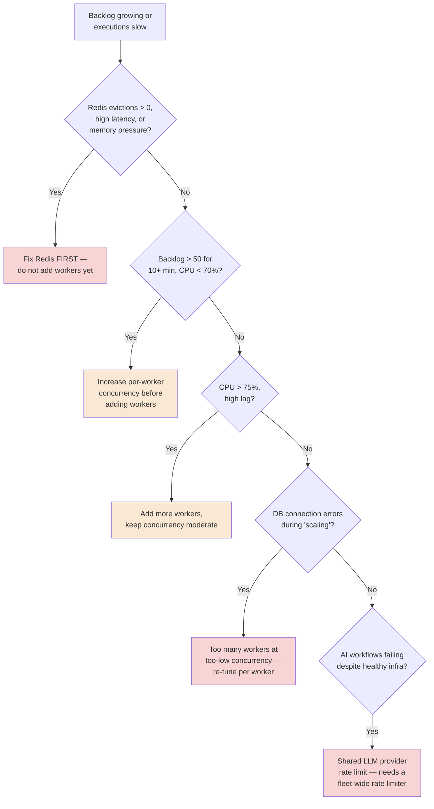
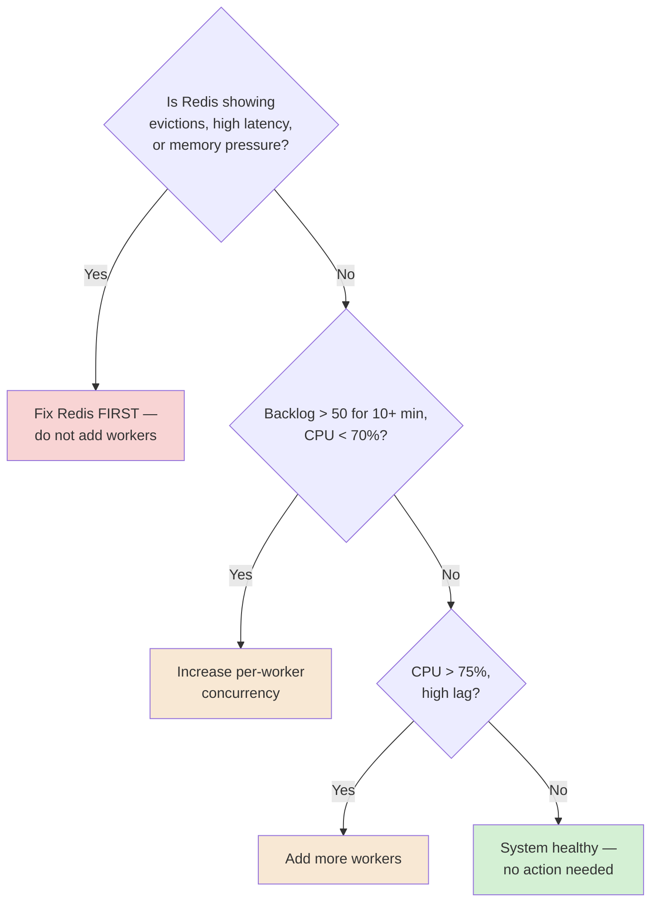

# Chapter 16 — Scaling n8n in Production

## Learning Objectives

By the end of this chapter, you will be able to:

- Apply n8n's own confirmed capacity thresholds to decide when queue mode, more workers, or dedicated webhook processors are actually needed — not before, and not too late.
- Configure worker concurrency correctly, understanding the real tradeoff between per-worker parallelism and total worker count.
- Set **`N8N_CONCURRENCY_PRODUCTION_LIMIT`** deliberately, understanding its global, FIFO-queued behavior.
- Deploy **dedicated webhook processors**, separating trigger-receiving capacity from execution capacity.
- Diagnose **worker starvation** using real, concrete, current diagnostic thresholds — queue backlog depth, CPU, and Redis health.
- Distinguish a Redis-health problem from a worker-capacity problem, and know which one to fix first — getting this backwards makes things worse, not better.
- Budget real infrastructure capacity for AI-native workflows at scale, accounting for LLM provider rate limits as a distinct constraint from n8n's own execution capacity.
- Explain why "just add more workers" isn't always the right fix, using Redis memory pressure as the concrete counter-example.

## Prerequisites

- **Chapters completed:** Chapter 15 (Docker Compose, queue mode basics, main process vs. worker) — this chapter assumes that deployment exists and scales it for real, sustained production volume. Chapter 09's token-cost dimension is also assumed, extended here to fleet scale.
- **Tools installed:** Same Docker Compose environment from Chapter 15.

## Estimated Reading Time

70–85 minutes

## Estimated Hands-on Time

3.5 hours

---

## ⚡ Fast Read

> **Skim time: 5 minutes**

- **What it is:** Taking Chapter 15's working queue-mode deployment and scaling it correctly for real, sustained production traffic — worker concurrency, dedicated webhook processors, and the diagnostic discipline to tell a genuine capacity problem from a Redis-health problem before you make it worse.
- **Why it matters:** A queue-mode deployment that worked fine in testing can still silently fail under real load in a very specific, very common way — executions piling up in a growing backlog for hours, with nothing about the deployment itself throwing an obvious error.
- **Key insight:** "Add more workers" is not always the right fix, and applying it when the real problem is Redis running low on memory can make the backlog worse, not better. Real, current, concrete diagnostic thresholds exist to tell the two apart — this chapter teaches them.
- **What you build:** Correctly-tuned worker concurrency, a dedicated webhook processor separated from execution capacity, and a real monitoring check implementing the exact diagnostic decision tree that distinguishes a capacity problem from a Redis problem.
- **Jump to:** [Core Concepts](#core-concepts) | [First Scaling Step](#beginner-implementation) | [Best Practices](#best-practices) | [Mini Project](#mini-project)

---

## Why This Topic Exists

Chapter 15 got you a working queue-mode deployment — a main process, a worker, Redis, and a confirmed, real, roughly 7x throughput improvement over default mode. That's the right foundation, and it's also not the end of the scaling story. A single worker has a real, finite capacity, and real production traffic doesn't stay at whatever level you tested against — it grows, it spikes, and it eventually exceeds what your current deployment can actually absorb. This chapter is about that next stage: recognizing when you've outgrown what you have, and — just as importantly — correctly diagnosing *what's* actually constrained before you throw more infrastructure at a problem more infrastructure won't fix.

That second point is the chapter's real center of gravity. It's tempting to treat "add more workers" as a universal fix for anything that looks like a scaling problem. It isn't. This chapter's own research turned up a real, concrete, currently-documented counter-example: if Redis itself is under memory pressure, adding more workers competing for the same strained Redis instance can make backlog *worse*, not better. Telling these two failure modes apart — genuine worker capacity exhaustion versus a struggling queue backend — is a real diagnostic skill, and it's exactly what this chapter's Debugging Guide is built around.

## Real-World Analogy

Picture a restaurant that's outgrown its original one-cook kitchen (Chapter 15's single worker) and hired more line cooks. If orders are backing up because there genuinely aren't enough hands on the line, hiring more cooks is the right fix. But if orders are backing up because the walk-in fridge (Redis) is overstuffed and staff keep tripping over each other trying to get ingredients out of it, hiring *more* cooks doesn't fix that — it makes the fridge traffic jam worse, because now even more people are competing for the same constrained resource. The fix in that second case isn't more cooks — it's a bigger or better-organized fridge, first, before anything else.

This chapter is about learning to tell which restaurant you're actually running before you place the order for more staff.

---

## Core Concepts

### Capacity Threshold

**Technical definition:** n8n's own confirmed, current guidance for when a given architecture stops being sufficient — under roughly 1,000 executions/day, standard (non-queue) mode with PostgreSQL is sufficient; between roughly 1,000–10,000 executions/day, queue mode with a single worker; above roughly 10,000 executions/day, additional workers and dedicated webhook processors.

**Plain English:** A rough, real, current guide for "how big does this need to be, given how much traffic I actually have."

**Analogy:** A restaurant's own rule of thumb for when a one-cook kitchen needs a second cook, and when it needs an entirely separate expediting station.

> Treat these as **directional**, not a rigid, universal law — actual capacity depends heavily on workflow complexity (Chapter 14's memory-duplication concerns compound this) and per-execution duration, not just raw count. They're a real, current, useful starting point for planning, not a substitute for watching your own actual metrics.

### Worker Concurrency

**Technical definition:** The number of jobs a single worker process runs in parallel, set via the worker's `--concurrency` flag — confirmed current default of **10**, with n8n's own guidance recommending **5 or higher**.

**Plain English:** How many things one worker juggles at once, versus doing them one at a time.

**Analogy:** One line cook working on several dishes in parallel (checking one while another simmers) versus finishing one dish completely before starting the next.

> Confirmed current tradeoff, worth taking seriously: **setting concurrency too low across a large number of workers can exhaust your database's own connection pool**, producing processing delays and failures that look like a capacity problem but are actually a database-connection problem — a real, easy-to-misdiagnose trap.

### Global Concurrency Limit

**Technical definition:** `N8N_CONCURRENCY_PRODUCTION_LIMIT`, a confirmed current environment variable capping the total number of production executions (triggered by a webhook or trigger node) running simultaneously **across the whole instance** — applying in both regular and queue modes, queuing anything beyond the limit in **FIFO order**.

**Plain English:** A hard ceiling on total simultaneous work, regardless of how many workers you have, protecting the instance from being overwhelmed.

**Analogy:** A restaurant's own decision to cap how many tables it seats at once, even if it technically has enough staff to attempt more — a deliberate throttle, not a capacity number.

### Dedicated Webhook Processor

**Technical definition:** A separate n8n process, configured with `endpoints.disableProductionWebhooksOnMainProcess: true`, handling only incoming webhook requests — decoupling trigger-receiving capacity from the main process and from execution capacity entirely.

**Plain English:** A dedicated host or receptionist just for taking new orders, freeing the main process from being both the order-taker and (in default mode) the cook.

**Analogy:** A restaurant busy enough to need a dedicated host stand, separate from anyone actually involved in preparing food — pure intake capacity, kept from competing with anything else for the same resources.

### Redis as Queue Backend

**Technical definition:** In queue mode, n8n uses the **Bull** queue library, backed by Redis, to store pending jobs, manage job priority and ordering, handle retry logic for failed executions, and provide dead-letter queuing — confirmed current mechanics.

**Plain English:** Redis isn't just a waiting room for jobs — it's actively managing order, retries, and what happens to jobs that fail repeatedly.

**Analogy:** A well-run kitchen's order rail, which doesn't just hold tickets — it tracks priority, handles a ticket that needs to be re-fired, and has a defined process for a ticket that's failed enough times to need a manager's attention (Chapter 07's own dead-letter concept, now confirmed as a real, built-in mechanic of n8n's own queue backend).

### Worker Starvation

**Technical definition:** A state where jobs accumulate in the Redis-backed queue faster than available workers can process them — a growing, sustained backlog, not a transient spike.

**Plain English:** Orders piling up faster than the kitchen can cook them, for real, not just for a busy minute.

**Analogy:** The restaurant's order rail growing longer and longer over an entire evening, not just spiking briefly during a rush.

### Backlog Depth

**Technical definition:** The number of jobs currently waiting in the Redis queue, not yet picked up by a worker — the primary, current, concrete signal for diagnosing scaling problems.

**Plain English:** How many orders are sitting on the rail, unclaimed, right now.

**Analogy:** Literally counting the tickets on the rail — the most direct, honest measure of whether the kitchen is keeping up.

> Confirmed current diagnostic guidance, worth memorizing as this chapter's central decision rule: **if backlog exceeds roughly 50 for more than 10 minutes, and CPU is below 70%**, the fix is likely to **increase per-worker concurrency** (e.g., 5 to 8) before adding more workers. **If CPU exceeds roughly 75% and lag is high**, the fix is to **add workers**, keeping concurrency moderate.

### Redis Health vs. Worker Capacity

**Technical definition:** Two structurally distinct scaling problems requiring different fixes — confirmed current guidance: **if Redis shows evictions greater than zero, high latency, or memory pressure, fix Redis's own memory/configuration first** — scaling workers in that state can worsen the backlog, not improve it.

**Plain English:** Not every backlog is a "not enough workers" problem — sometimes the queue itself is struggling, and adding more workers just means more processes competing for an already-strained resource.

**Analogy:** This chapter's own opening analogy, restated as the rule: check whether the fridge itself is the problem before hiring more cooks to compete for space in it.

### LLM Rate Limits at Fleet Scale

**Technical definition:** The reality that, once many AI-native workflows (Chapter 09 onward) run concurrently across a scaled n8n deployment, they may share the same underlying LLM provider's own rate limits — a constraint entirely separate from n8n's own execution capacity, worker count, or Redis health.

**Plain English:** Scaling n8n's own infrastructure doesn't scale the AI provider's willingness to accept that much traffic.

**Analogy:** A restaurant that's successfully scaled its kitchen staff to handle far more orders, only to discover its single specialty ingredient supplier can't actually deliver more volume than before — the kitchen's own capacity was never the real ceiling.

> This is a genuinely distinct scaling dimension worth planning for explicitly: **a fleet-wide rate limiter or circuit breaker** (Chapter 07's pattern, applied across the whole instance rather than one workflow) protecting your LLM provider relationship the same way this chapter protects Redis and worker capacity.

---

## Architecture Diagrams

### Diagram 1 — A Fully Scaled Deployment



### Diagram 2 — Capacity Thresholds



## Flow Diagrams

### Diagram 3 — The Diagnostic Decision Tree



---

## Beginner Implementation

> **Accessible path.** Builds directly on Chapter 15's deployment.

**Goal:** Tune worker concurrency and set a global limit deliberately, on Chapter 15's queue-mode deployment.

1. On your Chapter 15 worker service, explicitly set `--concurrency=8` (within n8n's own recommended 5+ range), rather than leaving the default.
2. On the main process, set `N8N_CONCURRENCY_PRODUCTION_LIMIT` to a deliberate, reasoned number (not left unset) — document, in a note, why you chose that specific number for your current expected traffic.
3. Run a burst of test executions exceeding your chosen limit, and confirm (via logs) that excess executions genuinely queue in FIFO order rather than all attempting to run simultaneously.

**What you just built:** Two real, deliberate scaling controls, tuned with an actual reason behind each number — not left at defaults unexamined.

---

## Intermediate Implementation

> **Adds a dedicated webhook processor.**

**Goal:** Separate trigger-receiving capacity from execution capacity entirely.

1. Set `endpoints.disableProductionWebhooksOnMainProcess: true` on your main process's configuration.
2. Add a **separate** n8n service, configured to run specifically as a webhook processor (per n8n's own current documentation for this role), connected to the same Redis and database.
3. Confirm, via logs, that incoming webhook calls are now handled by this dedicated processor, not the main process — and that the main process continues handling only what it's actually meant to (scheduling, UI).

**What to notice:** This is the same **competing consumers** and **rate-limited fan-out** discipline from Chapters 06 and 07, now applied at the level of your entire instance's trigger-intake capacity, not one workflow's outbound calls.

---

## Advanced Implementation

> **Engineering-depth path.** A real monitoring check implementing the confirmed diagnostic decision tree.

**Goal:** Build an actual alerting workflow implementing Diagram 3's diagnostic logic.

```javascript
// Learning example — a Code node (in a scheduled monitoring workflow,
// per Chapter 02's schedule trigger pattern) implementing this chapter's
// confirmed diagnostic decision tree. Assumes upstream nodes have
// already fetched real Redis metrics (evictions, latency) and queue/CPU
// metrics into $json — the actual metric-fetching mechanism depends on
// your specific Redis/infrastructure monitoring setup.

const { redisEvictions, redisLatencyMs, backlogDepth, backlogMinutes, cpuPercent } = $json;

// Rule 1 — Redis health takes priority over everything else.
if (redisEvictions > 0 || redisLatencyMs > 100) {
  return [{
    json: {
      alert: 'REDIS_UNHEALTHY',
      action: 'Fix Redis memory/config FIRST. Do NOT add workers yet — doing so can worsen the backlog.',
      severity: 'critical',
    },
  }];
}

// Rule 2 — sustained backlog with low CPU: increase concurrency first.
if (backlogDepth > 50 && backlogMinutes >= 10 && cpuPercent < 70) {
  return [{
    json: {
      alert: 'BACKLOG_LOW_CPU',
      action: 'Increase per-worker concurrency (e.g., 5 to 8) before adding workers.',
      severity: 'warning',
    },
  }];
}

// Rule 3 — high CPU and lag: genuinely add capacity.
if (cpuPercent > 75 && backlogDepth > 50) {
  return [{
    json: {
      alert: 'GENUINE_CAPACITY_SHORTAGE',
      action: 'Add more workers, keep concurrency moderate.',
      severity: 'warning',
    },
  }];
}

return [{ json: { alert: 'NONE', action: 'Healthy.' } }];
```

Connect this to a real alert channel (Slack, per Chapter 04's patterns), running on a schedule, so worker starvation is caught by an active check, not discovered hours later when someone notices a workflow's actual real-world effect was delayed.

**The common mistake alongside the correct pattern:**

```text
WRONG: See a growing backlog, immediately spin up more workers, without
checking Redis's own health first.

RIGHT: Check Redis health FIRST, per this chapter's confirmed diagnostic
order — adding workers while Redis itself is under memory pressure can
make the backlog worse, not better.
```

**How to debug it when it breaks:** If adding workers doesn't seem to reduce backlog, check Redis's own metrics specifically — this is the exact failure mode this chapter's diagnostic tree exists to catch. If database connection errors appear alongside a "scaling" problem, check whether concurrency was set too low across too many workers, exhausting the database's connection pool, per this chapter's Worker Concurrency concept.

**The production version, where it differs from the learning version:** The learning version's monitoring check runs on a schedule. A production version typically runs this check continuously or at a much tighter interval, with the alert routed to a real, monitored on-call channel — Chapter 17 covers the full observability discipline this chapter's monitoring check is a first, concrete instance of.

---

## Production Architecture

- **Per-worker memory footprint is a real, confirmed capacity-planning number**, directly extending Chapter 14's own memory-duplication concept: each worker process consumes roughly 200–500MB depending on workflow complexity, more for workflows with heavy data transformations — size infrastructure against this, not against a guess.
- **A fleet-wide LLM rate limiter is a real, necessary addition once AI-native workflows (Module 3) run at scale** — protecting the relationship with your LLM provider is a distinct concern from protecting your own Redis and worker capacity, and needs its own, separate circuit-breaker-style control.
- **Dedicated webhook processors and worker scaling are genuinely separate scaling axes** — a deployment can need more of one without needing more of the other, depending on whether the bottleneck is trigger intake or execution throughput.

---

## Best Practices

1. **Follow n8n's own confirmed capacity thresholds as a starting point**, but validate against your own actual metrics, not just execution count alone.
2. **Always check Redis health before adding workers** — per this chapter's confirmed diagnostic order, this is the single most important sequencing rule in this chapter.
3. **Set worker concurrency deliberately, in the 5+ range n8n recommends**, and watch for database connection pool exhaustion if running many workers at low concurrency.
4. **Add dedicated webhook processors once trigger-intake volume, not just execution volume, becomes a real bottleneck.**
5. **Set `N8N_CONCURRENCY_PRODUCTION_LIMIT` deliberately**, as a real, reasoned ceiling — not left unset and implicitly unlimited.
6. **Plan for LLM provider rate limits as a distinct, separate scaling dimension** for any fleet of AI-native workflows, not assumed to scale automatically alongside your own infrastructure.

---

## Security Considerations

- **A scaled Redis instance handling real execution data is a more attractive target, not a less risky one** — the same network-isolation discipline Chapter 15 established becomes more important, not less, as more sensitive execution data flows through it at higher volume.
- **Dedicated webhook processors are a real, additional attack surface**, per Chapter 01's own webhook-security discipline — every additional intake point needs the same authentication and TLS scrutiny as the original.

## Cost Considerations

Worker concurrency tuning is a genuine, direct cost lever: correctly increasing per-worker concurrency (within n8n's own recommended range) can absorb real additional load **without** paying for additional worker infrastructure — the right first move per this chapter's own diagnostic tree, when CPU headroom actually exists. Only once CPU is genuinely saturated does adding worker infrastructure (real, additional cost) become the correct move. Getting this order backwards — paying for more workers before exhausting concurrency headroom — is a real, avoidable infrastructure cost.

## Common Mistakes

**Mistake 1 — Adding workers before checking Redis health.**
```text
WRONG: Backlog growing, workers added immediately.
RIGHT: Redis health checked FIRST, per this chapter's confirmed
diagnostic order — fix Redis before adding workers if it's unhealthy.
```

**Mistake 2 — Low concurrency, many workers.**
```text
WRONG: Concurrency left at a low value while worker count grows,
exhausting the database's connection pool.
RIGHT: Concurrency set within n8n's recommended 5+ range per worker,
scaled deliberately alongside worker count.
```

**Mistake 3 — No fleet-wide LLM rate limiting.**
```text
WRONG: n8n's own infrastructure scaled correctly, but every AI-native
workflow independently hits the same shared LLM provider limit,
uncoordinated.
RIGHT: A fleet-wide rate limiter/circuit breaker, per this chapter's
Production Architecture.
```

## Debugging Guide



This is the same decision logic as Diagram 3, restated here as a standalone diagnostic flowchart, alongside the lookup table below:

| Symptom | Likely cause | Fix, in order |
|---|---|---|
| Redis evictions > 0, high latency, memory pressure | Redis itself is the bottleneck | Fix Redis memory/config FIRST — do not add workers yet |
| Backlog > 50 for 10+ min, CPU < 70% | Concurrency headroom unused | Increase per-worker concurrency before adding workers |
| CPU > 75%, high lag, Redis healthy | Genuine capacity shortage | Add more workers, keep concurrency moderate |
| Database connection errors during "scaling" | Too many workers at too-low concurrency | Re-tune concurrency per worker, not just worker count |
| AI workflows failing under load despite healthy infra | Shared LLM provider rate limit, not an n8n capacity issue | Fleet-wide rate limiter, not more n8n infrastructure |

## Performance Optimisation

> The thresholds below are **n8n's own confirmed current guidance**, not illustrative estimates.

Confirmed current guidance: a backlog exceeding 50 for more than 10 minutes, with CPU below 70%, is resolved by increasing concurrency (5 to 8, for instance) before adding workers — a genuinely free capacity increase, using infrastructure you're already paying for. Only once CPU exceeds roughly 75% alongside real lag does adding worker infrastructure become the correct, necessary move.

---

## Technology Comparison

| Platform | Scaling model | Fleet-wide rate/cost control |
|---|---|---|
| **n8n** | Queue mode workers + dedicated webhook processors, confirmed capacity thresholds | Must be hand-built (this chapter's own Advanced Implementation) |
| **Temporal** | Native worker pool scaling, built into the platform's own execution model | More mature native support for this exact concern than any visual platform in this comparison |
| **Apache Airflow** | Celery or Kubernetes executor scaling, well-established for batch workloads at real data-engineering scale | Native scheduler-level concurrency controls, a mature, comparable concept to this chapter's own limits |
| **Zapier / Make** | Scaling is entirely the vendor's own responsibility — invisible to you as a Cloud-only user | Not your concern at all, by design — the tradeoff for having zero infrastructure responsibility |

## Decision Framework — This Chapter's Diagnostic Tree, as a Decision Framework



---

## Real Client Scenario — Aperture Cloud's Growth Past 10,000 Executions/Day

Aperture Cloud's automation volume crossed n8n's own confirmed 10,000-executions/day threshold, and their single-worker Chapter 15 deployment began showing real, sustained backlog. Following exactly this chapter's diagnostic discipline, the team checked Redis health first (confirmed healthy), then backlog and CPU (confirmed genuinely CPU-constrained, not a concurrency-tuning opportunity), and correctly added two additional workers rather than guessing. This is a low-stakes, purely infrastructure-scoped scenario from an autonomy standpoint — but it's exactly the kind of real, disciplined, metrics-driven decision this chapter's Best Practices argue for over reflexive "just add more" scaling.

---

### Production Issue: The Backlog That Grew for Six Hours Before Anyone Noticed

**Symptoms**

Aperture Cloud's queue-mode deployment appeared healthy by every surface-level check — the editor UI was responsive, manual test executions ran fine. But real, production, webhook-triggered executions were taking **hours** to actually process, discovered only when a business team asked why a time-sensitive automated notification arrived six hours late.

**Root Cause**

Worker starvation — the execution backlog had been growing steadily for the entire afternoon, with **no active monitoring watching backlog depth at all**. The team had queue-mode infrastructure correctly deployed (Chapter 15) but no equivalent of this chapter's diagnostic monitoring check actually running — the system was silently falling behind, with nothing surfacing that fact until a human noticed a real, delayed, downstream effect.

**How to Diagnose It**

Check Redis's queue backlog metric directly, cross-referenced against when it started growing — a backlog that climbs steadily over hours, with no corresponding drop, is the direct signature of sustained worker starvation, distinct from a brief, self-resolving traffic spike.

**How to Fix It**

```text
BEFORE: Queue-mode infrastructure deployed, but no active monitoring of
backlog depth, Redis health, or CPU — the exact metrics this chapter's
diagnostic tree depends on.

AFTER: This chapter's Advanced Implementation monitoring check, running
on a real, tight schedule, alerting a real, monitored channel the moment
backlog crosses a defined threshold — not discovered after a downstream
business impact makes it obvious.
```

**How to Prevent It in Future**

Treat active backlog monitoring as a required, standing part of any queue-mode production deployment, not an optional addition — per this chapter's own Advanced Implementation, deployed and alerting before it's needed, not built reactively after the first real incident. Chapter 17 covers the full observability discipline this specific monitoring check is one concrete instance of.

---

## Exercises

1. **(20 min)** For a hypothetical 15,000-executions/day workload, sketch the architecture n8n's own confirmed thresholds would suggest.
2. **(45 min)** Build the Beginner Implementation's tuned concurrency and global limit on your Chapter 15 deployment.
3. **(60 min)** Build the Intermediate Implementation's dedicated webhook processor.
4. **(90 min)** Build the full Advanced Implementation's diagnostic monitoring check, and test all three of its decision branches using simulated metric values.
5. **(30 min)** Design a fleet-wide LLM rate limiter (on paper, or built if time allows) for a hypothetical set of 5 AI-native workflows sharing one provider's rate limit.

## Quiz

**1. What are n8n's own confirmed current capacity thresholds for standard mode, single-worker queue mode, and multi-worker/dedicated-webhook-processor scaling?**
> Roughly under 1,000 executions/day: standard mode + PostgreSQL. Roughly 1,000–10,000/day: queue mode, 1 worker. Above roughly 10,000/day: more workers and dedicated webhook processors.

**2. What's n8n's own recommended range for worker concurrency, and what real risk does setting it too low across many workers create?**
> 5 or higher (default is 10). Too-low concurrency across many workers can exhaust the database's own connection pool, causing delays and failures that look like a capacity problem but are actually a database-connection problem.

**3. What does N8N_CONCURRENCY_PRODUCTION_LIMIT control, and how does it queue excess executions?**
> A global cap on total simultaneous production executions across the whole instance, in both regular and queue modes — excess executions queue in FIFO order.

**4. What does a dedicated webhook processor actually separate from what?**
> Trigger-receiving (webhook intake) capacity from execution capacity and from the main process's other duties (UI, scheduling).

**5. What three things does Redis's Bull-based queue backend confirmed-currently manage, beyond just holding jobs?**
> Job priority and ordering, retry logic for failed executions, and dead-letter queuing.

**6. According to this chapter's confirmed diagnostic order, what should you check BEFORE adding more workers to fix a growing backlog?**
> Redis's own health — evictions, latency, memory pressure. Adding workers while Redis itself is unhealthy can worsen the backlog, not improve it.

**7. What are the two specific, confirmed threshold conditions that indicate "increase concurrency first" versus "add more workers"?**
> Backlog > 50 for 10+ minutes with CPU < 70% → increase concurrency first. CPU > 75% with high lag → add more workers.

**8. Why is a fleet-wide LLM rate limiter a genuinely separate concern from n8n's own worker/Redis scaling?**
> Because an LLM provider's own rate limit is external to n8n's infrastructure entirely — scaling n8n's own workers and Redis does nothing to increase what the LLM provider itself is willing to accept.

**9. In this chapter's Production Issue, what specifically was missing that let a six-hour backlog go unnoticed?**
> Active monitoring of backlog depth — the infrastructure itself was correctly deployed, but nothing was watching the metric that would have surfaced the problem before a downstream business impact made it obvious.

**10. What's the confirmed current per-worker memory footprint range, and what does it depend on?**
> Roughly 200–500MB per worker, depending on workflow complexity — more for workflows involving heavy data transformations.

## Mini Project

**Aperture Cloud's Tuned Queue-Mode Deployment (2–3 hours)**

- [ ] Worker concurrency and N8N_CONCURRENCY_PRODUCTION_LIMIT both set deliberately, with a written justification for each value.
- [ ] A dedicated webhook processor, separated from the main process and workers.
- [ ] A written note explaining, for your own deployment, at what backlog/CPU combination you'd add workers versus increase concurrency.

## Production Project

**Aperture Cloud's Full Diagnostic Monitoring System (1–2 days)**

- [ ] A real, scheduled monitoring workflow implementing this chapter's full diagnostic decision tree (Redis health, backlog, CPU), alerting a real channel.
- [ ] A deliberate reproduction of this chapter's Production Issue at small scale (simulate a growing backlog with no monitoring, then add the monitoring check and confirm it catches it).
- [ ] A fleet-wide rate limiter design (or working implementation) for AI-native workflows sharing an LLM provider's rate limit.
- [ ] A written capacity plan (300–500 words) for Aperture Cloud's next 6 months of projected growth, using this chapter's confirmed thresholds and per-worker memory numbers.

## Key Takeaways

- n8n's own confirmed capacity thresholds (1,000 / 10,000 executions per day) are a real, useful starting point for architecture decisions, not a rigid law.
- Worker concurrency and worker count are two separate scaling levers — tune both deliberately, within n8n's own recommended ranges.
- Redis health must be checked BEFORE adding workers — this is this chapter's single most important diagnostic sequencing rule.
- Dedicated webhook processors separate trigger-intake capacity from execution capacity, a genuinely distinct scaling axis.
- Per-worker memory footprint (200–500MB) is a real, confirmed capacity-planning number, directly extending Chapter 14's memory model.
- LLM provider rate limits are a distinct, fleet-wide scaling dimension that n8n's own infrastructure scaling does nothing to solve.
- Active backlog monitoring is required, not optional — a correctly-scaled deployment with no monitoring can still silently fail for hours.
- "Add more workers" is not a universal fix — applying it when Redis itself is the bottleneck can make things worse.

## Chapter Summary

| Concept | Key Takeaway |
|---|---|
| Capacity Thresholds | 1,000 / 10,000 executions/day, n8n's own confirmed guidance |
| Worker Concurrency | 5+ recommended per worker — too-low values with many workers exhaust the DB pool |
| Global Concurrency Limit | N8N_CONCURRENCY_PRODUCTION_LIMIT — a deliberate, FIFO-queued ceiling |
| Dedicated Webhook Processor | Separates trigger intake from execution capacity |
| Redis Health vs. Worker Capacity | Check Redis FIRST — adding workers to an unhealthy Redis makes it worse |
| LLM Rate Limits at Fleet Scale | A separate, external scaling dimension n8n's own infrastructure can't solve |

## Resources

- [n8n queue mode documentation](https://docs.n8n.io/hosting/scaling/queue-mode/)
- [n8n concurrency control documentation](https://docs.n8n.io/hosting/scaling/concurrency-control/)

## Glossary Terms Introduced

| Term | One-line definition |
|---|---|
| Capacity Threshold | n8n's own confirmed execution-volume guidance for architecture decisions |
| Worker Concurrency | Jobs one worker runs in parallel, set via --concurrency |
| Global Concurrency Limit | N8N_CONCURRENCY_PRODUCTION_LIMIT — instance-wide, FIFO-queued cap |
| Dedicated Webhook Processor | A process handling only webhook intake, separate from execution |
| Worker Starvation | Jobs accumulating faster than workers can process them |
| Backlog Depth | The number of jobs currently waiting in the Redis queue |
| LLM Rate Limits at Fleet Scale | A shared, external constraint distinct from n8n's own infrastructure capacity |

## See Also

| Topic | Related Chapter | Why |
|---|---|---|
| Reliability and Error Recovery | Chapter 07 | Circuit breaker thinking, extended here to fleet-wide LLM rate limiting |
| Custom Code Nodes | Chapter 14 | Per-execution memory model, directly extended into per-worker capacity planning |
| Deployment Architecture | Chapter 15 | The queue-mode foundation this chapter scales |
| Observability | Chapter 17 | The full monitoring discipline this chapter's diagnostic check is one instance of |

## Preparation for Next Chapter

**Technical checklist:**
- [ ] Tuned worker concurrency and set a global concurrency limit deliberately.
- [ ] Deployed a working dedicated webhook processor.
- [ ] Built and tested the full diagnostic monitoring check.

**Conceptual check:**
- Why must Redis health be checked before adding workers?
- Why is an LLM provider's rate limit a genuinely separate scaling concern from n8n's own infrastructure?

**Optional challenge:** Before Chapter 17, think about everything this chapter just taught you to check manually (backlog, CPU, Redis health) and imagine it running continuously, automatically, with real alerting — not something you remember to check. Chapter 17 is exactly that discipline, generalized across your entire instance.

---

> **Currency Note:** This chapter's n8n-specific facts (capacity thresholds, worker concurrency recommendations, N8N_CONCURRENCY_PRODUCTION_LIMIT, dedicated webhook processor configuration, Redis/Bull queue mechanics, and the confirmed diagnostic thresholds for backlog/CPU/Redis health) were verified against `docs.n8n.io` and current community/technical sources in July 2026.
