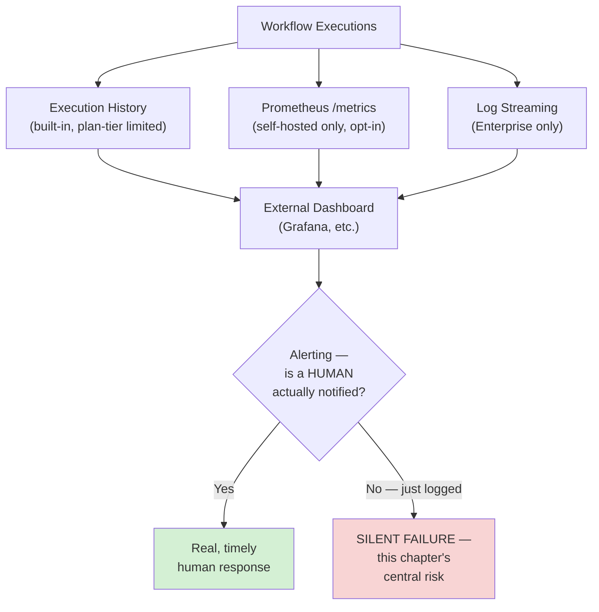
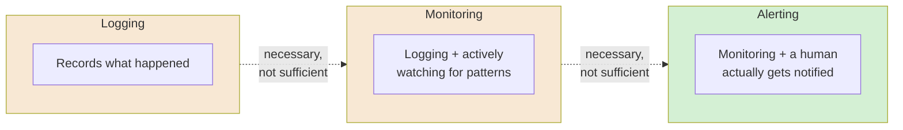
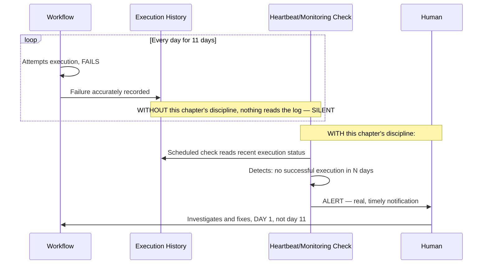
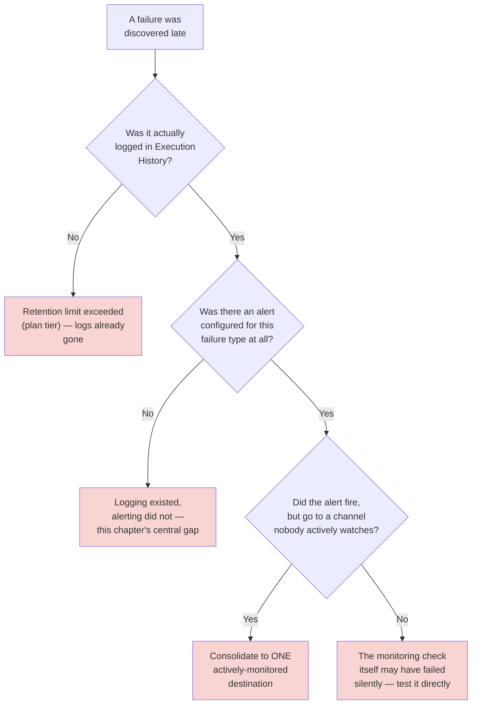
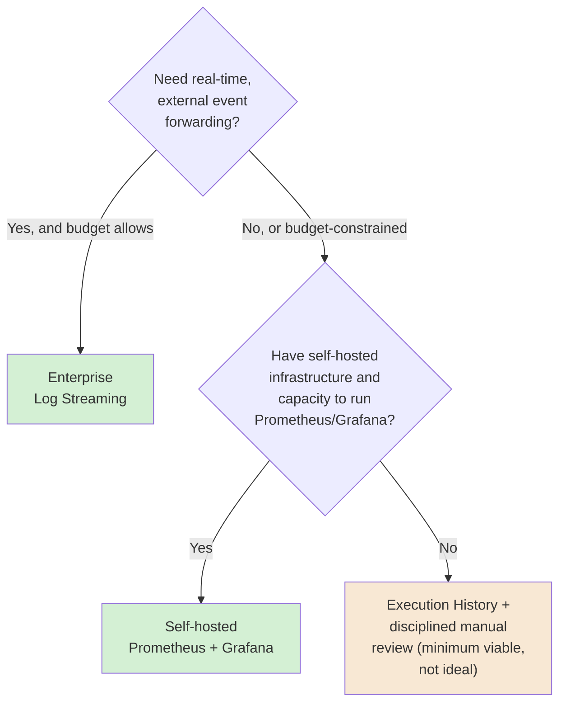

# Chapter 17 — Observability: Knowing When Automation Breaks

## Learning Objectives

By the end of this chapter, you will be able to:

- Read and query n8n's own **execution history** effectively, and know its real, current retention limits by plan tier.
- Enable and expose n8n's **Prometheus `/metrics` endpoint**, understanding exactly what it does and doesn't cover by default.
- Explain the real difference between n8n's built-in execution history and genuine external observability — **Enterprise log streaming**, Prometheus, and real external dashboards.
- Combine Chapter 02's Error Workflow, Chapter 07's dead-letter thinking, and Chapter 16's monitoring-check pattern into one coherent, standing observability strategy.
- Distinguish **"the system logged something"** from **"someone is actually watching it"** — the central, costly failure mode this chapter exists to prevent.
- Design monitoring specifically for **choreographed systems** (Chapters 01 and 06), where no single canvas shows the whole picture.
- Apply observability to **AI-native workflows** (Module 3) specifically — tracking iteration counts, token spend, and trajectory anomalies as first-class signals, not just success/failure.
- Build a genuine, tested "is anyone actually watching this" check as a standing practice, not a one-time setup exercise.

## Prerequisites

- **Chapters completed:** Chapter 02 (Error Trigger/Workflow), Chapter 07 (dead-letter thinking, circuit breakers), Chapter 16 (the diagnostic monitoring-check pattern) — this chapter generalizes all three into a full observability discipline.
- **Tools installed:** Same Docker Compose deployment from Chapters 15–16. Prometheus and Grafana (or an equivalent) for this chapter's external-dashboard exercises, if available.

## Estimated Reading Time

65–80 minutes

## Estimated Hands-on Time

3 hours

---

## ⚡ Fast Read

> **Skim time: 5 minutes**

- **What it is:** The full discipline of actually knowing when your automation breaks — n8n's own execution history, Prometheus metrics, Enterprise log streaming, and, most importantly, real alerting that a human actually sees.
- **Why it matters:** Every chapter in this course has assumed that a failure produces *some* visible signal. It doesn't, by default. n8n's own execution log genuinely records what happened — but a log nobody looks at is functionally identical to no log at all.
- **Key insight:** Logging and alerting are not the same thing, and this course has a real, documented example of exactly what the gap between them costs: a real, reported incident where a workflow failed for 11 straight days with a complete, accurate execution log the entire time — and zero alert, because nothing was actually watching it.
- **What you build:** A real Prometheus-scraped metrics setup, a combined alerting pipeline pulling together every observability mechanism this course has built so far, and a specific, tested heartbeat check for choreographed systems — the exact gap Chapter 02 first flagged and never fully solved until now.
- **Jump to:** [Core Concepts](#core-concepts) | [First Dashboard](#beginner-implementation) | [Best Practices](#best-practices) | [Mini Project](#mini-project)

---

## Why This Topic Exists

This course has built real reliability discipline since Chapter 07 — retries, circuit breakers, dead-letter queues — and every one of those techniques assumes something is actually watching them work. Chapter 16 built a real monitoring check for one specific thing (queue backlog). This chapter is where that discipline gets generalized into something that actually covers the whole instance, and where this course confronts directly the gap between two things that sound similar and aren't: **logging** (the system records what happened) and **alerting** (a human is actually told, in time to matter).

The stakes here are concrete, not theoretical. This chapter's own research turned up a real, publicly reported case: a workflow that failed for **11 consecutive days**, with n8n's own execution history recording every single failure accurately, the entire time — because nothing was configured to actually surface that failure to a human. The system did exactly what logging is supposed to do. It just wasn't enough, because nobody was reading it. This chapter exists to close that specific, real, costly gap.

## Real-World Analogy

A building's fire alarm system has two genuinely different jobs, even though people often talk about them as one thing. The **detector** senses smoke and records that it happened — a log. The **alarm** actually makes noise loud enough for people to evacuate — genuine alerting. A detector with a dead battery, silently failing to sound the alarm, is not "working, just quietly" — it's not working at all, in the only way that actually matters, even though its sensor might technically still be detecting smoke correctly.

n8n's execution history is the detector — genuinely, accurately recording what happened. This chapter is about making sure the alarm is actually connected, actually loud enough, and actually reaches someone who can act — not assuming that because the detector works, the building is safe.

---

## Core Concepts

### Observability

**Technical definition:** The general capability of understanding a system's internal state from its external outputs — logs, metrics, and traces — sufficient to diagnose problems without needing to reproduce them from scratch.

**Plain English:** Being able to actually tell what's happening (and what went wrong) inside your automation, from the outside.

**Analogy:** A building's full fire-safety system — detectors, alarms, and a monitoring station that knows the state of every floor — not just one smoke detector in one room.

### Execution History

**Technical definition:** n8n's own built-in log of every workflow run, confirmed current retention varying by Cloud plan tier — Starter: 2,500 saved executions / 7 days retention; Pro: 25,000 / 30 days; Enterprise: 50,000 / unlimited — with the oldest executions removed once either limit is reached.

**Plain English:** n8n's own, accurate, built-in record of what ran and what happened — the detector, in this chapter's analogy.

**Analogy:** The detector's own internal log of every time it sensed smoke — genuinely accurate, and entirely passive until something else acts on it.

> This is a real, current, plan-tier-dependent limit worth knowing precisely: a Starter-plan instance's execution history genuinely **disappears** after 7 days or 2,500 executions, whichever comes first — a real constraint on how far back you can investigate an incident discovered late, directly reinforcing why this chapter's alerting discipline matters more than "the log is there if I need it."

### Prometheus `/metrics` Endpoint

**Technical definition:** A confirmed current, self-hosted-only capability — disabled by default, enabled via `N8N_METRICS=true` — exposing counters and histograms covering execution activity across all workflows at the `/metrics` endpoint, with `N8N_METRICS_INCLUDE_QUEUE_METRICS=true` additionally required for queue-specific metrics (Chapter 16's own backlog/worker data).

**Plain English:** A real, standard, scrapable data feed of n8n's own internal numbers, usable by any monitoring tool that speaks Prometheus's format.

**Analogy:** A building's smoke detectors reporting their live status to a central monitoring panel, in a standard format any monitoring station can read — not just each detector quietly doing its own thing in isolation.

### Log Streaming (Enterprise)

**Technical definition:** A confirmed current, **Enterprise-only** feature forwarding execution events in real time to a syslog server or a generic webhook, giving event-level data outside n8n's own UI and integrating with external log aggregators.

**Plain English:** Real-time event forwarding to whatever external logging/monitoring system your organization already uses.

**Analogy:** The building's fire panel wired directly into a professional, 24/7 monitoring service — not just a light on a panel someone has to walk past to notice.

### Alerting

**Technical definition:** The mechanism by which a detected problem actually reaches a human, in time to act — structurally distinct from logging, which only records that something happened.

**Plain English:** The alarm actually going off, versus the detector just quietly recording that smoke was present.

**Analogy:** This chapter's own opening analogy, restated directly — the difference between a working detector and a working alarm.

> **This is this chapter's single most important distinction.** Every mechanism covered so far in this chapter — execution history, Prometheus metrics, log streaming — is a form of logging. None of them are alerting until something is actually configured to notice a bad signal and tell a human. This chapter's own Production Issue is a real, documented case of exactly this gap.

### Choreography's Observability Gap

**Technical definition:** Chapter 01 and Chapter 06's own previously-identified problem, revisited here with an actual solution — a choreographed system (independent workflows reacting to the same event, with no central canvas) has no natural place to ask "is every listener still actually running?"

**Plain English:** In a choreographed system, one workflow silently breaking produces no error anywhere central — nothing is even positioned to notice.

**Analogy:** Several independent smoke detectors in different rooms, none of them reporting to a central panel — if one dies, nobody knows unless they happen to walk into that specific room.

> Chapter 02 first flagged this gap and explicitly deferred the fix to this chapter. The fix, concretely: a dedicated **heartbeat check** — a scheduled workflow (Chapter 02's own schedule trigger) that verifies each choreographed workflow in a set has actually produced a recent execution, alerting if any one of them has gone quiet, closing exactly the gap Chapter 02 left open.

### AI-Native Observability Signals

**Technical definition:** Observability signals specific to AI-native workflows (Module 3) — iteration count relative to Max Iterations (Chapter 09), token spend, and trajectory anomalies (Chapter 13's `intermediateSteps`) — that a plain success/failure signal doesn't capture at all.

**Plain English:** For an AI agent, "it didn't error" isn't actually enough information — you need to know *how close* it came to its bounds, and *whether the path it took* looked right.

**Analogy:** A building's fire system tracking not just "did an alarm go off" but "how close did the temperature get to the threshold, even on days it didn't" — a leading indicator, not just a pass/fail event.

> This is a direct extension of everything Module 3 built: Chapter 09's Max Iterations is a hard cap, but an agent *consistently* running close to that cap on every call is a real, worth-noticing signal on its own, before it ever actually hits the limit and fails outright.

### Silent Failure

**Technical definition:** A failure that produces no signal reaching a human — the system may log it accurately (Execution History), but no alert fires, and no dashboard is being actively watched.

**Plain English:** Something broke, and the system knew, and nobody found out until something downstream made it obvious.

**Analogy:** This chapter's own central case study — the detector worked, the alarm never sounded.

---

## Architecture Diagrams

### Diagram 1 — The Full Observability Stack



### Diagram 2 — Logging vs. Monitoring vs. Alerting



## Flow Diagrams

### Diagram 3 — A Silent Failure, Caught and Not Caught



---

## Beginner Implementation

> **Accessible path.** Exploring n8n's built-in tools.

**Goal:** Understand exactly what n8n's execution history does and doesn't give you, out of the box.

1. Open the **Execution List** for any workflow you've built in this course, and filter by status (success/failed).
2. Open one execution's detail view and confirm you can see per-node input/output data — the actual, accurate record this chapter's Core Concepts describe.
3. **Confirm, explicitly, that nothing happens automatically when you're not looking at this screen.** Close the tab. No alert fires. No one is told. This is the exact gap this chapter exists to close — felt directly, not just described.

**What you just built:** A clear, hands-on understanding of exactly where n8n's built-in logging stops, and where this chapter's real work begins.

---

## Intermediate Implementation

> **Self-hosted required.** Real, external, scrapable metrics.

**Goal:** Enable and scrape n8n's Prometheus metrics endpoint.

1. On your self-hosted instance, set `N8N_METRICS=true` and `N8N_METRICS_INCLUDE_QUEUE_METRICS=true` (per Chapter 16's queue-mode setup).
2. Confirm the `/metrics` endpoint is reachable and returns real Prometheus-format data.
3. If you have Prometheus and Grafana available, configure Prometheus to scrape this endpoint, and build a basic dashboard panel showing execution counts over time.

**What to notice:** This is real, external, standard-format monitoring data — usable by any tool that speaks Prometheus, not locked into n8n's own UI the way Execution History is.

---

## Advanced Implementation

> **Engineering-depth path.** A full, combined alerting pipeline, including the choreography heartbeat fix and AI-native signals.

**Goal:** Build the complete observability pipeline this chapter has been building toward.

**Part A — the choreography heartbeat, closing Chapter 02's own open gap:**

```javascript
// Learning example — a scheduled monitoring workflow (Chapter 02's own
// Schedule Trigger pattern) checking every workflow in a choreographed
// set for a recent execution, closing the exact gap Chapter 02 and
// Chapter 06 both identified and deferred to this chapter.

const choreographedWorkflows = ['slack-notifier', 'sheet-logger', 'vip-flagger']; // Chapter 01's own example set
const maxSilenceHours = 24;

const results = [];
for (const workflowName of choreographedWorkflows) {
  // In a real implementation, this queries n8n's own execution data
  // (via its API) for the most recent execution of this specific workflow.
  const lastExecution = await getLastExecutionTime(workflowName); // illustrative helper
  const hoursSinceLastRun = (Date.now() - lastExecution) / (1000 * 60 * 60);

  if (hoursSinceLastRun > maxSilenceHours) {
    results.push({
      workflow: workflowName,
      alert: 'NO_RECENT_EXECUTION',
      hoursSilent: hoursSinceLastRun,
    });
  }
}

return results.map((r) => ({ json: r }));
```

**Part B — AI-native signals, extending Chapter 16's own monitoring check:**

```javascript
// Learning example — extending Chapter 16's diagnostic monitoring check
// with AI-native signals (Module 3), not just infrastructure signals.

const { avgIterationsUsed, maxIterationsAllowed, tokenSpendToday, tokenBudget } = $json;

const iterationRatio = avgIterationsUsed / maxIterationsAllowed;
const spendRatio = tokenSpendToday / tokenBudget;

const alerts = [];
if (iterationRatio > 0.8) {
  alerts.push('Agent consistently running close to Max Iterations — investigate before it actually hits the cap');
}
if (spendRatio > 0.8) {
  alerts.push('Token spend approaching daily budget — review before it is exceeded, not after');
}

return [{ json: { alerts, iterationRatio, spendRatio } }];
```

**Part C — combine everything into one dashboard/alert destination:** route Chapter 02's Error Workflow, Chapter 07's dead-letter queue, Chapter 16's backlog check, and both parts above into **one** shared alerting channel — not five different, easy-to-miss destinations.

**The common mistake alongside the correct pattern:**

```text
WRONG: Build individual, isolated monitoring checks for different
concerns (queue backlog, choreography heartbeat, AI signals), each
alerting to a different, easy-to-overlook place.

RIGHT: One consolidated alerting destination, per this chapter's Part C
— a human should have exactly one place to look, not five.
```

**How to debug it when it breaks:** If Prometheus metrics show nothing, confirm both `N8N_METRICS=true` and, for queue-specific data, `N8N_METRICS_INCLUDE_QUEUE_METRICS=true` are actually set and the container was restarted. If a heartbeat check never fires even for a genuinely broken workflow, confirm it's actually querying execution data correctly — a monitoring check that silently fails is exactly as dangerous as the silent failure it was meant to catch.

**The production version, where it differs from the learning version:** The learning version's heartbeat check runs on a schedule. A production version at real scale typically uses Enterprise log streaming (real-time, not polled) feeding a dedicated external monitoring platform, with on-call escalation — the same discipline this chapter's own Production Issue shows the cost of skipping.

---

## Production Architecture

- **Execution History's plan-tier retention limit is a real operational constraint, not just a cost lever.** A Starter-plan instance's 7-day retention means an incident discovered on day 8 has already lost its own execution log — a real, concrete argument for genuine alerting over "I'll check the log if something seems wrong."
- **Prometheus metrics are self-hosted-only, opt-in, and off by default** — a real, deliberate setup step, not something you accidentally get for free.
- **Log streaming's Enterprise-only gating is a real cost/capability tradeoff** — worth weighing directly against this chapter's Cost Considerations for any team seriously considering it.
- **The monitoring workflow itself needs to be more reliable than what it's monitoring** — a heartbeat check that silently breaks is worse than no check at all, because it creates false confidence.

---

## Best Practices

1. **Never confuse logging with alerting** — Execution History, Prometheus, and log streaming are all logging; none of them are alerting until a human is actually notified.
2. **Build a choreography heartbeat check for any set of independent, event-reacting workflows** — closing Chapter 02's own explicitly deferred gap.
3. **Track AI-native signals (iteration ratio, spend ratio) as leading indicators**, not just success/failure — per this chapter's Advanced Implementation.
4. **Consolidate every alerting source into one shared destination** — never scatter alerts across multiple, easy-to-miss channels.
5. **Test your monitoring checks themselves for silent failure** — a broken monitor is worse than no monitor, because of the false confidence it creates.
6. **Set Prometheus metrics and, where budget allows, Enterprise log streaming up before you need them**, not reactively after a real incident.

---

## Security Considerations

- **Log streaming and Prometheus metrics both carry real, potentially sensitive execution data** — the same access-control discipline Chapter 04 applied to credentials applies to whoever can read your observability stack.
- **A `/metrics` endpoint, once enabled, is itself a real exposure surface** — the same "don't expose it without authentication" discipline Chapter 01 and Chapter 12 both taught applies here too; don't expose `/metrics` directly to the public internet.

## Cost Considerations

Execution History is free and built in, at whatever retention your plan tier provides. Prometheus/Grafana is free and open-source but requires self-hosted infrastructure (Chapter 15) to run. **Enterprise log streaming is a real, paid-tier-gated feature** — worth weighing directly: for a team that can build and maintain its own Prometheus/Grafana stack, self-hosted metrics may deliver most of the same value at lower direct cost; for a team without that capacity, Enterprise log streaming's real-time, managed integration may be worth its cost precisely because it removes that operational burden.

## Common Mistakes

**Mistake 1 — Treating a log as if it were an alert.**
```text
WRONG: "It's in the execution history, so we'd know if something broke."
RIGHT: Someone (or something) has to actually be watching, per this
chapter's central Alerting distinction.
```

**Mistake 2 — No heartbeat check for choreographed workflows.**
```text
WRONG: Independent, event-reacting workflows with no central check that
each is still actually running.
RIGHT: A dedicated heartbeat check, per this chapter's Advanced
Implementation Part A.
```

**Mistake 3 — Ignoring AI-native signals until an agent actually fails.**
```text
WRONG: Only success/failure tracked for AI-native workflows — no
visibility into iteration ratio or spend trend until a hard failure.
RIGHT: Leading indicators tracked as first-class signals, per this
chapter's Advanced Implementation Part B.
```

## Debugging Guide



| Symptom | Likely cause | Where to look |
|---|---|---|
| Investigating an incident, no execution data available | Retention limit exceeded for your plan tier | Plan tier's confirmed retention window |
| Failure was logged, nobody knew | No alerting configured, only logging | Whether ANY mechanism actually notifies a human |
| Alert fired, but was missed | Alert routed to an unwatched channel | Consolidate to one actively-monitored destination |
| Monitoring check itself seems inactive | The check silently failed | Test the monitoring check's own reliability directly |
| A choreographed workflow stopped running, nobody noticed | No heartbeat check | Chapter 02's own deferred gap — build the fix from this chapter |

## Performance Optimisation

> Illustrative Aperture Cloud measurements, not a published benchmark.

In an illustrative comparison, an incident investigated using only Execution History (Starter plan, 7-day retention) took significantly longer to root-cause once the failure had started more than 7 days earlier, because the earliest failing executions had already been purged. The same incident, investigated using Prometheus's own longer-retained metric history, remained fully diagnosable well past that window. The lesson: **retention limits are a real constraint on how late you can afford to discover a problem — genuine alerting, not longer log retention alone, is what actually protects you.**

---

## Technology Comparison

| Platform | Built-in observability | External integration |
|---|---|---|
| **n8n** | Execution History (plan-tier limited) | Prometheus (self-hosted, opt-in), Enterprise log streaming |
| **Temporal** | Rich, built-in workflow history and visibility tooling as a core platform feature | Native OpenTelemetry integration, generally more mature out of the box |
| **Apache Airflow** | Mature, purpose-built scheduler/task monitoring UI, a long-established part of the platform | Well-established Prometheus/StatsD integration |
| **Zapier / Make** | More limited native monitoring visibility as a SaaS-only platform | Little to no self-hosted metrics option, by design |

## Decision Framework — Which Observability Layer?



---

## Real Client Scenario — Aperture Cloud's Full Observability Rollout

Aperture Cloud rolled out this chapter's complete stack across their production instance: Prometheus metrics scraped into a real dashboard, a choreography heartbeat check for their Chapter 01 notification-fan-out system, and AI-native signal tracking for their Module 3 agents — all routed to one, actively-monitored Slack channel. This is a purely infrastructure-and-monitoring scenario, low-stakes from an autonomy standpoint, but directly protective of every genuinely consequential system this course has built since Chapter 09 — the refund assistant's Max Iterations and token spend are now leading indicators someone actually watches, not numbers that only matter after a failure.

---

### Production Issue: The Pipeline That Failed Quietly for Eleven Days

**Symptoms**

**This is a real, publicly reported incident, not an illustrative scenario.** A workflow calling a third-party SEO data API failed on **every single execution for 11 consecutive days** — with n8n's own execution history recording each failure accurately the entire time. Nobody noticed until a downstream report was found to be missing weeks of data, at which point the team discovered the log had been there, complete and accurate, the whole time.

**Root Cause**

No alerting mechanism existed for this workflow — no Error Workflow (Chapter 02) attached, no dead-letter capture (Chapter 07), no monitoring check of any kind. The execution history was doing exactly what it's designed to do: recording, accurately, passively. Nothing was configured to actually read it and notify a human. This is the precise, real-world instance of this chapter's central distinction — a working detector, with no alarm ever wired to it.

**How to Diagnose It**

The signature of this exact failure class isn't found in any single log entry — it's the *pattern*: a downstream effect (a missing report, a stale dataset) discovered well after the fact, with a complete, technically-accurate execution log sitting untouched the entire time, that nobody had actually been looking at.

**How to Fix It**

```text
BEFORE: No Error Workflow, no monitoring, no alerting of any kind
attached to this workflow — Execution History alone, unread.

AFTER: A real Error Workflow (Chapter 02) attached, feeding a
consolidated alerting channel per this chapter's Advanced Implementation
Part C — the SAME failure, on day one, now produces a real, timely
notification instead of eleven silent days.
```

**How to Prevent It in Future**

Treat "does every production workflow have a real, tested alerting path — not just accurate logging" as a required pre-launch check, the same standing discipline this course has applied since Chapter 01's own Error Workflow gap. A workflow with no attached Error Workflow, no monitoring, and no alerting should be treated as **not production-ready**, regardless of how well it happens to work when someone's actually watching it by chance.

---

## Exercises

1. **(20 min)** For three workflows you've built in this course, check whether each currently has a real, tested alerting path — not just whether it would log a failure.
2. **(30 min)** Explore n8n's Execution History for a workflow you've built, and confirm your plan tier's real retention limit.
3. **(60 min)** Enable and scrape Prometheus metrics, per the Intermediate Implementation.
4. **(90 min)** Build the full Advanced Implementation — the choreography heartbeat check, AI-native signal monitoring, and a single consolidated alerting destination.
5. **(30 min)** Deliberately let a test workflow "fail silently" (no alerting attached) for a simulated period, then add this chapter's discipline and confirm the same failure now produces a real alert.

## Quiz

**1. What's the structural difference between logging and alerting?**
> Logging records that something happened. Alerting ensures a human is actually notified, in time to act — logging is necessary but not sufficient for alerting.

**2. What are n8n's confirmed current Execution History retention limits by Cloud plan tier?**
> Starter: 2,500 executions / 7 days. Pro: 25,000 / 30 days. Enterprise: 50,000 / unlimited.

**3. What two environment variables are required to expose queue-specific Prometheus metrics?**
> N8N_METRICS=true (enables the endpoint generally) and N8N_METRICS_INCLUDE_QUEUE_METRICS=true (adds queue-specific data).

**4. What's Enterprise log streaming, and what specifically gates it?**
> Real-time forwarding of execution events to a syslog server or webhook — confirmed current, Enterprise-plan-only.

**5. What specific gap did Chapter 02 identify but explicitly defer, and how does this chapter close it?**
> The choreography observability gap — no central place to check whether every independent, event-reacting workflow in a choreographed set is still running. This chapter closes it with a dedicated heartbeat check.

**6. Why does this chapter treat "agent consistently running close to Max Iterations" as worth alerting on, even before it actually fails?**
> Because it's a leading indicator — a signal the system is operating close to its bound, worth investigating before it actually crosses that bound and produces a hard failure.

**7. In this chapter's real Production Issue, what specifically was present and working correctly the entire time?**
> The execution history — every failure across all 11 days was recorded accurately. What was missing was any alerting mechanism reading and surfacing that log to a human.

**8. Why is a monitoring check that silently fails worse than having no monitoring check at all?**
> Because it creates false confidence — a team believing they're covered by monitoring that has actually stopped working is worse off than a team that knows they have no coverage and behaves accordingly.

**9. What real, concrete consequence does Execution History's plan-tier retention limit have for incident investigation?**
> A failure discovered later than the retention window (e.g., after 7 days on a Starter plan) has already lost its own execution log — genuine alerting, not relying on log retention, is what actually protects against late discovery.

**10. Why does this chapter recommend consolidating every alert source into ONE destination rather than several?**
> Because scattering alerts across multiple channels increases the chance any individual one goes unwatched — a human should have exactly one place to look, not several easy-to-miss ones.

## Mini Project

**Aperture Cloud's Consolidated Alert Channel (2–3 hours)**

- [ ] Prometheus metrics enabled and scraped into a real dashboard view.
- [ ] At least two of Chapter 02's Error Workflow, Chapter 07's dead-letter queue, or Chapter 16's monitoring check routed into ONE shared alerting destination.
- [ ] A written note documenting, for each of your Module 1-3 workflows, whether it currently has a real, tested alerting path.

## Production Project

**Aperture Cloud's Full Observability Stack (1–2 days)**

- [ ] A working choreography heartbeat check for a set of independent, event-reacting workflows.
- [ ] AI-native signal monitoring (iteration ratio, spend ratio) for at least one Module 3 agent.
- [ ] Every alerting source from this course consolidated into one destination, tested end to end.
- [ ] A deliberate reproduction of this chapter's real Production Issue at small scale (a workflow failing repeatedly with no alerting attached), discovered only via a downstream effect — then the fix applied and re-verified.
- [ ] A written observability policy (300–500 words) defining what "production-ready" means for Aperture Cloud going forward, specifically including the alerting requirement this chapter argues is non-negotiable.

## Key Takeaways

- Logging and alerting are structurally different — a complete, accurate log is not the same as anyone actually being notified.
- Execution History's retention is real and plan-tier-limited — a late-discovered incident can lose its own log entirely.
- Prometheus metrics are a real, self-hosted-only, opt-in capability, off by default.
- Enterprise log streaming is a real, paid-tier-gated capability for real-time external event forwarding.
- A real, documented incident — 11 days of accurately-logged, completely unalerted failure — is the concrete cost of treating logging as sufficient.
- Chapter 02's choreography observability gap has a real, concrete fix: a dedicated heartbeat check, built in this chapter.
- AI-native workflows need leading-indicator signals (iteration ratio, spend ratio), not just pass/fail tracking.
- Every alert source should consolidate into one actively-monitored destination — scattered alerts are effectively unwatched alerts.
- A monitoring check that silently fails is worse than no check at all, because of the false confidence it creates.

## Chapter Summary

| Concept | Key Takeaway |
|---|---|
| Execution History | Built-in, accurate, plan-tier retention limited |
| Prometheus /metrics | Self-hosted-only, opt-in, standard-format scrapable data |
| Log Streaming | Enterprise-only, real-time external event forwarding |
| Logging vs. Alerting | Logging records; alerting ensures a human is actually told |
| Choreography Heartbeat | The concrete fix for Chapter 02's deferred observability gap |
| AI-Native Signals | Iteration ratio and spend ratio as leading indicators, not just pass/fail |

## Resources

- [n8n Prometheus metrics documentation](https://docs.n8n.io/hosting/configuration/configuration-examples/prometheus/)
- [n8n Cloud data management documentation](https://docs.n8n.io/manage-cloud/cloud-data-management/)

## Glossary Terms Introduced

| Term | One-line definition |
|---|---|
| Observability | Understanding a system's internal state from its external outputs |
| Execution History | n8n's built-in, plan-tier-limited execution log |
| Prometheus /metrics Endpoint | Self-hosted, opt-in, standard-format scrapable metrics |
| Log Streaming | Enterprise-only real-time execution event forwarding |
| Alerting | Ensuring a detected problem actually reaches a human, in time |
| Choreography's Observability Gap | No central place to verify every independent workflow is still running |
| Silent Failure | A failure that's logged but never actually surfaced to a human |

## See Also

| Topic | Related Chapter | Why |
|---|---|---|
| Event-Driven Thinking | Chapter 02 | The Error Workflow basics, and the choreography gap this chapter explicitly closes |
| Reliability and Error Recovery | Chapter 07 | Dead-letter queues, combined here into one consolidated alerting pipeline |
| The AI Agent Node | Chapter 09 | Max Iterations, the basis for this chapter's AI-native leading-indicator signals |
| Scaling n8n in Production | Chapter 16 | The monitoring-check pattern this chapter generalizes into full observability |
| Governance and Compliance | Chapter 18 | Audit logging requirements, building on this chapter's log-streaming coverage |

## Preparation for Next Chapter

**Technical checklist:**
- [ ] Enabled and scraped Prometheus metrics.
- [ ] Built a working choreography heartbeat check.
- [ ] Consolidated every alerting source into one tested destination.

**Conceptual check:**
- Why is a complete, accurate log not the same as being alerted?
- Why is a silently-failing monitoring check worse than having no monitoring at all?

**Optional challenge:** Before Chapter 18, think about who in your organization would actually need to see this chapter's consolidated alert channel, and who should be able to see the underlying execution data behind it. Chapter 18 — Governance and Compliance — is exactly that question, formalized.

---

> **Currency Note:** This chapter's n8n-specific facts (Execution History's plan-tier retention limits, the Prometheus /metrics endpoint's configuration, and Enterprise log streaming's current gating) were verified against `docs.n8n.io` in July 2026, alongside a real, publicly reported 11-day silent-failure incident used to ground this chapter's Production Issue.
