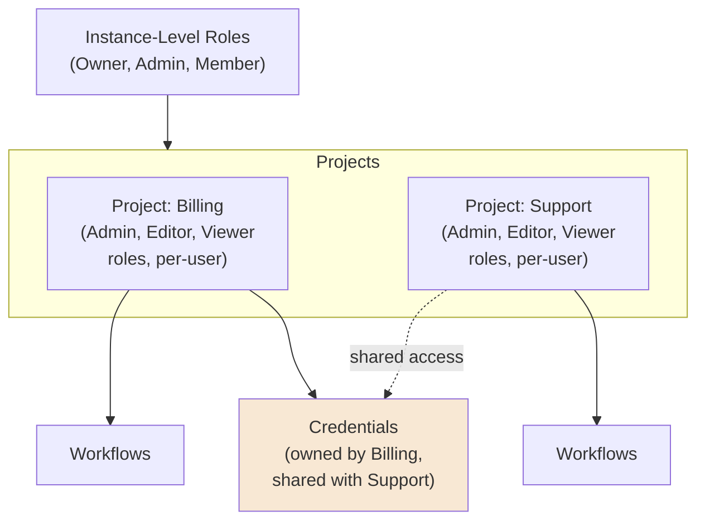
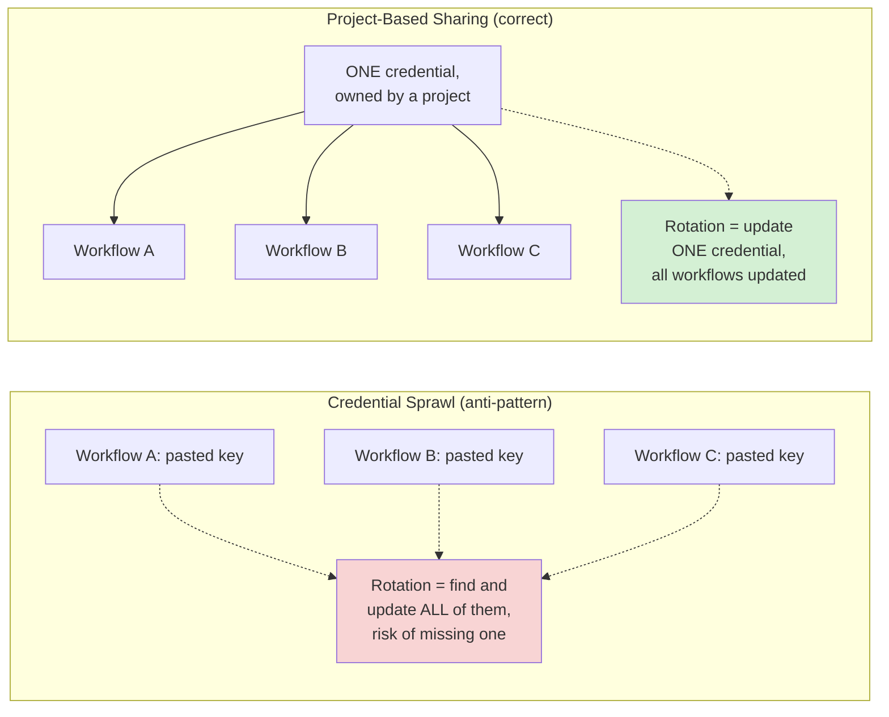
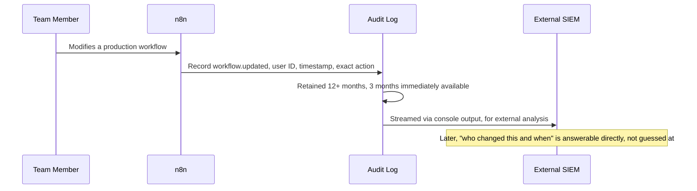
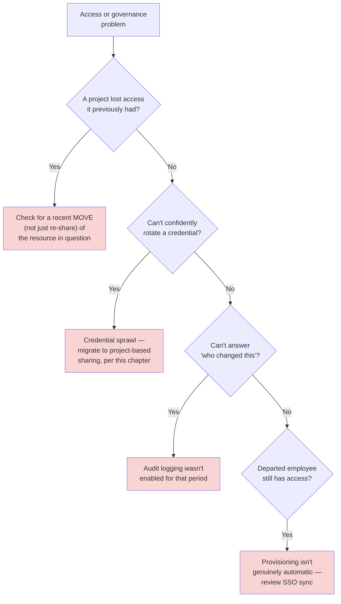
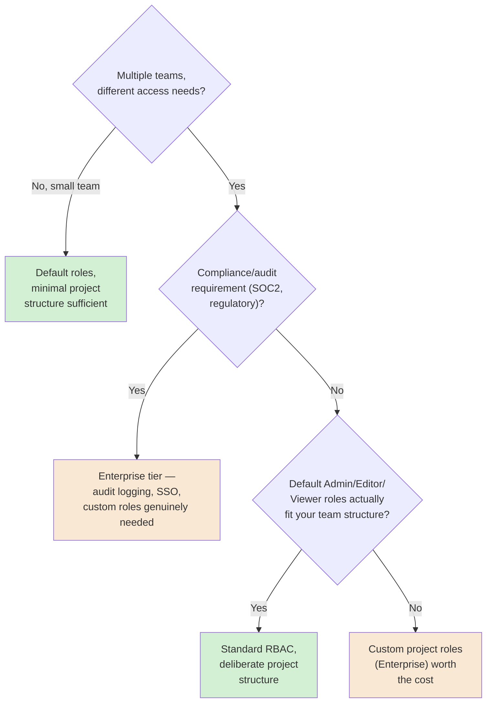

# Chapter 18 — Governance and Compliance

## Learning Objectives

By the end of this chapter, you will be able to:

- Organize workflows and credentials into **Projects**, and explain n8n's current two-tier RBAC model — instance-level roles plus project-level roles.
- Explain why **credential sprawl** (the same API key pasted into a dozen workflows) happens, and how project-based credential sharing structurally prevents it.
- Configure **custom project roles** for granular permission needs beyond the default Admin/Editor/Viewer set.
- Enable **audit logging**, and know exactly what it captures, and for how long.
- Explain the real, concrete gotcha of moving a shared resource between projects — it **strips existing sharing** — and design around it deliberately.
- Set up SSO/SAML-based **user provisioning**, syncing roles from an identity provider at both the instance and project level.
- Apply Chapter 08's Git-based environments as part of a complete governance story, not just a deployment mechanic.
- Design a real governance policy answering, for any given system: who can see this, who can change this, and is there a record of who did.

## Prerequisites

- **Chapters completed:** Chapter 04 (Credentials Manager basics), Chapter 08 (Git-based environments), Chapter 17 (log streaming, audit-adjacent observability) — this chapter is where all three converge into a full governance discipline. This is Module 4's final chapter.
- **Tools installed:** Same instance from previous chapters. Some capabilities described (custom project roles, SSO/SAML, audit logging) are confirmed current **Enterprise-tier** features — described accurately even where not directly executable on a lower tier.

## Estimated Reading Time

70–85 minutes

## Estimated Hands-on Time

3 hours

---

## ⚡ Fast Read

> **Skim time: 5 minutes**

- **What it is:** How to organize who can see, use, and change what — Projects, two-tier RBAC, audit logging, and SSO-based user provisioning — closing out Module 4's production discipline.
- **Why it matters:** Every chapter in this course has assumed a single builder with full access to everything. Real organizations don't work that way, and the most common real failure mode when they try to retrofit access control isn't a dramatic breach — it's the same API key, pasted into a dozen workflows, that nobody can safely rotate without knowing what it'll break.
- **Key insight:** n8n's Project system isn't just an organizational nicety — it's the structural fix for credential sprawl. A credential shared through a project, used by every workflow in that project, is one thing to rotate. A credential pasted individually into a dozen workflows is a dozen separate, undiscoverable things.
- **What you build:** A real project structure with correctly-scoped roles, one properly-shared credential replacing a sprawl anti-pattern, and audit logging capturing exactly who changed what and when.
- **Jump to:** [Core Concepts](#core-concepts) | [First Project](#beginner-implementation) | [Best Practices](#best-practices) | [Mini Project](#mini-project)

---

## Why This Topic Exists

This course has, by necessity, taught you as if you were the only person who'd ever touch your n8n instance. Real production automation isn't built by one person working alone — it's built by teams, with different people needing different levels of access to different things, and with a real, recurring need to answer "who did this, and when" after the fact. This chapter is where that reality gets addressed directly, closing out Module 4's production discipline with the piece that's easiest to skip early and most expensive to retrofit late.

The specific, real failure mode this chapter centers on — credential sprawl — deserves the emphasis it gets because it's genuinely common and genuinely costly in a specific, quiet way. It doesn't look like an incident when it happens. It looks like convenience: someone needs an API key in a new workflow, so they paste it in directly, rather than figuring out the "correct" sharing mechanism. Six months later, that key needs to be rotated (a compromise, a policy requirement, an employee departure), and nobody can say with confidence which workflows will break if it's changed — because nobody tracked where it actually ended up. n8n's Project system, covered in this chapter, is the structural fix: not a policy asking people to be more careful, but an actual mechanism that makes the careful path the easy one.

## Real-World Analogy

Think about the difference between a building where every employee has their own personal copy of every door key, made independently whenever they need access to something — versus a building with a real keycard system, where access is granted through a role, tracked centrally, and revocable without needing to physically track down every copy of a key that's floated out into the building over the years.

The first system feels convenient in the moment — someone needs access, someone cuts them a key. The problem shows up later, when a key needs to be invalidated (someone left, a key was lost) and nobody has a reliable list of who actually has a copy. The second system takes a bit more setup up front — defining roles, assigning them through a real system — but makes revocation, auditing, and "who can currently get into this room" trivially answerable at any time. This chapter is about building the second kind of building, not the first.

---

## Core Concepts

### Project

**Technical definition:** n8n's current organizational unit — every user has a personal project by default, and can additionally be a member of one or more team projects; workflows, credentials, folders, and data tables are each linked to projects, with one **owner project** and the ability to be shared with additional projects.

**Plain English:** A named group that workflows, credentials, and people belong to — the actual container access control is built around.

**Analogy:** A department within the building from this chapter's opening analogy — its own space, its own people, its own keycard rules, distinct from other departments.

### Two-Tier RBAC

**Technical definition:** n8n's confirmed current permission model — **instance-level (global) roles** (Owner, Admin, Member) determine broad, instance-wide permissions; **project-level roles** (Admin, Editor, Viewer, as a default set) determine what a user can actually do *within a specific project* — and a single user can hold different project roles in different projects simultaneously.

**Plain English:** Two separate layers of "what can this person do" — one broad, instance-wide layer, and one specific, per-project layer that can differ project to project.

**Analogy:** A building-wide security clearance level (instance role) combined with a specific department's own access rules for that person specifically (project role) — someone might be a general employee building-wide, but a full department lead specifically within one team's space.

### Custom Project Roles

**Technical definition:** A confirmed current **Enterprise-tier** feature letting admins define roles beyond the default Admin/Editor/Viewer set, with granular, specifically-defined permissions, managed from a dedicated Project Roles settings section.

**Plain English:** Building your own, more specific access levels when the default three don't fit your team's actual structure.

**Analogy:** A building whose standard keycard system offers only "full access" or "no access" to a room, upgraded to a system that can grant "read the reports in this room, but can't remove them" — a real, specific, in-between permission the default system couldn't express.

### Credential Sprawl / Project-Based Credential Sharing

**Technical definition:** **Credential sprawl** is the anti-pattern of the same secret (an API key, for instance) being independently pasted into multiple workflows rather than referenced from one shared source — n8n's structural fix is **project-based credential sharing**: a credential created within a project is accessible to project members per their role, with credential *sharing* itself controllable only by project admins.

**Plain English:** The difference between one key, properly shared and trackable, versus a dozen untracked copies of the same key scattered across separate workflows.

**Analogy:** This chapter's own opening analogy, restated precisely — the keycard system (one credential, tracked, revocable) versus everyone independently cutting their own physical copy of the same key (sprawl).

> This is this chapter's central, load-bearing concept, and its Production Issue is built entirely around what happens when it's ignored. A credential shared correctly through a project is **one thing** to rotate, with a clear, discoverable list of exactly what depends on it. A sprawled credential is an unknown number of separate, undiscoverable dependencies.

### Resource Ownership vs. Sharing

**Technical definition:** Confirmed current model — every resource (workflow, credential, folder, data table) has exactly one **owner project**, but can be **shared** with additional projects beyond that owner, giving members of those other projects access without transferring ownership.

**Plain English:** One project genuinely owns a resource; other projects can be granted access to it without taking it over.

**Analogy:** A department that owns a piece of shared equipment, but lends access to another department, without giving up ownership of it.

### The Move-Strips-Sharing Gotcha

**Technical definition:** A real, confirmed current behavior worth knowing before it surprises you: **moving a workflow or credential to a different project (changing its owner) removes all of its existing sharing** — any other project that previously had access loses it, silently, as a direct consequence of the move.

**Plain English:** Reassigning a resource's home base doesn't just change who owns it — it also cuts off everyone else who previously had access, as a side effect you have to know to expect.

**Analogy:** Moving a piece of shared department equipment to a new department's storage room — and discovering that every other department that used to have a key to reach it has now lost access, as an automatic, non-obvious consequence of the physical move.

> This is a real, concrete, currently-documented gotcha this chapter treats as a Common Mistake in its own right — reorganizing project structure without accounting for this can silently break every workflow in a project that was depending on shared access to a resource that just got moved out from under it.

### Audit Log

**Technical definition:** A confirmed current Enterprise feature (`N8N_AUDIT_LOG_ENABLED=true`) recording specific governed events (e.g., `workflow.updated`) with timestamp, user ID, and the exact action taken — confirmed current retention of **at least 12 months** of history, with **at least the last 3 months immediately available** for analysis, and the ability to pipe events to an external SIEM via console output.

**Plain English:** A real, detailed, who-did-what-when record — the actual answer to "who changed this, and when," not just "something changed."

**Analogy:** The keycard system's own access log — not just "the door was opened," but specifically who opened it and at what time, kept for a real, defined retention period.

### SSO/SAML User Provisioning

**Technical definition:** A confirmed current Enterprise feature — SSO, SAML, and LDAP support, with **user provisioning** automating access management by syncing users and roles from an external identity provider (IdP) into n8n, at both the instance and project level.

**Plain English:** Your existing corporate identity system (the one that already knows who's on your team and what they're allowed to do) automatically keeps n8n's own access in sync — nobody manually recreates that setup a second time inside n8n.

**Analogy:** The building's keycard system automatically staying in sync with HR's own records of who's currently employed and what department they're in — rather than someone in building security manually re-entering that information separately.

### Environments as Governance

**Technical definition:** Chapter 08's own Git-based source control and environments, revisited here explicitly as a governance mechanism — a workflow diff reviewed before promotion is a real access-control and change-management gate, not just a deployment convenience.

**Plain English:** The dev → staging → production promotion pipeline from Chapter 08 is also, quietly, a governance tool — nothing reaches production without passing through a reviewable checkpoint.

**Analogy:** A building's own change-control process for anything structural — nothing gets modified without going through a review, the same discipline this chapter applies to workflow changes reaching production.

---

## Architecture Diagrams

### Diagram 1 — The Project/RBAC Model



### Diagram 2 — Credential Sprawl vs. Project-Based Sharing



## Flow Diagrams

### Diagram 3 — Audit Log Capturing a Real Change



---

## Beginner Implementation

> **No-code path.** No coding required.

**Goal:** A first, real project structure — Aperture Cloud's "Billing" and "Support" teams.

1. Create two projects: **Billing** and **Support**.
2. Add team members to each, assigning project roles (Admin, Editor, or Viewer) deliberately per person, not defaulting everyone to Admin.
3. Build a simple workflow inside the Billing project, and confirm a Support project member (with no explicit access) **cannot** see or use it.
4. Explicitly share that workflow with the Support project, and confirm Support members can now access it, per their own project role.

**What you just built:** A real, working example of Diagram 1's model — access genuinely scoped by project membership and role, not a flat, everyone-sees-everything instance.

---

## Intermediate Implementation

> **Fixing a real credential sprawl anti-pattern.**

**Goal:** Replace a sprawled credential with correct project-based sharing, and directly experience the move-strips-sharing gotcha.

1. Deliberately reproduce the anti-pattern first: create three separate workflows (in different projects, if you have them from the Beginner Implementation), each with its **own, independently-configured** copy of the same API credential (Chapter 04's Credentials Manager, used incorrectly here on purpose).
2. Now do it correctly: create **one** credential, owned by a single project, and **share** it with the other projects that need it — replacing each workflow's independent copy with a reference to this one, shared credential.
3. Rotate the shared credential's value (a real key change, or a simulated one) and confirm **every** workflow referencing it picks up the change automatically — versus the sprawled version, where you'd have needed to find and update three separate copies.
4. Now reproduce this chapter's own documented gotcha directly: **move** the shared credential to a different project's ownership, and confirm the other projects that previously had shared access **lose it** as a direct, automatic consequence — exactly as this chapter's Core Concepts describe.

**What to notice:** Step 3 is the entire, concrete point of avoiding sprawl — one rotation, one place, versus a hunt across every workflow that might have an independent copy. Step 4 is a real, easy-to-be-surprised-by consequence worth knowing before it happens to you in production.

---

## Advanced Implementation

> **Engineering-depth path.** Audit logging and SSO-based provisioning (described accurately as Enterprise-tier capabilities).

**Goal:** Enable audit logging and understand exactly what it captures; design (and, where your tier allows, configure) SSO-based provisioning.

1. On a tier that supports it, set `N8N_AUDIT_LOG_ENABLED=true`. Make a real, deliberate change to a workflow (per Diagram 3), and confirm the audit log captures the event with timestamp, user ID, and the specific action — not just "something happened."
2. Configure (or, if not on Enterprise, design and document) piping audit log output to an external destination — per this chapter's Core Concepts, via console output to a SIEM.
3. Design (on paper, if not directly configurable on your tier) an SSO/SAML provisioning setup for Aperture Cloud: which identity provider groups map to which n8n instance-level and project-level roles, and how a departing employee's access is automatically revoked the moment their IdP record is deactivated — the real governance payoff of provisioning being automatic rather than manually maintained in two separate systems.

```text
// The real governance question this exercise is teaching you to answer,
// concretely, for any system:
//
// WHO can currently see this? (project membership + role)
// WHO can currently change this? (project role — Editor/Admin, or a
//   custom role with the specific permission)
// IS THERE A RECORD of who changed it, and when? (audit log)
// WHAT HAPPENS when someone leaves? (SSO provisioning — automatic, not
//   a manual checklist item someone has to remember)
```

**The common mistake alongside the correct pattern:**

```text
WRONG: Enable audit logging only after a real incident, when the
question "who changed this" already needs answering and the historical
record doesn't exist for anything before that point.

RIGHT: Enable it as a standing, default practice on any production
instance from the start, per this chapter's Best Practices.
```

**How to debug it when it breaks:** If a project suddenly loses access to a resource it previously had, check whether that resource was recently **moved** (not just re-shared) — per this chapter's own documented gotcha, a move silently strips prior sharing. If a departing employee's access wasn't actually revoked, check whether provisioning is genuinely automatic (SSO-synced) or was a manual process someone forgot to complete.

**The production version, where it differs from the learning version:** The learning version manually shares one credential across a few projects. A production version at real organizational scale typically defines project structure and default sharing rules deliberately, upfront, as part of onboarding a new team — not improvised project-by-project as needs arise, which is exactly how credential sprawl originally happens in the first place.

---

## Production Architecture

- **Project structure should mirror real organizational boundaries**, not be an afterthought bolted onto an already-sprawling instance — the same "design it deliberately from the start" discipline this course has applied to every other architectural decision.
- **Audit logging should be enabled before it's needed**, not reactively after an incident makes the gap in your own historical record obvious.
- **SSO provisioning's real governance value is automatic deprovisioning** — a departing employee's access disappearing the moment their IdP record does, rather than depending on someone remembering a manual offboarding checklist item.
- **Environments (Chapter 08) and Projects are complementary, not redundant** — environments govern *where* a workflow version lives in its lifecycle (dev/staging/production); projects govern *who* can see and change it at any given point in that lifecycle.

---

## Best Practices

1. **Never paste the same credential into multiple workflows independently** — project-based sharing exists specifically to prevent credential sprawl; use it from the start.
2. **Assign project roles deliberately, per person** — never default everyone to Admin because it's the path of least resistance in the moment.
3. **Know the move-strips-sharing gotcha before you reorganize project structure** — audit what's currently shared with a resource before moving its ownership.
4. **Enable audit logging as a standing default on any production instance**, not a reactive measure.
5. **Use SSO provisioning for its real governance value — automatic deprovisioning** — not just as a login convenience.
6. **Treat Chapter 08's environments and this chapter's projects as complementary governance layers**, both deliberately designed, not one substituting for the other.

---

## Security Considerations

- **Credential sprawl is a real, direct security risk, not just an operational inconvenience** — an unrotatable credential is a credential that stays valid indefinitely once compromised, because nobody can confidently rotate it without knowing what it'll break.
- **Audit logs are themselves sensitive data** — who has access to read them deserves the same deliberate, role-based scrutiny this chapter applies to everything else, not an oversight.
- **SSO/SAML provisioning reduces standing credential risk generally** — fewer separately-managed n8n-specific passwords means fewer independent credentials that could themselves be compromised, a real, indirect security benefit beyond convenience.

## Cost Considerations

RBAC (beyond Community edition) is confirmed current on all paid plans — real, meaningful governance without requiring the top Enterprise tier. **Custom project roles, audit logging, and SSO/SAML/LDAP are confirmed current Enterprise-tier-gated features specifically** — a real, direct cost consideration for any team needing granular custom permissions or a genuine compliance audit trail. Weigh this honestly: a smaller team may get real, sufficient governance value from the default Admin/Editor/Viewer roles and basic project structure alone; a larger, compliance-obligated organization will likely find the Enterprise tier's audit logging and SSO provisioning genuinely necessary, not optional polish.

## Common Mistakes

**Mistake 1 — Credential sprawl.**
```text
WRONG: The same API key pasted independently into a dozen workflows.
RIGHT: One credential, owned by a project, shared correctly, per this
chapter's Intermediate Implementation.
```

**Mistake 2 — Moving a resource without checking existing sharing first.**
```text
WRONG: Reassigning a credential or workflow's owner project without
checking what currently depends on its existing sharing.
RIGHT: Audit current sharing before any move, per this chapter's
documented gotcha.
```

**Mistake 3 — Enabling audit logging only after an incident.**
```text
WRONG: No audit trail exists for the period actually under
investigation, because logging was only turned on afterward.
RIGHT: Standing default from day one, per this chapter's Best Practices.
```

## Debugging Guide



| Symptom | Likely cause | Where to look |
|---|---|---|
| A project unexpectedly lost access to a resource | A recent move (not re-share) of that resource's ownership | Recent ownership changes on the affected resource |
| Can't confidently rotate a credential | Credential sprawl — unknown independent copies | Audit every workflow for independently-pasted copies of the same secret |
| Can't answer "who changed this" | Audit logging wasn't enabled at the relevant time | Whether N8N_AUDIT_LOG_ENABLED was set before the change in question |
| A departed employee retains access | Provisioning isn't genuinely automatic | SSO/IdP sync configuration and timing |

## Performance Optimisation

> Illustrative Aperture Cloud measurements, not a published benchmark.

In an illustrative comparison, rotating a sprawled credential (independently pasted into 8 workflows) took a full afternoon of manual auditing to even confirm all 8 locations before rotating anything, with real risk of missing one. The same rotation, using one project-shared credential, took under five minutes — update once, every dependent workflow picks it up automatically. The lesson: **the time invested in correct project-based sharing up front is repaid, with real interest, the very first time a credential actually needs to be rotated.**

---

## Technology Comparison

| Platform | Access control model | Audit/compliance features |
|---|---|---|
| **n8n** | Two-tier RBAC (instance + project), custom project roles (Enterprise) | Audit logging, SSO/SAML/LDAP (Enterprise) |
| **Windmill / Temporal** | Code-first platforms with their own, generally more engineer-oriented access control models | Varies; typically requires more custom integration for compliance-grade audit trails |
| **Zapier / Make** | Simpler, typically team/workspace-based sharing, less granular than n8n's project + custom-role model | Audit/compliance features generally also gated to higher tiers, a similar pattern to n8n's own |

## Decision Framework — How Much Governance Structure Do You Actually Need?



---

## Real Client Scenario — Aperture Cloud's Credential Audit

Aperture Cloud, preparing for a SOC 2 compliance review, audited every credential across their instance and discovered exactly this chapter's central anti-pattern: a payment-processor API key had been independently pasted into six different workflows over eighteen months, by four different team members, none of whom knew about the others' copies. This is a purely internal, infrastructure-governance scenario — low-stakes from an autonomy standpoint, but a real, direct security and compliance exposure regardless. The team consolidated all six into one project-owned, properly-shared credential, following exactly this chapter's Intermediate Implementation, and enabled audit logging going forward so the next review would have a real, complete record rather than requiring another manual archaeology exercise.

---

### Production Issue: The API Key Nobody Could Safely Rotate

**Symptoms**

Aperture Cloud received a routine security notice that a third-party API key needed rotation following the vendor's own credential-rotation policy. The team **could not confidently identify every workflow depending on it** — the key had been pasted independently into multiple workflows over time, by different people, with no central record of where.

**Root Cause**

Classic credential sprawl, exactly per this chapter's Core Concepts: the credential had never been created as a shared, project-owned resource — each workflow builder, needing the same API access, had independently added their own copy via the Credentials Manager (Chapter 04), technically correct in isolation, but never tracked as a single, shared, discoverable resource.

**How to Diagnose It**

Audit every credential of the affected type across the instance (n8n's own credential list, cross-referenced against every workflow using a credential of that type) — the absence of a single, shared, project-owned credential, replaced by multiple independently-named copies, is the direct signature of sprawl.

**How to Fix It**

```text
BEFORE: 6 independently-configured copies of the same API key, across
6 different workflows, no central record of the full list.

AFTER: 1 credential, owned by a single project, shared with every
project whose workflows genuinely need it — each of the original 6
workflows updated to reference this one shared credential instead of
its own independent copy.
```

Rotation, going forward, became a single, five-minute action instead of a full audit-and-hunt exercise every time it was needed.

**How to Prevent It in Future**

Treat "does a new credential need already exist as a shared project resource before I create another copy" as a required check before adding any credential, per this chapter's Best Practices — and periodically audit for sprawl proactively (per this chapter's Real Client Scenario), rather than only discovering it reactively when a rotation notice arrives and the hunt becomes urgent.

---

## Exercises

1. **(20 min)** For your own instance (or exercises from this course), list any credential you may have created more than once for the same underlying secret.
2. **(45 min)** Build the Beginner Implementation's two-project structure with deliberately-assigned roles.
3. **(60 min)** Build the Intermediate Implementation — reproduce credential sprawl, fix it with project-based sharing, and reproduce the move-strips-sharing gotcha directly.
4. **(45 min)** Enable (or design, if not on a supporting tier) audit logging, and document exactly what it would capture for a real change you make.
5. **(30 min)** Design an SSO provisioning mapping (on paper) for a hypothetical Aperture Cloud org structure — which IdP groups map to which n8n roles.

## Quiz

**1. What are n8n's two tiers of RBAC, and how do they relate?**
> Instance-level (global) roles — Owner, Admin, Member — determine broad, instance-wide permissions. Project-level roles — Admin, Editor, Viewer by default — determine what a user can do within a specific project, and can differ across projects for the same user.

**2. What structural problem does project-based credential sharing solve?**
> Credential sprawl — the same secret independently pasted into multiple workflows, making rotation a risky, incomplete hunt instead of a single, confident action.

**3. What real, confirmed consequence does moving a shared resource to a new owner project have?**
> It strips all existing sharing — any project that previously had access loses it, as an automatic, non-obvious side effect of the move.

**4. What does n8n's audit log confirmed-currently capture, and for how long is it retained?**
> Specific events (e.g., workflow.updated) with timestamp, user ID, and the exact action — at least 12 months of history, with at least the last 3 months immediately available.

**5. What's the real governance value of SSO-based user provisioning, beyond login convenience?**
> Automatic deprovisioning — a departing employee's access is revoked the moment their identity provider record is deactivated, rather than depending on a manual offboarding step someone might forget.

**6. Who can share a project-owned credential, per n8n's current confirmed model?**
> Only project admins.

**7. What's the difference between a resource's owner project and a project it's shared with?**
> The owner project has primary ownership; shared projects gain access without taking over ownership — and only the owner project relationship is affected by a move.

**8. Why does this chapter treat Chapter 08's environments and this chapter's projects as complementary, not redundant?**
> Environments govern where a workflow version lives in its lifecycle (dev/staging/production); projects govern who can see and change it at any given point in that lifecycle — two different governance questions.

**9. In this chapter's Production Issue, what specifically made the credential impossible to confidently rotate?**
> It had been independently pasted into 6 different workflows by different people over time, with no central, shared record of where it had ended up — rotation risked breaking any of the untracked copies.

**10. What's the recommended timing for enabling audit logging, per this chapter's Best Practices?**
> As a standing default from the start of any production instance — not reactively, after an incident has already created a gap in the historical record.

## Mini Project

**Aperture Cloud's Correctly-Shared Credential (2–3 hours)**

- [ ] Two projects with deliberately, individually-assigned roles per team member.
- [ ] One credential, correctly project-shared, replacing a deliberately-reproduced sprawl anti-pattern across at least 3 workflows.
- [ ] A written note documenting the move-strips-sharing gotcha, reproduced directly on your own test instance.

## Production Project

**Aperture Cloud's Full Governance Audit and Policy (1–2 days)**

- [ ] A real credential sprawl audit across every workflow in your test instance, with every finding consolidated into properly-shared, project-owned credentials.
- [ ] Audit logging enabled (or fully designed, if tier-restricted), with a documented example of what it would capture for a real change.
- [ ] An SSO provisioning mapping designed for a realistic org structure, including explicit handling of departing-employee deprovisioning.
- [ ] A written governance policy document (300–500 words) for Aperture Cloud: project structure principles, credential-sharing rules, and audit logging requirements — closing out this course's Module 4 with a real, standing operational policy.

## Key Takeaways

- n8n's Project system is the structural fix for credential sprawl, not just an organizational nicety.
- Two-tier RBAC (instance-level + project-level) lets a single user hold different roles in different contexts, deliberately.
- Moving a shared resource strips its existing sharing — a real, confirmed gotcha worth designing around before it surprises you.
- Audit logging retains at least 12 months of history, with the last 3 months immediately available — but only for the period after it was actually enabled.
- SSO provisioning's real governance value is automatic deprovisioning, not just single sign-on convenience.
- Custom project roles, audit logging, and SSO/SAML/LDAP are all confirmed current Enterprise-tier-gated capabilities — a real, direct cost consideration.
- Environments (Chapter 08) and Projects (this chapter) are complementary governance layers, not substitutes for each other.
- The time invested in correct, upfront credential sharing is repaid the very first time that credential actually needs rotating.

## Chapter Summary

| Concept | Key Takeaway |
|---|---|
| Project | n8n's organizational unit — the actual container access control is built around |
| Two-Tier RBAC | Instance-level + project-level roles, combinable per user |
| Credential Sprawl | The real, common anti-pattern this chapter's Production Issue is built around |
| Move-Strips-Sharing | Moving a resource silently removes its existing sharing — a real, confirmed gotcha |
| Audit Log | 12+ months retained, 3 months immediately available, Enterprise-gated |
| SSO Provisioning | Automatic access sync AND deprovisioning, Enterprise-gated |

## Resources

- [n8n RBAC documentation](https://docs.n8n.io/user-management/rbac/)
- [n8n RBAC projects documentation](https://docs.n8n.io/user-management/rbac/projects/)
- [n8n credential sharing documentation](https://docs.n8n.io/credentials/credential-sharing/)
- [n8n custom project roles documentation](https://docs.n8n.io/user-management/rbac/custom-roles/)

## Glossary Terms Introduced

| Term | One-line definition |
|---|---|
| Project | n8n's organizational unit for workflows, credentials, and access |
| Two-Tier RBAC | Instance-level roles plus project-level roles, combinable per user |
| Custom Project Roles | Enterprise-tier, granular permission sets beyond the default three |
| Credential Sprawl | The anti-pattern of a secret pasted independently into many workflows |
| Move-Strips-Sharing | Moving a resource's ownership silently removes existing sharing |
| Audit Log | A detailed, retained record of who changed what, and when |
| SSO/SAML User Provisioning | Automatic identity-provider-synced access, including deprovisioning |

## See Also

| Topic | Related Chapter | Why |
|---|---|---|
| Connecting to the World | Chapter 04 | Credentials Manager basics, extended here into project-based sharing |
| Modular Workflow Design | Chapter 08 | Environments, now framed explicitly as a governance mechanism |
| Observability | Chapter 17 | Log streaming, the direct technical foundation this chapter's audit logging builds on |
| Securing n8n in Production | Chapter 19 | Full production security hardening, building on this chapter's access-control foundation |

## Preparation for Next Chapter

**Technical checklist:**
- [ ] Built a real project structure with deliberately-assigned roles.
- [ ] Fixed a reproduced credential sprawl anti-pattern with correct project-based sharing.
- [ ] Documented what audit logging would capture for a real change.

**Conceptual check:**
- Why does moving a shared resource strip its existing sharing, and why does that matter for how you reorganize projects?
- Why is SSO provisioning's deprovisioning behavior its real governance value, not just login convenience?

**Optional challenge:** Module 4 is complete. Before Chapter 19, review this module's own thread — Chapters 14 through 18 took this course from "a workflow that runs" to a genuinely production-grade system: custom code done safely (14), actually deployed (15), scaled correctly (16), observed honestly (17), and now governed properly (18). Chapter 19 is this course's final production discipline: security, specifically — bringing every threat this module has touched on into one, complete, current picture.

---

> **Currency Note:** This chapter's n8n-specific facts (the two-tier RBAC model, Project/credential-sharing mechanics including the move-strips-sharing behavior, audit logging's retention and configuration, and SSO/SAML/LDAP provisioning) were verified against `docs.n8n.io` in July 2026, including confirmation of which specific capabilities are Enterprise-tier-gated.
