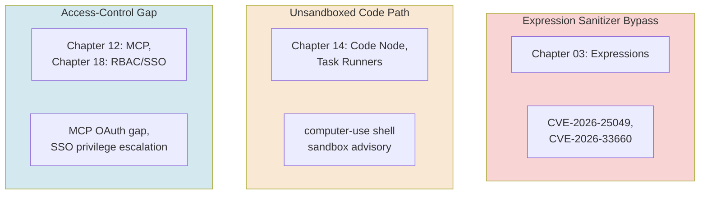
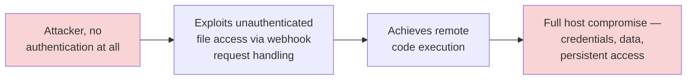
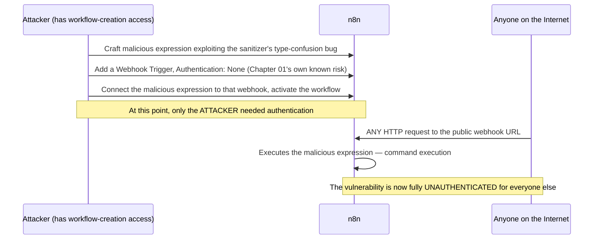
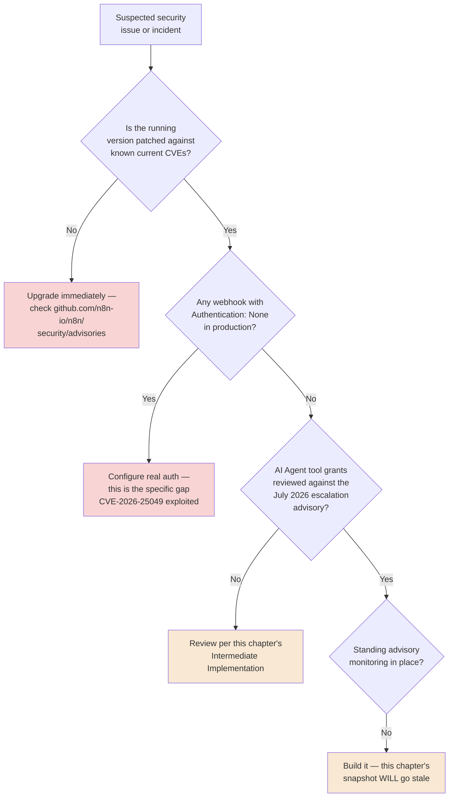
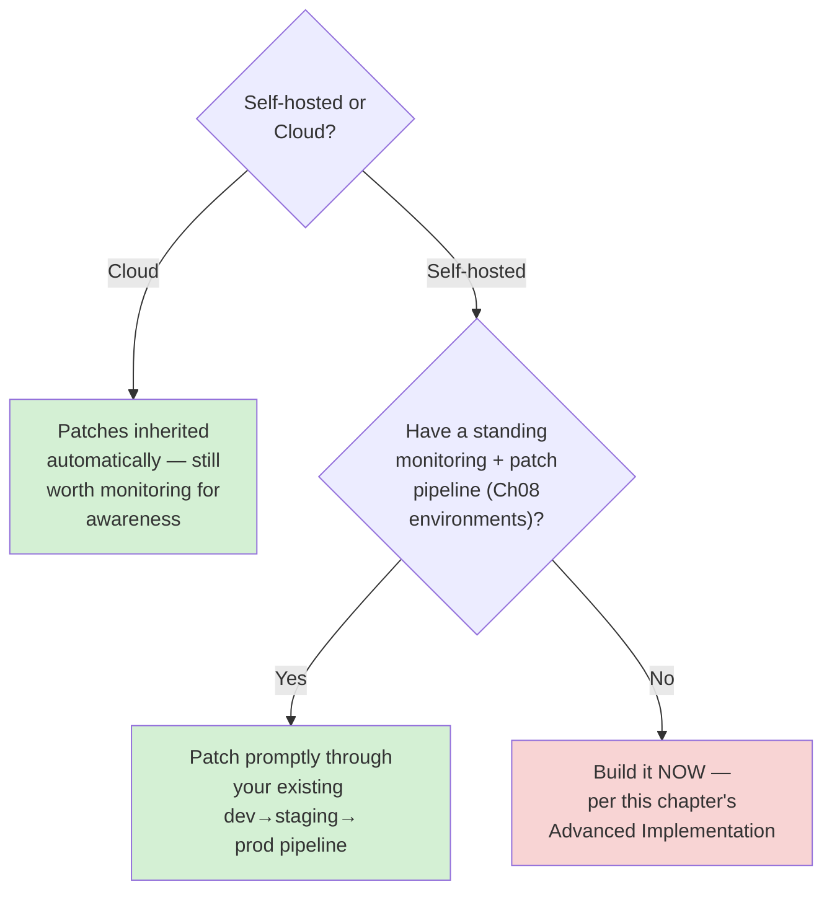

# Chapter 19 — Securing n8n in Production

## Learning Objectives

By the end of this chapter, you will be able to:

- Explain the current n8n vulnerability landscape as of July 2026, including the **Ni8mare** unauthenticated RCE, **CVE-2026-25049's** expression-sanitizer bypass, and a real, extremely recent batch of disclosures.
- Recognize the **three recurring root-cause families** behind nearly every real n8n CVE this course has encountered: expression sanitization bypasses, unsandboxed code paths, and access-control gaps — and map each back to the specific chapter that taught the feature it affects.
- Explain how combining an authenticated-only vulnerability with an **unauthenticated webhook** turns it into a fully unauthenticated attack — and avoid creating that exact combination.
- Recognize **AI Agent-specific privilege escalation** as a genuinely new vulnerability class this course's Module 3 content didn't fully anticipate, and apply Chapter 11's blast-radius discipline to it directly.
- Audit credential hygiene across an entire instance, unifying Chapter 04, Chapter 14, and Chapter 18's separate threads into one complete practice.
- Configure webhook authentication defensively, closing the specific gap that turns authenticated-only RCE into unauthenticated RCE.
- Apply prompt-injection defenses (Chapter 09's Guardrails node) as a genuine security control, not just a quality control.
- Build a real, standing security-patching and advisory-monitoring practice — a required operational discipline, not a one-time hardening pass.

## Prerequisites

- **Chapters completed:** This chapter assumes the entire course — it's a deliberate synthesis of security material introduced throughout: Chapter 01 (webhook auth), Chapter 03 (expressions, Merge SQL Query mode), Chapter 04 (CVE-2026-33660, credentials), Chapter 09 (prompt injection, Guardrails), Chapter 11 (blast radius, multi-agent), Chapter 12 (MCP security crisis), Chapter 14 (supply chain, sandboxing), Chapter 17 (alerting), Chapter 18 (RBAC, credential sprawl).
- **Tools installed:** Same instance from previous chapters.

## Estimated Reading Time

80–95 minutes

## Estimated Hands-on Time

3.5 hours

---

## ⚡ Fast Read

> **Skim time: 5 minutes**

- **What it is:** A complete, current picture of n8n's real security landscape — the maximum-severity Ni8mare RCE, a real expression-sanitizer bypass, and a genuinely fresh batch of 10 advisories published this same week, several of which hit directly on Module 3's AI Agent and MCP content.
- **Why it matters:** This isn't a hypothetical threat model. Every major vulnerability class this chapter covers has a real, named, dated CVE behind it, several disclosed within days of this chapter being written — a live, current reminder that "secure by default" was never true of this platform, and staying current is a standing job, not a one-time setup task.
- **Key insight:** Nearly every real n8n CVE this course has encountered traces back to one of three recurring root causes: an expression sanitizer that didn't hold, a code path that wasn't actually sandboxed, or an access-control check that was missing where it mattered. Recognizing the pattern is more valuable than memorizing any single CVE number.
- **What you build:** A full credential and webhook-auth audit across your own instance, a review of every AI Agent tool grant through the specific lens of a real, current privilege-escalation advisory, and a standing security-monitoring workflow watching for the next disclosure — not just reacting to this chapter's list.
- **Jump to:** [Core Concepts](#core-concepts) | [First Audit](#beginner-implementation) | [Best Practices](#best-practices) | [Mini Project](#mini-project)

---

## Why This Topic Exists

Every chapter in this course has introduced a real security consideration specific to its own topic — Chapter 01's unauthenticated webhooks, Chapter 04's CVE-2026-33660, Chapter 09's prompt injection, Chapter 12's MCP ecosystem crisis, Chapter 14's supply-chain attack, Chapter 18's credential sprawl. Each of those was real, current, and scoped narrowly to its own chapter's subject. This chapter exists to do something none of those could: step back and show you the **whole current picture** at once — not a list of isolated incidents, but a small number of recurring patterns that explain why they keep happening, and a standing practice for staying current as new ones inevitably get disclosed after this book is written.

That last point deserves to be said plainly, because it's the single most important thing this chapter can teach: **this list will be out of date by the time you read it.** n8n ships frequently, and so do its vulnerabilities — this chapter was written days after a real batch of 10 new advisories, several hitting directly on content this course teaches. The specific CVE numbers in this chapter are a snapshot, not a permanent reference. The recurring patterns behind them, and the standing practice of actually watching for what comes next, are what this chapter is really teaching you to take with you.

## Real-World Analogy

A building's security isn't one decision made once at construction — it's a standing practice: locks get re-keyed, alarm systems get patched, and a real security team keeps watching for new ways a determined person might get in, because new ones keep getting discovered, on every kind of building, indefinitely. A building that was "secured" once, five years ago, and never revisited, isn't secure today — it's just unaudited.

This chapter is that standing security practice, applied to n8n specifically: not a single hardening checklist you complete once, but the discipline of actually knowing what's currently known to be exploitable, understanding the recurring patterns behind why, and watching for what's disclosed next.

---

## Core Concepts

### Vulnerability Class

**Technical definition:** A recurring category of root cause behind multiple, distinct CVEs — more durable and more useful to understand than any single vulnerability, because it predicts where the *next* one is likely to appear.

**Plain English:** The pattern behind the specific incidents, not just the incidents themselves.

**Analogy:** A building inspector who understands *why* certain kinds of wiring fail generally can predict risk in a building they've never seen before — far more useful than only knowing about one specific building's specific past fire.

> This chapter organizes n8n's real, current CVE landscape into **three recurring classes**, confirmed directly from this chapter's own research across multiple real, dated advisories:

| Vulnerability Class | What it looks like | Course chapter that taught the affected feature |
|---|---|---|
| **Expression sanitizer bypass** | User-controlled expression content escapes the sandbox meant to contain it | Chapter 03 (expressions), Chapter 04 (CVE-2026-33660) |
| **Unsandboxed / insufficiently sandboxed code path** | A code-execution surface (Code node, computer-use shell) doesn't actually enforce its claimed isolation | Chapter 14 (Task Runners, sandboxing) |
| **Access-control gap** | A permission check that should exist, doesn't — at the workflow, project, SSO, or MCP-caller level | Chapter 12 (MCP auth), Chapter 18 (RBAC) |

### Ni8mare (CVE-2026-21858)

**Technical definition:** A confirmed, real, maximum-severity (**CVSS 10.0**) **unauthenticated remote-code-execution** vulnerability affecting self-hosted n8n instances prior to version **1.121.0** — multi-source confirmed (Cybersecurity Dive, Talos Intelligence, Dataminr, and independent security research), impacting an estimated 100,000+ internet-exposed servers globally at time of disclosure.

**Plain English:** The single worst-case n8n vulnerability this course has encountered — no login required at all.

**Analogy:** A building's front door lock that doesn't actually require a key, discovered and exploited before anyone realized the lock was decorative.

> This chapter's own Production Issue below covers this incident in full — the case study this course's kickoff planning always intended for this chapter.

### CVE-2026-25049 (Expression Sanitizer Bypass)

**Technical definition:** A confirmed, real (**CVSS 9.4**) vulnerability where inadequate sanitization — bypassing safeguards previously added for a **December 2025** predecessor flaw (CVE-2025-68613) — allowed an **authenticated** user with workflow-creation/modification permission to craft expressions triggering unintended **system command execution** on the host, via a **type-confusion bug**: the sanitizer assumed property-access keys were strings, but didn't runtime-check that assumption, letting an attacker exploit that gap to bypass sanitization entirely. Fixed in **1.123.17 / 2.5.2**.

**Plain English:** A real, current expression-syntax exploit — Chapter 03's own subject, turned into a genuine attack surface.

**Analogy:** A building's access-badge reader that correctly checks for a badge shape, but never actually verifies the badge is real — a specific, narrow gap in an otherwise-reasonable check.

> **This is the vulnerability behind this chapter's central "authenticated becomes unauthenticated" lesson.** Confirmed, real severity escalation: combined with n8n's own webhook functionality, an attacker with workflow-creation access can configure a **public webhook with authentication set to None** (Chapter 01's own known risk, revisited here with real teeth), embed the exploit payload in a connected node, and activate the workflow — at which point **any HTTP request from anywhere on the internet** triggers the same command execution, no further authentication required at all. An "authenticated-only" vulnerability became a fully unauthenticated one, entirely through a webhook configuration choice this course flagged as risky back in Chapter 01.

### The July 8, 2026 Advisory Batch

**Technical definition:** A real, current, dated batch of **10 security advisories**, all published the same day, confirmed directly from n8n's own GitHub Security Advisories — several hitting directly on this course's own Module 3 and governance content.

**Plain English:** A real, extremely fresh reminder that this landscape doesn't stand still — published in the same week this chapter was researched.

**Analogy:** A building inspection report that arrived while this chapter was still being written — not a historical case study, a live one.

| Advisory | Severity | Course chapter it hits |
|---|---|---|
| AI Agents Project Viewer Privilege Escalation via `run_node_tool` | High | Chapter 11 (multi-agent, tool grants) |
| SSO Instance-Role Provisioning Allows Privilege Escalation to Instance Owner | High | Chapter 18 (SSO provisioning) |
| Custom Header Credential Values Leaked in Plaintext into LLM Node Execution Data | Moderate | Chapter 04 (Header Auth), Chapter 09 (AI Agent execution data) |
| computer-use Shell Sandbox Not Enforced on Linux and Windows | Moderate | Chapter 14 (sandboxing) |
| Legacy Expression Evaluator Sanitizer Bypass Leads to Authenticated Code Execution | High | Chapter 03 (expressions) |
| Member-Level Users Can Execute Other Users' MCP Server Trigger Workflows via Missing OAuth Authorization Check | Moderate | Chapter 12 (MCP Server Trigger) |
| Unauthenticated Endpoint Allows Cancellation of Any User's Active Test Webhook | Moderate | Chapter 01/02 (webhook triggers) |

> **Worth being precise about, per this course's own citation discipline**: these are all real, confirmed, dated GitHub Security Advisories (GHSA identifiers), independently verifiable — not illustrative examples. Patched-version status for each should be re-confirmed directly against `github.com/n8n-io/n8n/security/advisories` before treating any as still-current risk, since this chapter is itself a snapshot.

### AI Agent Privilege Escalation

**Technical definition:** A genuinely new vulnerability category this course's Module 3 content didn't fully anticipate — a low-privilege user (a Project **Viewer**, Chapter 18's own weakest role) escalating privilege specifically **through** an AI Agent's own tool-calling mechanism (`run_node_tool`, directly related to Chapter 11's AI Agent Tool).

**Plain English:** The agent itself, not just the human operating it, became a path around access control that was supposed to constrain a low-privilege user.

**Analogy:** A building where a visitor with only lobby access discovers that asking a helpful, overly-trusting staff member (the AI Agent) to fetch something from a restricted floor actually works — the staff member's own helpfulness became the security gap, not the visitor's badge.

> This is a direct, real validation of Chapter 11's own central warning: **every nested agent is a full instance of the blast-radius principle, independently** — this advisory is exactly what happens when a tool's own execution privileges aren't scoped as tightly as the calling user's should be.

### Prompt Injection as a Security Control Boundary

**Technical definition:** Chapter 09's Guardrails node, revisited here explicitly as security infrastructure — not a quality-control nicety, but a real control boundary against a class of attack this chapter's own CVE landscape confirms is being actively targeted (Talos Intelligence's own documented tracking of threat actors weaponizing n8n specifically).

**Plain English:** The jailbreak/PII/secret-key checks from Chapter 09 aren't optional polish — they're a real defense against a documented, active threat.

**Analogy:** A building's visitor-screening process, revisited as genuine security infrastructure rather than a formality, once real intrusion attempts through that exact door are documented and ongoing.

### Standing Advisory Monitoring

**Technical definition:** A real, operational practice — subscribing to n8n's own security advisory feed and checking your running version against known-current CVEs, on a recurring schedule, integrated with Chapter 17's own observability/alerting discipline.

**Plain English:** Watching for the next one, actively, rather than only learning about it when it's already been exploited.

**Analogy:** The building's real security team, continuously reviewing new vulnerability reports across the industry, not a one-time inspection filed away and forgotten.

---

## Architecture Diagrams

### Diagram 1 — Three Vulnerability Classes, Mapped to This Course



### Diagram 2 — How Ni8mare's Attack Chain Worked



## Flow Diagrams

### Diagram 3 — CVE-2026-25049's Escalation, Step by Step



---

## Beginner Implementation

> **No-code path.** An audit, not new code.

**Goal:** Audit your own instance for the exact combination that turns authenticated-only risk into unauthenticated risk.

1. List every Webhook Trigger across your instance (from this course's own exercises, if nothing else).
2. For each, confirm its **Authentication** setting is genuinely configured (Bearer or Header, per Chapter 01/04) — not left at **None**.
3. Confirm your running n8n version against the patched versions for this chapter's named CVEs (1.121.0+ for Ni8mare, 1.123.17/2.5.2+ for CVE-2026-25049) — check directly at `github.com/n8n-io/n8n/releases`, since this chapter's own numbers are a snapshot.

**What you just built:** A real, concrete first pass at exactly the audit this chapter's Production Issue shows the cost of skipping.

---

## Intermediate Implementation

> **Reviewing AI Agent tool grants through a real, current advisory's lens.**

**Goal:** Apply Chapter 11's blast-radius discipline directly against the AI Agent privilege-escalation advisory.

1. For every AI Agent (and nested AI Agent Tool, per Chapter 11) across your instance, list its actual tool grants.
2. For each, ask explicitly: **if a Project Viewer (the lowest-privilege role, Chapter 18) could somehow reach this agent's tool-calling mechanism, what's the worst thing they could accomplish?** — the exact question this advisory's real exploitation path raises.
3. Separately, review every credential using **Header Auth** (Chapter 04) connected to any AI Agent or Chat Model node, and confirm you understand exactly what execution data an LLM node might retain or expose — per the real, current custom-header-credential-leak advisory.

**What to notice:** This is Chapter 11's blast-radius principle, applied against a real, dated, currently-documented advisory — not a hypothetical exercise.

---

## Advanced Implementation

> **Engineering-depth path.** A standing security-monitoring workflow.

**Goal:** Build the practice this chapter argues is the real, durable takeaway — not memorizing this chapter's specific CVE list, but watching for what comes next.

```javascript
// Learning example — a scheduled monitoring workflow (Chapter 02's own
// pattern) checking your running n8n version against a maintained list
// of known-vulnerable version ranges, alerting via Chapter 17's own
// consolidated alerting channel if a match is found.
//
// In a real implementation, the vulnerable-ranges list would be kept
// current by periodically checking github.com/n8n-io/n8n/security/advisories
// directly — this Code node illustrates the CHECKING logic, not a
// permanently-accurate, hardcoded vulnerability database.

const currentVersion = $json.n8nVersion; // fetched from your instance
const knownVulnerableRanges = [
  { cve: 'CVE-2026-21858', fixedIn: '1.121.0', description: 'Ni8mare unauthenticated RCE' },
  { cve: 'CVE-2026-25049', fixedIn: '1.123.17', description: 'Expression sanitizer bypass RCE' },
  { cve: 'CVE-2026-33660', fixedIn: '1.123.27', description: 'Merge node SQL Query mode file read' },
  // Real implementation: keep this list current via a periodic check
  // against n8n's own advisory feed, not a one-time hardcoded snapshot.
];

const potentialRisks = knownVulnerableRanges.filter(
  (v) => compareVersions(currentVersion, v.fixedIn) < 0 // illustrative helper
);

if (potentialRisks.length > 0) {
  return [{
    json: {
      alert: 'OUTDATED_VERSION_KNOWN_CVES',
      currentVersion,
      risks: potentialRisks,
      action: 'Upgrade immediately — verify against github.com/n8n-io/n8n/security/advisories',
    },
  }];
}

return [{ json: { alert: 'NONE', currentVersion } }];
```

Route this into Chapter 17's own consolidated alerting channel, running on a real, recurring schedule.

**The common mistake alongside the correct pattern:**

```text
WRONG: Read this chapter once, patch against the specific CVEs named
here, and consider the job done.

RIGHT: Build a standing, recurring practice (this chapter's Advanced
Implementation) that keeps checking, because this chapter's own list
will be incomplete the moment new advisories are disclosed after it was
written — which, per this chapter's own July 8, 2026 batch, happens
often.
```

**How to debug it when it breaks:** If your monitoring check reports a version as safe when it shouldn't be, confirm the vulnerable-ranges list is actually current — this is exactly the kind of check that silently degrades in value if nobody maintains it, the same false-confidence risk Chapter 17 warned about for monitoring generally.

**The production version, where it differs from the learning version:** A production version typically integrates directly with n8n's own advisory feed or a maintained CVE database (rather than a hardcoded list), and ties patch application into Chapter 08's own environment-promotion pipeline — tested in staging before reaching production, not applied blindly.

---

## Production Architecture

- **The three vulnerability classes should inform where you invest hardening effort, not just which specific CVEs you patch.** A team that understands *why* expression sanitizer bypasses keep recurring is better positioned to evaluate the next one than a team that only knows this chapter's specific list.
- **Self-hosted teams own patch application directly; Cloud users inherit n8n's own patch cadence.** This is a real, concrete extension of Chapter 15's self-hosted-vs-Cloud tradeoff — Cloud users are protected from a disclosed CVE the moment n8n patches their own infrastructure; self-hosted teams must actually apply the update themselves.
- **AI Agent tool grants need the same periodic review discipline as credential access (Chapter 18)** — the July 2026 privilege-escalation advisory is real, current evidence that agent tool-calling mechanisms are now a genuine part of your instance's attack surface, not just a capability feature.

---

## Best Practices

1. **Never leave a webhook's authentication set to None in production** — per this chapter's own central lesson, this is the specific configuration choice that turns authenticated-only vulnerabilities into unauthenticated ones.
2. **Patch against named CVEs promptly, but build the standing monitoring practice this chapter's Advanced Implementation demonstrates** — don't treat this chapter's list as complete or permanent.
3. **Review AI Agent tool grants with the same blast-radius discipline Chapter 11 taught**, specifically re-examined against real, current privilege-escalation advisories.
4. **Treat Guardrails (Chapter 09) as genuine security infrastructure**, not optional quality tooling, given documented, active threat-actor targeting.
5. **Audit credential exposure into AI Agent/LLM execution data specifically** — a real, current, confirmed leak vector distinct from credential storage itself.
6. **Subscribe to n8n's own security advisory feed as a standing operational practice**, not a one-time setup step.

---

## Security Considerations

*(This entire chapter is Security Considerations — the points below are this chapter's own final synthesis.)*

- **Recognize the pattern, not just the specific CVEs.** Expression sanitizer bypasses, unsandboxed code paths, and access-control gaps are the three durable categories worth internalizing — they'll predict risk in whatever n8n ships next, long after this chapter's specific CVE numbers are patched and forgotten.
- **The gap between "authenticated-only" and "fully unauthenticated" is often just one webhook configuration choice away** — CVE-2026-25049's real severity escalation is the concrete proof.
- **AI Agents are now a documented part of the real attack surface**, not just a capability — the July 2026 privilege-escalation advisory should be treated as a permanent update to how seriously agent tool grants are reviewed, not a one-time patch-and-forget item.

## Cost Considerations

Security is a real, recurring operational cost, not a one-time expenditure — the engineering time to actually apply patches, review advisories, and maintain a standing monitoring practice (this chapter's Advanced Implementation) is a genuine, ongoing line item, the same way Chapter 16's infrastructure scaling is. Weigh this honestly against n8n Cloud's own inherited patch cadence (Chapter 15) — for a team without dedicated security operational capacity, that inherited protection is a real, quantifiable value of the Cloud tradeoff, not just a convenience.

## Common Mistakes

**Mistake 1 — Treating this chapter's CVE list as complete or permanent.**
```text
WRONG: Patch against exactly the CVEs named in this chapter, consider
security "done."
RIGHT: Build the standing monitoring practice, per this chapter's
Advanced Implementation — new advisories are disclosed regularly.
```

**Mistake 2 — Leaving a webhook unauthenticated "for now."**
```text
WRONG: Authentication: None, meant to be temporary, never revisited —
exactly the pattern behind CVE-2026-25049's real severity escalation
AND Chapter 15's own Production Issue.
RIGHT: Real authentication configured from the start, per Chapter 01
and Chapter 04.
```

**Mistake 3 — Not re-reviewing AI Agent tool grants after this chapter's advisory.**
```text
WRONG: Tool grants set once, during Module 3, never revisited in light
of new, real privilege-escalation findings.
RIGHT: Periodic review, per this chapter's Intermediate Implementation.
```

## Debugging Guide



| Symptom | Likely cause | Where to look |
|---|---|---|
| Unexplained system behavior, possible compromise | Outdated version, known CVE | Version check against current advisories |
| Webhook receiving unexpected traffic patterns | Authentication left at None | Every production webhook's auth configuration |
| AI Agent behaving with unexpected scope | Tool grants not reviewed against current advisories | Chapter 11's blast-radius review, reapplied |
| No idea whether current version is safe | No standing monitoring practice | This chapter's Advanced Implementation |

## Performance Optimisation

> This chapter's subject is security, not raw performance — the "optimization" here is response time to a real disclosure.

The real, measurable difference this chapter argues for: a standing monitoring practice (Advanced Implementation) surfaces a new, relevant advisory within one scheduled check cycle. Without it, the same disclosure is discovered only reactively — during an actual incident, or by chance encountering this book's own necessarily-incomplete snapshot. The lesson: **detection speed for a new disclosure is itself a real, measurable security metric**, not just whether you eventually patch.

---

## Technology Comparison

| Platform | Patch responsibility | Advisory transparency |
|---|---|---|
| **n8n (self-hosted)** | Yours — apply patches directly | Public GitHub Security Advisories, confirmed current and detailed |
| **n8n Cloud** | n8n's — inherited automatically | Same public advisories, but you're protected without action |
| **Temporal / Windmill / Airflow** | Self-hosted deployments carry the same patch-application responsibility as n8n | Each maintains its own public advisory process |
| **Zapier / Make** | Entirely the vendor's — no patch action possible or needed by you | Advisory transparency is generally lower — patching happens invisibly, by design |

## Decision Framework — Patch Cadence and Responsibility



---

## Real Client Scenario — Aperture Cloud's Post-Disclosure Review

When the July 8, 2026 advisory batch was published, Aperture Cloud's team — having built this chapter's standing monitoring practice — was alerted within their own next scheduled check cycle, well before any exploitation attempt. They reviewed every AI Agent's tool grants against the privilege-escalation advisory specifically, confirmed no webhook in their instance had authentication left at None, and patched within the same business day. This is exactly the low-stakes-in-execution, high-value-in-discipline scenario this chapter argues for — the actual response was routine specifically because the standing practice already existed.

---

### Production Issue: Ni8mare — The Unauthenticated RCE That Redefined "Worst Case"

**Symptoms**

**This is a real, maximum-severity, multi-source-confirmed incident**, tracked as **CVE-2026-21858**, CVSS **10.0** — the highest possible severity score. Self-hosted n8n instances running versions prior to **1.121.0** were vulnerable to complete, **unauthenticated** remote code execution — no login, no valid credential, no prior access of any kind required. Independent scanning identified an estimated **100,000+** internet-exposed, vulnerable instances at time of disclosure.

**Root Cause**

Confirmed via multiple independent sources (Cybersecurity Dive, Talos Intelligence, Dataminr, and direct security research): the vulnerability stemmed from **unauthenticated file access via improper webhook request handling** — an attacker with no credentials at all could exploit n8n's own webhook processing to achieve arbitrary file access, escalating to full remote code execution on the host. Because this required zero authentication, it was exploitable by literally anyone who found an exposed, unpatched instance — the maximum possible blast radius for any single vulnerability this course has covered.

**How to Diagnose It**

Check your running version directly against `1.121.0` — any self-hosted instance below this version is confirmed vulnerable, full stop, regardless of any other configuration. Independent security scanners (Censys-style internet-wide scans, per Chapter 12's own MCP research) were used industry-wide to identify exposed, vulnerable instances during the disclosure window.

**How to Fix It**

```text
BEFORE: Any self-hosted n8n instance running a version prior to 1.121.0,
reachable from the internet.

AFTER: Upgraded to 1.121.0 or later, immediately — this vulnerability's
CVSS 10.0 severity and zero-authentication requirement leave no room for
"patch it eventually." Given the estimated 100,000+ exposed instances
at disclosure, treat any instance discovered still on an affected
version as potentially already compromised, not just theoretically at
risk — review for signs of compromise (unexpected credentials, unknown
workflows, unusual outbound traffic) in addition to patching.
```

**How to Prevent It in Future**

This is precisely the case this chapter's Advanced Implementation monitoring practice exists to catch **before** a disclosure of this severity ever reaches the "still vulnerable in production" stage — a standing check against current advisories, integrated with real alerting (Chapter 17), turns "discovered the hard way" into "patched within one check cycle." Talos Intelligence's own documented tracking (October 2025 through March 2026) of threat actors actively weaponizing n8n for phishing and malware delivery is a real, confirmed reminder that this isn't a theoretical actor — real, current threat activity specifically targets this platform.

---

## Exercises

1. **(30 min)** Audit every webhook across your own instance for authentication configuration, per this chapter's Beginner Implementation.
2. **(45 min)** Review every AI Agent's tool grants against the July 2026 privilege-escalation advisory, per the Intermediate Implementation.
3. **(90 min)** Build the full Advanced Implementation's standing monitoring workflow, routed into Chapter 17's consolidated alerting.
4. **(30 min)** For three CVEs named in this chapter, identify which of the three vulnerability classes each belongs to.
5. **(20 min)** Check your own running n8n version against every patched-version number cited in this chapter, and document your findings.

## Quiz

**1. What are this chapter's three recurring vulnerability classes?**
> Expression sanitizer bypass, unsandboxed/insufficiently sandboxed code path, and access-control gap.

**2. What's the CVSS score and authentication requirement for Ni8mare (CVE-2026-21858)?**
> CVSS 10.0 (maximum severity), requiring zero authentication of any kind.

**3. How did CVE-2026-25049 escalate from "authenticated-only" to "fully unauthenticated" in practice?**
> By combining the exploit with a webhook configured with Authentication: None — once activated, anyone on the internet could trigger the exploit via that public webhook, without needing the workflow-creation access the underlying flaw itself required.

**4. What real, current advisory directly validates Chapter 11's blast-radius warning about nested agents?**
> The "AI Agents Project Viewer Privilege Escalation via run_node_tool" advisory — a low-privilege user escalating specifically through an AI Agent's own tool-calling mechanism.

**5. Why does this chapter argue that memorizing its specific CVE list is less valuable than recognizing the three vulnerability classes?**
> Because the specific list will go stale as new advisories are disclosed (as demonstrated by the real, dated July 8, 2026 batch found during this chapter's own research) — the classes predict where future vulnerabilities are likely to appear, independent of any specific CVE number.

**6. What's the real, concrete difference in patch responsibility between self-hosted n8n and n8n Cloud?**
> Self-hosted teams must apply patches themselves; Cloud users inherit n8n's own patch cadence automatically, protected without taking direct action.

**7. What real, confirmed threat-actor activity does this chapter cite beyond named CVEs?**
> Talos Intelligence's documented tracking (October 2025–March 2026) of threat actors actively weaponizing n8n for phishing campaigns and malware delivery.

**8. Why does this chapter treat Chapter 09's Guardrails node as security infrastructure rather than a quality feature?**
> Because real, documented, active threat-actor targeting of this platform exists — Guardrails' jailbreak/PII/secret-key checks are a genuine control against a confirmed, ongoing risk, not just output-quality tooling.

**9. What real, current advisory specifically concerns credential values leaking into AI Agent execution data?**
> "Custom Header Credential Values Leaked in Plaintext into LLM Node Execution Data" — a real, dated GHSA advisory directly relevant to Chapter 04's Header Auth and Chapter 09's AI Agent execution data.

**10. What's the estimated number of internet-exposed, vulnerable instances at the time of Ni8mare's disclosure?**
> An estimated 100,000+, per independent security research cited in this chapter.

## Mini Project

**Aperture Cloud's Security Audit (2–3 hours)**

- [ ] Every webhook across your test instance audited for real authentication, none left at None.
- [ ] Your instance's version checked directly against every patched-version number cited in this chapter.
- [ ] A written note documenting which of the three vulnerability classes each of this chapter's named CVEs belongs to.

## Production Project

**Aperture Cloud's Standing Security Practice (1–2 days)**

- [ ] A working, scheduled advisory-monitoring workflow, routed into Chapter 17's consolidated alerting.
- [ ] Every AI Agent tool grant across your instance reviewed against the July 2026 privilege-escalation advisory, with documented findings.
- [ ] A written security posture document (300–500 words) for Aperture Cloud: current patch status, standing monitoring practice, and a defined response process for the next disclosure — closing out this course's full security thread into one operational policy.
- [ ] A written reflection (in your own words) on why this chapter's specific CVE list will be incomplete by the time you're reading this, and what that means for how you should actually use this chapter going forward.

## Key Takeaways

- Nearly every real n8n CVE this course encountered traces to one of three recurring classes: expression sanitizer bypass, unsandboxed code path, or access-control gap.
- Ni8mare (CVE-2026-21858) is a real, maximum-severity, fully unauthenticated RCE — the worst-case reference point for this entire course's security thread.
- CVE-2026-25049 shows concretely how an authenticated-only vulnerability becomes fully unauthenticated through one webhook configuration choice.
- A real, dated batch of 10 advisories, published the same week this chapter was researched, hits directly on Module 3's AI Agent and MCP content — this landscape moves fast.
- AI Agent tool grants are now a documented, real part of the attack surface, not just a capability feature — Chapter 11's blast-radius discipline applies directly.
- Guardrails (Chapter 09) is genuine security infrastructure against documented, active threat-actor targeting, not optional polish.
- Self-hosted teams own patch application directly; Cloud users inherit n8n's own patch cadence.
- This chapter's own specific CVE list is a snapshot, not a permanent reference — the standing monitoring practice is the durable takeaway.

## Chapter Summary

| Concept | Key Takeaway |
|---|---|
| Vulnerability Classes | Expression sanitizer bypass, unsandboxed code, access-control gap — the three recurring patterns |
| Ni8mare (CVE-2026-21858) | CVSS 10.0, fully unauthenticated RCE — this course's worst-case reference |
| CVE-2026-25049 | Authenticated RCE that becomes unauthenticated via an open webhook |
| July 2026 Advisory Batch | Real, current, hits directly on Module 3's AI Agent and MCP content |
| AI Agent Privilege Escalation | A genuinely new class — Chapter 11's blast radius, now proven in the wild |
| Standing Advisory Monitoring | The durable practice this chapter's specific list can't replace |

## Resources

- [n8n GitHub Security Advisories](https://github.com/n8n-io/n8n/security/advisories) — the primary, current source this entire chapter is grounded in
- [n8n security advisory blog](https://blog.n8n.io/security-advisory-20260108/)
- Talos Intelligence's "n8n n8mare" threat-actor tracking report

## Glossary Terms Introduced

| Term | One-line definition |
|---|---|
| Vulnerability Class | A recurring category of root cause behind multiple CVEs |
| Ni8mare | CVE-2026-21858, a real, CVSS 10.0, fully unauthenticated RCE |
| CVE-2026-25049 | Expression sanitizer bypass RCE, escalates via unauthenticated webhooks |
| AI Agent Privilege Escalation | A new class — low-privilege access escalated via agent tool-calling |
| Standing Advisory Monitoring | A recurring, operational practice of checking for new disclosures |

## See Also

| Topic | Related Chapter | Why |
|---|---|---|
| Automation Architecture | Chapter 01 | Webhook authentication, the specific gap CVE-2026-25049 exploits |
| The n8n Data Model and Expressions | Chapter 03 | Expressions, the root cause of this chapter's sanitizer-bypass class |
| Connecting to the World | Chapter 04 | CVE-2026-33660 and Credentials Manager, unified into this chapter's full picture |
| The AI Agent Node | Chapter 09 | Guardrails as real security infrastructure |
| Tool-Calling and Multi-Agent Orchestration | Chapter 11 | Blast radius, validated by a real, current privilege-escalation advisory |
| n8n and MCP | Chapter 12 | The MCP ecosystem security crisis, and this chapter's MCP-specific advisory |
| Custom Code Nodes | Chapter 14 | Sandboxing, and this chapter's unsandboxed-code-path vulnerability class |
| Observability | Chapter 17 | The alerting infrastructure this chapter's monitoring practice depends on |
| Governance and Compliance | Chapter 18 | RBAC and the SSO privilege-escalation advisory |

## Preparation for Next Chapter

**Technical checklist:**
- [ ] Audited every webhook's authentication configuration.
- [ ] Reviewed every AI Agent's tool grants against this chapter's real, current advisory.
- [ ] Built a working, scheduled advisory-monitoring workflow.

**Conceptual check:**
- Why is recognizing the three vulnerability classes more valuable than memorizing this chapter's specific CVE list?
- Why did CVE-2026-25049 require a specific webhook misconfiguration to reach full, unauthenticated severity?

**Optional challenge:** Before the Capstone, take one real workflow you've built across this entire course and run it through every security lens this chapter introduced — webhook auth, expression trust boundaries, credential exposure, AI Agent tool grants. The Capstone brings every discipline from this course together into one system; this chapter's lens should be part of how you build it, not a separate, final check.

---

> **Currency Note:** This chapter's CVE and advisory details (CVE-2026-21858, CVE-2026-25049, CVE-2026-33660, and the July 8, 2026 advisory batch) were verified against multiple independent, current sources — n8n's own GitHub Security Advisories, Talos Intelligence, Cybersecurity Dive, Dataminr, and independent security research firms — in July 2026. This chapter's own central lesson applies to itself: this list will be incomplete by the time you read it. Always check `github.com/n8n-io/n8n/security/advisories` directly before treating any specific version as currently safe.
