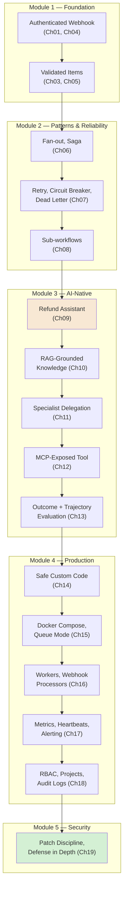
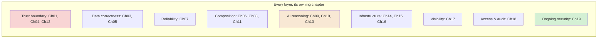
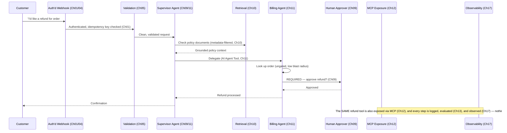
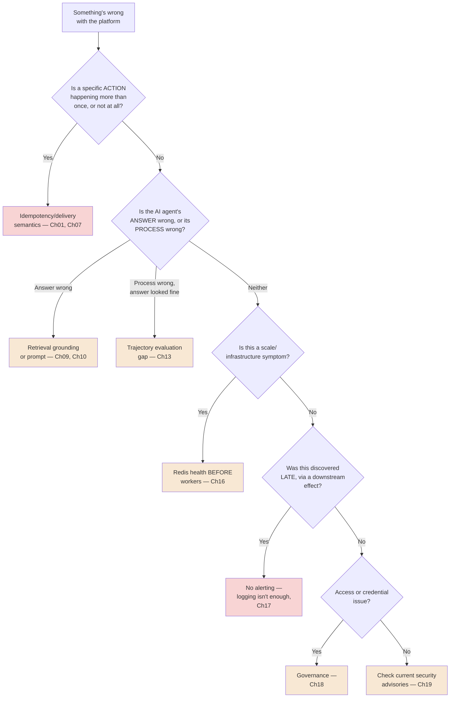
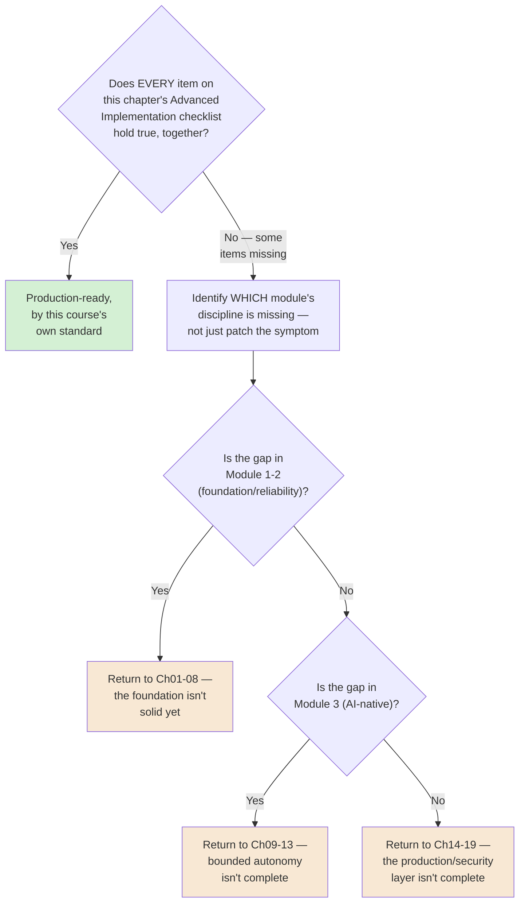

# Chapter 20 — Capstone: Aperture Cloud's Production Automation Platform

## Learning Objectives

By the end of this chapter, you will be able to:

- Describe a complete, production-grade automation platform as a **composition** of every discipline this course taught — not a checklist of isolated features, but layers that stack cleanly onto one another.
- Trace a single real request through every layer of a production system: trigger, validation, AI reasoning, retrieval, multi-agent delegation, human approval, external exposure, deployment, scaling, observability, and governance.
- Apply this course's recurring decision heuristics — engineer vs. business user, blast radius, defense in depth — together, at the scale of a whole platform, not one workflow.
- Diagnose a **cross-cutting production incident** that spans multiple disciplines, using the full diagnostic toolkit this course built chapter by chapter.
- Evaluate your own organization's automation needs against this course's complete framework, and map them onto Aperture Cloud's architecture with no conceptual gap.
- Build a genuinely consequential, human-gated automation end to end, layering every safety mechanism this course introduced rather than relying on any single one.
- Explain what "production-ready" actually means for an AI-native automation platform — a composite standard, not a single checklist item.
- Identify where your own learning should go next, given what this course did, and deliberately didn't, cover.

## Prerequisites

- **Chapters completed:** All of Chapters 01–19. This chapter assumes the entire course, and Volumes 1–4 underneath it.
- **Tools installed:** Everything used across this course — your self-hosted or Cloud n8n instance, Docker Compose (Chapter 15), an MCP client (Chapter 12), and an evaluation dataset framework (Chapter 13).

## Estimated Reading Time

65–80 minutes

## Estimated Hands-on Time

6–10 hours (this is a genuine capstone build, not a single-session exercise)

---

## ⚡ Fast Read

> **Skim time: 5 minutes**

- **What it is:** The complete, working shape of everything this course taught, assembled into one real, coherent platform — Aperture Cloud's actual production automation system, not a list of features that happen to share a chapter number.
- **Why it matters:** No single chapter's discipline is sufficient alone. A perfectly-bounded AI agent (Chapter 09) with no observability (Chapter 17) can still fail silently for days. Perfect RBAC (Chapter 18) with no patch discipline (Chapter 19) is still exploitable. Production-readiness is what happens when every discipline this course taught is present *at once* — and this chapter is where you build that composition directly, not just read about it.
- **Key insight:** The refund assistant that first appeared in Chapter 09 was never rebuilt or reconciled across Chapters 10, 11, 12, or 13 — each new chapter simply added a layer on top of what already existed. That's not a coincidence of how this book was structured. It's proof that this course's disciplines compose correctly, which is exactly what "production-ready" should mean.
- **What you build:** Aperture Cloud's complete platform, end to end — an authenticated webhook, through validated data, through an AI agent grounded in retrieval and backed by specialist sub-agents, gated by a real human-approval step for its one consequential action, exposed safely via MCP, deployed on real infrastructure, scaled correctly, observed honestly, governed properly, and patched against known threats.
- **Jump to:** [Core Concepts](#core-concepts) | [Beginner Implementation](#beginner-implementation) | [Best Practices](#best-practices) | [Mini Project](#mini-project)

---

## Why This Topic Exists

Every chapter in this course deliberately isolated one discipline, taught it in depth, and moved on — that's the only way to actually teach nineteen distinct, real engineering disciplines clearly. But no real production system gets built one isolated discipline at a time, and no real incident respects chapter boundaries. This chapter exists to do what no single prior chapter could: show you, concretely, that these nineteen disciplines aren't nineteen separate tools you reach for situationally — they're nineteen layers that stack, cleanly, onto one coherent platform, and that a real system needs all of them present at once, not any one of them done perfectly in isolation.

There's already direct evidence of this in the course itself, worth naming explicitly rather than leaving implicit: the refund assistant introduced in Chapter 09 gained retrieval in Chapter 10, gained specialist delegation in Chapter 11, gained safe external exposure in Chapter 12, and gained systematic evaluation in Chapter 13 — and at no point did any of those additions require tearing up or reconciling what came before. Chapter 14 through 19 then took that same system — and everything built alongside it since Chapter 01 — and made it genuinely production-grade: safely coded, correctly deployed, properly scaled, honestly observed, properly governed, and patched against real, current threats. This chapter's job is to make that composition explicit, complete, and something you build with your own hands, not just something you've been following along with, chapter by chapter, without ever seeing the whole shape at once.

## Real-World Analogy

Every analogy in this course, until now, deliberately isolated one part of a building — the wiring, the plumbing, the security desk, the fire alarm. This chapter is the final building inspection: the walkthrough where every system has to work correctly **at the same time**, not in isolation. A building can have flawless wiring and still fail inspection if the fire escape doesn't open, or if the wiring and the plumbing were routed through the same wall cavity by two teams who never talked to each other. The inspector isn't re-checking the wiring alone at this point — they're checking that everything holds together as one real, occupiable building.

That's this chapter. Not a review of any single system. The moment everything this course built gets tested together, as one thing.

---

## Core Concepts

### Platform Architecture

**Technical definition:** The whole-system view of an automation deployment — not one workflow, but the complete, composed set of workflows, infrastructure, and governance controls that together constitute a production capability.

**Plain English:** Zooming out from "one workflow" to "everything this organization actually runs."

**Analogy:** The building's complete blueprint, all systems shown together, not one trade's isolated drawing.

### Composability

**Technical definition:** The property that this course's disciplines can be added incrementally, layer by layer, without requiring earlier layers to be rebuilt or reconciled — directly evidenced by the refund assistant's unbroken thread across Chapters 09–13.

**Plain English:** Each new discipline sits cleanly on top of what's already there, instead of fighting it.

**Analogy:** Well-designed building systems that can each be upgraded independently — new wiring doesn't require re-plumbing the whole building.

> This is worth taking seriously as a real design property, not just a narrative convenience: it's exactly why Chapter 08's modular workflow discipline, Chapter 11's blast-radius principle, and Chapter 18's project-based access control all reinforce each other instead of conflicting. A platform built without composability in mind produces exactly the kind of tangled, retrofitted mess Chapter 08's own Production Issue described.

### Defense in Depth

**Technical definition:** This course's full security posture, synthesized — no single control (an idempotency key, a circuit breaker, a Guardrails check, a human-approval gate, RBAC, patching) is treated as sufficient alone; each is a real, independent layer, and a genuinely secure platform has all of them, not its favorite one.

**Plain English:** Many independent locks, not one really good lock.

**Analogy:** A building's security isn't just the front door lock — it's the lock, the alarm, the cameras, the guard, and the access log, together, so no single failure is catastrophic on its own.

> Directly restated from Chapter 19's own closing lesson, now applied at platform scale: Chapter 01's idempotency, Chapter 07's circuit breakers, Chapter 09's Guardrails and human gates, Chapter 18's RBAC, and Chapter 19's patch discipline are not five separate topics you chose between — they're five layers a genuinely secure platform runs simultaneously.

### The Full Cost Stack

**Technical definition:** Every cost dimension this course introduced, summed: n8n's own execution-based billing (Chapter 01), target-API rate limits and pricing (Chapter 04), LLM token cost (Chapter 09), embedding and vector-store cost (Chapter 10), multi-agent cost multiplication (Chapter 11), self-hosted infrastructure cost (Chapter 15–16), and Enterprise-tier feature gating (Chapter 18–19).

**Plain English:** The real, total cost of running a production automation platform — not any one line item.

**Analogy:** A building's true operating cost — not just rent, but utilities, staffing, insurance, and maintenance, all together.

### Production Readiness

**Technical definition:** A composite standard — a system is production-ready only when reliability (Module 2), correctness at the AI layer (Module 3), and operational discipline (Module 4–5) are **all** true simultaneously, not when any one of them is done exceptionally well.

**Plain English:** Not a single gate to pass — an "and," not an "or," across everything this course taught.

**Analogy:** The final building inspection, restated — passing the wiring inspection alone doesn't get you occupancy.

### Blast Radius at Platform Scale

**Technical definition:** Chapters 09 and 11's blast-radius principle, extended from one agent's tool grants to the **sum** of every workflow, every agent, and every exposed MCP tool across the entire platform.

**Plain English:** Not "what's the worst this one agent could do," but "what's the worst *anything on this platform* could do, added up."

**Analogy:** Not just one department's security clearance, but the building's entire, aggregate exposure if every department's worst-case failure happened at once.

### Cross-Cutting Incident

**Technical definition:** A production incident whose root cause spans more than one of this course's disciplines — diagnosable only by applying the full toolkit this course built, not any single chapter's debugging guide alone.

**Plain English:** A real problem that doesn't respect chapter boundaries.

**Analogy:** The building failure that turns out to involve both the wiring and the plumbing, together — solvable only by someone who understands both systems, not either one alone.

> This chapter's own Production Issue below is exactly this kind of incident — deliberately, because a genuine capstone should end with the hardest, most realistic kind of problem this course prepares you for, not the easiest.

### The Aperture Cloud Reference Architecture

**Technical definition:** This chapter's concrete deliverable — the complete, named, composed system this course has been building toward since Chapter 01, generalized enough that your own organization's needs map onto it with no conceptual gap.

**Plain English:** The actual, finished thing.

---

## Architecture Diagrams

### Diagram 1 — The Complete Aperture Cloud Platform



### Diagram 2 — Chapter-to-Layer Mapping



## Flow Diagrams

### Diagram 3 — One Real Request, Through the Entire Platform



---

## Beginner Implementation

> **Assembling the foundation layer — Modules 1 and 2.**

**Goal:** Aperture Cloud's "Order Intake Foundation" — the base every later layer builds on.

1. An **authenticated Webhook Trigger** (Chapter 01, Chapter 04) receiving order-related requests, with a real idempotency key check before any side effect.
2. A **validation gate** (Chapter 05) distinguishing missing from malformed data, routing invalid requests to a visible review path, never a silent drop.
3. The request logic split into **sub-workflows** (Chapter 08) — one for validation, one for the eventual action — each with an explicit input contract.
4. A **circuit breaker and dead-letter queue** (Chapter 07) protecting any outbound call this foundation makes.

**What you just built:** Everything this course taught before AI ever entered the canvas — a real, reliable, correctly-bounded foundation, exactly the shape Module 1–2's own low-stakes, reversible discipline described.

---

## Intermediate Implementation

> **Adding the AI-native layer — Module 3 — on top, without touching the foundation.**

**Goal:** Wire the refund assistant thread (Chapters 09–13) onto the foundation, unmodified.

1. The Supervisor Agent (Chapter 11) receives the foundation's validated output as its input — no rework needed on either side.
2. Retrieval (Chapter 10) grounds the agent's policy answers, metadata-filtered per tenant.
3. The Billing specialist's refund tool remains gated behind a real human-approval step (Chapter 09), with Max Iterations bounded independently on every nested agent (Chapter 11).
4. The refund tool is additionally exposed via **MCP** (Chapter 12), authenticated, with its approval gate built into the workflow itself — not dependent on the calling agent.
5. An evaluation dataset (Chapter 13) checks both outcome and trajectory before this layer is trusted in production.

**What to notice:** Nothing in the Beginner Implementation's foundation needed to change. This is Composability, demonstrated directly, not just claimed.

---

## Advanced Implementation

> **Engineering-depth path. The production layer — Modules 4 and 5 — wrapped around everything above.**

**Goal:** Make the whole system in Beginner + Intermediate Implementation genuinely production-grade.

1. **Deploy** the whole platform via Docker Compose with PostgreSQL, a correctly-configured reverse proxy, and `WEBHOOK_URL` set explicitly (Chapter 15).
2. **Scale** with queue mode — workers and a dedicated webhook processor, concurrency tuned deliberately, `EXECUTIONS_MODE` matched exactly on every process (Chapter 16).
3. **Observe** the whole platform: Prometheus metrics, a choreography heartbeat for any independent workflows, and AI-native signal monitoring (iteration ratio, spend ratio) for every agent — all consolidated into one alerting channel (Chapter 17).
4. **Govern** access with Projects and two-tier RBAC, every credential shared correctly (never sprawled), audit logging enabled from day one (Chapter 18).
5. **Secure** it: every webhook authenticated, every community node reviewed, the running version checked against current advisories, a standing monitoring practice in place (Chapter 19).

```text
// This is the actual capstone test — not a code snippet, a real
// verification checklist. Confirm ALL of the following are true
// SIMULTANEOUSLY, not just individually:
//
// [ ] A duplicate webhook delivery causes no duplicate side effect (Ch01)
// [ ] A malformed record is flagged, never silently corrupted (Ch05)
// [ ] A downstream failure retries safely, then circuit-breaks (Ch07)
// [ ] The agent's retrieval is tenant-isolated (Ch10)
// [ ] Every nested agent has its OWN Max Iterations bound (Ch11)
// [ ] The MCP-exposed tool's approval gate holds regardless of caller (Ch12)
// [ ] Trajectory evaluation would catch a "right answer, wrong path" agent (Ch13)
// [ ] Worker concurrency and Redis health are both actively monitored (Ch16)
// [ ] A silently-failing workflow would be alerted, not discovered late (Ch17)
// [ ] No credential is pasted into more than one workflow independently (Ch18)
// [ ] The running version is patched against every CVE Chapter 19 named (Ch19)
//
// A system passing every item on this list is what "production-ready"
// actually means in this course's own terms — not any single line.
```

**The common mistake alongside the correct pattern:**

```text
WRONG: Treat this course's later chapters as upgrades that replace
earlier ones — "now that I have observability, I don't need to worry
as much about idempotency."

RIGHT: Every discipline remains necessary. Observability tells you FASTER
when idempotency fails — it doesn't replace the need for idempotency in
the first place. This is Defense in Depth, applied to the course itself.
```

**How to debug it when it breaks:** Use this chapter's own Debugging Guide below — a genuine, capstone-level diagnostic routing symptom to discipline, because a real incident at this scale rarely announces which chapter's territory it's actually in.

**The production version, where it differs from the learning version:** There isn't one. This **is** the production version — the entire point of this chapter is that everything above is what "production" actually requires, not a simplified stand-in for it.

---

## Production Architecture

This is the complete Aperture Cloud Reference Architecture, stated once, plainly: **a webhook-triggered, idempotency-protected intake layer, feeding validated data into modular sub-workflows with real retry and circuit-breaker discipline, delegating to a hierarchical AI agent system grounded in tenant-isolated retrieval, with its one consequential action gated by a human-approval step that holds regardless of whether the caller is an internal agent or an external MCP client, evaluated on both outcome and trajectory before every production change, deployed on correctly-configured infrastructure, scaled according to real, monitored capacity signals, observed through consolidated alerting that catches silent failures across both centralized and choreographed workflows, governed through project-based access control with a real audit trail, and kept current against a security landscape that never stops moving.**

That sentence is long because production automation is genuinely that composite. No shorter, safer description would be honest.

---

## Best Practices

The single most important rule from each module, synthesized:

1. **Module 1:** Every trigger-action pair needs an explicit idempotency and delivery-semantics decision — never assumed.
2. **Module 2:** Reliability (retry, circuit breaker, dead letter) and modularity (sub-workflows) are not optional polish — they're the difference between a demo and a production system.
3. **Module 3:** Every agent's blast radius is defined by its actual tool grants, and every consequential action needs a gate that holds regardless of caller.
4. **Module 4:** A correctly-deployed, correctly-scaled system with no observability is still one silent failure away from a real incident.
5. **Module 5:** Security is a standing practice, not a one-time hardening pass — this chapter's own list will be out of date by the time you're reading it.

---

## Security Considerations

The complete Defense in Depth stack, named once, together: idempotency keys (Ch01) prevent duplicate consequential actions even when other controls fail; circuit breakers and dead-letter queues (Ch07) contain failure without cascading it; blast-radius-scoped tool grants and human approval gates (Ch09, Ch11) bound what an agent can do even if its reasoning goes wrong; Guardrails (Ch09) and metadata filtering (Ch10) protect against manipulated input and cross-tenant leakage; authenticated, gate-holding MCP exposure (Ch12) protects the boundary to callers you don't control; reviewed community nodes and sandboxed custom code (Ch14) limit what third-party code can do; RBAC, correctly-shared credentials, and audit logging (Ch18) bound and record who can do what; and current patching against a real, moving CVE landscape (Ch19) closes the loop. **No single layer is sufficient. That's the entire point.**

## Cost Considerations

The full cost stack, summed: n8n's own execution-based billing (flat regardless of workflow complexity, Ch01); target-API rate limits and pricing (Ch04); LLM token cost, scaling with iteration count and multiplied across nested agents (Ch09, Ch11); embedding and vector-store cost (Ch10); AI Workflow Builder credits and evaluation-run cost (Ch13); self-hosted infrastructure — compute, Postgres, Redis, and real operational time (Ch15–16); and Enterprise-tier gating for custom roles, audit logging, SSO, and log streaming (Ch18–19). A real production platform's total cost is the sum of all of these, not any single line — budget accordingly, and revisit the total, not just each part, as the platform grows.

## Common Mistakes

Ranked by how costly they've been across this entire course, worst first:

1. **No alerting, only logging** (Ch17) — the single most expensive gap this course documented with a real, 11-day incident.
2. **Leaving a webhook unauthenticated** (Ch01, Ch19) — the specific misconfiguration behind this course's worst-case real CVE escalation.
3. **Outcome-only evaluation for a consequential agent** (Ch13) — passes every test while hiding a real process failure.
4. **Credential sprawl** (Ch18) — makes a routine rotation into a real risk.
5. **Treating any single chapter's discipline as sufficient alone** — this chapter's own central lesson.

## Debugging Guide



## Performance Optimisation

Every performance lever this course introduced, together: tool description clarity reduces agent iterations (Ch09); appropriate top-K balances retrieval quality against cost (Ch10); passing large content by reference, not inline, across agent handoffs (Ch11); the cheapest sufficient scoring method for each evaluation case (Ch13); concurrency tuning before adding worker infrastructure (Ch16); and detection speed for a new security disclosure as a real, measurable metric in its own right (Ch19). None of these matter in isolation as much as they matter together — a fast agent with an unbounded retry loop, or a scaled deployment with a stale credential, is still a slow, or unsafe, platform overall.

---

## Technology Comparison

The complete, final positioning of n8n against every alternative this course named, together:

| Concern | n8n | Best-fit alternative |
|---|---|---|
| Non-technical, guided simplicity | Capable, but not the most guided | Zapier |
| Sophisticated visual branching, non-technical | Capable and more flexible | Make |
| Durable execution over long horizons | Not built for this | Temporal |
| Batch data pipelines at real data-engineering scale | Not built for this | Apache Airflow |
| Code-first automation with full language flexibility | Code node is an escape hatch, not the default | Windmill |
| Visual AI agent orchestration with native MCP support | n8n's own genuine strength | n8n |

The recurring heuristic from Chapter 01, still true at the end of the course: **will this be maintained by an engineer, or a business user?** — now joined by a second, equally load-bearing question this course has earned the right to ask: **does this specific need span multiple domains, require durable execution, or need batch-scale data processing?** — because if it does, the honest answer might not be n8n at all, even after twenty chapters of learning it deeply.

## Decision Framework — Is Your Organization Actually Ready for This?



---

## Real Client Scenario — A Day in Aperture Cloud's Production Platform

On an ordinary Tuesday, Aperture Cloud's platform handled several hundred real customer requests. Most were simple, low-stakes lookups — answered by the Documentation specialist, grounded in retrieval, logged and observed without incident. A handful were refund requests — routed through the Supervisor, verified by the Billing specialist, and for the three that exceeded a routine threshold, genuinely gated behind a real human's approval, visible in the audit log per Chapter 18. One request arrived from an external partner's own tooling via the MCP-exposed refund tool — authenticated, rate-limited, its approval gate holding exactly as it would for an internal caller. Nothing about the day was remarkable, and that's the entire point: a production-ready platform's best day is a quiet one, precisely because every discipline this course taught was doing its job, together, without anyone needing to notice.

---

### Production Issue: The Scaling Event That Almost Went Unnoticed

**Symptoms**

During a genuine traffic spike, Aperture Cloud's platform team, following Chapter 16's own diagnostic tree, added two new workers to handle the load. Within minutes, response times for a subset of requests began climbing — not failing outright, just slowing, in a way that didn't immediately look like anything specific.

**Root Cause**

This is a genuine **cross-cutting incident**, spanning three chapters at once. The new workers were brought up with `EXECUTIONS_MODE=queue` and Redis connection settings that didn't **exactly** match the main process — a real, confirmed, easy-to-half-do configuration gap Chapter 15 and Chapter 16 both explicitly warned about. The mismatched workers weren't picking up queued jobs correctly, so the *existing* workers absorbed more than their fair share — a genuine worker-starvation pattern (Chapter 16), but one that looked, at first glance, like ordinary load-related slowness rather than a specific configuration error.

**How to Diagnose It**

This is exactly where Chapter 17's standing observability discipline earned its place in this platform, not as a nice-to-have but as the thing that actually caught this: the consolidated alerting channel flagged rising backlog depth within one scheduled check cycle — well before any customer-facing impact became severe. Following the same diagnostic order Chapter 16 taught, the team checked Redis health first (confirmed healthy) — which correctly ruled out the "fix Redis first" branch and pointed the investigation toward the workers themselves, where the configuration mismatch was found directly in the new workers' own logs.

**How to Fix It**

```text
BEFORE: Two new workers added under real time pressure during a traffic
spike, with EXECUTIONS_MODE and Redis settings copied imprecisely from
an outdated deployment template.

AFTER: Worker configuration corrected to exactly match the main
process, per Chapter 16's own explicit requirement — and the deployment
template itself updated so the next scaling event can't reproduce the
same mismatch.
```

**How to Prevent It in Future**

This incident is this chapter's own final, deliberate lesson: **no single discipline caught this alone.** Chapter 16's diagnostic tree correctly ruled out a Redis problem. Chapter 15's configuration knowledge explained what had actually gone wrong. Chapter 17's standing observability practice was what surfaced it in time to matter at all — without it, this would have been a slow, confusing, customer-facing degradation discovered reactively, not a five-minute fix caught proactively. **This is what this entire course has been building toward: not any one chapter being excellent, but all of them being present, together, when it actually counts.**

---

## Exercises

1. **(30 min)** Map your own organization's (or a hypothetical company's) automation needs onto Diagram 1 — which layers do you already have, and which are genuinely missing?
2. **(60 min)** Walk through this chapter's Advanced Implementation checklist against a workflow you built earlier in this course, honestly marking each item true or false.
3. **(45 min)** For three real, past incidents (from this course's own Production Issues), identify whether each was actually cross-cutting, or genuinely confined to one discipline.
4. **(90 min)** Build the Beginner + Intermediate Implementation's combined system — foundation plus AI-native layer — and confirm the foundation needed no changes.
5. **(60 min)** Design (on paper) your own version of this chapter's cross-cutting Production Issue, spanning at least two disciplines from different modules.

## Quiz

**1. What does "Composability" mean in this chapter's specific terms, and what real evidence from this course supports it?**
> That disciplines can be added layer by layer without requiring earlier layers to be rebuilt — evidenced directly by the refund assistant thread running unbroken across Chapters 09 through 13.

**2. Why is Production Readiness described as a composite standard rather than a checklist?**
> Because it requires multiple disciplines to be true *simultaneously* — passing any single discipline exceptionally well (e.g., perfect RBAC) doesn't compensate for a gap in another (e.g., no patch discipline).

**3. What's a cross-cutting incident, and why does this chapter's own Production Issue qualify as one?**
> An incident whose root cause spans more than one discipline — this chapter's worker-configuration incident required Chapter 15's deployment knowledge, Chapter 16's diagnostic order, and Chapter 17's observability together to catch and fix.

**4. According to this chapter's Common Mistakes ranking, what's the single most costly gap this course documented?**
> No alerting, only logging (Chapter 17) — grounded in a real, documented 11-day silent failure.

**5. What's the difference between Chapter 09/11's blast radius and this chapter's "blast radius at platform scale"?**
> Chapter 09/11 scoped blast radius to one agent's tool grants. This chapter sums it across every workflow, agent, and exposed MCP tool on the entire platform.

**6. Why does this chapter argue that later chapters don't replace earlier ones?**
> Because each discipline addresses a different failure mode — observability (Ch17) tells you faster when idempotency (Ch01) fails, but doesn't replace the need for idempotency itself. This is Defense in Depth applied to the course's own structure.

**7. What are the two questions this chapter says should jointly determine whether n8n is the right tool, at the end of the course?**
> Will this be maintained by an engineer or a business user (Chapter 01's original heuristic), and does this specific need span multiple domains, require durable execution, or need batch-scale processing (this chapter's added question).

**8. In this chapter's Production Issue, what specifically did Chapter 16's diagnostic tree correctly rule out, even though it didn't find the actual root cause?**
> A Redis health problem — checking Redis first (per Chapter 16's own confirmed order) came back healthy, correctly pointing the investigation toward the workers themselves instead.

**9. What is the Full Cost Stack, and why does this chapter argue for summing it rather than looking at any single line?**
> Every cost dimension introduced across the course — execution billing, API costs, token cost, vector-store cost, infrastructure, and Enterprise-tier gating — summed, because a real platform's total cost is genuinely the sum of all of these, not any single part.

**10. What's this chapter's own answer to "what does production-ready actually mean"?**
> A composite standard where every discipline this course taught is present and working together at once — not any single chapter's discipline done exceptionally well in isolation.

## Mini Project

**Aperture Cloud's Composed Foundation (3–4 hours)**

- [ ] The Beginner Implementation's foundation layer (authenticated, idempotent, validated, modular, reliable) built and verified.
- [ ] The Intermediate Implementation's AI-native layer wired on top, with no changes required to the foundation.
- [ ] A written note documenting, concretely, why no foundation changes were needed — direct evidence of Composability.

## Production Project

**The Complete Aperture Cloud Platform (2–4 days)**

This is this course's final, complete build — the real capstone.

- [ ] Every item on this chapter's Advanced Implementation checklist, built and verified true, simultaneously, on one real deployment.
- [ ] The full request flow from Diagram 3, working end to end, with real evidence (execution logs, screenshots) at every step.
- [ ] A deliberate reproduction of this chapter's cross-cutting Production Issue, diagnosed using the correct discipline order (Ch16's tree, Ch17's observability), then fixed.
- [ ] A complete, written production-readiness report (500–800 words) for your own platform: which of this chapter's checklist items are genuinely true, which are gaps, and a concrete, prioritized plan — using this chapter's Decision Framework — for closing them.
- [ ] A written reflection on this course as a whole: which discipline, in your own experience building this capstone, turned out to matter more than you expected going in.

## Key Takeaways

- This course's nineteen disciplines compose — they stack cleanly onto one another, evidenced directly by the refund assistant's unbroken thread across Chapters 09–13.
- Production readiness is a composite standard: every discipline present and working together, not any single one done exceptionally well.
- Defense in Depth means no single control — not idempotency, not a circuit breaker, not RBAC, not patching — is sufficient alone.
- A cross-cutting incident requires the full diagnostic toolkit this course built, not any single chapter's guide in isolation.
- The Full Cost Stack is the sum of every cost dimension this course introduced — budget the total, not any one line.
- Later chapters don't replace earlier ones — they address different failure modes that all still matter, together.
- The recurring "engineer vs. business user" heuristic, joined by "does this need durable execution or batch scale," together determine whether n8n is even the right tool — honestly, even after learning it this deeply.
- A production-ready platform's best day is a quiet one — precisely because every discipline is doing its job without anyone needing to notice.

## Chapter Summary

| Concept | Key Takeaway |
|---|---|
| Platform Architecture | The whole-system view — every workflow, every layer, together |
| Composability | Disciplines stack without requiring earlier layers to be rebuilt |
| Defense in Depth | Many independent layers — no single control is sufficient |
| Production Readiness | A composite standard — every discipline present, simultaneously |
| Blast Radius at Platform Scale | The sum across every agent and exposed tool, not just one |
| Cross-Cutting Incident | Real problems that don't respect chapter boundaries |

## Resources

- This course's own 19 preceding chapters — the complete reference this chapter synthesizes
- Volumes 1–4 of this series — the foundational knowledge this entire volume built on
- [n8n's own official documentation](https://docs.n8n.io) — the current, authoritative source for everything this course taught, since n8n itself moves faster than any book can

## Glossary Terms Introduced

| Term | One-line definition |
|---|---|
| Platform Architecture | The whole-system view of a production automation deployment |
| Composability | Disciplines stacking cleanly without requiring earlier layers to change |
| Defense in Depth | Multiple independent security layers, none sufficient alone |
| Production Readiness | A composite standard requiring every discipline present at once |
| Cross-Cutting Incident | A production incident spanning more than one discipline |

## See Also

| Topic | Related Chapter | Why |
|---|---|---|
| Every prior chapter | Chapters 01–19 | This chapter synthesizes all of them — there is no single chapter this one doesn't depend on |
| Volume 4 | AI Agent Engineering | The bounded-autonomy discipline this entire volume's Autonomy Thread continued directly from |
| Volume 2 | MCP Engineering | The protocol foundation Chapter 12 made concrete, and this platform exposes safely |

---

## Where This Course Goes From Here

You've now built, end to end, a genuinely production-grade, AI-native automation platform — not a demo, and not a single well-built workflow, but a real composition of reliability, intelligence, and operational discipline that would hold up under real, sustained, adversarial conditions. That's not a small thing, and it's worth sitting with for a moment before moving on to whatever's next.

This course made deliberate choices about what to leave out, and it's worth naming them honestly rather than pretending this is the complete picture of automation engineering. **Vector database internals** — this course used n8n's Vector Store nodes as a working abstraction; Volume 6 of this series goes underneath that abstraction, into the databases themselves. **Coding agents** — Volume 7 covers AI systems that write and modify code directly, a genuinely different discipline from the workflow-orchestration focus of this volume. **Enterprise-scale case studies** — this course used Aperture Cloud as a consistent, realistic teaching vehicle, but Volume 12 in this series is dedicated entirely to real, named production case studies at a scale this course's teaching examples deliberately didn't attempt.

More immediately useful than any of those: **n8n itself will keep changing.** Every Currency Note in this course flagged what was fast-moving and what was stable — the fast-moving parts are, by definition, going to drift from what's written here. The disciplines won't. Idempotency will still matter. Blast radius will still matter. Defense in depth will still matter. If you take one thing from this entire course past the specific node names and version numbers, take the discipline of asking, for anything you automate, the questions this book kept returning to: what happens if this runs twice? What's the worst this could do, given exactly what it's been granted? Is anyone actually watching? Those questions outlive any specific platform, including this one.

Build something real with what you've learned. Then go find out what broke, and fix it properly — that's where the actual engineering happens, past the last page of any book.
